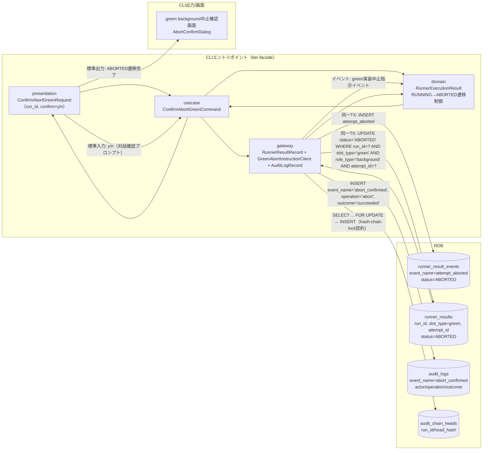
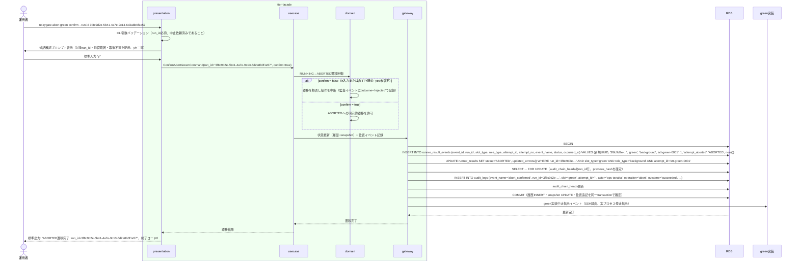

# 対話確認のうえgreen background実行をABORTEDへ遷移させる

## 概要

運用者が、中止依頼済みのgreen background実行について、対話確認（対象・影響範囲・取消不可の明示、y/nの二択）により実プロセスの停止を確認したうえで、green background slot実行状態を明示的にABORTEDへ遷移させる。ABORTEDへの遷移は対話確認による明示的操作でのみ発生する。遷移はrunner_result_eventsへの履歴INSERT（attempt_aborted）とrunner_resultsのsnapshot UPSERTを同一transactionで行い（LR-002 Event/Snapshot併用）、操作は監査イベント（event_name=abort_confirmed、operation=abort、outcome=succeeded/rejected）としてhash-chain lock契約に従いaudit_logsへ記録する。

## データフロー



| レイヤー | データモデル | 変換内容 |
|---------|------------|---------|
| CLI presentation | ConfirmAbortGreenRequest(run_id, confirm) | 対話確認プロンプト（y/n）の標準入力受付、CLI引数解析 |
| CLI usecase | ConfirmAbortGreenCommand | 対話確認結果によるABORTED遷移フロー制御、監査イベント記録 |
| CLI gateway | runner_result_eventsへのINSERT + runner_resultsへのUPDATE（同一transaction）+ audit_logs/audit_chain_headsへの書込み + green実装中止指示イベント送出 | 状態遷移の履歴・snapshot同時永続化、監査イベント記録、green実装への中止指示 |
| Response | ABORTED遷移完了結果 | 実行系譜の追跡対象として確定する |

## 処理フロー



## バリエーション一覧

| バリエーション名 | 値 | 処理内容 | 適用 tier | 適用箇所 |
|----------------|---|---------|----------|---------|
| slot種別 | blue、green | 本UCはslot_type='green'のみを対象とする（blue側は別UC） | tier-facade | ABORTED遷移対象のフィルタ条件 |

## 分岐条件一覧

該当なし（対話確認結果（y/n）による分岐は業務条件ではなくCLI操作フロー制御であり、次節「状態遷移一覧」のトリガー・事前条件として記載する）。

## 計算ルール一覧

該当なし。

## 状態遷移一覧

| 状態モデル | 遷移元 | 遷移先 | トリガー | 事前条件 | 事後処理 | 適用 tier |
|-----------|--------|--------|---------|---------|---------|----------|
| background slot実行状態 | RUNNING | ABORTED | 対話確認のうえgreen background実行をABORTEDへ遷移させる | 中止依頼済み（UC「green background実行の中止を依頼する」完了済み）かつ対話確認でy応答を得ていること（ABORTEDへの遷移は対話確認による明示的操作でのみ発生する） | green実装への中止指示イベント送出。runner_result_eventsへの履歴INSERT（attempt_aborted）とrunner_resultsのsnapshot UPDATEを同一transactionで実行し、監査イベント（abort_confirmed、operation=abort、outcome=succeeded/rejected）をhash-chain lock契約に従い記録する | tier-facade |

## 関連 RDRA モデル

| モデル種別 | 要素名 | 関連 |
|-----------|--------|------|
| 業務 | 実行制御業務 | このUCが属する業務 |
| BUC | green中止フロー | このUCを含むBUC |
| アクター | 運用者 | 操作するアクター |
| 情報 | Runner実行結果（started-at.txt/stdout.log/stderr.log/exitcode.txt） | 更新する情報（履歴+snapshot併用） |
| 状態 | background slot実行状態 | RUNNING→ABORTEDへ遷移させる（状態は6値: STARTING/RUNNING/SUCCEEDED/FAILED/UNKNOWN/ABORTED） |
| 条件 | なし | - |
| 外部システム | green実装 | 連携する外部システム（中止指示イベント送出先） |

## E2E 完了条件（BDD）

### 正常系

```gherkin
Feature: 対話確認のうえgreen background実行をABORTEDへ遷移させる

  Scenario: 対話確認でyを応答しABORTEDへ遷移する
    Given execution_specsテーブルにrun_id "3f8c9d2e-5b41-4a7e-9c13-6d2a8b0f1e57"、job_id "daily-settlement"の行が存在する
    And slot_execution_specsテーブルに(run_id "3f8c9d2e-5b41-4a7e-9c13-6d2a8b0f1e57", slot_type "green")、host "green-host-01"、exec_user "batchuser"の行が存在する
    And runner_resultsテーブルに(run_id "3f8c9d2e-5b41-4a7e-9c13-6d2a8b0f1e57", slot_type "green", role_type "background", attempt_id "att-green-0001")、attempt_no 1、status "RUNNING"の行が存在する
    And run_id "3f8c9d2e-5b41-4a7e-9c13-6d2a8b0f1e57" は中止依頼済み（audit_logsにevent_id "9c1b5a07-3e64-4f28-b7d0-812a4c6e9f35" のevent_name="abort_requested"の行が存在し、audit_chain_headsのrun_id行がhead_event_id="9c1b5a07-3e64-4f28-b7d0-812a4c6e9f35"を保持している）
    When 環境変数RELAYGATE_OPERATOR="ops-tanaka"の下で運用者が `relaygate abort green confirm --run-id 3f8c9d2e-5b41-4a7e-9c13-6d2a8b0f1e57` を実行し対話確認で "y" と応答する
    Then 終了コード 0 で終了する
    And runner_resultsの(run_id "3f8c9d2e-5b41-4a7e-9c13-6d2a8b0f1e57", slot_type "green", role_type "background", attempt_id "att-green-0001")のstatusが "ABORTED" に更新される
    And runner_result_eventsテーブルに同一transactionでevent_name="attempt_aborted"、status="ABORTED"の行が1件追加される
    And audit_logsテーブルにevent_name="abort_confirmed"、operation="abort"、outcome="succeeded"、actor="ops-tanaka"、run_id="3f8c9d2e-5b41-4a7e-9c13-6d2a8b0f1e57"、slot="green"、attempt_id="-"、schema_version="1.0"の行が1件追加され、previous_hashには直前のチェーン先頭（event_id "9c1b5a07-3e64-4f28-b7d0-812a4c6e9f35" のevent_hash）が設定される
    And 標準出力に "ABORTED遷移完了: run_id=3f8c9d2e-5b41-4a7e-9c13-6d2a8b0f1e57" が出力される
```

### 異常系

```gherkin
  Scenario: 対話確認でnを応答し遷移を中断する
    Given runner_resultsテーブルに(run_id "3f8c9d2e-5b41-4a7e-9c13-6d2a8b0f1e57", slot_type "green", role_type "background", attempt_id "att-green-0001")、status "RUNNING"の中止依頼済みの行が存在する（execution_specs・slot_execution_specsの親行を含む）
    When 運用者「ops-tanaka」が `relaygate abort green confirm --run-id 3f8c9d2e-5b41-4a7e-9c13-6d2a8b0f1e57` を実行し対話確認で "n" と応答する
    Then 終了コード 1 で終了する
    And runner_resultsの該当行のstatusは "RUNNING" のまま変化しない
    And audit_logsテーブルにevent_name="abort_confirmed"、operation="abort"、outcome="rejected"の行が1件追加される
    And 標準エラーに "中止操作を取り消しました: run_id=3f8c9d2e-5b41-4a7e-9c13-6d2a8b0f1e57" が出力される

  Scenario: 非TTY環境で--yesフラグ未指定のためエラー終了する
    Given runner_resultsテーブルに(run_id "3f8c9d2e-5b41-4a7e-9c13-6d2a8b0f1e57", slot_type "green", role_type "background", attempt_id "att-green-0001")、status "RUNNING"の中止依頼済みの行が存在する（execution_specs・slot_execution_specsの親行を含む）
    And 非TTY（バッチ実行）環境である
    When 運用者「ops-tanaka」が `relaygate abort green confirm --run-id 3f8c9d2e-5b41-4a7e-9c13-6d2a8b0f1e57` を対話確認プロンプトなしで実行する
    Then 終了コード 2 で終了する
    And 標準エラーに "対話確認が必要です。非TTY環境では --yes フラグを指定してください" が出力される
    And runner_resultsの該当行のstatusは "RUNNING" のまま変化しない

  Scenario: 対象slotがforeground roleのため状態を変更せずエラー終了する
    Given execution_specsテーブルにrun_id "3f8c9d2e-5b41-4a7e-9c13-6d2a8b0f1e57" の行と、slot_execution_specsテーブルに(run_id "3f8c9d2e-5b41-4a7e-9c13-6d2a8b0f1e57", slot_type "green")の行が存在する
    And runner_resultsテーブルに(run_id "3f8c9d2e-5b41-4a7e-9c13-6d2a8b0f1e57", slot_type "green", role_type "foreground", attempt_id "att-green-0001")、status "RUNNING"の行のみが存在する（GREEN_MODE=foreground で起動された run であり、role_type "background" の行は存在しない）
    When 運用者「ops-tanaka」が `relaygate abort green confirm --run-id 3f8c9d2e-5b41-4a7e-9c13-6d2a8b0f1e57` を実行する
    Then 終了コード 1 で終了する
    And runner_resultsの(run_id "3f8c9d2e-5b41-4a7e-9c13-6d2a8b0f1e57", slot_type "green", role_type "foreground", attempt_id "att-green-0001")のstatusは "RUNNING" のまま変化せず、runner_result_eventsへの履歴INSERTも発生しない
    And 標準エラーに "中止対象のbackground実行が存在しません: run_id=3f8c9d2e-5b41-4a7e-9c13-6d2a8b0f1e57 slot=green（対象slotのmodeがforegroundまたはoffです）" が出力される

  Scenario: 対象slotのmodeがoffのため状態を変更せずエラー終了する
    Given execution_specsテーブルにrun_id "3f8c9d2e-5b41-4a7e-9c13-6d2a8b0f1e57" の行が存在する
    And slot_execution_specsテーブルに(run_id "3f8c9d2e-5b41-4a7e-9c13-6d2a8b0f1e57", slot_type "blue")の行のみが存在し、slot_type "green" の行は存在しない（GREEN_MODE=off で確定済み）
    And runner_resultsテーブルにrun_id "3f8c9d2e-5b41-4a7e-9c13-6d2a8b0f1e57" かつ slot_type "green" の行が存在しない
    When 運用者「ops-tanaka」が `relaygate abort green confirm --run-id 3f8c9d2e-5b41-4a7e-9c13-6d2a8b0f1e57` を実行する
    Then 終了コード 1 で終了する
    And runner_results・runner_result_eventsのいかなる行も変更・追加されない
    And 標準エラーに "中止対象のbackground実行が存在しません: run_id=3f8c9d2e-5b41-4a7e-9c13-6d2a8b0f1e57 slot=green（対象slotのmodeがforegroundまたはoffです）" が出力される
```

## ティア別仕様

- [tier-facade](tier-facade.md)

### 統合 API Spec

- [CLI コマンド契約](../../../_cross-cutting/api/cli-command-contract.yaml)（全 UC 統合、CLI/ファイル/DB契約の正本）
- [監査イベント契約](../../../_cross-cutting/api/audit-event-contract.yaml)（abort_confirmedのフィールド定義・hash-chain lock契約の正本）
