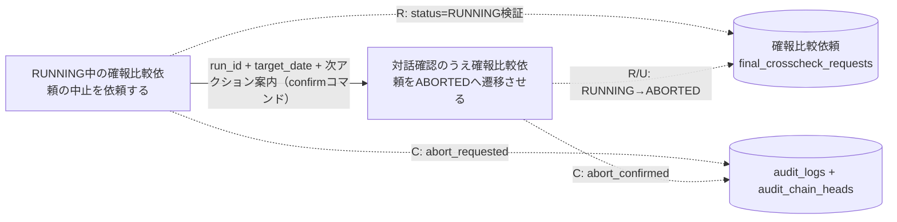
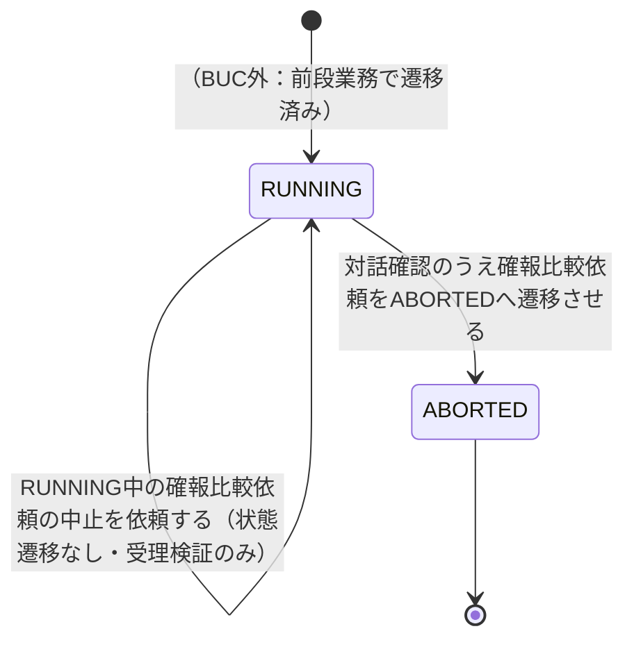

# 確報比較中止フロー

## 概要

RUNNING中の確報比較依頼（E-005, AG-004）を、運用者が「依頼」→「対話確認」の二段階でABORTED状態へ明示的に遷移させるBUC。確報クロスチェックはリリース判断の正本となるため対話確認を必須とし、実際の状態遷移（RUNNING→ABORTED）は後段UCのみが行う。監査イベントは両UCが記録する（依頼UC=abort_requested、対話確認UC=abort_confirmed。いずれもoperation=abort、フィールドはactor/operation/outcomeに統一）。

## 所属 UC 一覧

| UC名 | アクター | 主な操作 | 関連情報 |
|------|---------|---------|---------|
| [RUNNING中の確報比較依頼の中止を依頼する](RUNNING中の確報比較依頼の中止を依頼する/spec.md) | 運用者 | RUNNING中の確報比較依頼について中止を発意し、中止依頼可能な状態（RUNNING）であることを検証・受理する（状態遷移は発生させない）。受理・拒否を監査イベント（abort_requested）として記録 | 確報比較依頼、audit_logs |
| [対話確認のうえ確報比較依頼をABORTEDへ遷移させる](対話確認のうえ確報比較依頼をABORTEDへ遷移させる/spec.md) | 運用者 | 対話確認（y/n、非TTY時は--yes必須）を経てRUNNING→ABORTEDへ明示的に遷移させ、監査イベント（abort_confirmed）を記録する | 確報比較依頼、audit_logs |

## UC 横断データフロー

前UCが受理した中止依頼（run_id・target_date・状態確認結果）を運用者が引き継ぎ、後UCの対話確認コマンドへ入力する。DB上は同一の確報比較依頼レコード（final_crosscheck_requests）を両UCが参照し、状態の更新（RUNNING→ABORTED。WHERE status='RUNNING'の条件付きUPDATEで競合検知）は後UCのみが行う。監査イベントは両UCがaudit_logsへ追記し、追記時はaudit_chain_headsのrun_id行を排他ロックして直列化する（hash-chain lock契約）。

### データフロー図

### 情報 CRUD マトリクス

| 情報名 | RUNNING中の確報比較依頼の中止を依頼する | 対話確認のうえ確報比較依頼をABORTEDへ遷移させる |
|--------|:-----------------------:|:--------------------------------------------:|
| 確報比較依頼（final_crosscheck_requests） | R | R, U |
| audit_logs（+ audit_chain_heads） | C（abort_requested） | C（abort_confirmed） |

## 状態遷移全体図

### 状態遷移 UC マッピング

| 状態モデル | 遷移元 | 遷移先 | 担当 UC |
|-----------|--------|--------|--------|
| 確報比較依頼状態 | - | - | [RUNNING中の確報比較依頼の中止を依頼する](RUNNING中の確報比較依頼の中止を依頼する/spec.md)（状態遷移は発生させず、RUNNING状態の確認と監査イベントabort_requestedの記録のみ行う） |
| 確報比較依頼状態 | RUNNING | ABORTED | [対話確認のうえ確報比較依頼をABORTEDへ遷移させる](対話確認のうえ確報比較依頼をABORTEDへ遷移させる/spec.md)（対話確認による明示的操作でのみ遷移） |

## BUC 内共有条件一覧

| 条件名 | 条件の説明 | 適用 UC |
|--------|----------|--------|
| 確報比較依頼状態 | 対象の確報比較依頼.statusがRUNNINGであることを判定基盤とする条件。「依頼」UCでは受理可否の検証に、「対話確認」UCではUPDATE時のWHERE句条件（更新件数0=競合検知）に、それぞれ適用される | RUNNING中の確報比較依頼の中止を依頼する, 対話確認のうえ確報比較依頼をABORTEDへ遷移させる |

## BUC 内共有バリエーション一覧

| バリエーション名 | 値 | 適用 UC |
|----------------|---|--------|
| クロスチェック種別 | 確報クロスチェック | RUNNING中の確報比較依頼の中止を依頼する, 対話確認のうえ確報比較依頼をABORTEDへ遷移させる |
