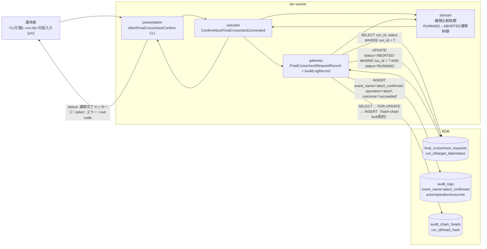
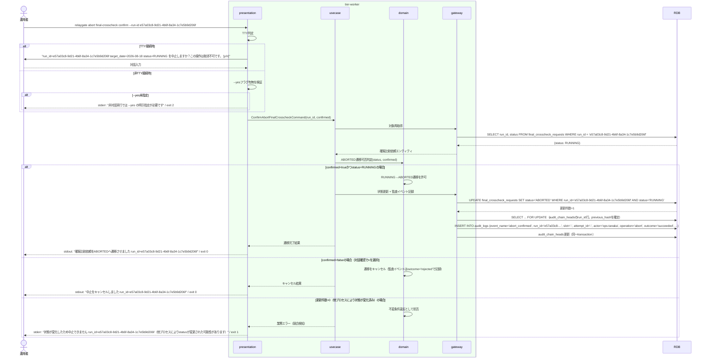

# 対話確認のうえ確報比較依頼をABORTEDへ遷移させる

## 概要

前UC「RUNNING中の確報比較依頼の中止を依頼する」で中止依頼を受理したRUNNING中の確報比較依頼（E-005, AG-004）について、運用者の対話確認（y/nの二択）を経て、ABORTED状態へ明示的に遷移させるUC。ABORTEDへの遷移は対話確認による明示的操作でのみ発生する。確報クロスチェックはリリース判断の正本となるため、対話確認は省略できず、非TTY実行時は`--yes`フラグの明示指定を必須とする。遷移・中断は監査イベント（event_name=abort_confirmed、operation=abort、outcome=succeeded/rejected）としてhash-chain lock契約に従いaudit_logsへ記録する。

## データフロー



| レイヤー | データモデル | 変換内容 |
|---------|------------|---------|
| CLI presentation | run_id、--yesフラグ、対話入力(y/n) | CLI引数解析 + TTY判定（非TTYで--yes未指定はバリデーションエラー） → ConfirmAbortFinalCrosscheckCommand 変換 |
| usecase | ConfirmAbortFinalCrosscheckCommand | 対象の再取得（statusがRUNNINGであることの再確認） |
| domain | 確報比較依頼（AG-004） | RUNNING→ABORTEDへの明示的遷移制御。RUNNING以外からの遷移は不変条件違反として拒否する |
| gateway | final_crosscheck_requests への UPDATE + audit_logs / audit_chain_heads への同一transaction書込み | 楽観的な条件付きUPDATE（WHERE status='RUNNING'）による整合性保証と監査イベント記録 |
| stdout/stderr | 遷移完了メッセージ／エラーメッセージ | ABORTEDへの遷移完了、またはキャンセル・エラーの通知 |

## 処理フロー



## バリエーション一覧

| バリエーション名 | 値 | 処理内容 | 適用 tier | 適用箇所 |
|----------------|---|---------|----------|---------|
| クロスチェック種別 | 確報クロスチェック | 対象は確報比較依頼（final_crosscheck_requests）に限定する | tier-worker | ConfirmAbortFinalCrosscheckCommand |

## 分岐条件一覧

| 条件名 | 判定ルール | 適用 tier | 適用箇所 | BDD Scenario |
|--------|----------|----------|---------|-------------|
| 確報比較依頼状態 | UPDATE時にWHERE句でstatus='RUNNING'を条件とし、更新件数が0の場合は他プロセスによる状態変化とみなし業務エラーとする | tier-worker | ConfirmAbortFinalCrosscheckCommand | 対話確認のうえABORTEDへ遷移する / 状態変化による競合を検知して拒否する |
| 対話確認結果 | TTY接続時はy/nの入力を受け、yのみ遷移を実行する。非TTY接続時は--yesフラグの明示指定がなければバリデーションエラーとする | tier-worker | AbortFinalCrosscheckConfirm CLI | 非TTY実行時に--yes未指定でエラーとする |

## 計算ルール一覧

該当なし（本UCは状態遷移の条件判定のみで計算ルールを持たない）

## 状態遷移一覧

| 状態モデル | 遷移元 | 遷移先 | トリガー | 事前条件 | 事後処理 | 適用 tier |
|-----------|--------|--------|---------|---------|---------|----------|
| 確報比較依頼状態 | RUNNING | ABORTED | 対話確認のうえ確報比較依頼をABORTEDへ遷移させる | 運用者の対話確認（y）または--yesフラグ指定、かつUPDATE時点でstatus='RUNNING'であること（ABORTEDへの遷移は対話確認による明示的操作でのみ発生する） | 監査イベント（abort_confirmed、operation=abort、outcome=succeeded/rejected）をhash-chain lock契約に従いaudit_logsへ記録する | tier-worker |

## 関連 RDRA モデル

| モデル種別 | 要素名 | 関連 |
|-----------|--------|------|
| 業務 | 実行制御業務 | このUCが属する業務 |
| BUC | 確報比較中止フロー | このUCを含むBUC |
| アクター | 運用者 | 操作するアクター |
| 情報 | 確報比較依頼 | ABORTEDへ更新する情報 |
| 状態 | 確報比較依頼状態 | RUNNING→ABORTEDの遷移を扱う状態モデル |
| 条件 | 該当なし | - |
| 外部システム | 該当なし | - |

## E2E 完了条件（BDD）

### 正常系

```gherkin
Feature: 対話確認のうえ確報比較依頼をABORTEDへ遷移させる

  Scenario: 対話確認(y)によりABORTEDへ遷移する
    Given execution_specsテーブルにrun_id="e57a03c8-9d21-4b6f-8a34-1c7e5b9d206f"、job_id="daily-settlement"の行が存在する
    And final_crosscheck_requestsテーブルにrun_id="e57a03c8-9d21-4b6f-8a34-1c7e5b9d206f"、target_date="2026-08-18"、status="RUNNING"の行が存在する
    And audit_logsにevent_id="9c1b5a07-3e64-4f28-b7d0-812a4c6e9f35"のevent_name="abort_requested"の行が存在し、audit_chain_headsのrun_id="e57a03c8-9d21-4b6f-8a34-1c7e5b9d206f"行がhead_event_id="9c1b5a07-3e64-4f28-b7d0-812a4c6e9f35"を保持している
    When 環境変数RELAYGATE_OPERATOR="ops-tanaka"の下で運用者が relaygate abort final-crosscheck confirm --run-id e57a03c8-9d21-4b6f-8a34-1c7e5b9d206f を実行し対話確認で "y" を入力する
    Then 確報比較依頼「e57a03c8-9d21-4b6f-8a34-1c7e5b9d206f」のstatusがABORTEDへ更新される
    And 標準出力に "確報比較依頼をABORTEDへ遷移させました run_id=e57a03c8-9d21-4b6f-8a34-1c7e5b9d206f" が出力され、終了コード0で終了する
    And audit_logsテーブルにevent_name="abort_confirmed"、operation="abort"、outcome="succeeded"、actor="ops-tanaka"、run_id="e57a03c8-9d21-4b6f-8a34-1c7e5b9d206f"、slot="-"、attempt_id="-"、schema_version="1.0"の行が1件追加され、previous_hashには直前のチェーン先頭（event_id="9c1b5a07-3e64-4f28-b7d0-812a4c6e9f35"のevent_hash）が設定される

  Scenario: 非TTYバッチ実行で--yesフラグを指定してABORTEDへ遷移する
    Given execution_specsテーブルにrun_id="e57a03c8-9d21-4b6f-8a34-1c7e5b9d206f"の行が存在する
    And final_crosscheck_requestsテーブルにrun_id="e57a03c8-9d21-4b6f-8a34-1c7e5b9d206f"、target_date="2026-08-18"、status="RUNNING"の行が存在する
    When 非TTY環境で relaygate abort final-crosscheck confirm --run-id e57a03c8-9d21-4b6f-8a34-1c7e5b9d206f --yes を実行する
    Then 確報比較依頼「e57a03c8-9d21-4b6f-8a34-1c7e5b9d206f」のstatusがABORTEDへ更新され、終了コード0で終了する
```

### 異常系

```gherkin
  Scenario: 対話確認で拒否(n)した場合は遷移させない
    Given final_crosscheck_requestsテーブルにrun_id="e57a03c8-9d21-4b6f-8a34-1c7e5b9d206f"、status="RUNNING"の行が存在する（execution_specsの親行を含む）
    When 運用者「ops-tanaka」が relaygate abort final-crosscheck confirm --run-id e57a03c8-9d21-4b6f-8a34-1c7e5b9d206f を実行し対話確認で "n" を入力する
    Then 確報比較依頼「e57a03c8-9d21-4b6f-8a34-1c7e5b9d206f」のstatusはRUNNINGのまま変化せず、標準出力に "中止をキャンセルしました run_id=e57a03c8-9d21-4b6f-8a34-1c7e5b9d206f" が出力され、終了コード0で終了する
    And audit_logsテーブルにevent_name="abort_confirmed"、operation="abort"、outcome="rejected"の行が1件追加される

  Scenario: 非TTYバッチ実行で--yes未指定の場合はエラーとする
    Given final_crosscheck_requestsテーブルにrun_id="e57a03c8-9d21-4b6f-8a34-1c7e5b9d206f"、status="RUNNING"の行が存在する（execution_specsの親行を含む）
    When 非TTY環境で relaygate abort final-crosscheck confirm --run-id e57a03c8-9d21-4b6f-8a34-1c7e5b9d206f を--yesフラグなしで実行する
    Then 標準エラーに "非対話実行では --yes の明示指定が必要です" が出力され、終了コード2で終了する
    And 確報比較依頼「e57a03c8-9d21-4b6f-8a34-1c7e5b9d206f」のstatusはRUNNINGのまま変化しない

  Scenario: 対話確認前に他プロセスにより状態が変化した場合は競合として拒否する
    Given final_crosscheck_requestsテーブルのrun_id="e57a03c8-9d21-4b6f-8a34-1c7e5b9d206f"がstatus="RUNNING"として表示された後、workerによりstatus="FAILED"へ更新済みである（execution_specsの親行を含む）
    When 運用者「ops-tanaka」が relaygate abort final-crosscheck confirm --run-id e57a03c8-9d21-4b6f-8a34-1c7e5b9d206f を実行し対話確認で "y" を入力する
    Then 標準エラーに "状態が変化したため中止できません run_id=e57a03c8-9d21-4b6f-8a34-1c7e5b9d206f" が出力され、終了コード1で終了する
```

## ティア別仕様

- [tier-worker仕様](tier-worker.md)

### 統合 API Spec

- [CLI コマンド契約](../../../_cross-cutting/api/cli-command-contract.yaml)（全 UC 統合。HTTP API は存在しないため OpenAPI ではなく CLI コマンド契約を正本とする）
- [監査イベント契約](../../../_cross-cutting/api/audit-event-contract.yaml)（abort_confirmedのフィールド定義・hash-chain lock契約の正本）
