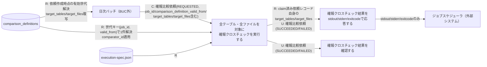
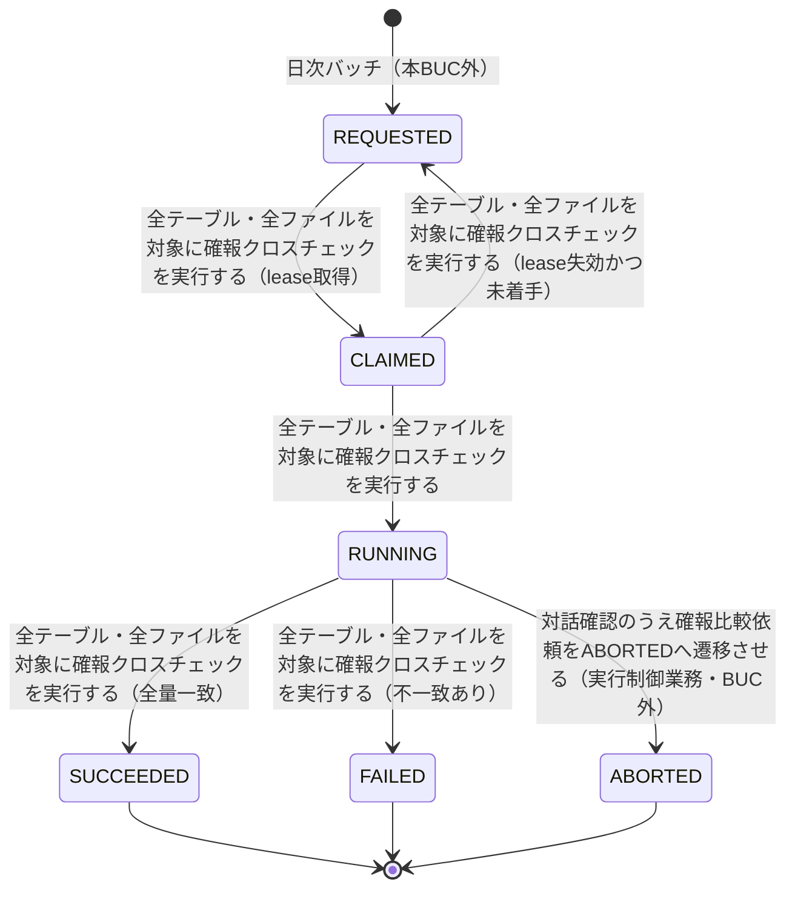

# 確報クロスチェックフロー

## 概要

日次バッチで作成された確報比較依頼（対象日単位・全テーブル・全ファイル対象）をworkerがlease/claim方式で取得し、blue/green実装の全量整合性を比較する。応答は比較結果・差分件数・レポートURIを含めずstdout/stderr/exitcodeの3項目のみに限定してジョブスケジューラへ返し、リリース判断者は状態のみをリリース判断の正本として確認するBUC。

## 所属 UC 一覧

| UC名 | アクター | 主な操作 | 関連情報 |
|------|---------|---------|---------|
| [全テーブル・全ファイルを対象に確報クロスチェックを実行する](全テーブル・全ファイルを対象に確報クロスチェックを実行する/spec.md) | 運用者（トリガーはCronJob） | REQUESTED状態の確報比較依頼をlease/claim取得し、依頼レコード自身のtarget_tables/target_filesが示す全テーブル・全ファイルを対象に、依頼が保持する世代キー（job_id, comparison_definition_valid_from）で解決した比較定義のcomparator_idを適用して整合性比較を実行する | 確報比較依頼, execution-spec.json, 比較定義 |
| [確報クロスチェック結果をstdout/stderr/exitcodeで応答する](確報クロスチェック結果をstdout-stderr-exitcodeで応答する/spec.md) | 運用者（応答先はジョブスケジューラ） | SUCCEEDED/FAILEDへ確定したstatusをexitcode 0/1へ変換し、詳細を含めずジョブスケジューラへ応答する | 確報比較依頼 |
| [確報クロスチェック結果を確認する](確報クロスチェック結果を確認する/spec.md) | リリース判断者 | 対象日を指定して確報比較依頼の状態を照会し、リリース判断の正本として確認する | 確報比較依頼 |

## UC 横断データフロー

確報比較依頼のREQUESTED生成自体は日次バッチ（本BUC外）が担う。日次バッチは対象日・job_id・依頼作成時点に有効期間で解決した世代のcomparison_definition_valid_fromを決定し、該当世代の比較定義（comparison_definitions）からtarget_tables/target_filesを複写してREQUESTED行を作成する。実行UCがlease/claimで確報比較依頼を取得し、依頼が保持する世代キー（job_id, comparison_definition_valid_from）で比較定義を1件解決してcomparator_idを適用し全量比較を行いSUCCEEDED/FAILEDへ確定すると、応答UCがその状態をstdout/stderr/exitcodeの3項目のみに変換してジョブスケジューラへ応答し、並行して確認UCがリリース判断者向けに同じ状態を照会可能にする。応答UCと確認UCはいずれも実行UCが確定した確報比較依頼のstatusを参照するのみで、相互に依存しない。

### データフロー図

### 情報 CRUD マトリクス

| 情報名 | 全テーブル・全ファイルを対象に確報クロスチェックを実行する | 確報クロスチェック結果をstdout/stderr/exitcodeで応答する | 確報クロスチェック結果を確認する |
|--------|:-------:|:-------:|:-------:|
| execution-spec.json | R |  |  |
| 比較定義 | R（依頼が保持する世代キーでcomparator_id解決） |  |  |
| 確報比較依頼 | R/U（lease/claim更新・target参照・結果反映） | R | R |

## 状態遷移全体図

### 状態遷移 UC マッピング

| 状態モデル | 遷移元 | 遷移先 | 担当 UC |
|-----------|--------|--------|--------|
| 確報比較依頼状態 | （新規） | REQUESTED | 日次バッチ（本BUC外。3所属UCには含まれない） |
| 確報比較依頼状態 | REQUESTED | CLAIMED | [全テーブル・全ファイルを対象に確報クロスチェックを実行する](全テーブル・全ファイルを対象に確報クロスチェックを実行する/spec.md) |
| 確報比較依頼状態 | CLAIMED | REQUESTED | [全テーブル・全ファイルを対象に確報クロスチェックを実行する](全テーブル・全ファイルを対象に確報クロスチェックを実行する/spec.md)（lease失効かつ未着手） |
| 確報比較依頼状態 | CLAIMED | RUNNING | [全テーブル・全ファイルを対象に確報クロスチェックを実行する](全テーブル・全ファイルを対象に確報クロスチェックを実行する/spec.md) |
| 確報比較依頼状態 | RUNNING | SUCCEEDED | [全テーブル・全ファイルを対象に確報クロスチェックを実行する](全テーブル・全ファイルを対象に確報クロスチェックを実行する/spec.md) |
| 確報比較依頼状態 | RUNNING | FAILED | [全テーブル・全ファイルを対象に確報クロスチェックを実行する](全テーブル・全ファイルを対象に確報クロスチェックを実行する/spec.md) |

確報クロスチェック結果をstdout/stderr/exitcodeで応答するUC・確報クロスチェック結果を確認するUCはいずれも参照専用であり、確報比較依頼状態を遷移させない。RUNNING→ABORTEDは実行制御業務「確報比較中止フロー」（対話確認による明示的操作のみ）が担当し、本BUCの所属UCではない。

## BUC 内共有条件一覧

条件.tsv・各UCの分岐条件一覧を突合した結果、本BUC内の2つ以上のUCで共有される条件は存在しない。

| 条件名 | 条件の説明 | 適用 UC |
|--------|----------|--------|
| 該当なし | lease失効かつ未着手判定・全量比較判定・比較定義の解決（依頼が保持する世代キー（job_id, comparison_definition_valid_from）による1件解決。該当世代が無い場合はFAILEDへ遷移）は実行UCのみ、確報比較依頼状態（表示切替）は確認UCのみ、status→exitcode変換は応答UCのみに適用される | - |

## BUC 内共有バリエーション一覧

| バリエーション名 | 値 | 適用 UC |
|----------------|---|--------|
| クロスチェック種別 | 確報クロスチェック | 全テーブル・全ファイルを対象に確報クロスチェックを実行する, 確報クロスチェック結果をstdout/stderr/exitcodeで応答する, 確報クロスチェック結果を確認する |
