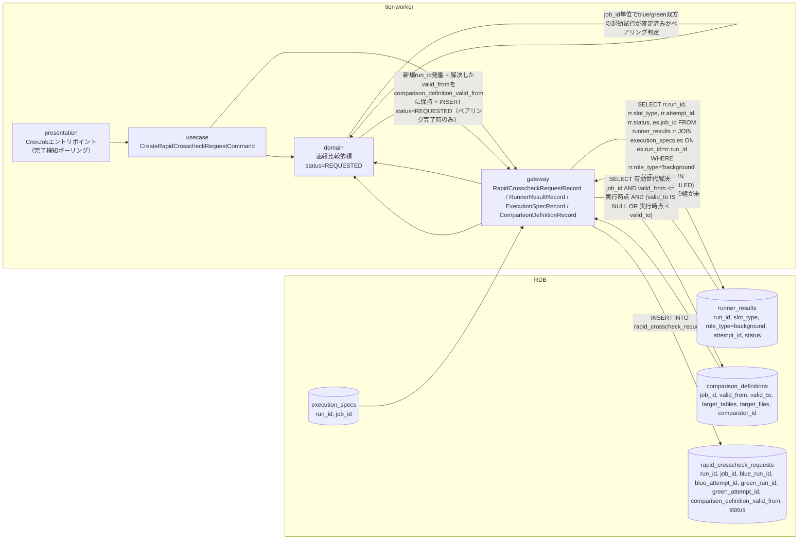
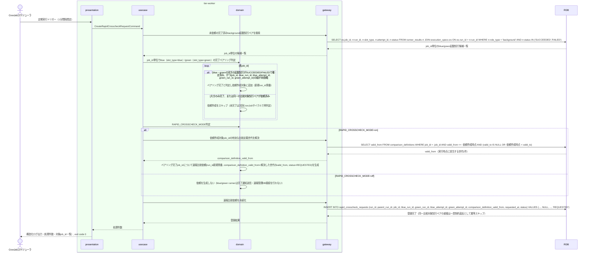

# blue/green runnerの完了通知を受けて速報比較依頼を作成する

## 概要

blue実装・green実装の両background runnerが完了（Runner実行結果のexit_code確定）したジョブについて、job_id単位でblue/green双方のRunner実行結果（role_type=background）がSUCCEEDED/FAILEDで揃ったことを確認したうえで速報比較依頼を新規run_idで作成し、速報比較依頼状態をREQUESTEDへ遷移させるUC。比較対象はblue_run_id/blue_attempt_id/green_run_id/green_attempt_idの4項目で特定する。job_idはrunner_results自体には存在しないため、run_idを介してexecution_specsテーブルからJOINして取得する。依頼作成時には、job_idと依頼作成時点（CronJob実行時点）からcomparison_definitionsの有効な世代（valid_from <= 実行時点、かつ valid_to IS NULL または 実行時点 < valid_to）を1件解決し、そのvalid_fromをcomparison_definition_valid_fromとして依頼に保存する。以降の比較実行はこの保存値で世代固定される（SPEC-012-03）。RAPID_CROSSCHECK_MODEがoffの場合は依頼作成を行わない。

## データフロー



| レイヤー | データモデル | 変換内容 |
|---------|------------|---------|
| worker presentation | CronJobトリガー（引数なし） | 定期実行起点。完了検知ポーリングの開始 |
| worker gateway (read) | runner_results と execution_specs を run_id でJOINしてSELECT（role_type=background, status確定済み, 比較対象試行の組が未依頼） | run_idからjob_idを引き当て、job_id単位でblue（slot_type=blue）・green（slot_type=green）双方のbackground role完了状況を起動試行（attempt_id）単位で抽出 |
| worker domain | 速報比較依頼(run_id新規発番, status=REQUESTED) | job_id単位でblue/green双方のRunner実行結果（role_type=background）がSUCCEEDED/FAILEDで揃っている（ペアリング完了）場合のみ、RAPID_CROSSCHECK_MODE=on の場合に新規run_idでREQUESTED生成。片方のみ完了の場合は生成せず次回サイクルで再判定する。offの場合は生成しない |
| worker gateway (definition) | comparison_definitions への SELECT（job_id + 有効期間条件） | 依頼作成時点に有効な比較定義世代を1件解決し、そのvalid_fromをdomain層へ引き渡す |
| worker gateway (write) | rapid_crosscheck_requests への INSERT | run_id（新規発番）/parent_run_id=NULL/job_id/blue_run_id/blue_attempt_id/green_run_id/green_attempt_id/comparison_definition_valid_from（解決した世代のvalid_from）/requested_at/status=REQUESTEDを新規登録 |

## 処理フロー



## バリエーション一覧

| バリエーション名 | 値 | 処理内容 | 適用 tier | 適用箇所 |
|----------------|---|---------|----------|---------|
| クロスチェック種別 | 速報クロスチェック | 生成する依頼レコードのクロスチェック種別を速報として固定する | tier-worker | 速報比較依頼作成処理 |
| slotモード（BLUE_MODE/GREEN_MODE） | background | background role完了のみを検知対象とする（foreground完了は対象外） | tier-worker | 完了検知ポーリング |
| 比較対象runの構成 | 同一run（blue_run_id=green_run_id）、別run（blue_run_id≠green_run_id） | blueとgreenを同一runの2 slotとして起動した場合はblue_run_idとgreen_run_idが同値になる | tier-worker | 比較対象特定（4項目: blue_run_id/blue_attempt_id/green_run_id/green_attempt_id） |

## 分岐条件一覧

| 条件名 | 判定ルール | 適用 tier | 適用箇所 | BDD Scenario |
|--------|----------|----------|---------|-------------|
| feature flag設定（RAPID_CROSSCHECK_MODE） | onの場合のみ速報比較依頼を新規作成する。offの場合はblue/green runnerからの完了通知送信・速報管理DBへの接続・書込みを行わないため依頼を作成しない | tier-worker | CreateRapidCrosscheckRequestCommand | RAPID_CROSSCHECK_MODE=offのため速報比較依頼を作成しない |
| blue/greenペアリング完了判定 | 同一job_idのblue（slot_type=blue）・green（slot_type=green）双方のRunner実行結果（role_type=background）がSUCCEEDED/FAILEDで確定していること。片方のみ確定・UNKNOWN・ABORTEDの場合は依頼作成をスキップし次回CronJobサイクルで再判定する | tier-worker | CreateRapidCrosscheckRequestCommand | blue/green双方のbackground実行完了で速報比較依頼を新規作成する |
| 重複依頼防止 | (job_id, blue_run_id, blue_attempt_id, green_run_id, green_attempt_id) の組が既にrapid_crosscheck_requestsに存在する場合は作成しない（一意制約で担保） | tier-worker | rapid_crosscheck_requestsへのINSERT | 既に依頼済みの比較対象試行ペアはスキップする |
| 比較定義の解決 | 依頼作成時点でjob_idと有効期間（valid_from <= 実行時点、かつ valid_to IS NULL または 実行時点 < valid_to）からcomparison_definitionsの世代を1件に解決し、そのvalid_fromをcomparison_definition_valid_fromとして依頼に保存する。該当世代が無い場合はエラーとして標準エラーへ記録し当該job_idの依頼を作成しない | tier-worker | CreateRapidCrosscheckRequestCommand（比較定義解決） | 実行時点で有効な比較定義世代のvalid_fromを依頼に保存する |

## 計算ルール一覧

本UCは既存の完了状態を条件抽出するのみで、値の計算・集計は行わない。

| 計算名 | 入力情報 | 計算式/ロジック | 出力情報 | 適用 tier |
|--------|---------|---------------|---------|----------|
| 該当なし | - | - | - | - |

## 状態遷移一覧

| 状態モデル | 遷移元 | 遷移先 | トリガー | 事前条件 | 事後処理 | 適用 tier |
|-----------|--------|--------|---------|---------|---------|----------|
| 速報比較依頼状態 | （新規） | REQUESTED | blue/green runnerの完了通知を受けて速報比較依頼を作成する | 対象job_idについて、blue/green双方のRunner実行結果（role_type=background）がSUCCEEDED/FAILEDで確定済み（ペアリング完了）、かつ同一の比較対象試行ペアが未依頼、かつRAPID_CROSSCHECK_MODE=on | 新規run_idを発番して速報比較依頼レコードを作成しrequested_atを記録（parent_run_id=NULL）。依頼作成時点で有効な比較定義世代を解決しcomparison_definition_valid_fromへ保存する | tier-worker |

## 関連 RDRA モデル

| モデル種別 | 要素名 | 関連 |
|-----------|--------|------|
| 業務 | クロスチェック業務 | このUCが属する業務 |
| BUC | 速報クロスチェックフロー | このUCを含むBUC |
| アクター | 運用者 | 生成された依頼作成画面を参照するアクター（社内・提供者） |
| 情報 | 速報比較依頼 | 新規作成する情報 |
| 情報 | Runner実行結果（started-at.txt/stdout.log/stderr.log/exitcode.txt） | 完了判定の入力情報 |
| 情報 | execution-spec.json | run_idからjob_idを引き当てるためJOIN参照する情報（runner_resultsにはjob_id属性が存在しないため） |
| 情報 | 比較定義 | 依頼作成時点にjob_idと有効期間で1件解決し、解決した世代のvalid_fromをcomparison_definition_valid_fromとして依頼に保存する情報 |
| 状態 | 速報比較依頼状態 | （新規）→REQUESTEDの遷移 |
| 条件 | feature flag設定（BLUE_MODE/GREEN_MODE/RAPID_CROSSCHECK_MODE） | RAPID_CROSSCHECK_MODEによる依頼作成可否判定 |
| 外部システム | blue実装 | blue実装background完了通知イベントの送信元 |
| 外部システム | green実装 | green実装background完了通知イベントの送信元 |

## E2E 完了条件（BDD）

### 正常系

```gherkin
Feature: blue/green runnerの完了通知を受けて速報比較依頼を作成する

  Scenario: blue/green双方のbackground実行完了で速報比較依頼を新規作成する
    Given execution_specs に run_id="3f8c9d2e-5b41-4a7e-9c13-6d2a8b0f1e57", job_id="daily-settlement" の行が存在する
    And slot_execution_specs に (run_id="3f8c9d2e-5b41-4a7e-9c13-6d2a8b0f1e57", slot_type="blue") と (run_id="3f8c9d2e-5b41-4a7e-9c13-6d2a8b0f1e57", slot_type="green") の行が存在する
    And runner_results に (run_id="3f8c9d2e-5b41-4a7e-9c13-6d2a8b0f1e57", slot_type="blue", role_type="background", attempt_id="att-blue-0001", attempt_no=1, status="SUCCEEDED") の行が存在する
    And runner_results に (run_id="3f8c9d2e-5b41-4a7e-9c13-6d2a8b0f1e57", slot_type="green", role_type="background", attempt_id="att-green-0001", attempt_no=1, status="SUCCEEDED") の行が存在する
    And rapid_crosscheck_requests に job_id="daily-settlement" の行が存在しない
    And comparison_definitions に (job_id="daily-settlement", valid_from="2026-08-01T00:00:00+09:00", valid_to=NULL, target_tables="settlement_summary,settlement_detail", target_files="settlement-report.csv", comparator_id="comparator-settlement-v1") の行が存在する
    And 環境変数 RAPID_CROSSCHECK_MODE が "on" である
    And 依頼run_idの発番が "c41d7e08-2b95-4f36-a8d1-5e7c93b204af" を返すよう固定されている
    And CronJob実行時点が "2026-08-17T10:00:00+09:00" である
    When CronJobが `relaygate rapid-crosscheck create` を定期実行する
    Then rapid_crosscheck_requests に (run_id="c41d7e08-2b95-4f36-a8d1-5e7c93b204af", parent_run_id=NULL, job_id="daily-settlement", blue_run_id="3f8c9d2e-5b41-4a7e-9c13-6d2a8b0f1e57", blue_attempt_id="att-blue-0001", green_run_id="3f8c9d2e-5b41-4a7e-9c13-6d2a8b0f1e57", green_attempt_id="att-green-0001", comparison_definition_valid_from="2026-08-01T00:00:00+09:00", status="REQUESTED") の1行が新規作成される

  Scenario: 実行時点で有効な比較定義世代のvalid_fromを依頼に保存する
    Given execution_specs・slot_execution_specs・runner_results に run_id="3f8c9d2e-5b41-4a7e-9c13-6d2a8b0f1e57", job_id="daily-settlement" の blue/green background試行（att-blue-0001 / att-green-0001、いずれもstatus="SUCCEEDED"）一式が存在する
    And comparison_definitions に旧世代 (job_id="daily-settlement", valid_from="2026-07-01T00:00:00+09:00", valid_to="2026-08-01T00:00:00+09:00", comparator_id="comparator-settlement-v1") の行が存在する
    And comparison_definitions に現行世代 (job_id="daily-settlement", valid_from="2026-08-01T00:00:00+09:00", valid_to=NULL, comparator_id="comparator-settlement-v2") の行が存在する
    And rapid_crosscheck_requests に job_id="daily-settlement" の行が存在しない
    And 環境変数 RAPID_CROSSCHECK_MODE が "on" である
    And CronJob実行時点が "2026-08-17T10:00:00+09:00" である
    When CronJobが `relaygate rapid-crosscheck create` を定期実行する
    Then 作成された依頼の comparison_definition_valid_from は現行世代の "2026-08-01T00:00:00+09:00" であり、旧世代の "2026-07-01T00:00:00+09:00" は保存されない

  Scenario: blue側のみ完了しgreen側が未完了の場合は依頼を作成せず次回サイクルまで待機する
    Given execution_specs に run_id="3f8c9d2e-5b41-4a7e-9c13-6d2a8b0f1e57", job_id="daily-settlement" の行と slot_execution_specs の blue/green 行が存在する
    And runner_results に (run_id="3f8c9d2e-5b41-4a7e-9c13-6d2a8b0f1e57", slot_type="blue", role_type="background", attempt_id="att-blue-0001", status="SUCCEEDED") の行が存在する
    And runner_results に (run_id="3f8c9d2e-5b41-4a7e-9c13-6d2a8b0f1e57", slot_type="green", role_type="background", attempt_id="att-green-0001", status="RUNNING") の行が存在する
    And rapid_crosscheck_requests に job_id="daily-settlement" の行が存在しない
    And 環境変数 RAPID_CROSSCHECK_MODE が "on" である
    When CronJobが `relaygate rapid-crosscheck create` を定期実行する
    Then rapid_crosscheck_requests に job_id="daily-settlement" の行はこの実行では作成されない

  Scenario: 既に依頼済みの比較対象試行ペアはスキップする
    Given execution_specs・slot_execution_specs・runner_results に run_id="3f8c9d2e-5b41-4a7e-9c13-6d2a8b0f1e57" の blue/green background試行（att-blue-0001 / att-green-0001、いずれもstatus="FAILED"）一式が存在する
    And rapid_crosscheck_requests に (run_id="c41d7e08-2b95-4f36-a8d1-5e7c93b204af", job_id="daily-settlement", blue_run_id="3f8c9d2e-5b41-4a7e-9c13-6d2a8b0f1e57", blue_attempt_id="att-blue-0001", green_run_id="3f8c9d2e-5b41-4a7e-9c13-6d2a8b0f1e57", green_attempt_id="att-green-0001", status="SUCCEEDED") の行が既に存在する
    When CronJobが `relaygate rapid-crosscheck create` を定期実行する
    Then rapid_crosscheck_requests の行数は変化せず、既存行 run_id="c41d7e08-2b95-4f36-a8d1-5e7c93b204af" は維持される
```

### 異常系

```gherkin
  Scenario: RAPID_CROSSCHECK_MODEがoffの場合は依頼を作成しない
    Given execution_specs・slot_execution_specs・runner_results に run_id="3f8c9d2e-5b41-4a7e-9c13-6d2a8b0f1e57" の blue/green background試行（いずれもstatus="SUCCEEDED"）一式が存在する
    And rapid_crosscheck_requests に job_id="daily-settlement" の行が存在しない
    And 環境変数 RAPID_CROSSCHECK_MODE が "off" である
    When CronJobが `relaygate rapid-crosscheck create` を定期実行する
    Then rapid_crosscheck_requests に行は作成されず、処理件数0件がログに記録される

  Scenario: RDB接続エラー時
    Given RDBへの接続が一時的に失敗する状態である
    When CronJobが `relaygate rapid-crosscheck create` を定期実行する
    Then 標準エラーに接続エラーが記録され、終了コード 1 で終了する
```

## ティア別仕様

- [バックエンドワーカーティア](tier-worker.md)

### 統合 API Spec

- 本プロジェクトはHTTP APIを持たない。コマンド契約は `_cross-cutting/api/cli-command-contract.yaml`（全UC統合、Contract First開発用）を参照
