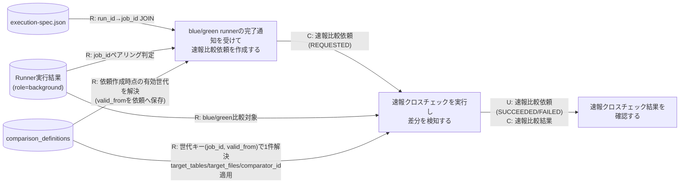
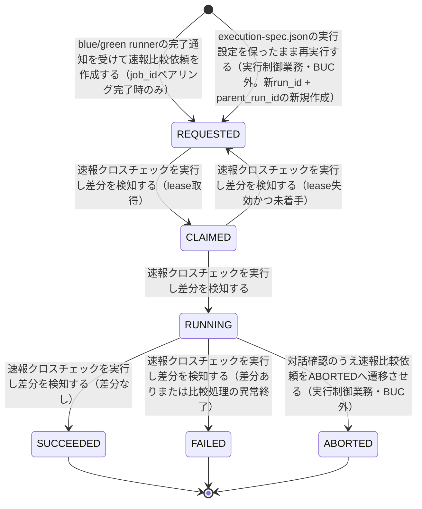

# 速報クロスチェックフロー

## 概要

blue/green双方のbackground runnerが完了したジョブについて、日次の全量比較（確報クロスチェック）を待たずにジョブ単位で早期に差分を検知するBUC。job_id単位でblue・green双方のRunner実行結果（role=background）がSUCCEEDED/FAILEDで揃ったこと（job_idペアリング）を確認したうえで速報比較依頼を作成し、worker（lease/claim方式）が比較を実行し、障害調査担当者が結果を確認する一連の流れを扱う。

## 所属 UC 一覧

| UC名 | アクター | 主な操作 | 関連情報 |
|------|---------|---------|---------|
| [blue/green runnerの完了通知を受けて速報比較依頼を作成する](blue-green runnerの完了通知を受けて速報比較依頼を作成する/spec.md) | 運用者（トリガーはCronJob） | job_id単位でblue/green双方のRunner実行結果（role=background）が確定済みか判定（job_idペアリング）し、RAPID_CROSSCHECK_MODE=onの場合のみ速報比較依頼を新規run_idで作成する。比較対象はblue_run_id/blue_attempt_id/green_run_id/green_attempt_idの4項目で特定する。依頼作成時点で有効な比較定義世代を解決しcomparison_definition_valid_fromへ保存する | execution-spec.json, Runner実行結果, 速報比較依頼, 比較定義 |
| [速報クロスチェックを実行し差分を検知する](速報クロスチェックを実行し差分を検知する/spec.md) | 運用者（トリガーはCronJob） | REQUESTED状態の速報比較依頼をlease/claim取得し、依頼レコードの比較対象4項目で特定した起動試行のblue/green実行結果を、依頼が保持する世代キー（job_id, comparison_definition_valid_from）で解決した比較定義（target_tables/target_files/comparator_id）に従って比較し差分を検知する | 速報比較依頼, Runner実行結果, 速報比較結果, 比較定義 |
| [速報クロスチェック結果を確認する](速報クロスチェック結果を確認する/spec.md) | 障害調査担当者 | job_id/run_id指定で速報比較依頼・速報比較結果を参照する | 速報比較依頼, 速報比較結果 |

## UC 横断データフロー

blue/green runnerの完了通知を受けて速報比較依頼を作成するUCは、Runner実行結果（role=background）をrun_id経由でexecution-spec.jsonとJOINしてjob_idを引き当て、**同一job_idについてblue・green双方の実行結果がSUCCEEDED/FAILEDで揃った場合のみ（job_idペアリング判定）**速報比較依頼を新規run_idのREQUESTEDで生成する。比較対象試行は(blue_run_id, blue_attempt_id, green_run_id, green_attempt_id)で一意に特定し、同一の比較対象試行ペアへの重複依頼はユニーク制約(job_id, blue_run_id, blue_attempt_id, green_run_id, green_attempt_id)で防止する。片方のみ完了の場合は依頼を作成せず、次回CronJobサイクルで再判定する。依頼作成時には、job_idと依頼作成時点から比較定義（comparison_definitions）の有効な世代を1件解決し、そのvalid_fromをcomparison_definition_valid_fromとして依頼に保存する。以降、実行UCが依頼の保持する世代キーで比較定義を再解決し、target_tables/target_files/comparator_idを適用して比較を行い、確認UCが結果を参照する。依頼作成後に比較定義が差し替わっても、当該依頼の比較内容は世代固定のまま変わらない。

### データフロー図

### 情報 CRUD マトリクス

| 情報名 | blue/green runnerの完了通知を受けて速報比較依頼を作成する | 速報クロスチェックを実行し差分を検知する | 速報クロスチェック結果を確認する |
|--------|:-------:|:-------:|:-------:|
| execution-spec.json | R |  |  |
| Runner実行結果（started-at.txt/stdout.log/stderr.log/exitcode.txt） | R | R |  |
| 比較定義 | R（依頼作成時点の有効世代解決） | R（依頼が保持する世代キーで1件解決） |  |
| 速報比較依頼 | C | R/U | R |
| 速報比較結果 |  | C | R |

## 状態遷移全体図

### 状態遷移 UC マッピング

| 状態モデル | 遷移元 | 遷移先 | 担当 UC |
|-----------|--------|--------|--------|
| 速報比較依頼状態 | （新規） | REQUESTED | [blue/green runnerの完了通知を受けて速報比較依頼を作成する](blue-green runnerの完了通知を受けて速報比較依頼を作成する/spec.md)（job_idペアリング完了時のみ生成） |
| 速報比較依頼状態 | REQUESTED | CLAIMED | [速報クロスチェックを実行し差分を検知する](速報クロスチェックを実行し差分を検知する/spec.md) |
| 速報比較依頼状態 | CLAIMED | REQUESTED | [速報クロスチェックを実行し差分を検知する](速報クロスチェックを実行し差分を検知する/spec.md)（lease失効かつ未着手） |
| 速報比較依頼状態 | CLAIMED | RUNNING | [速報クロスチェックを実行し差分を検知する](速報クロスチェックを実行し差分を検知する/spec.md) |
| 速報比較依頼状態 | RUNNING | SUCCEEDED | [速報クロスチェックを実行し差分を検知する](速報クロスチェックを実行し差分を検知する/spec.md) |
| 速報比較依頼状態 | RUNNING | FAILED | [速報クロスチェックを実行し差分を検知する](速報クロスチェックを実行し差分を検知する/spec.md) |

速報クロスチェック結果を確認するUCは参照専用であり、状態遷移を発生させない。RUNNING→ABORTEDは実行制御業務「速報比較中止フロー」（対話確認による明示的操作のみ）が担当する。再実行は同一run_idの差し戻しではなく、実行制御業務「background側リランフロー」が新run_id（parent_run_idで元依頼へ関連付け）の依頼をREQUESTEDで新規作成する。元依頼のレコード・状態・履歴は変更されない。

## BUC 内共有条件一覧

条件.tsv・各UCの分岐条件一覧を突合した結果、本BUC内の2つ以上のUCで共有される条件・解決ルールは次の1件である。そのほかの条件（feature flag設定（RAPID_CROSSCHECK_MODE）／blue-greenペアリング完了判定は作成UCのみ、lease/claim判定・比較判定は実行UCのみ）はいずれか1つのUCでのみ適用される。

| 条件名 | 条件の説明 | 適用 UC |
|--------|----------|--------|
| 比較定義の解決（世代固定） | 依頼作成UCがjob_idと依頼作成時点の有効期間（valid_from <= 実行時点、かつ valid_to IS NULL または 実行時点 < valid_to）でcomparison_definitionsの世代を1件解決し、そのvalid_fromを依頼へ保存する。実行UCは依頼が保持する世代キー（job_id, comparison_definition_valid_from）で同じ世代を1件解決して適用する。該当世代を解決できない場合はいずれのUCもエラーとして処理を進めない | blue/green runnerの完了通知を受けて速報比較依頼を作成する, 速報クロスチェックを実行し差分を検知する |

## BUC 内共有バリエーション一覧

| バリエーション名 | 値 | 適用 UC |
|----------------|---|--------|
| クロスチェック種別 | 速報クロスチェック | blue/green runnerの完了通知を受けて速報比較依頼を作成する, 速報クロスチェックを実行し差分を検知する, 速報クロスチェック結果を確認する |
