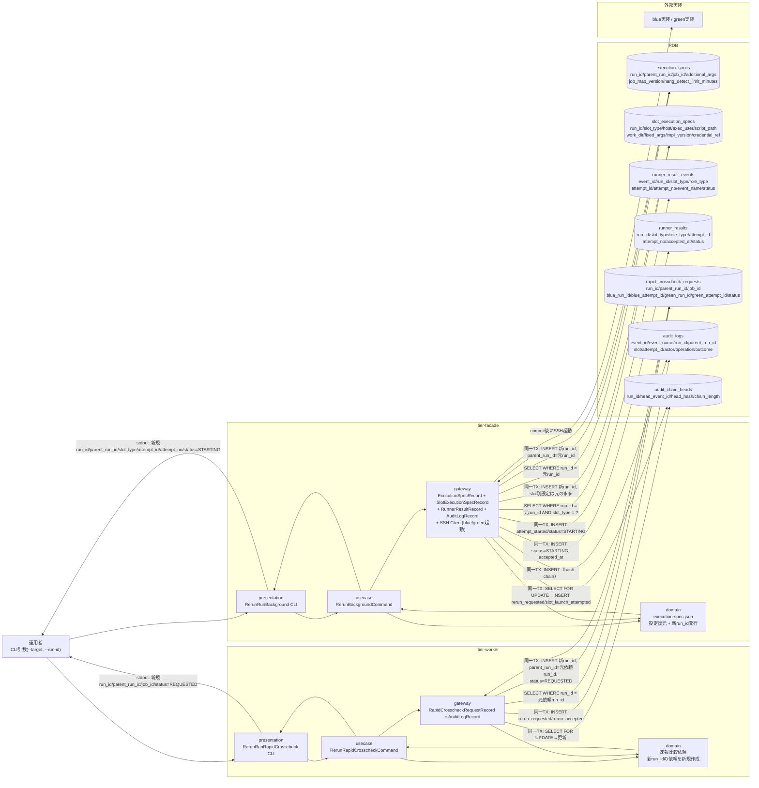

# execution-spec.jsonの実行設定を保ったまま再実行する

## 概要

前UC「再実行対象のbackground実行・速報比較依頼を選択する」で選定したbackground実行または速報比較依頼のrun_idを対象に、元の実行設定を保ったまま再実行するUC。対象種別により処理が分岐する。(1) **background実行**の場合はtier-facadeが元のrun共通execution spec（execution_specs）とslot別実行設定（slot_execution_specs）を復元し、**新しいrun_idを発行して新規runとして**blue/green実装のbackground roleを起動する。新runのparent_run_idに元run_idを設定し、**元runのレコード・状態・履歴は一切変更しない**。(2) **速報比較依頼**の場合はtier-workerが業務ジョブを再実行せず、**新しいrun_idの速報比較依頼をREQUESTED状態で新規作成**し、parent_run_idで元依頼へ関連付ける。**元依頼のレコード・状態・履歴は一切変更しない**。複数回リランでは各新規実行のparent_run_idに直前のリラン元run_idを設定し、最新run_idからparent_run_idをたどって元の実行まで数珠つなぎに追跡できる（CTP-004実行系譜トレーサビリティ）。run_id/parent_run_idの相関とユニーク制約により重複起動を検知・防止する（CTP-006冪等性方針）。

リラン不可条件: 対象がSTARTING/RUNNING中、元のslot modeがforegroundまたはoff、未対応role（background以外）、元の実行が見つからない場合は、リランせずエラー終了する。

## データフロー



| レイヤー | データモデル | 変換内容 |
|---------|------------|---------|
| facade presentation | --target=background、--run-id（元run_id） | CLI引数解析 → RerunBackgroundCommand 変換 |
| facade domain | execution-spec.json（AG-001） | run共通実行設定とslot別実行設定を保持したまま新run_id（parent_run_id=元run_id）を発行。リラン不可条件（STARTING/RUNNING中・slot mode foreground/off・未対応role・元実行なし）を判定する |
| facade gateway | execution_specs / slot_execution_specs / runner_result_events / runner_results / audit_logs / audit_chain_heads への同一transaction書込み + SSH起動 | 新規run_idでのbackground role再起動。commitできない場合は外部slotを起動しない（起動前監査ゲート） |
| worker presentation | --target=rapid-crosscheck、--run-id（元依頼run_id） | CLI引数解析 → RerunRapidCrosscheckCommand 変換 |
| worker domain | 速報比較依頼（AG-003） | 元依頼が終了状態（SUCCEEDED/FAILED/ABORTED）であることを確認し、新run_idの依頼を新規作成する。元依頼は変更しない |
| worker gateway | rapid_crosscheck_requests への INSERT + audit_logs / audit_chain_heads への同一transaction書込み | 新run_id・parent_run_id=元依頼run_id・比較対象4項目（blue_run_id/blue_attempt_id/green_run_id/green_attempt_id）・適用比較定義世代（comparison_definition_valid_from）を元依頼から複製してREQUESTEDで新規作成 |

## 処理フロー

```mermaid
sequenceDiagram
  actor User as 運用者

  box rgb(240,255,240) tier-facade
    participant FPres as presentation
    participant FUC as usecase
    participant FDomain as domain
    participant FGW as gateway
  end

  box rgb(255,245,235) tier-worker
    participant WPres as presentation
    participant WUC as usecase
    participant WDomain as domain
    participant WGW as gateway
  end

  participant DB as RDB
  participant Ext as blue/green実装

  rect rgb(245,245,255)
  Note over User,Ext: background実行のリラン（新run_id発行。元runは変更しない）
  User->>FPres: relaygate rerun run --target background --run-id 3f8c9d2e-5b41-4a7e-9c13-6d2a8b0f1e57
  FPres->>FUC: RerunBackgroundCommand(run_id=3f8c9d2e-5b41-4a7e-9c13-6d2a8b0f1e57)
  FUC->>FGW: 元のrun共通execution spec + slot別実行設定 + 起動試行状態を取得
  FGW->>DB: SELECT * FROM execution_specs WHERE run_id='3f8c9d2e-5b41-4a7e-9c13-6d2a8b0f1e57'
  FGW->>DB: SELECT * FROM slot_execution_specs WHERE run_id='3f8c9d2e-5b41-4a7e-9c13-6d2a8b0f1e57' AND slot_type='blue'
  FGW->>DB: SELECT status FROM runner_results WHERE run_id='3f8c9d2e-5b41-4a7e-9c13-6d2a8b0f1e57' AND slot_type='blue' AND role_type='background'
  DB-->>FGW: {job_id: daily-settlement, job_map_version: v1.4.0, hang_detect_limit_minutes: 30} / {host: blue-host-01, exec_user: batchuser, script_path: /opt/blue/run.sh, work_dir: /opt/relaygate/work, impl_version: blue-2.3.1} / {attempt_id: att-blue-0001, status: FAILED}
  FGW-->>FUC: 元の実行設定 + 起動試行状態
  FUC->>FDomain: リラン可否判定 + 新run_id発行 + 設定復元
  FDomain->>FDomain: リラン不可条件（STARTING/RUNNING中・slot mode foreground/off・未対応role・元実行なし）を判定
  FDomain->>FDomain: 新run_id=7a2e4b91-8c63-4d5f-b012-9e3c7a1d6b84, parent_run_id=3f8c9d2e-5b41-4a7e-9c13-6d2a8b0f1e57, attempt_id=att-blue-0002, attempt_no=1, 実行設定は元のまま複製
  FUC->>FGW: リラン起動トランザクション実行
  FGW->>DB: BEGIN
  FGW->>DB: INSERT INTO execution_specs (run_id, parent_run_id, job_id, additional_args, job_map_version, hang_detect_limit_minutes) VALUES ('7a2e4b91-...', '3f8c9d2e-...', 'daily-settlement', 元の値, 'v1.4.0', 30)
  FGW->>DB: INSERT INTO slot_execution_specs (run_id, slot_type, host, exec_user, script_path, work_dir, fixed_args, impl_version, credential_ref) VALUES ('7a2e4b91-...', 'blue', 'blue-host-01', 'batchuser', '/opt/blue/run.sh', '/opt/relaygate/work', 元の値, 'blue-2.3.1', 元の参照名)
  FGW->>DB: INSERT INTO runner_result_events (event_id, run_id, slot_type, role_type, attempt_id, attempt_no, event_name, status, occurred_at) VALUES (新規UUID, '7a2e4b91-...', 'blue', 'background', 'att-blue-0002', 1, 'attempt_started', 'STARTING', now())
  FGW->>DB: INSERT INTO runner_results (run_id, slot_type, role_type, attempt_id, attempt_no, accepted_at, status, updated_at) VALUES ('7a2e4b91-...', 'blue', 'background', 'att-blue-0002', 1, now(), 'STARTING', now())
  FGW->>DB: SELECT ... FOR UPDATE（audit_chain_headsのrun_id='7a2e4b91-...'行。無ければ新規作成しprevious_hash=NULL）
  FGW->>DB: INSERT INTO audit_logs (event_name='rerun_requested', run_id='7a2e4b91-...', parent_run_id='3f8c9d2e-...', slot='-', attempt_id='-', actor='ops-tanaka', operation='rerun', outcome='accepted', ...)
  FGW->>DB: INSERT INTO audit_logs (event_name='slot_launch_attempted', run_id='7a2e4b91-...', parent_run_id='3f8c9d2e-...', slot='blue', attempt_id='att-blue-0002', actor='ops-tanaka', operation='slot_launch', outcome='accepted', ...)
  FGW->>DB: UPDATE audit_chain_heads（head_event_id/head_hash/chain_length/updated_at）
  FGW->>DB: COMMIT（commitできない場合は外部slot起動を中止する）
  FGW->>Ext: SSH経由でblue実装のbackground roleを起動（run_id=7a2e4b91-8c63-4d5f-b012-9e3c7a1d6b84）
  Ext-->>FGW: 起動受理
  FGW->>DB: 監査イベント追記（event_name='rerun_accepted', operation='rerun', outcome='succeeded'。hash-chain lock契約に従い同一transactionでaudit_chain_headsを更新）
  FGW-->>FUC: 再実行開始結果
  FUC-->>FPres: 結果
  FPres-->>User: stdout: "run_id=7a2e4b91-8c63-4d5f-b012-9e3c7a1d6b84 parent_run_id=3f8c9d2e-5b41-4a7e-9c13-6d2a8b0f1e57 slot_type=blue attempt_id=att-blue-0002 attempt_no=1 status=STARTING" / exit 0
  end

  rect rgb(255,250,240)
  Note over User,DB: 速報比較依頼のリラン（新run_idの依頼を新規作成。元依頼は変更しない）
  User->>WPres: relaygate rerun run --target rapid-crosscheck --run-id c41d7e08-2b95-4f36-a8d1-5e7c93b204af
  WPres->>WUC: RerunRapidCrosscheckCommand(run_id=c41d7e08-2b95-4f36-a8d1-5e7c93b204af)
  WUC->>WGW: 元依頼取得
  WGW->>DB: SELECT * FROM rapid_crosscheck_requests WHERE run_id='c41d7e08-2b95-4f36-a8d1-5e7c93b204af'
  DB-->>WGW: {status: ABORTED, job_id: daily-settlement, blue_run_id: 3f8c9d2e-..., blue_attempt_id: att-blue-0001, green_run_id: 3f8c9d2e-..., green_attempt_id: att-green-0001, comparison_definition_valid_from: 2026-08-01T00:00:00+09:00}
  WGW-->>WUC: 速報比較依頼エンティティ
  WUC->>WDomain: リラン可否判定(status)
  alt statusがSUCCEEDED/FAILED/ABORTEDのいずれかの場合
    WDomain->>WDomain: 新run_id=d92b6f13-4a08-4c57-91e6-2f8a5d3c7b60, parent_run_id=c41d7e08-2b95-4f36-a8d1-5e7c93b204af を発行
    WUC->>WGW: 新規依頼作成トランザクション実行
    WGW->>DB: BEGIN
    WGW->>DB: INSERT INTO rapid_crosscheck_requests (run_id, parent_run_id, job_id, blue_run_id, blue_attempt_id, green_run_id, green_attempt_id, comparison_definition_valid_from, requested_at, status) VALUES ('d92b6f13-...', 'c41d7e08-...', 'daily-settlement', '3f8c9d2e-...', 'att-blue-0001', '3f8c9d2e-...', 'att-green-0001', '2026-08-01T00:00:00+09:00', now(), 'REQUESTED')
    WGW->>DB: SELECT ... FOR UPDATE（audit_chain_headsのrun_id='d92b6f13-...'行。無ければ新規作成しprevious_hash=NULL）
    WGW->>DB: INSERT INTO audit_logs (event_name='rerun_requested', run_id='d92b6f13-...', parent_run_id='c41d7e08-...', slot='-', attempt_id='-', actor='ops-tanaka', operation='rerun', outcome='accepted', ...)
    WGW->>DB: INSERT INTO audit_logs (event_name='rerun_accepted', run_id='d92b6f13-...', parent_run_id='c41d7e08-...', slot='-', attempt_id='-', actor='ops-tanaka', operation='rerun', outcome='succeeded', ...)
    WGW->>DB: UPDATE audit_chain_heads（head_event_id/head_hash/chain_length/updated_at）
    WGW->>DB: COMMIT（commitできない場合は依頼作成を中止する）
    WGW-->>WUC: 新規依頼作成完了
    WUC-->>WPres: 結果
    WPres-->>User: stdout: "run_id=d92b6f13-4a08-4c57-91e6-2f8a5d3c7b60 parent_run_id=c41d7e08-2b95-4f36-a8d1-5e7c93b204af job_id=daily-settlement status=REQUESTED" / exit 0
  else statusがREQUESTED/CLAIMED/RUNNINGの場合（処理中または処理待ち）
    WDomain->>WDomain: リラン不可と判定（重複起動防止）
    WUC-->>WPres: 業務エラー
    WPres-->>User: stderr: "リランできません run_id=c41d7e08-2b95-4f36-a8d1-5e7c93b204af status=RUNNING（SUCCEEDED/FAILED/ABORTEDのみリラン可能です）" / exit 1
  end
  end
```



## バリエーション一覧

| バリエーション名 | 値 | 処理内容 | 適用 tier | 適用箇所 |
|----------------|---|---------|----------|---------|
| slot種別 | blue、green | リラン対象のslot_execution_specsに記録されたslot_typeをそのまま再起動先slotとして使用する | tier-facade | RerunBackgroundCommand |
| role区分 | background | リラン対象はrole_type='background'のRunner実行結果に限定する。foreground等の未対応roleはリラン不可条件としてエラー終了する | tier-facade | RerunBackgroundCommand |
| クロスチェック種別 | 速報クロスチェック | リラン対象は速報比較依頼（rapid_crosscheck_requests）に限定する。業務ジョブは再実行しない | tier-worker | RerunRapidCrosscheckCommand |

## 分岐条件一覧

| 条件名 | 判定ルール | 適用 tier | 適用箇所 | BDD Scenario |
|--------|----------|----------|---------|-------------|
| background実行リラン可否 | リラン不可条件のいずれかに該当する場合はエラー終了（exit 1）する: (1)対象の起動試行がSTARTING/RUNNING中、(2)元のslot modeがforegroundまたはoff、(3)未対応role（background以外）、(4)元の実行（execution_specs / slot_execution_specs）が見つからない | tier-facade | RerunBackgroundCommand | 元の実行設定を保ったまま新run_idで再実行する / 元のexecution specが存在しない場合はエラーとする |
| 速報比較依頼リラン可否 | 元依頼のstatusがSUCCEEDED/FAILED/ABORTEDのいずれかの場合のみ新規依頼を作成する。REQUESTED/CLAIMED/RUNNING中は業務エラー（exit 1）とする（重複起動防止、lease/claim整合性保証）。ユニーク制約(job_id, blue_run_id, blue_attempt_id, green_run_id, green_attempt_id)には比較対象試行の組を用いるが、リランでは新run_idの依頼を新規作成するため元依頼と衝突しない | tier-worker | RerunRapidCrosscheckCommand | 新run_idの速報比較依頼を新規作成する / 処理中・処理待ちの対象はリランを拒否する |
| 起動前監査ゲート | リラン起動トランザクション（execution_specs / slot_execution_specs のINSERT、runner_result_events + runner_results のSTARTING記録、起動前監査イベント（slot_launch_attempted / rerun_requested）のaudit_logs INSERTとaudit_chain_heads更新）をcommitできない場合は、外部slotを起動しない | tier-facade | RerunBackgroundCommand | -（cross-cutting: audit-event-contract.yaml failure_contract） |

## 計算ルール一覧

| ルール名 | 計算内容 | 適用 tier | 適用箇所 |
|---------|---------|----------|---------|
| attempt_no採番 | 新規runの起動試行のattempt_noは、同一(run_id, slot_type, role_type)内の連番（1始まり）として採番する。リランは新run_idの新規runであるため、新runの初回試行はattempt_no=1となる | tier-facade | RerunBackgroundCommand |

## 状態遷移一覧

| 状態モデル | 遷移元 | 遷移先 | トリガー | 事前条件 | 事後処理 | 適用 tier |
|-----------|--------|--------|---------|---------|---------|----------|
| background slot実行状態 | -（新規作成） | STARTING | execution-spec.jsonの実行設定を保ったまま再実行する | 元のrun共通execution specとslot別実行設定が存在し、リラン不可条件に該当しないこと | 新run_id（parent_run_id=元run_id）の起動試行をrunner_result_events（attempt_started）+runner_results（STARTING）へ同一transactionで新規作成し、監査イベント（rerun_requested / slot_launch_attempted / rerun_accepted）をhash-chain lock契約に従い記録する。**元runの状態は変更しない** | tier-facade |
| 速報比較依頼状態 | -（新規作成） | REQUESTED | execution-spec.jsonの実行設定を保ったまま再実行する | 元依頼のstatusがSUCCEEDED/FAILED/ABORTEDのいずれかであること | 新run_id（parent_run_id=元依頼run_id）の速報比較依頼を新規作成し、監査イベント（rerun_requested / rerun_accepted）を記録する。**元依頼の状態は変更しない** | tier-worker |

## 関連 RDRA モデル

| モデル種別 | 要素名 | 関連 |
|-----------|--------|------|
| 業務 | 実行制御業務 | このUCが属する業務 |
| BUC | background側リランフロー | このUCを含むBUC |
| アクター | 運用者 | 操作するアクター |
| 情報 | execution-spec.json | facadeが参照・複製する実行設定（run共通=execution_specs、slot別=slot_execution_specs） |
| 情報 | Runner実行結果（started-at.txt/stdout.log/stderr.log/exitcode.txt） | facadeが新規作成する実行結果（履歴+snapshot併用） |
| 情報 | 速報比較依頼 | workerが新規作成する情報（元依頼は参照のみ） |
| 状態 | background slot実行状態 | 新規runの起動試行をSTARTINGで新規作成する（元runの状態は変更しない） |
| 状態 | 速報比較依頼状態 | 新規依頼をREQUESTEDで新規作成する（元依頼の状態は変更しない） |
| 条件 | 該当なし | - |
| 外部システム | blue実装 | facadeがSSH経由で再起動するリラン実行イベントの宛先 |
| 外部システム | green実装 | 同上（green slotの場合） |

## E2E 完了条件（BDD）

### 正常系

```gherkin
Feature: execution-spec.jsonの実行設定を保ったまま再実行する

  Scenario: 完了済みのbackground実行を元の実行設定のまま新run_idで再実行する
    Given execution_specsテーブルにrun_id="3f8c9d2e-5b41-4a7e-9c13-6d2a8b0f1e57"、parent_run_id=NULL、job_id="daily-settlement"、job_map_version="v1.4.0"、hang_detect_limit_minutes=30の行が存在する
    And slot_execution_specsテーブルに(run_id="3f8c9d2e-5b41-4a7e-9c13-6d2a8b0f1e57", slot_type="blue")、host="blue-host-01"、exec_user="batchuser"、script_path="/opt/blue/run.sh"、work_dir="/opt/relaygate/work"、impl_version="blue-2.3.1"の行が存在する
    And runner_resultsテーブルに(run_id="3f8c9d2e-5b41-4a7e-9c13-6d2a8b0f1e57", slot_type="blue", role_type="background", attempt_id="att-blue-0001")、attempt_no=1、status="FAILED"の行が存在する
    When 環境変数RELAYGATE_OPERATOR="ops-tanaka"の下で運用者が relaygate rerun run --target background --run-id 3f8c9d2e-5b41-4a7e-9c13-6d2a8b0f1e57 を実行する
    Then execution_specsテーブルに新規run_id（parent_run_id="3f8c9d2e-5b41-4a7e-9c13-6d2a8b0f1e57"）でjob_id="daily-settlement"、job_map_version="v1.4.0"、hang_detect_limit_minutes=30の行が追加される
    And slot_execution_specsテーブルに新規run_idのslot_type="blue"でhost="blue-host-01"、exec_user="batchuser"、script_path="/opt/blue/run.sh"、work_dir="/opt/relaygate/work"、impl_version="blue-2.3.1"の行が追加される
    And runner_result_eventsテーブルに新規run_idのevent_name="attempt_started"、status="STARTING"の行と、runner_resultsテーブルに新規run_idのrole_type="background"、attempt_no=1、status="STARTING"の行が同一transactionで追加される
    And 元のrun_id="3f8c9d2e-5b41-4a7e-9c13-6d2a8b0f1e57"のexecution_specs・slot_execution_specs・runner_resultsの行は一切変更されない
    And audit_logsテーブルにevent_name="rerun_requested"（operation="rerun", outcome="accepted", actor="ops-tanaka", parent_run_id="3f8c9d2e-5b41-4a7e-9c13-6d2a8b0f1e57"）とevent_name="slot_launch_attempted"（operation="slot_launch", outcome="accepted", slot="blue"）の行が追加される
    And 標準出力に新規run_id・parent_run_id="3f8c9d2e-5b41-4a7e-9c13-6d2a8b0f1e57"・slot_type=blue・attempt_id・attempt_no=1・status=STARTINGの1行が出力され、終了コード0で終了する

  Scenario: 中止済みの速報比較依頼から新run_idの依頼を新規作成する
    Given execution_specsテーブルにrun_id="3f8c9d2e-5b41-4a7e-9c13-6d2a8b0f1e57"、job_id="daily-settlement"の行が存在する
    And rapid_crosscheck_requestsテーブルにrun_id="c41d7e08-2b95-4f36-a8d1-5e7c93b204af"、parent_run_id=NULL、job_id="daily-settlement"、blue_run_id="3f8c9d2e-5b41-4a7e-9c13-6d2a8b0f1e57"、blue_attempt_id="att-blue-0001"、green_run_id="3f8c9d2e-5b41-4a7e-9c13-6d2a8b0f1e57"、green_attempt_id="att-green-0001"、comparison_definition_valid_from="2026-08-01T00:00:00+09:00"、status="ABORTED"の行が存在する
    When 環境変数RELAYGATE_OPERATOR="ops-tanaka"の下で運用者が relaygate rerun run --target rapid-crosscheck --run-id c41d7e08-2b95-4f36-a8d1-5e7c93b204af を実行する
    Then rapid_crosscheck_requestsテーブルに新規run_id（parent_run_id="c41d7e08-2b95-4f36-a8d1-5e7c93b204af"）でjob_id="daily-settlement"、blue_run_id="3f8c9d2e-5b41-4a7e-9c13-6d2a8b0f1e57"、blue_attempt_id="att-blue-0001"、green_run_id="3f8c9d2e-5b41-4a7e-9c13-6d2a8b0f1e57"、green_attempt_id="att-green-0001"、comparison_definition_valid_from="2026-08-01T00:00:00+09:00"（元依頼から複製。適用比較定義世代は変更前のまま保持される）、status="REQUESTED"の行が追加される
    And 元のrun_id="c41d7e08-2b95-4f36-a8d1-5e7c93b204af"の行はstatus="ABORTED"のまま一切変更されない
    And audit_logsテーブルにevent_name="rerun_requested"（operation="rerun", outcome="accepted"）とevent_name="rerun_accepted"（operation="rerun", outcome="succeeded"）の行がactor="ops-tanaka"、parent_run_id="c41d7e08-2b95-4f36-a8d1-5e7c93b204af"で追加される
    And 標準出力に新規run_id・parent_run_id="c41d7e08-2b95-4f36-a8d1-5e7c93b204af"・job_id=daily-settlement・status=REQUESTEDの1行が出力され、終了コード0で終了する

  Scenario: job map変更後もリランは既存run_idの変更前実行設定を保持したまま使用する
    Given execution_specsテーブルにrun_id="3f8c9d2e-5b41-4a7e-9c13-6d2a8b0f1e57"、job_id="daily-settlement"、job_map_version="v1.4.0"、hang_detect_limit_minutes=30の行が存在する
    And slot_execution_specsテーブルに(run_id="3f8c9d2e-5b41-4a7e-9c13-6d2a8b0f1e57", slot_type="blue")、host="blue-host-01"、script_path="/opt/blue/run.sh"、impl_version="blue-2.3.1"の行が存在する
    And runner_resultsテーブルに(run_id="3f8c9d2e-5b41-4a7e-9c13-6d2a8b0f1e57", slot_type="blue", role_type="background", attempt_id="att-blue-0001")、status="FAILED"の行が存在する
    And ジョブマップがv1.5.0へ更新され、job_id="daily-settlement"のblueのhostが"blue-host-02"、script_pathが"/opt/blue-v2/run.sh"へ変更されている
    When 環境変数RELAYGATE_OPERATOR="ops-tanaka"の下で運用者が relaygate rerun run --target background --run-id 3f8c9d2e-5b41-4a7e-9c13-6d2a8b0f1e57 を実行する
    Then 既存run_id="3f8c9d2e-5b41-4a7e-9c13-6d2a8b0f1e57"のexecution_specs行はjob_map_version="v1.4.0"のまま、slot_execution_specs行はhost="blue-host-01"、script_path="/opt/blue/run.sh"のまま一切上書きされない
    And 新規run_id（parent_run_id="3f8c9d2e-5b41-4a7e-9c13-6d2a8b0f1e57"）のexecution_specs行はjob_map_version="v1.4.0"、slot_execution_specs行はhost="blue-host-01"、script_path="/opt/blue/run.sh"で作成される（ジョブマップv1.5.0の値は使用されない）
    And SSH起動はhost="blue-host-01"のscript_path="/opt/blue/run.sh"に対して行われる
```

### 異常系

```gherkin
  Scenario: RUNNING中の速報比較依頼はリランできない（重複起動防止）
    Given execution_specsテーブルにrun_id="3f8c9d2e-5b41-4a7e-9c13-6d2a8b0f1e57"、job_id="daily-settlement"の行が存在する
    And rapid_crosscheck_requestsテーブルにrun_id="c41d7e08-2b95-4f36-a8d1-5e7c93b204af"、job_id="daily-settlement"、blue_run_id="3f8c9d2e-5b41-4a7e-9c13-6d2a8b0f1e57"、blue_attempt_id="att-blue-0001"、green_run_id="3f8c9d2e-5b41-4a7e-9c13-6d2a8b0f1e57"、green_attempt_id="att-green-0001"、status="RUNNING"の行が存在する
    When 運用者「ops-tanaka」が relaygate rerun run --target rapid-crosscheck --run-id c41d7e08-2b95-4f36-a8d1-5e7c93b204af を実行する
    Then rapid_crosscheck_requestsテーブルに新規行は追加されず、標準エラーに "リランできません run_id=c41d7e08-2b95-4f36-a8d1-5e7c93b204af status=RUNNING（SUCCEEDED/FAILED/ABORTEDのみリラン可能です）" が出力され、終了コード1で終了する

  Scenario: 元のexecution specが存在しない場合はエラーとする
    Given execution_specsテーブルにrun_id="7a2e4b91-8c63-4d5f-b012-9e3c7a1d6b84"の行が存在しない
    When 運用者「ops-tanaka」が relaygate rerun run --target background --run-id 7a2e4b91-8c63-4d5f-b012-9e3c7a1d6b84 を実行する
    Then 標準エラーに "元のexecution specが見つかりません run_id=7a2e4b91-8c63-4d5f-b012-9e3c7a1d6b84" が出力され、終了コード1で終了する

  Scenario: --target未指定でコマンドを実行する
    When 運用者「ops-tanaka」が relaygate rerun run --run-id 3f8c9d2e-5b41-4a7e-9c13-6d2a8b0f1e57 を実行する（--target省略）
    Then 標準エラーに "--target は必須です（background または rapid-crosscheck を指定してください）" が出力され、終了コード2で終了する

  Scenario: 元のslot modeがforegroundまたはoffのためリランせずエラー終了する
    Given execution_specsテーブルにrun_id="3f8c9d2e-5b41-4a7e-9c13-6d2a8b0f1e57"、job_id="daily-settlement"、job_map_version="v1.4.0"の行が存在する
    And slot_execution_specsテーブルに(run_id="3f8c9d2e-5b41-4a7e-9c13-6d2a8b0f1e57", slot_type="blue")の行のみが存在する（BLUE_MODE=foreground, GREEN_MODE=off で確定済み）
    And runner_resultsテーブルに(run_id="3f8c9d2e-5b41-4a7e-9c13-6d2a8b0f1e57", slot_type="blue", role_type="foreground", attempt_id="att-blue-0001")、status="SUCCEEDED"の行のみが存在し、role_type="background"の行は存在しない
    When 運用者「ops-tanaka」が relaygate rerun run --target background --run-id 3f8c9d2e-5b41-4a7e-9c13-6d2a8b0f1e57 を実行する
    Then 終了コード1で終了する
    And execution_specs・slot_execution_specs・runner_result_events・runner_resultsに新規行は追加されず、既存行も一切変更されない
    And 標準エラーに "リランできません run_id=3f8c9d2e-5b41-4a7e-9c13-6d2a8b0f1e57（元のslot modeがforegroundまたはoffのためbackground roleの起動試行が存在しません）" が出力される

  Scenario: foreground slot・確報クロスチェックのリラン指定を拒否し正規ジョブでの再実行を案内する
    Given execution_specsテーブルにrun_id="e57a03c8-9d21-4b6f-8a34-1c7e5b9d206f"の行と、final_crosscheck_requestsテーブルにrun_id="e57a03c8-9d21-4b6f-8a34-1c7e5b9d206f"、target_date="2026-08-18"、status="ABORTED"の行が存在する
    When 運用者「ops-tanaka」が relaygate rerun run --target final-crosscheck --run-id e57a03c8-9d21-4b6f-8a34-1c7e5b9d206f を実行する
    Then 終了コード2で終了する（--targetはbackground|rapid-crosscheckのみのenum。バリデーションエラー）
    And final_crosscheck_requestsテーブルに新規行は追加されず、既存行のstatusは"ABORTED"のまま変更されない
    And 標準エラーに "--target には background または rapid-crosscheck のみ指定できます。foreground slotと確報クロスチェックはジョブスケジューラの正規ジョブから再実行してください" が出力される
```

## ティア別仕様

- [tier-facade仕様](tier-facade.md)
- [tier-worker仕様](tier-worker.md)

### 統合 API Spec

- [CLI コマンド契約](../../../_cross-cutting/api/cli-command-contract.yaml)（全 UC 統合。HTTP API は存在しないため OpenAPI ではなく CLI コマンド契約を正本とする。`relaygate rerun run` は dispatch[] にdispatch先別の環境変数・stdout/stderr契約・終了コードを定義する単一コマンド）
- [監査イベント契約](../../../_cross-cutting/api/audit-event-contract.yaml)（rerun_requested / rerun_accepted / slot_launch_attempted のフィールド定義・hash-chain lock契約の正本）
