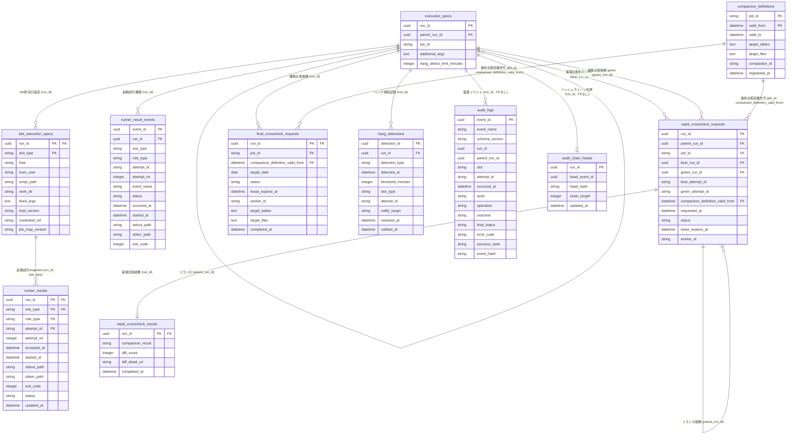
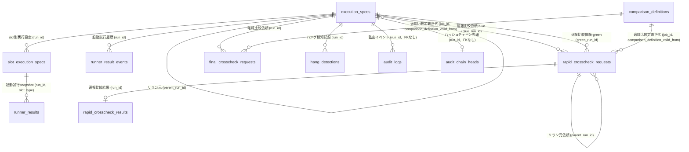
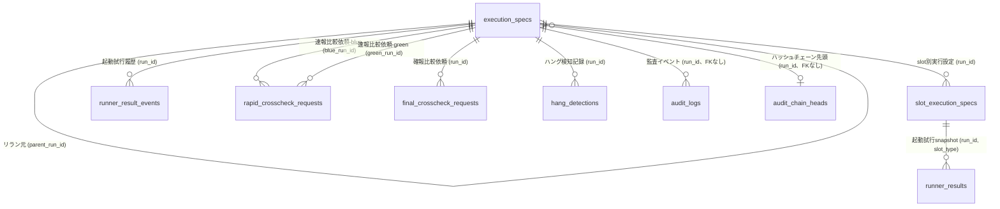
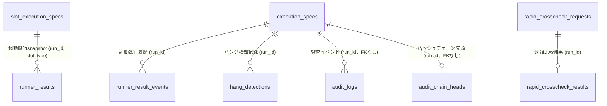

# データストアスキーマ

## サマリー

| データストア | 項目数 |
|------------|:------:|
| RDB テーブル | 11 |
| RDB インデックス | 31 |
| RDB 外部キー | 12 |

## RDB

### ER 図

#### 全体

#### クロスチェック業務

#### 並行稼働実行業務

#### 実行制御業務

#### 実行監視業務

### テーブル一覧

| テーブル名 | RDRA 情報 | 説明 | カラム数 | インデックス数 | 利用 UC 数 |
|-----------|----------|------|:-------:|:----------:|:--------:|
| execution_specs | execution-spec.json | run共通のexecution spec（アーキテクチャE-001）。run_id・parent_run_id・job_id・追加引数・hang_detect_limit_minutesなど、slotに依存しないrun単位の実行設定を起動時に一度だけ確定して保存する。slotごとに異なるhost/exec_user/script_path/work_dir/固定引数/実装版/認証情報参照名/ジョブマップ版はslot_execution_specsへ分離する（ジョブマップはslotごとの独立ファイルであり版もslot別に持つ。CR-6078c4ed-018）。再実行は新しいrun_idの新規runとして作成し、parent_run_idで元runへ関連付ける（元runのレコード・履歴は変更しない） | 5 | 2 | 6 |
| slot_execution_specs | execution-spec.json（slot別実行設定の分離） | slotごとに解決したexecution spec（アーキテクチャE-007）。同一runでもblue/greenでhost・exec_user・script_path・work_dir・固定引数・実装版・認証情報参照名・ジョブマップ版が異なりうるため、run共通のexecution_specsから分離して保持する。slot別実行設定はrun起動時にslotごとに一度だけ確定し、以後変更しない（AG-001）。認証情報は参照名のみを保存し実値は保存しない。解決元はslotごとの独立したジョブマップファイル（cli-command-contract.yaml job_map_contract） | 10 | 1 | 5 |
| runner_result_events | Runner実行結果（started-at.txt/stdout.log/stderr.log/exitcode.txt） | Runner実行結果の状態遷移をappend-onlyで記録する履歴テーブル（アーキテクチャLR-002 Event/Snapshot併用パターンのEvent側）。起動試行の各状態遷移をINSERTし、同一transaction内でrunner_resultsのsnapshotをUPSERTする。UPDATE/DELETEは行わず、訂正も新しいイベントとして追記する | 13 | 2 | 7 |
| runner_results | Runner実行結果（started-at.txt/stdout.log/stderr.log/exitcode.txt） | Runner実行結果の現在状態を保持するsnapshotテーブル（アーキテクチャLR-002 Event/Snapshot併用パターンのSnapshot側）。起動試行は（run_id, slot_type, role_type, attempt_id）で一意に識別する。runner_result_eventsへの履歴INSERTと同一transactionでUPSERTし、履歴と現在状態の乖離を防ぐ | 12 | 3 | 13 |
| comparison_definitions | 比較定義 | job_idごとの比較対象（テーブル・ファイル）と比較実装を保持し、速報クロスチェック・確報クロスチェックの実行時に適用する比較定義を解決するためのテーブル。同一job_idに複数世代の定義を持てるようSCD2型で有効期間（valid_from/valid_to）を保持し、実行時点に該当する世代を1件だけ適用する。世代は追記のみで管理し、既存世代のtarget_tables/target_files/comparator_idは更新しない | 7 | 2 | 2 |
| rapid_crosscheck_requests | 速報比較依頼 | blueとgreenの完了通知を受けて作成する、ジョブ単位で非同期に行う速報クロスチェックの比較実行依頼。run_idで相関付けて実行状態を一意に管理する。CLAIMED状態でlease失効かつ未着手の場合はREQUESTEDへ戻す。再実行では同一run_idを差し戻さず、新しいrun_idの依頼を新規作成しparent_run_idで元依頼へ関連付ける（元依頼のレコード・状態・履歴は変更しない） | 12 | 6 | 7 |
| rapid_crosscheck_results | 速報比較結果 | 速報クロスチェックの比較結果を保持し、hang-detectorによる速報クロスチェック異常の検知・運用者への通知に用いる | 5 | 1 | 3 |
| final_crosscheck_requests | 確報比較依頼 | 日次で全テーブル・全ファイルを対象に行う確報クロスチェックの比較実行依頼。速報側のエンティティと独立してrun_idで相関付け、リリース判断の正本とする実行状態を管理する。応答はstdout/stderr/exitcodeの3項目のみに限定する | 10 | 4 | 5 |
| hang_detections | ハング検知記録 | background実行の未完了超過（ハング疑い）・非0終了エラー・速報クロスチェック異常を記録し、定期的な監視と運用者への通知に用いる | 10 | 5 | 3 |
| audit_logs | 該当なし（RDRAに明示定義なし。CTP-005監査ログ要件・CTR-008失敗時契約・CTP-004実行系譜トレーサビリティから導出） | slot起動の操作受付・起動試行・成功・失敗・timeout・最終状態、および対話確認を経た中止・リラン操作を同一schemaで記録する追記専用の監査イベントテーブル。非partitionのテーブルとし、event_id単独主キーと（run_id, slot, attempt_id, event_name）一意制約を実PostgreSQLでそのままCREATE TABLEできる構成とする（partitioned tableは主キー・一意制約にpartition keyの包含を要求し、冪等一意性の契約と両立しないため）。INSERTのみを許可しUPDATE/DELETE権限はアプリケーションロールへ付与しない。訂正も新しいイベントとして追記する。認証情報・起動引数の実値・stdout/stderr本文は記録しない。保持期間は6ヶ月とし、専用保守権限ロールがハッシュチェーン検証結果を記録したうえで保持境界超過分を削除する | 15 | 4 | 13 |
| audit_chain_heads | 該当なし（CTP-005ハッシュチェーン要件から導出） | run_id単位のハッシュチェーンの先頭（最新イベント）を保持し、監査イベント追記の直列化ロックの対象とする。監査イベントを追記する処理は、まず対象run_idの本テーブル行を排他ロック（SELECT ... FOR UPDATE）で取得し、previous_hashを確定してからaudit_logsへINSERTし、同一transaction内で本テーブルを更新する。これによりrun_id内でチェーンが分岐・欠損しないことを保証する | 5 | 1 | 12 |

### execution_specs

**RDRA 情報**: execution-spec.json
**説明**: run共通のexecution spec（アーキテクチャE-001）。run_id・parent_run_id・job_id・追加引数・hang_detect_limit_minutesなど、slotに依存しないrun単位の実行設定を起動時に一度だけ確定して保存する。slotごとに異なるhost/exec_user/script_path/work_dir/固定引数/実装版/認証情報参照名/ジョブマップ版はslot_execution_specsへ分離する（ジョブマップはslotごとの独立ファイルであり版もslot別に持つ。CR-6078c4ed-018）。再実行は新しいrun_idの新規runとして作成し、parent_run_idで元runへ関連付ける（元runのレコード・履歴は変更しない）

#### カラム

| カラム名 | 型 | NULL | 説明 |
|---------|---|:----:|------|
| **run_id** (PK) | uuid | NO | 実行を一意に識別するUUID。起動時に新規発番される。slot_execution_specs・runner_results・runner_result_events・rapid_crosscheck_requests・final_crosscheck_requests・hang_detections・audit_logsから参照される |
| parent_run_id | uuid | YES | リラン元となった元のrun_id。リラン実行でない通常起動の場合はNULL。CTP-004実行系譜トレーサビリティで最新run_idから元runまで数珠つなぎに追跡する（自己参照） |
| job_id | string | NO | ジョブマップ上のジョブ識別子（CLI引数 --job-id の値）。同一job_idに紐づくblue/greenの実行結果を相関取得するために用いる |
| additional_args | text | YES | ジョブスケジューラから渡されたrun共通の追加引数。JSON配列（要素は文字列）で保存し、復元は要素順をそのままargvとする（argument_serialization）。slot固有の固定引数はslot_execution_specs.fixed_argsに保持する |
| hang_detect_limit_minutes | integer | NO | ハング疑い判定のしきい値（分）。run共通の1値であり、background roleに選ばれたslotのジョブマップの hang_detect_limit_minutes を採用する（両slotがbackgroundなら大きい方、backgroundが無ければ起動対象の唯一のslotの値。cli-command-contract.yaml job_map_contract.hang_detect_limit_minutes_rule）。role別・slot別の値は保存しない。hang_detections.threshold_minutesに引き継がれる |

#### 外部キー

| カラム | 参照先テーブル | 参照先カラム | ON DELETE |
|-------|-------------|------------|----------|
| parent_run_id | execution_specs | run_id | SET NULL |

#### インデックス

| 名前 | カラム | UNIQUE | 理由 | 利用 UC |
|------|-------|:------:|------|--------|
| idx_execution_specs_parent_run_id | parent_run_id | NO | CTP-004実行系譜トレーサビリティ。親run_idからの子run_id一覧参照を高速化する | execution-spec.jsonの実行設定を保ったまま再実行する |
| idx_execution_specs_job_id | job_id | NO | 同一job_idに紐づくblue/green双方の実行結果・依頼を相関取得するため | feature flag設定に基づきslotを選択して起動する, blue/green runnerの完了通知を受けて速報比較依頼を作成する, 並行稼働実行結果を確認する |

#### 利用 UC

| UC | 操作 |
|---|------|
| feature flag設定に基づきslotを選択して起動する | INSERT |
| background roleを起動する | SELECT |
| foreground roleの標準出力・標準エラー・終了コードを応答する | SELECT |
| blue/green runnerの完了通知を受けて速報比較依頼を作成する | SELECT |
| 全テーブル・全ファイルを対象に確報クロスチェックを実行する | SELECT |
| execution-spec.jsonの実行設定を保ったまま再実行する | SELECT, INSERT |

### slot_execution_specs

**RDRA 情報**: execution-spec.json（slot別実行設定の分離）
**説明**: slotごとに解決したexecution spec（アーキテクチャE-007）。同一runでもblue/greenでhost・exec_user・script_path・work_dir・固定引数・実装版・認証情報参照名・ジョブマップ版が異なりうるため、run共通のexecution_specsから分離して保持する。slot別実行設定はrun起動時にslotごとに一度だけ確定し、以後変更しない（AG-001）。認証情報は参照名のみを保存し実値は保存しない。解決元はslotごとの独立したジョブマップファイル（cli-command-contract.yaml job_map_contract）

#### カラム

| カラム名 | 型 | NULL | 説明 |
|---------|---|:----:|------|
| **run_id** (PK) | uuid | NO | 対応するrun共通実行設定のrun_id。execution_specs.run_idを参照する複合主キーの一部 |
| **slot_type** (PK) | string | NO | slot種別。値: blue, green。複合主キーの一部 |
| host | string | NO | 起動時に解決済みの実行ホスト。ジョブマップ解決結果（slotごとに異なりうる） |
| exec_user | string | NO | 起動時に解決済みの実行ユーザー。ジョブマップ解決結果（slotごとに異なりうる） |
| script_path | string | NO | 起動時に解決済みの実行スクリプトパス。ジョブマップ解決結果（slotごとに異なりうる） |
| work_dir | string | NO | 起動時に解決済みの作業ディレクトリ。ジョブマップ解決結果（slotごとに異なりうる） |
| fixed_args | text | YES | ジョブマップに固定された起動引数。JSON配列（要素は文字列）で保存し、復元は要素順をそのままargvとする（argument_serialization）。ジョブスケジューラからの追加引数（execution_specs.additional_args）はこの後ろに順序を変えず連結する |
| impl_version | string | NO | 当該slotの起動対象実装バージョン（slotごとに異なりうる） |
| credential_ref | string | YES | 認証情報の参照名のみを保存する（実値は保存しない）。解決規則は cli-command-contract.yaml credential_resolution（認証情報ディレクトリ方式）に従う |
| job_map_version | string | NO | その slot の実行先解決に使用したジョブマップ（slotごとの独立ファイル）の版。CR-6078c4ed-018 で execution_specs（run共通）から移動した。物理型は physical_type_mapping（string → text）に従う |

#### 外部キー

| カラム | 参照先テーブル | 参照先カラム | ON DELETE |
|-------|-------------|------------|----------|
| run_id | execution_specs | run_id | CASCADE |

#### インデックス

| 名前 | カラム | UNIQUE | 理由 | 利用 UC |
|------|-------|:------:|------|--------|
| idx_slot_execution_specs_slot_type | slot_type | NO | slot種別単位でのリラン候補絞り込み・並行稼働結果参照を高速化するため | 再実行対象のbackground実行・速報比較依頼を選択する, 並行稼働実行結果を確認する |

#### 利用 UC

| UC | 操作 |
|---|------|
| feature flag設定に基づきslotを選択して起動する | INSERT |
| background roleを起動する | SELECT |
| execution-spec.jsonの実行設定を保ったまま再実行する | SELECT, INSERT |
| 並行稼働実行結果を確認する | SELECT |
| 再実行対象のbackground実行・速報比較依頼を選択する | SELECT |

### runner_result_events

**RDRA 情報**: Runner実行結果（started-at.txt/stdout.log/stderr.log/exitcode.txt）
**説明**: Runner実行結果の状態遷移をappend-onlyで記録する履歴テーブル（アーキテクチャLR-002 Event/Snapshot併用パターンのEvent側）。起動試行の各状態遷移をINSERTし、同一transaction内でrunner_resultsのsnapshotをUPSERTする。UPDATE/DELETEは行わず、訂正も新しいイベントとして追記する

#### カラム

| カラム名 | 型 | NULL | 説明 |
|---------|---|:----:|------|
| **event_id** (PK) | uuid | NO | 履歴イベントを一意に識別するUUID |
| run_id | uuid | NO | 対象実行のrun_id。execution_specs.run_idに対応する |
| slot_type | string | NO | slot種別。値: blue, green |
| role_type | string | NO | 実行役割区分。値: foreground, background, rapid-crosscheck |
| attempt_id | string | NO | 起動試行の一意識別子。同一runで同一slot・roleを複数回起動しても試行を識別できる |
| attempt_no | integer | NO | 同一（run_id, slot_type, role_type）内の起動試行連番。1から始まる |
| event_name | string | NO | 遷移イベント名。値: attempt_started, attempt_running, attempt_succeeded, attempt_failed, attempt_unknown, attempt_aborted。(run_id, slot_type, role_type, attempt_id, event_name)の一意制約により再試行を冪等化する |
| status | string | NO | 遷移後の実行状態。値: STARTING, RUNNING, SUCCEEDED, FAILED, UNKNOWN, ABORTED |
| occurred_at | datetime | NO | イベント発生時刻。履歴の時系列順序の基準とする（マイクロ秒精度・UTC。datetime_rules.ordering_guarantee により同一秒内のイベント順序も一意に決まる） |
| started_at | datetime | YES | 実行開始時刻（started-at.txt由来）。プロセス起動確認前はNULL |
| stdout_path | string | YES | 標準出力ログ（stdout.log）のパス参照。ログ本体はファイルシステム上に保持し本カラムはパスのみを保存する |
| stderr_path | string | YES | 標準エラーログ（stderr.log）のパス参照。ログ本体はファイルシステム上に保持し本カラムはパスのみを保存する |
| exit_code | integer | YES | プロセス終了コード（exitcode.txtの内容）。exitcode.txt出力前およびUNKNOWN時はNULL |

#### 外部キー

| カラム | 参照先テーブル | 参照先カラム | ON DELETE |
|-------|-------------|------------|----------|
| run_id | execution_specs | run_id | CASCADE |

#### インデックス

| 名前 | カラム | UNIQUE | 理由 | 利用 UC |
|------|-------|:------:|------|--------|
| uq_runner_result_events_attempt_event_name | run_id, slot_type, role_type, attempt_id, event_name | YES | ユニーク制約: 同一起動試行に対する同一遷移イベントの重複追記を防止し、クラッシュ後の再試行を冪等化する（CTP-006冪等性方針） | background roleを起動する, execution-spec.jsonの実行設定を保ったまま再実行する |
| idx_runner_result_events_run_id_occurred_at | run_id, occurred_at | NO | run_id単位で起動試行の経過を時系列に追跡するため（障害調査・実行系譜照会） | 並行稼働実行結果を確認する, background実行の未完了・非0終了・速報比較異常を定期検知する |

#### 利用 UC

| UC | 操作 |
|---|------|
| feature flag設定に基づきslotを選択して起動する | INSERT |
| background roleを起動する | INSERT |
| execution-spec.jsonの実行設定を保ったまま再実行する | INSERT |
| background実行の未完了・非0終了・速報比較異常を定期検知する | SELECT, INSERT |
| 対話確認のうえblue background実行をABORTEDへ遷移させる | INSERT |
| 対話確認のうえgreen background実行をABORTEDへ遷移させる | INSERT |
| 並行稼働実行結果を確認する | SELECT |

### runner_results

**RDRA 情報**: Runner実行結果（started-at.txt/stdout.log/stderr.log/exitcode.txt）
**説明**: Runner実行結果の現在状態を保持するsnapshotテーブル（アーキテクチャLR-002 Event/Snapshot併用パターンのSnapshot側）。起動試行は（run_id, slot_type, role_type, attempt_id）で一意に識別する。runner_result_eventsへの履歴INSERTと同一transactionでUPSERTし、履歴と現在状態の乖離を防ぐ

#### カラム

| カラム名 | 型 | NULL | 説明 |
|---------|---|:----:|------|
| **run_id** (PK) | uuid | NO | 対象実行のrun_id。execution_specs.run_idを参照する複合主キーの一部 |
| **slot_type** (PK) | string | NO | 実行slot種別。値: blue, green。複合主キーの一部。同一runでblueとgreenを同時起動しても試行を識別できるようにする |
| **role_type** (PK) | string | NO | 実行役割区分。値: foreground, background, rapid-crosscheck。複合主キーの一部 |
| **attempt_id** (PK) | string | NO | 起動試行の一意識別子。複合主キーの一部。同一（run_id, slot_type, role_type）を複数回起動しても試行を識別できる |
| attempt_no | integer | NO | 同一（run_id, slot_type, role_type）内の起動試行連番。1から始まる |
| accepted_at | datetime | NO | 起動受付時刻（STARTING遷移時点のイベント発生時刻）。プロセス起動前でも必ず記録する。同一transactionのrunner_result_events.occurred_at（attempt_started）およびupdated_atと同一値にする（datetime_rules.same_transaction_rule） |
| started_at | datetime | YES | 実行開始時刻（started-at.txt由来）。プロセス起動確認前（STARTING）はNULL |
| stdout_path | string | YES | 標準出力ログ（stdout.log）のパス参照。ログ本体はファイルシステム上に保持し、本カラムはパスのみを保存する |
| stderr_path | string | YES | 標準エラーログ（stderr.log）のパス参照。ログ本体はファイルシステム上に保持し、本カラムはパスのみを保存する |
| exit_code | integer | YES | プロセス終了コード（exitcode.txtの内容）。未完了（STARTING/RUNNING）および結果取得不能（UNKNOWN）時はNULL |
| status | string | NO | 実行状態。値: STARTING, RUNNING, SUCCEEDED, FAILED, UNKNOWN, ABORTED。exitcode.txtの有無と終了コードの値からSUCCEEDED/FAILEDを判定する。timeoutや結果取得不能時はUNKNOWNとし推測でFAILEDを確定しない。ABORTEDへの遷移は対話確認による明示的操作でのみ発生する |
| updated_at | datetime | NO | snapshot最終更新時刻。対応するrunner_result_events.occurred_atと同一値にする（datetime_rules.same_transaction_rule。マイクロ秒精度で一致を検証できる） |

#### 外部キー

| カラム | 参照先テーブル | 参照先カラム | ON DELETE |
|-------|-------------|------------|----------|
| run_id, slot_type | slot_execution_specs | run_id, slot_type | CASCADE |

#### インデックス

| 名前 | カラム | UNIQUE | 理由 | 利用 UC |
|------|-------|:------:|------|--------|
| uq_runner_results_attempt_no | run_id, slot_type, role_type, attempt_no | YES | ユニーク制約: 同一（run_id, slot_type, role_type）内でattempt_noが重複しないことを保証し、起動試行連番の一意性を担保する | background roleを起動する, execution-spec.jsonの実行設定を保ったまま再実行する |
| idx_runner_results_role_type_status | role_type, status | NO | hang-detectorがSTARTING/RUNNING状態かつrole_type='background'のレコードを高頻度でポーリングするため、また速報比較依頼作成・リラン候補選定でも同条件検索を行うため | background実行の未完了・非0終了・速報比較異常を定期検知する, blue/green runnerの完了通知を受けて速報比較依頼を作成する, 再実行対象のbackground実行・速報比較依頼を選択する |
| idx_runner_results_slot_type_status | slot_type, status | NO | --slotフィルタによるblue/green絞り込みと状態絞り込みを高速化するため | 再実行対象のbackground実行・速報比較依頼を選択する, blue background実行の中止を依頼する, green background実行の中止を依頼する |

#### 利用 UC

| UC | 操作 |
|---|------|
| feature flag設定に基づきslotを選択して起動する | INSERT, UPDATE |
| background roleを起動する | INSERT, UPDATE |
| execution-spec.jsonの実行設定を保ったまま再実行する | INSERT |
| blue/green runnerの完了通知を受けて速報比較依頼を作成する | SELECT |
| 速報クロスチェックを実行し差分を検知する | SELECT |
| background実行の未完了・非0終了・速報比較異常を定期検知する | SELECT, UPDATE |
| 再実行対象のbackground実行・速報比較依頼を選択する | SELECT |
| blue background実行の中止を依頼する | SELECT |
| 対話確認のうえblue background実行をABORTEDへ遷移させる | SELECT, UPDATE |
| green background実行の中止を依頼する | SELECT |
| 対話確認のうえgreen background実行をABORTEDへ遷移させる | SELECT, UPDATE |
| foreground roleの標準出力・標準エラー・終了コードを応答する | SELECT |
| 並行稼働実行結果を確認する | SELECT |

### comparison_definitions

**RDRA 情報**: 比較定義
**説明**: job_idごとの比較対象（テーブル・ファイル）と比較実装を保持し、速報クロスチェック・確報クロスチェックの実行時に適用する比較定義を解決するためのテーブル。同一job_idに複数世代の定義を持てるようSCD2型で有効期間（valid_from/valid_to）を保持し、実行時点に該当する世代を1件だけ適用する。世代は追記のみで管理し、既存世代のtarget_tables/target_files/comparator_idは更新しない

#### カラム

| カラム名 | 型 | NULL | 説明 |
|---------|---|:----:|------|
| **job_id** (PK) | string | NO | 比較定義が適用される対象ジョブのJOB_ID（execution_specs.job_idに対応）。複合主キーの第1要素 |
| **valid_from** (PK) | datetime | NO | この世代の有効期間の開始日時（この値を含む）。複合主キーの第2要素であり、同一job_idの世代を一意に識別する |
| valid_to | datetime | YES | この世代の有効期間の終了日時（この値を含まない）。現行世代はNULL。世代交代時に旧世代へ設定する |
| target_tables | text | NO | この世代の比較対象テーブル一覧。確報クロスチェックの全テーブル比較および速報クロスチェックの比較範囲を決定する |
| target_files | text | NO | この世代の比較対象ファイル一覧。確報クロスチェックの全ファイル比較および速報クロスチェックの比較範囲を決定する |
| comparator_id | string | NO | この世代で使用する比較実装の識別子。job_idごとに異なる比較ツール・比較ロジックへ差し替えるために用いる（SPEC-012-03） |
| registered_at | datetime | NO | この世代を登録した日時。世代の追記順を追跡するために保持する |

#### インデックス

| 名前 | カラム | UNIQUE | 理由 | 利用 UC |
|------|-------|:------:|------|--------|
| uq_comparison_definitions_job_id_current | job_id | YES | ユニーク制約（部分一意索引: valid_to IS NULL の行のみ対象）: 同一job_idの現行世代を1件に限定し、実行時点の比較定義解決が2件以上に一致しないことを保証する | 速報クロスチェックを実行し差分を検知する, 全テーブル・全ファイルを対象に確報クロスチェックを実行する |
| ex_comparison_definitions_job_id_period | job_id, valid_from, valid_to | NO | 排他制約: 同一job_id内で有効期間［valid_from, valid_to）が重複する世代の登録を禁止する。実行時点に該当する世代が常に1件以下であることをDB側で保証する | 速報クロスチェックを実行し差分を検知する, 全テーブル・全ファイルを対象に確報クロスチェックを実行する |

#### 利用 UC

| UC | 操作 |
|---|------|
| 速報クロスチェックを実行し差分を検知する | SELECT |
| 全テーブル・全ファイルを対象に確報クロスチェックを実行する | SELECT |

### rapid_crosscheck_requests

**RDRA 情報**: 速報比較依頼
**説明**: blueとgreenの完了通知を受けて作成する、ジョブ単位で非同期に行う速報クロスチェックの比較実行依頼。run_idで相関付けて実行状態を一意に管理する。CLAIMED状態でlease失効かつ未着手の場合はREQUESTEDへ戻す。再実行では同一run_idを差し戻さず、新しいrun_idの依頼を新規作成しparent_run_idで元依頼へ関連付ける（元依頼のレコード・状態・履歴は変更しない）

#### カラム

| カラム名 | 型 | NULL | 説明 |
|---------|---|:----:|------|
| **run_id** (PK) | uuid | NO | 速報比較依頼を一意に識別するUUID。rapid_crosscheck_resultsから1:1で参照される |
| parent_run_id | uuid | YES | 再実行で新規作成した依頼のリラン元依頼のrun_id。通常作成時はNULL。最新run_idからparent_run_idをたどって元依頼まで追跡する（SPEC-008-03, SPEC-010-03） |
| job_id | string | NO | 対象ジョブのjob_id（execution_specs.job_idに対応）。同一job_idへの重複依頼作成防止に用いる |
| blue_run_id | uuid | NO | 比較対象のblue slot側background実行のrun_id。execution_specs.run_idを参照する。blueとgreenを同一runの2 slotとして起動した場合はgreen_run_idと同値になる |
| green_run_id | uuid | NO | 比較対象のgreen slot側background実行のrun_id。execution_specs.run_idを参照する。blueとgreenを同一runの2 slotとして起動した場合はblue_run_idと同値になる |
| blue_attempt_id | string | NO | 比較対象としたblue slot側background起動試行のattempt_id。runner_resultsの（blue_run_id, 'blue', 'background', blue_attempt_id）を指す。同一runで複数回起動した場合にどの試行を比較したかを一意に特定する |
| green_attempt_id | string | NO | 比較対象としたgreen slot側background起動試行のattempt_id。runner_resultsの（green_run_id, 'green', 'background', green_attempt_id）を指す。同一runで複数回起動した場合にどの試行を比較したかを一意に特定する |
| comparison_definition_valid_from | datetime | NO | 依頼時点で解決した比較定義世代のvalid_from。comparison_definitions（job_id, valid_from）を指し、比較実行時に適用する比較対象・比較実装をこの世代へ固定する。世代は追記のみで更新されないため、依頼作成後に定義が差し替わっても当該依頼の比較内容は変わらない（SPEC-012-03） |
| requested_at | datetime | NO | 依頼作成日時（CronJob実行時刻） |
| status | string | NO | 依頼状態。値: REQUESTED, CLAIMED, RUNNING, SUCCEEDED, FAILED, ABORTED |
| lease_expires_at | datetime | YES | workerがCLAIMEDにした際のlease期限（claim時刻+約10分）。lease失効かつ未着手の場合はREQUESTEDへ差し戻され、その際本カラムはNULLに戻る |
| worker_id | string | YES | leaseを取得したworkerの識別子。REQUESTEDへの差し戻し時はNULL |

#### 外部キー

| カラム | 参照先テーブル | 参照先カラム | ON DELETE |
|-------|-------------|------------|----------|
| parent_run_id | rapid_crosscheck_requests | run_id | SET NULL |
| blue_run_id | execution_specs | run_id | RESTRICT |
| green_run_id | execution_specs | run_id | RESTRICT |
| job_id, comparison_definition_valid_from | comparison_definitions | job_id, valid_from | RESTRICT |

#### インデックス

| 名前 | カラム | UNIQUE | 理由 | 利用 UC |
|------|-------|:------:|------|--------|
| fk_rapid_crosscheck_requests_comparison_definitions | job_id, comparison_definition_valid_from | NO | 外部キーインデックス: 依頼から適用済み比較定義世代への参照整合性チェックと、比較実行時の定義解決を高速化する | 速報クロスチェックを実行し差分を検知する |
| uq_rapid_crosscheck_requests_job_id_blue_green | job_id, blue_run_id, blue_attempt_id, green_run_id, green_attempt_id | YES | ユニーク制約: 同一job_id・同一の比較対象起動試行ペアに対する重複依頼作成を防止する（CTP-006冪等性方針）。blue/greenの完了順に依存せず1件だけ作成されることを保証する。再実行では新しいrun_idの依頼を作成するため、job_id単独のユニーク制約では再実行を表現できず、比較対象試行の組で一意化する | blue/green runnerの完了通知を受けて速報比較依頼を作成する |
| idx_rapid_crosscheck_requests_status_lease_expires_at | status, lease_expires_at | NO | REQUESTED取得およびCLAIMEDのlease失効判定の双方で高頻度に参照するため。リラン対象選定でもstatus絞り込みに使用する | 速報クロスチェックを実行し差分を検知する, 再実行対象のbackground実行・速報比較依頼を選択する |
| idx_rapid_crosscheck_requests_parent_run_id | parent_run_id | NO | CTP-004実行系譜トレーサビリティ。元依頼から再実行依頼の系譜をたどるため | execution-spec.jsonの実行設定を保ったまま再実行する |
| fk_rapid_crosscheck_requests_execution_specs_blue_run_id | blue_run_id | NO | 外部キーインデックス: blue_run_idからexecution_specs.run_idへの参照整合性チェックを高速化する | blue/green runnerの完了通知を受けて速報比較依頼を作成する |
| fk_rapid_crosscheck_requests_execution_specs_green_run_id | green_run_id | NO | 外部キーインデックス: green_run_idからexecution_specs.run_idへの参照整合性チェックを高速化する | blue/green runnerの完了通知を受けて速報比較依頼を作成する |

#### 利用 UC

| UC | 操作 |
|---|------|
| blue/green runnerの完了通知を受けて速報比較依頼を作成する | INSERT |
| 速報クロスチェックを実行し差分を検知する | SELECT, UPDATE |
| 速報クロスチェック結果を確認する | SELECT |
| execution-spec.jsonの実行設定を保ったまま再実行する | SELECT, INSERT |
| 再実行対象のbackground実行・速報比較依頼を選択する | SELECT |
| RUNNING中の速報比較依頼の中止を依頼する | SELECT |
| 対話確認のうえ速報比較依頼をABORTEDへ遷移させる | SELECT, UPDATE |

### rapid_crosscheck_results

**RDRA 情報**: 速報比較結果
**説明**: 速報クロスチェックの比較結果を保持し、hang-detectorによる速報クロスチェック異常の検知・運用者への通知に用いる

#### カラム

| カラム名 | 型 | NULL | 説明 |
|---------|---|:----:|------|
| **run_id** (PK) | uuid | NO | 対応する速報比較依頼のrun_id。rapid_crosscheck_requestsと1:1関係 |
| comparison_result | string | NO | 比較判定結果。値: OK, NG。diff_count=0なら'OK'、1件以上なら'NG' |
| diff_count | integer | NO | blue/green比較の不一致行数 |
| diff_detail_uri | string | YES | NG時のみ設定される差分詳細レポートのURI |
| completed_at | datetime | NO | 比較完了日時 |

#### 外部キー

| カラム | 参照先テーブル | 参照先カラム | ON DELETE |
|-------|-------------|------------|----------|
| run_id | rapid_crosscheck_requests | run_id | CASCADE |

#### インデックス

| 名前 | カラム | UNIQUE | 理由 | 利用 UC |
|------|-------|:------:|------|--------|
| idx_rapid_crosscheck_results_comparison_result | comparison_result | NO | hang-detectorがNG判定のレコードを高頻度でポーリングするため | background実行の未完了・非0終了・速報比較異常を定期検知する |

#### 利用 UC

| UC | 操作 |
|---|------|
| 速報クロスチェックを実行し差分を検知する | INSERT |
| 速報クロスチェック結果を確認する | SELECT |
| background実行の未完了・非0終了・速報比較異常を定期検知する | SELECT |

### final_crosscheck_requests

**RDRA 情報**: 確報比較依頼
**説明**: 日次で全テーブル・全ファイルを対象に行う確報クロスチェックの比較実行依頼。速報側のエンティティと独立してrun_idで相関付け、リリース判断の正本とする実行状態を管理する。応答はstdout/stderr/exitcodeの3項目のみに限定する

#### カラム

| カラム名 | 型 | NULL | 説明 |
|---------|---|:----:|------|
| **run_id** (PK) | uuid | NO | 確報比較依頼を一意に識別するUUID |
| job_id | string | NO | 確報専用ジョブ定義のJOB_ID。適用する比較定義（comparison_definitions）をjob_idで解決するために保持する（SPEC-012-03） |
| comparison_definition_valid_from | datetime | NO | 依頼時点で解決した比較定義世代のvalid_from。comparison_definitions（job_id, valid_from）を指す。target_tables/target_filesはこの世代から複写した解決済みの値である |
| target_date | date | NO | 確報クロスチェックの対象日 |
| status | string | NO | 依頼状態。値: REQUESTED, CLAIMED, RUNNING, SUCCEEDED, FAILED, ABORTED |
| lease_expires_at | datetime | YES | claim時刻+lease期限。lease失効時はREQUESTEDへ差し戻され本カラムはNULLに戻る |
| worker_id | string | YES | claimを実行したworkerの識別子。差し戻し時はNULL |
| target_tables | text | NO | 確報クロスチェックの対象テーブル一覧。依頼作成時にcomparison_definitionsの該当世代から複写する |
| target_files | text | NO | 確報クロスチェックの対象ファイル一覧。依頼作成時にcomparison_definitionsの該当世代から複写する |
| completed_at | datetime | YES | SUCCEEDED/FAILED確定時刻。未完了時はNULL |

#### 外部キー

| カラム | 参照先テーブル | 参照先カラム | ON DELETE |
|-------|-------------|------------|----------|
| run_id | execution_specs | run_id | RESTRICT |
| job_id, comparison_definition_valid_from | comparison_definitions | job_id, valid_from | RESTRICT |

#### インデックス

| 名前 | カラム | UNIQUE | 理由 | 利用 UC |
|------|-------|:------:|------|--------|
| fk_final_crosscheck_requests_comparison_definitions | job_id, comparison_definition_valid_from | NO | 外部キーインデックス: 依頼から適用済み比較定義世代への参照整合性チェックと、比較実行時の定義解決を高速化する | 全テーブル・全ファイルを対象に確報クロスチェックを実行する |
| idx_final_crosscheck_requests_status_target_date | status, target_date | NO | workerがREQUESTED状態の依頼を対象日順にポーリングするため | 全テーブル・全ファイルを対象に確報クロスチェックを実行する |
| idx_final_crosscheck_requests_status_lease_expires_at | status, lease_expires_at | NO | lease失効かつ未着手の依頼を検出しREQUESTEDへ差し戻すため | 全テーブル・全ファイルを対象に確報クロスチェックを実行する |
| idx_final_crosscheck_requests_target_date | target_date | NO | リリース判断者が対象日単位で確報比較依頼を照会するため | 確報クロスチェック結果を確認する |

#### 利用 UC

| UC | 操作 |
|---|------|
| 全テーブル・全ファイルを対象に確報クロスチェックを実行する | SELECT, UPDATE |
| 確報クロスチェック結果をstdout/stderr/exitcodeで応答する | SELECT |
| 確報クロスチェック結果を確認する | SELECT |
| RUNNING中の確報比較依頼の中止を依頼する | SELECT |
| 対話確認のうえ確報比較依頼をABORTEDへ遷移させる | SELECT, UPDATE |

### hang_detections

**RDRA 情報**: ハング検知記録
**説明**: background実行の未完了超過（ハング疑い）・非0終了エラー・速報クロスチェック異常を記録し、定期的な監視と運用者への通知に用いる

#### カラム

| カラム名 | 型 | NULL | 説明 |
|---------|---|:----:|------|
| **detection_id** (PK) | uuid | NO | ハング検知記録を一意に識別するUUID |
| run_id | uuid | NO | 検知対象のrun_id。execution_specs.run_idを参照する |
| detection_type | string | NO | 異常検知種別。値: ハング疑い, background実行エラー, 速報クロスチェック異常 |
| detected_at | datetime | NO | 検知処理実行時刻 |
| threshold_minutes | integer | YES | ハング疑い検知時のみ設定されるしきい値（execution_specs.hang_detect_limit_minutesの値） |
| slot_type | string | YES | 検知対象のslot種別。値: blue, green |
| attempt_id | string | YES | 検知対象の起動試行のattempt_id。runner_resultsの起動試行identityと対応付けるために保持する。速報クロスチェック異常など起動試行に紐づかない検知ではNULL |
| notify_target | string | NO | 通知先。固定値「運用者」 |
| resolved_at | datetime | YES | 検知内容が解消した日時。初期値NULL（未解消）。同一run_id・detection_typeの重複検知抑止判定に使用する |
| notified_at | datetime | YES | 運用者への通知送信日時。初期値NULL（未通知） |

#### 外部キー

| カラム | 参照先テーブル | 参照先カラム | ON DELETE |
|-------|-------------|------------|----------|
| run_id | execution_specs | run_id | CASCADE |

#### インデックス

| 名前 | カラム | UNIQUE | 理由 | 利用 UC |
|------|-------|:------:|------|--------|
| fk_hang_detections_execution_specs | run_id | NO | 外部キーインデックス。ハング検知記録から対象run_idへの追跡（障害調査・後続通知UC）で参照するため | background実行の未完了・非0終了・速報比較異常を定期検知する, ハング疑い・異常の通知を確認する |
| idx_hang_detections_detected_at | detected_at | NO | 検知日時順スキャン・降順ソートに用いるため | ハング疑い・異常の通知を確認する |
| idx_hang_detections_run_id_detection_type_resolved_at | run_id, detection_type, resolved_at | NO | ユニーク制約検討: 同一run_id・同一detection_typeの未解消（resolved_at IS NULL）レコードが重複しないことをINSERT前に確認するため。厳密な部分ユニーク制約（WHERE resolved_at IS NULL）はRDB製品依存のため見送り、アプリケーション側の存在チェックで担保する | background実行の未完了・非0終了・速報比較異常を定期検知する |
| idx_hang_detections_notified_at_detected_at | notified_at, detected_at | NO | 通知済みレコードを検知日時降順で取得する照会UCの主要アクセスパターンのため | ハング疑い・異常の通知を確認する |
| idx_hang_detections_notified_at | notified_at | NO | 通知バッチが未通知レコード（notified_at IS NULL）を高頻度でポーリングするため | ハング疑い・異常を運用者へ通知する |

#### 利用 UC

| UC | 操作 |
|---|------|
| background実行の未完了・非0終了・速報比較異常を定期検知する | SELECT, INSERT |
| ハング疑い・異常の通知を確認する | SELECT |
| ハング疑い・異常を運用者へ通知する | SELECT, UPDATE |

### audit_logs

**RDRA 情報**: 該当なし（RDRAに明示定義なし。CTP-005監査ログ要件・CTR-008失敗時契約・CTP-004実行系譜トレーサビリティから導出）
**説明**: slot起動の操作受付・起動試行・成功・失敗・timeout・最終状態、および対話確認を経た中止・リラン操作を同一schemaで記録する追記専用の監査イベントテーブル。非partitionのテーブルとし、event_id単独主キーと（run_id, slot, attempt_id, event_name）一意制約を実PostgreSQLでそのままCREATE TABLEできる構成とする（partitioned tableは主キー・一意制約にpartition keyの包含を要求し、冪等一意性の契約と両立しないため）。INSERTのみを許可しUPDATE/DELETE権限はアプリケーションロールへ付与しない。訂正も新しいイベントとして追記する。認証情報・起動引数の実値・stdout/stderr本文は記録しない。保持期間は6ヶ月とし、専用保守権限ロールがハッシュチェーン検証結果を記録したうえで保持境界超過分を削除する

#### カラム

| カラム名 | 型 | NULL | 説明 |
|---------|---|:----:|------|
| **event_id** (PK) | uuid | NO | 監査イベントを一意に識別するUUID。単独主キーとする |
| event_name | string | NO | 監査イベント名。値: slot_launch_accepted, slot_launch_attempted, slot_launch_succeeded, slot_launch_failed, slot_launch_timeout, slot_final_status, abort_requested, abort_confirmed, rerun_requested, rerun_accepted。(run_id, slot, attempt_id, event_name)の一意制約で再試行を冪等化する |
| schema_version | string | NO | 監査イベントschemaのバージョン。フィールド追加時の互換判定に用いる |
| run_id | uuid | NO | 操作対象のrun_id。実行系譜の一元照会キー。リランでは新規発行したrun_idを記録する |
| parent_run_id | uuid | YES | リラン元のrun_id。通常起動時はNULL。run_id/parent_run_idで実行系譜を一元照会する |
| slot | string | NO | 対象slot種別。値: blue, green、およびslotに紐づかないrun単位イベントを表す '-'。一意制約をNULLで無効化しないため、非該当時はNULLではなく '-' を格納する |
| attempt_id | string | NO | 対象の起動試行のattempt_id。起動試行に紐づかないイベント（中止・リラン受付など）では '-' を格納する。一意制約をNULLで無効化しないため非該当時もNULLとしない |
| occurred_at | datetime | NO | 監査イベントの発生時刻。保持期間6ヶ月の境界判定と時系列照合に用いる |
| actor | string | NO | 操作主体の識別子。運用者操作ではRELAYGATE_OPERATORの値、システム自動処理では実行コンポーネント名（facade / worker / hang-detector）を格納する |
| operation | string | NO | 実施した操作。値: slot_launch, abort, rerun, status_finalize。何をしたかを表すフィールドとしてevent_nameから独立に保持する |
| outcome | string | NO | 操作の結果。値: accepted, succeeded, failed, timeout, rejected, unknown。成否をどのイベントでも同一フィールド名で判定できるようにする |
| final_status | string | YES | 最終状態イベント（event_name=slot_final_status）でのみ設定する確定状態。値: SUCCEEDED, FAILED, UNKNOWN, ABORTED。それ以外のイベントではNULL |
| error_code | string | YES | 失敗・timeout時のエラー種別コード。正常イベントではNULL。認証情報・起動引数の実値・stdout/stderr本文は含めない |
| previous_hash | string | YES | 同一run_idのハッシュチェーンにおける直前イベントのevent_hash。run_id内の最初のイベントではNULL |
| event_hash | string | NO | 正規化済みイベント本体とprevious_hashから算出するハッシュ値（SHA-256、16進小文字64桁）。正規化形式は _cross-cutting/api/audit-event-contract.yaml の hash_chain.canonical_form が唯一の正本であり、定期検証ジョブは本行から同じ値を再計算してチェーンを照合し欠損・改ざんを検知する |

#### インデックス

| 名前 | カラム | UNIQUE | 理由 | 利用 UC |
|------|-------|:------:|------|--------|
| uq_audit_logs_run_slot_attempt_event_name | run_id, slot, attempt_id, event_name | YES | ユニーク制約: CTR-008の失敗時契約における再試行追記を冪等化する。slot・attempt_idは非該当時も '-' を格納し、NULLによる一意制約の無効化を避ける | feature flag設定に基づきslotを選択して起動する, background roleを起動する, execution-spec.jsonの実行設定を保ったまま再実行する |
| idx_audit_logs_occurred_at | occurred_at | NO | 保持期間6ヶ月の境界判定と時系列でのハッシュチェーン定期検証で走査するため | execution-spec.jsonの実行設定を保ったまま再実行する |
| idx_audit_logs_run_id_occurred_at | run_id, occurred_at | NO | run_id単位で監査イベントを時系列に照会し、ハッシュチェーンを順序どおり検証するため（CTP-004実行系譜トレーサビリティ） | 並行稼働実行結果を確認する, execution-spec.jsonの実行設定を保ったまま再実行する |
| idx_audit_logs_parent_run_id_occurred_at | parent_run_id, occurred_at | NO | リラン元run_idから再実行系譜の監査イベントを横断照会するため | execution-spec.jsonの実行設定を保ったまま再実行する |

#### 利用 UC

| UC | 操作 |
|---|------|
| feature flag設定に基づきslotを選択して起動する | INSERT |
| background roleを起動する | INSERT |
| execution-spec.jsonの実行設定を保ったまま再実行する | INSERT |
| background実行の未完了・非0終了・速報比較異常を定期検知する | INSERT |
| blue background実行の中止を依頼する | INSERT |
| green background実行の中止を依頼する | INSERT |
| RUNNING中の速報比較依頼の中止を依頼する | INSERT |
| RUNNING中の確報比較依頼の中止を依頼する | INSERT |
| 対話確認のうえblue background実行をABORTEDへ遷移させる | INSERT |
| 対話確認のうえgreen background実行をABORTEDへ遷移させる | INSERT |
| 対話確認のうえ確報比較依頼をABORTEDへ遷移させる | INSERT |
| 対話確認のうえ速報比較依頼をABORTEDへ遷移させる | INSERT |
| 並行稼働実行結果を確認する | SELECT |

### audit_chain_heads

**RDRA 情報**: 該当なし（CTP-005ハッシュチェーン要件から導出）
**説明**: run_id単位のハッシュチェーンの先頭（最新イベント）を保持し、監査イベント追記の直列化ロックの対象とする。監査イベントを追記する処理は、まず対象run_idの本テーブル行を排他ロック（SELECT ... FOR UPDATE）で取得し、previous_hashを確定してからaudit_logsへINSERTし、同一transaction内で本テーブルを更新する。これによりrun_id内でチェーンが分岐・欠損しないことを保証する

#### カラム

| カラム名 | 型 | NULL | 説明 |
|---------|---|:----:|------|
| **run_id** (PK) | uuid | NO | ハッシュチェーンを直列化する対象のrun_id。監査イベント追記時の排他ロック単位とする |
| head_event_id | uuid | NO | 当該run_idのチェーン先頭（最新）監査イベントのevent_id。audit_logs.event_idに対応する |
| head_hash | string | NO | チェーン先頭イベントのevent_hash。次に追記する監査イベントのprevious_hashとして使用する |
| chain_length | integer | NO | 当該run_idのチェーンに連なる監査イベント件数。定期検証ジョブが件数照合で欠損を検知するために保持する |
| updated_at | datetime | NO | チェーン先頭を更新した時刻。対応するaudit_logs.occurred_atと同一値にする（datetime_rules.same_transaction_rule） |

#### インデックス

| 名前 | カラム | UNIQUE | 理由 | 利用 UC |
|------|-------|:------:|------|--------|
| idx_audit_chain_heads_updated_at | updated_at | NO | ハッシュチェーンの定期検証ジョブが最終更新順にrun_idを走査するため | 並行稼働実行結果を確認する |

#### 利用 UC

| UC | 操作 |
|---|------|
| feature flag設定に基づきslotを選択して起動する | SELECT, INSERT, UPDATE |
| background roleを起動する | SELECT, INSERT, UPDATE |
| execution-spec.jsonの実行設定を保ったまま再実行する | SELECT, INSERT, UPDATE |
| background実行の未完了・非0終了・速報比較異常を定期検知する | SELECT, INSERT, UPDATE |
| blue background実行の中止を依頼する | SELECT, INSERT, UPDATE |
| green background実行の中止を依頼する | SELECT, INSERT, UPDATE |
| RUNNING中の速報比較依頼の中止を依頼する | SELECT, INSERT, UPDATE |
| RUNNING中の確報比較依頼の中止を依頼する | SELECT, INSERT, UPDATE |
| 対話確認のうえblue background実行をABORTEDへ遷移させる | SELECT, INSERT, UPDATE |
| 対話確認のうえgreen background実行をABORTEDへ遷移させる | SELECT, INSERT, UPDATE |
| 対話確認のうえ速報比較依頼をABORTEDへ遷移させる | SELECT, INSERT, UPDATE |
| 対話確認のうえ確報比較依頼をABORTEDへ遷移させる | SELECT, INSERT, UPDATE |
