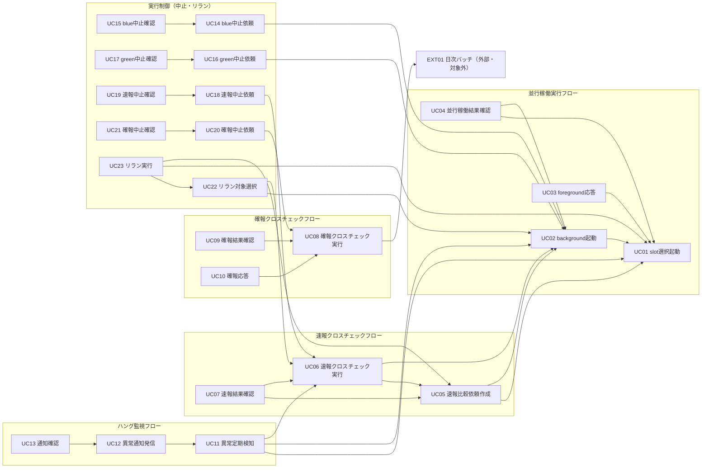

# UC 間依存宣言

本書は、23 UC の spec.md / `_model-summary.yaml`、`_cross-cutting/datastore/rdb-schema.yaml`（used_by）、`_cross-cutting/api/cli-command-contract.yaml`、`_cross-cutting/api/audit-event-contract.yaml` から抽出した UC 間の暗黙依存を明示的に宣言する。

- 目的: ある UC の処理が「別 UC が作った状態・レコード・成果物」を前提にしている関係を実装前に可視化し、「参照先が存在しない」で統合が落ちることを防ぐ。
- 依存種別の定義:
  - **実行順序依存**: 依存先 UC（または外部プロセス）が先に完了・実行していなければ、依存元 UC が業務として成立しない関係。
  - **データ依存**: 依存元 UC が、依存先 UC の INSERT/UPDATE したテーブル行・ファイルを SELECT/参照する関係。
  - **契約依存**: テーブル行そのものではなく、依存先が確立した契約（監査イベントの hash-chain 先頭、feature flag の意味論、Runner Result Contract の 3 ファイル等）に従う関係。
- 表の「依存元 UC」は読む側・後段、「依存先 UC」は書く側・前段を表す（依存元 → 依存先 の向きは「〜を前提とする」）。
- 「依存が満たされない場合の挙動」は各 UC spec.md の BDD シナリオと cli-command-contract.yaml の exit_codes に基づく。仕様に記載がない場合は「仕様未定義」と明記する。
- 確報比較依頼（`final_crosscheck_requests`）の REQUESTED 行の生成は、本仕様群の対象外である外部の日次バッチが担う（UC「全テーブル・全ファイルを対象に確報クロスチェックを実行する」spec.md の前提条件）。本書では外部依存 EXT01 として扱う。

## 依存関係サマリ（mermaid graph）



凡例（ノード ID → UC 名 / tier / CLI コマンド）:

| ID | UC 名 | tier | CLI コマンド |
|---|---|---|---|
| UC01 | feature flag設定に基づきslotを選択して起動する | tier-facade | `relaygate concurrent-run select-slot` |
| UC02 | background roleを起動する | tier-facade + tier-worker | `relaygate concurrent-run start-background` / `relaygate worker start-background-execution` |
| UC03 | foreground roleの標準出力・標準エラー・終了コードを応答する | tier-facade | `relaygate concurrent-run respond-foreground` |
| UC04 | 並行稼働実行結果を確認する | tier-facade | `relaygate concurrent-run result` |
| UC05 | blue/green runnerの完了通知を受けて速報比較依頼を作成する | tier-worker | `relaygate rapid-crosscheck create` |
| UC06 | 速報クロスチェックを実行し差分を検知する | tier-worker | `relaygate rapid-crosscheck run` |
| UC07 | 速報クロスチェック結果を確認する | tier-worker | `relaygate rapid-crosscheck result` |
| UC08 | 全テーブル・全ファイルを対象に確報クロスチェックを実行する | tier-worker | `relaygate final-crosscheck run` |
| UC09 | 確報クロスチェック結果を確認する | tier-worker | `relaygate final-crosscheck result` |
| UC10 | 確報クロスチェック結果をstdout/stderr/exitcodeで応答する | tier-worker | `relaygate final-crosscheck respond` |
| UC11 | background実行の未完了・非0終了・速報比較異常を定期検知する | tier-worker | `relaygate hang-watch detect` |
| UC12 | ハング疑い・異常を運用者へ通知する | tier-worker | `relaygate hang-watch notify` |
| UC13 | ハング疑い・異常の通知を確認する | tier-worker | `relaygate hang-watch notice` |
| UC14 | blue background実行の中止を依頼する | tier-facade | `relaygate abort blue request` |
| UC15 | 対話確認のうえblue background実行をABORTEDへ遷移させる | tier-facade | `relaygate abort blue confirm` |
| UC16 | green background実行の中止を依頼する | tier-facade | `relaygate abort green request` |
| UC17 | 対話確認のうえgreen background実行をABORTEDへ遷移させる | tier-facade | `relaygate abort green confirm` |
| UC18 | RUNNING中の速報比較依頼の中止を依頼する | tier-worker | `relaygate abort rapid-crosscheck request` |
| UC19 | 対話確認のうえ速報比較依頼をABORTEDへ遷移させる | tier-worker | `relaygate abort rapid-crosscheck confirm` |
| UC20 | RUNNING中の確報比較依頼の中止を依頼する | tier-worker | `relaygate abort final-crosscheck request` |
| UC21 | 対話確認のうえ確報比較依頼をABORTEDへ遷移させる | tier-worker | `relaygate abort final-crosscheck confirm` |
| UC22 | 再実行対象のbackground実行・速報比較依頼を選択する | tier-facade / tier-worker（dispatch） | `relaygate rerun select` |
| UC23 | execution-spec.jsonの実行設定を保ったまま再実行する | tier-facade / tier-worker（dispatch） | `relaygate rerun run` |
| EXT01 | 日次バッチ（確報比較依頼の作成。本仕様群の対象外の外部プロセス） | - | - |

## 依存宣言一覧

| # | 依存元 UC | 依存先 UC | 依存種別 | 依存する対象 | 依存が満たされない場合の挙動 |
|---|---|---|---|---|---|
| 1 | background roleを起動する | feature flag設定に基づきslotを選択して起動する | 実行順序 + データ | `execution_specs` / `slot_execution_specs` の当該 run_id 行、`runner_results` の (run_id, slot_type, role_type='background', attempt_id) の STARTING 行 | background対象slotが存在しない・execution spec未確定の場合は業務エラーで exit 1（stderr「background対象のslotが存在しません」）。対象試行が STARTING（UC01 が起動イベント送出済み）なら worker は再送出せず起動確認のみ、FAILED/UNKNOWN（UC01 の補償記録）または RUNNING 以降なら exit 1（stderr「background対象slotの起動試行がSTARTINGではありません」） |
| 2 | background roleを起動する（worker側） | background roleを起動する（facade側） | 契約依存 | facade→worker の起動トリガー（run_id, slot_type。`RELAYGATE_WORKER_TRIGGER_ENDPOINT` 経由） | トリガー未達時は worker 側処理が開始されない（トリガー欠落時の再送・検知は仕様未定義。STARTING滞留はUC11のハング疑い検知に委ねられる。STARTING 滞留のうち起動イベント送出失敗/timeout は UC01 が FAILED/UNKNOWN へ補償記録済み）。background slot への起動イベント（SSH）の送出主体は UC01 であり、UC02 worker は STARTING 行が存在する試行へは再送出しない（同一試行への送出は 1 回） |
| 3 | foreground roleの標準出力・標準エラー・終了コードを応答する | feature flag設定に基づきslotを選択して起動する | 実行順序 + データ | `runner_results` の role_type='foreground' の最新試行（attempt_no 最大）行と、その stdout_path / stderr_path / exit_code（Runner Result Contract: stdout.log / stderr.log / exitcode.txt）、`execution_specs.hang_detect_limit_minutes`（foreground 完了待機の上限） | 対象行が無い場合は待機せず exit 125（relay-gate 退避コード。stderr「foreground実行結果を特定できません: run_id=…」）。STARTING/RUNNING は wait_contract（hang_detect_limit_minutes を上限にポーリング）で待機し、上限超過・UNKNOWN・ABORTED・FAILED かつ exit_code=NULL（起動イベント送出失敗の補償記録）は exit 125（UNKNOWN を推測で FAILED 相当に変換しない） |
| 4 | 並行稼働実行結果を確認する | feature flag設定に基づきslotを選択して起動する / background roleを起動する | データ | `execution_specs`（job_id→run_id解決）、`slot_execution_specs`、`runner_results`、`runner_result_events`、`audit_logs`（run_id, occurred_at順） | 該当データなしは exit 1（stderr「該当するRunner実行結果が見つかりません」） |
| 5 | blue/green runnerの完了通知を受けて速報比較依頼を作成する | background roleを起動する | 実行順序 + データ | `runner_results` の blue/green 双方の (run_id, slot_type, role_type='background', attempt_id) 行が status IN ('SUCCEEDED','FAILED') で確定していること | ペア不成立（片方のみ完了・UNKNOWN・ABORTED）の場合は依頼を作成せず次回 CronJob サイクルで再判定（exit 0、0件処理） |
| 6 | blue/green runnerの完了通知を受けて速報比較依頼を作成する | feature flag設定に基づきslotを選択して起動する | データ + 契約 | `execution_specs.job_id`（runner_resultsにjob_id属性が無いためrun_idでJOIN）、`rapid_crosscheck_requests.blue_run_id/green_run_id` の FK 参照先（execution_specs.run_id）、feature flag `RAPID_CROSSCHECK_MODE` の意味論（off時は依頼を作成しない） | execution_specs 行が無い場合 JOIN 不成立で当該試行はペアリング対象外（明示のエラー仕様なし＝仕様未定義）。RAPID_CROSSCHECK_MODE=off は作成0件で exit 0 |
| 7 | 速報クロスチェックを実行し差分を検知する | blue/green runnerの完了通知を受けて速報比較依頼を作成する | 実行順序 + データ | `rapid_crosscheck_requests` の status='REQUESTED' 行（lease/claim 取得対象。比較対象4項目 blue_run_id/blue_attempt_id/green_run_id/green_attempt_id を含む） | REQUESTED行が0件なら「対象なし」で正常終了 exit 0 |
| 8 | 速報クロスチェックを実行し差分を検知する | background roleを起動する | データ | `runner_results` の比較対象4項目で特定される2行（stdout_path/stderr_path/exit_code/status） | 比較対象が揃っていない場合は比較を実行せず stderr「比較対象のRunner実行結果が揃っていません」を記録し、status='CLAIMED' のまま次回 lease 失効判定に委ねる |
| 9 | 速報クロスチェック結果を確認する | blue/green runnerの完了通知を受けて速報比較依頼を作成する / 速報クロスチェックを実行し差分を検知する | データ | `rapid_crosscheck_requests`（job_id/run_id検索）と `rapid_crosscheck_results`（run_id JOIN。comparison_result/diff_count/diff_detail_uri） | 依頼が存在しない場合は exit 1（stderr「対象job_idの速報比較依頼が見つかりません」）。依頼のみで結果未作成の場合は状態表示のみ（LEFT JOIN） |
| 10 | 全テーブル・全ファイルを対象に確報クロスチェックを実行する | EXT01 日次バッチ（外部・本仕様群対象外） | 実行順序 + データ | `final_crosscheck_requests` の status='REQUESTED' 行（target_date/target_tables/target_files）。FK により当該 run_id の `execution_specs` 行の存在も前提（rdb-schema.yaml: ON DELETE RESTRICT） | REQUESTED行が0件なら「対象依頼なし」で正常終了 exit 0 |
| 11 | 確報クロスチェック結果を確認する | 全テーブル・全ファイルを対象に確報クロスチェックを実行する（および EXT01） | データ | `final_crosscheck_requests` の target_date 指定行（run_id/status/lease_expires_at/worker_id） | 対象日の依頼が存在しない場合は exit 1（stderr「確報比較依頼が見つかりません」）。未完了（REQUESTED/CLAIMED/RUNNING）は未完了として表示（exit 0） |
| 12 | 確報クロスチェック結果をstdout/stderr/exitcodeで応答する | 全テーブル・全ファイルを対象に確報クロスチェックを実行する | 実行順序 + データ | `final_crosscheck_requests.status` が SUCCEEDED/FAILED に確定済みであること | status 未確定（RUNNING等）の場合は exit 1（stderr「確報クロスチェックが未完了です」）。SUCCEEDED=exit 0 / FAILED=exit 1 |
| 13 | background実行の未完了・非0終了・速報比較異常を定期検知する | background roleを起動する | データ | `runner_results` の status IN ('STARTING','RUNNING','UNKNOWN') AND role_type='background' 行、`runner_result_events` への履歴追記対象、Runner 実行結果ファイル（started-at.txt/exitcode.txt）。STARTING 行は起動イベント送出に成功した試行のみ（送出失敗/timeout は UC01 が FAILED/UNKNOWN 済み） | 対象0件なら検知0件で exit 0。実行結果ファイル回収不能時は UNKNOWN 確定（推測でFAILEDを確定しない） |
| 14 | background実行の未完了・非0終了・速報比較異常を定期検知する | feature flag設定に基づきslotを選択して起動する | データ | `execution_specs.hang_detect_limit_minutes`（run 共通の 1 値。background role に選ばれた slot のジョブマップ値。ハング疑い判定しきい値として hang_detections.threshold_minutes へ引き継ぐ） | execution_specs 行が無い runner_results 行は FK 制約上存在しない（スキーマで担保）。しきい値未取得時の挙動は仕様未定義 |
| 15 | background実行の未完了・非0終了・速報比較異常を定期検知する | 速報クロスチェックを実行し差分を検知する | データ | `rapid_crosscheck_results` の comparison_result='NG' 行 | NG行が0件なら速報クロスチェック異常の検知は発生しない（exit 0） |
| 16 | ハング疑い・異常を運用者へ通知する | background実行の未完了・非0終了・速報比較異常を定期検知する | 実行順序 + データ | `hang_detections` の notified_at IS NULL 行 | 未通知行が0件なら「通知対象なし」で exit 0 |
| 17 | ハング疑い・異常の通知を確認する | ハング疑い・異常を運用者へ通知する | データ | `hang_detections` の notified_at IS NOT NULL 行（検知日時降順） | 該当なしの場合は「該当するハング検知記録はありません」を出力し exit 0（未通知行は表示対象外） |
| 18 | blue background実行の中止を依頼する | background roleを起動する | データ | `runner_results` の (run_id, slot_type='blue', role_type='background') 行が status='RUNNING' であること | 対象なしは exit 1（「該当するblue background実行が見つかりません」）。RUNNING以外は exit 1（abort_requested を outcome='rejected' で記録） |
| 19 | 対話確認のうえblue background実行をABORTEDへ遷移させる | blue background実行の中止を依頼する | 実行順序 + 契約 | 中止依頼済みであること（`audit_logs` の abort_requested 行と `audit_chain_heads` の run_id 行=hash-chain 先頭）、および runner_results が RUNNING のままであること | 中止依頼未済は業務エラー exit 1（cli-command-contract.yaml: abort blue confirm exit 1「中止依頼未済」）。非TTYで--yes未指定は exit 2 |
| 20 | green background実行の中止を依頼する | background roleを起動する | データ | `runner_results` の (run_id, slot_type='green', role_type='background') 行が status='RUNNING' であること | 対象なし・完了済みは exit 1（abort_requested を outcome='rejected' で記録） |
| 21 | 対話確認のうえgreen background実行をABORTEDへ遷移させる | green background実行の中止を依頼する | 実行順序 + 契約 | 中止依頼済みであること（`audit_logs` abort_requested + `audit_chain_heads`）、runner_results が RUNNING のままであること | 中止依頼未済は業務エラー exit 1（cli-command-contract.yaml: abort green confirm exit 1「中止依頼未済」）。非TTYで--yes未指定は exit 2 |
| 22 | RUNNING中の速報比較依頼の中止を依頼する | 速報クロスチェックを実行し差分を検知する | 実行順序 + データ | `rapid_crosscheck_requests` の status='RUNNING' 行（RUNNINGへ遷移させるのはUC06） | 対象未存在・RUNNING以外は exit 1（abort_requested を outcome='rejected' で記録） |
| 23 | 対話確認のうえ速報比較依頼をABORTEDへ遷移させる | RUNNING中の速報比較依頼の中止を依頼する | 実行順序 | 前UCで中止依頼を受理済みであること（spec.md 概要）。UPDATE は WHERE status='RUNNING' の条件付きで実行 | 対象未存在・状態競合（更新件数0）は exit 1。中止依頼未済そのものの検査は cli 契約の exit_codes に明記なし（仕様未定義。状態競合として exit 1 に包含） |
| 24 | RUNNING中の確報比較依頼の中止を依頼する | 全テーブル・全ファイルを対象に確報クロスチェックを実行する | 実行順序 + データ | `final_crosscheck_requests` の status='RUNNING' 行（RUNNINGへ遷移させるのはUC08） | 対象未存在・RUNNING以外は exit 1（abort_requested を outcome='rejected' で記録） |
| 25 | 対話確認のうえ確報比較依頼をABORTEDへ遷移させる | RUNNING中の確報比較依頼の中止を依頼する | 実行順序 | 前UCで中止依頼を受理済みであること（spec.md 概要）。UPDATE は WHERE status='RUNNING' の条件付きで実行 | 対象未存在・状態競合（更新件数0）は exit 1。中止依頼未済そのものの検査は cli 契約の exit_codes に明記なし（仕様未定義。状態競合として exit 1 に包含） |
| 26 | 再実行対象のbackground実行・速報比較依頼を選択する（--target background） | background roleを起動する（および UC11/UC15/UC17 による終了状態確定） | データ | `runner_results` の role_type='background' AND status IN ('SUCCEEDED','FAILED','UNKNOWN','ABORTED') 行 | 候補0件は「該当するリラン候補はありません」で exit 0 |
| 27 | 再実行対象のbackground実行・速報比較依頼を選択する（--target rapid-crosscheck） | 速報クロスチェックを実行し差分を検知する / 対話確認のうえ速報比較依頼をABORTEDへ遷移させる | データ | `rapid_crosscheck_requests` の status IN ('SUCCEEDED','FAILED','ABORTED') 行 | 候補0件は exit 0。--status UNKNOWN 指定は exit 2（速報比較依頼状態にUNKNOWNは存在しない） |
| 28 | execution-spec.jsonの実行設定を保ったまま再実行する（--target background） | feature flag設定に基づきslotを選択して起動する | データ | 元 run の `execution_specs` / `slot_execution_specs` 行（設定復元元）と `runner_results` の終了状態（リラン不可条件判定）。`slot_execution_specs.job_map_version`（slot 別）、fixed_args / additional_args（JSON 配列。要素順のまま復元） | 元の execution spec が無い場合は exit 1（stderr「元のexecution specが見つかりません」）。対象がSTARTING/RUNNING中・slot mode foreground/off・未対応role も exit 1 |
| 29 | execution-spec.jsonの実行設定を保ったまま再実行する（--target rapid-crosscheck） | blue/green runnerの完了通知を受けて速報比較依頼を作成する（元依頼の作成元） | データ | 元依頼の `rapid_crosscheck_requests` 行（status IN ('SUCCEEDED','FAILED','ABORTED')、比較対象4項目の複製元） | 対象未存在は exit 1。元依頼が REQUESTED/CLAIMED/RUNNING 中は exit 1（重複起動防止） |
| 30 | execution-spec.jsonの実行設定を保ったまま再実行する | 再実行対象のbackground実行・速報比較依頼を選択する | 実行順序 | 選定結果の run_id（UC22 の stdout 候補一覧が UC23 の `--run-id` 入力となる） | UC22 を経ずに直接 run_id 指定しても実行可能（CLI 契約上は独立コマンド）。不正な run_id は #28/#29 の挙動に帰着 |
| 31 | background roleを起動する（worker側） | feature flag設定に基づきslotを選択して起動する | 契約依存 | `slot_execution_specs.credential_ref` の解決契約（cli-command-contract.yaml credential_resolution: RELAYGATE_CREDENTIAL_DIR/{credential_ref}、null 時は RELAYGATE_SSH_KEY_PATH）と fixed_args/additional_args の JSON 配列復元規則（rdb-schema.yaml argument_serialization） | 認証情報を解決できない場合は exit 1（stderr「SSH認証情報を解決できません: credential_ref=…」）。鍵の実値は出力しない |
| 32 | execution-spec.jsonの実行設定を保ったまま再実行する（--target background） | feature flag設定に基づきslotを選択して起動する | 契約依存 | `slot_execution_specs.credential_ref` の解決契約（cli-command-contract.yaml credential_resolution: RELAYGATE_CREDENTIAL_DIR/{credential_ref}、null 時は RELAYGATE_SSH_KEY_PATH）と fixed_args/additional_args の JSON 配列復元規則（rdb-schema.yaml argument_serialization） | 認証情報を解決できない場合は exit 1（stderr「SSH認証情報を解決できません: credential_ref=…」）。鍵の実値は出力しない |

補足（契約依存の共通事項）:

- 監査イベントを追記する全 UC（UC01/UC02/UC11/UC14〜UC21/UC23）は `audit-event-contract.yaml` の hash-chain lock 契約（`audit_chain_heads` の run_id 行を SELECT ... FOR UPDATE → `audit_logs` INSERT → head 更新を同一 transaction）に依存する。行が存在しない場合は当該 run_id の最初のイベントとして新規作成し previous_hash=NULL とするため、チェーン先頭の不在は依頼未済の検出には使えるが追記自体のエラーにはならない。
- 起動系 UC（UC01/UC02/UC23 background）は起動前監査ゲートに依存する: 起動前トランザクションが commit できない場合は外部 slot を起動せず exit 1。

## UC 別の依存前提

### feature flag設定に基づきslotを選択して起動する（UC01）
- 前提: 他 UC の成果物を参照しない（エントリポイント）。ジョブスケジューラからの起動契機、slot ごとの独立したジョブマップ（RELAYGATE_JOB_MAP_PATH_BLUE / _GREEN。起動対象 slot の分だけ読む）、認証情報ディレクトリ（RELAYGATE_CREDENTIAL_DIR）、feature flag 環境変数 BLUE_MODE/GREEN_MODE/RAPID_CROSSCHECK_MODE、RELAYGATE_OPERATOR のみを前提とする
- 後続 UC へ提供するもの: `execution_specs`（run_id/parent_run_id/job_id/hang_detect_limit_minutes）、`slot_execution_specs`（job_map_version を含む slot 別実行設定）、`runner_results`/`runner_result_events` の STARTING 行、送出失敗/timeout の補償記録（FAILED/UNKNOWN）と `audit_logs` の slot_launch_failed/slot_launch_timeout、`audit_logs` の slot_launch_accepted/slot_launch_attempted と `audit_chain_heads` の chain 先頭

### background roleを起動する（UC02）
- 前提: UC01 が確定した `execution_specs` / `slot_execution_specs` の当該 run_id 行、および background 対象 slot の `runner_results` STARTING 行（#1、#2）
- 後続 UC へ提供するもの: `runner_results`/`runner_result_events` の RUNNING/FAILED/UNKNOWN 遷移（UC05/UC06/UC11/UC14/UC16/UC22 の入力）、`audit_logs` の slot_launch_succeeded/failed/timeout

### foreground roleの標準出力・標準エラー・終了コードを応答する（UC03）
- 前提: UC01 が作成した role_type='foreground' の `runner_results` 行と、その status が SUCCEEDED/FAILED に確定していること、および `execution_specs.hang_detect_limit_minutes`（待機上限）（#3）
- 責務: STARTING/RUNNING の間は wait_contract に従い hang_detect_limit_minutes を上限にポーリングして完了を待機する（CLI 10 秒は確定後の応答処理に適用）
- 後続 UC へ提供するもの: ジョブスケジューラへの stdout/stderr/exitcode 応答のみ（DB への書込みなし）

### 並行稼働実行結果を確認する（UC04）
- 前提: UC01/UC02（および状態を確定させる UC11、ABORTED を確定させる UC15/UC17）が書いた `execution_specs` / `slot_execution_specs` / `runner_results` / `runner_result_events` / `audit_logs`（#4）
- 後続 UC へ提供するもの: なし（参照専用。移行運用責任者の判断材料）

### blue/green runnerの完了通知を受けて速報比較依頼を作成する（UC05）
- 前提: UC02 の background 実行完了（blue/green ペアの SUCCEEDED/FAILED 確定）と UC01 の `execution_specs.job_id`（#5、#6）。feature flag RAPID_CROSSCHECK_MODE=on
- 後続 UC へ提供するもの: `rapid_crosscheck_requests` の REQUESTED 行（UC06/UC07/UC23 rapid の入力）

### 速報クロスチェックを実行し差分を検知する（UC06）
- 前提: UC05 の REQUESTED 行、UC02 の比較対象 `runner_results` 2 行（#7、#8）
- 後続 UC へ提供するもの: `rapid_crosscheck_requests` の RUNNING/SUCCEEDED/FAILED 遷移（UC18/UC22 rapid の入力）、`rapid_crosscheck_results`（UC07/UC11 の入力）

### 速報クロスチェック結果を確認する（UC07）
- 前提: UC05 の依頼行、UC06 の結果行（#9）
- 後続 UC へ提供するもの: なし（参照専用。障害調査担当者の判断材料）

### 全テーブル・全ファイルを対象に確報クロスチェックを実行する（UC08）
- 前提: 外部の日次バッチ EXT01 が作成した `final_crosscheck_requests` の REQUESTED 行（target_tables/target_files 含む）。FK により当該 run_id の `execution_specs` 行も存在していること（#10）
- 後続 UC へ提供するもの: `final_crosscheck_requests` の RUNNING/SUCCEEDED/FAILED 遷移と completed_at（UC09/UC10/UC20 の入力）

### 確報クロスチェック結果を確認する（UC09）
- 前提: EXT01 の依頼行と UC08 の状態確定（#11）
- 後続 UC へ提供するもの: なし（参照専用。リリース判断者の正本参照）

### 確報クロスチェック結果をstdout/stderr/exitcodeで応答する（UC10）
- 前提: UC08 による status の SUCCEEDED/FAILED 確定（#12）
- 後続 UC へ提供するもの: ジョブスケジューラへの stdout/stderr/exitcode 応答のみ（DB への書込みなし）

### background実行の未完了・非0終了・速報比較異常を定期検知する（UC11）
- 前提: UC02 の `runner_results`（STARTING/RUNNING の background 試行）と Runner 実行結果ファイル、UC01 の `hang_detect_limit_minutes`、UC06 の `rapid_crosscheck_results` NG 行（#13、#14、#15）
- 後続 UC へ提供するもの: `hang_detections`（UC12/UC13 の入力）、`runner_results`/`runner_result_events` の SUCCEEDED/FAILED/UNKNOWN 確定（UC03/UC05/UC22 の完了判定の供給源）、`audit_logs` の slot_final_status

### ハング疑い・異常を運用者へ通知する（UC12）
- 前提: UC11 が作成した `hang_detections` の未通知行（notified_at IS NULL）（#16）
- 後続 UC へ提供するもの: `hang_detections.notified_at` の更新（UC13 の表示対象条件）

### ハング疑い・異常の通知を確認する（UC13）
- 前提: UC12 が notified_at を設定した `hang_detections` 行（#17）
- 後続 UC へ提供するもの: なし（参照専用。運用者が中止依頼・リラン等の対応要否を判断する材料＝UC14/UC16/UC18/UC20/UC22 への人手による橋渡し）

### blue background実行の中止を依頼する（UC14）
- 前提: UC02 起点の blue background 試行が `runner_results` で RUNNING であること（#18）
- 後続 UC へ提供するもの: `audit_logs` の abort_requested（UC15 の「中止依頼済み」前提）、blue実装への中止依頼イベント

### 対話確認のうえblue background実行をABORTEDへ遷移させる（UC15）
- 前提: UC14 の中止依頼済み状態（audit_logs abort_requested + audit_chain_heads）と RUNNING の `runner_results` 行（#19）
- 後続 UC へ提供するもの: `runner_results`/`runner_result_events` の ABORTED 確定（UC04 の表示、UC22 のリラン候補）、`audit_logs` の abort_confirmed

### green background実行の中止を依頼する（UC16）
- 前提: UC02 起点の green background 試行が `runner_results` で RUNNING であること（#20）
- 後続 UC へ提供するもの: `audit_logs` の abort_requested（UC17 の前提）、green実装への中止依頼イベント

### 対話確認のうえgreen background実行をABORTEDへ遷移させる（UC17）
- 前提: UC16 の中止依頼済み状態と RUNNING の `runner_results` 行（#21）
- 後続 UC へ提供するもの: `runner_results`/`runner_result_events` の ABORTED 確定（UC04/UC22 の入力）、`audit_logs` の abort_confirmed

### RUNNING中の速報比較依頼の中止を依頼する（UC18）
- 前提: UC05 が作成し UC06 が RUNNING へ遷移させた `rapid_crosscheck_requests` 行（#22）
- 後続 UC へ提供するもの: `audit_logs` の abort_requested（UC19 の前提。状態遷移は行わない）

### 対話確認のうえ速報比較依頼をABORTEDへ遷移させる（UC19）
- 前提: UC18 の中止依頼受理と、UPDATE 時点で status='RUNNING' が維持されていること（#23）
- 後続 UC へ提供するもの: `rapid_crosscheck_requests` の ABORTED 確定（UC22/UC23 rapid のリラン候補）、`audit_logs` の abort_confirmed

### RUNNING中の確報比較依頼の中止を依頼する（UC20）
- 前提: EXT01 が作成し UC08 が RUNNING へ遷移させた `final_crosscheck_requests` 行（#24）
- 後続 UC へ提供するもの: `audit_logs` の abort_requested（UC21 の前提。状態遷移は行わない）

### 対話確認のうえ確報比較依頼をABORTEDへ遷移させる（UC21）
- 前提: UC20 の中止依頼受理と、UPDATE 時点で status='RUNNING' が維持されていること（#25）
- 後続 UC へ提供するもの: `final_crosscheck_requests` の ABORTED 確定（UC09 の表示対象）、`audit_logs` の abort_confirmed

### 再実行対象のbackground実行・速報比較依頼を選択する（UC22）
- 前提: --target background では UC02（および終了状態を確定させる UC11/UC15/UC17）による `runner_results` の終了状態行。--target rapid-crosscheck では UC06/UC19 による `rapid_crosscheck_requests` の終了状態行（#26、#27）
- 後続 UC へ提供するもの: リラン候補一覧（stdout）。UC23 の `--run-id` 入力の選定材料（DB への書込みなし）

### execution-spec.jsonの実行設定を保ったまま再実行する（UC23）
- 前提: --target background では UC01 の元 run の `execution_specs` / `slot_execution_specs` と `runner_results` の終了状態（#28）。--target rapid-crosscheck では元依頼の `rapid_crosscheck_requests` 行が終了状態であること（#29）。実行順序としては UC22 の候補選定が先行する（#30。直接 run_id 指定も可能）
- 後続 UC へ提供するもの: 新 run_id（parent_run_id=元run_id）の `execution_specs` / `slot_execution_specs` / `runner_results` STARTING 行（以後 UC02 以降と同じ連鎖に合流）、または新 run_id の `rapid_crosscheck_requests` REQUESTED 行（UC06 の入力）、`audit_logs` の rerun_requested / rerun_accepted

## UC 横断統合シナリオ

CR-6078c4ed-013 により UC01 の Scenario から移した統合シナリオである。依存先: UC01（起動受付・送出順序）、UC02（green の STARTING→RUNNING）、UC03（foreground 完了待機と応答）。
検証場所は UC 横断の統合テスト（features/uc または features/atdd）とし、単一 UC のテストにハーネス注入で成立させない。
単一 UC の tier 実装だけでは成立しないため、各 UC の spec.md には置かない。

```gherkin
Feature: 並行稼働の統合シナリオ（UC01 + UC02 + UC03。単一 UC の tier 実装だけでは成立しない）

  Scenario: background roleを先に起動しforeground待機中もbackgroundが並走する
    Given 環境変数に BLUE_MODE=foreground, GREEN_MODE=background, RAPID_CROSSCHECK_MODE=on, RELAYGATE_OPERATOR=ops-tanaka が設定され、UC01 の E2E Background と同じ slot 別ジョブマップ・認証情報ディレクトリが用意されている
    And run_id発番が "3f8c9d2e-5b41-4a7e-9c13-6d2a8b0f1e57" を、attempt_id発番が blue="att-blue-0001" / green="att-green-0001" を返すよう固定されている
    And blue実装のforeground実行が完了まで60秒かかり終了コード0で終了する状態である
    And UC02（relaygate concurrent-run start-background → worker start-background-execution）が green の background 起動イベントを受けて RUNNING へ遷移させる状態である
    When 運用者が `relaygate concurrent-run select-slot --job-id daily-settlement` を実行し、続けてジョブスケジューラが `relaygate concurrent-run respond-foreground --run-id 3f8c9d2e-5b41-4a7e-9c13-6d2a8b0f1e57` を実行する
    Then select-slot は green への background 起動イベント送出を blue への foreground 起動イベント送出より先に完了し、両 slot の完了を待たずに終了コード 0 で終了する
    And respond-foreground が blue foreground 実行の完了を待機している間、runner_results の (run_id="3f8c9d2e-5b41-4a7e-9c13-6d2a8b0f1e57", slot_type="green", role_type="background", attempt_id="att-green-0001") は status="RUNNING" で並走している
    And respond-foreground は blue foreground 実行の完了（status="SUCCEEDED", exit_code=0）を待ってから終了コード 0 で終了し、green background 実行の完了は待たない
```
