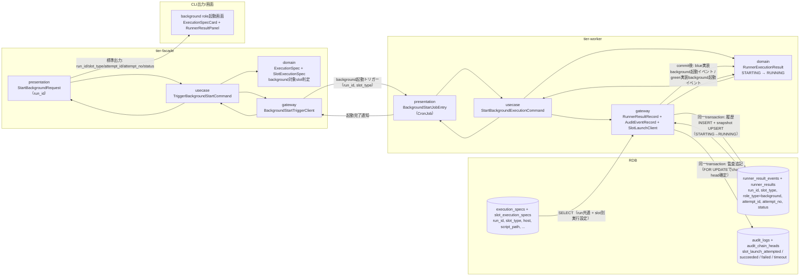

# background roleを起動する

## 概要

foreground roleの実行に先立ち、facade（tier-facade）がbackground役割に割り当てられたslot（blue/green）の起動をトリガーし、実際の非同期実行はworker（tier-worker）が引き受けてRunner実行状態をSTARTINGからRUNNINGへ遷移させる。facadeは起動トリガーの送出とexecution spec（execution_specs + slot_execution_specs）の参照までを担い、workerはCronJob/常駐プロセスとしてRDBのlease/claim機構を用いてbackground実行を開始し、Runner実行結果を履歴（runner_result_events）とsnapshot（runner_results）へ同一transactionで記録する。外部slot起動前の監査イベント追記がcommitできない場合は起動しない（起動前監査ゲート）。

## データフロー



| レイヤー | データモデル | 変換内容 |
|---------|------------|---------|
| facade presentation | StartBackgroundRequest(run_id) | execution_specs + slot_execution_specsからbackground対象slotを特定しCommand変換 |
| facade usecase | TriggerBackgroundStartCommand | background起動トリガー送出のフロー制御 |
| worker presentation | BackgroundStartJobEntry | CronJob/常駐プロセスのエントリポイント。トリガー受領 |
| worker gateway | runner_result_eventsへの履歴INSERT + runner_resultsのsnapshot UPSERT（同一transaction）、audit_logs + audit_chain_headsの追記 | 起動試行（run_id, slot_type, role_type, attempt_id）の状態記録と監査追記 |
| Response | run_id・slot_type・attempt_id・attempt_no・実行状態 | 並行稼働実行結果確認UCへの入力となる |

## 処理フロー

```mermaid
sequenceDiagram
  actor User as 運用者

  box rgb(240,255,240) tier-facade
    participant FPres as presentation
    participant FUC as usecase
    participant FDomain as domain
    participant FGW as gateway
  end

  box rgb(255,245,230) tier-worker
    participant WPres as presentation
    participant WUC as usecase
    participant WDomain as domain
    participant WGW as gateway
  end

  participant DB as RDB
  participant Green as green実装

  User->>FPres: relaygate concurrent-run start-background --run-id 3f8c9d2e-5b41-4a7e-9c13-6d2a8b0f1e57
  FPres->>FPres: CLI引数バリデーション（run_id必須）
  FPres->>FUC: TriggerBackgroundStartCommand(run_id="3f8c9d2e-5b41-4a7e-9c13-6d2a8b0f1e57")
  FUC->>FDomain: execution_specs + slot_execution_specsからbackground対象slot判定
  FDomain-->>FUC: slot_type="green"（例: GREEN_MODE=background）
  FUC->>FGW: background起動トリガー送出
  FGW->>WPres: トリガー受領（run_id, slot_type=green）
  WPres->>WUC: StartBackgroundExecutionCommand(run_id, slot_type=green)
  WUC->>WGW: 起動前記録（起動前監査ゲート）
  WGW->>DB: BEGIN → runner_result_events INSERT（event_name='attempt_started', attempt_id='att-green-0001', attempt_no=1, status='STARTING'。既存試行は一意制約で冪等スキップ）+ runner_results UPSERT（status='STARTING', accepted_at）
  WGW->>DB: SELECT ... FOR UPDATE audit_chain_heads(run_id) → audit_logs INSERT（slot_launch_attempted）→ audit_chain_heads更新 → COMMIT
  Note over WGW,DB: このtransactionがcommitできない場合は外部slotを起動しない
  WGW->>Green: 起動確認（SSH経由でstarted-at.txtを回収。起動イベントは起動UC「feature flag設定に基づきslotを選択して起動する」が送出済み。runner_results行が無かった場合に限りここで起動イベントを送出: 秘密鍵はcredential_refから解決、argvはfixed_args+additional_argsを要素順のまま連結）
  alt 起動確認成功
    WGW->>DB: 同一transaction: runner_result_events INSERT（event_name='attempt_running', status='RUNNING', started_at）+ runner_results UPDATE（status='RUNNING', started_at）
    WGW->>DB: audit_logs INSERT（slot_launch_succeeded）+ audit_chain_heads更新
  else SSH接続失敗（起動確認不能）
    WGW->>DB: 同一transaction: runner_result_events INSERT（event_name='attempt_failed', status='FAILED'）+ runner_results UPDATE（status='FAILED'）
    WGW->>DB: audit_logs INSERT（slot_launch_failed, error_code）+ audit_chain_heads更新
  else SSH起動確認タイムアウト
    WGW->>DB: 同一transaction: runner_result_events INSERT（event_name='attempt_unknown', status='UNKNOWN'）+ runner_results UPDATE（status='UNKNOWN'）
    WGW->>DB: audit_logs INSERT（slot_launch_timeout）+ audit_chain_heads更新
    Note over WGW,DB: 結果取得不能はUNKNOWNとし推測でFAILEDを確定しない
  end
  WGW-->>WUC: 起動結果
  WUC-->>WPres: 起動完了通知
  WPres-->>FGW: 起動完了応答
  FGW-->>FUC: 起動完了
  FUC-->>FPres: 起動結果
  FPres-->>User: 標準出力: "background起動: run_id=3f8c9d2e-5b41-4a7e-9c13-6d2a8b0f1e57 slot_type=green attempt_id=att-green-0001 attempt_no=1 status=STARTING"、終了コード0
```



## バリエーション一覧

| バリエーション名 | 値 | 処理内容 | 適用 tier | 適用箇所 |
|----------------|---|---------|----------|---------|
| slotモード（BLUE_MODE/GREEN_MODE） | off、background、foreground | background指定されたslotのみ本UCの起動対象とする | tier-facade, tier-worker | background起動対象slot判定 |
| slot種別 | blue、green | 起動先実装（blue実装/green実装）とslot別実行設定（slot_execution_specs）を切り替える | tier-worker | SlotLaunchClientの起動先分岐 |

## 分岐条件一覧

| 条件名 | 判定ルール | 適用 tier | 適用箇所 | BDD Scenario |
|--------|----------|----------|---------|-------------|
| 起動前監査ゲート | 起動試行のSTARTING記録（runner_result_events + runner_results）とslot_launch_attempted監査イベントのINSERT・audit_chain_heads更新を同一transactionでcommitできない場合は、外部slotを起動しない | tier-worker | worker start-background-execution の起動前処理 | 起動前監査の追記に失敗した場合は外部slotを起動しない |
| credential_ref解決 | SSH秘密鍵はslot_execution_specs.credential_refから `RELAYGATE_CREDENTIAL_DIR/{credential_ref}`（nullなら `RELAYGATE_SSH_KEY_PATH`）で解決する。正本は `_cross-cutting/api/cli-command-contract.yaml` credential_resolution | tier-worker | SlotLaunchClientのSSH接続 | credential_refからSSH秘密鍵を解決し空白を含む引数を要素順のまま起動する（tier-worker） |
| 引数復元 | 起動引数はslot_execution_specs.fixed_args（JSON配列）にexecution_specs.additional_args（JSON配列）を要素順のまま後置連結したargvとする。正本は `_cross-cutting/datastore/rdb-schema.yaml` argument_serialization | tier-worker | SlotLaunchClientの起動イベント組み立て | 同上 |
| 起動イベントの送出主体 | background slotへの起動イベント（SSH）の送出主体は起動UC「feature flag設定に基づきslotを選択して起動する」である。本UCのworkerは、対象試行のrunner_results行がSTARTING（起動UCが送出済み）の場合は起動イベントを再送出せず、Runner Result Contractのstarted-at.txt回収による起動確認（STARTING→RUNNING）と、回収不能時のFAILED/UNKNOWN判定だけを行う。対象試行の行が存在しない場合に限り、workerがSTARTINGを冪等INSERTして起動イベントを送出する。対象試行が既にFAILED/UNKNOWN（起動UCの補償記録）またはRUNNING以降の場合は再送出せず終了コード1で終了する（同一試行への起動イベント送出は1回だけ） | tier-worker | worker start-background-execution の起動前判定 | 起動UCが補償記録済みの試行は再送出しない |
| 起動結果判定 | 起動確認成功（started-at.txt回収）はRUNNING、起動確認のSSH接続失敗はFAILED、SSH起動確認タイムアウト等の結果取得不能はUNKNOWNとして記録する。UNKNOWNを推測でFAILEDへ確定しない（UNKNOWNからの確定は実結果の回収または対話確認による回復処理でのみ行う） | tier-worker | worker start-background-execution の起動後処理 | SSH起動タイムアウトでUNKNOWNとして記録する |

## 計算ルール一覧

該当なし。

## 状態遷移一覧

| 状態モデル | 遷移元 | 遷移先 | トリガー | 事前条件 | 事後処理 | 適用 tier |
|-----------|--------|--------|---------|---------|---------|----------|
| Runner実行状態 | (未作成) | STARTING | 起動試行の受付（select-slotで未記録の場合の冪等INSERT） | execution_specs + slot_execution_specsが確定済みでbackground対象slotが判定されていること | runner_result_events INSERT（attempt_started）+ runner_results UPSERT + slot_launch_attempted監査追記（同一transaction） | tier-worker |
| Runner実行状態 | STARTING | RUNNING | 外部slot起動の起動確認成功 | STARTING記録がcommit済みであること | runner_result_events INSERT（attempt_running, started_at記録）+ runner_results UPDATE（同一transaction）、slot_launch_succeeded監査追記 | tier-worker |
| Runner実行状態 | STARTING | FAILED | 起動確認のSSH接続失敗（起動イベント送出失敗そのものは起動UCが補償記録する） | 同上 | runner_result_events INSERT（attempt_failed）+ runner_results UPDATE（同一transaction）、slot_launch_failed監査追記 | tier-worker |
| Runner実行状態 | STARTING | UNKNOWN | SSH起動確認タイムアウト等の結果取得不能 | 同上 | runner_result_events INSERT（attempt_unknown）+ runner_results UPDATE（同一transaction）、slot_launch_timeout監査追記。推測でFAILEDを確定しない | tier-worker |

## 関連 RDRA モデル

| モデル種別 | 要素名 | 関連 |
|-----------|--------|------|
| 業務 | 並行稼働実行業務 | このUCが属する業務 |
| BUC | 並行稼働実行フロー | このUCを含むBUC |
| アクター | 運用者 | 操作するアクター |
| 情報 | execution-spec.json、Runner実行結果（started-at.txt/stdout.log/stderr.log/exitcode.txt） | 参照・作成する情報 |
| 状態 | Runner実行状態 | STARTING→RUNNING（起動確認成功時）へ遷移させる |
| 条件 | なし | - |
| 外部システム | blue実装、green実装 | 連携する外部システム（background起動イベント送出先） |

## E2E 完了条件（BDD）

### 正常系

```gherkin
Feature: background roleを起動する

  Scenario: green slotをbackground役割で起動しRUNNINGへ遷移する
    Given execution_specs に run_id="3f8c9d2e-5b41-4a7e-9c13-6d2a8b0f1e57", job_id="daily-settlement", hang_detect_limit_minutes=30 の行が存在する
    And slot_execution_specs に (run_id="3f8c9d2e-5b41-4a7e-9c13-6d2a8b0f1e57", slot_type="green", host="green-host-01", exec_user="batchuser", work_dir="/opt/relaygate/work", impl_version="green-0.9.0", job_map_version="v1.4.0") の行が存在する
    And runner_results に (run_id="3f8c9d2e-5b41-4a7e-9c13-6d2a8b0f1e57", slot_type="green", role_type="background", attempt_id="att-green-0001", attempt_no=1, status="STARTING") の行が存在する
    And 環境変数に RELAYGATE_OPERATOR=ops-tanaka が設定されている
    When 運用者が `relaygate concurrent-run start-background --run-id 3f8c9d2e-5b41-4a7e-9c13-6d2a8b0f1e57` を実行する
    Then 終了コード 0 で終了する
    And runner_results の (run_id="3f8c9d2e-5b41-4a7e-9c13-6d2a8b0f1e57", slot_type="green", role_type="background", attempt_id="att-green-0001") が status="RUNNING", started_at 記録済みへ更新される
    And runner_result_events に同一transactionで event_name="attempt_running", status="RUNNING" の履歴がINSERTされる
    And audit_logs に (run_id="3f8c9d2e-5b41-4a7e-9c13-6d2a8b0f1e57", slot="green", attempt_id="att-green-0001", event_name="slot_launch_succeeded", operation="slot_launch", outcome="succeeded") がINSERTされる
    And 標準出力に "background起動: run_id=3f8c9d2e-5b41-4a7e-9c13-6d2a8b0f1e57 slot_type=green attempt_id=att-green-0001 attempt_no=1 status=STARTING" が出力される

  Scenario: runner終了後にRunner Result Contractの成果物ファイル一式が揃う
    Given execution_specs に run_id="3f8c9d2e-5b41-4a7e-9c13-6d2a8b0f1e57", job_id="daily-settlement", hang_detect_limit_minutes=30 の行が存在する
    And slot_execution_specs に (run_id="3f8c9d2e-5b41-4a7e-9c13-6d2a8b0f1e57", slot_type="green", host="green-host-01", exec_user="batchuser", work_dir="/opt/relaygate/work", impl_version="green-0.9.0", job_map_version="v1.4.0") の行が存在する
    And runner_results に (run_id="3f8c9d2e-5b41-4a7e-9c13-6d2a8b0f1e57", slot_type="green", role_type="background", attempt_id="att-green-0001", attempt_no=1, status="STARTING") の行が存在する
    And green実装のbackground実行が終了コード 0 で完了する状態である
    When 運用者が `relaygate concurrent-run start-background --run-id 3f8c9d2e-5b41-4a7e-9c13-6d2a8b0f1e57` を実行し、green background実行が完了する
    Then 実行ディレクトリ /opt/relaygate/work/3f8c9d2e-5b41-4a7e-9c13-6d2a8b0f1e57/green/att-green-0001/ に execution-spec.json / started-at.txt / stdout.log / stderr.log / exitcode.txt の5ファイルが確定名で揃っている
    And exitcode.txt の内容が "0" である
    And execution-spec.json の run_id が "3f8c9d2e-5b41-4a7e-9c13-6d2a8b0f1e57"、slot_type が "green" である

  Scenario: 成果物を一時ファイルへ出力してから確定名へリネームし書き込み途中を読ませない
    Given execution_specs・slot_execution_specs・runner_results に run_id="3f8c9d2e-5b41-4a7e-9c13-6d2a8b0f1e57" の green/background/att-green-0001（status="STARTING"）一式が存在する
    And green実装のbackground実行が stdout.log へ10MBを出力する状態である
    When 運用者が `relaygate concurrent-run start-background --run-id 3f8c9d2e-5b41-4a7e-9c13-6d2a8b0f1e57` を実行する
    Then 書き込み中の成果物は /opt/relaygate/work/3f8c9d2e-5b41-4a7e-9c13-6d2a8b0f1e57/green/att-green-0001/ 配下の一時ファイル名（例: stdout.log.tmp / exitcode.txt.tmp）にのみ存在し、確定名 stdout.log / exitcode.txt はこの時点で存在しない
    And 実行完了時に一時ファイルが rename（同一ファイルシステム内の原子的リネーム）で確定名へ公開される
    And 確定名 exitcode.txt が存在する時点で内容の書き込みは完了しており、後続処理（完了検知・速報比較依頼作成・ハング監視）が書き込み途中の内容を読むことはない
```

### 異常系

```gherkin
  Scenario: execution specにbackground対象slotが存在しない
    Given execution_specs に run_id="3f8c9d2e-5b41-4a7e-9c13-6d2a8b0f1e57" の行が存在する
    And slot_execution_specs に (run_id="3f8c9d2e-5b41-4a7e-9c13-6d2a8b0f1e57", slot_type="green") の行のみが存在し、runner_results に role_type="background" の行が存在しない（BLUE_MODE=off, GREEN_MODE=foregroundで確定済み）
    When 運用者が `relaygate concurrent-run start-background --run-id 3f8c9d2e-5b41-4a7e-9c13-6d2a8b0f1e57` を実行する
    Then 終了コード 1 で終了する
    And 標準エラーに "background対象のslotが存在しません: run_id=3f8c9d2e-5b41-4a7e-9c13-6d2a8b0f1e57" が出力される

  Scenario: 起動先実装への接続に失敗しFAILEDとして記録する
    Given execution_specs・slot_execution_specs・runner_results に run_id="3f8c9d2e-5b41-4a7e-9c13-6d2a8b0f1e57" の green/background/att-green-0001（status="STARTING"）一式が存在する
    And green実装ホスト green-host-01 への起動確認のSSH接続が失敗する状態である
    When 運用者が `relaygate concurrent-run start-background --run-id 3f8c9d2e-5b41-4a7e-9c13-6d2a8b0f1e57` を実行する
    Then 終了コード 1 で終了する
    And runner_results の att-green-0001 行が status="FAILED" へ更新され、runner_result_events に event_name="attempt_failed" の履歴が同一transactionでINSERTされる
    And audit_logs に event_name="slot_launch_failed", outcome="failed" がINSERTされる
    And 標準エラーに "green実装への接続に失敗しました: run_id=3f8c9d2e-5b41-4a7e-9c13-6d2a8b0f1e57" が出力される

  Scenario: SSH起動タイムアウトでUNKNOWNとして記録する
    Given execution_specs・slot_execution_specs・runner_results に run_id="3f8c9d2e-5b41-4a7e-9c13-6d2a8b0f1e57" の green/background/att-green-0001（status="STARTING"）一式が存在する
    And green実装ホスト green-host-01 へのSSH起動確認がタイムアウトする状態である
    When 運用者が `relaygate concurrent-run start-background --run-id 3f8c9d2e-5b41-4a7e-9c13-6d2a8b0f1e57` を実行する
    Then 終了コード 124 で終了する
    And runner_results の att-green-0001 行が status="UNKNOWN" へ更新される（推測でFAILEDを確定しない）
    And runner_result_events に event_name="attempt_unknown", status="UNKNOWN" の履歴が同一transactionでINSERTされる
    And audit_logs に event_name="slot_launch_timeout", outcome="timeout" がINSERTされる

  Scenario: 起動UCが補償記録済みの試行は再送出しない
    Given execution_specs・slot_execution_specs に run_id="3f8c9d2e-5b41-4a7e-9c13-6d2a8b0f1e57" の green slot 一式が存在する
    And runner_results に (run_id="3f8c9d2e-5b41-4a7e-9c13-6d2a8b0f1e57", slot_type="green", role_type="background", attempt_id="att-green-0001", attempt_no=1, status="FAILED", exit_code=NULL) の行が、起動UCの補償記録（runner_result_events の attempt_failed、audit_logs の slot_launch_failed）とともに存在する
    When `relaygate worker start-background-execution --run-id 3f8c9d2e-5b41-4a7e-9c13-6d2a8b0f1e57 --slot-type green` を実行する
    Then 終了コード 1 で終了する
    And green実装への起動イベントは送出されない
    And runner_results の att-green-0001 行は status="FAILED" のまま変更されず、runner_result_events・audit_logs への追記は発生しない
    And 標準エラーに "background対象slotの起動試行がSTARTINGではありません: run_id=3f8c9d2e-5b41-4a7e-9c13-6d2a8b0f1e57 slot_type=green status=FAILED" が出力される

  Scenario: 起動前監査の追記に失敗した場合は外部slotを起動しない
    Given execution_specs・slot_execution_specs に run_id="3f8c9d2e-5b41-4a7e-9c13-6d2a8b0f1e57" の green（background対象）一式が存在する
    And audit_logs へのINSERTが失敗する状態になっている
    When 運用者が `relaygate concurrent-run start-background --run-id 3f8c9d2e-5b41-4a7e-9c13-6d2a8b0f1e57` を実行する
    Then 終了コード 1 で終了する
    And green実装への起動イベントは送出されない
    And 標準エラーに起動前監査の追記失敗の原因と次アクションが出力される
```

## ティア別仕様

- [tier-facade](tier-facade.md)
- [tier-worker](tier-worker.md)

### 統合 API Spec

- [CLI コマンド契約](../../_cross-cutting/api/cli-command-contract.yaml)（全 UC 統合、CLI/ファイル/DB契約の正本）
- [監査イベント契約](../../_cross-cutting/api/audit-event-contract.yaml)（監査イベントのフィールド・hash-chain lock契約の正本）
