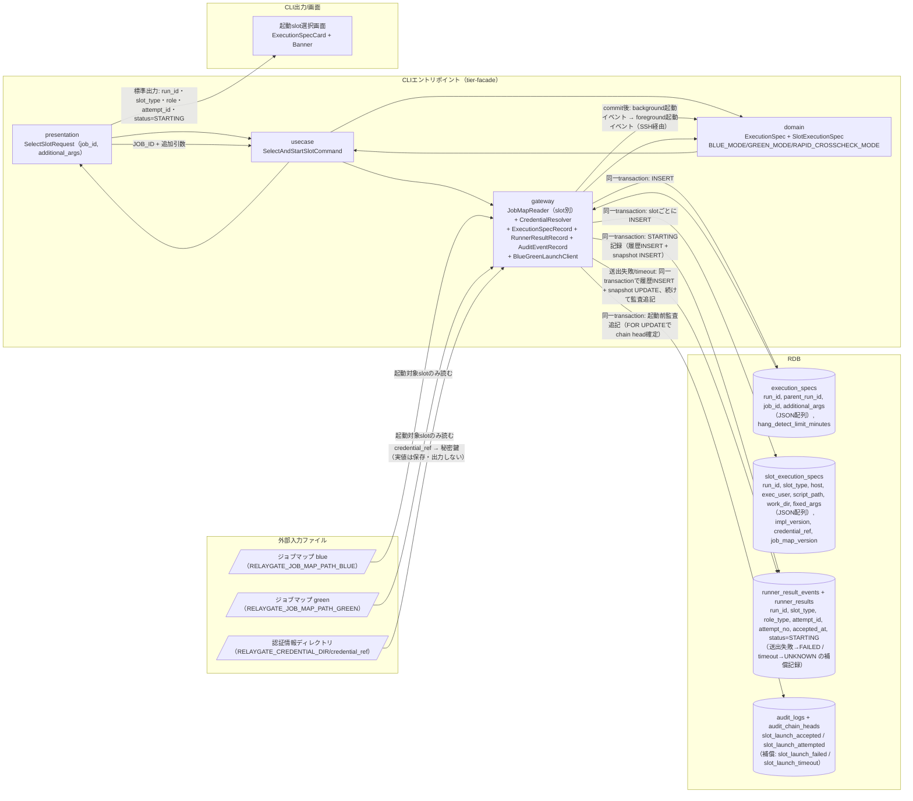
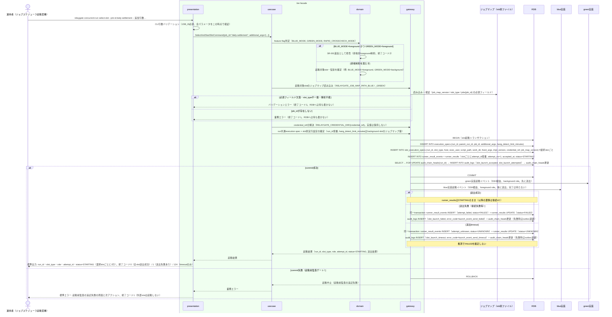

# feature flag設定に基づきslotを選択して起動する

## 概要

運用者（実体はジョブスケジューラからfacadeが起動される契機）が、feature flag設定（BLUE_MODE/GREEN_MODE/RAPID_CROSSCHECK_MODE）を参照し、blue/green実装のうちどちらのslotをどの役割（foreground/background/off）で起動するかを判定し、slotごとの独立したジョブマップ（`RELAYGATE_JOB_MAP_PATH_BLUE` / `RELAYGATE_JOB_MAP_PATH_GREEN`）から実行先を解決して、run共通のexecution spec（execution_specs）とslot別実行設定（slot_execution_specs。ジョブマップ版 job_map_version を含む）を一度だけ確定して保存したうえで起動イベントを送出する。BLUE_MODE/GREEN_MODEを同時にforegroundにする組み合わせは拒否する。実行設定のINSERT・起動試行のSTARTING記録・起動前監査イベントの追記は同一transactionでcommitし、commitできない場合は外部slotを起動しない（起動前監査ゲート）。

起動イベントの送出はbackground roleのslotを先に、foreground roleのslotを後に行い、送出に失敗した試行はFAILED（attempt_failed）、timeoutした試行はUNKNOWN（attempt_unknown。推測でFAILEDにしない）へ本UCが補償記録し、`slot_launch_failed` / `slot_launch_timeout` 監査イベントを追記する。CLI応答時間（10秒以内、CTP-009）の対象は起動受付（transaction commitと起動イベント送出）までであり、foreground実行の完了は待たない（完了待機は「foreground roleの標準出力・標準エラー・終了コードを応答する」UCの責務）。

## データフロー



| レイヤー | データモデル | 変換内容 |
|---------|------------|---------|
| CLI presentation | SelectSlotRequest(job_id, additional_args) | ジョブスケジューラ由来のJOB_ID・追加引数のCLI解析 → Command変換（追加引数は要素順のままJSON配列へ） |
| CLI usecase | SelectAndStartSlotCommand | feature flag判定 → 起動対象slotのジョブマップ読み込み・検証 → run共通execution spec + slot別実行設定の確定 → 起動前監査ゲート → 起動イベント送出（background→foreground） → 送出失敗/timeoutの補償記録 |
| CLI gateway | ジョブマップ（slot別JSON）読み込み、credential_ref解決、execution_specs + slot_execution_specs のINSERT、runner_result_events + runner_results のSTARTING記録、audit_logs + audit_chain_heads の追記（同一transaction）+ SSH経由の起動イベント送出 + 補償記録（履歴INSERT + snapshot UPDATE + 監査追記） | run共通/slot別実行設定レコード作成、起動前監査イベント追記、blue/green実装への起動イベント送出、送出結果の記録 |
| Response | run_id・slot_type・role・attempt_id・status=STARTING（選択slotごとに1行） | 起動受付の記録。移行運用責任者の並行稼働実行結果確認への入力となる（実行状態の正本はrunner_results） |

## 処理フロー



## バリエーション一覧

| バリエーション名 | 値 | 処理内容 | 適用 tier | 適用箇所 |
|----------------|---|---------|----------|---------|
| slotモード（BLUE_MODE/GREEN_MODE） | off、background、foreground | 各slotをどの役割で起動するかを決定する。offのslotはジョブマップを読まない | tier-facade | `relaygate concurrent-run select-slot` のslot選択ロジック |
| RAPID_CROSSCHECK_MODE | on、off | offの場合は完了通知送信・速報管理DB接続/書込みを行わない起動フラグをexecution specに記録する | tier-facade | run共通execution spec確定処理 |
| 運用モード | 並行稼働、新実装単独本番、次世代実装との並行稼働 | ジョブ定義を変更せずBLUE_MODE/GREEN_MODEの組み合わせのみで表現される運用フェーズの区分。BLUE_MODE=foreground・GREEN_MODE=background（またはその逆）は「並行稼働」、BLUE_MODE=off・GREEN_MODE=foregroundは「新実装単独本番」、GREEN_MODE=foregroundかつ将来追加される次世代実装slotがbackground稼働する構成は「次世代実装との並行稼働」に対応する。本UCはこの区分そのものを判定・記録するものではなく、BLUE_MODE/GREEN_MODEの値を確定させることで運用モードを間接的に表現する | tier-facade | run共通execution spec確定処理（BLUE_MODE/GREEN_MODEの値の組み合わせとして表現） |
| slot種別 | blue、green | 読み込むジョブマップファイル（`RELAYGATE_JOB_MAP_PATH_BLUE` / `RELAYGATE_JOB_MAP_PATH_GREEN`）と起動イベントの送出先を切り替える | tier-facade | ジョブマップ読み込み・起動イベント送出 |

## 分岐条件一覧

| 条件名 | 判定ルール | 適用 tier | 適用箇所 | BDD Scenario |
|--------|----------|----------|---------|-------------|
| feature flag設定（BLUE_MODE/GREEN_MODE/RAPID_CROSSCHECK_MODE） | BLUE_MODE/GREEN_MODEはforeground/background/offのいずれかを設定する。両方を同時にforegroundにする組み合わせは許可しない。RAPID_CROSSCHECK_MODEはon/offを設定し、offの場合は完了通知送信・速報管理DB接続/書込みを行わない | tier-facade | `relaygate concurrent-run select-slot` のslot選択・起動ロジック | BLUE_MODE/GREEN_MODE同時foregroundを拒否する |
| ジョブマップ検証 | 起動対象slotのジョブマップ（slot別JSON）を transaction 開始前に検証する。環境変数未設定・読み込み不能・必須フィールド欠落・slot_type不一致は終了コード2、jobs に JOB_ID が無い場合は終了コード1。いずれもRDBへ書き込まず外部slotを起動しない（正本: `cli-command-contract.yaml` job_map_contract） | tier-facade | ジョブマップ読み込み | ジョブマップの必須フィールドが欠落している、JOB_IDに対応するジョブマップが存在しない |
| credential_ref解決 | credential_ref が非nullなら `RELAYGATE_CREDENTIAL_DIR/{credential_ref}` を秘密鍵として解決し、nullなら `RELAYGATE_SSH_KEY_PATH` を用いる。解決不能は終了コード1。鍵の実値はRDB・監査・標準出力・標準エラー・起動イベントに出さない（正本: `cli-command-contract.yaml` credential_resolution） | tier-facade | 起動イベント送出前の認証情報解決 | credential_refから認証情報を解決し実値を露出させない |
| 起動前監査ゲート | execution_specs / slot_execution_specs のINSERT、runner_result_events + runner_results のSTARTING記録、起動前監査イベント（slot_launch_accepted / slot_launch_attempted）のaudit_logs INSERTとaudit_chain_heads更新を同一transactionでcommitできない場合は、外部slotを起動しない | tier-facade | `relaygate concurrent-run select-slot` の起動処理 | 起動前監査の追記に失敗した場合は外部slotを起動しない |
| 起動イベント送出結果判定 | slotごとに独立に判定する。送出成功はSTARTINGのまま、送出失敗（接続失敗等）はFAILED（attempt_failed）、送出timeoutはUNKNOWN（attempt_unknown。推測でFAILEDにしない）へ、runner_result_events INSERT + runner_results UPDATE を同一transactionでcommitし、続けて slot_launch_failed / slot_launch_timeout を追記する。他slotの送出は続行する。終了コードは失敗ありなら1、timeoutのみなら124 | tier-facade | 起動イベント送出後処理 | 起動イベントの送出に失敗した試行をFAILEDへ補償記録する、起動イベントの送出がtimeoutした試行をUNKNOWNへ補償記録する |

## 計算ルール一覧

| ルール名 | 入力 | 算出 | 出力 | 適用 tier |
|--------|------|------|------|----------|
| run共通 hang_detect_limit_minutes の採用 | 起動対象slotのジョブマップの `hang_detect_limit_minutes`、各slotのrole | background role に選ばれたslotのジョブマップ値を採用する。両slotがbackgroundの場合は大きい方（誤検知を避ける保守的な選び方）。backgroundのslotが無い場合は起動対象の唯一のslotの値 | execution_specs.hang_detect_limit_minutes（run共通の1値。role別・slot別には保存しない） | tier-facade |
| 起動引数列の構成 | slot_execution_specs.fixed_args（JSON配列）、execution_specs.additional_args（JSON配列） | fixed_args の要素の後ろに additional_args の要素を順序を変えず後置連結する。要素を再分割・再結合・トリム・クォート付与しない（正本: `rdb-schema.yaml` argument_serialization） | 起動イベントのargv | tier-facade |

## 状態遷移一覧

| 状態モデル | 遷移 | トリガー | 適用 tier |
|-----------|------|---------|----------|
| Runner実行状態（STARTING/RUNNING/SUCCEEDED/FAILED/UNKNOWN/ABORTED） | (未作成) → STARTING | 選択slotごとの起動受付（runner_result_eventsへのattempt_started INSERTとrunner_resultsのsnapshot INSERTを同一transactionで実行） | tier-facade |
| Runner実行状態 | STARTING → FAILED | 起動イベント送出失敗（attempt_failed INSERT + snapshot UPDATE を同一transactionで実行、slot_launch_failed 監査追記） | tier-facade |
| Runner実行状態 | STARTING → UNKNOWN | 起動イベント送出timeout（attempt_unknown INSERT + snapshot UPDATE を同一transactionで実行、slot_launch_timeout 監査追記。推測でFAILEDを確定しない） | tier-facade |

送出に成功した試行のSTARTING以降の遷移（STARTING→RUNNING等）は後続UC「background roleを起動する」（background role）が担う。foreground roleの試行がSTARTINGのまま確定しない場合の待機上限は「foreground roleの標準出力・標準エラー・終了コードを応答する」UCの wait_contract（execution_specs.hang_detect_limit_minutes を上限）に従う。

## 関連 RDRA モデル

| モデル種別 | 要素名 | 関連 |
|-----------|--------|------|
| 業務 | 並行稼働実行業務 | このUCが属する業務 |
| BUC | 並行稼働実行フロー | このUCを含むBUC |
| アクター | 運用者 | 操作するアクター |
| 情報 | execution-spec.json | 作成・確定する情報（run共通のexecution_specsとslot別のslot_execution_specsに分離して保存する。属性「マップ版」はslot別実行設定（slot_execution_specs.job_map_version）へ保存する） |
| 情報 | slot別実行設定 | 作成・確定する情報（slotごとの独立したジョブマップから解決。認証情報は参照名のみ） |
| 情報 | Runner実行結果（started-at.txt/stdout.log/stderr.log/exitcode.txt） | 起動試行のSTARTING記録、および起動イベント送出失敗/timeoutの補償記録（FAILED/UNKNOWN） |
| 状態 | Runner実行状態 | 選択slotごとの起動受付でSTARTINGを記録する。送出失敗はFAILED、送出timeoutはUNKNOWNへ本UCが遷移させる（送出成功後の遷移は「background roleを起動する」UCの責務） |
| 条件 | feature flag設定（BLUE_MODE/GREEN_MODE/RAPID_CROSSCHECK_MODE） | 適用される条件 |
| 条件 | hang_detect_limit_minutes | run共通の1値としてbackground roleに選ばれたslotのジョブマップ値を採用し、execution_specsへ保存する |
| 外部システム | blue実装、green実装 | 連携する外部システム（起動イベント送出先） |

## E2E 完了条件（BDD）

### 正常系

```gherkin
Feature: feature flag設定に基づきslotを選択して起動する

  Background:
    Given 環境変数 RELAYGATE_JOB_MAP_PATH_BLUE=/etc/relaygate/job-map.blue.json, RELAYGATE_JOB_MAP_PATH_GREEN=/etc/relaygate/job-map.green.json, RELAYGATE_CREDENTIAL_DIR=/etc/relaygate/credentials が設定されている
    And blue のジョブマップ /etc/relaygate/job-map.blue.json は job_map_version="v1.4.0", slot_type="blue" で、jobs."daily-settlement" が host="blue-host-01", exec_user="batchuser", script_path="/opt/blue/run.sh", work_dir="/opt/relaygate/work", fixed_args=["--mode","batch"], impl_version="blue-2.3.1", credential_ref="cred-blue-batch", hang_detect_limit_minutes=30 に定義されている
    And green のジョブマップ /etc/relaygate/job-map.green.json は job_map_version="v1.4.0", slot_type="green" で、jobs."daily-settlement" が host="green-host-01", exec_user="batchuser", script_path="/opt/green/run.sh", work_dir="/opt/relaygate/work", fixed_args=["--mode","batch"], impl_version="green-0.9.0", credential_ref="cred-green-batch", hang_detect_limit_minutes=45 に定義されている
    And 認証情報ディレクトリに /etc/relaygate/credentials/cred-blue-batch と /etc/relaygate/credentials/cred-green-batch のSSH秘密鍵（パーミッション 0600）が配置されている

  Scenario: BLUE_MODE=foreground, GREEN_MODE=backgroundでblue/green両slotを起動する
    Given 環境変数に BLUE_MODE=foreground, GREEN_MODE=background, RAPID_CROSSCHECK_MODE=on, RELAYGATE_OPERATOR=ops-tanaka が設定されている
    And run_id発番が "3f8c9d2e-5b41-4a7e-9c13-6d2a8b0f1e57" を、attempt_id発番が blue="att-blue-0001" / green="att-green-0001" を返すよう固定されている
    When 運用者が `relaygate concurrent-run select-slot --job-id daily-settlement` を実行する
    Then 終了コード 0 で終了する
    And execution_specs に run_id="3f8c9d2e-5b41-4a7e-9c13-6d2a8b0f1e57", parent_run_id=NULL, job_id="daily-settlement", additional_args=[], hang_detect_limit_minutes=45 の1行がINSERTされる（hang_detect_limit_minutesはbackground roleに選ばれたgreenのジョブマップ値）
    And slot_execution_specs に (run_id="3f8c9d2e-5b41-4a7e-9c13-6d2a8b0f1e57", slot_type="blue", host="blue-host-01", impl_version="blue-2.3.1", credential_ref="cred-blue-batch", job_map_version="v1.4.0") と (run_id="3f8c9d2e-5b41-4a7e-9c13-6d2a8b0f1e57", slot_type="green", host="green-host-01", impl_version="green-0.9.0", credential_ref="cred-green-batch", job_map_version="v1.4.0") の2行が (run_id, slot_type) で一意に識別されるようINSERTされる
    And slot_execution_specs には認証情報の参照名（credential_ref）のみが保存され、パスワード・秘密鍵などの認証情報の実値は保存されない
    And runner_results に (run_id="3f8c9d2e-5b41-4a7e-9c13-6d2a8b0f1e57", slot_type="blue", role_type="foreground", attempt_id="att-blue-0001", attempt_no=1, status="STARTING") と (run_id="3f8c9d2e-5b41-4a7e-9c13-6d2a8b0f1e57", slot_type="green", role_type="background", attempt_id="att-green-0001", attempt_no=1, status="STARTING") の2行が accepted_at 付きでINSERTされる
    And runner_result_events に対応する event_name="attempt_started", status="STARTING" の履歴が同一transactionでINSERTされ、各行の occurred_at は対応する runner_results の accepted_at および updated_at とマイクロ秒精度で同一値である
    And audit_logs に (run_id="3f8c9d2e-5b41-4a7e-9c13-6d2a8b0f1e57", event_name="slot_launch_accepted", slot="-", attempt_id="-", actor="ops-tanaka", operation="slot_launch", outcome="accepted", schema_version="1.0") の起動前監査イベントがINSERTされ、audit_chain_heads の run_id 行が更新される
    And audit_logs の各行の event_hash は audit-event-contract.yaml の hash_chain.canonical_form に従って当該行から再計算した値と一致する
    And 標準出力に run_id="3f8c9d2e-5b41-4a7e-9c13-6d2a8b0f1e57" の blue/foreground/att-blue-0001/STARTING 行と green/background/att-green-0001/STARTING 行が出力される

  Scenario: RAPID_CROSSCHECK_MODE=offの場合は速報管理DBへ接続しない
    Given 環境変数に BLUE_MODE=foreground, GREEN_MODE=background, RAPID_CROSSCHECK_MODE=off, RELAYGATE_OPERATOR=ops-tanaka が設定されている
    And run_id発番が "3f8c9d2e-5b41-4a7e-9c13-6d2a8b0f1e57" を返すよう固定されている
    When 運用者が `relaygate concurrent-run select-slot --job-id daily-settlement` を実行する
    Then 終了コード 0 で終了する
    And rapid_crosscheck_requests へのINSERTは発生しない

  Scenario: BLUE_MODE=off, GREEN_MODE=foregroundで新実装単独本番の運用モードとして起動する
    Given 環境変数に BLUE_MODE=off, GREEN_MODE=foreground, RAPID_CROSSCHECK_MODE=off, RELAYGATE_OPERATOR=ops-tanaka が設定されている
    And 環境変数 RELAYGATE_JOB_MAP_PATH_BLUE が未設定である
    And run_id発番が "3f8c9d2e-5b41-4a7e-9c13-6d2a8b0f1e57" を、attempt_id発番が "att-green-0001" を返すよう固定されている
    When 運用者が `relaygate concurrent-run select-slot --job-id daily-settlement` を実行する
    Then 終了コード 0 で終了する（blueはoffのためblueのジョブマップは読まれず、環境変数未設定でもエラーにならない）
    And execution_specs に run_id="3f8c9d2e-5b41-4a7e-9c13-6d2a8b0f1e57", hang_detect_limit_minutes=45 の1行が、slot_execution_specs に slot_type="green", job_map_version="v1.4.0" の1行のみがINSERTされる（backgroundのslotが無いため起動対象の唯一のslotであるgreenの値を採用）
    And runner_results に (run_id="3f8c9d2e-5b41-4a7e-9c13-6d2a8b0f1e57", slot_type="green", role_type="foreground", attempt_id="att-green-0001", attempt_no=1, status="STARTING") の1行がINSERTされる
    And 標準出力に green/foreground/att-green-0001/STARTING の1行のみが出力される（運用モード: 新実装単独本番に相当する組み合わせ）

  Scenario: BLUE_MODE=background, GREEN_MODE=backgroundの場合は両ジョブマップのhang_detect_limit_minutesの大きい方を採用する
    Given 環境変数に BLUE_MODE=background, GREEN_MODE=background, RAPID_CROSSCHECK_MODE=on, RELAYGATE_OPERATOR=ops-tanaka が設定されている
    And run_id発番が "3f8c9d2e-5b41-4a7e-9c13-6d2a8b0f1e57" を返すよう固定されている
    When 運用者が `relaygate concurrent-run select-slot --job-id daily-settlement` を実行する
    Then 終了コード 0 で終了する
    And execution_specs の run_id="3f8c9d2e-5b41-4a7e-9c13-6d2a8b0f1e57" 行の hang_detect_limit_minutes は 45 である（blue=30, green=45 のうち大きい方）
    And slot_execution_specs に slot_type="blue" と slot_type="green" の2行が job_map_version="v1.4.0" でINSERTされる

  Scenario: background roleを先に起動しforegroundの完了を待たずに応答する
    Given 環境変数に BLUE_MODE=foreground, GREEN_MODE=background, RAPID_CROSSCHECK_MODE=on, RELAYGATE_OPERATOR=ops-tanaka が設定されている
    And run_id発番が "3f8c9d2e-5b41-4a7e-9c13-6d2a8b0f1e57" を、attempt_id発番が blue="att-blue-0001" / green="att-green-0001" を返すよう固定されている
    And blue実装のforeground実行が完了まで60秒かかる状態である
    When 運用者が `relaygate concurrent-run select-slot --job-id daily-settlement` を実行する
    Then green実装へのbackground起動イベントの送出が、blue実装へのforeground起動イベントの送出より先に完了する
    And runner_results に (run_id="3f8c9d2e-5b41-4a7e-9c13-6d2a8b0f1e57", slot_type="green", role_type="background", attempt_id="att-green-0001") が status="STARTING" で存在する
    And CLIは blue foreground実行および green background実行の完了を待たずに、起動受付から 10 秒以内に終了コード 0 で終了する

  Scenario: job mapの固定引数の後ろに追加引数を順序を変えず連結する
    Given 環境変数に BLUE_MODE=foreground, GREEN_MODE=background, RAPID_CROSSCHECK_MODE=on, RELAYGATE_OPERATOR=ops-tanaka が設定されている
    And run_id発番が "3f8c9d2e-5b41-4a7e-9c13-6d2a8b0f1e57" を返すよう固定されている
    When 運用者が `relaygate concurrent-run select-slot --job-id daily-settlement -- --target-date 2026-08-18 --retry 3` を実行する
    Then execution_specs の run_id="3f8c9d2e-5b41-4a7e-9c13-6d2a8b0f1e57" 行の additional_args にJSON配列 ["--target-date","2026-08-18","--retry","3"] が保存される
    And slot_execution_specs の (run_id="3f8c9d2e-5b41-4a7e-9c13-6d2a8b0f1e57", slot_type="blue") 行の fixed_args にJSON配列 ["--mode","batch"] が保存される
    And blue実装への起動イベントのargvが ["--mode","batch","--target-date","2026-08-18","--retry","3"]（固定引数→追加引数の順、要素の順序・値とも改変なし）で構成される

  Scenario: 空白・引用符・改行を含む引数が保存と復元の往復で同一になる
    Given 環境変数に BLUE_MODE=foreground, GREEN_MODE=off, RAPID_CROSSCHECK_MODE=off, RELAYGATE_OPERATOR=ops-tanaka が設定されている
    And run_id発番が "3f8c9d2e-5b41-4a7e-9c13-6d2a8b0f1e57" を返すよう固定されている
    When 運用者が追加引数として 1 番目に `--note`、2 番目に `a b "c"`（空白と二重引用符を含む1要素）、3 番目に改行1文字を含む `x<LF>y` の3要素を渡して `relaygate concurrent-run select-slot --job-id daily-settlement` を実行する
    Then execution_specs の additional_args にJSON配列 ["--note","a b \"c\"","x\ny"] が保存される
    And 保存値をJSON配列として復元した3要素は、渡した3要素と1要素ずつ同一である（再分割・再結合・トリム・クォート付与が行われない）
    And blue実装への起動イベントのargvは ["--mode","batch","--note","a b \"c\"","x\ny"] である

  Scenario: credential_refから認証情報を解決し実値を露出させない
    Given 環境変数に BLUE_MODE=foreground, GREEN_MODE=background, RAPID_CROSSCHECK_MODE=on, RELAYGATE_OPERATOR=ops-tanaka が設定されている
    And /etc/relaygate/credentials/cred-blue-batch の鍵ファイルに識別文字列 "RELAYGATE-TEST-SECRET-BLUE" が含まれている
    And blue のジョブマップの jobs."daily-settlement" に facade が読まない余剰フィールド "note"="RELAYGATE-TEST-SECRET-EXTRA" が追加されている
    And run_id発番が "3f8c9d2e-5b41-4a7e-9c13-6d2a8b0f1e57" を返すよう固定されている
    When 運用者が `relaygate concurrent-run select-slot --job-id daily-settlement` を実行する
    Then 終了コード 0 で終了する
    And blue実装への起動イベントは /etc/relaygate/credentials/cred-blue-batch を秘密鍵として送出される
    And "RELAYGATE-TEST-SECRET-BLUE" と "RELAYGATE-TEST-SECRET-EXTRA" は execution_specs・slot_execution_specs・audit_logs・標準出力・標準エラー・起動イベントの引数のいずれにも現れない

  Scenario: runner設定の差し替えのみで新世代実装を起動できる（facade本体は無変更）
    Given 環境変数に BLUE_MODE=off, GREEN_MODE=foreground, RAPID_CROSSCHECK_MODE=off, RELAYGATE_OPERATOR=ops-tanaka が設定されている
    And green のジョブマップ /etc/relaygate/job-map.green.json だけが job_map_version="v1.5.0" に更新され、jobs."daily-settlement" が host=green-host-01, exec_user=batchuser, script_path=/opt/green-next/run.sh, work_dir=/opt/relaygate/work, impl_version=green-1.0.0 に差し替えられている
    And blue のジョブマップ /etc/relaygate/job-map.blue.json は job_map_version="v1.4.0" のまま変更されていない
    And facade本体のコード・設定はジョブマップ以外に一切変更されていない
    And run_id発番が "3f8c9d2e-5b41-4a7e-9c13-6d2a8b0f1e57" を、attempt_id発番が "att-green-0001" を返すよう固定されている
    When 運用者が `relaygate concurrent-run select-slot --job-id daily-settlement` を実行する
    Then 終了コード 0 で終了する
    And slot_execution_specs に (run_id="3f8c9d2e-5b41-4a7e-9c13-6d2a8b0f1e57", slot_type="green", script_path="/opt/green-next/run.sh", impl_version="green-1.0.0", job_map_version="v1.5.0") の1行がINSERTされる
    And green実装への起動イベントは slot_execution_specs の host / exec_user / script_path / work_dir / fixed_args / credential_ref の値のみから構成され、facadeは実装固有の起動方式差異（実装名・バージョンによる分岐）を参照しない
```

### 異常系

```gherkin
  Scenario: BLUE_MODEとGREEN_MODEが同時にforegroundに設定されている
    Given 環境変数に BLUE_MODE=foreground, GREEN_MODE=foreground, RAPID_CROSSCHECK_MODE=on, RELAYGATE_OPERATOR=ops-tanaka が設定されている
    When 運用者が `relaygate concurrent-run select-slot --job-id daily-settlement` を実行する
    Then 終了コード 2 で終了する
    And 標準エラーに "BLUE_MODEとGREEN_MODEを同時にforegroundにすることはできません" が出力される
    And execution_specs・slot_execution_specs・runner_results・audit_logs へのINSERTは発生しない

  Scenario: JOB_IDに対応するジョブマップが存在しない
    Given 環境変数に BLUE_MODE=foreground, GREEN_MODE=background, RAPID_CROSSCHECK_MODE=on, RELAYGATE_OPERATOR=ops-tanaka が設定されている
    And job_id "unknown-job" が blue・green いずれのジョブマップ（v1.4.0）の jobs にも存在しない
    When 運用者が `relaygate concurrent-run select-slot --job-id unknown-job` を実行する
    Then 終了コード 1 で終了する
    And 標準エラーに "JOB_IDに対応するジョブマップが見つかりません: unknown-job" が出力される
    And execution_specs・slot_execution_specs・runner_results・audit_logs へのINSERTは発生しない

  Scenario: ジョブマップの必須フィールドが欠落している
    Given 環境変数に BLUE_MODE=foreground, GREEN_MODE=background, RAPID_CROSSCHECK_MODE=on, RELAYGATE_OPERATOR=ops-tanaka が設定されている
    And green のジョブマップ /etc/relaygate/job-map.green.json の jobs."daily-settlement" に hang_detect_limit_minutes が定義されていない
    When 運用者が `relaygate concurrent-run select-slot --job-id daily-settlement` を実行する
    Then 終了コード 2 で終了する
    And 標準エラーに "ジョブマップの必須フィールドが欠落しています: slot_type=green path=/etc/relaygate/job-map.green.json field=jobs.daily-settlement.hang_detect_limit_minutes" が出力される
    And execution_specs・slot_execution_specs・runner_results・audit_logs へのINSERTは発生せず、blue実装・green実装への起動イベントは送出されない

  Scenario: ジョブマップのslot_typeが環境変数の指すslotと一致しない
    Given 環境変数に BLUE_MODE=foreground, GREEN_MODE=background, RAPID_CROSSCHECK_MODE=on, RELAYGATE_OPERATOR=ops-tanaka が設定されている
    And 環境変数 RELAYGATE_JOB_MAP_PATH_GREEN が blue のジョブマップ（slot_type="blue"）を指している
    When 運用者が `relaygate concurrent-run select-slot --job-id daily-settlement` を実行する
    Then 終了コード 2 で終了する
    And 標準エラーに "ジョブマップの必須フィールドが欠落しています: slot_type=green path=/etc/relaygate/job-map.blue.json field=slot_type" が出力される
    And execution_specs・slot_execution_specs・runner_results・audit_logs へのINSERTは発生しない

  Scenario: 起動前監査の追記に失敗した場合は外部slotを起動しない
    Given 環境変数に BLUE_MODE=foreground, GREEN_MODE=background, RAPID_CROSSCHECK_MODE=on, RELAYGATE_OPERATOR=ops-tanaka が設定されている
    And audit_logs へのINSERTが失敗する状態になっている
    When 運用者が `relaygate concurrent-run select-slot --job-id daily-settlement` を実行する
    Then 終了コード 1 で終了する
    And 標準エラーに起動前監査の追記失敗の原因と次アクションが出力される
    And execution_specs・slot_execution_specs・runner_results・runner_result_events へのINSERTはrollbackされ残らない
    And blue実装・green実装への起動イベントは送出されない

  Scenario: 起動イベントの送出に失敗した試行をFAILEDへ補償記録する
    Given 環境変数に BLUE_MODE=foreground, GREEN_MODE=background, RAPID_CROSSCHECK_MODE=on, RELAYGATE_OPERATOR=ops-tanaka が設定されている
    And run_id発番が "3f8c9d2e-5b41-4a7e-9c13-6d2a8b0f1e57" を、attempt_id発番が blue="att-blue-0001" / green="att-green-0001" を返すよう固定されている
    And green実装ホスト green-host-01 へのSSH接続が失敗する状態である
    When 運用者が `relaygate concurrent-run select-slot --job-id daily-settlement` を実行する
    Then 終了コード 1 で終了する
    And runner_results の (run_id="3f8c9d2e-5b41-4a7e-9c13-6d2a8b0f1e57", slot_type="green", role_type="background", attempt_id="att-green-0001") 行が status="FAILED", exit_code=NULL へ更新され、runner_result_events に event_name="attempt_failed", status="FAILED" の履歴が同一transactionでINSERTされる
    And audit_logs に (run_id="3f8c9d2e-5b41-4a7e-9c13-6d2a8b0f1e57", slot="green", attempt_id="att-green-0001", event_name="slot_launch_failed", outcome="failed", error_code="launch_event_send_failed", actor="ops-tanaka") が slot_launch_attempted の後ろにチェーンされてINSERTされる
    And blue実装へのforeground起動イベントは送出され、runner_results の blue/foreground/att-blue-0001 行は status="STARTING" のままである
    And 標準出力には blue/foreground/att-blue-0001/STARTING 行と green/background/att-green-0001/STARTING 行が出力される（起動受付の記録）
    And 標準エラーに "green実装への起動イベント送出に失敗しました: slot_type=green attempt_id=att-green-0001 を FAILED として記録しました" と次アクションが出力される

  Scenario: 起動イベントの送出がtimeoutした試行をUNKNOWNへ補償記録する
    Given 環境変数に BLUE_MODE=foreground, GREEN_MODE=background, RAPID_CROSSCHECK_MODE=on, RELAYGATE_OPERATOR=ops-tanaka が設定されている
    And run_id発番が "3f8c9d2e-5b41-4a7e-9c13-6d2a8b0f1e57" を、attempt_id発番が blue="att-blue-0001" / green="att-green-0001" を返すよう固定されている
    And blue実装ホスト blue-host-01 へのSSH起動イベント送出がtimeoutする状態である
    When 運用者が `relaygate concurrent-run select-slot --job-id daily-settlement` を実行する
    Then 終了コード 124 で終了する
    And runner_results の (run_id="3f8c9d2e-5b41-4a7e-9c13-6d2a8b0f1e57", slot_type="blue", role_type="foreground", attempt_id="att-blue-0001") 行が status="UNKNOWN", exit_code=NULL へ更新され、runner_result_events に event_name="attempt_unknown", status="UNKNOWN" の履歴が同一transactionでINSERTされる（推測でFAILEDを確定しない）
    And audit_logs に (slot="blue", attempt_id="att-blue-0001", event_name="slot_launch_timeout", outcome="timeout", error_code="launch_event_send_timeout") がINSERTされる
    And runner_results の green/background/att-green-0001 行は status="STARTING" のままである
    And 標準エラーに "blue実装への起動イベント送出がtimeoutしました: slot_type=blue attempt_id=att-blue-0001 を UNKNOWN として記録しました" と次アクションが出力される

  Scenario: credential_refに対応する認証情報が解決できない
    Given 環境変数に BLUE_MODE=foreground, GREEN_MODE=background, RAPID_CROSSCHECK_MODE=on, RELAYGATE_OPERATOR=ops-tanaka が設定されている
    And 認証情報ディレクトリに /etc/relaygate/credentials/cred-green-batch が存在しない
    When 運用者が `relaygate concurrent-run select-slot --job-id daily-settlement` を実行する
    Then 終了コード 1 で終了する
    And 標準エラーに "SSH認証情報を解決できません: credential_ref=cred-green-batch" が出力される
    And execution_specs・slot_execution_specs・runner_results・audit_logs へのINSERTは発生せず、blue実装・green実装への起動イベントは送出されない
```

## ティア別仕様

- [tier-facade](tier-facade.md)

### 統合 API Spec

- [CLI コマンド契約](../../_cross-cutting/api/cli-command-contract.yaml)（全 UC 統合、CLI/ファイル/DB契約の正本。ジョブマップ契約 job_map_contract と認証情報解決契約 credential_resolution を含む）
- [監査イベント契約](../../_cross-cutting/api/audit-event-contract.yaml)（監査イベントのフィールド・hash-chain lock契約・event_hash 正規化形式の正本）
- [RDB スキーマ](../../_cross-cutting/datastore/rdb-schema.yaml)（物理型対応表・datetime 精度・引数の JSON 配列保存形式の正本）
