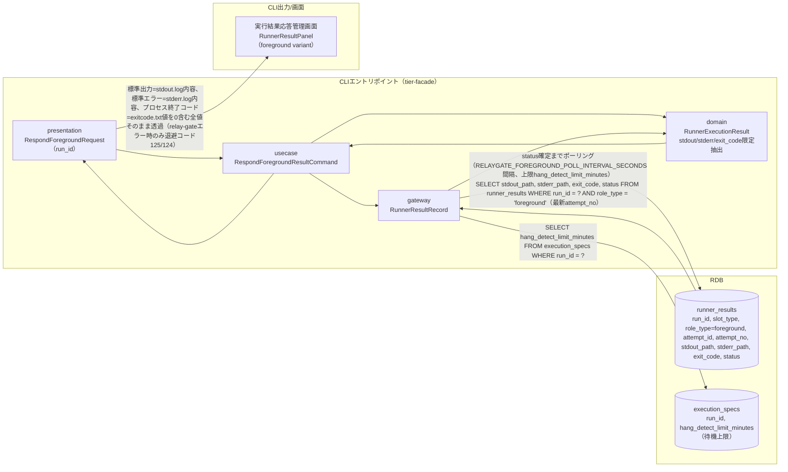
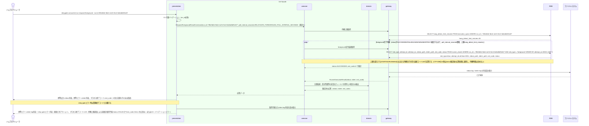

# foreground roleの標準出力・標準エラー・終了コードを応答する

## 概要

facadeが、foreground役割に割り当てられたslot（blue/green）の実行結果（標準出力・標準エラー・終了コード）だけをジョブスケジューラへ中継する。比較結果・差分件数・レポートURIなどの詳細情報は一切含めず、Runner Result Contractに従って標準化された3項目のみを応答する。実行結果は起動試行identity（run_id, slot_type, role_type, attempt_id）で管理されたrunner_results snapshotから、対象run_idのforeground役割の最新試行（attempt_no最大）を参照する。

foreground実行の完了待機は本UCの責務である（起動UC「feature flag設定に基づきslotを選択して起動する」は起動受付までで応答し、foreground完了を待たない）。本UCは最新試行のstatusがSUCCEEDED/FAILED/UNKNOWN/ABORTEDのいずれかへ確定するまで RELAYGATE_FOREGROUND_POLL_INTERVAL_SECONDS（既定5秒）間隔でrunner_resultsをポーリングし、待機上限は execution_specs.hang_detect_limit_minutes（run共通の1値）とする。上限を超えてもSTARTING/RUNNINGのままなら退避コード125（未確定）で応答し待機を打ち切る。「CLI応答10秒以内（CTP-009）」はstatus確定後の応答処理（snapshot取得・stdout.log/stderr.log読み取り・出力）に適用し、待機時間は含めない。

終了コードは **foregroundのexitcode.txtの値を0を含む全値そのままプロセス終了コードへ透過**する（丸め・再割り当てをしない）。relay-gate自身のエラーは業務ジョブの終了コードと衝突しないよう、業務ジョブが通常使用しない退避終了コードへ分離する（実行結果未確定（待機上限超過）・取得不能・中止済み = 125、relay-gateのバリデーションエラー = 124。status=FAILEDかつexit_code=NULL（起動イベント送出失敗の補償記録。透過できるexitcode.txtが無い）も125とする。bashが自動生成する126/127とは衝突させない）。relay-gateエラーで応答する場合の標準エラーには、取得可能な場合のforeground stderr.logの内容とrelay-gate自身のエラー内容（原因と次アクション）を併記する。

## データフロー



| レイヤー | データモデル | 変換内容 |
|---------|------------|---------|
| CLI presentation | RespondForegroundRequest(run_id) | 引数解析・環境変数（RELAYGATE_FOREGROUND_POLL_INTERVAL_SECONDS）の解決 |
| CLI usecase | RespondForegroundResultCommand | foreground実行完了待機（statusがSUCCEEDED/FAILED/UNKNOWN/ABORTEDへ確定するまでポーリング。上限 execution_specs.hang_detect_limit_minutes）→ 結果限定抽出フロー制御 |
| CLI gateway | execution_specs / runner_resultsへのSELECT | 待機上限（hang_detect_limit_minutes）の取得、foreground role実行結果（最新試行のsnapshot）の取得（stdout_path/stderr_path/exit_code/status） |
| Response | 標準出力・標準エラー・終了コードのみ | ジョブスケジューラが受け取る唯一の応答形式。exit_codeは0を含む全値をプロセス終了コードへそのまま透過する |
| Response（relay-gateエラー時） | 退避終了コード + 併記標準エラー | 実行結果未確定（待機上限超過）・取得不能（UNKNOWN、およびstatus=FAILEDかつexit_code=NULL）・中止済み=125、バリデーションエラー=124。標準エラーはforeground stderr.log内容（取得可能な場合）とrelay-gateエラー内容（原因と次アクション）を併記する |

## 処理フロー



## バリエーション一覧

| バリエーション名 | 値 | 処理内容 | 適用 tier | 適用箇所 |
|----------------|---|---------|----------|---------|
| role区分 | foreground、background、rapid-crosscheck | role_type='foreground'のレコードのみを応答対象として抽出する | tier-facade | `relaygate concurrent-run respond-foreground` のクエリ条件 |
| 実行状態 | STARTING、RUNNING、SUCCEEDED、FAILED、UNKNOWN、ABORTED | SUCCEEDED/FAILEDかつexit_code非NULLのみexitcode.txt値を透過できる。STARTING/RUNNINGは待機上限（hang_detect_limit_minutes）まで確定を待ち、超過時は未確定として退避コード125。UNKNOWN/ABORTED、およびFAILEDかつexit_code=NULL（起動イベント送出失敗の補償記録）は取得不能・中止済みとして退避コード125で応答する | tier-facade | 応答可否判定 |
| 終了コード分類 | 業務ジョブ終了コード（exitcode.txt値、0含む全値）、退避コード125（待機上限超過による未確定・取得不能・中止済み）、退避コード124（relay-gateバリデーションエラー） | 業務ジョブの終了コードとrelay-gate自身のエラーを値域で分離する。bash予約の126/127は使用しない | tier-facade | `relaygate concurrent-run respond-foreground` の終了コード決定 |

## 分岐条件一覧

| 条件名 | 判定ルール | 適用 tier | 適用箇所 | BDD Scenario |
|--------|----------|----------|---------|-------------|
| foreground完了待機 | 最新試行のstatusがSUCCEEDED/FAILED/UNKNOWN/ABORTEDのいずれかへ確定するまで RELAYGATE_FOREGROUND_POLL_INTERVAL_SECONDS（既定5秒）間隔でrunner_resultsをポーリングする。待機上限は対象試行の accepted_at を起点とした execution_specs.hang_detect_limit_minutes（run共通の1値）。上限を超えてもSTARTING/RUNNINGのままなら待機を打ち切る | tier-facade | `relaygate concurrent-run respond-foreground` の完了待機 | foreground実行が待機中に確定した場合は確定後の結果を応答する、foreground実行結果が待機上限内に確定しない |
| 応答可否判定 | 最新試行のstatusがSUCCEEDED/FAILEDかつexit_codeが非NULL（exitcode.txt回収済み）の場合のみexit_codeを透過する。待機上限超過後もSTARTING/RUNNINGは未確定、UNKNOWNは結果取得不能、FAILEDかつexit_code=NULL（起動イベント送出失敗の補償記録）は透過できる値が無い、ABORTEDは中止済みとしていずれも退避コード125で応答する（UNKNOWNを推測でFAILED相当の業務終了コードに変換しない） | tier-facade | `relaygate concurrent-run respond-foreground` の応答判定 | foreground実行結果が待機上限内に確定しない、foreground実行結果がUNKNOWN（結果取得不能）の場合は退避コード125で応答する、起動イベント送出失敗でFAILEDかつexit_code=NULLの場合は退避コード125で応答する |
| 終了コード透過 | statusがSUCCEEDED/FAILEDかつexit_codeが非NULLの場合、exitcode.txtの値（0を含む全値）をプロセス終了コードへそのまま設定する。一律の値へ丸めない | tier-facade | `relaygate concurrent-run respond-foreground` の終了コード決定 | foreground実行結果の非0終了コードをそのまま透過する |
| relay-gateエラー時のstderr併記 | 退避コード（125/124）で応答する場合、foreground stderr.logを取得できるときはその内容を出力し、続けてrelay-gate自身のエラー内容（原因と次アクション）を出力する。取得できないときはrelay-gateのエラー内容のみを出力する | tier-facade | `relaygate concurrent-run respond-foreground` の標準エラー構成 | foreground実行結果がUNKNOWN（結果取得不能）の場合は退避コード125で応答する、run_id未指定でバリデーションエラーになる |

## 計算ルール一覧

該当なし。

## 状態遷移一覧

該当なし（本UCはforeground役割のRunner実行結果を参照・応答するのみであり、RDRA BUC.tsv上も状態モデルとの関連はない）。

## 関連 RDRA モデル

| モデル種別 | 要素名 | 関連 |
|-----------|--------|------|
| 業務 | 並行稼働実行業務 | このUCが属する業務 |
| BUC | 並行稼働実行フロー | このUCを含むBUC |
| アクター | 運用者 | 操作するアクター |
| 情報 | Runner実行結果（started-at.txt/stdout.log/stderr.log/exitcode.txt） | 参照する情報 |
| 状態 | なし | - |
| 条件 | relay-gateエラーの退避終了コード | 終了コードの透過範囲と退避コード（125/124）の分離を規定する条件 |
| 条件 | hang_detect_limit_minutes | foreground完了待機の上限として参照する（execution_specsに保存されたrun共通の1値） |
| 外部システム | ジョブスケジューラ | 連携する外部システム（応答先） |

## E2E 完了条件（BDD）

### 正常系

```gherkin
Feature: foreground roleの標準出力・標準エラー・終了コードを応答する

  Scenario: foreground実行結果を標準出力・標準エラー・終了コードのみで応答する
    Given execution_specs に run_id="3f8c9d2e-5b41-4a7e-9c13-6d2a8b0f1e57", job_id="daily-settlement" の行が存在する
    And slot_execution_specs に (run_id="3f8c9d2e-5b41-4a7e-9c13-6d2a8b0f1e57", slot_type="blue", host="blue-host-01") の行が存在する
    And runner_results に (run_id="3f8c9d2e-5b41-4a7e-9c13-6d2a8b0f1e57", slot_type="blue", role_type="foreground", attempt_id="att-blue-0001", attempt_no=1, status="SUCCEEDED", exit_code=0) の行がstdout_path/stderr_path付きで存在する
    When ジョブスケジューラが `relaygate concurrent-run respond-foreground --run-id 3f8c9d2e-5b41-4a7e-9c13-6d2a8b0f1e57` を実行する
    Then プロセス終了コードは 0 である
    And 標準出力にstdout.logの内容がそのまま出力される
    And 標準エラーにstderr.logの内容がそのまま出力される
    And 比較結果・差分件数・レポートURIなどの詳細情報は一切出力されない

  Scenario: foreground実行結果の非0終了コードをそのまま透過する
    Given execution_specs に run_id="7a1e4c60-2d93-4f18-8b52-c0e7a9d3b641", job_id="daily-settlement" の行が存在する
    And slot_execution_specs に (run_id="7a1e4c60-2d93-4f18-8b52-c0e7a9d3b641", slot_type="blue", host="blue-host-01") の行が存在する
    And runner_results に (run_id="7a1e4c60-2d93-4f18-8b52-c0e7a9d3b641", slot_type="blue", role_type="foreground", attempt_id="att-blue-0001", attempt_no=1, status="FAILED", exit_code=3) の行がstdout_path/stderr_path付きで存在する
    When ジョブスケジューラが `relaygate concurrent-run respond-foreground --run-id 7a1e4c60-2d93-4f18-8b52-c0e7a9d3b641` を実行する
    Then プロセス終了コードは 3 である
    And プロセス終了コードは 1 へ丸められない
    And 標準エラーにstderr.logの内容がそのまま出力される
    And 標準エラーにrelay-gateのエラー内容は付加されない

  Scenario: foreground実行が待機中に確定した場合は確定後の結果を応答する
    Given execution_specs に run_id="3f8c9d2e-5b41-4a7e-9c13-6d2a8b0f1e57", job_id="daily-settlement", hang_detect_limit_minutes=30 の行が存在する
    And slot_execution_specs に (run_id="3f8c9d2e-5b41-4a7e-9c13-6d2a8b0f1e57", slot_type="blue", host="blue-host-01") の行が存在する
    And runner_results に (run_id="3f8c9d2e-5b41-4a7e-9c13-6d2a8b0f1e57", slot_type="blue", role_type="foreground", attempt_id="att-blue-0001", attempt_no=1, status="RUNNING", exit_code=NULL) の行が存在する
    And 環境変数 RELAYGATE_FOREGROUND_POLL_INTERVAL_SECONDS=1 が設定されている
    When ジョブスケジューラが `relaygate concurrent-run respond-foreground --run-id 3f8c9d2e-5b41-4a7e-9c13-6d2a8b0f1e57` を実行する
    And 実行開始から 3 秒後に当該 runner_results 行が status="SUCCEEDED", exit_code=0 へ更新され stdout_path/stderr_path が設定される
    Then コマンドは status 確定まで待機し、即時に退避コード 125 で終了しない
    And プロセス終了コードは 0 である
    And 標準出力にstdout.logの内容がそのまま出力される
```

### 異常系

```gherkin
  Scenario: foreground実行結果が待機上限内に確定しない
    Given execution_specs に run_id="3f8c9d2e-5b41-4a7e-9c13-6d2a8b0f1e57", job_id="daily-settlement", hang_detect_limit_minutes=1 の行が存在する
    And slot_execution_specs に (run_id="3f8c9d2e-5b41-4a7e-9c13-6d2a8b0f1e57", slot_type="blue", host="blue-host-01") の行が存在する
    And runner_results に (run_id="3f8c9d2e-5b41-4a7e-9c13-6d2a8b0f1e57", slot_type="blue", role_type="foreground", attempt_id="att-blue-0001", attempt_no=1, status="RUNNING", exit_code=NULL) の行が、accepted_at を実行開始時刻の 30 秒前として存在する
    And 環境変数 RELAYGATE_FOREGROUND_POLL_INTERVAL_SECONDS=1 が設定されている
    And 待機中に status は "RUNNING" のまま変化しない
    When ジョブスケジューラが `relaygate concurrent-run respond-foreground --run-id 3f8c9d2e-5b41-4a7e-9c13-6d2a8b0f1e57` を実行する
    Then accepted_at + hang_detect_limit_minutes（1分）を超えた最初のポーリング（実行開始から約 30 秒後）で待機を打ち切り、終了コード 125 で終了する
    And 標準エラーに "foreground実行結果が未確定です: run_id=3f8c9d2e-5b41-4a7e-9c13-6d2a8b0f1e57" が出力される
    And 標準エラーに次アクションとして "実行完了後に再実行してください" が出力される

  Scenario: 起動時点で待機上限を既に超えている場合は1回の確認で退避コード125を返す
    Given execution_specs に run_id="3f8c9d2e-5b41-4a7e-9c13-6d2a8b0f1e57", job_id="daily-settlement", hang_detect_limit_minutes=1 の行が存在する
    And runner_results に (run_id="3f8c9d2e-5b41-4a7e-9c13-6d2a8b0f1e57", slot_type="blue", role_type="foreground", attempt_id="att-blue-0001", attempt_no=1, status="STARTING", exit_code=NULL) の行が、accepted_at を実行開始時刻の 5 分前として存在する
    When ジョブスケジューラが `relaygate concurrent-run respond-foreground --run-id 3f8c9d2e-5b41-4a7e-9c13-6d2a8b0f1e57` を実行する
    Then ポーリングで待機せず 10 秒以内に終了コード 125 で終了する
    And 標準エラーに "foreground実行結果が未確定です: run_id=3f8c9d2e-5b41-4a7e-9c13-6d2a8b0f1e57" が出力される

  Scenario: run_idに対応する実行設定またはforeground試行が存在しない
    Given execution_specs に run_id="9b1f0c4d-77aa-4e0e-8c2b-0d5e6f7a8b9c" の行が存在しない
    When ジョブスケジューラが `relaygate concurrent-run respond-foreground --run-id 9b1f0c4d-77aa-4e0e-8c2b-0d5e6f7a8b9c` を実行する
    Then ポーリングで待機せず即座に終了コード 125 で終了する
    And 標準エラーに "foreground実行結果を特定できません: run_id=9b1f0c4d-77aa-4e0e-8c2b-0d5e6f7a8b9c" が出力される

  Scenario: 起動イベント送出失敗でFAILEDかつexit_code=NULLの場合は退避コード125で応答する
    Given execution_specs・slot_execution_specs に run_id="3f8c9d2e-5b41-4a7e-9c13-6d2a8b0f1e57" の blue slot 一式が存在する
    And runner_results に (run_id="3f8c9d2e-5b41-4a7e-9c13-6d2a8b0f1e57", slot_type="blue", role_type="foreground", attempt_id="att-blue-0001", attempt_no=1, status="FAILED", exit_code=NULL, stdout_path=NULL, stderr_path=NULL) の行が存在する
    And audit_logs に (run_id="3f8c9d2e-5b41-4a7e-9c13-6d2a8b0f1e57", slot="blue", attempt_id="att-blue-0001", event_name="slot_launch_failed", error_code="launch_event_send_failed") の監査イベントが存在する
    When ジョブスケジューラが `relaygate concurrent-run respond-foreground --run-id 3f8c9d2e-5b41-4a7e-9c13-6d2a8b0f1e57` を実行する
    Then 終了コード 125 で終了する
    And 終了コードは業務終了コードとして透過されない（透過できる exitcode.txt が無い）
    And 標準エラーに relay-gate のエラー内容 "foreground の起動イベント送出に失敗しています（status=FAILED, exit_code なし）" と次アクション "`relaygate concurrent-run result --run-id 3f8c9d2e-5b41-4a7e-9c13-6d2a8b0f1e57` で状態を確認し、リランするか正規ジョブで再実行してください" が出力される

  Scenario: foreground実行結果がUNKNOWN（結果取得不能）の場合は退避コード125で応答する
    Given execution_specs・slot_execution_specs に run_id="3f8c9d2e-5b41-4a7e-9c13-6d2a8b0f1e57" の blue slot 一式が存在する
    And runner_results に (run_id="3f8c9d2e-5b41-4a7e-9c13-6d2a8b0f1e57", slot_type="blue", role_type="foreground", attempt_id="att-blue-0001", attempt_no=1, status="UNKNOWN", exit_code=NULL) の行がstderr_path付きで存在する
    And stderr.log に "ssh: connect to host blue-host-01 port 22: Connection timed out" が記録されている
    When ジョブスケジューラが `relaygate concurrent-run respond-foreground --run-id 3f8c9d2e-5b41-4a7e-9c13-6d2a8b0f1e57` を実行する
    Then 終了コード 125 で終了する
    And 終了コードは FAILED 相当の業務終了コードへ推測で変換されない
    And 標準エラーに stderr.log の内容 "ssh: connect to host blue-host-01 port 22: Connection timed out" が出力される
    And 同じ標準エラーに relay-gate のエラー内容 "foreground実行結果を取得できません（status=UNKNOWN）" と次アクション "実結果を回収するか `relaygate concurrent-run result --run-id 3f8c9d2e-5b41-4a7e-9c13-6d2a8b0f1e57` で状態を確認してください" が併記される

  Scenario: foreground実行結果がABORTED（中止済み）の場合は退避コード125で応答する
    Given execution_specs・slot_execution_specs に run_id="3f8c9d2e-5b41-4a7e-9c13-6d2a8b0f1e57" の blue slot 一式が存在する
    And runner_results に (run_id="3f8c9d2e-5b41-4a7e-9c13-6d2a8b0f1e57", slot_type="blue", role_type="foreground", attempt_id="att-blue-0001", attempt_no=1, status="ABORTED", exit_code=NULL) の行が存在する
    And stderr.log を取得できない
    When ジョブスケジューラが `relaygate concurrent-run respond-foreground --run-id 3f8c9d2e-5b41-4a7e-9c13-6d2a8b0f1e57` を実行する
    Then 終了コード 125 で終了する
    And 標準エラーに relay-gate のエラー内容 "foreground実行は中止済みです（status=ABORTED）" と次アクション "リランするか正規ジョブで再実行してください" が出力される

  Scenario: run_id未指定でバリデーションエラーになる
    When ジョブスケジューラが `relaygate concurrent-run respond-foreground` を引数なしで実行する
    Then 終了コード 124 で終了する
    And 標準エラーに "run_id を指定してください" が出力される
    And 終了コードは 126 でも 127 でもない（bash予約コードと衝突しない）
```

## ティア別仕様

- [tier-facade](tier-facade.md)

### 統合 API Spec

- [CLI コマンド契約](../../_cross-cutting/api/cli-command-contract.yaml)（全 UC 統合、CLI/ファイル/DB契約の正本）
