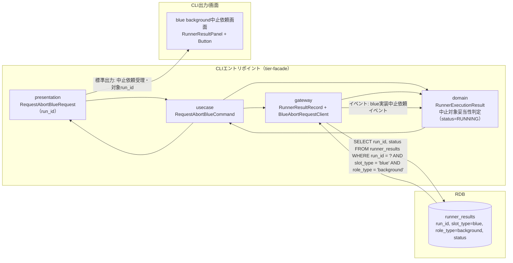
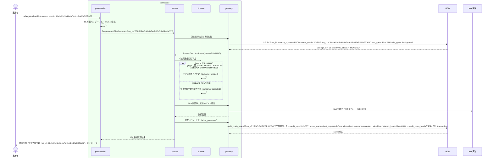

# blue background実行の中止を依頼する

## 概要

運用者が、停止確認済みのblue background実行について中止を発意し、中止依頼を発行する。本UCは中止の意思表示（依頼）のみを担い、実際のABORTEDへの状態遷移は後続UC「対話確認のうえblue background実行をABORTEDへ遷移させる」で行う。中止依頼の受理・拒否は監査イベント event_name=abort_requested（operation=abort、outcome=accepted|rejected）として audit_logs へ追記する（audit-event-contract.yaml）。

## データフロー



| レイヤー | データモデル | 変換内容 |
|---------|------------|---------|
| CLI presentation | RequestAbortBlueRequest(run_id) | 中止依頼対象run_idのCLI引数解析 |
| CLI usecase | RequestAbortBlueCommand | 停止確認済み・RUNNING状態の妥当性チェック → 中止依頼発行フロー制御 |
| CLI gateway | runner_resultsへのSELECT + blue実装中止依頼イベント送出 + audit_logsへのabort_requested追記 | 対象実行結果の状態確認（起動試行identity = run_id, slot_type, role_type, attempt_id）、blue実装への中止依頼通知、監査イベント追記（audit_chain_headsのrun_id行を排他ロックして直列化） |
| Response | 中止依頼受理結果・対象run_id | 後続の対話確認UCへの入力となる |

## 処理フロー



## バリエーション一覧

| バリエーション名 | 値 | 処理内容 | 適用 tier | 適用箇所 |
|----------------|---|---------|----------|---------|
| slot種別 | blue、green | 本UCはslot_type='blue'のみを対象とする（green側は別UC） | tier-facade | 中止依頼対象のフィルタ条件 |

## 分岐条件一覧

該当なし（中止依頼可否の判定は状態モデルの前提条件によるものであり、RDRA条件.tsvに定義された業務条件には該当しない。次節「状態遷移一覧」の事前条件として記載する）。

## 計算ルール一覧

該当なし。

## 状態遷移一覧

| 状態モデル | 遷移元 | 遷移先 | トリガー | 事前条件 | 事後処理 | 適用 tier |
|-----------|--------|--------|---------|---------|---------|----------|
| background slot実行状態 | RUNNING | RUNNING（状態は変化しない。中止依頼のみ） | blue background実行の中止を依頼する | 対象run_idのblue background実行（起動試行）がRUNNING状態であること（停止確認済み） | blue実装への中止依頼イベント送出と、監査イベントabort_requested（operation=abort、outcome=accepted|rejected）のaudit_logs追記のみ。状態変更は後続UCで実施 | tier-facade |

## 関連 RDRA モデル

| モデル種別 | 要素名 | 関連 |
|-----------|--------|------|
| 業務 | 実行制御業務 | このUCが属する業務 |
| BUC | blue中止フロー | このUCを含むBUC |
| アクター | 運用者 | 操作するアクター |
| 情報 | Runner実行結果（started-at.txt/stdout.log/stderr.log/exitcode.txt） | 参照する情報 |
| 状態 | background slot実行状態 | 中止依頼対象の前提状態（RUNNING）を確認する |
| 条件 | なし | - |
| 外部システム | blue実装 | 連携する外部システム（中止依頼イベント送出先） |

## E2E 完了条件（BDD）

### 正常系

```gherkin
Feature: blue background実行の中止を依頼する

  Scenario: RUNNING中のblue background実行に中止を依頼する
    Given execution_specs に run_id "3f8c9d2e-5b41-4a7e-9c13-6d2a8b0f1e57"、job_id "daily-settlement"、hang_detect_limit_minutes 30 の行が存在する
    And slot_execution_specs に (run_id "3f8c9d2e-5b41-4a7e-9c13-6d2a8b0f1e57", slot_type "blue")、host "blue-host-01"、exec_user "batchuser"、work_dir "/opt/relaygate/work"、impl_version "blue-2.3.1" の行が存在する
    And runner_results に (run_id "3f8c9d2e-5b41-4a7e-9c13-6d2a8b0f1e57", slot_type "blue", role_type "background", attempt_id "att-blue-0001")、attempt_no 1、status "RUNNING" の起動試行が存在する
    And 環境変数 RELAYGATE_OPERATOR が "ops-tanaka" に設定されている
    When 運用者が `relaygate abort blue request --run-id 3f8c9d2e-5b41-4a7e-9c13-6d2a8b0f1e57` を実行する
    Then 終了コード 0 で終了する
    And 標準出力に "中止依頼受理: run_id=3f8c9d2e-5b41-4a7e-9c13-6d2a8b0f1e57" が出力される
    And blue実装へ中止依頼イベントが送出される
    And audit_logs に event_name "abort_requested"、operation "abort"、outcome "accepted"、run_id "3f8c9d2e-5b41-4a7e-9c13-6d2a8b0f1e57"、slot "blue"、attempt_id "att-blue-0001"、actor "ops-tanaka" の監査イベントが追記される
    And runner_results の当該起動試行の status は "RUNNING" のまま変化しない
```

### 異常系

```gherkin
  Scenario: 既にSUCCEEDEDのblue background実行に中止を依頼する
    Given execution_specs に run_id "3f8c9d2e-5b41-4a7e-9c13-6d2a8b0f1e57" の行と slot_execution_specs の (run_id "3f8c9d2e-5b41-4a7e-9c13-6d2a8b0f1e57", slot_type "blue") の行が存在する
    And runner_results に (run_id "3f8c9d2e-5b41-4a7e-9c13-6d2a8b0f1e57", slot_type "blue", role_type "background", attempt_id "att-blue-0001")、status "SUCCEEDED" の起動試行が存在する
    When 運用者が `relaygate abort blue request --run-id 3f8c9d2e-5b41-4a7e-9c13-6d2a8b0f1e57` を実行する
    Then 終了コード 1 で終了する
    And 標準エラーに "対象は既に完了しており中止依頼できません: run_id=3f8c9d2e-5b41-4a7e-9c13-6d2a8b0f1e57 status=SUCCEEDED" が出力される
    And audit_logs に event_name "abort_requested"、operation "abort"、outcome "rejected" の監査イベントが追記される

  Scenario: 対象run_idが存在しない
    Given runner_results に run_id "7a2e4b91-8c63-4d5f-b012-9e3c7a1d6b84" の起動試行が存在しない
    When 運用者が `relaygate abort blue request --run-id 7a2e4b91-8c63-4d5f-b012-9e3c7a1d6b84` を実行する
    Then 終了コード 1 で終了する
    And 標準エラーに "該当するblue background実行が見つかりません: run_id=7a2e4b91-8c63-4d5f-b012-9e3c7a1d6b84" が出力される
```

## ティア別仕様

- [tier-facade](tier-facade.md)

### 統合 API Spec

- [CLI コマンド契約](../../_cross-cutting/api/cli-command-contract.yaml)（全 UC 統合、CLI/ファイル/DB契約の正本）
