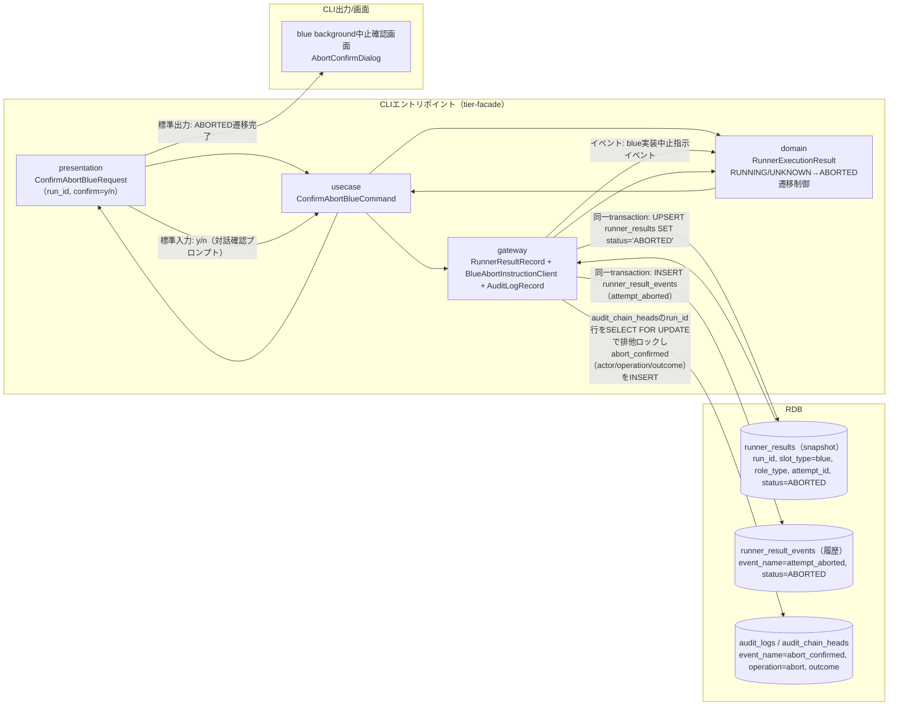
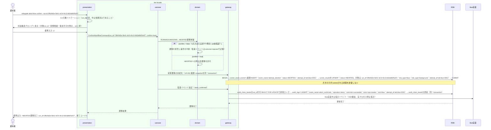

# 対話確認のうえblue background実行をABORTEDへ遷移させる

## 概要

運用者が、中止依頼済みのblue background実行について、対話確認（対象・影響範囲・取消不可の明示、y/nの二択）により実プロセスの停止を確認したうえで、blue background slot実行状態を明示的にABORTEDへ遷移させる。中止確定の対象はRUNNING中の実行（SPEC-007-01）に加え、結果不明（UNKNOWN）の実行も含む。UNKNOWNからのABORTED確定は本UCの対話確認による回復処理としてのみ発生する（hang-detector等による自動遷移は行わない）。

## データフロー



| レイヤー | データモデル | 変換内容 |
|---------|------------|---------|
| CLI presentation | ConfirmAbortBlueRequest(run_id, confirm) | 対話確認プロンプト（y/n）の標準入力受付、CLI引数解析 |
| CLI usecase | ConfirmAbortBlueCommand | 対話確認結果によるABORTED遷移フロー制御、監査イベント（abort_confirmed）記録 |
| CLI gateway | runner_result_eventsへの履歴INSERT + runner_resultsのsnapshot UPSERT（同一transaction、LR-002） + audit_logsへのabort_confirmed追記 + blue実装中止指示イベント送出 | 状態遷移の永続化（履歴と現在状態の乖離を防ぐ）、監査イベント記録（actor / operation / outcome）、blue実装への中止指示 |
| Response | ABORTED遷移完了結果 | 実行系譜の追跡対象として確定する |

## 処理フロー



## バリエーション一覧

| バリエーション名 | 値 | 処理内容 | 適用 tier | 適用箇所 |
|----------------|---|---------|----------|---------|
| slot種別 | blue、green | 本UCはslot_type='blue'のみを対象とする（green側は別UC） | tier-facade | ABORTED遷移対象のフィルタ条件 |

## 分岐条件一覧

対話確認結果（y/n）による分岐は業務条件ではなくCLI操作フロー制御であり、次節「状態遷移一覧」のトリガー・事前条件として記載する。

| 条件名 | ルール | 適用 tier | 適用箇所 | 関連シナリオ |
|--------|-------|----------|---------|-------------|
| 中止確定対象の判定 | 対象のbackground slot実行状態がRUNNINGまたはUNKNOWN（結果不明）であれば、対話確認を経てABORTEDへ確定できる。SUCCEEDED/FAILED/ABORTEDの確定済み状態は対象外とする（SPEC-007-01のRUNNINGケースに加え、RDRA状態モデルが定義するUNKNOWN起点の中止確定を含む） | tier-facade | ConfirmAbortBlueCommand（遷移可否判定） | 結果不明(UNKNOWN)のbackground実行を対話確認のうえABORTEDへ確定する |

## 計算ルール一覧

該当なし。

## 状態遷移一覧

| 状態モデル | 遷移元 | 遷移先 | トリガー | 事前条件 | 事後処理 | 適用 tier |
|-----------|--------|--------|---------|---------|---------|----------|
| background slot実行状態 | RUNNING | ABORTED | 対話確認のうえblue background実行をABORTEDへ遷移させる | 中止依頼済み（UC「blue background実行の中止を依頼する」完了済み）かつ対話確認でy応答を得ていること。ABORTEDへの遷移は本UCの対話確認による明示的操作でのみ発生する（hang-detector等による自動遷移は行わない） | runner_result_eventsへの履歴INSERT（attempt_aborted）とrunner_resultsのUPSERTを同一transactionで実行（LR-002）。blue実装への中止指示イベント送出、監査イベントabort_confirmed（operation=abort、outcome=succeeded|rejected、actor=RELAYGATE_OPERATOR）のaudit_logs追記 | tier-facade |
| background slot実行状態 | UNKNOWN | ABORTED | 対話確認のうえblue background実行をABORTEDへ遷移させる | 中止依頼済み（UC「blue background実行の中止を依頼する」完了済み）かつ対話確認でy応答を得ていること。結果不明（UNKNOWN）の実行を推測でFAILEDへ確定せず、対話確認による回復処理としてのみABORTEDへ確定する（hang-detector等による自動遷移は行わない） | runner_result_eventsへの履歴INSERT（attempt_aborted）とrunner_resultsのUPSERTを同一transactionで実行（LR-002）。blue実装への中止指示イベント送出、監査イベントabort_confirmed（operation=abort、outcome=succeeded|rejected、actor=RELAYGATE_OPERATOR）のaudit_logs追記 | tier-facade |

## 関連 RDRA モデル

| モデル種別 | 要素名 | 関連 |
|-----------|--------|------|
| 業務 | 実行制御業務 | このUCが属する業務 |
| BUC | blue中止フロー | このUCを含むBUC |
| アクター | 運用者 | 操作するアクター |
| 情報 | Runner実行結果（started-at.txt/stdout.log/stderr.log/exitcode.txt） | 更新する情報 |
| 状態 | background slot実行状態 | RUNNING→ABORTED・UNKNOWN→ABORTEDへ遷移させる（いずれも対話確認による明示的操作のみ） |
| 条件 | なし | - |
| 外部システム | blue実装 | 連携する外部システム（中止指示イベント送出先） |

## E2E 完了条件（BDD）

### 正常系

```gherkin
Feature: 対話確認のうえblue background実行をABORTEDへ遷移させる

  Scenario: 対話確認でyを応答しABORTEDへ遷移する
    Given execution_specs に run_id "3f8c9d2e-5b41-4a7e-9c13-6d2a8b0f1e57"、job_id "daily-settlement"、hang_detect_limit_minutes 30 の行が存在する
    And slot_execution_specs に (run_id "3f8c9d2e-5b41-4a7e-9c13-6d2a8b0f1e57", slot_type "blue")、host "blue-host-01"、exec_user "batchuser"、work_dir "/opt/relaygate/work"、impl_version "blue-2.3.1" の行が存在する
    And runner_results に (run_id "3f8c9d2e-5b41-4a7e-9c13-6d2a8b0f1e57", slot_type "blue", role_type "background", attempt_id "att-blue-0001")、attempt_no 1、status "RUNNING" の起動試行が中止依頼済みで存在する
    And 環境変数 RELAYGATE_OPERATOR が "ops-tanaka" に設定されている
    When 運用者が `relaygate abort blue confirm --run-id 3f8c9d2e-5b41-4a7e-9c13-6d2a8b0f1e57` を実行し対話確認で "y" と応答する
    Then 終了コード 0 で終了する
    And runner_result_events に event_name "attempt_aborted"・status "ABORTED" の履歴がINSERTされ、同一transactionで runner_results の (run_id "3f8c9d2e-5b41-4a7e-9c13-6d2a8b0f1e57", slot_type "blue", role_type "background", attempt_id "att-blue-0001") の status が "ABORTED" に更新される
    And audit_logs に event_name "abort_confirmed"、operation "abort"、outcome "succeeded"、actor "ops-tanaka"、run_id "3f8c9d2e-5b41-4a7e-9c13-6d2a8b0f1e57"、slot "blue"、attempt_id "att-blue-0001" の監査イベントが追記される
    And 標準出力に "ABORTED遷移完了: run_id=3f8c9d2e-5b41-4a7e-9c13-6d2a8b0f1e57" が出力される

  Scenario: 結果不明(UNKNOWN)のbackground実行を対話確認のうえABORTEDへ確定する
    Given execution_specs に run_id "3f8c9d2e-5b41-4a7e-9c13-6d2a8b0f1e57"、job_id "daily-settlement"、hang_detect_limit_minutes 30 の行が存在する
    And slot_execution_specs に (run_id "3f8c9d2e-5b41-4a7e-9c13-6d2a8b0f1e57", slot_type "blue")、host "blue-host-01"、exec_user "batchuser"、work_dir "/opt/relaygate/work"、impl_version "blue-2.3.1" の行が存在する
    And runner_results に (run_id "3f8c9d2e-5b41-4a7e-9c13-6d2a8b0f1e57", slot_type "blue", role_type "background", attempt_id "att-blue-0001")、attempt_no 1、status "UNKNOWN" の起動試行（timeoutにより結果取得不能）が中止依頼済みで存在する
    And 環境変数 RELAYGATE_OPERATOR が "ops-tanaka" に設定されている
    When 運用者が `relaygate abort blue confirm --run-id 3f8c9d2e-5b41-4a7e-9c13-6d2a8b0f1e57` を実行し対話確認で "y" と応答する
    Then 終了コード 0 で終了する
    And runner_result_events に event_name "attempt_aborted"・status "ABORTED" の履歴がINSERTされ、同一transactionで runner_results の (run_id "3f8c9d2e-5b41-4a7e-9c13-6d2a8b0f1e57", slot_type "blue", role_type "background", attempt_id "att-blue-0001") の status が "UNKNOWN" から "ABORTED" に更新される（推測でFAILEDへは確定しない）
    And audit_logs に event_name "abort_confirmed"、operation "abort"、outcome "succeeded"、actor "ops-tanaka"、run_id "3f8c9d2e-5b41-4a7e-9c13-6d2a8b0f1e57"、slot "blue"、attempt_id "att-blue-0001" の監査イベントが追記される
    And 標準出力に "ABORTED遷移完了: run_id=3f8c9d2e-5b41-4a7e-9c13-6d2a8b0f1e57" が出力される
```

### 異常系

```gherkin
  Scenario: 対話確認でnを応答し遷移を中断する
    Given execution_specs に run_id "3f8c9d2e-5b41-4a7e-9c13-6d2a8b0f1e57" の行と slot_execution_specs の (run_id "3f8c9d2e-5b41-4a7e-9c13-6d2a8b0f1e57", slot_type "blue") の行が存在する
    And runner_results に (run_id "3f8c9d2e-5b41-4a7e-9c13-6d2a8b0f1e57", slot_type "blue", role_type "background", attempt_id "att-blue-0001")、status "RUNNING" の起動試行が中止依頼済みで存在する
    And 環境変数 RELAYGATE_OPERATOR が "ops-tanaka" に設定されている
    When 運用者が `relaygate abort blue confirm --run-id 3f8c9d2e-5b41-4a7e-9c13-6d2a8b0f1e57` を実行し対話確認で "n" と応答する
    Then 終了コード 1 で終了する
    And runner_results の当該起動試行の status は "RUNNING" のまま変化しない
    And audit_logs に event_name "abort_confirmed"、operation "abort"、outcome "rejected"、actor "ops-tanaka" の監査イベントが追記される
    And 標準エラーに "中止操作を取り消しました: run_id=3f8c9d2e-5b41-4a7e-9c13-6d2a8b0f1e57" が出力される

  Scenario: 非TTY環境で--yesフラグ未指定のためエラー終了する
    Given execution_specs に run_id "3f8c9d2e-5b41-4a7e-9c13-6d2a8b0f1e57" の行と slot_execution_specs の (run_id "3f8c9d2e-5b41-4a7e-9c13-6d2a8b0f1e57", slot_type "blue") の行が存在する
    And runner_results に (run_id "3f8c9d2e-5b41-4a7e-9c13-6d2a8b0f1e57", slot_type "blue", role_type "background", attempt_id "att-blue-0001")、status "RUNNING" の起動試行が中止依頼済みで存在する
    And 非TTY（バッチ実行）環境である
    When 運用者が `relaygate abort blue confirm --run-id 3f8c9d2e-5b41-4a7e-9c13-6d2a8b0f1e57` を対話確認プロンプトなしで実行する
    Then 終了コード 2 で終了する
    And runner_results の当該起動試行の status は "RUNNING" のまま変化しない
    And 標準エラーに "対話確認が必要です。非TTY環境では --yes フラグを指定してください" が出力される

  Scenario: 対象slotがforeground roleのため状態を変更せずエラー終了する
    Given execution_specs に run_id "3f8c9d2e-5b41-4a7e-9c13-6d2a8b0f1e57" の行と slot_execution_specs の (run_id "3f8c9d2e-5b41-4a7e-9c13-6d2a8b0f1e57", slot_type "blue") の行が存在する
    And runner_results に (run_id "3f8c9d2e-5b41-4a7e-9c13-6d2a8b0f1e57", slot_type "blue", role_type "foreground", attempt_id "att-blue-0001")、status "RUNNING" の行のみが存在する（BLUE_MODE=foreground で起動された run であり、role_type "background" の行は存在しない）
    And 環境変数 RELAYGATE_OPERATOR が "ops-tanaka" に設定されている
    When 運用者が `relaygate abort blue confirm --run-id 3f8c9d2e-5b41-4a7e-9c13-6d2a8b0f1e57` を実行する
    Then 終了コード 1 で終了する
    And runner_results の (run_id "3f8c9d2e-5b41-4a7e-9c13-6d2a8b0f1e57", slot_type "blue", role_type "foreground", attempt_id "att-blue-0001") の status は "RUNNING" のまま変化せず、runner_result_events への履歴INSERTも発生しない
    And 標準エラーに "中止対象のbackground実行が存在しません: run_id=3f8c9d2e-5b41-4a7e-9c13-6d2a8b0f1e57 slot=blue（対象slotのmodeがforegroundまたはoffです）" が出力される

  Scenario: 対象slotのmodeがoffのため状態を変更せずエラー終了する
    Given execution_specs に run_id "3f8c9d2e-5b41-4a7e-9c13-6d2a8b0f1e57" の行が存在する
    And slot_execution_specs に (run_id "3f8c9d2e-5b41-4a7e-9c13-6d2a8b0f1e57", slot_type "green") の行のみが存在し、slot_type "blue" の行は存在しない（BLUE_MODE=off で確定済み）
    And runner_results に run_id "3f8c9d2e-5b41-4a7e-9c13-6d2a8b0f1e57" かつ slot_type "blue" の行が存在しない
    And 環境変数 RELAYGATE_OPERATOR が "ops-tanaka" に設定されている
    When 運用者が `relaygate abort blue confirm --run-id 3f8c9d2e-5b41-4a7e-9c13-6d2a8b0f1e57` を実行する
    Then 終了コード 1 で終了する
    And runner_results・runner_result_events のいかなる行も変更・追加されない
    And 標準エラーに "中止対象のbackground実行が存在しません: run_id=3f8c9d2e-5b41-4a7e-9c13-6d2a8b0f1e57 slot=blue（対象slotのmodeがforegroundまたはoffです）" が出力される
```

## ティア別仕様

- [tier-facade](tier-facade.md)

### 統合 API Spec

- [CLI コマンド契約](../../_cross-cutting/api/cli-command-contract.yaml)（全 UC 統合、CLI/ファイル/DB契約の正本）
