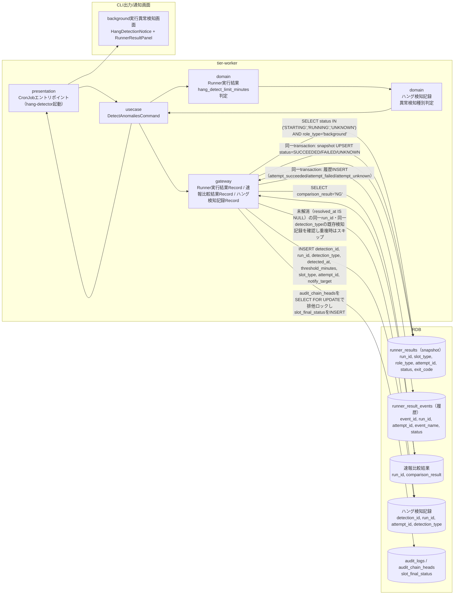
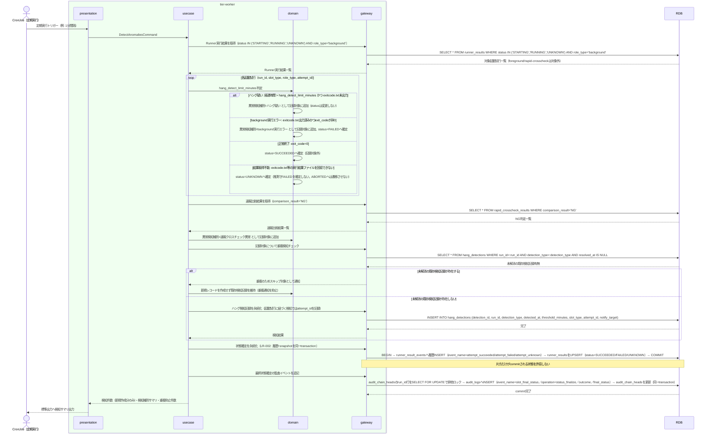

# background実行の未完了・非0終了・速報比較異常を定期検知する

## 概要

hang-detector が定期実行（CronJob）で起動し、Runner実行結果（E-002）の started-at.txt からの経過時間と hang_detect_limit_minutes しきい値を比較してハング疑いを検知し、exitcode.txt の非0終了コードから background実行エラーを検知し、速報比較結果（E-004）の NG 判定から速報クロスチェック異常を検知する。ポーリング対象は status が STARTING・RUNNING・UNKNOWN かつ role_type='background' の起動試行（identity = run_id, slot_type, role_type, attempt_id）である（UNKNOWN は実結果ファイルの回収再試行の対象として走査する）。検知結果はハング検知記録（E-006）として記録し（起動試行に紐づく検知では attempt_id も記録する）、あわせて background slot実行状態を SUCCEEDED/FAILED へ確定する。timeout や結果取得不能時は UNKNOWN とし、推測で FAILED を確定しない（UNKNOWN からの確定は実結果の回収または対話確認による回復処理でのみ行う）。hang-detector は実行状態を自動で ABORTED へ変更しない（SPEC-006-04。ABORTED への遷移は対話確認による明示的操作でのみ発生する）。状態確定では runner_result_events への履歴INSERTと runner_results の snapshot UPSERT を同一transactionで実行し（LR-002）、最終状態確定の監査イベント（event_name=slot_final_status、operation=status_finalize）を audit_logs へ追記する。

## データフロー



| レイヤー | データモデル | 変換内容 |
|---------|------------|---------|
| WK presentation | CronJobトリガー（定期実行間隔） | スケジュール起動 → DetectAnomaliesCommand 生成 |
| WK usecase | DetectAnomaliesCommand | Runner実行結果（status IN ('STARTING','RUNNING','UNKNOWN') AND role_type='background'）・速報比較結果の走査、ハング判定・異常判定の集約 |
| WK domain | Runner実行結果, ハング検知記録 | started_at（STARTINGでstarted_at未記録の場合はaccepted_at）からの経過時間としきい値比較、exit_code の非0判定、結果取得不能時のUNKNOWN判定、NG判定の集約、同一run_id・同一detection_typeの未解消検知記録の重複排除 |
| WK gateway | ハング検知記録 INSERT, runner_result_events INSERT + runner_results UPSERT（同一transaction）, audit_logs INSERT | 未解消の重複検知記録が存在しない場合のみ検知結果を永続化、実行状態の確定（SUCCEEDED/FAILED/UNKNOWN。推測でFAILEDを確定しない）、slot_final_status監査イベントの追記 |
| CLI出力 | background実行異常検知画面表示 | HangDetectionNotice + RunnerResultPanel の表示更新 |

## 処理フロー



## バリエーション一覧

| バリエーション名 | 値 | 処理内容 | 適用 tier | 適用箇所 |
|----------------|---|---------|----------|---------|
| 異常検知種別 | ハング疑い、background実行エラー、速報クロスチェック異常 | 検知ロジックの分岐先とハング検知記録の detection_type を決定する | tier-worker | usecase「DetectAnomaliesCommand」、domain「ハング検知記録」 |
| slot種別 | blue、green | ハング検知記録の対象slot種別として記録し、通知先の識別に用いる | tier-worker | domain「ハング検知記録」 |
| role区分 | foreground、background、rapid-crosscheck | 本UCの走査対象をrole_type='background'のRunner実行結果に限定する（foreground/rapid-crosscheckのRUNNING行は検知対象外） | tier-worker | gateway「Runner実行結果Record」 |

## 分岐条件一覧

| 条件名 | 判定ルール | 適用 tier | 適用箇所 | BDD Scenario |
|--------|----------|----------|---------|-------------|
| hang_detect_limit_minutes | 未完了許容の経過時間しきい値（分）。run共通の1値であり、background roleに選ばれたslotのジョブマップ値としてexecution_specsに保存される（role別・slot別の値は持たない）。ハードコードしない。started-at.txtからの経過時間がこの値を超過し、かつexitcode.txtが未出力の場合にハング疑いとして検知する | tier-worker | usecase「DetectAnomaliesCommand」、domain「Runner実行結果」 | ハング疑いを検知する |
| ポーリング条件 | Runner実行結果の走査はstatusがSTARTING・RUNNING・UNKNOWNかつrole_type='background'の起動試行に限定する（UNKNOWNは実結果ファイルの回収再試行の対象）。foreground/rapid-crosscheckの行は本UCの検知対象としない。STARTINGで走査に現れる試行は、起動イベントの送出には成功したが起動確認（RUNNING）前の試行だけである。起動イベント送出に失敗・timeoutした試行は起動UC（feature flag設定に基づきslotを選択して起動する）がFAILED / UNKNOWNへ補償記録済みのためSTARTINGには残らない。送出timeoutによりUNKNOWNとなった試行はUNKNOWNの回収再試行（実結果ファイルが回収できた場合のみSUCCEEDED/FAILEDへ確定）の対象に含まれる | tier-worker | usecase「DetectAnomaliesCommand」、gateway「Runner実行結果Record」 | role_type='background'以外のRUNNING行を検知対象から除外する |
| 重複検知抑止 | 同一run_id・同一detection_typeについて、未解消（resolved_at IS NULL）の既存ハング検知記録が存在する場合は新規レコードを作成せず重複通知を抑止する | tier-worker | domain「ハング検知記録」、gateway「ハング検知記録Record」 | 継続するハング疑いについて重複した検知記録を作成しない |
| UNKNOWN確定 | timeoutや実行結果ファイルの取得不能により結果を判定できない場合はstatusをUNKNOWNへ確定し、推測でFAILEDを確定しない。UNKNOWNからの確定は実結果の回収または対話確認による回復処理でのみ行う。ABORTEDへの自動遷移は行わない（SPEC-006-04） | tier-worker | domain「Runner実行結果」 | 結果取得不能の起動試行をUNKNOWNへ確定する、UNKNOWN状態の起動試行の実結果を回収しSUCCEEDEDへ確定する |

## 計算ルール一覧

| 計算名 | 入力情報 | 計算式/ロジック | 出力情報 | 適用 tier |
|--------|---------|---------------|---------|----------|
| ハング疑い判定 | started_at, hang_detect_limit_minutes, 現在時刻 | (現在時刻 - started_at) > hang_detect_limit_minutes分 かつ exitcode.txt未出力 | 異常検知種別=ハング疑い | tier-worker |
| background実行エラー判定 | exit_code | exitcode.txt出力済み かつ exit_code != 0 | 異常検知種別=background実行エラー, status=FAILED | tier-worker |
| 速報クロスチェック異常判定 | comparison_result | comparison_result = 'NG' | 異常検知種別=速報クロスチェック異常 | tier-worker |
| 結果取得不能判定 | exitcode.txt等の実行結果ファイルの回収可否、timeout発生有無 | timeoutまたは実行結果ファイルを回収できない場合 | status=UNKNOWN（推測でFAILEDを確定しない） | tier-worker |

## 状態遷移一覧

| 状態モデル | 遷移元 | 遷移先 | トリガー | 事前条件 | 事後処理 | 適用 tier |
|-----------|--------|--------|---------|---------|---------|----------|
| background slot実行状態 | RUNNING | SUCCEEDED | background実行の未完了・非0終了・速報比較異常を定期検知する | hang-detectorがexitcode.txtの終了コード0を検知 | runner_result_events INSERT + runner_results UPSERT（同一transaction）、slot_final_status監査イベント追記 | tier-worker |
| background slot実行状態 | RUNNING | FAILED | background実行の未完了・非0終了・速報比較異常を定期検知する | hang-detectorがexitcode.txtの非0終了コードを検知 | 同上（同一transaction規定）、ハング検知記録を作成 | tier-worker |
| background slot実行状態 | STARTING / RUNNING | UNKNOWN | background実行の未完了・非0終了・速報比較異常を定期検知する | timeoutまたは実行結果ファイルの取得不能（推測でFAILEDを確定しない） | 同上（同一transaction規定）。UNKNOWNからの確定は実結果の回収または対話確認による回復処理でのみ行う | tier-worker |
| background slot実行状態 | UNKNOWN | SUCCEEDED / FAILED | background実行の未完了・非0終了・速報比較異常を定期検知する | 接続回復等によりexitcode.txt等の実結果ファイルを回収できた（回収した実結果に基づく確定のみ。推測で確定しない） | 同上（同一transaction規定）、slot_final_status監査イベント追記 | tier-worker |
| background slot実行状態 | - | ABORTED | （本UCでは遷移させない） | hang-detectorはABORTEDへ自動遷移させない（SPEC-006-04）。ABORTEDへの遷移は対話確認による明示的操作でのみ発生する | - | tier-worker |

## 関連 RDRA モデル

| モデル種別 | 要素名 | 関連 |
|-----------|--------|------|
| 業務 | 実行監視業務 | このUCが属する業務 |
| BUC | ハング監視フロー | このUCを含むBUC |
| アクター | 移行運用責任者 | 定期検知・運用者への通知を主担当するアクター |
| 情報 | ハング検知記録 | このUCが新規作成する情報 |
| 情報 | Runner実行結果（started-at.txt/stdout.log/stderr.log/exitcode.txt） | 検知対象として参照・状態更新する情報 |
| 情報 | 速報比較結果 | NG判定を参照する情報 |
| 状態 | background slot実行状態 | STARTING/RUNNING→SUCCEEDED/FAILED/UNKNOWNの遷移を確定する（ABORTEDへは自動遷移させない） |
| 条件 | hang_detect_limit_minutes | ハング疑い判定のしきい値条件 |
| 条件 | role区分（role_type） | RUNNING行走査をbackgroundに限定する条件 |

## E2E 完了条件（BDD）

### 正常系

```gherkin
Feature: background実行の未完了・非0終了・速報比較異常を定期検知する

  Background:
    Given execution_specs に run_id "3f8c9d2e-5b41-4a7e-9c13-6d2a8b0f1e57"、job_id "daily-settlement"、hang_detect_limit_minutes 30 の行が存在する
    And slot_execution_specs に (run_id "3f8c9d2e-5b41-4a7e-9c13-6d2a8b0f1e57", slot_type "blue")、host "blue-host-01"、exec_user "batchuser"、work_dir "/opt/relaygate/work"、impl_version "blue-2.3.1" の行が存在する

  Scenario: exitcode.txt未出力かつしきい値超過でハング疑いを検知する
    Given runner_results に (run_id "3f8c9d2e-5b41-4a7e-9c13-6d2a8b0f1e57", slot_type "blue", role_type "background", attempt_id "att-blue-0001")、attempt_no 1、status "RUNNING"、started_at "2026-08-18T09:00:00+09:00" の起動試行が存在する
    And 現在時刻が "2026-08-18T09:35:00+09:00" であり、exitcode.txtが未出力である
    When hang-detectorが定期実行トリガー（1分間隔）で起動する
    Then detection_id "b83f4d15-6c92-4e07-a5b8-3d19f7c04e2a" のハング検知記録が detection_type "ハング疑い"、run_id "3f8c9d2e-5b41-4a7e-9c13-6d2a8b0f1e57"、attempt_id "att-blue-0001"、threshold_minutes 30、slot_type "blue" で作成される
    And 当該起動試行の status は "RUNNING" のまま変更されない（ABORTEDへ自動遷移しない）

  Scenario: role_type='background'以外のRUNNING行を検知対象から除外する
    Given runner_results に (run_id "3f8c9d2e-5b41-4a7e-9c13-6d2a8b0f1e57", slot_type "blue", role_type "foreground", attempt_id "att-blue-0001")、status "RUNNING"、started_at "2026-08-18T09:00:00+09:00" の起動試行が存在する
    And runner_results に (run_id "3f8c9d2e-5b41-4a7e-9c13-6d2a8b0f1e57", slot_type "blue", role_type "rapid-crosscheck", attempt_id "att-blue-0001")、status "RUNNING"、started_at "2026-08-18T09:00:00+09:00" の起動試行が存在する
    And 現在時刻が "2026-08-18T09:35:00+09:00" であり、いずれもexitcode.txtが未出力である
    When hang-detectorが定期実行トリガーで起動する
    Then role_type "foreground" および "rapid-crosscheck" の行はSELECT対象（status IN ('STARTING','RUNNING','UNKNOWN') AND role_type='background'）に含まれず、ハング検知記録は作成されない

  Scenario: exitcode.txtの終了コード0を検知し正常終了として確定する
    Given runner_results に (run_id "3f8c9d2e-5b41-4a7e-9c13-6d2a8b0f1e57", slot_type "blue", role_type "background", attempt_id "att-blue-0001")、status "RUNNING" の起動試行が存在する
    And exitcode.txtに "0" が出力されている
    When hang-detectorが定期実行トリガーで起動する
    Then 当該起動試行について runner_result_events へ event_name "attempt_succeeded"・status "SUCCEEDED" の履歴がINSERTされ、同一transactionで runner_results の status が "SUCCEEDED"・exit_code が 0 へUPSERTされる
    And audit_logs へ event_name "slot_final_status"、operation "status_finalize"、outcome "succeeded"、final_status "SUCCEEDED"、slot "blue"、attempt_id "att-blue-0001" の監査イベントが追記される
    And ハング検知記録は作成されない

  Scenario: UNKNOWN状態の起動試行の実結果を回収しSUCCEEDEDへ確定する
    Given runner_results に (run_id "3f8c9d2e-5b41-4a7e-9c13-6d2a8b0f1e57", slot_type "blue", role_type "background", attempt_id "att-blue-0001")、attempt_no 1、status "UNKNOWN"、exit_code NULL の起動試行が存在する
    And 実行ホストとの接続が回復し、exitcode.txtに "0" が出力されている（実結果ファイルを回収できる）
    When hang-detectorが定期実行トリガーで起動する
    Then 当該起動試行について runner_result_events へ event_name "attempt_succeeded"・status "SUCCEEDED" の履歴がINSERTされ、同一transactionで runner_results の status が "SUCCEEDED"・exit_code が 0 へUPSERTされる
    And audit_logs へ event_name "slot_final_status"、operation "status_finalize"、outcome "succeeded"、final_status "SUCCEEDED" の監査イベントが追記される
    And UNKNOWN からの確定は回収した実結果（exitcode.txt の値）のみに基づいて行われ、実結果を回収できない間は UNKNOWN のまま維持される

  Scenario: 速報比較結果NGを速報クロスチェック異常として検知する
    Given execution_specs に run_id "c41d7e08-2b95-4f36-a8d1-5e7c93b204af" の行が存在する
    And 速報比較依頼 run_id "c41d7e08-2b95-4f36-a8d1-5e7c93b204af" が job_id "daily-settlement"、blue_run_id "3f8c9d2e-5b41-4a7e-9c13-6d2a8b0f1e57"、green_run_id "3f8c9d2e-5b41-4a7e-9c13-6d2a8b0f1e57"、blue_attempt_id "att-blue-0001"、green_attempt_id "att-green-0001" で存在する
    And run_id "c41d7e08-2b95-4f36-a8d1-5e7c93b204af" の速報比較結果が comparison_result "NG"、diff_count 3 で存在する
    When hang-detectorが定期実行トリガーで起動する
    Then detection_id "b83f4d15-6c92-4e07-a5b8-3d19f7c04e2a" のハング検知記録が detection_type "速報クロスチェック異常"、run_id "c41d7e08-2b95-4f36-a8d1-5e7c93b204af"、attempt_id NULL で作成される
```

### 異常系

```gherkin
  Scenario: exitcode.txtの非0終了コードをbackground実行エラーとして検知する
    Given execution_specs に run_id "3f8c9d2e-5b41-4a7e-9c13-6d2a8b0f1e57"、job_id "daily-settlement"、hang_detect_limit_minutes 30 の行が存在する
    And slot_execution_specs に (run_id "3f8c9d2e-5b41-4a7e-9c13-6d2a8b0f1e57", slot_type "blue") の行が存在する
    And runner_results に (run_id "3f8c9d2e-5b41-4a7e-9c13-6d2a8b0f1e57", slot_type "blue", role_type "background", attempt_id "att-blue-0001")、status "RUNNING" の起動試行が存在する
    And exitcode.txtに "1" が出力されている
    When hang-detectorが定期実行トリガーで起動する
    Then 当該起動試行について runner_result_events へ event_name "attempt_failed"・status "FAILED" の履歴がINSERTされ、同一transactionで runner_results の status が "FAILED"・exit_code が 1 へUPSERTされる
    And detection_id "b83f4d15-6c92-4e07-a5b8-3d19f7c04e2a" のハング検知記録が detection_type "background実行エラー"、attempt_id "att-blue-0001" で作成される
    And audit_logs へ event_name "slot_final_status"、operation "status_finalize"、outcome "failed"、final_status "FAILED" の監査イベントが追記される

  Scenario: 結果取得不能の起動試行をUNKNOWNへ確定する
    Given execution_specs に run_id "3f8c9d2e-5b41-4a7e-9c13-6d2a8b0f1e57"、job_id "daily-settlement"、hang_detect_limit_minutes 30 の行が存在する
    And slot_execution_specs に (run_id "3f8c9d2e-5b41-4a7e-9c13-6d2a8b0f1e57", slot_type "blue") の行が存在する
    And runner_results に (run_id "3f8c9d2e-5b41-4a7e-9c13-6d2a8b0f1e57", slot_type "blue", role_type "background", attempt_id "att-blue-0001")、status "RUNNING" の起動試行が存在する
    And 実行ホストとの接続timeoutにより exitcode.txt 等の実行結果ファイルを回収できない
    When hang-detectorが定期実行トリガーで起動する
    Then 当該起動試行について runner_result_events へ event_name "attempt_unknown"・status "UNKNOWN" の履歴がINSERTされ、同一transactionで runner_results の status が "UNKNOWN"・exit_code が NULL へUPSERTされる（推測で "FAILED" を確定しない）
    And audit_logs へ event_name "slot_final_status"、operation "status_finalize"、outcome "unknown"、final_status "UNKNOWN" の監査イベントが追記される
    And status は "ABORTED" へ変更されない

  Scenario: 継続するハング疑いについて重複した検知記録を作成しない
    Given execution_specs に run_id "3f8c9d2e-5b41-4a7e-9c13-6d2a8b0f1e57" の行が存在する
    And slot_execution_specs に (run_id "3f8c9d2e-5b41-4a7e-9c13-6d2a8b0f1e57", slot_type "blue") の行が存在する
    And runner_results に (run_id "3f8c9d2e-5b41-4a7e-9c13-6d2a8b0f1e57", slot_type "blue", role_type "background", attempt_id "att-blue-0001")、status "RUNNING" の起動試行が存在し、しきい値超過が継続している
    And run_id "3f8c9d2e-5b41-4a7e-9c13-6d2a8b0f1e57" detection_type "ハング疑い" のハング検知記録が detection_id "b83f4d15-6c92-4e07-a5b8-3d19f7c04e2a" で既に存在し、resolved_atが未設定（未解消）である
    When hang-detectorが定期実行トリガー（1分間隔）で再度起動する
    Then run_id "3f8c9d2e-5b41-4a7e-9c13-6d2a8b0f1e57" detection_type "ハング疑い" の新規ハング検知記録は作成されず、既存の detection_id "b83f4d15-6c92-4e07-a5b8-3d19f7c04e2a" のみが維持される

  Scenario: 速報比較結果NGが継続する場合も重複した検知記録を作成しない
    Given execution_specs に run_id "c41d7e08-2b95-4f36-a8d1-5e7c93b204af" の行が存在する
    And run_id "c41d7e08-2b95-4f36-a8d1-5e7c93b204af" の速報比較依頼と、comparison_result "NG" の速報比較結果が存在する
    And run_id "c41d7e08-2b95-4f36-a8d1-5e7c93b204af" detection_type "速報クロスチェック異常" のハング検知記録が detection_id "b83f4d15-6c92-4e07-a5b8-3d19f7c04e2a" で既に存在し、resolved_atが未設定（未解消）である
    When hang-detectorが定期実行トリガーで再度起動し、同一run_idのcomparison_result "NG" を再取得する
    Then run_id "c41d7e08-2b95-4f36-a8d1-5e7c93b204af" detection_type "速報クロスチェック異常" の新規ハング検知記録は作成されず、既存の detection_id "b83f4d15-6c92-4e07-a5b8-3d19f7c04e2a" のみが維持される

  Scenario: RDB接続断でハング検知処理が中断する
    Given hang-detectorが定期実行トリガーで起動している
    When RunnerResultAdapterへのSELECTがRDB接続断で失敗する
    Then usecaseはgatewayからの技術例外を1回だけログ出力し、当該実行サイクルを終了コード1で終了する
```

## ティア別仕様

- [tier-worker（バックエンドワーカーティア）](tier-worker.md)
