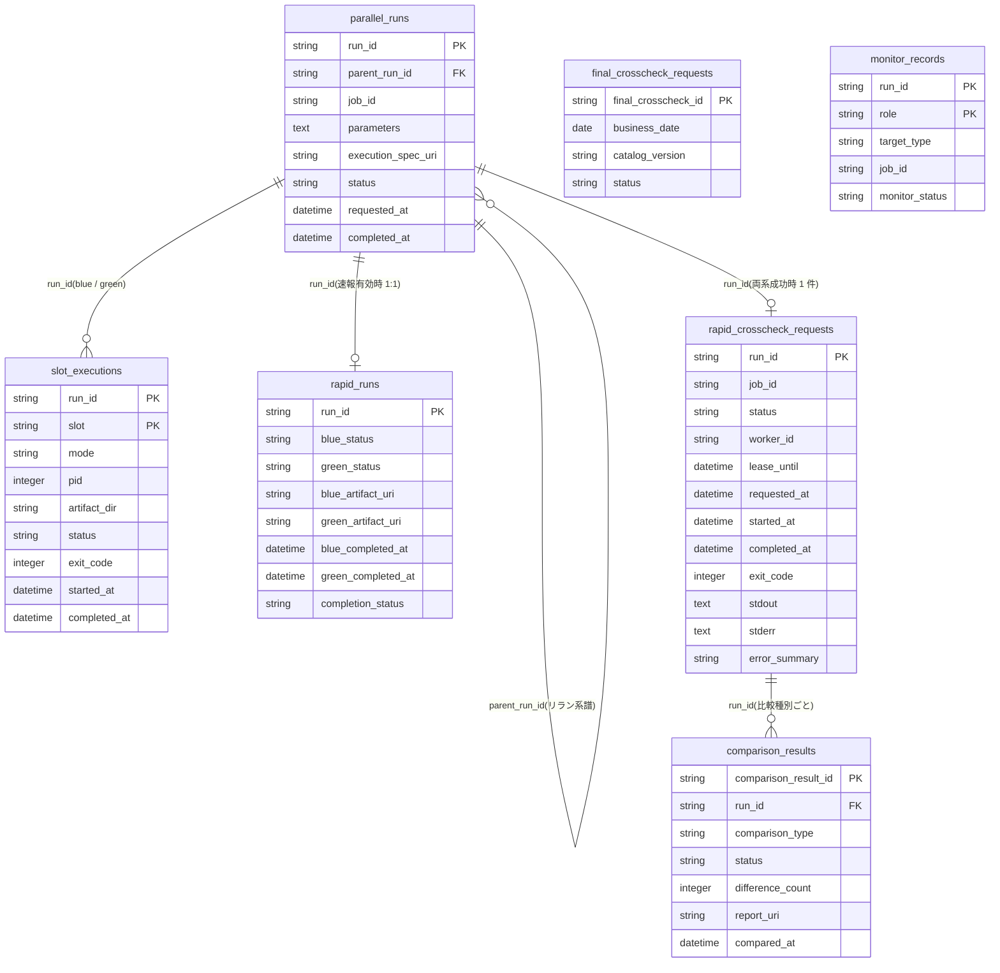
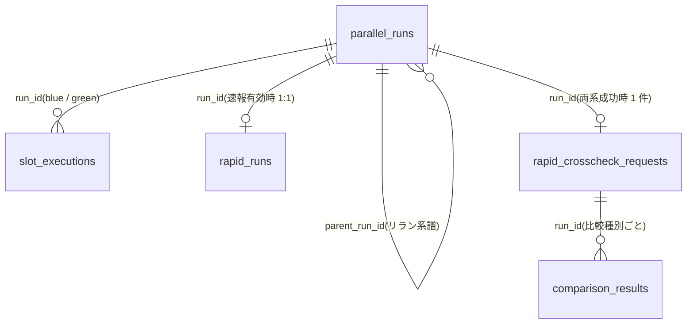
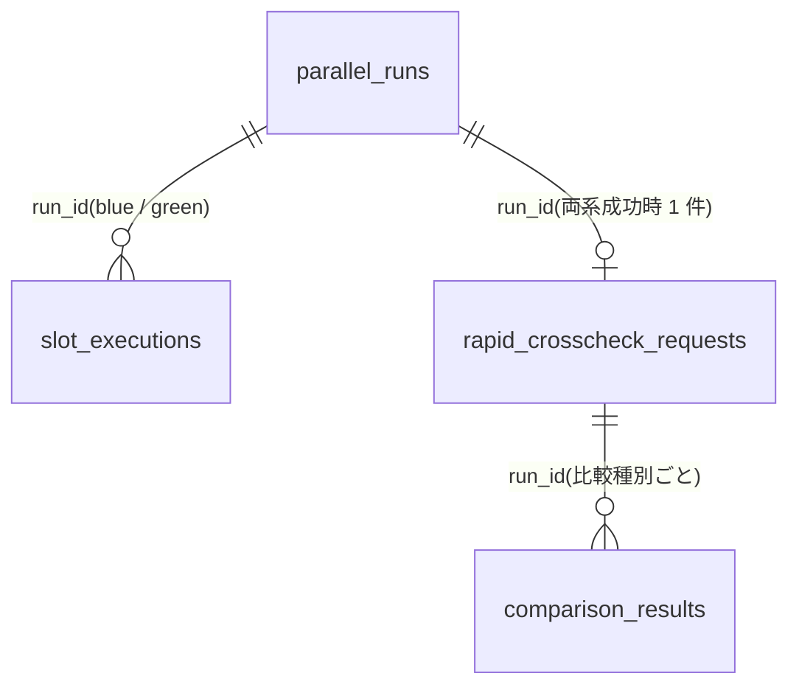
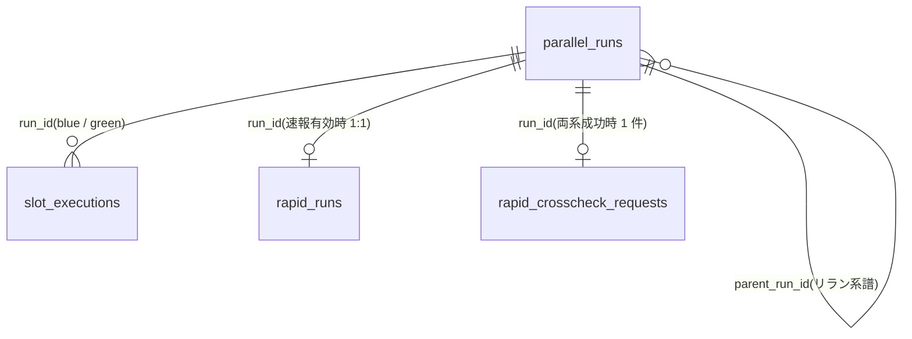

# データストアスキーマ

## サマリー

| データストア | 項目数 |
|------------|:------:|
| RDB テーブル | 7 |
| RDB インデックス | 9 |
| RDB 外部キー | 5 |

## RDB

### ER 図

#### 全体

#### クロスチェック業務

#### 実行復旧業務

#### 実行監視業務

#### 実装切替業務

### テーブル一覧

| テーブル名 | RDRA 情報 | 説明 | カラム数 | インデックス数 | 利用 UC 数 |
|-----------|----------|------|:-------:|:----------:|:--------:|
| parallel_runs | 並行稼働実行(parallel_run) | 1 回の並行稼働を run_id で相関付ける管理レコード(arch E-013)。速報クロスチェック有効時に facade が発行し、background-rerun がリラン時に parent_run_id 付きで新規作成する。成果物ディレクトリ・rapid_runs・比較依頼・比較結果を run_id で紐付ける | 8 | 1 | 9 |
| slot_executions | slot 実行 | run_id ごとの blue / green 各 slot の実行(mode・PID・成果物ディレクトリ・状態)を識別するレコード(arch E-014)。速報有効時のみ RDB に永続化し、off ではファイルのみ(採用値 #7)。ハング検知・中止・background 側リランの対象特定に使う | 9 | 0 | 8 |
| rapid_runs | 速報実行(rapid_run) | run_id ごとに blue / green の完了通知を集約して両系成功判定を行うレコード(arch E-016)。facade が parallel_runs と同一トランザクションで completion_status = PENDING で作成し(canonical C3)、速報クロスチェック runner が完了通知を受けて更新する | 8 | 0 | 6 |
| rapid_crosscheck_requests | 速報比較依頼(rapid_crosscheck_request) | blue と green が両方成功したときに run_id を主キーとして 1 件だけ作成される、管理 DB 上のジョブキューのレコード(arch E-017)。速報クロスチェック worker が poll / claim し、worker_id と lease_until で多重実行を防ぐ。比較ツールの stdout / stderr / exit_code をそのまま保持する(E-020 を内包) | 12 | 2 | 10 |
| comparison_results | 比較結果(comparison_result) | 速報比較の結果(comparison_type・status・difference_count・report_uri・compared_at)を保持するレコード(arch E-018)。速報クロスチェック worker が比較ツールの終了コードと stdout から登録し、運用者が run_id で参照する。リリース判断の正本には用いない | 7 | 2 | 3 |
| final_crosscheck_requests | 確報比較依頼(final_crosscheck_request) | 確報クロスチェック runner が business_date と対象カタログの版で登録し、終端状態まで同期 polling する依頼レコード(arch E-019)。確報クロスチェック worker が claim / lease し、日次全量比較の stdout / stderr / exit_code を保存する(E-020 を内包)。速報側と別ドメインとして分離し、他テーブルへの FK を持たない | 13 | 2 | 6 |
| monitor_records | 監視記録 | 定期起動されたハング検知スクリプトが、未完了の background slot 実行と速報比較依頼について残す監視レコード(arch E-021)。監視対象 ID は run_id + role。5 分ごとに UPSERT され、通知の冪等判定と hang_detect_limit_minutes 調整の根拠(警告時経過時間)に使う。RAPID_CROSSCHECK_MODE=on のときだけ書き込む(採用値 #8)。列名は canonical C2 に従う | 12 | 2 | 4 |

### parallel_runs

**RDRA 情報**: 並行稼働実行(parallel_run)
**説明**: 1 回の並行稼働を run_id で相関付ける管理レコード(arch E-013)。速報クロスチェック有効時に facade が発行し、background-rerun がリラン時に parent_run_id 付きで新規作成する。成果物ディレクトリ・rapid_runs・比較依頼・比較結果を run_id で紐付ける

#### カラム

| カラム名 | 型 | NULL | 説明 |
|---------|---|:----:|------|
| **run_id** (PK) | string | NO | run の識別子。形式は {UTC yyyymmddThhmmssZ}-{job_id}-{8 hex}(採用値 #9)。情報.tsv: run_id |
| parent_run_id | string | YES | リラン元の run_id(直前のリラン元を指す自己参照)。初回実行は NULL。系譜は元の実行まで数珠つなぎに辿る。情報.tsv: parent_run_id |
| job_id | string | NO | ジョブスケジューラから渡された JOB_ID。情報.tsv: job_id |
| parameters | text | NO | PARAM... を順序どおりに保持した JSON 配列文字列(引数無しは [])。リラン時は元 run の値を複製する。情報.tsv: parameters |
| execution_spec_uri | string | NO | 確定保存した execution-spec.json のパス(<ARTIFACT_ROOT>/facade/<run_id>/execution-spec.json)。rapid-crosscheck リランでは元 run の値を引き継ぐ。情報.tsv: execution_spec_uri |
| status | string | NO | 並行稼働実行の状態。値: STARTED(レコード作成直後), RUNNING(全 slot 起動後), COMPLETED(foreground 結果の中継完了), ABORTED(運用者の明示中止) |
| requested_at | datetime | NO | run の作成日時(UTC)。情報.tsv: requested_at |
| completed_at | datetime | YES | COMPLETED / ABORTED へ遷移した日時(UTC)。未終端は NULL。情報.tsv: completed_at |

#### 外部キー

| カラム | 参照先テーブル | 参照先カラム | ON DELETE |
|-------|-------------|------------|----------|
| parent_run_id | parallel_runs | run_id | RESTRICT |

#### インデックス

| 名前 | カラム | UNIQUE | 理由 | 利用 UC |
|------|-------|:------:|------|--------|
| idx_parallel_runs_parent_run_id | parent_run_id | NO | 系譜: run-lineage.sh の子孫探索(WHERE parent_run_id = ?)。自己参照 FK のインデックスを兼ねる(リラン UC は INSERT のみで利用者ではない) | リラン結果を parent_run_id で追跡する |

#### 利用 UC

| UC | 操作 |
|---|------|
| slot 実行モードを選択して runner を起動する | INSERT, UPDATE |
| foreground slot の結果をジョブスケジューラへ中継する | UPDATE |
| 両系成功時に速報比較依頼を作成する | SELECT |
| リラン対象を検証する | SELECT |
| リラン結果を parent_run_id で追跡する | SELECT |
| 元の execution-spec.json から復元して新しい run_id で起動する | INSERT, UPDATE, SELECT |
| 速報比較依頼だけを新規作成する | SELECT, INSERT, UPDATE |
| 現在状態を確認して停止確認に応答する | SELECT |
| 実行を ABORTED へ遷移させる | UPDATE |

### slot_executions

**RDRA 情報**: slot 実行
**説明**: run_id ごとの blue / green 各 slot の実行(mode・PID・成果物ディレクトリ・状態)を識別するレコード(arch E-014)。速報有効時のみ RDB に永続化し、off ではファイルのみ(採用値 #7)。ハング検知・中止・background 側リランの対象特定に使う

#### カラム

| カラム名 | 型 | NULL | 説明 |
|---------|---|:----:|------|
| **run_id** (PK) | string | NO | 所属する並行稼働実行の run_id。情報.tsv: run_id |
| **slot** (PK) | string | NO | 実装スロット。値: blue, green |
| mode | string | NO | slot 実行モード。値: foreground, background(off の slot はレコードを作らない) |
| pid | integer | YES | 起動した runner プロセスの PID。facade / background-rerun は runner 起動前に pid=NULL で INSERT し、起動直後に pid を UPDATE する(runner の終端 UPDATE より先に行が存在することを保証する。起動失敗時は NULL のまま)。foreground の待機対象と background の中止判断に使う。情報.tsv: PID |
| artifact_dir | string | NO | Runner Result の成果物ディレクトリ(<ARTIFACT_ROOT>/facade/<run_id>/<slot>/)。情報.tsv: 成果物ディレクトリ |
| status | string | NO | slot 実行の状態。値: RUNNING(起動後), SUCCEEDED(exitcode.txt が 0), FAILED(exitcode.txt が非 0), ABORTED(運用者の明示中止) |
| exit_code | integer | YES | exitcode.txt の値。起動時は NULL、終了時に更新。SUCCEEDED / FAILED の判定根拠 |
| started_at | datetime | NO | runner 起動日時(UTC)。起動前 INSERT 時の時刻(起動直前)を置き、pid UPDATE では変更しない。情報.tsv: 開始時刻 |
| completed_at | datetime | YES | SUCCEEDED / FAILED / ABORTED へ遷移した日時(UTC)。未終端は NULL。情報.tsv: 終了時刻(UC 間で finished_at / completed_at が混在していたため completed_at に統一) |

#### 外部キー

| カラム | 参照先テーブル | 参照先カラム | ON DELETE |
|-------|-------------|------------|----------|
| run_id | parallel_runs | run_id | RESTRICT |

#### 利用 UC

| UC | 操作 |
|---|------|
| slot 実行モードを選択して runner を起動する | INSERT, UPDATE |
| 実装スクリプトを実行して Runner Result を出力する | UPDATE |
| リラン対象を検証する | SELECT |
| リラン結果を parent_run_id で追跡する | SELECT |
| 元の execution-spec.json から復元して新しい run_id で起動する | INSERT, UPDATE |
| 現在状態を確認して停止確認に応答する | SELECT |
| 実行を ABORTED へ遷移させる | UPDATE |
| background 実行の経過時間と終了状態を判定する | SELECT |

### rapid_runs

**RDRA 情報**: 速報実行(rapid_run)
**説明**: run_id ごとに blue / green の完了通知を集約して両系成功判定を行うレコード(arch E-016)。facade が parallel_runs と同一トランザクションで completion_status = PENDING で作成し(canonical C3)、速報クロスチェック runner が完了通知を受けて更新する

#### カラム

| カラム名 | 型 | NULL | 説明 |
|---------|---|:----:|------|
| **run_id** (PK) | string | NO | 対応する並行稼働実行の run_id(1:1)。情報.tsv: run_id |
| blue_status | string | YES | blue の完了結果。値: SUCCEEDED(exit_code=0), FAILED(非 0)。未受信は NULL |
| green_status | string | YES | green の完了結果。値: SUCCEEDED(exit_code=0), FAILED(非 0)。未受信は NULL |
| blue_artifact_uri | string | YES | blue 完了通知の --artifact-uri(成果物ディレクトリ)。比較ツールの入力に使う。未受信は NULL |
| green_artifact_uri | string | YES | green 完了通知の --artifact-uri(成果物ディレクトリ)。比較ツールの入力に使う。未受信は NULL |
| blue_completed_at | datetime | YES | blue 完了通知の受信日時(UTC)。未受信は NULL。情報.tsv: blue_completed_at |
| green_completed_at | datetime | YES | green 完了通知の受信日時(UTC)。未受信は NULL。情報.tsv: green_completed_at |
| completion_status | string | NO | 完了状況(状態モデル: 速報実行の完了状況)。値: PENDING(両系未完了), ONE_COMPLETED(片系完了), BOTH_SUCCEEDED(両系成功), ANY_FAILED(いずれか失敗), REQUEST_CREATED(比較依頼作成済み) |

#### 外部キー

| カラム | 参照先テーブル | 参照先カラム | ON DELETE |
|-------|-------------|------------|----------|
| run_id | parallel_runs | run_id | RESTRICT |

#### 利用 UC

| UC | 操作 |
|---|------|
| slot 実行モードを選択して runner を起動する | INSERT |
| 速報クロスチェック runner へ完了通知を送信する | SELECT, UPDATE |
| 両系成功時に速報比較依頼を作成する | SELECT, UPDATE |
| 比較ツールでジョブ単位比較を実行して結果を登録する | SELECT |
| 速報比較結果を参照する | SELECT |
| 速報比較依頼だけを新規作成する | SELECT, INSERT |

### rapid_crosscheck_requests

**RDRA 情報**: 速報比較依頼(rapid_crosscheck_request)
**説明**: blue と green が両方成功したときに run_id を主キーとして 1 件だけ作成される、管理 DB 上のジョブキューのレコード(arch E-017)。速報クロスチェック worker が poll / claim し、worker_id と lease_until で多重実行を防ぐ。比較ツールの stdout / stderr / exit_code をそのまま保持する(E-020 を内包)

#### カラム

| カラム名 | 型 | NULL | 説明 |
|---------|---|:----:|------|
| **run_id** (PK) | string | NO | 対象の並行稼働実行の run_id(主キー。1 run_id に 1 依頼)。情報.tsv: run_id(主キー) |
| job_id | string | NO | 比較定義の解決に使う JOB_ID(parallel_runs.job_id と照合済み)。情報.tsv: job_id |
| status | string | NO | クロスチェック依頼の状態。値: REQUESTED(未 claim), CLAIMED(worker が lease 取得), RUNNING(比較ツール起動後), SUCCEEDED(exit_code=0), FAILED(非 0 または起動失敗), ABORTED(運用者の明示中止) |
| worker_id | string | YES | claim した worker の識別子({hostname}-{pid} 既定。ホスト名の `.` は `-` に置換。canonical C4)。REQUESTED / lease 失効解放後は NULL |
| lease_until | datetime | YES | lease の失効日時(UTC。claim 時刻 + RAPID_LEASE_SEC 秒、既定 600 秒。rapid-crosscheck.env)。失効かつ started_at IS NULL なら REQUESTED に戻す。REQUESTED は NULL |
| requested_at | datetime | NO | 依頼作成日時(UTC)。poll の取り出し順(昇順)に使う。情報.tsv: requested_at |
| started_at | datetime | YES | 比較ツール起動日時(UTC)。RUNNING 遷移時に設定。未開始は NULL。情報.tsv: started_at |
| completed_at | datetime | YES | SUCCEEDED / FAILED / ABORTED へ遷移した日時(UTC)。未終端は NULL。情報.tsv: completed_at |
| exit_code | integer | YES | 比較ツールの終了コード(0=比較 OK / 3=比較 NG / 6=実行エラー。起動失敗は 6)。終端前は NULL。情報.tsv: exit_code |
| stdout | text | YES | 比較ツールの標準出力全文。comparison_results の登録元(difference_count= / report_uri= 行を含む)。終端前は NULL |
| stderr | text | YES | 比較ツールの標準エラー全文。終端前は NULL |
| error_summary | string | YES | FAILED 時の要約(stderr 先頭 1 行、または起動失敗の理由)。SUCCEEDED は NULL。情報.tsv: error_summary |

#### 外部キー

| カラム | 参照先テーブル | 参照先カラム | ON DELETE |
|-------|-------------|------------|----------|
| run_id | parallel_runs | run_id | RESTRICT |

#### インデックス

| 名前 | カラム | UNIQUE | 理由 | 利用 UC |
|------|-------|:------:|------|--------|
| idx_rapid_crosscheck_requests_status_requested_at | status, requested_at | NO | poll: worker が REQUESTED を requested_at 昇順で 1 件取得する(30 秒間隔)。hang-detector の未終端依頼走査にも使う。ユニーク制約: run_id 主キーで 1 run に 1 依頼を保証するため追加のユニークは不要 | 速報比較依頼を claim する, background 実行の経過時間と終了状態を判定する |
| idx_rapid_crosscheck_requests_status_lease_until | status, lease_until | NO | lease: 失効した CLAIMED の回収(WHERE status = 'CLAIMED' AND lease_until < now AND started_at IS NULL)を poll ごとに範囲検索する | 速報比較依頼を claim する |

#### 利用 UC

| UC | 操作 |
|---|------|
| 両系成功時に速報比較依頼を作成する | INSERT |
| 速報比較依頼を claim する | UPDATE |
| 比較ツールでジョブ単位比較を実行して結果を登録する | UPDATE |
| 速報比較結果を参照する | SELECT |
| background 実行の経過時間と終了状態を判定する | SELECT |
| リラン対象を検証する | SELECT |
| リラン結果を parent_run_id で追跡する | SELECT |
| 速報比較依頼だけを新規作成する | INSERT |
| 現在状態を確認して停止確認に応答する | SELECT |
| 実行を ABORTED へ遷移させる | UPDATE |

### comparison_results

**RDRA 情報**: 比較結果(comparison_result)
**説明**: 速報比較の結果(comparison_type・status・difference_count・report_uri・compared_at)を保持するレコード(arch E-018)。速報クロスチェック worker が比較ツールの終了コードと stdout から登録し、運用者が run_id で参照する。リリース判断の正本には用いない

#### カラム

| カラム名 | 型 | NULL | 説明 |
|---------|---|:----:|------|
| **comparison_result_id** (PK) | string | NO | 比較結果の識別子(8 桁 hex 乱数)。情報.tsv: comparison_result_id |
| run_id | string | NO | 結果の元になった速報比較依頼の run_id。情報.tsv: run_id |
| comparison_type | string | NO | 比較定義の比較種別。値: job(速報。crosscheck-job-map.tsv の該当 job_id 行の comparison_type を転記)/ full(確報。速報側の本テーブルには現れない)。cli-command-contract.yaml の crosscheck-job-map.tsv.comparison_type enum [job, full] と一致させる。比較定義が無い job_id では本テーブルに INSERT せず依頼を FAILED(error_summary=comparison definition not found job_id=...)で終端する。情報.tsv: comparison_type |
| status | string | NO | 比較結果ステータス(比較ツール終了コードから判定)。値: OK(0=比較 OK), NG(3=比較 NG), FAILED(6=実行エラー・その他) |
| difference_count | integer | YES | 比較ツール stdout の difference_count=N から抽出した差分件数。出力が無ければ NULL |
| report_uri | string | YES | 比較ツール stdout の report_uri=... から抽出したレポートの所在。出力が無ければ NULL |
| compared_at | datetime | NO | 比較ツール終了日時(UTC)。run_id 内の並び順に使う。情報.tsv: compared_at(arch E-018 では occurred_at) |

#### 外部キー

| カラム | 参照先テーブル | 参照先カラム | ON DELETE |
|-------|-------------|------------|----------|
| run_id | rapid_crosscheck_requests | run_id | RESTRICT |

#### インデックス

| 名前 | カラム | UNIQUE | 理由 | 利用 UC |
|------|-------|:------:|------|--------|
| uq_comparison_results_run_id_comparison_type | run_id, comparison_type | YES | ユニーク制約: 同一依頼(run_id)で同じ比較種別の結果を二重登録しない。worker の再実行は新 run_id で依頼を作り直すため衝突しない。FK インデックス(run_id 先頭)を兼ねる | 比較ツールでジョブ単位比較を実行して結果を登録する, background 実行の経過時間と終了状態を判定する |
| idx_comparison_results_run_id_compared_at | run_id, compared_at | NO | run_id 単位の結果一覧を compared_at 昇順で取得する(rapid-crosscheck-result.sh の ORDER BY compared_at ASC LIMIT ?)。登録 UC は INSERT のみで利用者ではない | 速報比較結果を参照する |

#### 利用 UC

| UC | 操作 |
|---|------|
| 比較ツールでジョブ単位比較を実行して結果を登録する | INSERT |
| 速報比較結果を参照する | SELECT |
| background 実行の経過時間と終了状態を判定する | SELECT |

### final_crosscheck_requests

**RDRA 情報**: 確報比較依頼(final_crosscheck_request)
**説明**: 確報クロスチェック runner が business_date と対象カタログの版で登録し、終端状態まで同期 polling する依頼レコード(arch E-019)。確報クロスチェック worker が claim / lease し、日次全量比較の stdout / stderr / exit_code を保存する(E-020 を内包)。速報側と別ドメインとして分離し、他テーブルへの FK を持たない

#### カラム

| カラム名 | 型 | NULL | 説明 |
|---------|---|:----:|------|
| **final_crosscheck_id** (PK) | string | NO | 確報比較依頼の識別子。形式は {UTC yyyymmddThhmmssZ}-final-{8 hex}(runner が発行)。abort-final-crosscheck.sh の --run-id はこの値(canonical C7) |
| business_date | date | NO | 比較対象の業務日付(--business-date)。情報.tsv: business_date |
| catalog_version | string | NO | 比較に使う対象カタログの版(--catalog-version)。リリース判断の対象範囲を確定する。情報.tsv: 対象カタログの版 |
| status | string | NO | クロスチェック依頼の状態。値: REQUESTED(未 claim), CLAIMED(worker が lease 取得), RUNNING(比較ツール起動後), SUCCEEDED(exit_code=0), FAILED(非 0 または起動失敗), ABORTED(運用者の明示中止) |
| worker_id | string | YES | claim した worker の識別子({hostname}-{pid} 既定。ホスト名の `.` は `-` に置換)。REQUESTED / lease 失効解放後は NULL |
| lease_until | datetime | YES | lease の失効日時(UTC。claim 時刻 + FINAL_LEASE_MINUTES、既定 10 分)。失効かつ started_at IS NULL なら REQUESTED に戻す。REQUESTED は NULL |
| requested_at | datetime | NO | 依頼登録日時(UTC)。poll の取り出し順(昇順)に使う。情報.tsv: requested_at |
| started_at | datetime | YES | 比較ツール起動日時(UTC)。RUNNING 遷移時に設定。未開始は NULL。情報.tsv: started_at |
| completed_at | datetime | YES | SUCCEEDED / FAILED / ABORTED へ遷移した日時(UTC)。未終端は NULL。情報.tsv: completed_at |
| exit_code | integer | YES | 比較ツールの終了コード(0=比較 OK / 3=比較 NG / 6=実行エラー。起動失敗は 6)。runner がジョブスケジューラへ無加工で中継する。終端前は NULL |
| stdout | text | YES | 比較ツールの標準出力全文。runner が標準出力へ無加工で中継する。終端前は NULL |
| stderr | text | YES | 比較ツールの標準エラー全文。runner が標準エラーへ無加工で中継する。終端前は NULL |
| error_summary | string | YES | 起動失敗・書き込み失敗の要約。それ以外(正常終了・比較 NG)は NULL。情報.tsv: error_summary |

#### インデックス

| 名前 | カラム | UNIQUE | 理由 | 利用 UC |
|------|-------|:------:|------|--------|
| idx_final_crosscheck_requests_status_requested_at | status, requested_at | NO | poll: worker が REQUESTED を requested_at 昇順で 1 件取得する(30 秒間隔、〜10 TPS 以下)。ユニーク制約: (business_date, catalog_version) は再実行経路で同一日付の依頼が複数存在しうるため張らない。未終端の部分ユニークも不採用(_review_notes 参照) | 確報比較依頼を claim する |
| idx_final_crosscheck_requests_status_lease_until | status, lease_until | NO | lease: 失効した CLAIMED の回収(WHERE status = 'CLAIMED' AND lease_until < now AND started_at IS NULL)を poll ごとに範囲検索する | 確報比較依頼を claim する |

#### 利用 UC

| UC | 操作 |
|---|------|
| 確報比較依頼を登録して終端状態まで待機する | INSERT, SELECT |
| 確報比較依頼を claim する | UPDATE |
| 比較ツールで日次全量比較を実行して結果を保存する | UPDATE |
| 保存済みの確報結果をジョブスケジューラへ返す | SELECT |
| 現在状態を確認して停止確認に応答する | SELECT |
| 実行を ABORTED へ遷移させる | UPDATE |

### monitor_records

**RDRA 情報**: 監視記録
**説明**: 定期起動されたハング検知スクリプトが、未完了の background slot 実行と速報比較依頼について残す監視レコード(arch E-021)。監視対象 ID は run_id + role。5 分ごとに UPSERT され、通知の冪等判定と hang_detect_limit_minutes 調整の根拠(警告時経過時間)に使う。RAPID_CROSSCHECK_MODE=on のときだけ書き込む(採用値 #8)。列名は canonical C2 に従う

#### カラム

| カラム名 | 型 | NULL | 説明 |
|---------|---|:----:|------|
| **run_id** (PK) | string | NO | 監視対象の run_id。off モードでは parallel_runs が無いため FK にしない。情報.tsv: 監視対象 ID(run_id + role) |
| **role** (PK) | string | NO | 監視対象の run role。値: blue, green, rapid-crosscheck |
| target_type | string | NO | 監視対象種別。値: background_slot(background slot 実行), rapid_request(速報比較依頼)。role から一意に導出できる(blue / green → background_slot、rapid-crosscheck → rapid_request)ため 3NF 上は role への推移従属だが、情報.tsv の属性「監視対象種別」を写し、傾向集計・通知メールでの可読性のため非正規化して保持する(hang-detector が role と同時に書き込み、以後変更しない) |
| job_id | string | NO | 監視対象の JOB_ID(execution-spec.json または依頼レコードから転記)。parallel_runs と JOIN せずに傾向集計するために保持する(canonical C2) |
| monitor_status | string | NO | 監視状態(状態モデル: 監視状態)。値: NOT_MONITORED(監視対象外), MONITORING(監視中), HANG_SUSPECTED_NOTIFIED(ハング疑い通知済み), EXEC_ERROR_NOTIFIED(実行エラー通知済み), COMPARE_ERROR_NOTIFIED(比較異常通知済み), COMPLETED(正常終了・中止済み対象の終端)。遷移: MONITORING → HANG_SUSPECTED_NOTIFIED / EXEC_ERROR_NOTIFIED / COMPARE_ERROR_NOTIFIED / COMPLETED、HANG_SUSPECTED_NOTIFIED → EXEC_ERROR_NOTIFIED / COMPARE_ERROR_NOTIFIED / COMPLETED(通知後に対象が終端した場合。rdra-feedback.md #7)、MONITORING / HANG_SUSPECTED_NOTIFIED → COMPLETED(監視対象が ABORTED になった場合。hang_judgement COMPLETED。rdra-feedback.md #11) |
| started_at | datetime | NO | 監視対象の開始時刻(UTC)。background slot は started-at.txt、速報比較依頼は started_at(未開始は requested_at)。情報.tsv: 開始時刻(started-at.txt) |
| elapsed_minutes | integer | NO | 最新の判定時点での started_at からの経過時間(分)。情報.tsv: 経過時間 |
| hang_detect_limit_minutes | integer | NO | 判定に使ったハング検知上限(分)。background slot は execution-spec.json の slots.<role>.hang_detect_limit_minutes を転記(0 は対象外)、速報比較依頼(role=rapid-crosscheck)は hang-detector.env の RAPID_HANG_DETECT_LIMIT_MINUTES(既定 60)を転記。情報.tsv: hang_detect_limit_minutes |
| hang_suspected_at | datetime | YES | ハング疑い通知(hang-suspected)の送信成功日時(UTC。MONITORING → HANG_SUSPECTED_NOTIFIED へ遷移した時刻。UC『監視記録を保存する』の計算ルールと同じ)。UPSERT では NULL で上書きしない。未通知は NULL。情報.tsv: hang_suspected_at |
| alerted_at | datetime | YES | 最新の通知メールの送信成功日時(UTC)。送信成功時のみ更新(送信失敗では更新せず次回再送)。送信要否の冪等判定は monitor_status の遷移有無で行い、本列は記録用。未通知は NULL。情報.tsv: alerted_at |
| elapsed_minutes_at_alert | integer | YES | 最初の警告時の経過時間(分)。hang_detect_limit_minutes の調整根拠。以後の判定で上書きしない。未通知は NULL。情報.tsv: 警告時の経過時間(arch E-021 の elapsed_at_alert_minutes を canonical C2 で改名) |
| judged_at | datetime | NO | 最新の判定日時(UTC)。UPSERT のたびに更新。傾向集計の期間絞り込みに使う。情報.tsv: 判定日時 |

#### インデックス

| 名前 | カラム | UNIQUE | 理由 | 利用 UC |
|------|-------|:------:|------|--------|
| idx_monitor_records_job_id_role_judged_at | job_id, role, judged_at | NO | 傾向: hang-detect-trend.sh の job_id / role 絞り込みと judged_at >= ? の期間絞り込み(GROUP BY job_id, role)。ユニーク制約: 主キー (run_id, role) で監視対象 ID の一意性を保証するため追加のユニークは不要。保存 UC は主キーで UPSERT するため利用者ではない | hang_detect_limit_minutes をジョブごとに調整する |
| idx_monitor_records_monitor_status | monitor_status | NO | 5 分ごとの走査で未終端の監視記録(monitor_status NOT IN 終端値)を列挙する | background 実行の経過時間と終了状態を判定する |

#### 利用 UC

| UC | 操作 |
|---|------|
| background 実行の経過時間と終了状態を判定する | SELECT |
| ハング疑い・実行エラー・比較異常を通知する | SELECT |
| 監視記録を保存する | INSERT, UPDATE |
| hang_detect_limit_minutes をジョブごとに調整する | SELECT |
