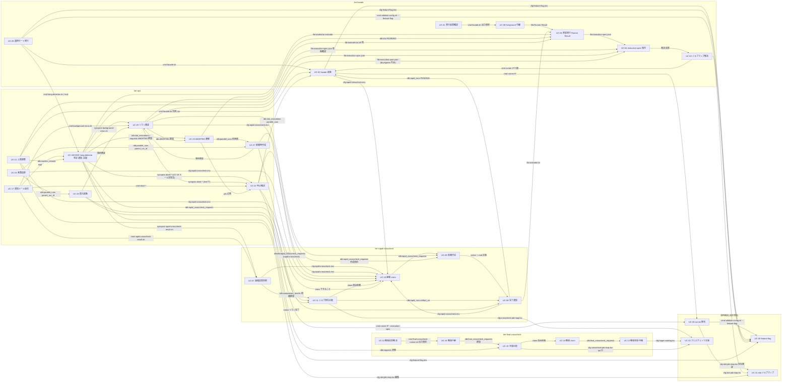

# UC 間依存(Step6.5 観点②「依存の宣言」の正本)

## 前提(これだけ知っていれば読める)

- relay-gate は HTTP API を持たない。UC 間の連携は **CLI コマンド起動 / 管理 DB(RDB)のテーブル / 完了通知(同期プロセス起動)/ ファイル契約(execution-spec.json・Runner Result 3 ファイル)/ 設定ファイル(env・TSV)** の 5 種だけで成り立つ
- 契約の正本は `api/cli-command-contract.yaml`(コマンド・設定ファイル・成果物レイアウト・環境変数)、`api/asyncapi.yaml`(RDB ジョブキュー・完了通知・通知メール)、`datastore/rdb-schema.yaml`(7 テーブル)の 3 ファイル
- 設定ファイルは 7 種(feature-flag.env / `<slot>`-job-map.tsv / crosscheck-job-map.tsv / target-catalog.tsv / rapid-crosscheck.env / hang-detector.env / final-crosscheck.env)。`rapid-crosscheck.env`(定義元 UC-10、`RAPID_DB_CONN_REF` / `RAPID_LEASE_SEC` / `RAPID_POLL_INTERVAL_SEC`)は管理 DB を使う全コマンド(facade.sh / slot runner を含む)が readers として宣言されている
- 環境変数 `RELAY_GATE_NOW`(テスト専用の現在時刻注入。`environment_variables`)は UC-10 / UC-14 / UC-18 / UC-19 / UC-20 / UC-23 の BDD Given に現れるが、UC 間の依存ではない(全コマンド共通の横断規則。facade.sh / background-rerun.sh は runner に引き継ぐ)
- 本ファイルは第 3 ラウンド(Step6.5 反証レビュー round-1 の修正: `_review/round-1-resolution-*.md` / `round-1-consolidation.md`)後の UC Spec / 契約に対して再検証済み。主な変更: validate-config.sh は tier-facade 単一定義(定義元 UC-29、他 4 UC は uses)/ rapid-crosscheck-runner.sh の定義元は UC-08(UC-09 は uses)/ runner IF の定義元は UC-30(UC-26 は uses)/ abort-* の `used_by_ucs` に UC-25 追加 / background-rerun.sh `--role rapid-crosscheck` は execution-spec.json を読まず rapid_crosscheck_requests を参照 / hang_judgement 6 値化と ABORTED の終端処理(UC-18 が slot_executions を読む)
- UC ID(UC-01〜UC-32)は `_inference.md`「UC-ティアマッピング」の # と同じ番号。依存表の「依存元 → 依存先」は「依存元 UC が動くために依存先 UC の成果(コマンド・行・ファイル)が先に存在する」を意味する
- `RAPID_CROSSCHECK_MODE=off` では管理 DB 経由の依存(RDB テーブル・完了通知)が消え、ファイル契約だけが残る。依存表の「種類」列で RDB / 完了通知 とあるものは on のときだけ有効

## UC 一覧と担当 tier

| UC ID | UC 名称 | 業務 / BUC | 担当 tier | 主コマンド / 主成果 |
|---|---|---|---|---|
| UC-01 | [業務ジョブの実行結果を確認する](<../実装切替業務/実装切替ジョブ実行フロー/業務ジョブの実行結果を確認する/spec.md>) | 実装切替業務 / 実装切替ジョブ実行フロー | facade | facade.sh の応答契約(読む UC。uses) |
| UC-02 | [slot 実行モードを選択して runner を起動する](<../実装切替業務/実装切替ジョブ実行フロー/slot 実行モードを選択して runner を起動する/spec.md>) | 実装切替業務 / 実装切替ジョブ実行フロー | facade | facade.sh(defines)、runner IF(uses) |
| UC-03 | [ジョブマップで JOB_ID から実行先を解決する](<../実装切替業務/実装切替ジョブ実行フロー/ジョブマップで JOB_ID から実行先を解決する/spec.md>) | 実装切替業務 / 実装切替ジョブ実行フロー | facade | slot runner(ジョブマップ解決。runner IF uses) |
| UC-04 | [execution-spec.json を確定保存する](<../実装切替業務/実装切替ジョブ実行フロー/execution-spec.json を確定保存する/spec.md>) | 実装切替業務 / 実装切替ジョブ実行フロー | facade | slot runner(execution-spec.json。runner IF uses) |
| UC-05 | [実装スクリプトを実行して Runner Result を出力する](<../実装切替業務/実装切替ジョブ実行フロー/実装スクリプトを実行して Runner Result を出力する/spec.md>) | 実装切替業務 / 実装切替ジョブ実行フロー | facade | slot runner(SSH 実行・Runner Result 3 ファイル。slot-completed publish) |
| UC-06 | [foreground slot の結果をジョブスケジューラへ中継する](<../実装切替業務/実装切替ジョブ実行フロー/foreground slot の結果をジョブスケジューラへ中継する/spec.md>) | 実装切替業務 / 実装切替ジョブ実行フロー | facade | facade.sh(出力契約 defines) |
| UC-07 | [速報比較結果を参照する](<../クロスチェック業務/速報クロスチェックフロー/速報比較結果を参照する/spec.md>) | クロスチェック業務 / 速報クロスチェックフロー | rapid-crosscheck | rapid-crosscheck-result.sh(defines) |
| UC-08 | [速報クロスチェック runner へ完了通知を送信する](<../クロスチェック業務/速報クロスチェックフロー/速報クロスチェック runner へ完了通知を送信する/spec.md>) | クロスチェック業務 / 速報クロスチェックフロー | facade, rapid-crosscheck | rapid-crosscheck-runner.sh blue-completed / green-completed(defines。契約 `defined_in_uc` と一致)、slot-completed(publish 送信側 / subscribe 受信側) |
| UC-09 | [両系成功時に速報比較依頼を作成する](<../クロスチェック業務/速報クロスチェックフロー/両系成功時に速報比較依頼を作成する/spec.md>) | クロスチェック業務 / 速報クロスチェックフロー | rapid-crosscheck | rapid-crosscheck-runner.sh(uses。両系成功判定・依頼 INSERT。stdout 3 行を追記) |
| UC-10 | [速報比較依頼を claim する](<../クロスチェック業務/速報クロスチェックフロー/速報比較依頼を claim する/spec.md>) | クロスチェック業務 / 速報クロスチェックフロー | rapid-crosscheck | rapid-crosscheck-worker.sh(defines、claim)、rapid-crosscheck.env(defines) |
| UC-11 | [比較ツールでジョブ単位比較を実行して結果を登録する](<../クロスチェック業務/速報クロスチェックフロー/比較ツールでジョブ単位比較を実行して結果を登録する/spec.md>) | クロスチェック業務 / 速報クロスチェックフロー | rapid-crosscheck | rapid-crosscheck-worker.sh(uses。比較実行・comparison_results) |
| UC-12 | [確報クロスチェック結果を確認する](<../クロスチェック業務/確報クロスチェックフロー/確報クロスチェック結果を確認する/spec.md>) | クロスチェック業務 / 確報クロスチェックフロー | final-crosscheck | final-crosscheck-runner.sh の応答契約(読む UC。uses) |
| UC-13 | [確報比較依頼を登録して終端状態まで待機する](<../クロスチェック業務/確報クロスチェックフロー/確報比較依頼を登録して終端状態まで待機する/spec.md>) | クロスチェック業務 / 確報クロスチェックフロー | final-crosscheck | final-crosscheck-runner.sh(defines、登録 + polling)、final-crosscheck.env(defines。UC-14 と共同) |
| UC-14 | [確報比較依頼を claim する](<../クロスチェック業務/確報クロスチェックフロー/確報比較依頼を claim する/spec.md>) | クロスチェック業務 / 確報クロスチェックフロー | final-crosscheck | final-crosscheck-worker.sh(defines、claim) |
| UC-15 | [比較ツールで日次全量比較を実行して結果を保存する](<../クロスチェック業務/確報クロスチェックフロー/比較ツールで日次全量比較を実行して結果を保存する/spec.md>) | クロスチェック業務 / 確報クロスチェックフロー | final-crosscheck | final-crosscheck-worker.sh(uses。全量比較・依頼へ保存) |
| UC-16 | [保存済みの確報結果をジョブスケジューラへ返す](<../クロスチェック業務/確報クロスチェックフロー/保存済みの確報結果をジョブスケジューラへ返す/spec.md>) | クロスチェック業務 / 確報クロスチェックフロー | final-crosscheck | final-crosscheck-runner.sh(uses。無加工中継) |
| UC-17 | [background 異常の通知メールを受け取る](<../実行監視業務/background 実行監視フロー/background 異常の通知メールを受け取る/spec.md>) | 実行監視業務 / background 実行監視フロー | ops | hang-alert-mail の受信(読む UC)。abort-* / background-rerun.sh / rapid-crosscheck-result.sh(uses) |
| UC-18 | [background 実行の経過時間と終了状態を判定する](<../実行監視業務/background 実行監視フロー/background 実行の経過時間と終了状態を判定する/spec.md>) | 実行監視業務 / background 実行監視フロー | ops | hang-detector.sh(defines、判定。hang_judgement 6 値: NOT_TARGET / COMPLETED / MONITORING / HANG_SUSPECTED / EXEC_ERROR / COMPARE_ERROR)、hang-detector.env(defines。UC-19 と共同) |
| UC-19 | [ハング疑い・実行エラー・比較異常を通知する](<../実行監視業務/background 実行監視フロー/ハング疑い・実行エラー・比較異常を通知する/spec.md>) | 実行監視業務 / background 実行監視フロー | ops | hang-detector.sh(uses。メール送信)、hang-alert-mail(publish) |
| UC-20 | [監視記録を保存する](<../実行監視業務/background 実行監視フロー/監視記録を保存する/spec.md>) | 実行監視業務 / background 実行監視フロー | ops | hang-detector.sh(uses。monitor_records UPSERT) |
| UC-21 | [hang_detect_limit_minutes をジョブごとに調整する](<../実行監視業務/background 実行監視フロー/hang_detect_limit_minutes をジョブごとに調整する/spec.md>) | 実行監視業務 / background 実行監視フロー | facade, ops | hang-detect-trend.sh(defines)、ジョブマップ編集、validate-config.sh / facade.sh(uses) |
| UC-22 | [現在状態を確認して停止確認に応答する](<../実行復旧業務/実行中止フロー/現在状態を確認して停止確認に応答する/spec.md>) | 実行復旧業務 / 実行中止フロー | ops | abort-blue.sh / abort-green.sh / abort-rapid-crosscheck.sh / abort-final-crosscheck.sh(defines、前半) |
| UC-23 | [実行を ABORTED へ遷移させる](<../実行復旧業務/実行中止フロー/実行を ABORTED へ遷移させる/spec.md>) | 実行復旧業務 / 実行中止フロー | ops | abort-*(uses。後半、条件付き UPDATE) |
| UC-24 | [リラン結果を parent_run_id で追跡する](<../実行復旧業務/background 側リランフロー/リラン結果を parent_run_id で追跡する/spec.md>) | 実行復旧業務 / background 側リランフロー | ops | run-lineage.sh(defines) |
| UC-25 | [リラン対象を検証する](<../実行復旧業務/background 側リランフロー/リラン対象を検証する/spec.md>) | 実行復旧業務 / background 側リランフロー | ops | background-rerun.sh(defines、事前検証。`--role` enum は blue / green / rapid-crosscheck の 3 値。final-crosscheck は引数エラー。`--role rapid-crosscheck` は execution-spec.json を読まず依頼レコードで特定する)、abort-blue.sh / abort-green.sh / abort-rapid-crosscheck.sh(uses。hint 行の書式) |
| UC-26 | [元の execution-spec.json から復元して新しい run_id で起動する](<../実行復旧業務/background 側リランフロー/元の execution-spec.json から復元して新しい run_id で起動する/spec.md>) | 実行復旧業務 / background 側リランフロー | facade, ops | background-rerun.sh --role blue/green(uses)、runner IF --execution-spec(uses。定義元は UC-30) |
| UC-27 | [速報比較依頼だけを新規作成する](<../実行復旧業務/background 側リランフロー/速報比較依頼だけを新規作成する/spec.md>) | 実行復旧業務 / background 側リランフロー | ops, rapid-crosscheck | background-rerun.sh --role rapid-crosscheck(uses)、rapid-crosscheck-worker.sh(uses。claim できることの確認) |
| UC-28 | [切り替えた運用モードで業務ジョブを実行する](<../適用構成業務/適用構成定義フロー/切り替えた運用モードで業務ジョブを実行する/spec.md>) | 適用構成業務 / 適用構成定義フロー | facade | 運用モードごとの facade 挙動(読む UC)。facade.sh / validate-config.sh / hang-detector.sh(uses) |
| UC-29 | [feature flag を設定する](<../適用構成業務/適用構成定義フロー/feature flag を設定する/spec.md>) | 適用構成業務 / 適用構成定義フロー | facade | feature-flag.env(defines)、validate-config.sh(defines。tier-facade 単一定義。契約 `defined_in_uc` と一致) |
| UC-30 | [slot runner の実体スクリプトを割り当てる](<../適用構成業務/適用構成定義フロー/slot runner の実体スクリプトを割り当てる/spec.md>) | 適用構成業務 / 適用構成定義フロー | facade | runner IF($BLUE_RUNNER / $GREEN_RUNNER、defines。契約 `defined_in_uc` と一致)、validate-config.sh --feature-flag(uses) |
| UC-31 | [slot ごとのジョブマップを定義する](<../適用構成業務/適用構成定義フロー/slot ごとのジョブマップを定義する/spec.md>) | 適用構成業務 / 適用構成定義フロー | facade | `<slot>`-job-map.tsv(defines)、validate-config.sh --job-map(uses。定義元は UC-29) |
| UC-32 | [クロスチェックのジョブマップと比較定義を定義する](<../適用構成業務/適用構成定義フロー/クロスチェックのジョブマップと比較定義を定義する/spec.md>) | 適用構成業務 / 適用構成定義フロー | final-crosscheck, rapid-crosscheck | crosscheck-job-map.tsv / target-catalog.tsv(defines)、validate-config.sh --crosscheck-job-map / --target-catalog(uses。定義元は UC-29(tier-facade)。検証ロジックの所有 tier は契約 `options[].owner_tier`) |

## 依存グラフ

- 矢印は「依存元 → 依存先」(依存先の成果が先に必要)
- 辺のラベル: `cmd` = コマンド起動 / `rdb:<table>` = RDB テーブル(依存先が producer、依存元が consumer)/ `notice` = 完了通知(slot-completed)/ `file:<name>` = ファイル契約 / `cfg:<file>` = 設定ファイル / `mail` = 通知メール
- UC-18 / UC-19 / UC-20 は同一コマンド(hang-detector.sh)の 3 段であり、相互参照(判定 → 送信 → 記録 → 冪等判定)は 1 ノード内の順序として扱う
- `cfg:rapid-crosscheck.env` の辺は管理 DB を使うコマンドすべてに立つが、図では代表(UC-02 / UC-08 / UC-07 / UC-22 / UC-25 / UC-24 / UC-21)だけを描く。全 readers は依存表 #59 を参照
- `synopsis` ラベルは「コマンドを起動せず、書式(synopsis)だけをメール本文や hint 行に埋め込む」参照(UC-19 / UC-25)

## 依存表

| # | 依存元 UC | 依存先 UC | 種類 | 契約の正本 | 参照箇所(依存元) |
|---|---|---|---|---|---|
| 1 | UC-02 | UC-29 | 設定ファイル | cli-command-contract.yaml `config_files[feature-flag.env]`(readers: facade.sh) | spec.md データフロー(FeatureFlagConfig)/ 分岐条件「foreground slot 排他」/ 実行ログ `feature flag loaded ... operation_mode=`(`derived`) |
| 2 | UC-02 | UC-30 | コマンド起動 | cli-command-contract.yaml `commands[$BLUE_RUNNER / $GREEN_RUNNER]`(runner IF version 1。引き継ぐ環境変数 4 つ + RELAY_GATE_NOW) | spec.md gateway RunnerProcessAdapter / 処理フロー「runner を background で起動」/ _api-summary.yaml(runner IF を role: uses) |
| 3 | UC-03 | UC-02 | コマンド起動(引数受領) | cli-command-contract.yaml `commands[$BLUE_RUNNER / $GREEN_RUNNER].options`(--run-id / --job-id / --role / --mode / -- PARAM...)、`commands[facade.sh].option_placement`(オプションは JOB_ID より前のみ) | spec.md 概要「facade から渡された PARAM...」/ shared_rules.argument_concatenation |
| 4 | UC-03 | UC-31 | 設定ファイル | cli-command-contract.yaml `config_files[<slot>-job-map.tsv]`(readers: slot runner) | spec.md 統合契約「設定契約の正本: slot ごとのジョブマップを定義する」 |
| 5 | UC-04 | UC-03 | 処理順序(同一 runner 内) | cli-command-contract.yaml `artifact_layout.execution_spec_rules` | spec.md 概要「ジョブマップから解決した自 slot の実行設定を…保存」 |
| 6 | UC-05 | UC-04 | ファイル契約 | cli-command-contract.yaml `artifact_layout.files[execution-spec.json]` | spec.md 概要「解決済み(または --execution-spec から復元済み)」 |
| 7 | UC-06 | UC-05 | ファイル契約(Runner Result) | cli-command-contract.yaml `artifact_layout.files[stdout.log / stderr.log / exitcode.txt]`(readers: facade.sh。exitcode.txt 公開後は変更しない) | spec.md 概要 / 異常系「3 ファイルが揃わない場合は終了コード 6」 |
| 8 | UC-06 | UC-02 | 処理順序(同一 facade.sh 内) | cli-command-contract.yaml `commands[facade.sh]`(exit 6 は runner 起動前の DB 失敗に限定。中継後の COMPLETED UPDATE 失敗は実行ログ ERROR のみ) | UC-02 spec.md 処理フロー末尾「以降は UC『foreground slot の結果を…中継する』」 |
| 9 | UC-01 | UC-06 | コマンド出力契約 | cli-command-contract.yaml `commands[facade.sh].stdout / stderr / exit_codes` | spec.md 統合契約「facade.sh の出力契約を uses」 |
| 10 | UC-08(送信側 tier-facade) | UC-05 | ファイル契約 | cli-command-contract.yaml `artifact_layout.files[exitcode.txt].readers`(rapid-crosscheck-runner.sh --exit-code)。通知失敗は runner 実行ログ WARN のみ(stderr.log 追記なし) | spec.md 概要「exitcode.txt を公開した直後に…起動」 |
| 11 | UC-08(受信側) | UC-02 | RDB(producer: UC-02 → consumer: UC-08) | rdb-schema.yaml `rapid_runs`(UC-02 INSERT PENDING、UC-08 SELECT/UPDATE)、asyncapi `slot-completed` | cli-command-contract `rapid-crosscheck-runner.sh` exit 3「rapid_runs に run_id の行が無い」 |
| 12 | UC-08 | UC-29 | 設定ファイル | cli-command-contract.yaml `config_files[feature-flag.env].keys[RAPID_CROSSCHECK_MODE]` | spec.md 異常系「RAPID_CROSSCHECK_MODE=off では通知しない」 |
| 13 | UC-09 | UC-08 | 完了通知 + コマンド定義の共有 | asyncapi.yaml `slot-completed`(receive: send_completion_notice_to_rapid_runner_receive)、cli-command-contract.yaml `commands[rapid-crosscheck-runner.sh]`(defined_in_uc: UC-08、used_by_ucs: UC-09) | spec.md 概要「完了通知を受けて rapid_run の blue_status / green_status を更新した後」/ _api-summary.yaml(role: uses。「コマンド定義は UC『速報クロスチェック runner へ完了通知を送信する』が持つ。本 UC は stdout 3 行を追記する」) |
| 14 | UC-10 | UC-09 | RDB(producer: UC-09 → consumer: UC-10) | asyncapi.yaml `rapid-crosscheck-requests`、rdb-schema.yaml `rapid_crosscheck_requests` | spec.md 概要「REQUESTED の依頼を条件付き UPDATE で CLAIMED」 |
| 15 | UC-11 | UC-10 | 処理順序(同一 worker 内) | cli-command-contract.yaml `commands[rapid-crosscheck-worker.sh].idempotency`(off は exit 3。終端 UPDATE 0 件は request_status=ABORTED で 0) | spec.md 概要「claim した速報クロスチェック worker が依頼を CLAIMED → RUNNING」 |
| 16 | UC-11 | UC-32 | 設定ファイル | cli-command-contract.yaml `config_files[crosscheck-job-map.tsv]`(readers: rapid-crosscheck-worker.sh comparison_type=job 行)、`external_interfaces[比較ツール(速報)]` | spec.md 概要「クロスチェックジョブマップの job_id ごとの比較定義」/ 異常系「比較定義が無い job_id」 |
| 17 | UC-11 | UC-08 | RDB(producer: UC-08 → consumer: UC-11) | rdb-schema.yaml `rapid_runs.blue_artifact_uri / green_artifact_uri`(UC-11 SELECT) | spec.md データフロー(compare_options の {blue} / {green} 置換) |
| 18 | UC-07 | UC-11 | RDB(producer: UC-11 → consumer: UC-07) | rdb-schema.yaml `comparison_results` / `rapid_crosscheck_requests`(stdout / stderr / exit_code) | spec.md 概要 / cli-command-contract `rapid-crosscheck-result.sh.stdout`(compared_at 昇順・同値は comparison_result_id 昇順) |
| 19 | UC-07 | UC-29 | 設定ファイル | cli-command-contract.yaml `config_files[feature-flag.env].readers`(rapid-crosscheck-result.sh) | spec.md 異常系「RAPID_CROSSCHECK_MODE=off で参照する」(終了コード 3) |
| 20 | UC-13 | UC-32 | 設定ファイル | cli-command-contract.yaml `config_files[crosscheck-job-map.tsv].header_declarations` / `config_files[target-catalog.tsv].readers`(final-crosscheck-runner.sh) | spec.md 異常系「catalog_version が対象カタログに無い」 |
| 21 | UC-13 | UC-15 | RDB(producer: UC-15 → consumer: UC-13、終端待機) | asyncapi.yaml `final-crosscheck-requests`(polling は status のみ。上限 FINAL_POLL_LIMIT_SEC) | spec.md 概要「SUCCEEDED / FAILED / ABORTED の終端状態になるまで…polling」 |
| 22 | UC-14 | UC-13 | RDB(producer: UC-13 → consumer: UC-14)+ 設定ファイル(共同定義) | asyncapi.yaml `final-crosscheck-requests`、rdb-schema.yaml `final_crosscheck_requests`、cli-command-contract.yaml `config_files[final-crosscheck.env]`(defined_in_uc: UC-13 / UC-14) | spec.md 概要「REQUESTED の確報比較依頼を条件付き UPDATE で CLAIMED」 |
| 23 | UC-15 | UC-14 | 処理順序(同一 worker 内) | cli-command-contract.yaml `commands[final-crosscheck-worker.sh]`(終端 UPDATE 0 件 = 中止済みで 0、カタログ 0 行 = 6) | spec.md 概要「claim 済みの確報比較依頼を…RUNNING にし」 |
| 24 | UC-15 | UC-32 | 設定ファイル | cli-command-contract.yaml `config_files[crosscheck-job-map.tsv]`(job_id=final-crosscheck 行)、`config_files[target-catalog.tsv]`、`external_interfaces[比較ツール(確報)]` | spec.md 正常系「対象カタログの全行を比較ツールへ渡す」/「対象一覧を成果物に記録する」 |
| 25 | UC-16 | UC-15 | RDB(producer: UC-15 → consumer: UC-16) | rdb-schema.yaml `final_crosscheck_requests.stdout / stderr / exit_code` | spec.md 概要「保存された stdout / stderr / exit_code をそのまま…返す」 |
| 26 | UC-12 | UC-16 | コマンド出力契約 | cli-command-contract.yaml `commands[final-crosscheck-runner.sh].exit_codes`(無加工中継) | spec.md 概要「UC『保存済みの確報結果をジョブスケジューラへ返す』の応答契約そのもの」 |
| 27 | UC-18 | UC-05 | ファイル契約 | cli-command-contract.yaml `artifact_layout.files[started-at.txt / exitcode.txt].readers`(hang-detector.sh) | spec.md 概要「exitcode.txt の有無・値と経過時間(now - started-at)」 |
| 28 | UC-18 | UC-04 | ファイル契約 | cli-command-contract.yaml `artifact_layout.files[execution-spec.json].readers`(slots.<role>.mode / hang_detect_limit_minutes。無い run は `warn: execution-spec missing` で判定対象外。既定値で判定しない) | spec.md 概要「execution-spec.json の hang_detect_limit_minutes」/ 異常系「execution-spec.json が無い run は判定対象外にする」 |
| 29 | UC-18 | UC-11 | RDB(producer: UC-11 → consumer: UC-18、参照のみ) | asyncapi.yaml `rapid-crosscheck-requests`(judge_background_elapsed_and_exit_state_receive)、rdb-schema.yaml `comparison_results` | spec.md 正常系「FAILED の速報比較依頼を比較異常と判定する」 |
| 30 | UC-18 | UC-29 | 設定ファイル | cli-command-contract.yaml `config_files[feature-flag.env].readers`(hang-detector.sh RAPID_CROSSCHECK_MODE のみ)、`config_files[hang-detector.env]`(defined_in_uc: UC-18 / UC-19) | spec.md 正常系「off では管理 DB なしで成果物だけを走査する」 |
| 31 | UC-19 | UC-18 | 処理順序(同一 hang-detector.sh 内) | cli-command-contract.yaml `commands[hang-detector.sh]`、`shared_rules.state_codes.hang_judgement`(6 値)と `hang_judgement_to_monitor_status` | spec.md 概要「判定結果に応じて…メール」 |
| 32 | UC-20 | UC-19 | 処理順序(同一 hang-detector.sh 内)+ RDB(monitor_status の遷移有無で冪等判定。hang_suspected_at = 送信成功日時) | rdb-schema.yaml `monitor_records`、asyncapi `hang-alert-mail`(冪等性)、cli-command-contract `hang-detector.sh.idempotency` | spec.md 概要「判定と…送信結果を…UPSERT」/ UC-19 spec.md「同じ対象に同じ通知を二重送信しない」 |
| 33 | UC-17 | UC-19 | 通知メール | asyncapi.yaml `hang-alert-mail`(receive_background_alert_mail_receive)、ux-ui/ui-design.md 通知メール規約(80 桁制限は 1〜13 行目のみ) | spec.md 概要「メールの件名・本文の契約は ui-design.md…送信側の処理は UC『ハング疑い…通知する』」 |
| 34 | UC-17 | UC-22 | コマンド起動 | cli-command-contract.yaml `commands[abort-blue.sh / abort-green.sh / abort-rapid-crosscheck.sh].used_by_ucs` | _api-summary.yaml x_cli_commands(uses)/ 正常系「ハング疑いメールの後に…中止する」 |
| 35 | UC-17 | UC-25 | コマンド起動 | cli-command-contract.yaml `commands[background-rerun.sh].used_by_ucs` | 正常系「error メールを受け取ってリランする」 |
| 36 | UC-17 | UC-07 | コマンド起動 | cli-command-contract.yaml `commands[rapid-crosscheck-result.sh].used_by_ucs` | 正常系「速報クロスチェック異常メールを受け取って原因調査する」 |
| 37 | UC-21 | UC-20 | RDB(producer: UC-20 → consumer: UC-21) | rdb-schema.yaml `monitor_records`(idx job_id, role, judged_at)、cli-command-contract `hang-detect-trend.sh` | spec.md 概要「監視記録(monitor_records)の警告傾向を…参照」 |
| 38 | UC-21 | UC-31 | 設定ファイル(編集 + 検証) | cli-command-contract.yaml `config_files[<slot>-job-map.tsv].columns[hang_detect_limit_minutes]`、`commands[validate-config.sh].used_by_ucs` | spec.md 分岐条件「設定所有区分」/ 正常系「validate-config.sh --job-map …が終了コード 0」 |
| 39 | UC-22 | UC-02 | RDB(producer: UC-02 → consumer: UC-22) | rdb-schema.yaml `slot_executions` / `parallel_runs`(UC-22 SELECT。slot_executions は起動前 INSERT pid=NULL → 起動後 pid UPDATE) | spec.md 概要「slot 実行の mode / status / PID / 成果物ディレクトリ」 |
| 40 | UC-22 | UC-11 / UC-15 | RDB(producer: worker → consumer: UC-22) | rdb-schema.yaml `rapid_crosscheck_requests` / `final_crosscheck_requests`(status / worker_id / lease_until) | spec.md 概要「依頼の status / worker_id / lease_until」 |
| 41 | UC-22 | UC-29 | 設定ファイル | cli-command-contract.yaml `config_files[feature-flag.env].readers`(abort-blue / abort-green / abort-rapid-crosscheck の RAPID_CROSSCHECK_MODE のみ。abort-final-crosscheck.sh は読まず final-crosscheck.env / FINAL_DB_CONN_REF の有無だけで判定) | spec.md 異常系「管理 DB が無い構成では中止できない」/「確報の中止は速報モードに依存しない」 |
| 42 | UC-23 | UC-22 | 処理順序(同一 abort-* 内) | cli-command-contract.yaml `commands[abort-*].stdin / exit_codes` | spec.md 概要「停止確認に yes と応答されたとき(…の後半)」 |
| 43 | UC-23 | UC-05 / UC-11 / UC-15 | RDB(producer: runner / worker → consumer: UC-23、条件付き UPDATE) | rdb-schema.yaml `slot_executions.status` / `rapid_crosscheck_requests.status` / `final_crosscheck_requests.status`(RUNNING) | spec.md 概要「background かつ RUNNING の slot 実行を…RUNNING の比較依頼を…ABORTED へ」 |
| 44 | UC-25 | UC-04 | ファイル契約(`--role blue|green` のみ) | cli-command-contract.yaml `artifact_layout.files[execution-spec.json].readers`(background-rerun.sh --role blue|green。slots.{role} 節なし = mode off で 3。`--role rapid-crosscheck` は読まない) | spec.md 概要「元の実行の execution-spec.json と管理 DB の状態を事前検証」/ 異常系「元の実行が見つからない(blue / green は execution-spec.json で特定する)」 |
| 45 | UC-25 | UC-02 / UC-05 | RDB + ファイル契約 | rdb-schema.yaml `parallel_runs` / `slot_executions`(UC-25 SELECT)、`artifact_layout.files[exitcode.txt]`(off 時の状態導出。shared_rules.exitcode_to_status) | spec.md 正常系「RAPID_CROSSCHECK_MODE=off でも exitcode.txt から元状態を導出して通過する」 |
| 46 | UC-25 | UC-11 / UC-23 | RDB(依頼の終端・ABORTED) | rdb-schema.yaml `rapid_crosscheck_requests.status`(UC-25 SELECT) | spec.md 正常系「ABORTED の速報比較依頼は検証を通過する」/ 異常系「RUNNING の速報比較依頼は拒否する」 |
| 47 | UC-26 | UC-25 | 処理順序(同一 background-rerun.sh 内) | cli-command-contract.yaml `commands[background-rerun.sh]` | spec.md 概要「事前検証(UC『リラン対象を検証する』)を通過した」 |
| 48 | UC-26 | UC-30 | コマンド起動 | cli-command-contract.yaml `commands[$BLUE_RUNNER / $GREEN_RUNNER].options[--execution-spec]`(defined_in_uc: UC-30、used_by_ucs: UC-26) | spec.md 概要「slot runner を --execution-spec <path> --mode background で起動」/ _api-summary.yaml(runner IF --execution-spec 入力モードを role: uses) |
| 49 | UC-26 | UC-04 | ファイル契約(コピー・書き換え) | cli-command-contract.yaml `artifact_layout.execution_spec_rules`(リラン時の run_id / parent_run_id / restored_at 書き換え) | spec.md 概要「元 run の execution-spec.json を新 run の成果物ディレクトリへ…コピー」 |
| 50 | UC-26 | UC-08 | 完了通知 | asyncapi.yaml `slot-completed`(restore_execution_spec_and_rerun_send) | _api-summary.yaml async_events(publish slot-completed) |
| 51 | UC-27 | UC-25 | 処理順序(同一 background-rerun.sh 内) | cli-command-contract.yaml `commands[background-rerun.sh]`(`--role rapid-crosscheck` の事前検証順: feature-flag → rapid_crosscheck_requests → rapid_runs。ファイルシステムは読まない) | spec.md 概要「事前検証…を通過した --role rapid-crosscheck のリラン」 |
| 52 | UC-27 | UC-09 / UC-08 | RDB(作成契約の共有 + 元依頼・元 rapid_runs の SELECT) | asyncapi.yaml `rapid-crosscheck-requests`(rerun_create_rapid_request_only_send)、rdb-schema.yaml `rapid_runs` / `rapid_crosscheck_requests`(canonical C3。used_by: UC-27 SELECT / INSERT) | spec.md 概要「rapid_runs…rapid_crosscheck_requests…を 1 トランザクションで作成」/ 異常系「元 run の成果物 URI が無い」 |
| 53 | UC-27 | UC-10 | RDB(producer: UC-27 → consumer: UC-10) | asyncapi.yaml `rapid-crosscheck-requests`(claim_rapid_request_receive)、cli-command-contract `commands[rapid-crosscheck-worker.sh].used_by_ucs`(UC-27) | spec.md 正常系「作成した依頼を worker が claim できる」/ _api-summary.yaml(rapid-crosscheck-worker.sh を role: uses) |
| 54 | UC-24 | UC-26 / UC-27 | RDB(producer: rerun → consumer: UC-24) | rdb-schema.yaml `parallel_runs.parent_run_id`(自己参照 FK)、`slot_executions` / `rapid_crosscheck_requests`(role 判定) | spec.md 概要「parallel_runs.parent_run_id を元の実行…まで数珠つなぎに辿り」 |
| 55 | UC-28 | UC-29 / UC-02 / UC-01 | 設定ファイル + コマンド起動 + 出力契約 | cli-command-contract.yaml `commands[facade.sh].used_by_ucs`、`config_files[feature-flag.env].derived(operation_mode)` | spec.md 統合契約「関連: feature flag を設定する / slot 実行モード… / 業務ジョブの実行結果を確認する」 |
| 56 | UC-28 | UC-19 | 通知メール | asyncapi.yaml `hang-alert-mail`(run_business_job_in_switched_mode_receive) | spec.md 正常系「並行稼働モードで background の異常は通知メールで届く」 |
| 57 | UC-30 | UC-29 | 設定ファイル(検証) | cli-command-contract.yaml `commands[validate-config.sh].options[--feature-flag]`(runner 実体・runner-if-version の検証。未応答は `-`) | spec.md 正常系「runner 割当を検証する」 |
| 58 | UC-30 | UC-05 / UC-08 | 契約の被参照(runner 実体が守る義務) | cli-command-contract.yaml `artifact_layout`(Runner Result Contract)、asyncapi.yaml `slot-completed`(assign_slot_runner_script_send) | spec.md 概要「runner 実体は…runner IF と Runner Result Contract に従う」 |
| 59 | UC-02 / UC-05 / UC-06 / UC-07 / UC-08 / UC-09 / UC-11 / UC-21 / UC-22 / UC-23 / UC-24 / UC-25 / UC-26 / UC-27 | UC-10 | 設定ファイル | cli-command-contract.yaml `config_files[rapid-crosscheck.env]`(defined_in_uc: UC-10。readers: rapid-crosscheck-runner.sh / rapid-crosscheck-worker.sh / rapid-crosscheck-result.sh / abort-blue.sh / abort-green.sh / abort-rapid-crosscheck.sh / run-lineage.sh / hang-detect-trend.sh / background-rerun.sh / facade.sh / slot runner。`RAPID_CROSSCHECK_MODE=on` のときだけ読む。不在は facade.sh 2 / runner exitcode.txt=2) | UC-10 spec.md データフロー(RAPID_LEASE_SEC / RAPID_POLL_INTERVAL_SEC / RAPID_DB_CONN_REF)/ UC-07 tier-rapid-crosscheck.md「管理 DB 接続先」 |
| 60 | UC-19 | UC-22 / UC-25 / UC-07 | コマンド書式の参照(起動しない。メール本文 recommended_action の定型文) | cli-command-contract.yaml `commands[abort-blue.sh / abort-green.sh / abort-rapid-crosscheck.sh / background-rerun.sh / rapid-crosscheck-result.sh].used_by_ucs`(UC-19 を含む)、asyncapi.yaml `HangAlertMail.recommended_action`(14 行目。折り返さず 1 行) | _api-summary.yaml x_cli_commands(role: uses。「synopsis のみ参照。本 UC は起動しない」) |
| 61 | UC-25 | UC-22 | コマンド書式の参照(拒否時の `hint:` 行) | cli-command-contract.yaml `commands[background-rerun.sh].stderr`(hint 行)、`commands[abort-blue.sh / abort-green.sh / abort-rapid-crosscheck.sh].used_by_ucs`(UC-25 を含む。第 3 ラウンドで追加) | _api-summary.yaml x_cli_commands(abort-blue.sh / abort-green.sh / abort-rapid-crosscheck.sh を role: uses) |
| 62 | UC-25 | UC-04 / UC-05 | ファイル契約(off 時の元状態導出) | cli-command-contract.yaml `artifact_layout.files[exitcode.txt / started-at.txt].readers`(background-rerun.sh --role blue|green。started-at.txt なし = 未起動で 3 + `hint: source run has not started`) | spec.md 正常系「RAPID_CROSSCHECK_MODE=off でも exitcode.txt から元状態を導出して通過する」/ 異常系「RAPID_CROSSCHECK_MODE=off で started-at.txt が無い元 run は未起動として拒否する」 |
| 63 | UC-21 | UC-02 / UC-04 | コマンド起動(E2E 確認)+ ファイル契約(反映確認) | cli-command-contract.yaml `commands[facade.sh].used_by_ucs`(UC-21 を含む)、`artifact_layout.files[execution-spec.json].readers`(UC-21 の反映確認を含む) | _api-summary.yaml x_cli_commands(facade.sh を role: uses)/ spec.md 正常系「調整は実行済み run に影響しない」 |
| 64 | UC-28 | UC-29 / UC-18 | コマンド起動(事前検証・定期実行) | cli-command-contract.yaml `commands[validate-config.sh].used_by_ucs` / `commands[hang-detector.sh].used_by_ucs`(いずれも UC-28 を含む) | _api-summary.yaml x_cli_commands(validate-config.sh / hang-detector.sh を role: uses) |
| 65 | UC-18 | UC-23 | RDB(producer: UC-23 → consumer: UC-18。第 3 ラウンドで追加) | rdb-schema.yaml `slot_executions.used_by`(UC-18 SELECT。on 時に status=ABORTED を中止済み = hang_judgement COMPLETED として終端)、`rapid_crosscheck_requests`(ABORTED かつ未終端の監視記録がある依頼を COMPLETED で終端)、cli-command-contract `hang-detector.sh.idempotency` | spec.md 正常系「on で ABORTED の slot 実行は中止済みとして終端する」/「ハング疑い通知後に中止された速報比較依頼を終端する」/ _model-summary.yaml slot_executions SELECT |
| 66 | UC-23 | UC-27 | RDB(producer: UC-27 → consumer: UC-23。第 3 ラウンドで追加) | rdb-schema.yaml `parallel_runs.used_by`(UC-27 INSERT / UC-23 UPDATE)。abort-rapid-crosscheck.sh の併更新 `WHERE status IN ('STARTED','RUNNING')` | spec.md 正常系「リランで再作成した速報比較依頼を中止すると parallel_runs も ABORTED になる」/ 運用注記(依頼再作成 UC と共通) |
| 67 | UC-30 | UC-31 | 設定ファイル(検証。第 3 ラウンドで追加) | cli-command-contract.yaml `config_files[<slot>-job-map.tsv].readers`(validate-config.sh --job-map / --feature-flag) | spec.md 異常系「対応するジョブマップが無い割当は拒否される」 |

補足(契約の被参照関係): UC-29 / UC-31 / UC-32 は他 UC に依存しない(設定契約の定義元)。UC-30 は runner IF の定義元であり、UC-03〜UC-05 は「runner IF に従う実装」として UC-30 の契約を満たす側でもある(#3・#48・#58)。UC-30 の検証(#57・#67)は UC-29 / UC-31 の設定契約を前提とする。

## 実装順序の推奨(トポロジカル順。同一段は並列可)

| 段 | UC | 理由 |
|---|---|---|
| 0 | UC-29, UC-31, UC-32(+ rapid-crosscheck.env のキー定義) | 設定ファイル契約(env / TSV)と validate-config.sh(tier-facade 単一定義。--crosscheck-job-map / --target-catalog の検証ロジックは UC-32 の tier が提供)。他 UC に依存しない。`rapid-crosscheck.env` は定義元が UC-10 だがキー定義は契約(cli-command-contract.yaml)で確定済みのため、この段で読み込み実装を共通化してよい(UC-10 の worker 本体は段 7) |
| 1 | UC-30, UC-02 | runner IF の定義(UC-30 は UC-29 の検証と UC-31 のジョブマップ存在検証を使う)と facade.sh 起動。UC-02 は UC-29 / UC-30 の契約だけを要する |
| 2 | UC-03 | runner のジョブマップ解決(UC-31 の TSV、UC-02 の runner IF 引数) |
| 3 | UC-04 | execution-spec.json 確定保存(UC-03 の解決結果) |
| 4 | UC-05 | SSH 実行と Runner Result 3 ファイル(UC-04 の spec) |
| 5 | UC-06, UC-08, UC-13 | foreground 中継(UC-05)、完了通知の送受信(UC-05・UC-02 の rapid_runs。rapid-crosscheck-runner.sh のコマンド定義はここで確定)、確報 runner の登録(UC-32) |
| 6 | UC-01, UC-09, UC-14 | facade 応答契約(読む UC)、両系成功判定(UC-08 のコマンド定義に stdout 3 行を追記)、確報 claim(UC-13) |
| 7 | UC-10, UC-15 | 速報 claim(UC-09)、全量比較(UC-14・UC-32)。UC-13 の終端待機はここで E2E 可能になる |
| 8 | UC-11, UC-16 | ジョブ単位比較(UC-10・UC-32・UC-08)、確報中継(UC-15) |
| 9 | UC-07, UC-12, UC-22 | 速報結果参照(UC-11)、確報結果確認(UC-16)、停止確認(UC-02・UC-11・UC-15) |
| 10 | UC-18/19/20, UC-23, UC-25 | hang-detector 3 段(UC-04・UC-05・UC-11・UC-29。ABORTED の終端処理は UC-23 の UPDATE 結果を読むため UC-23 と同段以降。UC-19 のメール定型文は abort-* / background-rerun.sh / rapid-crosscheck-result.sh の synopsis を参照するが、書式は契約で確定済みのため実装順には影響しない)、ABORTED 遷移(UC-22)、リラン事前検証(UC-04・UC-05・UC-23) |
| 11 | UC-17, UC-21, UC-26, UC-27, UC-28 | メール受信(読む UC。UC-19・UC-22・UC-25・UC-07 の契約を参照)、上限調整(UC-20・UC-31)、復元起動(UC-25・UC-30・UC-08)、依頼再作成(UC-25・UC-09・UC-10)、運用モード実行(読む UC。UC-19 まで揃って E2E 可能) |
| 12 | UC-24 | 系譜追跡(UC-26 / UC-27 が作る parent_run_id 付きの行) |

- `RAPID_CROSSCHECK_MODE=off` だけで動く最小経路は 段 0〜4 + UC-06(foreground 中継)+ UC-18/19/20 の off 分岐。管理 DB 無しで E2E できる
- 段 5 以降の速報系(UC-08〜UC-11)と確報系(UC-13〜UC-16)は互いに依存しないため並列に進められる(テーブルも分離。rdb-schema `_review_notes`)
- 第 2 ラウンドから UC-18/19/20 を段 9 → 段 10 に移した(#65: ABORTED 終端処理が UC-23 の成果を読む)。UC-23 との同段配置は「UC-23 の UPDATE 条件(RUNNING → ABORTED)が契約で確定済み」であることが前提

## 暗黙参照の検出結果

依存元の spec.md / tier md が参照しているのに、依存先 UC の spec / `_api-summary.yaml` / 契約(cli-command-contract.yaml の `used_by_ucs` / `readers`、asyncapi.yaml の operations、rdb-schema.yaml の `used_by`)のどこにも宣言されていないものを列挙する。修正はしない(修正候補のみ)。

### 第 2 ラウンドの残件の再確認

第 2 ラウンドで残っていた 1 件(暗黙参照 #2)を Step6.5 修正後の契約に対して再確認した。**解消**。

| # | 依存元 UC | 参照している対象 | 再確認結果 | 宣言箇所 |
|---|---|---|---|---|
| 2 | UC-25 リラン対象を検証する | `abort-green.sh --run-id` / `abort-rapid-crosscheck.sh --run-id`(拒否時の `hint:` 行) | **解消済み** | cli-command-contract.yaml の `commands[abort-blue.sh / abort-green.sh / abort-rapid-crosscheck.sh].used_by_ucs` に「実行復旧業務/background 側リランフロー/リラン対象を検証する」が追加された(`round-1-resolution-cross-cutting.md`「uc-dependencies 残件」)。UC-25 `_api-summary.yaml` の `role: uses` 宣言と両側で一致(依存表 #61) |

第 1 ラウンド検出の #1 / #3 / #4 / #5 は第 2 ラウンドで解消済み(依存表 #60 / #62 / #63 / #64)。第 3 ラウンドでも変化なし。

### 第 3 ラウンドで新たに検出した暗黙参照(7 件。Step6.5 第 3 ラウンドで解消済み)

解消方法(Step6.5 第 3 ラウンドの決定): 7 件はいずれも「テストで起動する」または「書式を参照する」依存であり、依存元 UC の `_api-summary.yaml` には追加せず、契約 `cli-command-contract.yaml` の該当コマンド `used_by_ucs` に注記付き(「(テストで起動: …)」/「(書式参照: …)」)で宣言した。下表の「修正候補」列は検出時の記録として残す。

| # | 依存元 UC | 宣言箇所(解消後) | 状態 |
|---|---|---|---|
| 6 | UC-04 execution-spec.json を確定保存する | `commands[facade.sh].used_by_ucs`「…execution-spec.json を確定保存する(テストで起動: E2E の起動手段)」 | 解消済み(契約 used_by_ucs) |
| 7 | UC-29 feature flag を設定する | `commands[facade.sh].used_by_ucs`「…feature flag を設定する(テストで起動: 運用モード切替の E2E 確認)」 | 解消済み(契約 used_by_ucs) |
| 8 | UC-30 slot runner の実体スクリプトを割り当てる | `commands[facade.sh].used_by_ucs`「…slot runner の実体スクリプトを割り当てる(テストで起動: runner 差し替え後の E2E 確認)」 | 解消済み(契約 used_by_ucs) |
| 9 | UC-31 slot ごとのジョブマップを定義する | `commands[facade.sh].used_by_ucs`「…slot ごとのジョブマップを定義する(テストで起動: 次回 run への反映確認)」 | 解消済み(契約 used_by_ucs) |
| 10 | UC-15 比較ツールで日次全量比較を実行して結果を保存する | `commands[abort-final-crosscheck.sh].used_by_ucs`「…(テストで起動: 比較中 ABORTED の状態作り)」 | 解消済み(契約 used_by_ucs) |
| 11 | UC-27 速報比較依頼だけを新規作成する | `commands[run-lineage.sh].used_by_ucs`「…(テストで起動: 数珠つなぎ再作成後の系譜確認)」 | 解消済み(契約 used_by_ucs) |
| 12 | UC-01 業務ジョブの実行結果を確認する | `commands[rapid-crosscheck-result.sh].used_by_ucs`「…(書式参照: synopsis のみ)」 | 解消済み(契約 used_by_ucs) |

検出時の記録(検出方法と修正候補): 全 32 UC の spec.md / tier-*.md の BDD ステップ行(Given / When / Then / And)に現れる 16 コマンド名を grep し、依存元 UC の `_api-summary.yaml` `x_cli_commands` と契約 `commands[].defined_in_uc / used_by_ucs` のどちらにも無いものを抽出した。状態の説明(「abort-* により ABORTED になっている」等)、否定形(「起動されない」「使わず」)、変更なしの検証(「ファイルは変更されていない」)は依存ではないため除外した。

| # | 依存元 UC | 参照している対象 | 参照箇所 | 依存先 UC / 宣言状態 | 修正候補 |
|---|---|---|---|---|---|
| 6 | UC-04 execution-spec.json を確定保存する | `facade.sh JOB001 ...` の起動(BDD When。E2E の起動手段) | spec.md L162 / L171 | UC-02。契約 `commands[facade.sh].used_by_ucs` は UC-06 / UC-01 / UC-28 / UC-21 の 4 件のみ。UC-04 `_api-summary.yaml` は runner IF(uses)だけ | UC-04 は runner 内部処理であり facade.sh は UC-03 と同じく「runner IF 引数の受領元」として依存表 #5 経由で間接依存する。runner 内部処理 UC のうち BDD が facade.sh を When に置くのは UC-04 だけ(UC-03 / UC-05 は runner IF 直接起動)。依存表に「E2E 起動手段」として明記するか、UC-04 の When を UC-03 / UC-05 と同じ runner IF 直接起動に統一するかを決める。契約側は `used_by_ucs` に追加しない(runner 側 UC を facade.sh の利用者と数えると全 tier-facade UC が並ぶ) |
| 7 | UC-29 feature flag を設定する | `facade.sh JOB001` の起動(BDD Given / When「ジョブ定義を変えずに feature flag だけで運用モードを切り替える」) | spec.md L166 / L168 | UC-02。契約 `used_by_ucs` に UC-29 なし。`_api-summary.yaml` は validate-config.sh(defines)のみ | UC-29 `_api-summary.yaml` に facade.sh を `role: uses`(E2E 確認)で追加し、契約 `commands[facade.sh].used_by_ucs` に「適用構成業務/適用構成定義フロー/feature flag を設定する」を追加する(UC-21 と同じ扱い) |
| 8 | UC-30 slot runner の実体スクリプトを割り当てる | `facade.sh JOB001` の起動(BDD When。runner 差し替え後の E2E 確認) | spec.md L151 / L159、tier-facade.md L125 | UC-02。契約 `used_by_ucs` に UC-30 なし。`_api-summary.yaml` は runner IF(defines)/ validate-config.sh(uses) | 同上(facade.sh を `role: uses` で追加、契約 `used_by_ucs` に UC-30 を追加)。依存表 #58「契約の被参照」とは逆向き(UC-30 が facade.sh を起動する)なので別行になる |
| 9 | UC-31 slot ごとのジョブマップを定義する | `facade.sh JOB001` の起動(BDD When「hang_detect_limit_minutes の変更は次回以降の run に反映される」) | spec.md L153 | UC-02。契約 `used_by_ucs` に UC-31 なし。`_api-summary.yaml` は validate-config.sh(uses)のみ | 同上。UC-21(依存表 #63)と同じ「次回 run で反映確認」の形なので、同じ宣言(facade.sh uses + `artifact_layout.files[execution-spec.json].readers` の反映確認)に揃える |
| 10 | UC-15 比較ツールで日次全量比較を実行して結果を保存する | `abort-final-crosscheck.sh --run-id ... --yes` の起動(BDD And。「比較中に ABORTED された依頼の終端 UPDATE は 0 件になる」の状態作り) | spec.md L241、tier-final-crosscheck.md L145 | UC-22 / UC-23。契約 `commands[abort-final-crosscheck.sh].used_by_ucs` は UC-23 の 1 件のみ。UC-15 `_api-summary.yaml` は final-crosscheck-worker.sh(uses)のみ | テスト前提としての起動なので、UC-15 の依存は rdb `final_crosscheck_requests.status`(UC-23 UPDATE → UC-15 の終端 UPDATE 0 件)で宣言済み(依存表 #43 の逆向き)。BDD の And をコマンド起動から DB 状態の Given(status=ABORTED)に置き換えるか、契約 `used_by_ucs` に UC-15 を「テスト前提」として追加するかを決める |
| 11 | UC-27 速報比較依頼だけを新規作成する | `run-lineage.sh --run-id {R3}` の起動と出力(depth)の検証(BDD And「再作成した run をさらに再作成して系譜を伸ばす」) | spec.md L205 | UC-24。契約 `commands[run-lineage.sh].used_by_ucs` は空。UC-27 `_api-summary.yaml` は background-rerun.sh / rapid-crosscheck-worker.sh(uses)のみ | UC-27 `_api-summary.yaml` に run-lineage.sh を `role: uses`(系譜の確認)で追加し、契約 `commands[run-lineage.sh].used_by_ucs` に UC-27 を追加する。または Then を rdb `parallel_runs.parent_run_id` の検証に置き換える(依存表 #54 の逆向きを作らない) |
| 12 | UC-01 業務ジョブの実行結果を確認する | `rapid-crosscheck-result.sh --run-id <run_id>`(BDD And「速報の結果は…で別途参照する」。書式の参照) | spec.md L162、tier-facade.md L38 | UC-07。契約 `commands[rapid-crosscheck-result.sh].used_by_ucs` は UC-17 / UC-19 の 2 件。UC-01 `_api-summary.yaml` は facade.sh(uses)のみ | UC-19 と同じ「synopsis のみ参照」として UC-01 `_api-summary.yaml` に `role: uses` で追加し、契約 `used_by_ucs` に UC-01 を追加する。tier-facade.md L40 の `run-lineage.sh --run-id`(追跡手段の案内)も同型だが BDD ステップには無いため残件に含めない |

除外した参照(依存ではない、または既に宣言済み): UC-02「final-crosscheck-runner.sh は起動されない」(否定)/ UC-04 Given「background-rerun.sh が…コピーしている」(状態。依存表 #49 の逆向きで `execution_spec_rules` に宣言済み)/ UC-17 Given「hang-detector.sh が…メールを送った」(asyncapi `hang-alert-mail` で宣言済み)/ UC-18 And「abort-rapid-crosscheck.sh により status=ABORTED」(状態。依存表 #65)/ UC-23 Given「background-rerun.sh --role rapid-crosscheck で作成された run」(状態。依存表 #66)/ UC-13 / UC-12「final-crosscheck-worker.sh が稼働していない」(停止状態)/ UC-12「rapid-crosscheck-result.sh の内容にかかわらず」「background-rerun.sh を使わず」(否定・読み替え)/ UC-30 Then「facade.sh・rapid-crosscheck-runner.sh・hang-detector.sh・background-rerun.sh・abort-green.sh のファイルは変更されていない」(変更なしの検証)/ UC-15 Given「final-worker-02 の poll で…回収」(同一コマンド)。

### 宣言の不一致(暗黙参照ではないが Step6.5 で確認を推奨)

第 2 ラウンドで未解消だった 2 件(a / b)を再確認した。**解消 2 件 / 未解消 0 件**。

| # | 内容 | 再確認結果 | 場所 |
|---|---|---|---|
| a | `rapid-crosscheck-runner.sh blue-completed / green-completed` を UC-08 と UC-09 の両方が `role: defines` と宣言していた | **解消済み** | UC-08 `_api-summary.yaml` = `role: defines`、UC-09 `_api-summary.yaml` = `role: uses`(invoked_by「コマンド定義(オプション・終了コード)は UC『速報クロスチェック runner へ完了通知を送信する』が持つ。本 UC は同一起動内の dispatcher フローで stdout 3 行を追記する」)。契約 `defined_in_uc` = UC-08、`used_by_ucs` = UC-09 に戻され両側で一致(依存表 #13) |
| b | runner IF(`$BLUE_RUNNER / $GREEN_RUNNER`)を UC-30 と UC-26 が `role: defines` と宣言していた | **解消済み** | UC-26 `_api-summary.yaml` は「$BLUE_RUNNER / $GREEN_RUNNER (runner IF, --execution-spec 入力モード)」を `role: uses` に変更。契約 `defined_in_uc` = UC-30、`used_by_ucs` に UC-26 を含む(依存表 #48) |
| c | 速報 worker の `RAPID_*` env は「所在ファイル未確定」 | **解消済み(第 2 ラウンド)** | `config_files[rapid-crosscheck.env]`(依存表 #59)。変化なし |
| d | UC-07 の関連 USDM が `SPEC-011-03` を「比較 OK の依頼を参照する」に対応づけていた | **解消済み(第 2 ラウンド)** | `REQ-011 / SPEC-011-02` に修正済み(usdm-acceptance-matrix.md 参照)。変化なし |

第 3 ラウンドで新たに見つけた宣言の不一致: **なし**(validate-config.sh の tier は 5 UC すべてで `tier-facade`、role は UC-29 だけが defines / 他 4 UC は uses。abort-* 4 コマンドは UC-22 defines / UC-23 uses。hang-detector.sh は UC-18 defines / UC-19・UC-20・UC-28 uses。final-crosscheck-runner.sh は UC-13 defines / UC-12・UC-16 uses。final-crosscheck-worker.sh は UC-14 defines / UC-15 uses。rapid-crosscheck-worker.sh は UC-10 defines / UC-11・UC-27 uses。いずれも契約の `defined_in_uc` / `used_by_ucs` と一致)。
