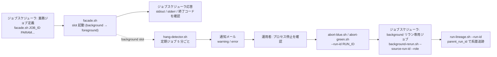
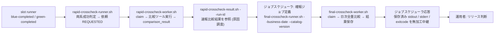
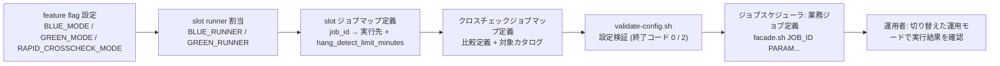
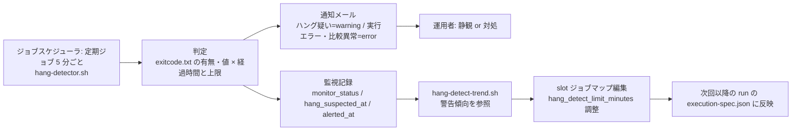
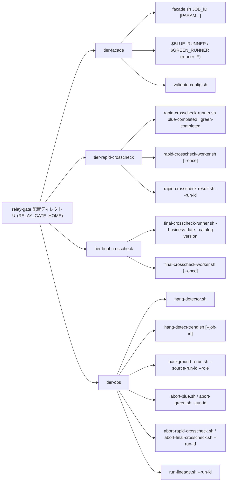

# UX デザイン仕様

> design 無しモード(`design_available: false`、`interface_kind: cli`)。
> 本システムは UI 画面を持たない(arch CTP-001)。「画面」はすべて **コマンドの出力(stdout / stderr / 終了コード)** または **通知メール** に読み替える。
> フローのノードはコマンド / ジョブ / メールであり、画面遷移は存在しない。
> 出力の具体的な規約(終了コード・フォーマット・状態文字列・メール件名)は `ui-design.md`(出力規約)を正本とする。

## ユーザーフロー

### 実装切替業務 × 実行監視業務 × 実行復旧業務: 業務ジョブ実行から background 異常の復旧まで

**アクター**: 運用者
**ゴール**: ジョブスケジューラの実行結果で foreground の成否を判定し、background 側の異常はメール通知から中止・リラン・系譜追跡で復旧する

**タッチポイント**:

| ステップ | コマンドまたはジョブ | UC | 感情 | 改善機会 |
|---------|------|---|------|---------|
| 業務ジョブの起動 | ジョブスケジューラ → `facade.sh JOB_ID [PARAM...]` | slot 実行モードを選択して runner を起動する | ニュートラル | 両 slot foreground などの設定誤りは runner を 1 つも起動せずに終了コード 2 で止める。原因を stderr に具体値つきで出す |
| 実行結果の確認 | ジョブスケジューラ応答(foreground の 3 ファイル無加工中継) | 業務ジョブの実行結果を確認する / foreground slot の結果をジョブスケジューラへ中継する | ポジティブ | 並行稼働中も単独本番中も見え方が同じ。background や速報の結果が混ざらない |
| 異常の受信 | `hang-detector.sh` → 通知メール | background 異常の通知メールを受け取る | ネガティブ | 件名だけで重要度(warning / error)・通知種別・run_id が読める。本文に成果物ディレクトリと推奨対処を含める |
| 停止の確認と中止 | `abort-blue.sh --run-id` / `abort-green.sh --run-id` | 現在状態を確認して停止確認に応答する / 実行を ABORTED へ遷移させる | ネガティブ(慎重) | 現在状態を先に表示してから停止確認プロンプトを出す。yes 以外は状態を変えない |
| リラン | 専用ジョブ → `background-rerun.sh --source-run-id --role` | リラン対象を検証する / 元の execution-spec.json から復元して新しい run_id で起動する | ニュートラル | 事前検証 NG の理由(元の mode / 元の状態)を stderr に出し、新 run_id を stdout に出す |
| 系譜の追跡 | `run-lineage.sh --run-id` | リラン結果を parent_run_id で追跡する | ポジティブ | 最新から元の実行まで TSV 1 行 1 run で数珠つなぎに読める |

### クロスチェック業務: 速報比較結果の原因調査から確報結果によるリリース判断まで

**アクター**: 運用者
**ゴール**: 速報比較結果で差分の原因を調査し、確報(日次全量比較)の結果をリリース判断の正本として用いる

**タッチポイント**:

| ステップ | コマンドまたはジョブ | UC | 感情 | 改善機会 |
|---------|------|---|------|---------|
| 完了通知 | slot runner → `rapid-crosscheck-runner.sh blue-completed / green-completed` | 速報クロスチェック runner へ完了通知を送信する | ニュートラル(自動) | 運用者の操作なし。RAPID_CROSSCHECK_MODE=off では送信しない |
| 比較依頼の作成 | `rapid-crosscheck-runner.sh` | 両系成功時に速報比較依頼を作成する | ニュートラル(自動) | 完了順にかかわらず 1 run_id に 1 件。重複作成しない |
| 比較の実行 | `rapid-crosscheck-worker.sh [--once]` | 速報比較依頼を claim する / 比較ツールでジョブ単位比較を実行して結果を登録する | ニュートラル(自動) | 比較 NG / FAILED は hang-detector の error メールで運用者に届く |
| 速報結果の参照 | `rapid-crosscheck-result.sh --run-id` | 速報比較結果を参照する | ネガティブ(差分あり)〜ポジティブ | 依頼状態・比較結果ステータス・difference_count・report_uri を 1 行 1 事実で出す。速報は原因調査用であり、リリース判断に使わないことを stderr の info で明示 |
| 確報の起動 | ジョブスケジューラ → `final-crosscheck-runner.sh --business-date --catalog-version` | 確報比較依頼を登録して終端状態まで待機する | ニュートラル | polling 上限(既定 8 時間)超過は終了コード 6 で終了し、依頼は変更しない |
| 確報結果の確認 | ジョブスケジューラ応答(保存済み 3 値の無加工中継) | 確報クロスチェック結果を確認する / 保存済みの確報結果をジョブスケジューラへ返す | ポジティブ | 比較ツールの終了コード 0 / 3 / 6 がそのままジョブスケジューラの判定に使える。依頼の状態名は返さない |

### 適用構成業務: 適用構成の定義から切り替え後の運用まで

**アクター**: 基盤適用設計者(定義)、運用者(切り替え後の運用)
**ゴール**: relay-gate のスクリプトを変更せずに、設定ファイルだけで並行稼働・単独本番・次世代並行稼働を切り替える

**タッチポイント**:

| ステップ | コマンドまたはジョブ | UC | 感情 | 改善機会 |
|---------|------|---|------|---------|
| feature flag 設定 | 設定ファイル編集 → `validate-config.sh` | feature flag を設定する | ニュートラル | foreground × foreground の組合せを検証で拒否し、どの slot も起動しない |
| runner 割当 | 設定ファイル編集 → `validate-config.sh` | slot runner の実体スクリプトを割り当てる | ニュートラル | runner 実体の存在と実行権限を検証で確認する |
| slot ジョブマップ定義 | ジョブマップ編集 → `validate-config.sh` | slot ごとのジョブマップを定義する | ニュートラル | 固定引数の JSON 配列と hang_detect_limit_minutes(0 以上の整数)を検証で確認する |
| クロスチェック定義 | クロスチェックジョブマップ編集 → `validate-config.sh` | クロスチェックのジョブマップと比較定義を定義する | ニュートラル | job_id ごとの比較定義参照が解決できることを検証で確認する |
| 切り替え後の運用 | ジョブスケジューラ → `facade.sh` | 切り替えた運用モードで業務ジョブを実行する | ポジティブ | ジョブ定義を変えずに運用モードが切り替わる。ジョブスケジューラの見え方は変わらない |

### 実行監視業務: 定期ハング検知から hang_detect_limit_minutes の調整まで

**アクター**: ジョブスケジューラ(定期起動)、運用者(通知の受信と調整)
**ゴール**: background 実行の異常を通知だけで運用者に伝え、警告傾向からジョブごとの上限を調整する

**タッチポイント**:

| ステップ | コマンドまたはジョブ | UC | 感情 | 改善機会 |
|---------|------|---|------|---------|
| 定期走査 | `hang-detector.sh` | background 実行の経過時間と終了状態を判定する | ニュートラル(自動) | 状態を変更せず通知のみ。同じ判定で同じメールを繰り返し送らない(冪等) |
| 通知 | 通知メール | ハング疑い・実行エラー・比較異常を通知する / background 異常の通知メールを受け取る | ネガティブ | warning は静観候補、error は対処必須と件名で判別できる |
| 監視記録 | 管理 DB `monitor_records`(on)/ 実行ログ(off) | 監視記録を保存する | ニュートラル(自動) | 通知後に正常終了した実行の警告時経過時間を残す |
| 上限の調整 | `hang-detect-trend.sh` → slot ジョブマップ編集 | hang_detect_limit_minutes をジョブごとに調整する | ポジティブ | job_id × role ごとの最後の警告時経過時間を TSV で出し、調整値の根拠にする |

## 情報アーキテクチャ(IA)

### コマンド体系

- コマンド名は kebab-case のスクリプト名、オプションは `--kebab-option`(_inference.md 採用値 #1)
- `hang-detect-trend.sh` は UC「hang_detect_limit_minutes をジョブごとに調整する」の警告傾向参照(RDRA 画面「hang-detect 警告傾向出力」)を担う参照系コマンド。Step3 の tier-ops.md と `cli-command-contract.yaml` で `hang-detect-trend.sh`(独立コマンド)として確定済み(`hang-detector.sh` へのオプション統合は採用しない)

### エントリポイント

| 起動元 | コマンド | ティア | 起動の性質 |
|---|---|---|---|
| ジョブスケジューラ: 業務ジョブ定義 | `facade.sh JOB_ID [PARAM...]` | tier-facade | 同期。foreground の終了を待って応答する |
| ジョブスケジューラ: 確報クロスチェックジョブ定義 | `final-crosscheck-runner.sh --business-date --catalog-version` | tier-final-crosscheck | 同期。終端状態まで polling して応答する |
| ジョブスケジューラ: ハング検知定期ジョブ(5 分ごと) | `hang-detector.sh` | tier-ops | 定期。通知のみで状態を変えない |
| ジョブスケジューラ: background リラン専用ジョブ | `background-rerun.sh --source-run-id --role` | tier-ops | 同期。事前検証後に新 run_id で起動して戻る |
| ジョブスケジューラ / 常駐: worker | `rapid-crosscheck-worker.sh [--once]` / `final-crosscheck-worker.sh [--once]` | tier-rapid-crosscheck / tier-final-crosscheck | `--once` で 1 回の poll / claim / 実行。常駐時は poll 間隔で繰り返す |
| 運用者の直接起動 | `abort-blue.sh` / `abort-green.sh` / `abort-rapid-crosscheck.sh` / `abort-final-crosscheck.sh --run-id` | tier-ops | 対話。現在状態表示 → 停止確認プロンプト |
| 運用者の直接起動 | `rapid-crosscheck-result.sh --run-id` / `run-lineage.sh --run-id` / `hang-detect-trend.sh` | tier-rapid-crosscheck / tier-ops | 参照のみ。状態を変えない |
| 基盤適用設計者の直接起動 | `validate-config.sh` | tier-facade(rapid / final の設定も検証) | 参照のみ。終了コードで妥当性を返す |
| 内部呼び出し | `$BLUE_RUNNER` / `$GREEN_RUNNER` | tier-facade | facade.sh と background-rerun.sh が起動する。運用者は直接起動しない |
| 内部呼び出し | `rapid-crosscheck-runner.sh blue-completed / green-completed` | tier-rapid-crosscheck | slot runner が完了時に起動する(RAPID_CROSSCHECK_MODE=on のみ) |

### コマンド間の受け渡しルール

- **run_id の相関**: `facade.sh` が run 開始時に run_id を発行し、以降のすべてのコマンド(runner / 完了通知 / 比較依頼 / 監視記録 / abort / rerun / lineage)は同じ run_id で相関付ける。run_id は成果物ディレクトリ名(`facade/<run_id>/`)と管理 DB の主キーに共通で使う(arch CTP-003)
- **Runner Result の 3 ファイル**: slot runner → facade / hang-detector / rapid-crosscheck-runner の受け渡しは `stdout.log` / `stderr.log` / `exitcode.txt` の 3 ファイル(+ `started-at.txt` / `execution-spec.json`)で行う。一時ファイルへ出力してから確定名へリネームし、確定名が存在するときだけ完了とみなす(arch CTR-001)
- **終了コードの引き継ぎ**: `facade.sh` は foreground の `exitcode.txt` を、`final-crosscheck-runner.sh` は依頼に保存された `exit_code` を、**そのまま**プロセス終了コードとしてジョブスケジューラへ返す。relay-gate 自身の終了コード体系(0 / 2 / 3 / 6)はこの中継経路には適用しない(arch CTR-002)
- **完了通知の受け渡し**: slot runner → `rapid-crosscheck-runner.sh` は `run_id` / `job_id` / `exit_code` / `artifact_uri` を引数で渡す。runner は自系統の通知だけを送り、相手側の状態を判断しない(条件「完了通知の系統独立」)
- **ジョブキューの受け渡し**: runner(dispatcher)→ worker は管理 DB の依頼レコード(`rapid_crosscheck_requests` / `final_crosscheck_requests`)で受け渡す。claim は `worker_id` + `lease_until` で排他する(arch CTP-004)
- **リランの受け渡し**: `background-rerun.sh` → slot runner は元の `execution-spec.json` を `--execution-spec <path>` で渡し、最新ジョブマップを再解決しない。新 run_id の `parent_run_id` に元 run_id を設定する
- **通知メールの受け渡し**: `hang-detector.sh` → 運用者は件名に重要度・通知種別・run_id・job_id・role を含め、本文に成果物ディレクトリと推奨対処を含める。運用者はメールの run_id をそのまま `abort-*` / `background-rerun.sh` / `rapid-crosscheck-result.sh` の引数に使える

## UX 心理学に基づくインタラクション設計原則

### 適用する原則

| 原則 | 適用場面 | 具体的な設計 |
|------|---------|-----------|
| **意図的な壁 (Intentional Friction)** | `abort-blue.sh` / `abort-green.sh` / `abort-rapid-crosscheck.sh` / `abort-final-crosscheck.sh` の状態更新 | 現在状態(`cli-command-contract.yaml` の `stdout` 固定行。abort-blue / abort-green は run_id / job_id / role / mode / status / pid / started_at / artifact_dir の 8 行、abort-rapid-crosscheck / abort-final-crosscheck は run_id / job_id / role / status / worker_id / lease_until / started_at の 7 行)を表示した後に「対象ジョブのプロセスは強制終了してありますか？ [yes/no]」と対話確認する。`yes` 以外は状態を変えず終了コード 3 で終了する。非対話起動は `--yes` を明示したときだけ許可する |
| **認知負荷 (Cognitive Load)** | すべてのコマンドの stdout、通知メール本文 | 1 行 1 事実(`key=value`)で出す。1 コマンドの既定出力は 5〜8 行程度に収め、詳細(stdout / stderr 本文)は成果物ディレクトリのパスやレポート URI への参照に留める |
| **視覚的階層 (Visual Hierarchy)** | 通知メールの件名、stderr のメッセージ | 件名は `[relay-gate][{warning\|error}] {通知種別} run_id=... job_id=... role=...` の固定順で、重要度 → 種別 → 識別子の順に読める。stderr は `error:` / `warn:` / `info:` の接頭辞で重要度を先頭に置く |
| **フレーミング効果 (Framing)** | 通知レベルの表現 | ハング疑いは「warning(静観可。正常終了することがある)」、実行エラー・比較異常は「error(対処要)」として本文の推奨対処に静観・対処の判断材料を書く。同じ「異常」でも運用者の行動が変わるように表現を分ける |
| **デフォルト効果 (Default Bias)** | `hang_detect_limit_minutes` の導入時既定値、worker の `--once`、lease / poll の既定値 | 導入時は全ジョブ 60 分をジョブマップの既定にし、警告傾向が出そろってからジョブごとに調整する。lease 10 分 / poll 30 秒 / polling 60 秒 / 上限 8 時間は設定で上書きできるが、未指定でも安全側で動く |
| **ピーク・エンドの法則 (Peak-End Rule)** | 異常終了時の stderr、`background-rerun.sh` の成功時 stdout | 異常終了の最後の行を `error: {原因}` + 次の行に `hint: {次にやること}` で終え、運用者が次の一手を迷わない。リラン成功時は最後の行に `run_id={新 run_id}` と `parent_run_id={元 run_id}` を出し、追跡の起点を渡す |
| **段階的開示 (Progressive Disclosure)** | `rapid-crosscheck-result.sh`(`--show-output`)/ `hang-detect-trend.sh`(`--all`)/ `run-lineage.sh`(`--verbose`) | 既定は要約(状態・結果ステータス・件数・URI)だけを出す。`rapid-crosscheck-result.sh` は比較ツールの stdout / stderr 本文を `--show-output` 指定時だけ末尾に出す。`hang-detect-trend.sh` は既定で `hang_suspected_count > 0` の行だけを出し `--all` で全行、`run-lineage.sh` は `--verbose` で各 run の成果物ディレクトリを stderr の `info:` に出す |
| **系列位置効果 (Serial Position Effect)** | 通知メール本文、TSV 出力の列順 | 本文の先頭に通知種別と run_id、末尾に推奨対処を置く。TSV は左端に識別子(run_id / job_id)、右端に判断材料(status / difference_count / 警告時経過時間)を置く |

- 選定基準: BtoB の社内運用系 CLI で、アクターは運用者と基盤適用設計者の 2 種。動機づけ系(ゲーミフィケーション・希少性・社会的証明)は適用しない
- 「ドハティの閾値」は CLI の応答 10 秒以内(NFR B.2.1.1)で代替し、進捗表示は行わない(非 TTY 起動が主のため)

## アクセシビリティ方針

- **非 TTY 前提**: すべてのコマンドはジョブスケジューラからの非 TTY 起動を主経路とする。TTY 判定・色・カーソル制御・進捗バーは使わない。対話プロンプト(abort-*)は stdin が TTY でないとき `--yes` が無ければ `error: interactive confirmation required (use --yes for non-interactive)` を stderr に出して終了コード 2 で終了する
- **色に依存しない出力**: 状態・重要度は文字列(`status=RUNNING`、`error:`、`[warning]`)だけで伝える。ANSI エスケープシーケンスは出力しない(NO_COLOR の考慮は不要)
- **スクリーンリーダー**: 1 行 1 事実、`key=value` の固定順で読み上げ順が意味順になる。表形式(TSV)はヘッダー行を必ず付け、列数を 8 列以内に収める。罫線文字・アスキーアートは使わない
- **メール本文のプレーンテキスト**: HTML メールを使わない。1 行 1 事実、1〜13 行目は 80 桁以内(14 行目の recommended_action は折り返さず 1 行)。件名だけで重要度・種別・識別子が判断できる
- **言語**: stdout / stderr / ログ / メールのキー名とメッセージは英語(arch CTR-005)。運用者向けの対話プロンプト文言のみ方針資料どおり日本語(「対象ジョブのプロセスは強制終了してありますか？ [yes/no]」)。通知メール本文の推奨対処も英語の定型文とする
- **日時**: UTC ISO 8601(`2026-08-30T11:30:00Z`)に統一し、ローカル時刻を混在させない
- **機械可読性**: すべての stdout は `grep` / `cut` / `awk` で処理できる(`key=value` または TSV)。JSON 出力は採用しない(jq 非依存)
