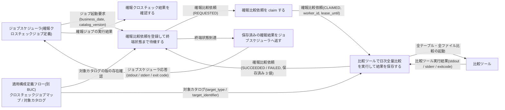
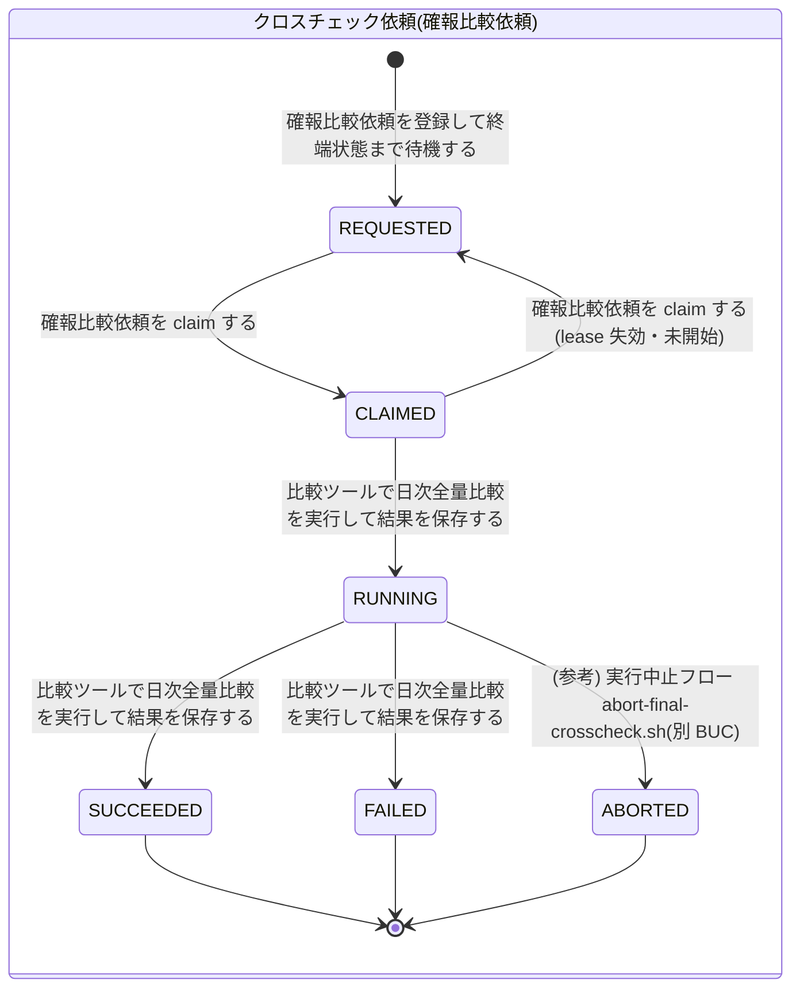

# 確報クロスチェックフロー

## 概要

ジョブスケジューラの別ジョブ定義から直接起動された確報クロスチェック runner が、business_date と対象カタログの版で確報比較依頼(final_crosscheck_request)を REQUESTED で登録し、終端状態まで同期 polling する。確報クロスチェック worker が DB セグメントで依頼を claim / lease し、対象カタログに従って比較ツールで全テーブル・全ファイルの日次全量比較を実行して stdout / stderr / exit_code を依頼に保存する。runner は保存済みの 3 値をそのままジョブスケジューラへ中継し、運用者はその実行結果をリリース判断の正本として用いる。確報の制御は feature flag に含めず、速報側のモデルとは分離する。

## 所属 UC 一覧

| UC名 | アクター | 主な操作 | 関連情報 |
|------|---------|---------|---------|
| [確報比較依頼を登録して終端状態まで待機する](確報比較依頼を登録して終端状態まで待機する/spec.md) | 運用者(受益者)/ ジョブスケジューラ(起動元)・管理 DB(外部) | `--business-date` / `--catalog-version` で確報比較依頼を REQUESTED で 1 件登録し、SUCCEEDED / FAILED / ABORTED になるまで 60 秒間隔で polling する | ジョブ起動要求、確報比較依頼(final_crosscheck_request)、対象カタログ、クロスチェックジョブマップ |
| [確報比較依頼を claim する](確報比較依頼を%20claim%20する/spec.md) | 運用者(受益者・自動)/ 管理 DB(外部) | worker が REQUESTED の依頼を worker_id / lease_until(now + 10 分)付きで CLAIMED にし、lease 失効かつ未開始の依頼を REQUESTED へ戻す | 確報比較依頼(final_crosscheck_request) |
| [比較ツールで日次全量比較を実行して結果を保存する](比較ツールで日次全量比較を実行して結果を保存する/spec.md) | 運用者(受益者・自動)/ 比較ツール・管理 DB(外部) | 依頼を RUNNING にし、対象カタログの全行を比較ツールで日次全量比較する。stdout / stderr / exit_code を依頼に保存し、0 で SUCCEEDED、非 0 で FAILED。role=final-crosscheck の成果物も残す | 確報比較依頼(final_crosscheck_request)、対象カタログ、比較ツール実行結果、実行ログ |
| [保存済みの確報結果をジョブスケジューラへ返す](保存済みの確報結果をジョブスケジューラへ返す/spec.md) | 運用者(受益者)/ ジョブスケジューラ(応答先)・管理 DB(外部) | 終端状態の依頼に保存された stdout / stderr / exit_code をそのまま標準出力・標準エラー・終了コードとして返す。状態名・差分件数・レポート URI は追加しない | 確報比較依頼(final_crosscheck_request)、比較ツール実行結果、ジョブスケジューラ応答 |
| [確報クロスチェック結果を確認する](確報クロスチェック結果を確認する/spec.md) | 運用者(リリース判断者) | 確報ジョブの実行結果(標準出力・標準エラー・終了コード)で business_date 単位の日次整合性を確認し、リリース判断の正本として用いる。読む UC で状態を変更しない | ジョブスケジューラ応答、比較ツール実行結果 |

すべての UC は tier-final-crosscheck(確報クロスチェック runner / worker)で実現する。

## UC 横断データフロー

BUC 内の UC 間で情報がどう流れるかを示す。情報がどの UC で作成(C)・参照(R)・更新(U)されるかを明記する。

### データフロー図

### 情報 CRUD マトリクス

列の UC は登録・待機 → claim → 比較実行 → 中継 → 確認の順。

| 情報名 | 確報比較依頼を登録して終端状態まで待機する | 確報比較依頼を claim する | 比較ツールで日次全量比較を実行して結果を保存する | 保存済みの確報結果をジョブスケジューラへ返す | 確報クロスチェック結果を確認する |
|--------|:---:|:---:|:---:|:---:|:---:|
| ジョブ起動要求 | R | - | - | - | - |
| クロスチェックジョブマップ | R | - | R | - | - |
| 対象カタログ | R(版の存在確認) | - | R | - | - |
| 確報比較依頼(final_crosscheck_request) | C / R(polling) | U | U | R | - |
| 比較ツール実行結果 | - | - | C | R | R(応答の元) |
| ジョブスケジューラ応答 | - | - | - | C | R |
| 実行ログ | C | C | C | C | - |

## 状態遷移全体図

BUC 内の UC が遷移 UC になっている状態モデルはクロスチェック依頼(確報比較依頼)のみ。RUNNING → ABORTED は実行復旧業務(実行中止フロー、`abort-final-crosscheck.sh`)の UC が担うため、この BUC の遷移ではないが、UC「確報比較依頼を登録して終端状態まで待機する」の polling 終端条件と UC「保存済みの確報結果をジョブスケジューラへ返す」の中継条件が ABORTED を含むため、参考として図に残す。確報にはリラン専用ジョブが無く、再実行はジョブスケジューラの正規ジョブで新しい依頼を登録する。

終端状態は SUCCEEDED / FAILED / ABORTED の 3 つ。終端状態の依頼は UC「保存済みの確報結果をジョブスケジューラへ返す」が読むだけで、状態を変更しない。

### 状態遷移 UC マッピング

| 状態モデル | 遷移元 | 遷移先 | 担当 UC |
|-----------|--------|--------|--------|
| クロスチェック依頼 | `[*]` | REQUESTED | [確報比較依頼を登録して終端状態まで待機する](確報比較依頼を登録して終端状態まで待機する/spec.md) |
| クロスチェック依頼 | REQUESTED | CLAIMED | [確報比較依頼を claim する](確報比較依頼を%20claim%20する/spec.md) |
| クロスチェック依頼 | CLAIMED | REQUESTED | [確報比較依頼を claim する](確報比較依頼を%20claim%20する/spec.md) |
| クロスチェック依頼 | CLAIMED | RUNNING | [比較ツールで日次全量比較を実行して結果を保存する](比較ツールで日次全量比較を実行して結果を保存する/spec.md) |
| クロスチェック依頼 | RUNNING | SUCCEEDED | [比較ツールで日次全量比較を実行して結果を保存する](比較ツールで日次全量比較を実行して結果を保存する/spec.md) |
| クロスチェック依頼 | RUNNING | FAILED | [比較ツールで日次全量比較を実行して結果を保存する](比較ツールで日次全量比較を実行して結果を保存する/spec.md) |

## BUC 内共有条件一覧

BUC 内の複数 UC で共有される条件の一覧。分母は BUC.tsv でこの BUC に紐づく条件。

| 条件名 | 条件の説明 | 適用 UC |
|--------|----------|--------|
| 依頼状態遷移規則 | 依頼は REQUESTED で作成され、claim で CLAIMED、比較開始で RUNNING、exitcode 0 で SUCCEEDED、非 0 または実行エラーで FAILED、停止確認後の中止で ABORTED に遷移する。速報と確報で同一 | 確報比較依頼を登録して終端状態まで待機する, 確報比較依頼を claim する, 比較ツールで日次全量比較を実行して結果を保存する |
| 確報結果の中継制約 | runner は依頼に保存された stdout・stderr・exitcode だけをジョブスケジューラへそのまま返す。チェック結果・差分件数・レポート URI・依頼の状態名は返さない | 保存済みの確報結果をジョブスケジューラへ返す, 確報クロスチェック結果を確認する |
| 比較ツール終了コードの対応 | 比較 OK=0 は SUCCEEDED、比較 NG=3 は FAILED(警告終了)、実行エラー=6 は FAILED(エラー終了)。確報では保存した exitcode をそのまま中継する | 比較ツールで日次全量比較を実行して結果を保存する, 保存済みの確報結果をジョブスケジューラへ返す |

## BUC 内共有バリエーション一覧

BUC 内の複数 UC で共有されるバリエーションの一覧(UC spec のバリエーション一覧を集約)。

| バリエーション名 | 値 | 適用 UC |
|----------------|---|--------|
| クロスチェック依頼状態 | REQUESTED、CLAIMED、RUNNING、SUCCEEDED、FAILED、ABORTED | 確報比較依頼を登録して終端状態まで待機する, 確報比較依頼を claim する, 比較ツールで日次全量比較を実行して結果を保存する, 保存済みの確報結果をジョブスケジューラへ返す |
| 比較ツール終了コード | 0(比較 OK)、3(比較 NG・警告終了)、6(実行エラー・エラー終了) | 比較ツールで日次全量比較を実行して結果を保存する, 保存済みの確報結果をジョブスケジューラへ返す, 確報クロスチェック結果を確認する |
| クロスチェック種別 | 確報クロスチェック | 確報比較依頼を登録して終端状態まで待機する, 確報比較依頼を claim する, 確報クロスチェック結果を確認する |
| ジョブスケジューラ起動ジョブ種別 | 確報クロスチェックジョブ | 確報比較依頼を登録して終端状態まで待機する, 保存済みの確報結果をジョブスケジューラへ返す, 確報クロスチェック結果を確認する |
| 比較種別 | 全テーブル・全ファイル比較 | 確報比較依頼を登録して終端状態まで待機する, 比較ツールで日次全量比較を実行して結果を保存する |
