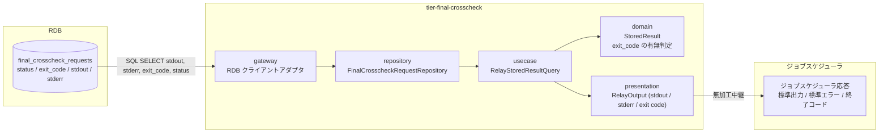
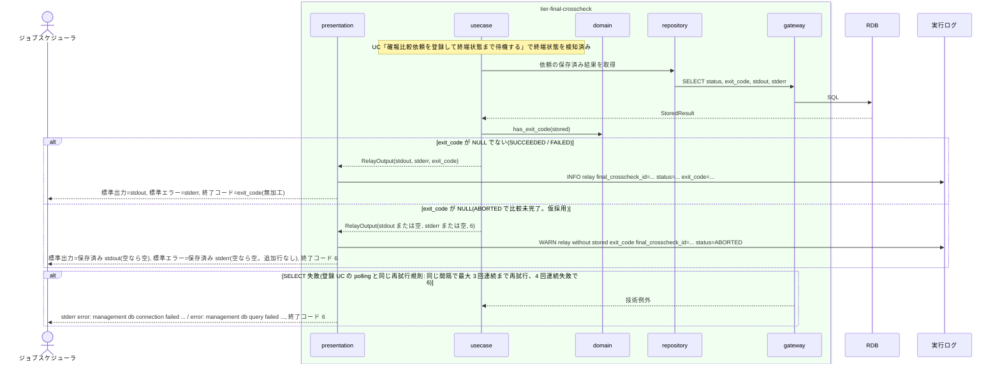

# 保存済みの確報結果をジョブスケジューラへ返す

## 概要

`final-crosscheck-runner.sh` の presentation 層が、終端状態(SUCCEEDED / FAILED / ABORTED)に到達した確報比較依頼に保存された `stdout` / `stderr` / `exit_code` を、そのまま標準出力・標準エラー・プロセス終了コードとしてジョブスケジューラへ返す。依頼の状態名・差分件数・レポート URI などの連携データは一切追加しない。ABORTED で `exit_code` が NULL の場合だけ、保存済み値が無いため終了コード 6 を返す。このときも stdout / stderr は保存済みのもの(空なら空)だけを出し、stderr に追加行は書かない(理由は実行ログに残す。仮採用)。

## データフロー



| レイヤー | データモデル | 変換内容 |
|---------|------------|---------|
| repository / gateway | `SELECT status, exit_code, stdout, stderr FROM final_crosscheck_requests WHERE final_crosscheck_id = ?` | 終端状態の依頼レコード 1 件を読む |
| usecase | RelayStoredResultQuery(final_crosscheck_id) | 依頼レコードを StoredResult に渡す |
| domain | StoredResult(stdout, stderr, exit_code, status) | `exit_code` が NULL(ABORTED で比較未完了)かどうかを判定する。変換・加工はしない |
| presentation | RelayOutput | stdout → 標準出力へバイト列のまま、stderr → 標準エラーへバイト列のまま、exit_code → `exit N`。NULL は空として扱う |
| ジョブスケジューラ応答 | 標準出力 / 標準エラー / 終了コード | ジョブスケジューラが終了コードで判定する(UC「確報クロスチェック結果を確認する」) |

## 処理フロー



## バリエーション一覧

| バリエーション名 | 値 | 処理内容 | 適用 tier | 適用箇所 |
|----------------|---|---------|----------|---------|
| 比較ツール終了コード | 0(比較 OK) | 保存済み exit_code=0 をそのまま終了コード 0 で返す | tier-final-crosscheck | `relay_stored_result` |
| 比較ツール終了コード | 3(比較 NG・警告終了) | 保存済み exit_code=3 をそのまま終了コード 3 で返す | tier-final-crosscheck | `relay_stored_result` |
| 比較ツール終了コード | 6(実行エラー・エラー終了) | 保存済み exit_code=6 をそのまま終了コード 6 で返す | tier-final-crosscheck | `relay_stored_result` |
| クロスチェック依頼状態 | SUCCEEDED / FAILED | 保存済み 3 値をそのまま返す。状態名は出さない | tier-final-crosscheck | `relay_stored_result` |
| クロスチェック依頼状態 | ABORTED | exit_code / stdout / stderr は保存されない(abort は状態のみ更新、worker の終端 UPDATE は RUNNING 限定)ため常に NULL。終了コード 6、stdout / stderr は 0 バイト(追加行なし) | tier-final-crosscheck | `relay_stored_result` |
| ジョブスケジューラ起動ジョブ種別 | 確報クロスチェックジョブ | 応答の受け手はこのジョブ定義 | tier-final-crosscheck | `final-crosscheck-runner.sh` |

## 分岐条件一覧

| 条件名 | 判定ルール | 適用 tier | 適用箇所 | BDD Scenario |
|--------|----------|----------|---------|-------------|
| 確報結果の中継制約 | 出力するのは依頼の `stdout` / `stderr` / `exit_code` のみ。状態名(SUCCEEDED / FAILED / ABORTED)、difference_count、report_uri、final_crosscheck_id、プレフィックス・装飾を一切付けない。relay-gate 自身の info / warn は実行ログにのみ出す | tier-final-crosscheck | `relay_stored_result`(presentation) | exit_code=3 の FAILED をそのまま返す |
| 比較ツール終了コードの対応 | 保存済み exit_code の値を変換しない(0 / 3 / 6 / その他の非 0 すべて) | tier-final-crosscheck | `relay_stored_result` | exit_code=3 の FAILED をそのまま返す |
| CLI とメールによる提示 | 結果は標準出力・標準エラー・終了コードでのみ返す。メール・ファイル・状態名の追加提示をしない | tier-final-crosscheck | `final-crosscheck-runner.sh` | exit_code=0 の SUCCEEDED をそのまま返す |

## 計算ルール一覧

| 計算名 | 入力情報 | 計算式/ロジック | 出力情報 | 適用 tier |
|--------|---------|---------------|---------|----------|
| 終了コードの決定 | 確報比較依頼.exit_code | exit_code が NULL でなければその値。NULL(ABORTED で比較未完了)なら 6(仮採用: 保存済み値が無いため 4 分類の実行エラーに寄せる。stderr には何も追記せず、理由は実行ログに `WARN relay without stored exit_code` として残す) | プロセス終了コード | tier-final-crosscheck |
| stdout / stderr の決定 | 確報比較依頼.stdout / stderr | NULL → 空(0 バイト)。それ以外はバイト列のまま。末尾改行の追加・削除をしない | 標準出力 / 標準エラー | tier-final-crosscheck |

## 状態遷移一覧

| 状態モデル | 遷移元 | 遷移先 | トリガー | 事前条件 | 事後処理 | 適用 tier |
|-----------|--------|--------|---------|---------|---------|----------|
| クロスチェック依頼 | — | — | 該当なし(この UC は依頼の状態を変更しない。終端状態を読むだけ) | — | — | tier-final-crosscheck |

## 関連 RDRA モデル

| モデル種別 | 要素名 | 関連 |
|-----------|--------|------|
| 業務 | クロスチェック業務 | この UC が属する業務 |
| BUC | 確報クロスチェックフロー | この UC を含む BUC |
| アクター | 運用者 | 受益者(ジョブスケジューラの実行結果を読む) |
| 情報 | 確報比較依頼(final_crosscheck_request) | 保存済み stdout / stderr / exit_code の読み出し元 |
| 情報 | 比較ツール実行結果 | 依頼に保存された 3 値 |
| 情報 | ジョブスケジューラ応答 | 中継結果 |
| 状態 | クロスチェック依頼 | 終端状態(SUCCEEDED / FAILED / ABORTED)を読む |
| 条件 | 確報結果の中継制約 | 3 値以外を返さない |
| 条件 | 比較ツール終了コードの対応 | 終了コードを変換しない |
| 条件 | CLI とメールによる提示 | CLI の 3 チャネルで返す |
| 画面 | final-crosscheck runner 応答出力(→ CLI 出力) | 無加工の stdout / stderr / 終了コード |
| イベント | 確報結果の無加工中継 | ジョブスケジューラへの応答 |
| イベント | 保存済み確報結果の読み出し | 管理 DB からの SELECT |
| 外部システム | ジョブスケジューラ | 応答の受け手 |
| 外部システム | 管理 DB(RDB) | 読み出し元 |

## 関連 USDM

| REQ ID | SPEC ID | 対応 BDD Scenario |
|--------|---------|------------------|
| REQ-006 | SPEC-006-03 | exit_code=3 の FAILED をそのまま返す(SPEC-006-03) / ABORTED で exit_code が NULL のとき終了コード 6 を返す(状態名を追加しない) |
| REQ-007 | SPEC-007-03 | exit_code=3 の FAILED をそのまま返す(SPEC-006-03) |

## E2E 完了条件(BDD)

### 正常系

runner は起動のたびに新しい final_crosscheck_id で依頼を登録し、その id だけを polling するため、事前に INSERT した固定 id の行を中継する経路は無い。以下のシナリオは「runner が登録した最新の依頼(final_crosscheck_requests で requested_at が最大の行)を別プロセスが 3 秒後に終端更新する」形で書く(UC「確報比較依頼を登録して終端状態まで待機する」のティア Scenario 1 と同じ書き方)。<id> は runner が発行した final_crosscheck_id(形式 `^[0-9]{8}T[0-9]{6}Z-final-[0-9a-f]{8}$`)。

```gherkin
Feature: 保存済みの確報結果をジョブスケジューラへ返す

  Scenario: exit_code=0 の SUCCEEDED をそのまま返す
    Given final-crosscheck.env に FINAL_POLL_INTERVAL_SEC=1 がある
    And 別プロセスが 3 秒後に、runner が登録した最新の依頼を status=SUCCEEDED exit_code=0 stdout="all 42 targets matched\n" stderr="" completed_at=now に更新する
    When final-crosscheck-runner.sh --business-date 2026-08-30 --catalog-version v3 を実行する
    Then 標準出力は "all 42 targets matched\n" と完全一致する
    And 標準エラーは 0 バイトである
    And 終了コードは 0 である

  Scenario: exit_code=3 の FAILED をそのまま返す(SPEC-006-03)
    Given final-crosscheck.env に FINAL_POLL_INTERVAL_SEC=1 がある
    And 別プロセスが 3 秒後に、runner が登録した最新の依頼を status=FAILED exit_code=3 stdout="diff found: 12 rows\n" stderr="warn: table T_ORDER differs\n" に更新する
    When final-crosscheck-runner.sh --business-date 2026-08-30 --catalog-version v3 を実行する
    Then 標準出力は "diff found: 12 rows\n" と完全一致し、"FAILED" "difference_count" "report_uri" "final_crosscheck_id" の文字列を含まない
    And 標準エラーは "warn: table T_ORDER differs\n" と完全一致する
    And 終了コードは 3 である
```

ABORTED の依頼は `abort-final-crosscheck.sh` が状態だけを更新し、worker の終端 UPDATE は `WHERE status='RUNNING'` のため、exit_code / stdout / stderr は保存されない(常に NULL)。ABORTED の中継は異常系「ABORTED で exit_code が NULL のとき終了コード 6 を返す」で検証する。

### 異常系

```gherkin
  Scenario: ABORTED で exit_code が NULL のとき終了コード 6 を返す
    Given final-crosscheck.env に FINAL_POLL_INTERVAL_SEC=1 がある
    And 別プロセスが 3 秒後に、runner が登録した最新の依頼を status=ABORTED(exit_code / stdout / stderr は NULL のまま)に更新する
    When final-crosscheck-runner.sh --business-date 2026-08-30 --catalog-version v3 を実行する
    Then 標準出力は 0 バイトである
    And 標準エラーは 0 バイトである
    And 終了コードは 6 で、実行ログに "WARN relay without stored exit_code final_crosscheck_id=<id> status=ABORTED" が残る(<id> は実行ログの "request registered" 行の final_crosscheck_id と一致する)
    And 標準出力・標準エラーに "ABORTED" "final_crosscheck_id" の文字列は出ない(SPEC-006-03: 状態名を追加しない)
```

中継直前の SELECT 失敗(終端状態検知の直後に管理 DB が停止する競合窓)は E2E では再現できないため、E2E シナリオは置かない。挙動(登録 UC の polling と同じ再試行規則で 4 回連続失敗なら `error: management db query failed final_crosscheck_id=...` 終了コード 6)は tier md のエラーハンドリングに定義し、gateway をスタブにした単体テストで検証する。

## ティア別仕様

- [確報クロスチェックティア](tier-final-crosscheck.md)

### 統合 API Spec

- [CLI コマンド契約](../../../_cross-cutting/api/cli-command-contract.yaml)(`final-crosscheck-runner.sh` の出力契約)
- [AsyncAPI Spec](../../../_cross-cutting/api/asyncapi.yaml)(本 UC は publish / subscribe しない。参照のみ)
