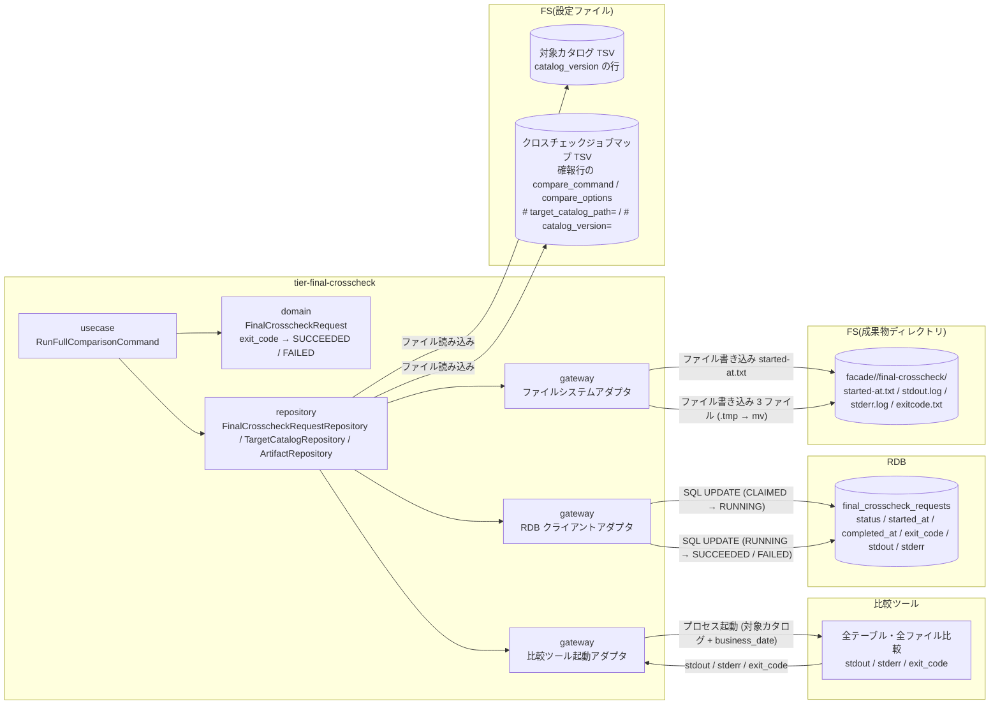
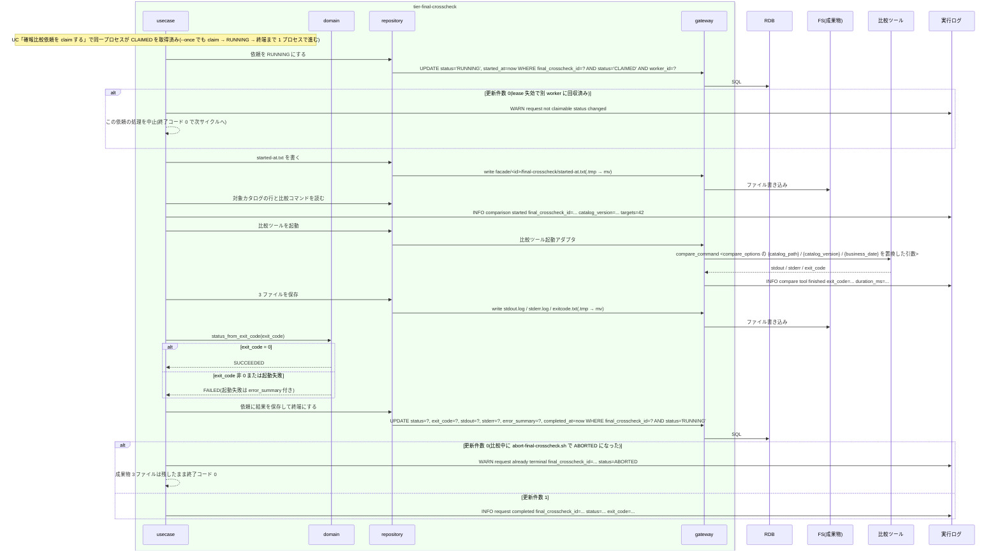

# 比較ツールで日次全量比較を実行して結果を保存する

## 概要

claim 済みの確報比較依頼を `final-crosscheck-worker.sh` が RUNNING にし、対象カタログ(catalog_version)に定義された全テーブル・全ファイルを比較ツールで日次全量比較する。比較ツールの stdout / stderr / exit_code を依頼レコードへ保存し、exit_code 0 なら SUCCEEDED、非 0 または実行エラーなら FAILED にする。同じ 3 値と started-at.txt を role=final-crosscheck の成果物ディレクトリにも Runner Result Contract で残す。

## データフロー



| レイヤー | データモデル | 変換内容 |
|---------|------------|---------|
| usecase | RunFullComparisonCommand(final_crosscheck_id, business_date, catalog_version, worker_id) | RUNNING 遷移 → started-at.txt → 比較ツール起動 → 3 ファイル保存 → 依頼保存 → 終端遷移 |
| domain | FinalCrosscheckRequest | `status_from_exit_code(exit_code)` = 0 → SUCCEEDED、非 0 → FAILED。起動失敗(exit_code 取得不能)→ FAILED + error_summary |
| repository | TargetCatalogRepository | 対象カタログ TSV から catalog_version の行を全件読む。クロスチェックジョブマップの確報行(`job_id=final-crosscheck`、`comparison_type=full`)から比較ツール起動コマンドを、ヘッダーコメント `# target_catalog_path=` から対象カタログの所在を読む(step3 canonical C5) |
| gateway | 比較ツール起動アダプタ | 対象カタログの行(target_type / target_identifier / compare_condition / business_date_handling)と business_date を比較ツールの入力(TSV ファイルのパスと引数)に変換して起動。stdout / stderr をファイルへ、exit_code を取得 |
| gateway | ファイルシステムアダプタ | `.tmp` に書いて `mv` で確定名へ |
| gateway | RDB クライアントアダプタ | 条件付き UPDATE(RUNNING、終端) |

## 処理フロー



## バリエーション一覧

| バリエーション名 | 値 | 処理内容 | 適用 tier | 適用箇所 |
|----------------|---|---------|----------|---------|
| 比較ツール終了コード | 0(比較 OK) | 依頼を SUCCEEDED にする | tier-final-crosscheck | `status_from_exit_code` |
| 比較ツール終了コード | 3(比較 NG・警告終了) | 依頼を FAILED にする(exit_code=3 を保存) | tier-final-crosscheck | `status_from_exit_code` |
| 比較ツール終了コード | 6(実行エラー・エラー終了) | 依頼を FAILED にする(exit_code=6 を保存) | tier-final-crosscheck | `status_from_exit_code` |
| 比較種別 | 全テーブル・全ファイル比較 | 対象カタログの全行を 1 回の比較ツール起動で渡す | tier-final-crosscheck | `run_full_comparison` |
| 対象カタログの対象種別 | テーブル | target_identifier をテーブル名として比較ツールへ渡す | tier-final-crosscheck | 比較ツール起動アダプタ |
| 対象カタログの対象種別 | ファイル | target_identifier をファイルパスパターンとして比較ツールへ渡す | tier-final-crosscheck | 比較ツール起動アダプタ |
| クロスチェック依頼状態 | RUNNING | 比較開始時 | tier-final-crosscheck | `mark_running` |
| クロスチェック依頼状態 | SUCCEEDED / FAILED | 比較終了時 | tier-final-crosscheck | `complete_request` |
| Runner Result 成果物種別 | started-at.txt / stdout.log / stderr.log / exitcode.txt | role=final-crosscheck の成果物ディレクトリに残す | tier-final-crosscheck | ファイルシステムアダプタ |
| run role(成果物ディレクトリ区分) | final-crosscheck | 成果物ディレクトリ名 | tier-final-crosscheck | `facade/<final_crosscheck_id>/final-crosscheck/` |

## 分岐条件一覧

| 条件名 | 判定ルール | 適用 tier | 適用箇所 | BDD Scenario |
|--------|----------|----------|---------|-------------|
| 依頼状態遷移規則 | CLAIMED → RUNNING(比較開始)、RUNNING → SUCCEEDED(exit_code 0)/ FAILED(非 0 または実行エラー)。条件付き UPDATE で現在状態を WHERE に含める。RUNNING 遷移の更新件数 0(lease 失効で別 worker に回収済み)は比較ツールを起動しない。終端遷移の更新件数 0(比較中に ABORTED)は成果物を残して終了コード 0 | tier-final-crosscheck | `mark_running` / `complete_request` | exit_code=0 で SUCCEEDED になる / lease 失効で別 worker に回収された依頼は RUNNING にしない / 比較中に ABORTED された依頼の終端 UPDATE は 0 件になる |
| 比較ツール終了コードの対応 | 0 → SUCCEEDED、3 → FAILED、6 → FAILED、その他の非 0 → FAILED。値は変換せず exit_code 列に保存 | tier-final-crosscheck | `status_from_exit_code` | exit_code=3 で FAILED になる |
| 適用側で定義する事項 | 比較対象は対象カタログ(catalog_version の行)、比較ツールの起動コマンド・オプションはクロスチェックジョブマップで適用側が定義する。worker はそれを読んで起動するだけ | tier-final-crosscheck | `TargetCatalogRepository` / 比較ツール起動アダプタ | 対象カタログの全行を比較ツールへ渡す |
| 成果物公開判定 | 3 ファイルと started-at.txt は `.tmp` に書いてから `mv` で確定名にする | tier-final-crosscheck | ファイルシステムアダプタ | 起動失敗でも 3 ファイルと FAILED を残す |

## 計算ルール一覧

| 計算名 | 入力情報 | 計算式/ロジック | 出力情報 | 適用 tier |
|--------|---------|---------------|---------|----------|
| exit_code → 依頼状態 | 比較ツール実行結果.exitcode | 0 → SUCCEEDED、それ以外 → FAILED。exit_code が取得できない(起動失敗)→ FAILED、exit_code=6、error_summary に原因 | 確報比較依頼.status | tier-final-crosscheck |
| 成果物ディレクトリ | RELAY_GATE_ARTIFACT_ROOT、final_crosscheck_id | `$RELAY_GATE_ARTIFACT_ROOT/facade/<final_crosscheck_id>/final-crosscheck/`(仮採用: run_id の位置に final_crosscheck_id を置き、Runner Result Contract のレイアウトを変えない) | 成果物パス | tier-final-crosscheck |
| 比較ツール引数 | 対象カタログの行、business_date、catalog_version、compare_command、compare_options | `compare_command` + `compare_options` のプレースホルダ置換結果。`{catalog_path}` → catalog_version の行だけを抜き出した一時 TSV(`final-crosscheck/input/target-catalog.tsv`)の絶対パス、`{catalog_version}` → 依頼の catalog_version、`{business_date}` → 依頼の business_date。固定オプションは追記しない(cli-command-contract.yaml external_interfaces「比較ツール(確報)」。引数名は適用側が compare_options で定義する) | 起動コマンド | tier-final-crosscheck |

## 状態遷移一覧

| 状態モデル | 遷移元 | 遷移先 | トリガー | 事前条件 | 事後処理 | 適用 tier |
|-----------|--------|--------|---------|---------|---------|----------|
| クロスチェック依頼 | CLAIMED | RUNNING | worker の比較開始 | status=CLAIMED かつ worker_id が自分 | started_at 設定、started-at.txt 出力、比較ツール起動 | tier-final-crosscheck |
| クロスチェック依頼 | RUNNING | SUCCEEDED | 比較ツールが exit_code 0 で終了 | status=RUNNING | stdout / stderr / exit_code / completed_at を保存。3 ファイル公開 | tier-final-crosscheck |
| クロスチェック依頼 | RUNNING | FAILED | 比較ツールが非 0 で終了、または起動失敗 | status=RUNNING | stdout / stderr / exit_code / error_summary / completed_at を保存。3 ファイル公開 | tier-final-crosscheck |
| クロスチェック依頼 | ABORTED | ABORTED(変更なし) | 比較中に abort-final-crosscheck.sh で中止された後の終端 UPDATE | status=ABORTED(WHERE status='RUNNING' に該当せず更新件数 0) | 3 ファイルは残し、実行ログに `WARN request already terminal`。依頼は変更しない | tier-final-crosscheck |

## 関連 RDRA モデル

| モデル種別 | 要素名 | 関連 |
|-----------|--------|------|
| 業務 | クロスチェック業務 | この UC が属する業務 |
| BUC | 確報クロスチェックフロー | この UC を含む BUC |
| アクター | 運用者 | 受益者 |
| 情報 | 確報比較依頼(final_crosscheck_request) | RUNNING → 終端、結果の保存先 |
| 情報 | 対象カタログ | 比較対象の全行 |
| 情報 | 比較ツール実行結果 | stdout / stderr / exitcode / 開始・終了日時 |
| 情報 | 実行ログ | worker の実行ログ |
| 状態 | クロスチェック依頼 | CLAIMED → RUNNING → SUCCEEDED / FAILED |
| 条件 | 依頼状態遷移規則 | 遷移規則 |
| 条件 | 比較ツール終了コードの対応 | 0 / 3 / 6 の対応 |
| 条件 | 適用側で定義する事項 | 対象カタログと比較コマンドの所有 |
| 画面 | final-crosscheck worker 比較実行出力(→ CLI 出力) | 実行ログの `comparison started` / `request completed` |
| イベント | 日次全量比較の起動 | 比較ツールのプロセス起動 |
| イベント | 確報結果の依頼レコード保存 | 管理 DB への UPDATE |
| 外部システム | 比較ツール | 全量比較の実行 |
| 外部システム | 管理 DB(RDB) | 依頼レコード |

## 関連 USDM

| REQ ID | SPEC ID | 対応 BDD Scenario |
|--------|---------|------------------|
| REQ-006 | SPEC-006-02 | exit_code=0 で SUCCEEDED になる(SPEC-006-02) / exit_code=3 で FAILED になる(SPEC-006-02) |
| REQ-007 | SPEC-007-01 | exit_code=0 で SUCCEEDED になる(SPEC-006-02) |
| REQ-007 | SPEC-007-03 | exit_code=3 で FAILED になる(SPEC-006-02) |
| REQ-003 | SPEC-003-03 | 起動失敗でも 3 ファイルと FAILED を残す(SPEC-003-03) |
| REQ-011 | SPEC-011-03 | 対象一覧を成果物に記録する(SPEC-011-03)(business_date / catalog_version は依頼レコード、対象一覧は `input/target-catalog.tsv`) |

## E2E 完了条件(BDD)

### 正常系

```gherkin
Feature: 比較ツールで日次全量比較を実行して結果を保存する

  Scenario: exit_code=0 で SUCCEEDED になる(SPEC-006-02)
    Given final_crosscheck_requests に final_crosscheck_id=20260830T210000Z-final-7b2c9e1f status=REQUESTED requested_at=2026-08-30T21:00:00Z business_date=2026-08-30 catalog_version=v3 の行がある(worker は自分がそのサイクルで claim した依頼だけを比較実行に進めるため、Given は REQUESTED に置き、claim → RUNNING → 終端までを 1 プロセスで検証する)
    And 対象カタログ TSV に catalog_version=v3 の行が 42 行(table 40 行、file 2 行)ある
    And クロスチェックジョブマップの確報行の compare_command が終了コード 0、stdout "all 42 targets matched\n" を返す比較ツールを指す
    When final-crosscheck-worker.sh --once --worker-id final-worker-01 を実行する
    Then 該当行は status=SUCCEEDED worker_id=final-worker-01 exit_code=0 stdout="all 42 targets matched\n" stderr="" になり started_at と completed_at が設定される
    And RELAY_GATE_ARTIFACT_ROOT/facade/20260830T210000Z-final-7b2c9e1f/final-crosscheck/ に started-at.txt、stdout.log、stderr.log、exitcode.txt(中身 "0")が揃う
    And worker は終了コード 0 で終了する

  Scenario: exit_code=3 で FAILED になる(SPEC-006-02)
    Given 同じ依頼が status=REQUESTED である
    And 比較ツールが終了コード 3、stdout "diff found: 12 rows\n"、stderr "warn: table T_ORDER differs\n" を返す
    When final-crosscheck-worker.sh --once --worker-id final-worker-01 を実行する
    Then 該当行は status=FAILED exit_code=3 stdout="diff found: 12 rows\n" stderr="warn: table T_ORDER differs\n" になる
    And exitcode.txt の中身は "3" で、worker は終了コード 0 で終了する

  Scenario: 対象カタログの全行を比較ツールへ渡す
    Given 同じ依頼が status=REQUESTED で catalog_version=v3 である
    And 対象カタログ TSV に catalog_version=v3 の行が 42 行、catalog_version=v2 の行が 40 行ある
    When final-crosscheck-worker.sh --once --worker-id final-worker-01 を実行する
    Then 比較ツールに渡される一時 TSV は v3 の 42 行だけを含む
    And 実行ログに "INFO comparison started final_crosscheck_id=20260830T210000Z-final-7b2c9e1f catalog_version=v3 targets=42" が残る

  Scenario: 対象一覧を成果物に記録する(SPEC-011-03)
    Given 同じ依頼が status=REQUESTED で business_date=2026-08-30 catalog_version=v3 である
    And 対象カタログ TSV に catalog_version=v3 の行が 42 行(target_type=table 40 行、target_type=file 2 行)ある
    And クロスチェックジョブマップの確報行の compare_options が "--catalog {catalog_path} --version {catalog_version} --date {business_date}" である
    When final-crosscheck-worker.sh --once --worker-id final-worker-01 を実行する
    Then facade/20260830T210000Z-final-7b2c9e1f/final-crosscheck/input/target-catalog.tsv が確定名で存在し、ヘッダー行と catalog_version=v3 の 42 行(target_type / target_identifier を含む)だけを含む
    And 比較ツールは引数 "--catalog <input/target-catalog.tsv の絶対パス> --version v3 --date 2026-08-30" で起動される
    And 依頼レコードの business_date=2026-08-30 catalog_version=v3 と成果物の対象一覧で、比較した対象を後から確認できる
```

### 異常系

```gherkin
  Scenario: 起動失敗でも 3 ファイルと FAILED を残す(SPEC-003-03)
    Given 同じ依頼が status=REQUESTED である
    And クロスチェックジョブマップの確報行の compare_command が存在しないパス /opt/compare/missing.sh を指す
    When final-crosscheck-worker.sh --once --worker-id final-worker-01 を実行する
    Then 該当行は status=FAILED exit_code=6 error_summary="launch failed" になる
    And stderr.log に "error: compare tool launch failed final_crosscheck_id=20260830T210000Z-final-7b2c9e1f command=/opt/compare/missing.sh" が含まれ、exitcode.txt の中身は "6" である
    And worker は終了コード 6 で終了する

  Scenario: lease 失効で別 worker に回収された依頼は RUNNING にしない
    Given final-worker-01 が該当依頼を claim した後、RUNNING 遷移前に lease が失効し、final-worker-02 の poll で該当行が status=CLAIMED worker_id=final-worker-02 に回収されている(usecase 単位で検証する: claim と RUNNING 遷移の間に回収 UPDATE を発行した DB 状態を用意する。abort-final-crosscheck.sh は RUNNING のみ中止できるため、CLAIMED の依頼が ABORTED になる経路は無い)
    When final-worker-01 が RUNNING への条件付き UPDATE(WHERE status='CLAIMED' AND worker_id='final-worker-01')を発行する
    Then 更新件数 0 のため比較ツールを起動せず、実行ログに "WARN request not claimable status changed final_crosscheck_id=20260830T210000Z-final-7b2c9e1f" を残す
    And 該当行は status=CLAIMED worker_id=final-worker-02 のままで、final-worker-01 は終了コード 0 で終了する

  Scenario: 比較中に ABORTED された依頼の終端 UPDATE は 0 件になる
    Given 同じ依頼が status=REQUESTED である
    And compare_command が起動後に停止シグナルを受けるまで待機するスタブを指す
    And final-crosscheck-worker.sh --once --worker-id final-worker-01 を起動し、該当行が status=RUNNING になった後に abort-final-crosscheck.sh --run-id 20260830T210000Z-final-7b2c9e1f --yes で status=ABORTED にする
    When スタブに停止シグナルを送り比較ツールが終了する
    Then 終端の条件付き UPDATE(WHERE status='RUNNING')は 0 件で、該当行は status=ABORTED exit_code=NULL のままである
    And facade/20260830T210000Z-final-7b2c9e1f/final-crosscheck/ に stdout.log、stderr.log、exitcode.txt が確定名で残る
    And 実行ログに "WARN request already terminal final_crosscheck_id=20260830T210000Z-final-7b2c9e1f status=ABORTED" が残り、worker は終了コード 0 で終了する
```

## ティア別仕様

- [確報クロスチェックティア](tier-final-crosscheck.md)

### 統合 API Spec

- [CLI コマンド契約](../../../_cross-cutting/api/cli-command-contract.yaml)(`final-crosscheck-worker.sh`)
- [AsyncAPI Spec](../../../_cross-cutting/api/asyncapi.yaml)(`channels.final-crosscheck-requests` subscribe)
