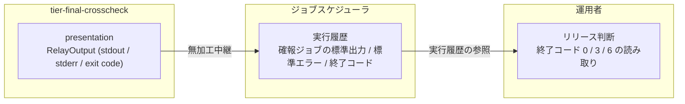
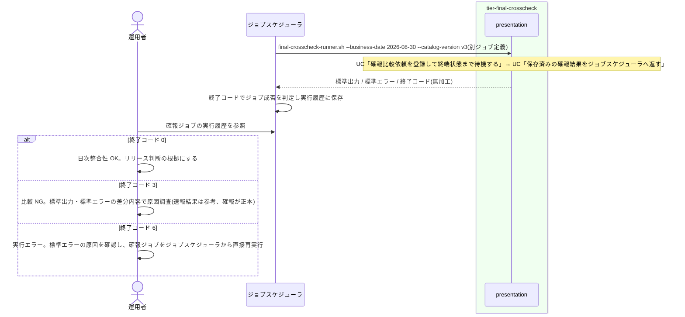

# 確報クロスチェック結果を確認する

## 概要

運用者が、ジョブスケジューラに登録した確報クロスチェックジョブ(`final-crosscheck-runner.sh`)の実行結果(標準出力・標準エラー・終了コード)で、business_date 単位の全テーブル・全ファイルの日次整合性を確認し、リリース判断の正本として用いる。終了コード以外の連携データは無いため、ジョブスケジューラの標準的な仕組み(終了コードによる成否判定と実行履歴)だけで判定する。この UC は運用者が「読む」UC であり、relay-gate 側の処理は UC「保存済みの確報結果をジョブスケジューラへ返す」の応答契約そのものである。

## データフロー



| レイヤー | データモデル | 変換内容 |
|---------|------------|---------|
| presentation(tier-final-crosscheck) | RelayOutput(依頼に保存された stdout / stderr / exit_code) | 加工なし。UC「保存済みの確報結果をジョブスケジューラへ返す」 |
| ジョブスケジューラ | ジョブスケジューラ応答(実行履歴) | 終了コードでジョブの成否を判定し、標準出力・標準エラーを実行履歴に保存する |
| 運用者 | リリース判断 | 終了コード 0 → 日次整合性 OK、3 → 比較 NG(警告終了。差分の原因調査へ)、6 → 実行エラー(比較未完了。確報ジョブを再実行) |

## 処理フロー



## バリエーション一覧

| バリエーション名 | 値 | 処理内容 | 適用 tier | 適用箇所 |
|----------------|---|---------|----------|---------|
| クロスチェック種別 | 確報クロスチェック | リリース判断の正本。ジョブスケジューラの別ジョブ定義から起動する | tier-final-crosscheck | `final-crosscheck-runner.sh` |
| クロスチェック種別 | 速報クロスチェック | 原因調査用。リリース判断に用いない(UC「速報比較結果を参照する」) | tier-final-crosscheck | (対象外。読み替えの注意) |
| 比較ツール終了コード | 0(比較 OK) | ジョブ成功。日次整合性 OK | tier-final-crosscheck | ジョブスケジューラ応答 |
| 比較ツール終了コード | 3(比較 NG・警告終了) | ジョブ警告終了。差分の原因調査へ | tier-final-crosscheck | ジョブスケジューラ応答 |
| 比較ツール終了コード | 6(実行エラー・エラー終了) | ジョブエラー終了。確報ジョブを直接再実行 | tier-final-crosscheck | ジョブスケジューラ応答 |
| 再実行経路 | ジョブスケジューラ正規ジョブ再実行 | 確報は background-rerun を使わず、ジョブスケジューラから直接再実行する | tier-final-crosscheck | 運用手順 |
| ジョブスケジューラ起動ジョブ種別 | 確報クロスチェックジョブ | 実行履歴の参照先 | tier-final-crosscheck | ジョブスケジューラ |

## 分岐条件一覧

| 条件名 | 判定ルール | 適用 tier | 適用箇所 | BDD Scenario |
|--------|----------|----------|---------|-------------|
| 確報結果の中継制約 | 運用者が読めるのは標準出力・標準エラー・終了コードだけ。依頼の状態名・差分件数・レポート URI は応答に含まれない(必要なら管理 DB の `final_crosscheck_requests` を SQL で参照する) | tier-final-crosscheck | `relay_stored_result`(UC「保存済みの確報結果をジョブスケジューラへ返す」) | 終了コード 3 で比較 NG と判断する |
| 速報結果の位置付け | 速報の比較結果(`rapid-crosscheck-result.sh`)は原因調査用。リリース判断は確報ジョブの終了コードで行う | tier-final-crosscheck | 運用手順(読み替え) | 終了コード 0 で日次整合性 OK と判断する |
| 実行履歴はジョブスケジューラの責務 | 確報ジョブの実行履歴・監査はジョブスケジューラが保持する。relay-gate は `final-crosscheck-runner.sh.log` と `final_crosscheck_requests` を残すだけ | tier-final-crosscheck | ジョブスケジューラ / `final-crosscheck-runner.sh.log` | 終了コード 6 で実行エラーと判断し再実行する(SPEC-009-04) |

## 計算ルール一覧

| 計算名 | 入力情報 | 計算式/ロジック | 出力情報 | 適用 tier |
|--------|---------|---------------|---------|----------|
| 終了コード → 判断 | ジョブスケジューラ応答.終了コード | 0 → 整合性 OK / 3 → 比較 NG / 6 → 実行エラー / その他の非 0 → 比較ツール実装の契約に従う | リリース判断 | tier-final-crosscheck(読み替え表) |

## 状態遷移一覧

| 状態モデル | 遷移元 | 遷移先 | トリガー | 事前条件 | 事後処理 | 適用 tier |
|-----------|--------|--------|---------|---------|---------|----------|
| クロスチェック依頼 | — | — | 該当なし(この UC は状態を変更しない。終端状態の結果を読むだけ) | — | — | tier-final-crosscheck |

## 関連 RDRA モデル

| モデル種別 | 要素名 | 関連 |
|-----------|--------|------|
| 業務 | クロスチェック業務 | この UC が属する業務 |
| BUC | 確報クロスチェックフロー | この UC を含む BUC |
| アクター | 運用者 | 受益者(リリース判断を行う) |
| 情報 | ジョブスケジューラ応答 | 確報ジョブの標準出力・標準エラー・終了コード |
| 情報 | 比較ツール実行結果 | 応答の元になる 3 値 |
| 条件 | 確報結果の中継制約 | 3 値以外は返らない |
| 条件 | 速報結果の位置付け | 速報はリリース判断に用いない |
| 条件 | 実行履歴はジョブスケジューラの責務 | 履歴・監査の正本 |
| 画面 | final-crosscheck 結果確認出力(→ CLI 出力) | ジョブスケジューラの実行履歴に保存された確報ジョブの出力 |
| イベント | 確報ジョブ実行結果の判定 | ジョブスケジューラによる成否判定 |
| 外部システム | ジョブスケジューラ | 実行履歴の保持と参照先 |

## 関連 USDM

| REQ ID | SPEC ID | 対応 BDD Scenario |
|--------|---------|------------------|
| REQ-006 | SPEC-006-03 | 終了コード 3 で比較 NG と判断する(SPEC-006-03) |
| REQ-007 | SPEC-007-03 | 終了コード 3 で比較 NG と判断する(SPEC-006-03) |
| REQ-005 | SPEC-005-05 | 終了コード 0 で日次整合性 OK と判断する(SPEC-005-05) |
| REQ-009 | SPEC-009-04 | 終了コード 6 で実行エラーと判断し再実行する(SPEC-009-04)(確報は background-rerun を使わずジョブスケジューラの正規ジョブを直接再実行する) |
| REQ-012 | SPEC-012-02 | 終了コード 6 で実行エラーと判断し再実行する(SPEC-009-04)(実行履歴はジョブスケジューラの責務。relay-gate は `final-crosscheck-runner.sh.log` と `final_crosscheck_requests` を残すだけ) |

## E2E 完了条件(BDD)

### 正常系

```gherkin
Feature: 確報クロスチェック結果を確認する

  Scenario: 終了コード 0 で日次整合性 OK と判断する(SPEC-005-05)
    Given ジョブスケジューラの確報ジョブ定義が final-crosscheck-runner.sh --business-date 2026-08-30 --catalog-version v3 を起動した
    And 依頼 20260830T210000Z-final-7b2c9e1f が exit_code=0 stdout="all 42 targets matched\n" で SUCCEEDED になった
    When 運用者がジョブスケジューラの実行履歴で確報ジョブの結果を参照する
    Then 終了コードは 0、標準出力は "all 42 targets matched\n" である
    And 運用者は 2026-08-30 の日次整合性を OK と判断し、速報比較結果(rapid-crosscheck-result.sh)の内容にかかわらずリリース判断の正本にする

  Scenario: 終了コード 3 で比較 NG と判断する(SPEC-006-03)
    Given 依頼が exit_code=3 stdout="diff found: 12 rows\n" stderr="warn: table T_ORDER differs\n" で FAILED になった
    When 運用者がジョブスケジューラの実行履歴で確報ジョブの結果を参照する
    Then 終了コードは 3、標準出力に "diff found: 12 rows" が含まれる
    And 標準出力・標準エラーに "FAILED" "difference_count" "report_uri" は含まれない
    And 運用者は比較 NG として差分の原因調査に進む
```

### 異常系

```gherkin
  Scenario: 終了コード 6 で実行エラーと判断し再実行する(SPEC-009-04)
    Given 依頼が exit_code=6 stderr="error: compare tool failed to connect target db\n" で FAILED になった
    When 運用者がジョブスケジューラの実行履歴で確報ジョブの結果を参照する
    Then 終了コードは 6、標準エラーに "error: compare tool failed to connect target db" が含まれる
    And 運用者は原因を取り除いた後、background-rerun.sh を使わずジョブスケジューラから確報ジョブを直接再実行する
    And 追跡はジョブスケジューラの実行履歴と relay-gate の final-crosscheck-runner.sh.log / final_crosscheck_requests で行える(SPEC-012-02)
```

## ティア別仕様

- [確報クロスチェックティア](tier-final-crosscheck.md)

### 統合 API Spec

- [CLI コマンド契約](../../../_cross-cutting/api/cli-command-contract.yaml)(`final-crosscheck-runner.sh` の出力契約を参照)
- [AsyncAPI Spec](../../../_cross-cutting/api/asyncapi.yaml)(本 UC は publish / subscribe しない)
