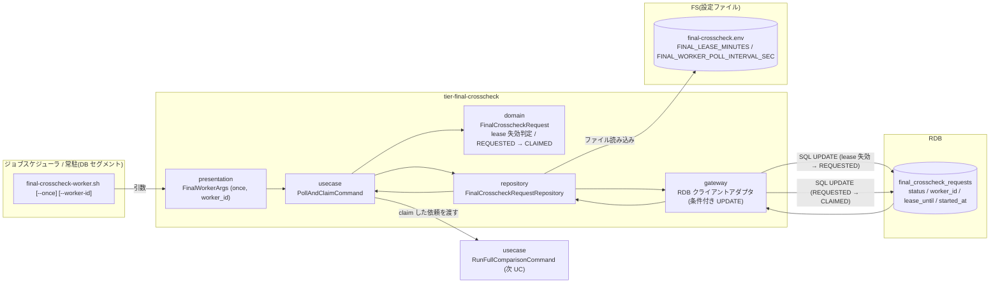
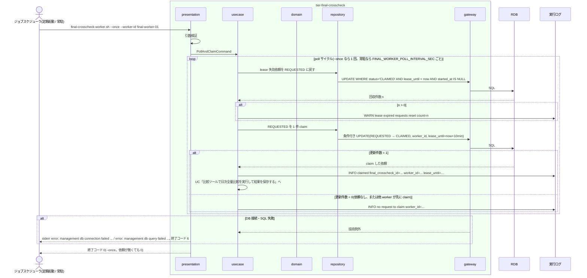

# 確報比較依頼を claim する

## 概要

`final-crosscheck-worker.sh` が DB セグメントで管理 DB を poll し、REQUESTED の確報比較依頼(`final_crosscheck_requests`)を条件付き UPDATE で CLAIMED にする(worker_id、lease_until = now + 10 分)。CLAIMED のまま lease が失効しかつ比較が未開始(started_at が NULL)の依頼は REQUESTED に戻し、別の worker が再取得できるようにする。規則は速報と同一で、テーブルだけを分離する。claim 後の比較実行は UC「比較ツールで日次全量比較を実行して結果を保存する」が担う。

## データフロー



| レイヤー | データモデル | 変換内容 |
|---------|------------|---------|
| presentation | FinalWorkerArgs(`--once`, `--worker-id`) | 引数検証。worker_id 未指定なら `{hostname}-{pid}` を発行(仮採用) |
| usecase | PollAndClaimCommand(worker_id, lease_minutes, poll_interval_sec) | lease 失効の回収 → 1 件 claim → 次 UC へ引き渡し。`--once` なら 1 サイクルで終了 |
| domain | FinalCrosscheckRequest | `is_lease_expired(lease_until, started_at, now)` = status=CLAIMED かつ lease_until < now かつ started_at IS NULL。`claim(worker_id, now)` = status CLAIMED、lease_until = now + lease_minutes |
| repository / gateway | 条件付き UPDATE 2 本 | 回収: `UPDATE ... SET status='REQUESTED', worker_id=NULL, lease_until=NULL WHERE status='CLAIMED' AND lease_until < now AND started_at IS NULL`。claim: `UPDATE ... SET status='CLAIMED', worker_id=?, lease_until=? WHERE final_crosscheck_id = (SELECT ... WHERE status='REQUESTED' ORDER BY requested_at LIMIT 1) AND status='REQUESTED'`(更新件数 1 のみ成功) |

## 処理フロー



## バリエーション一覧

| バリエーション名 | 値 | 処理内容 | 適用 tier | 適用箇所 |
|----------------|---|---------|----------|---------|
| クロスチェック依頼状態 | REQUESTED | claim 対象。requested_at 昇順に 1 件取る | tier-final-crosscheck | `claim_one` |
| クロスチェック依頼状態 | CLAIMED | claim 後の状態。lease 有効中は他 worker が取得できない | tier-final-crosscheck | `claim_one` |
| クロスチェック依頼状態 | CLAIMED(lease 失効・未開始) | REQUESTED に戻す | tier-final-crosscheck | `reset_expired_leases` |
| クロスチェック依頼状態 | RUNNING / SUCCEEDED / FAILED / ABORTED | claim / 回収の対象外 | tier-final-crosscheck | WHERE 句 |
| 速報クロスチェックのプロセス役割 | worker | poll / claim を担う(確報でも同じ役割区分) | tier-final-crosscheck | `final-crosscheck-worker.sh` |
| クロスチェック種別 | 確報クロスチェック | `final_crosscheck_requests` を対象にする | tier-final-crosscheck | `FinalCrosscheckRequestRepository` |

## 分岐条件一覧

| 条件名 | 判定ルール | 適用 tier | 適用箇所 | BDD Scenario |
|--------|----------|----------|---------|-------------|
| 依頼状態遷移規則 | worker の取得で REQUESTED → CLAIMED。それ以外の遷移はこの UC で行わない | tier-final-crosscheck | `claim_one` | REQUESTED の依頼を claim する |
| claim 排他 | claim は `WHERE status='REQUESTED'` の条件付き UPDATE で行い、更新件数 1 のときだけ成功。lease 有効中(status=CLAIMED かつ lease_until >= now)の依頼は他 worker の claim 対象にならない | tier-final-crosscheck | `claim_one`(gateway の条件付き UPDATE) | 2 つの worker が同時に poll しても 1 件は 1 worker だけが claim する |
| lease 失効判定 | status=CLAIMED かつ lease_until < now かつ started_at IS NULL の依頼を REQUESTED に戻す(worker_id / lease_until を NULL に)。started_at がある(RUNNING に進んだ)依頼は戻さない | tier-final-crosscheck | `reset_expired_leases` | lease 失効かつ未開始の依頼を再取得できる |

## 計算ルール一覧

| 計算名 | 入力情報 | 計算式/ロジック | 出力情報 | 適用 tier |
|--------|---------|---------------|---------|----------|
| lease_until の算出 | 現在時刻(UTC)、FINAL_LEASE_MINUTES(既定 10) | lease_until = now + FINAL_LEASE_MINUTES 分 | 確報比較依頼.lease_until | tier-final-crosscheck |
| lease 失効判定 | lease_until、started_at、現在時刻 | status='CLAIMED' AND lease_until < now AND started_at IS NULL → 失効 | 回収対象 | tier-final-crosscheck |
| 現在時刻(now) | システム時刻(UTC)、テスト専用環境変数 `RELAY_GATE_NOW` | `RELAY_GATE_NOW`(ISO 8601 UTC。cli-command-contract.yaml environment_variables で宣言。本番未設定)が設定されていればその値、未設定ならシステム時刻。worker は now を SQL のバインド値として渡す(DB の now() に依存しない) | lease_until / 失効判定の now | tier-final-crosscheck |
| worker_id の既定値 | ホスト名、PID | `--worker-id` 未指定なら `{hostname}-{pid}`(仮採用: 常駐・定期起動の両方で一意にするため) | 確報比較依頼.worker_id | tier-final-crosscheck |
| claim 順序 | requested_at | REQUESTED のうち requested_at 昇順の先頭 1 件 | claim 対象 | tier-final-crosscheck |

## 状態遷移一覧

| 状態モデル | 遷移元 | 遷移先 | トリガー | 事前条件 | 事後処理 | 適用 tier |
|-----------|--------|--------|---------|---------|---------|----------|
| クロスチェック依頼 | REQUESTED | CLAIMED | worker の poll / claim | status=REQUESTED(条件付き UPDATE で更新件数 1) | worker_id、lease_until = now + 10 分を設定。実行ログ `claimed` | tier-final-crosscheck |
| クロスチェック依頼 | CLAIMED | REQUESTED | worker の poll 時の lease 失効回収 | status=CLAIMED かつ lease_until < now かつ started_at IS NULL | worker_id / lease_until を NULL に。実行ログ `lease expired requests reset` | tier-final-crosscheck |

## 関連 RDRA モデル

| モデル種別 | 要素名 | 関連 |
|-----------|--------|------|
| 業務 | クロスチェック業務 | この UC が属する業務 |
| BUC | 確報クロスチェックフロー | この UC を含む BUC |
| アクター | 運用者 | 受益者(worker のログを読む) |
| 情報 | 確報比較依頼(final_crosscheck_request) | claim / lease の対象 |
| 状態 | クロスチェック依頼 | REQUESTED → CLAIMED、CLAIMED → REQUESTED |
| 条件 | 依頼状態遷移規則 | worker の取得で CLAIMED |
| 条件 | claim 排他 | worker_id + lease_until |
| 条件 | lease 失効判定 | 失効かつ未開始で REQUESTED へ |
| 画面 | final-crosscheck worker claim 出力(→ CLI 出力) | 実行ログの `claimed` / `no request to claim` |
| イベント | 確報比較依頼の claim と lease 更新 | 管理 DB への条件付き UPDATE |
| 外部システム | 管理 DB(RDB) | ジョブキュー |

## 関連 USDM

| REQ ID | SPEC ID | 対応 BDD Scenario |
|--------|---------|------------------|
| REQ-006 | SPEC-006-02 | REQUESTED の依頼を claim する(SPEC-006-02) |
| REQ-007 | SPEC-007-01 | lease 失効かつ未開始の依頼を再取得できる(SPEC-007-01) |
| REQ-007 | SPEC-007-02 | REQUESTED の依頼を claim する(SPEC-006-02)(worker_id / lease_until の設定) |

## E2E 完了条件(BDD)

### 正常系

```gherkin
Feature: 確報比較依頼を claim する

  Scenario: REQUESTED の依頼を claim する(SPEC-006-02)
    Given final_crosscheck_requests に final_crosscheck_id=20260830T210000Z-final-7b2c9e1f status=REQUESTED requested_at=2026-08-30T21:00:00Z の行がある
    And final-crosscheck.env に FINAL_LEASE_MINUTES=10 がある
    And クロスチェックジョブマップの確報行の compare_command が、起動後に停止シグナルを受けるまで待機するスタブを指す(claim 後の比較実行を止めて CLAIMED → RUNNING の途中状態を観測可能にする)
    And RELAY_GATE_NOW=2026-08-30T21:00:30Z である
    When final-crosscheck-worker.sh --once --worker-id final-worker-01 を実行する
    Then 実行ログに "INFO claimed final_crosscheck_id=20260830T210000Z-final-7b2c9e1f worker_id=final-worker-01 lease_until=2026-08-30T21:10:30Z" が残る
    And スタブが待機している間、該当行は worker_id=final-worker-01 lease_until=2026-08-30T21:10:30Z で、status は CLAIMED または RUNNING である(`--once` は claim 後に同一プロセスで次 UC の比較実行まで進むため、プロセス終了時点の status=CLAIMED は観測できない)
    And スタブに停止シグナルを送ると worker は依頼を終端(FAILED)まで保存して終了コード 0 で終了する

  Scenario: lease 失効かつ未開始の依頼を再取得できる(SPEC-007-01)
    Given final_crosscheck_requests に status=CLAIMED worker_id=final-worker-01 lease_until=2026-08-30T21:10:30Z started_at=NULL の行がある
    And compare_command が停止シグナルを受けるまで待機するスタブを指す
    And RELAY_GATE_NOW=2026-08-30T21:11:00Z である
    When final-crosscheck-worker.sh --once --worker-id final-worker-02 を実行する
    Then 該当行はいったん REQUESTED に戻された後、スタブが待機している間は worker_id=final-worker-02 lease_until=2026-08-30T21:21:00Z で status は CLAIMED または RUNNING である
    And 実行ログに "WARN lease expired requests reset count=1" が残る

  Scenario: 2 つの worker が同時に poll しても 1 件は 1 worker だけが claim する
    Given final_crosscheck_requests に status=REQUESTED の行が 1 件だけある
    When final-crosscheck-worker.sh --once --worker-id final-worker-01 と --worker-id final-worker-02 を同時に実行する
    Then 該当行の worker_id は final-worker-01 または final-worker-02 のどちらか 1 つである
    And もう一方の worker の実行ログには "INFO no request to claim" が残り、両方とも終了コード 0 で終了する
```

### 異常系

```gherkin
  Scenario: 比較開始済み(started_at あり)の依頼は lease が失効しても戻さない
    Given final_crosscheck_requests に status=RUNNING worker_id=final-worker-01 lease_until=2026-08-30T21:10:30Z started_at=2026-08-30T21:01:00Z の行がある
    And RELAY_GATE_NOW=2026-08-30T21:30:00Z である
    When final-crosscheck-worker.sh --once --worker-id final-worker-02 を実行する
    Then 該当行は status=RUNNING worker_id=final-worker-01 のままである
    And final-worker-02 は終了コード 0 で "INFO no request to claim" を実行ログに残す

  Scenario: 管理 DB に接続できない
    Given FINAL_DB_CONN_REF が解決できない接続先を指す
    When final-crosscheck-worker.sh --once を実行する
    Then 終了コード 6 で stderr に "error: management db connection failed worker_id=" で始まる行が出る
```

## ティア別仕様

- [確報クロスチェックティア](tier-final-crosscheck.md)

### 統合 API Spec

- [CLI コマンド契約](../../../_cross-cutting/api/cli-command-contract.yaml)(`final-crosscheck-worker.sh`)
- [AsyncAPI Spec](../../../_cross-cutting/api/asyncapi.yaml)(`channels.final-crosscheck-requests` subscribe)
