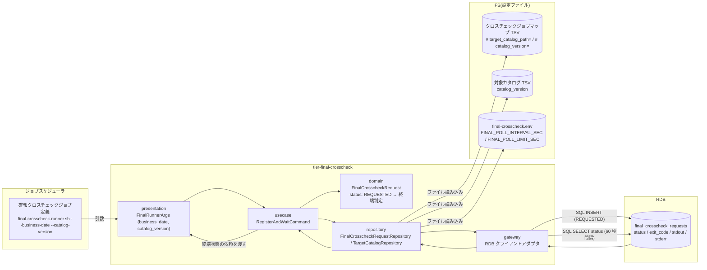
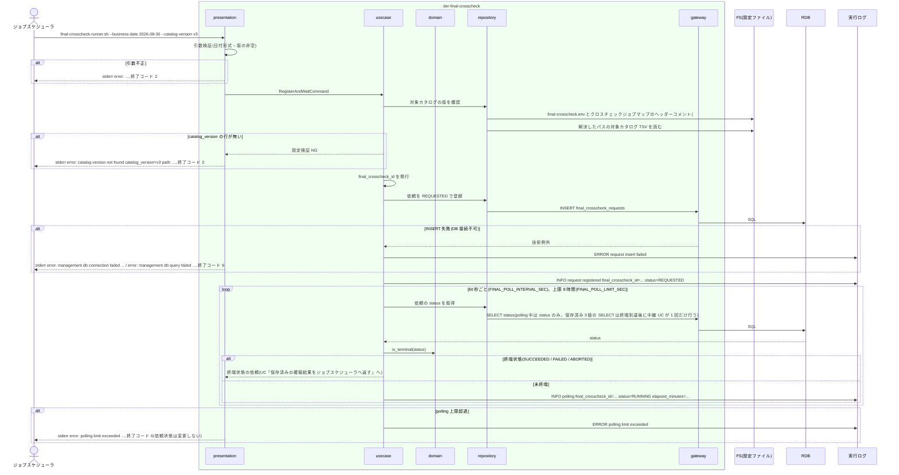

# 確報比較依頼を登録して終端状態まで待機する

## 概要

ジョブスケジューラの確報クロスチェックジョブ定義から起動された `final-crosscheck-runner.sh` が、`--business-date` と `--catalog-version` を持つ確報比較依頼(`final_crosscheck_requests`)を REQUESTED で 1 件登録し、SUCCEEDED / FAILED / ABORTED の終端状態になるまで 60 秒間隔で同期 polling する。確報の制御は feature flag に含めず、速報側の `rapid_runs` / `rapid_crosscheck_requests` には触れない。終端状態到達後の中継は UC「保存済みの確報結果をジョブスケジューラへ返す」が担う。

## データフロー



| レイヤー | データモデル | 変換内容 |
|---------|------------|---------|
| presentation | FinalRunnerArgs(`--business-date YYYY-MM-DD`, `--catalog-version <ver>`) | 引数の形式検証。未知オプション・欠落は終了コード 2 |
| usecase | RegisterAndWaitCommand(business_date, catalog_version, poll_interval_sec, poll_limit_sec) | final_crosscheck_id を発行し、登録 → polling → 終端判定のフロー制御 |
| domain | FinalCrosscheckRequest(status) | `is_terminal(status)` = status ∈ {SUCCEEDED, FAILED, ABORTED} |
| repository | FinalCrosscheckRequestRepository / TargetCatalogRepository | クロスチェックジョブマップのヘッダーコメント `# target_catalog_path=` から対象カタログ TSV を解決し catalog_version の行があることを確認し、依頼レコードを INSERT / SELECT する |
| gateway | RDB クライアントアダプタ | SQL 実行。接続失敗・SQL 失敗は技術例外として非 0 で返す |
| 出力 | 終端状態の依頼(stdout / stderr / exit_code) | UC「保存済みの確報結果をジョブスケジューラへ返す」へ渡す |

## 処理フロー



## バリエーション一覧

| バリエーション名 | 値 | 処理内容 | 適用 tier | 適用箇所 |
|----------------|---|---------|----------|---------|
| クロスチェック種別 | 確報クロスチェック | ジョブスケジューラの別ジョブ定義から起動し、`final_crosscheck_requests` を使う | tier-final-crosscheck | `final-crosscheck-runner.sh` |
| クロスチェック依頼状態 | REQUESTED | runner が登録時に設定する初期状態 | tier-final-crosscheck | `register_request` |
| クロスチェック依頼状態 | CLAIMED / RUNNING | polling 中の未終端状態。待機を継続する | tier-final-crosscheck | `wait_until_terminal` |
| クロスチェック依頼状態 | SUCCEEDED / FAILED / ABORTED | 終端状態。polling を抜けて中継へ進む | tier-final-crosscheck | `is_terminal` |
| ジョブスケジューラ起動ジョブ種別 | 確報クロスチェックジョブ | 業務ジョブ(facade)とは別のジョブ定義から起動する | tier-final-crosscheck | `final-crosscheck-runner.sh` |
| 比較種別 | 全テーブル・全ファイル比較 | 依頼に catalog_version を紐付けて全量比較の範囲を確定する | tier-final-crosscheck | `register_request` |

## 分岐条件一覧

| 条件名 | 判定ルール | 適用 tier | 適用箇所 | BDD Scenario |
|--------|----------|----------|---------|-------------|
| 確報依頼の登録条件 | ジョブスケジューラから起動されたら business_date と catalog_version を持つ依頼を REQUESTED で 1 件登録し、status ∈ {SUCCEEDED, FAILED, ABORTED} になるまで同期 polling する | tier-final-crosscheck | `final-crosscheck-runner.sh` / `register_request` / `wait_until_terminal` | 確報依頼を登録して SUCCEEDED まで待機する |
| 速報と確報のモデル分離 | `final_crosscheck_requests` と対象カタログのみを読み書きし、`rapid_runs` / `rapid_crosscheck_requests` / `parallel_runs` に SELECT / INSERT / UPDATE を発行しない | tier-final-crosscheck | `FinalCrosscheckRequestRepository` | 速報側テーブルを変更しない |
| 確報クロスチェック非起動 | feature flag(`BLUE_MODE` / `GREEN_MODE` / `RAPID_CROSSCHECK_MODE`)を読まない。facade からは起動されない | tier-final-crosscheck | `final-crosscheck-runner.sh`(feature flag ファイルを open しない) | feature flag を読まずに起動する |
| 依頼状態遷移規則 | runner は REQUESTED で作成するだけで、以降の遷移(CLAIMED / RUNNING / 終端)は worker と abort-final-crosscheck が行う。polling 中に status を UPDATE しない | tier-final-crosscheck | `wait_until_terminal` | polling 上限超過で終了コード 6 になり依頼は変更されない |

## 計算ルール一覧

| 計算名 | 入力情報 | 計算式/ロジック | 出力情報 | 適用 tier |
|--------|---------|---------------|---------|----------|
| final_crosscheck_id 発行 | 起動時刻(UTC)、8 桁 hex 乱数 | `{UTC yyyymmddThhmmssZ}-final-{8 桁 hex}`(例 `20260830T210000Z-final-7b2c9e1f`。仮採用: run_id 形式 #9 に倣い管理 DB のシーケンスに依存しない) | 確報比較依頼.final_crosscheck_id | tier-final-crosscheck |
| 終端判定 | 確報比較依頼.status | status ∈ {SUCCEEDED, FAILED, ABORTED} なら true | 待機終了フラグ | tier-final-crosscheck |
| polling 上限判定 | 登録時刻、現在時刻、FINAL_POLL_LIMIT_SEC(既定 28800) | now - requested_at > FINAL_POLL_LIMIT_SEC なら上限超過 | 終了コード 6 | tier-final-crosscheck |
| polling 経過時間 | requested_at、現在時刻 | floor((now - requested_at) / 60) を `elapsed_minutes` として実行ログに残す | 実行ログ | tier-final-crosscheck |

## 状態遷移一覧

| 状態モデル | 遷移元 | 遷移先 | トリガー | 事前条件 | 事後処理 | 適用 tier |
|-----------|--------|--------|---------|---------|---------|----------|
| クロスチェック依頼 | `[*]` | REQUESTED | `final-crosscheck-runner.sh` の依頼登録 | 引数検証 OK、対象カタログに catalog_version の行がある | 実行ログに `request registered`、60 秒間隔の polling 開始 | tier-final-crosscheck |

## 関連 RDRA モデル

| モデル種別 | 要素名 | 関連 |
|-----------|--------|------|
| 業務 | クロスチェック業務 | この UC が属する業務 |
| BUC | 確報クロスチェックフロー | この UC を含む BUC |
| アクター | 運用者 | 受益者(確報ジョブの結果を読む) |
| 情報 | ジョブ起動要求 | ジョブスケジューラから受け取る business_date / catalog_version |
| 情報 | 確報比較依頼(final_crosscheck_request) | REQUESTED で登録し polling する |
| 情報 | 対象カタログ | catalog_version の存在確認 |
| 情報 | クロスチェックジョブマップ | ヘッダーコメント `# target_catalog_path=` / `# catalog_version=` で対象カタログを参照する |
| 状態 | クロスチェック依頼 | `[*]` → REQUESTED |
| 条件 | 確報依頼の登録条件 | 登録と同期 polling |
| 条件 | 速報と確報のモデル分離 | 速報側テーブルに触れない |
| 条件 | 確報クロスチェック非起動 | feature flag を読まない |
| 条件 | 依頼状態遷移規則 | runner は REQUESTED の作成のみ |
| 画面 | final-crosscheck runner 待機出力(→ CLI 出力) | 待機中は stdout / stderr に出さず実行ログに残す |
| イベント | 確報ジョブの起動 | ジョブスケジューラからの起動 |
| イベント | 確報比較依頼の登録と polling | 管理 DB への INSERT / SELECT |
| 外部システム | ジョブスケジューラ | 起動元 |
| 外部システム | 管理 DB(RDB) | 依頼レコードの保存先 |

## 関連 USDM

| REQ ID | SPEC ID | 対応 BDD Scenario |
|--------|---------|------------------|
| REQ-006 | SPEC-006-01 | 確報依頼を登録して SUCCEEDED まで待機する(SPEC-006-01) |
| REQ-006 | SPEC-006-04 | 速報側テーブルを変更しない(SPEC-006-04) |
| REQ-011 | SPEC-011-03 | 確報依頼を登録して SUCCEEDED まで待機する(SPEC-006-01)(business_date / catalog_version の記録) |

## E2E 完了条件(BDD)

### 正常系

```gherkin
Feature: 確報比較依頼を登録して終端状態まで待機する

  Scenario: 確報依頼を登録して SUCCEEDED まで待機する(SPEC-006-01)
    Given 対象カタログ TSV に catalog_version=v3 の行が存在する
    And final-crosscheck.env に FINAL_POLL_INTERVAL_SEC=1 FINAL_POLL_LIMIT_SEC=30 が設定されている(既定は 60 秒 / 28800 秒。テストは間隔を 1 秒に落として所要時間を抑える)
    And 別プロセスが 3 秒後に、runner が登録した最新の依頼(final_crosscheck_requests で requested_at が最大の行)を status=SUCCEEDED exit_code=0 stdout="all 42 targets matched\n" stderr="" に更新する(worker の代替)
    When ジョブスケジューラが final-crosscheck-runner.sh --business-date 2026-08-30 --catalog-version v3 を起動する
    Then final_crosscheck_requests に business_date=2026-08-30 catalog_version=v3 status=REQUESTED の行が 1 件登録される
    And runner は 1 秒間隔で status を polling し、status=SUCCEEDED になるまで終了しない(実行ログに "INFO polling final_crosscheck_id=<id> status=REQUESTED" が 2 行以上残る)
    And 終端到達後、標準出力は "all 42 targets matched\n" と完全一致し、終了コード 0 で終了する
    And 実行ログに "request registered final_crosscheck_id=<id> status=REQUESTED" が残る(<id> は `^[0-9]{8}T[0-9]{6}Z-final-[0-9a-f]{8}$` 形式。末尾 8 hex は乱数で起動時刻依存のため形式一致で検証する。本 spec の他シナリオの `20260830T210000Z-final-7b2c9e1f` は例示値)

  Scenario: 速報側テーブルを変更しない(SPEC-006-04)
    Given rapid_runs / rapid_crosscheck_requests / parallel_runs の行数がそれぞれ 3 件である
    And final-crosscheck.env に FINAL_POLL_INTERVAL_SEC=1 が設定されている
    And 別プロセスが 3 秒後に、runner が登録した最新の依頼を status=FAILED exit_code=3 stdout="diff found: 12 rows\n" stderr="" に更新する
    When final-crosscheck-runner.sh --business-date 2026-08-30 --catalog-version v3 を実行する
    Then runner は終了コード 3 で終了し、final_crosscheck_requests だけが 1 件増える
    And rapid_runs / rapid_crosscheck_requests / parallel_runs の行数は 3 件のままである

  Scenario: feature flag を読まずに起動する
    Given feature flag ファイルが存在しない
    And 対象カタログ TSV に catalog_version=v3 の行が存在する
    When final-crosscheck-runner.sh --business-date 2026-08-30 --catalog-version v3 を実行する
    Then 依頼は status=REQUESTED で登録され、feature flag 不在を理由にしたエラーは出ない
```

### 異常系

```gherkin
  Scenario: polling 上限超過で終了コード 6 になり依頼は変更されない
    Given final-crosscheck.env に FINAL_POLL_INTERVAL_SEC=1 FINAL_POLL_LIMIT_SEC=3 が設定されている
    And final-crosscheck-worker.sh が稼働していない
    When final-crosscheck-runner.sh --business-date 2026-08-30 --catalog-version v3 を実行する
    Then 終了コード 6 で終了する
    And stderr に "error: polling limit exceeded final_crosscheck_id=<id> status=REQUESTED limit_sec=3" が出る(<id> は登録された依頼の final_crosscheck_id と一致し、形式は `^[0-9]{8}T[0-9]{6}Z-final-[0-9a-f]{8}$`)
    And final_crosscheck_requests の該当行は status=REQUESTED のままである

  Scenario: catalog_version が対象カタログに無い
    Given 対象カタログ TSV に catalog_version=v3 の行が存在しない
    When final-crosscheck-runner.sh --business-date 2026-08-30 --catalog-version v3 を実行する
    Then 終了コード 2 で終了する
    And stderr に "error: catalog version not found catalog_version=v3 path: /etc/relay-gate/target-catalog.tsv" が出る
    And final_crosscheck_requests に行は登録されない

  Scenario: business_date の形式が不正
    When final-crosscheck-runner.sh --business-date 20260830 --catalog-version v3 を実行する
    Then 終了コード 2 で終了する
    And stderr に "error: invalid value option=--business-date value=20260830" が出る
```

## ティア別仕様

- [確報クロスチェックティア](tier-final-crosscheck.md)

### 統合 API Spec

- [CLI コマンド契約](../../../_cross-cutting/api/cli-command-contract.yaml)(`final-crosscheck-runner.sh`)
- [AsyncAPI Spec](../../../_cross-cutting/api/asyncapi.yaml)(`channels.final-crosscheck-requests` publish)
