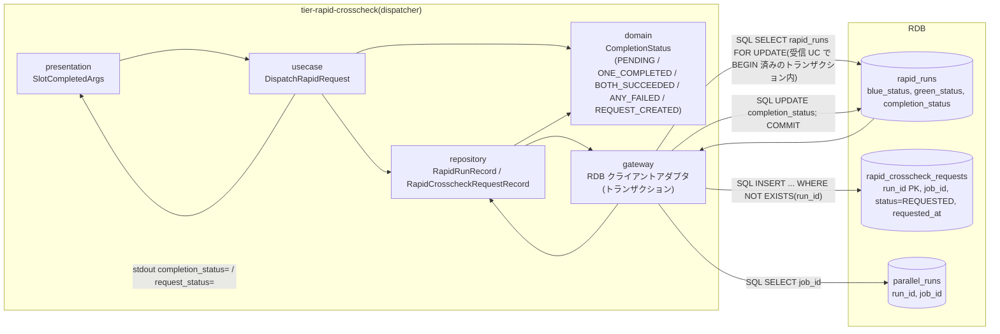
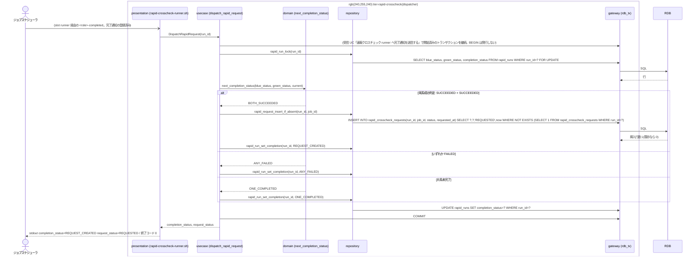

# 両系成功時に速報比較依頼を作成する

## 概要

速報クロスチェック runner(dispatcher)が完了通知を受けて rapid_run の blue_status / green_status を更新した後、速報実行の完了状況を PENDING → ONE_COMPLETED → BOTH_SUCCEEDED / ANY_FAILED → REQUEST_CREATED へ進める。blue と green の両方が成功(exit_code 0)したときに限り、完了順にかかわらず rapid_crosscheck_requests を run_id 主キーで 1 件だけ REQUESTED で INSERT する。いずれかが失敗した場合は比較依頼を作成せず終了する。判定と INSERT は 1 トランザクション・条件付き INSERT で行い重複を防ぐ。速報の結果はジョブスケジューラ応答に影響させず、確報側(final_*)には触れない。

## データフロー



| レイヤー | データモデル | 変換内容 |
|---------|------------|---------|
| presentation | SlotCompletedArgs | 受信 UC と同じ起動(完了通知の登録に続けて実行) |
| usecase | DispatchRapidRequest | 行ロック → 判定 → 条件付き INSERT → completion_status 更新を 1 トランザクションで実行 |
| domain | CompletionStatus | blue_status × green_status の判定表(下記)で次の完了状況を決める。純粋関数 |
| repository | RapidRunRecord / RapidCrosscheckRequestRecord | rapid_runs の SELECT FOR UPDATE / UPDATE、rapid_crosscheck_requests の INSERT |
| gateway | RDB アダプタ | 受信 UC で BEGIN 済みのトランザクションを継続し、本 UC が COMMIT / ROLLBACK と SQL 実行を行う |

## 処理フロー



## バリエーション一覧

| バリエーション名 | 値 | 処理内容 | 適用 tier | 適用箇所 |
|----------------|---|---------|----------|---------|
| 実装スロット | blue | blue_status を判定入力にする | tier-rapid-crosscheck | next_completion_status |
| 実装スロット | green | green_status を判定入力にする | tier-rapid-crosscheck | next_completion_status |
| 速報クロスチェックのプロセス役割 | runner(dispatcher) | 本 UC の実行主体。依頼作成のみ行い比較は行わない | tier-rapid-crosscheck | dispatch_rapid_request |
| 速報クロスチェックのプロセス役割 | worker | REQUESTED の依頼を後続で claim する(別 UC) | tier-rapid-crosscheck | — |
| クロスチェック依頼状態 | REQUESTED | 作成時の初期状態 | tier-rapid-crosscheck | rapid_request_insert_if_absent |
| クロスチェック種別 | 速報クロスチェック | rapid_crosscheck_requests に作成する。確報依頼は作らない | tier-rapid-crosscheck | dispatch_rapid_request |

## 分岐条件一覧

| 条件名 | 判定ルール | 適用 tier | 適用箇所 | BDD Scenario |
|--------|----------|----------|---------|-------------|
| 両系成功判定 | blue_status × green_status の表: SUCCEEDED × SUCCEEDED → BOTH_SUCCEEDED(依頼作成)。どちらかが FAILED → ANY_FAILED(作成しない)。どちらかが NULL → ONE_COMPLETED(待機) | tier-rapid-crosscheck | next_completion_status(domain) | 後に完了した側の通知で依頼が 1 件作成される / blue が失敗なら依頼を作成しない |
| 比較依頼の一意性 | rapid_crosscheck_requests の主キー run_id と `INSERT ... WHERE NOT EXISTS` により 1 run_id に 1 件。同一トランザクション内で rapid_runs を行ロック(FOR UPDATE)して両通知の同時到着でも 1 件 | tier-rapid-crosscheck | rapid_request_insert_if_absent(repository)/ dispatch_rapid_request(usecase) | green 先行・blue 後続でも依頼は 1 件 |
| 依頼状態遷移規則 | 依頼は REQUESTED で作成する(以降の遷移は worker) | tier-rapid-crosscheck | rapid_request_insert_if_absent | 後に完了した側の通知で依頼が 1 件作成される |
| 速報と確報のモデル分離 | rapid_runs / rapid_crosscheck_requests のみ更新。final_crosscheck_requests を作成・変更しない | tier-rapid-crosscheck | dispatch_rapid_request | 後に完了した側の通知で依頼が 1 件作成される |
| 速報結果の位置付け | 依頼の作成有無・失敗は slot runner の終了コードやジョブスケジューラ応答に影響しない(送信側 UC の gateway が非 0 を吸収) | tier-rapid-crosscheck | rapid-crosscheck-runner.sh(presentation の終了コードは通知元にだけ返る) | blue が失敗なら依頼を作成しない |
| 速報クロスチェック有効判定 | 本コマンドは on のときだけ起動される。off では起動されず DB に触れない | tier-rapid-crosscheck | rapid-crosscheck-runner.sh | — |

## 計算ルール一覧

| 計算名 | 入力情報 | 計算式/ロジック | 出力情報 | 適用 tier |
|--------|---------|---------------|---------|----------|
| 完了状況の遷移 | blue_status, green_status(NULL / SUCCEEDED / FAILED) | 両方 NULL → PENDING、片方のみ非 NULL かつ SUCCEEDED → ONE_COMPLETED、いずれか FAILED → ANY_FAILED、両方 SUCCEEDED → BOTH_SUCCEEDED、INSERT 成功後 → REQUEST_CREATED | rapid_runs.completion_status | tier-rapid-crosscheck |
| requested_at | 現在時刻 | UTC ISO 8601 秒精度 | rapid_crosscheck_requests.requested_at | tier-rapid-crosscheck |
| job_id の確定 | 通知の `--job-id`、parallel_runs.job_id | parallel_runs.job_id を正とする。通知の値は照合のみで、不一致なら `warn: job_id mismatch run_id=... notified=... recorded=...` を出して parallel_runs の値を採用する | rapid_crosscheck_requests.job_id | tier-rapid-crosscheck |

## 状態遷移一覧

| 状態モデル | 遷移元 | 遷移先 | トリガー | 事前条件 | 事後処理 | 適用 tier |
|-----------|--------|--------|---------|---------|---------|----------|
| 速報実行の完了状況 | 両系未完了(PENDING) | 片系完了(ONE_COMPLETED) | 先に完了した側の通知 | その側が SUCCEEDED | completion_status 更新 | tier-rapid-crosscheck |
| 速報実行の完了状況 | 両系未完了(PENDING) | いずれか失敗(ANY_FAILED) | 先に完了した側の通知 | その側が FAILED | 依頼を作成しない | tier-rapid-crosscheck |
| 速報実行の完了状況 | 片系完了(ONE_COMPLETED) | 両系成功(BOTH_SUCCEEDED) | 後に完了した側の通知 | 両方 SUCCEEDED | 続けて依頼作成 | tier-rapid-crosscheck |
| 速報実行の完了状況 | 片系完了(ONE_COMPLETED) | いずれか失敗(ANY_FAILED) | 後に完了した側の通知 | 後の側が FAILED | 依頼を作成しない | tier-rapid-crosscheck |
| 速報実行の完了状況 | 両系成功(BOTH_SUCCEEDED) | 比較依頼作成済み(REQUEST_CREATED) | 条件付き INSERT 成功 | rapid_crosscheck_requests に run_id が無い | 同一トランザクションで COMMIT | tier-rapid-crosscheck |
| クロスチェック依頼 | `[*]` | REQUESTED | 両系成功判定 | run_id 主キーで未作成 | worker の取得待ち | tier-rapid-crosscheck |

## 関連 RDRA モデル

| モデル種別 | 要素名 | 関連 |
|-----------|--------|------|
| 業務 | クロスチェック業務 | この UC が属する業務 |
| BUC | 速報クロスチェックフロー | この UC を含む BUC(アクティビティ: 比較依頼の作成判定) |
| アクター | 運用者 | 受益者(自動) |
| 情報 | 完了通知 | 判定の入力 |
| 情報 | 速報実行(rapid_run) | 更新する |
| 情報 | 速報比較依頼(rapid_crosscheck_request) | 作成する |
| 情報 | 並行稼働実行(parallel_run) | run_id / job_id の相関元 |
| 状態 | 速報実行の完了状況 | 遷移する |
| 状態 | クロスチェック依頼 | 初期遷移(REQUESTED) |
| 条件 | 両系成功判定 | 適用 |
| 条件 | 比較依頼の一意性 | 適用 |
| 条件 | 依頼状態遷移規則 | 適用 |
| 条件 | 速報と確報のモデル分離 | 適用 |
| 画面 | rapid-crosscheck runner 判定出力(→ CLI 出力) | stdout の completion_status / request_status |
| イベント | rapid_run 更新と比較依頼登録 | 管理 DB(RDB)へのトランザクション |
| 外部システム | 管理 DB(RDB) | 書き込み先 |

## 関連 USDM

| REQ ID | SPEC ID | 対応 BDD Scenario |
|--------|---------|-----------------|
| REQ-005 | SPEC-005-02 | 後に完了した側の通知で依頼が 1 件作成される(SPEC-005-02) / green 先行・blue 後続でも依頼は 1 件(SPEC-005-02) / blue が失敗なら依頼を作成しない(SPEC-005-02) |
| REQ-007 | SPEC-007-01 | 後に完了した側の通知で依頼が 1 件作成される(SPEC-005-02)(REQUESTED で作成) |
| REQ-011 | SPEC-011-02 | 後に完了した側の通知で依頼が 1 件作成される(SPEC-005-02)(rapid_run の相関) |

## E2E 完了条件(BDD)

### 正常系

```gherkin
Feature: 両系成功時に速報比較依頼を作成する

  Scenario: 後に完了した側の通知で依頼が 1 件作成される(SPEC-005-02)
    Given RAPID_CROSSCHECK_MODE=on で parallel_runs に run_id=20260830T113000Z-JOB001-3f9a1c2e, job_id=JOB001 の行がある(rapid_runs / rapid_crosscheck_requests の FK 先。job_id の正本)
    And rapid_runs に run_id=20260830T113000Z-JOB001-3f9a1c2e, blue_status=SUCCEEDED, green_status=NULL, completion_status=ONE_COMPLETED の行がある
    And rapid_crosscheck_requests に run_id=20260830T113000Z-JOB001-3f9a1c2e の行が無い
    When `rapid-crosscheck-runner.sh green-completed --run-id 20260830T113000Z-JOB001-3f9a1c2e --job-id JOB001 --exit-code 0 --artifact-uri file:///var/relay-gate/facade/20260830T113000Z-JOB001-3f9a1c2e/green` を実行する
    Then 終了コードは 0 で stdout に `completion_status=REQUEST_CREATED` と `request_status=REQUESTED` が出る
    And rapid_crosscheck_requests に run_id=20260830T113000Z-JOB001-3f9a1c2e, job_id=JOB001, status=REQUESTED, requested_at が UTC ISO 8601 の行がちょうど 1 件ある
    And final_crosscheck_requests は変更されない

  Scenario: green 先行・blue 後続でも依頼は 1 件(SPEC-005-02)
    Given parallel_runs に run_id=20260830T113000Z-JOB001-3f9a1c2e, job_id=JOB001 の行と、rapid_runs に同 run_id, blue_status=NULL, green_status=NULL, completion_status=PENDING の行がある
    When `rapid-crosscheck-runner.sh green-completed ... --exit-code 0 ...` を実行し、続けて `rapid-crosscheck-runner.sh blue-completed ... --exit-code 0 ...` を実行する
    Then 1 回目の stdout は `completion_status=ONE_COMPLETED`、2 回目の stdout は `completion_status=REQUEST_CREATED` である
    And rapid_crosscheck_requests の run_id=20260830T113000Z-JOB001-3f9a1c2e の行数は 1 である

  Scenario: 成功が先・失敗が後でも依頼を作成しない
    Given parallel_runs に run_id=20260830T113000Z-JOB001-3f9a1c2e, job_id=JOB001 の行と、rapid_runs に同 run_id, blue_status=NULL, green_status=NULL, completion_status=PENDING の行がある
    When `rapid-crosscheck-runner.sh blue-completed ... --exit-code 0 ...` を実行し、続けて `rapid-crosscheck-runner.sh green-completed ... --exit-code 3 ...` を実行する
    Then 1 回目の stdout は `completion_status=ONE_COMPLETED`、2 回目の stdout は `completion_status=ANY_FAILED` と `request_status=-` である
    And rapid_crosscheck_requests に run_id=20260830T113000Z-JOB001-3f9a1c2e の行は無い

  Scenario: 両通知が同時に到着しても依頼は 1 件
    Given parallel_runs に run_id=20260830T113000Z-JOB001-3f9a1c2e, job_id=JOB001 の行と、rapid_runs に同 run_id, completion_status=PENDING の行がある
    When blue-completed(exit_code=0)と green-completed(exit_code=0)を同時に実行する
    Then 両方の終了コードは 0 で、rapid_crosscheck_requests の run_id=20260830T113000Z-JOB001-3f9a1c2e の行数は 1 である
```

### 異常系

```gherkin
  Scenario: blue が失敗なら依頼を作成しない(SPEC-005-02)
    Given parallel_runs に run_id=20260830T113000Z-JOB001-3f9a1c2e, job_id=JOB001 の行と、rapid_runs に同 run_id, blue_status=FAILED, green_status=NULL, completion_status=ANY_FAILED の行がある
    When `rapid-crosscheck-runner.sh green-completed --run-id 20260830T113000Z-JOB001-3f9a1c2e --job-id JOB001 --exit-code 0 --artifact-uri file:///var/relay-gate/facade/20260830T113000Z-JOB001-3f9a1c2e/green` を実行する
    Then 終了コードは 0 で stdout に `completion_status=ANY_FAILED` と `request_status=-` が出る
    And rapid_crosscheck_requests に run_id=20260830T113000Z-JOB001-3f9a1c2e の行は無い
    And green の Runner Result(exitcode.txt=`0`)とジョブスケジューラ応答は変わらない

  Scenario: 両系とも失敗なら依頼を作成しない
    Given parallel_runs に run_id=20260830T113000Z-JOB001-3f9a1c2e, job_id=JOB001 の行と、rapid_runs に同 run_id, blue_status=FAILED, green_status=NULL, completion_status=ANY_FAILED の行がある
    When `rapid-crosscheck-runner.sh green-completed --run-id 20260830T113000Z-JOB001-3f9a1c2e --job-id JOB001 --exit-code 6 --artifact-uri file:///var/relay-gate/facade/20260830T113000Z-JOB001-3f9a1c2e/green` を実行する
    Then 終了コードは 0 で stdout に `completion_status=ANY_FAILED` と `request_status=-` が出る
    And rapid_runs.green_status は `FAILED` になり、rapid_crosscheck_requests に run_id=20260830T113000Z-JOB001-3f9a1c2e の行は無い

  Scenario: INSERT 中に管理 DB が失敗する
    Given parallel_runs と rapid_runs に run_id=20260830T113000Z-JOB001-3f9a1c2e の行(job_id=JOB001, blue_status=SUCCEEDED, green_status=NULL)があり、管理 DB が INSERT で失敗する
    When `rapid-crosscheck-runner.sh green-completed ... --exit-code 0 ...` を実行する
    Then 終了コードは 6 で stderr に `error: management db transaction failed run_id=20260830T113000Z-JOB001-3f9a1c2e` が出る
    And トランザクションは ROLLBACK され、rapid_runs.green_status は NULL のまま、rapid_crosscheck_requests に行は無い
```

## ティア別仕様

- [速報クロスチェックティア](tier-rapid-crosscheck.md)

### 統合 API Spec

- [CLI コマンド契約](../../../_cross-cutting/api/cli-command-contract.yaml)(`rapid-crosscheck-runner.sh blue-completed|green-completed`)
- [AsyncAPI Spec](../../../_cross-cutting/api/asyncapi.yaml)(channel `rapid-crosscheck-requests` を publish)
