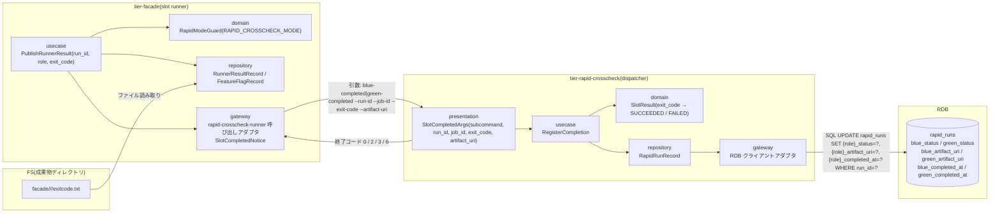
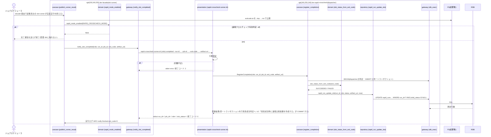

# 速報クロスチェック runner へ完了通知を送信する

## 概要

blue / green の slot runner が Runner Result(exitcode.txt)を公開した直後に、自系統の公開 function `rapid-crosscheck-runner.sh blue-completed|green-completed --run-id --job-id --exit-code --artifact-uri` を起動して完了結果を一方向に通知する。runner は相手側の状態や比較依頼の要否を判断しない。`RAPID_CROSSCHECK_MODE=off` のときは完了通知を送信せず、速報管理 DB への接続・書き込みも行わない。受信側(tier-rapid-crosscheck)は引数を検証して rapid_runs の自系統の status / artifact_uri / completed_at を更新する(両系成功判定と依頼作成は UC「両系成功時に速報比較依頼を作成する」)。

## データフロー



| レイヤー | データモデル | 変換内容 |
|---------|------------|---------|
| facade usecase | PublishRunnerResult | exitcode.txt 公開後、RapidModeGuard が on のときだけ gateway を呼ぶ |
| facade gateway | SlotCompletedNotice(run_id, job_id, exit_code, artifact_uri) | 引数へシリアライズして `rapid-crosscheck-runner.sh <role>-completed` を同期起動。終了コードを実行ログに記録し、slot runner 自身の終了コードには反映しない |
| rapid presentation | SlotCompletedArgs | サブコマンド・引数の検証(欠落・形式・exit_code 整数・artifact_uri のスキーム `file://` と絶対パス形式。存在確認はしない) |
| rapid domain | SlotResult | exit_code 0 → SUCCEEDED、非 0 → FAILED |
| rapid repository | RapidRunRecord | 自系統列の条件付き UPDATE(先勝ち。既に値があれば上書きせず終了コード 0) |

## 処理フロー



## バリエーション一覧

| バリエーション名 | 値 | 処理内容 | 適用 tier | 適用箇所 |
|----------------|---|---------|----------|---------|
| 実装スロット | blue | `blue-completed` を起動し、`blue_status` / `blue_artifact_uri` / `blue_completed_at` を更新する | tier-facade / tier-rapid-crosscheck | notify_slot_completed / rapid_run_update_slot |
| 実装スロット | green | `green-completed` を起動し、`green_*` 列を更新する | tier-facade / tier-rapid-crosscheck | notify_slot_completed / rapid_run_update_slot |
| 速報クロスチェックモード | on | 完了通知を送信する | tier-facade | publish_runner_result |
| 速報クロスチェックモード | off | 完了通知を送信せず、管理 DB へ接続・書き込みしない | tier-facade | publish_runner_result |
| 速報クロスチェックのプロセス役割 | runner(dispatcher) | 完了通知の受け口。一回ごとの起動 | tier-rapid-crosscheck | rapid-crosscheck-runner.sh |
| slot 実行モード | foreground / background | どちらの mode でも完了通知を送る(通知の有無は RAPID_CROSSCHECK_MODE だけで決まる) | tier-facade | publish_runner_result |

## 分岐条件一覧

| 条件名 | 判定ルール | 適用 tier | 適用箇所 | BDD Scenario |
|--------|----------|----------|---------|-------------|
| 速報クロスチェック有効判定 | `RAPID_CROSSCHECK_MODE=on` のときのみ通知を送る。off なら gateway を呼ばず、管理 DB の接続設定が無くても slot 実行は成功する | tier-facade | publish_runner_result(usecase) | RAPID_CROSSCHECK_MODE=off では通知しない |
| 完了通知の系統独立 | runner は自系統のサブコマンド(blue → blue-completed、green → green-completed)だけを起動し、相手側の rapid_runs 列や依頼の存在を参照しない | tier-facade / tier-rapid-crosscheck | notify_slot_completed / register_completion | green 未完了でも blue の通知は完結する |
| Runner Result 完備条件 | 通知の exit_code は公開済み exitcode.txt の値と一致させる。3 ファイルの公開(mv 完了)後にのみ通知する | tier-facade | publish_runner_result | blue の完了通知が rapid_runs に登録される |
| 速報結果の位置付け | 通知の失敗(rapid-crosscheck-runner の非 0)は slot runner の終了コード・Runner Result(stdout.log / stderr.log / exitcode.txt)に反映しない。実行ログ(`WARN completion notice failed run_id=... role=... exit_code=N`)にのみ残す(stderr.log へは追記しない。foreground slot では facade が stderr.log を中継するため、追記するとジョブスケジューラへの応答が変わる)。復旧は運用者が同じ引数で rapid-crosscheck-runner.sh を再実行する(受信側は先勝ちの冪等)。自動再通知・自動検知は行わない | tier-facade | notify_slot_completed(gateway) | 通知先が終了コード 6 でも Runner Result は変わらない / 通知失敗を運用者が同じ引数の再実行で復旧する |
| 速報と確報のモデル分離 | 受信側は rapid_runs のみを更新する。final_crosscheck_requests には触れない | tier-rapid-crosscheck | register_completion | blue の完了通知が rapid_runs に登録される |

## 計算ルール一覧

| 計算名 | 入力情報 | 計算式/ロジック | 出力情報 | 適用 tier |
|--------|---------|---------------|---------|----------|
| slot 結果の判定 | exit_code | 0 → SUCCEEDED、非 0 → FAILED | rapid_runs.{role}_status | tier-rapid-crosscheck |
| artifact_uri の組み立て | RELAY_GATE_ARTIFACT_ROOT, run_id, role | `file://<RELAY_GATE_ARTIFACT_ROOT>/facade/<run_id>/<role>` | 通知引数 `--artifact-uri` | tier-facade |
| 完了日時 | 通知受信時刻 | UTC ISO 8601 秒精度 | rapid_runs.{role}_completed_at | tier-rapid-crosscheck |

## 状態遷移一覧

| 状態モデル | 遷移元 | 遷移先 | トリガー | 事前条件 | 事後処理 | 適用 tier |
|-----------|--------|--------|---------|---------|---------|----------|
| 該当なし(状態.tsv で本 UC を遷移 UC とする行は無い。slot 実行の RUNNING → SUCCEEDED / FAILED は UC「実装スクリプトを実行して Runner Result を出力する」、速報実行の完了状況の遷移は UC「両系成功時に速報比較依頼を作成する」が担う) | — | — | — | — | — | — |

## 関連 RDRA モデル

| モデル種別 | 要素名 | 関連 |
|-----------|--------|------|
| 業務 | クロスチェック業務 | この UC が属する業務 |
| BUC | 速報クロスチェックフロー | この UC を含む BUC(アクティビティ: 完了通知の送信) |
| アクター | 運用者 | 受益者(操作なし。自動) |
| 情報 | 完了通知 | 送信・受信する |
| 情報 | Runner Result | exit_code と artifact_uri の出所 |
| 情報 | slot 実行 | 通知元の slot |
| 情報 | feature flag 設定 | RAPID_CROSSCHECK_MODE の参照 |
| 情報 | 速報実行(rapid_run) | 受信側が更新する |
| 条件 | 速報クロスチェック有効判定 | 適用 |
| 条件 | 完了通知の系統独立 | 適用 |
| 画面 | slot runner 完了通知出力(→ CLI 出力) | rapid-crosscheck-runner.sh の stdout / stderr / 終了コード(実行ログにのみ残る) |
| イベント | 完了結果の速報管理 DB 書き込み | rapid_runs の UPDATE |
| 外部システム | 管理 DB(RDB) | 書き込み先 |

## 関連 USDM

| REQ ID | SPEC ID | 対応 BDD Scenario |
|--------|---------|-----------------|
| REQ-005 | SPEC-005-01 | blue の完了通知が rapid_runs に登録される(SPEC-005-01) / green 未完了でも blue の通知は完結する(SPEC-005-01) |
| REQ-005 | SPEC-005-04 | RAPID_CROSSCHECK_MODE=off では通知しない(SPEC-005-04) |

## E2E 完了条件(BDD)

### 正常系

```gherkin
Feature: 速報クロスチェック runner へ完了通知を送信する

  Scenario: blue の完了通知が rapid_runs に登録される(SPEC-005-01)
    Given feature flag 設定に BLUE_MODE=foreground GREEN_MODE=background RAPID_CROSSCHECK_MODE=on が定義されている
    And rapid_runs に run_id=20260830T113000Z-JOB001-3f9a1c2e, blue_status=NULL, green_status=NULL の行がある
    And facade/20260830T113000Z-JOB001-3f9a1c2e/blue/exitcode.txt の中身が `0` である
    When blue runner が実装実行を終えて Runner Result を公開する
    Then blue runner は `rapid-crosscheck-runner.sh blue-completed --run-id 20260830T113000Z-JOB001-3f9a1c2e --job-id JOB001 --exit-code 0 --artifact-uri file:///var/relay-gate/facade/20260830T113000Z-JOB001-3f9a1c2e/blue` を起動する
    And rapid_runs の blue_status は `SUCCEEDED`、blue_artifact_uri は `file:///var/relay-gate/facade/20260830T113000Z-JOB001-3f9a1c2e/blue`、blue_completed_at は UTC ISO 8601 の値である
    And green_status は NULL のままである

  Scenario: green 未完了でも blue の通知は完結する(SPEC-005-01)
    Given RAPID_CROSSCHECK_MODE=on で run_id=20260830T113000Z-JOB001-3f9a1c2e の green slot が RUNNING である
    When blue runner が exit_code=3 で完了通知を送る
    Then rapid-crosscheck-runner.sh は終了コード 0 で終了し rapid_runs.blue_status は `FAILED` になる
    And blue runner は green の状態を参照せず、blue runner の終了コードは exitcode.txt の `3` のままである
```

### 異常系

```gherkin
  Scenario: RAPID_CROSSCHECK_MODE=off では通知しない(SPEC-005-04)
    Given feature flag 設定に BLUE_MODE=off GREEN_MODE=foreground RAPID_CROSSCHECK_MODE=off が定義されている
    And 管理 DB の接続設定が存在しない
    When green runner が exit_code=0 で実装実行を終える
    Then rapid-crosscheck-runner.sh は起動されない
    And 管理 DB への接続は行われず、green runner は終了コード 0 で終了する

  Scenario: 通知先が終了コード 6 でも Runner Result は変わらない
    Given RAPID_CROSSCHECK_MODE=on で rapid_runs の UPDATE が SQL エラーになる(例: green_status 列に対する権限が無い)
    And facade/20260830T113000Z-JOB001-3f9a1c2e/green/exitcode.txt の中身が `0` である
    When green runner が完了通知を送る
    Then rapid-crosscheck-runner.sh は stderr に `error: management db update failed run_id=20260830T113000Z-JOB001-3f9a1c2e role=green` を出し終了コード 6 で終了する
    And green runner の実行ログに `WARN completion notice failed run_id=20260830T113000Z-JOB001-3f9a1c2e role=green exit_code=6` が残る
    And facade/20260830T113000Z-JOB001-3f9a1c2e/green/ の stdout.log / stderr.log / exitcode.txt は通知前と同一で(stderr.log への追記なし)、exitcode.txt は `0` のまま、green runner の終了コードは 0 である

  Scenario: 通知失敗を運用者が同じ引数の再実行で復旧する
    Given run_id=20260830T113000Z-JOB001-3f9a1c2e の green の完了通知が終了コード 6 で失敗し、rapid_runs.green_status が NULL、exitcode.txt が `0` である
    And 管理 DB が復旧している
    When 運用者が `rapid-crosscheck-runner.sh green-completed --run-id 20260830T113000Z-JOB001-3f9a1c2e --job-id JOB001 --exit-code 0 --artifact-uri file:///var/relay-gate/facade/20260830T113000Z-JOB001-3f9a1c2e/green` を再実行する
    Then 終了コードは 0 で rapid_runs.green_status は `SUCCEEDED` になり、green の Runner Result と業務ジョブのジョブスケジューラ応答は変わらない
    And 同じコマンドをもう 1 回実行しても終了コードは 0 で rapid_runs の green_* 列は変わらない(先勝ち)
```

## ティア別仕様

- [facade / slot runner ティア](tier-facade.md)(送信側)
- [速報クロスチェックティア](tier-rapid-crosscheck.md)(受信側)

### 統合 API Spec

- [CLI コマンド契約](../../../_cross-cutting/api/cli-command-contract.yaml)(`rapid-crosscheck-runner.sh blue-completed|green-completed`)
- [AsyncAPI Spec](../../../_cross-cutting/api/asyncapi.yaml)(channel `slot-completed`)
