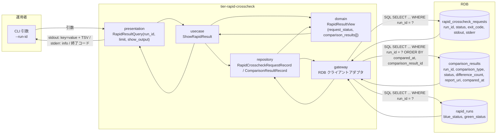
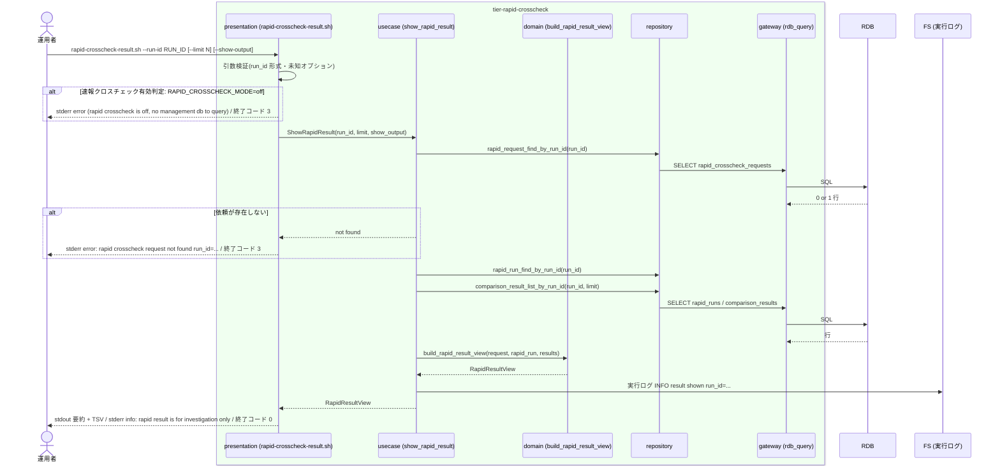

# 速報比較結果を参照する

## 概要

運用者が `rapid-crosscheck-result.sh --run-id <run_id>` で、管理 DB に登録された comparison_result(comparison_type / status / difference_count / report_uri / compared_at)と速報比較依頼(rapid_crosscheck_request)の stdout / stderr / exit_code を run_id で参照し、blue / green の差分の原因を調査する。速報の結果は原因調査に使い、リリース判断の正本には用いない(確報を用いる)。参照のみで状態を変更しない。

## データフロー



| レイヤー | データモデル | 変換内容 |
|---------|------------|---------|
| presentation | RapidResultQuery(run_id, limit=100, show_output=false) | 引数解析・run_id 形式検証・`RAPID_CROSSCHECK_MODE` 判定 |
| usecase | ShowRapidResult | 依頼・rapid_run・比較結果を run_id で取得し RapidResultView に組み立てる |
| domain | RapidResultView | 出力順の固定(要約 9 行 → TSV)、空値を `-` に置換 |
| repository / gateway | SELECT 3 本 | 読み取りのみ。INSERT / UPDATE は行わない |
| 出力 | stdout `key=value` 要約 + comparison_result TSV、stderr `info:` | 運用者の原因調査 |

## 処理フロー



## バリエーション一覧

| バリエーション名 | 値 | 処理内容 | 適用 tier | 適用箇所 |
|----------------|---|---------|----------|---------|
| 比較結果ステータス | 比較 OK | TSV の status 列に `OK` を出す | tier-rapid-crosscheck | build_rapid_result_view |
| 比較結果ステータス | 比較 NG | TSV の status 列に `NG` を出す | tier-rapid-crosscheck | build_rapid_result_view |
| 比較結果ステータス | FAILED | TSV の status 列に `FAILED` を出す | tier-rapid-crosscheck | build_rapid_result_view |
| クロスチェック依頼状態 | REQUESTED / CLAIMED / RUNNING / SUCCEEDED / FAILED / ABORTED | `request_status=` に英字コードをそのまま出す | tier-rapid-crosscheck | build_rapid_result_view |
| 比較ツール終了コード | 0(比較 OK) / 3(比較 NG) / 6(実行エラー) | `exit_code=` にそのまま出す(未完了は `-`) | tier-rapid-crosscheck | build_rapid_result_view |
| クロスチェック種別 | 速報クロスチェック | 本コマンドは速報のみを参照する。確報の依頼(final_crosscheck_requests)は参照しない | tier-rapid-crosscheck | show_rapid_result |
| 速報クロスチェックモード | on | 管理 DB を参照して結果を出す | tier-rapid-crosscheck | rapid-crosscheck-result.sh |
| 速報クロスチェックモード | off | 管理 DB が無いため終了コード 3 | tier-rapid-crosscheck | rapid-crosscheck-result.sh |

## 分岐条件一覧

| 条件名 | 判定ルール | 適用 tier | 適用箇所 | BDD Scenario |
|--------|----------|----------|---------|-------------|
| 速報結果の位置付け | 参照結果はジョブスケジューラ応答に影響しない。stderr に `info: rapid result is for investigation only; use final crosscheck for release decision` を常に出す | tier-rapid-crosscheck | rapid-crosscheck-result.sh(presentation) | 比較 NG の依頼を参照する |
| 比較ツール終了コードの対応 | 依頼の exit_code 0 → request_status=SUCCEEDED、3 / 6 / その他非 0 → FAILED。comparison_result.status は 0 → OK、3 → NG、6 / その他 → FAILED(登録時に確定済み。本 UC は変換せず表示する) | tier-rapid-crosscheck | build_rapid_result_view | 比較 NG の依頼を参照する |
| 速報クロスチェック有効判定 | `RAPID_CROSSCHECK_MODE=off` なら管理 DB へ接続せず、終了コード 3 で終了する | tier-rapid-crosscheck | rapid-crosscheck-result.sh(presentation) | RAPID_CROSSCHECK_MODE=off で参照する |
| 速報と確報のモデル分離 | 本コマンドは rapid_runs / rapid_crosscheck_requests / comparison_results のみを SELECT する。final_crosscheck_requests には触れない | tier-rapid-crosscheck | show_rapid_result | 比較 OK の依頼を参照する |

## 計算ルール一覧

| 計算名 | 入力情報 | 計算式/ロジック | 出力情報 | 適用 tier |
|--------|---------|---------------|---------|----------|
| 空値の表示 | 依頼の worker_id / exit_code / completed_at、比較結果の difference_count / report_uri | NULL → `-`(status=FAILED の comparison_result は difference_count が NULL のため `-`。`_cross-cutting/ux-ui/data-visualization.md` 2. 列 4) | stdout の `key=value` / TSV | tier-rapid-crosscheck |
| TSV の並び順 | comparison_results の compared_at, comparison_result_id | `compared_at` 昇順、同値は `comparison_result_id` 昇順(data-visualization.md のソート順) | TSV 行順 | tier-rapid-crosscheck |
| 出力件数制限 | comparison_results 行数、`--limit N`(既定 100) | 行数 > N なら先頭 N 行を出し stderr に `warn: output truncated limit=N` | TSV | tier-rapid-crosscheck |
| run_id の解析 | `--run-id` の値 | 先頭 16 文字(UTC 時刻)と末尾 8 文字(hex)の形式検証。不一致は終了コード 2 | 検証結果 | tier-rapid-crosscheck |

## 状態遷移一覧

| 状態モデル | 遷移元 | 遷移先 | トリガー | 事前条件 | 事後処理 | 適用 tier |
|-----------|--------|--------|---------|---------|---------|----------|
| 該当なし(参照のみ。状態.tsv に本 UC を遷移 UC とする行は無い) | — | — | — | — | — | — |

## 関連 RDRA モデル

| モデル種別 | 要素名 | 関連 |
|-----------|--------|------|
| 業務 | クロスチェック業務 | この UC が属する業務 |
| BUC | 速報クロスチェックフロー | この UC を含む BUC(アクティビティ: 差分の原因調査) |
| アクター | 運用者 | 参照する(受益者) |
| 情報 | 比較結果(comparison_result) | 参照する |
| 情報 | 速報比較依頼(rapid_crosscheck_request) | 参照する(stdout / stderr / exit_code) |
| 情報 | 比較ツール実行結果 | 依頼レコードの列として参照する |
| 情報 | 並行稼働実行(parallel_run) | run_id の相関元。本コマンドは parallel_runs を SELECT せず、rapid_runs / rapid_crosscheck_requests 経由で間接参照する(job_id は依頼レコードの列を使う) |
| 情報 | Runner Result | 成果物ファイルは読まない。rapid_runs.blue_artifact_uri / green_artifact_uri を通じた間接参照のみ |
| 条件 | 速報結果の位置付け | 適用 |
| 条件 | 比較ツール終了コードの対応 | 適用 |
| 画面 | rapid-crosscheck 結果参照出力(→ CLI 出力) | stdout / stderr / 終了コード |
| イベント | comparison_result の参照 | 管理 DB(RDB)への SELECT |
| 外部システム | 管理 DB(RDB) | 参照先 |

## 関連 USDM

| REQ ID | SPEC ID | 対応 BDD Scenario |
|--------|---------|-----------------|
| REQ-005 | SPEC-005-05 | 比較 NG の依頼を参照する(SPEC-005-05) |
| REQ-011 | SPEC-011-02 | 比較 OK の依頼を参照する(SPEC-011-02)(comparison_result の保持項目を表示する) |

## E2E 完了条件(BDD)

### 正常系

```gherkin
Feature: 速報比較結果を参照する

  Scenario: 比較 OK の依頼を参照する(SPEC-011-02)
    Given RAPID_CROSSCHECK_MODE=on である
    And rapid_crosscheck_requests に run_id=20260830T113000Z-JOB001-3f9a1c2e, job_id=JOB001, status=SUCCEEDED, exit_code=0, worker_id=worker-01 の行がある
    And comparison_results に run_id=20260830T113000Z-JOB001-3f9a1c2e, comparison_result_id=c0a8f1d2, comparison_type=job, status=OK, difference_count=0, report_uri=file:///var/relay-gate/reports/20260830T113000Z-JOB001-3f9a1c2e/job.html, compared_at=2026-08-30T11:47:01Z の行がある
    When 運用者が `rapid-crosscheck-result.sh --run-id 20260830T113000Z-JOB001-3f9a1c2e` を実行する
    Then 終了コードは 0 である
    And stdout の 1 行目は `run_id=20260830T113000Z-JOB001-3f9a1c2e`、3 行目は `request_status=SUCCEEDED`、6 行目は `exit_code=0` である
    And stdout の TSV ヘッダー行は `comparison_result_id	comparison_type	status	difference_count	report_uri	compared_at` で、続く 1 行に `c0a8f1d2	job	OK	0	file:///var/relay-gate/reports/20260830T113000Z-JOB001-3f9a1c2e/job.html	2026-08-30T11:47:01Z` が出る
    And final_crosscheck_requests は参照されない

  Scenario: 比較 NG の依頼を参照する(SPEC-005-05)
    Given rapid_crosscheck_requests に run_id=20260830T113000Z-JOB001-3f9a1c2e, status=FAILED, exit_code=3 の行がある
    And comparison_results に status=NG, difference_count=12 の行がある
    When 運用者が `rapid-crosscheck-result.sh --run-id 20260830T113000Z-JOB001-3f9a1c2e` を実行する
    Then 終了コードは 0 である
    And stdout に `request_status=FAILED` と `exit_code=3` が出る
    And TSV の status 列は `NG`、difference_count 列は `12` である
    And stderr に `info: rapid result is for investigation only; use final crosscheck for release decision` が出る

  Scenario: --show-output で比較ツールの出力本文を確認する
    Given rapid_crosscheck_requests に run_id=20260830T113000Z-JOB001-3f9a1c2e, stdout="diff: 12 rows", stderr="" の行がある
    When 運用者が `rapid-crosscheck-result.sh --run-id 20260830T113000Z-JOB001-3f9a1c2e --show-output` を実行する
    Then 終了コードは 0 である
    And stdout の TSV の後に空行 1 行、`--- stdout ---` 行、`diff: 12 rows` 行、`--- stderr ---` 行の順で出る(`_cross-cutting/ux-ui/data-visualization.md` の `--show-output` 出力構造が正)
```

### 異常系

```gherkin
  Scenario: 存在しない run_id を参照する
    Given rapid_crosscheck_requests に run_id=20260830T113000Z-JOB999-00000000 の行が無い
    When 運用者が `rapid-crosscheck-result.sh --run-id 20260830T113000Z-JOB999-00000000` を実行する
    Then 終了コードは 3 である
    And stderr に `error: rapid crosscheck request not found run_id=20260830T113000Z-JOB999-00000000` が出る
    And stdout は 0 行である

  Scenario: RAPID_CROSSCHECK_MODE=off で参照する
    Given feature flag 設定に RAPID_CROSSCHECK_MODE=off が定義されている
    When 運用者が `rapid-crosscheck-result.sh --run-id 20260830T113000Z-JOB001-3f9a1c2e` を実行する
    Then 終了コードは 3 である
    And stderr に `error: rapid crosscheck is off; no management db to query mode=off` が出る
    And 管理 DB への接続は行われない
```

## ティア別仕様

- [速報クロスチェックティア](tier-rapid-crosscheck.md)

### 統合 API Spec

- [CLI コマンド契約](../../../_cross-cutting/api/cli-command-contract.yaml)(`rapid-crosscheck-result.sh`)
- [AsyncAPI Spec](../../../_cross-cutting/api/asyncapi.yaml)(本 UC は publish / subscribe しない)
