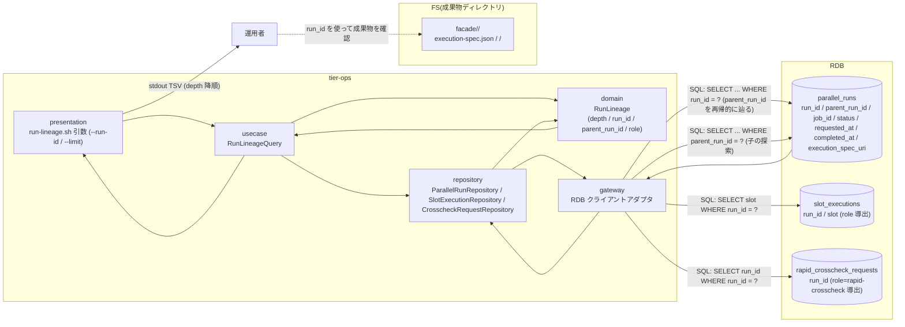
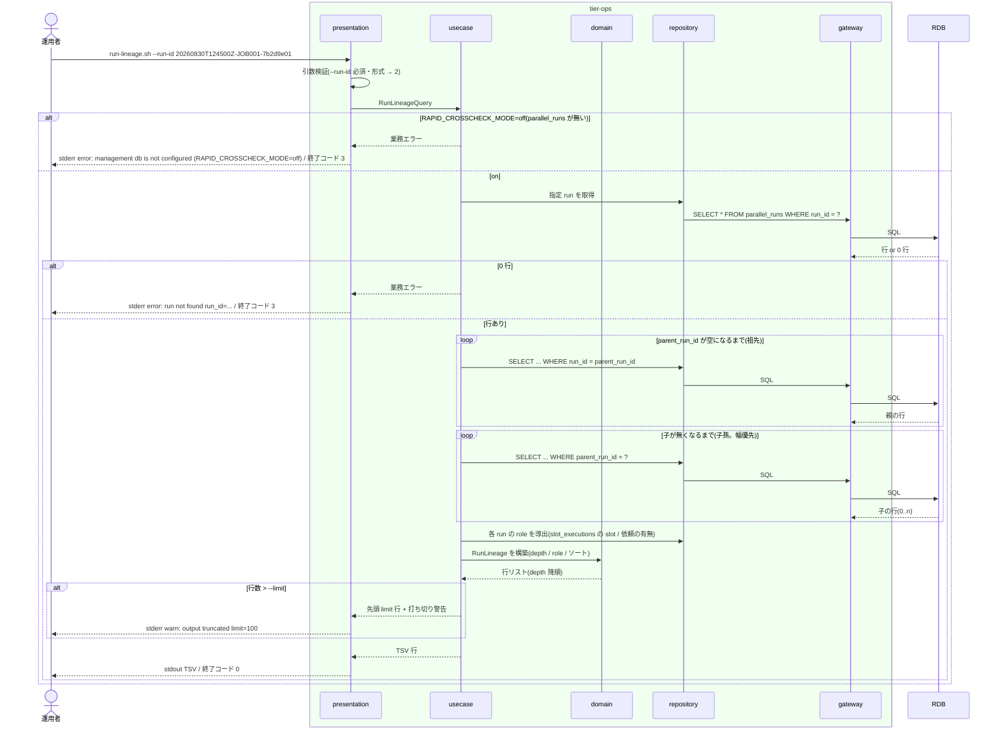

# リラン結果を parent_run_id で追跡する

## 概要

運用者が `run-lineage.sh --run-id <RUN_ID>` で、リランにより発行された run_id から `parallel_runs.parent_run_id` を元の実行(parent_run_id が空)まで数珠つなぎに辿り、系譜に含まれる各 run を TSV で参照する。指定 run_id を子に持つ新しいリランも系譜に含める。障害対応の経緯(中止 → リラン → 再リラン)と結果の対応関係を管理 DB と成果物ディレクトリ(`facade/<run_id>/`)で確認できるようにする。状態は変更しない。

## データフロー



| レイヤー | データモデル | 変換内容 |
|---------|------------|---------|
| ops presentation | 引数(`--run-id 20260830T124500Z-JOB001-7b2d9e01`, `--limit 100`) | 引数検証 → RunLineageQuery |
| ops usecase | RunLineageQuery(run_id / limit) | 祖先(parent_run_id を辿る)+ 子孫(parent_run_id = 自分 を辿る)を集めて RunLineage へ |
| ops domain | RunLineage(depth 0 = 元の実行、role = リラン対象 role または `-`) | depth 計算・role 導出・ソート(depth 降順 → requested_at 昇順) |
| ops repository / gateway | `parallel_runs` の SELECT(1 行ずつ辿る。深さで打ち切らない)+ `slot_executions` の slot 参照 | 行の取得 |
| ops presentation(出力) | TSV(`data-visualization.md` 3. の 8 列) | 1 行 1 run |

## 処理フロー



## バリエーション一覧

| バリエーション名 | 値 | 処理内容 | 適用 tier | 適用箇所 |
|----------------|---|---------|----------|---------|
| リラン対象 role | blue | TSV `role` 列。`slot_executions(run_id, slot='blue')` が存在し parent_run_id 非空の run | tier-ops | domain `derive_role` |
| リラン対象 role | green | 同上(`slot='green'`) | tier-ops | domain `derive_role` |
| リラン対象 role | rapid-crosscheck | parent_run_id 非空で `slot_executions` が無く `rapid_crosscheck_requests` がある run | tier-ops | domain `derive_role` |
| 再実行経路 | background 側リラン | parent_run_id を持つ run(depth ≥ 1)として系譜に現れる | tier-ops | run-lineage.sh |
| 再実行経路 | ジョブスケジューラ正規ジョブ再実行 | 新しい元の実行(parent_run_id 空、別 run_id)として現れ、系譜には含まれない | tier-ops | run-lineage.sh(対象外の説明) |
| Runner Result 成果物種別 | started-at.txt / stdout.log / stderr.log / exitcode.txt | 運用者が TSV の run_id から `facade/<run_id>/<role>/` を開いて確認する(コマンドは読まない) | tier-ops | 運用手順 |

## 分岐条件一覧

| 条件名 | 判定ルール | 適用 tier | 適用箇所 | BDD Scenario |
|--------|----------|----------|---------|-------------|
| リラン系譜の追跡 | 最新の run_id から parent_run_id を辿ると元の実行(parent_run_id が空)まで数珠つなぎに到達する。系譜の深さで打ち切らない(`--limit` は出力行数のみ) | tier-ops | usecase `collect_ancestors` / `collect_descendants` | 2 回リランした系譜を元の実行まで辿る |
| 実行履歴はジョブスケジューラの責務 | relay-gate は parallel_runs と成果物ディレクトリを参照するだけで、ジョブスケジューラの実行履歴・監査情報は出力に含めない | tier-ops | run-lineage.sh の出力列(parallel_runs 由来のみ) | 2 回リランした系譜を元の実行まで辿る |
| 速報クロスチェック有効判定 | RAPID_CROSSCHECK_MODE=off では parallel_runs が作成されないため系譜を追跡できず終了コード 3 | tier-ops | run-lineage.sh の管理 DB 接続前判定 | 管理 DB が無い構成では系譜を追跡できない |

## 計算ルール一覧

| 計算名 | 入力情報 | 計算式/ロジック | 出力情報 | 適用 tier |
|--------|---------|---------------|---------|----------|
| depth | parent_run_id の連鎖 | 元の実行(parent_run_id 空)を 0、親の depth + 1 | depth | tier-ops |
| role 導出 | parent_run_id、slot_executions.slot、rapid_crosscheck_requests の有無 | parent_run_id 空 → `-`。slot_executions に行あり → その slot(blue / green)。無く rapid_crosscheck_requests あり → `rapid-crosscheck`。いずれも無し → `-` | role | tier-ops |
| ソート | depth、requested_at | depth 降順 → 同 depth は requested_at 昇順 | 出力順 | tier-ops |
| 打ち切り | 行数、--limit | 行数 > limit なら先頭 limit 行を出し `warn: output truncated limit=N` | 出力行 | tier-ops |
| artifact_dir(--verbose) | run_id、RELAY_GATE_ARTIFACT_ROOT | `$RELAY_GATE_ARTIFACT_ROOT/facade/<run_id>`(`--verbose` 時に stderr `info: artifact_dir: ...` として 1 run 1 行) | 成果物ディレクトリ | tier-ops |

## 状態遷移一覧

| 状態モデル | 遷移元 | 遷移先 | トリガー | 事前条件 | 事後処理 | 適用 tier |
|-----------|--------|--------|---------|---------|---------|----------|
| 該当なし(参照系。状態.tsv にこの UC を遷移 UC とする行は無い) | — | — | — | — | — | — |

## 関連 RDRA モデル

| モデル種別 | 要素名 | 関連 |
|-----------|--------|------|
| 業務 | 実行復旧業務 | この UC が属する業務 |
| BUC | background 側リランフロー | この UC を含む BUC(アクティビティ: リラン系譜の追跡) |
| アクター | 運用者 | 系譜を参照する(受益者) |
| 情報 | 並行稼働実行(parallel_run) | run_id / parent_run_id / job_id / status / requested_at / completed_at を辿る |
| 情報 | リラン指示 | source_run_id → 新 run_id / parent_run_id の対応 |
| 情報 | Runner Result | 各 run の成果物ディレクトリ(`facade/<run_id>/<role>/`)を run_id で特定する |
| 情報 | 実行ログ | 参照の実行を記録する |
| 条件 | リラン系譜の追跡 | parent_run_id の数珠つなぎ |
| 条件 | 実行履歴はジョブスケジューラの責務 | 出力は parallel_runs と成果物の範囲に限る |
| 画面 | background-rerun 系譜追跡出力(→ CLI 出力: `run-lineage.sh` の stdout TSV) | 運用者が読む出力 |
| イベント | parent_run_id 系譜の参照 | 外部システム: 管理 DB(RDB) |
| 外部システム | 管理 DB(RDB) | parallel_runs の参照先 |

## 関連 USDM

| REQ ID | SPEC ID | 対応 BDD Scenario |
|---|---|---|
| REQ-009 | SPEC-009-01 | 2 回リランした系譜を元の実行まで辿る(SPEC-009-01) |

## E2E 完了条件(BDD)

### 正常系

```gherkin
Feature: リラン結果を parent_run_id で追跡する

  Scenario: 2 回リランした系譜を元の実行まで辿る(SPEC-009-01)
    Given RAPID_CROSSCHECK_MODE=on で parallel_runs に次の 3 行がある
      | run_id | parent_run_id | job_id | status | requested_at | completed_at |
      | 20260830T113000Z-JOB001-3f9a1c2e | - | JOB001 | ABORTED | 2026-08-30T11:30:00Z | 2026-08-30T12:40:00Z |
      | 20260830T124500Z-JOB001-7b2d9e01 | 20260830T113000Z-JOB001-3f9a1c2e | JOB001 | ABORTED | 2026-08-30T12:45:00Z | 2026-08-30T13:50:00Z |
      | 20260830T140000Z-JOB001-c4d5e6f7 | 20260830T124500Z-JOB001-7b2d9e01 | JOB001 | COMPLETED | 2026-08-30T14:00:00Z | 2026-08-30T15:10:00Z |
    And slot_executions に 2 つのリラン run_id の slot=green の行がある
    When 運用者が `run-lineage.sh --run-id 20260830T140000Z-JOB001-c4d5e6f7` を実行する
    Then 終了コード 0 で stdout に次の TSV が出る
      | depth | run_id | parent_run_id | job_id | role | run_status | requested_at | completed_at |
      | 2 | 20260830T140000Z-JOB001-c4d5e6f7 | 20260830T124500Z-JOB001-7b2d9e01 | JOB001 | green | COMPLETED | 2026-08-30T14:00:00Z | 2026-08-30T15:10:00Z |
      | 1 | 20260830T124500Z-JOB001-7b2d9e01 | 20260830T113000Z-JOB001-3f9a1c2e | JOB001 | green | ABORTED | 2026-08-30T12:45:00Z | 2026-08-30T13:50:00Z |
      | 0 | 20260830T113000Z-JOB001-3f9a1c2e | - | JOB001 | - | ABORTED | 2026-08-30T11:30:00Z | 2026-08-30T12:40:00Z |

  Scenario: 途中の run_id を指定しても系譜全体が出る
    Given 上記 3 行の parallel_runs がある
    When 運用者が `run-lineage.sh --run-id 20260830T124500Z-JOB001-7b2d9e01` を実行する
    Then 終了コード 0 で stdout のデータ行は 3 行で、1 行目の run_id が 20260830T140000Z-JOB001-c4d5e6f7、3 行目が 20260830T113000Z-JOB001-3f9a1c2e である

  Scenario: 速報比較依頼だけを再作成した run は role=rapid-crosscheck で出る
    Given parallel_runs に run_id=20260830T130000Z-JOB001-a1b2c3d4 parent_run_id=20260830T113000Z-JOB001-3f9a1c2e があり slot_executions に同 run_id の行が無く rapid_crosscheck_requests に同 run_id の行がある
    When 運用者が `run-lineage.sh --run-id 20260830T130000Z-JOB001-a1b2c3d4` を実行する
    Then 終了コード 0 で stdout の 1 行目のデータ行の role 列が rapid-crosscheck である
```

### 異常系

```gherkin
  Scenario: 存在しない run_id
    When 運用者が `run-lineage.sh --run-id 20260830T000000Z-JOB999-00000000` を実行する
    Then 終了コード 3 で stderr に `error: run not found run_id=20260830T000000Z-JOB999-00000000` が出る

  Scenario: 管理 DB が無い構成では系譜を追跡できない
    Given RAPID_CROSSCHECK_MODE=off である
    When 運用者が `run-lineage.sh --run-id 20260830T113000Z-JOB001-3f9a1c2e` を実行する
    Then 終了コード 3 で stderr に `error: management db is not configured (RAPID_CROSSCHECK_MODE=off)` が出る
```

## ティア別仕様

- [tier-ops](tier-ops.md)(`run-lineage.sh` の系譜参照)

### 統合契約

- [CLI コマンド契約](../../../_cross-cutting/api/cli-command-contract.yaml)
- [AsyncAPI Spec](../../../_cross-cutting/api/asyncapi.yaml)(この UC は publish / subscribe しない)
