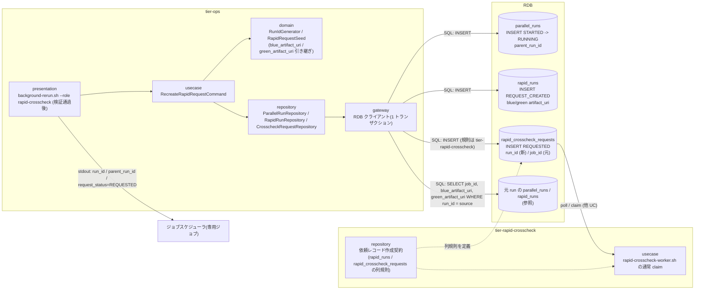
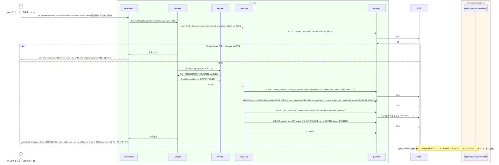

# 速報比較依頼だけを新規作成する

## 概要

事前検証(UC「リラン対象を検証する」)を通過した `--role rapid-crosscheck` のリランについて、background-rerun が業務ジョブを再実行せず、新しい run_id を発行して `parallel_runs`(parent_run_id = 元 run_id)、`rapid_runs`(元 run の blue / green の成果物 URI を引き継ぎ、完了状況は BOTH_SUCCEEDED → REQUEST_CREATED)、`rapid_crosscheck_requests`(新 run_id 主キー、job_id は元 run のもの、REQUESTED)を 1 トランザクションで作成する。作成後は速報クロスチェック worker の通常の claim と比較実行に委ねる。本 UC で作られた run は `execution-spec.json` を持たないが、前段 UC「リラン対象を検証する」は `--role rapid-crosscheck` で `execution-spec.json` を要求せず依頼レコードだけで元実行を特定するため、この run を再度 `--source-run-id` に指定して数珠つなぎにリランできる(parent_run_id は直前のリラン元を指す)。tier-rapid-crosscheck 側は依頼レコードの作成契約(rapid 側テーブルへの書き込み規則)を担う。

## データフロー



| レイヤー | データモデル | 変換内容 |
|---------|------------|---------|
| ops domain | RunIdGenerator(job_id は元 run の parallel_runs.job_id) | 新 run_id |
| ops domain | RapidRequestSeed: 元 rapid_runs の blue_artifact_uri / green_artifact_uri、元 parallel_runs の job_id / parameters | 新 rapid_runs / rapid_crosscheck_requests の INSERT 値 |
| ops repository / gateway | parallel_runs INSERT(STARTED)→ rapid_runs INSERT(completion_status=REQUEST_CREATED、blue_status=green_status=SUCCEEDED)→ rapid_crosscheck_requests INSERT(REQUESTED)→ parallel_runs UPDATE(RUNNING)。1 トランザクション | 依頼の再作成 |
| rapid repository | 依頼レコード作成契約: 主キー run_id 一意、status=REQUESTED、worker_id / lease_until NULL、requested_at=now | rapid 側テーブルへ書く規則(dispatcher の作成と同じ形) |
| ops presentation(出力) | `role=rapid-crosscheck`、`request_status=REQUESTED`、`blue_artifact_uri:`、`green_artifact_uri:`、`run_id=`、`parent_run_id=` | 追跡の起点を渡す |

## 処理フロー



## バリエーション一覧

| バリエーション名 | 値 | 処理内容 | 適用 tier | 適用箇所 |
|----------------|---|---------|----------|---------|
| リラン対象 role | rapid-crosscheck | 業務ジョブを再実行せず依頼だけを新規作成 | tier-ops | background-rerun.sh |
| 再実行経路 | background 側リラン | 速報比較依頼の再作成経路 | tier-ops | background-rerun.sh |
| クロスチェック依頼状態 | REQUESTED | 新依頼の初期状態 | tier-ops / tier-rapid-crosscheck | rapid_crosscheck_requests INSERT |
| クロスチェック依頼状態 | SUCCEEDED / FAILED / ABORTED | 元依頼の状態(事前検証で終端であること) | tier-ops | 前段 UC |
| 速報クロスチェックのプロセス役割 | runner(dispatcher) | 通常時の依頼作成者。本 UC は dispatcher と同じ列規則で作成する | tier-rapid-crosscheck | 依頼レコード作成契約 |
| 速報クロスチェックのプロセス役割 | worker | 作成後の claim / 比較実行を担う(他 UC) | tier-rapid-crosscheck | rapid-crosscheck-worker.sh |
| クロスチェック種別 | 速報クロスチェック | 本 UC の対象。確報は対象外(正規ジョブで再実行) | tier-ops | background-rerun.sh |
| 比較種別 | ジョブ単位比較 | 新依頼も元 run の job_id の比較定義でジョブ単位比較される(他 UC) | tier-rapid-crosscheck | worker |
| 速報クロスチェックモード | on | 管理 DB がある前提(off では元依頼が存在せず前段 UC で拒否) | tier-ops | 前段 UC |

## 分岐条件一覧

| 条件名 | 判定ルール | 適用 tier | 適用箇所 | BDD Scenario |
|--------|----------|----------|---------|-------------|
| リラン事前検証 | `--role rapid-crosscheck` は元 run の速報比較依頼が SUCCEEDED / FAILED / ABORTED のときだけ、業務ジョブを再実行せず比較依頼だけを新規作成する(前段 UC で判定済み) | tier-ops | 前段 UC の domain `is_rerunnable` | ABORTED の速報比較依頼を新しい依頼として再作成する |
| リラン系譜の追跡 | 新 run の parent_run_id に元 run_id(直前のリラン元)を設定する。元 run が本 UC で作られた run でも成立する(前段 UC が execution-spec.json を要求しないため。成果物 URI と execution_spec_uri は元 run の値をそのまま複製するので、連鎖しても最初の実行の成果物を比較する) | tier-ops | parallel_runs INSERT | ABORTED の速報比較依頼を新しい依頼として再作成する / 再作成した run をさらに再作成して系譜を伸ばす |
| 依頼状態遷移規則 | 依頼は REQUESTED で作成する。worker_id / lease_until は NULL。以降の遷移は worker が行う | tier-ops / tier-rapid-crosscheck | rapid_crosscheck_requests INSERT の列規則 | 作成した依頼を worker が claim できる |
| 比較依頼の一意性 | 1 run_id に 1 件。新 run_id の主キーで INSERT し、重複は DB の主キー制約で拒否する(元 run_id の依頼は変更しない) | tier-ops / tier-rapid-crosscheck | rapid_crosscheck_requests の PK | 元 run の依頼は変更されない |
| 速報クロスチェック有効判定 | 依頼作成は管理 DB が必要。off は前段 UC が管理 DB 接続前に `error: management db is not configured (RAPID_CROSSCHECK_MODE=off) run_id=... role=rapid-crosscheck` で終了コード 3 として拒否 | tier-ops | 前段 UC | (前段 UC) |

## 計算ルール一覧

| 計算名 | 入力情報 | 計算式/ロジック | 出力情報 | 適用 tier |
|--------|---------|---------------|---------|----------|
| 新 run_id | now(UTC。`RELAY_GATE_NOW` 設定時はその値)、元 parallel_runs.job_id、乱数 | `{yyyymmddThhmmssZ}-{job_id}-{8 hex}`。既存の run_id と衝突すれば取り直す(最大 3 回)。末尾 8 桁は乱数のため BDD の Then は形式 `^[0-9]{8}T[0-9]{6}Z-{job_id}-[0-9a-f]{8}$` と時刻部で検証し、固定値を要求しない | run_id | tier-ops |
| 成果物 URI の引き継ぎ | 元 rapid_runs.blue_artifact_uri / green_artifact_uri | そのまま新 rapid_runs に複製(`file://` 付き URI。background-rerun 自身は新 run_id の成果物ディレクトリを作らない。比較実行時に worker が `facade/<新 run_id>/rapid-crosscheck/` を作る) | blue_artifact_uri / green_artifact_uri | tier-ops |
| 指示日時 | now(UTC。`RELAY_GATE_NOW` 設定時はその値) | 情報「リラン指示」の属性「指示日時」= 新 run の `parallel_runs.requested_at` および実行ログ行(`INFO rapid request recreated`)の UTC 時刻列 | requested_at / 実行ログ | tier-ops |
| 完了状況 | — | blue_status = green_status = SUCCEEDED、completion_status = REQUEST_CREATED(両系成功 → 比較依頼作成済みを 1 トランザクションで確定) | rapid_runs | tier-ops |
| execution_spec_uri | 元 parallel_runs.execution_spec_uri | そのまま複製(新 spec は作らない。業務ジョブを再実行しないため) | parallel_runs.execution_spec_uri | tier-ops |

## 状態遷移一覧

| 状態モデル | 遷移元 | 遷移先 | トリガー | 事前条件 | 事後処理 | 適用 tier |
|-----------|--------|--------|---------|---------|---------|----------|
| クロスチェック依頼 | `[*]` | REQUESTED | background-rerun(--role rapid-crosscheck)が rapid_crosscheck_requests を新 run_id で作成 | 元依頼が終端、元 run の両系成果物 URI が存在 | worker の通常 claim に委ねる | tier-ops / tier-rapid-crosscheck |
| 並行稼働実行 | `[*]` | STARTED | 依頼再作成用に新 run_id の parallel_runs を作成 | 事前検証通過 | parent_run_id = 元 run_id | tier-ops |
| 並行稼働実行 | STARTED | RUNNING | 速報比較依頼を REQUESTED で作成した | 依頼 INSERT 成功(同一トランザクション) | 以降の追跡は worker に委ねる(仮採用: parallel_runs の COMPLETED 遷移は依頼の終端時に worker が行うか未定義。rdra-feedback 対象) | tier-ops |

運用注記(UC「実行を ABORTED へ遷移させる」と共通):

- 本 UC で作成した parallel_runs は foreground 中継が無いため COMPLETED への遷移が未定義であり、**現状は依頼が SUCCEEDED / FAILED になっても RUNNING のまま残る**(`run-lineage.sh` に RUNNING として現れる)。`abort-rapid-crosscheck.sh` で依頼を中止した場合に限り、併更新(`WHERE status IN ('STARTED','RUNNING')`)で ABORTED になる。終端規則の確定は rdra-feedback で扱う
- 成果物ディレクトリ: background-rerun 自身は `facade/<新 run_id>/` を作らない。比較実行時に worker が `facade/<新 run_id>/rapid-crosscheck/{started-at.txt, stdout.log, stderr.log, exitcode.txt}` を作る(他 UC「比較ツールでジョブ単位比較を実行して結果を登録する」)。この run ディレクトリは `execution-spec.json` と blue / green 節を持たない。hang-detector(他 UC「background 実行の経過時間と終了状態を判定する」tier-ops.md 走査手順 1)は `<role>/started-at.txt`(role ∈ {blue, green})が無い run ディレクトリを `execution-spec.json` を読まずに飛ばすため、新 run_id の slot 監視は発生せず、依頼の監視は管理 DB の依頼走査(on)で行われる

## 関連 RDRA モデル

| モデル種別 | 要素名 | 関連 |
|-----------|--------|------|
| 業務 | 実行復旧業務 | この UC が属する業務 |
| BUC | background 側リランフロー | この UC を含む BUC(アクティビティ: 速報比較依頼の再作成) |
| アクター | 運用者 | 専用ジョブを起動し新 run_id を受け取る(受益者) |
| 情報 | リラン指示 | source_run_id / role=rapid-crosscheck / 新 run_id / parent_run_id |
| 情報 | 速報比較依頼(rapid_crosscheck_request) | 新 run_id で REQUESTED を作成 |
| 情報 | 並行稼働実行(parallel_run) | 新 run の作成(parent_run_id) |
| 情報 | Runner Result | 元 run の blue / green 成果物を比較対象として引き継ぐ |
| 情報 | 速報実行(rapid_run) | BUC.tsv 上の紐づけは無いが、成果物 URI の引き継ぎ先として作成する(依頼と 1:1 の整合を保つため) |
| 状態 | クロスチェック依頼 | 初期 → REQUESTED |
| 状態 | 並行稼働実行 | 初期 → STARTED → RUNNING |
| 条件 | リラン事前検証 | rapid-crosscheck は依頼だけを新規作成 |
| 条件 | リラン系譜の追跡 | parent_run_id の設定 |
| 条件 | 依頼状態遷移規則 | REQUESTED で作成 |
| 条件 | 比較依頼の一意性 | 1 run_id に 1 件(主キー制約) |
| 条件 | 速報クロスチェック有効判定 | off では依頼が存在せず前段 UC で拒否(管理 DB 前提) |
| バリエーション | 速報クロスチェックモード | on のみ本 UC に到達する |
| 画面 | background-rerun 比較依頼再作成出力(→ CLI 出力: `run_id=` / `parent_run_id=` / `request_status=REQUESTED`) | 運用者が読む出力 |
| イベント | 速報比較依頼の再作成 | 外部システム: 管理 DB(RDB) |
| 外部システム | 管理 DB(RDB) | 依頼レコードの作成先 |
| 外部システム | ジョブスケジューラ | 専用ジョブの起動元 |

## 関連 USDM

| REQ ID | SPEC ID | 対応 BDD Scenario |
|---|---|---|
| REQ-009 | SPEC-009-03 | ABORTED の速報比較依頼を新しい依頼として再作成する(SPEC-009-03) |
| REQ-009 | SPEC-009-01 | ABORTED の速報比較依頼を新しい依頼として再作成する(SPEC-009-03)(parent_run_id の設定)/ 再作成した run をさらに再作成して系譜を伸ばす(SPEC-009-01) |

## E2E 完了条件(BDD)

### 正常系

```gherkin
Feature: 速報比較依頼だけを新規作成する

  Scenario: ABORTED の速報比較依頼を新しい依頼として再作成する(SPEC-009-03)
    Given RAPID_CROSSCHECK_MODE=on で RELAY_GATE_NOW=2026-08-30T13:00:00Z であり、run_id=20260830T113000Z-JOB001-3f9a1c2e(R1)の rapid_crosscheck_requests が status=ABORTED、rapid_runs の blue_artifact_uri=file:///var/relay-gate/facade/20260830T113000Z-JOB001-3f9a1c2e/blue green_artifact_uri=file:///var/relay-gate/facade/20260830T113000Z-JOB001-3f9a1c2e/green、parallel_runs.job_id=JOB001 である
    When ジョブスケジューラが `background-rerun.sh --source-run-id 20260830T113000Z-JOB001-3f9a1c2e --role rapid-crosscheck` を起動する
    Then 終了コード 0 で stdout の最終 2 行が `run_id={新 run_id}` と `parent_run_id=20260830T113000Z-JOB001-3f9a1c2e` であり、{新 run_id}(R2)は正規表現 `^20260830T130000Z-JOB001-[0-9a-f]{8}$` に一致し、それより前に `request_status=REQUESTED` がある
    And rapid_crosscheck_requests に run_id={新 run_id} job_id=JOB001 status=REQUESTED worker_id=NULL lease_until=NULL requested_at=2026-08-30T13:00:00Z がある
    And rapid_runs に run_id={新 run_id} blue_artifact_uri / green_artifact_uri が R1 と同じ値で completion_status=REQUEST_CREATED がある
    And parallel_runs に run_id={新 run_id} parent_run_id=20260830T113000Z-JOB001-3f9a1c2e status=RUNNING がある
    And blue / green の runner は起動されず、background-rerun.sh の終了直後には facade/{新 run_id}/ ディレクトリが存在しない(比較実行時に worker が facade/{新 run_id}/rapid-crosscheck/ を作る)

  Scenario: 作成した依頼を worker が claim できる
    Given 上記で run_id={新 run_id}(R2)の依頼が REQUESTED で作成された
    When `rapid-crosscheck-worker.sh --once --worker-id worker-01` を実行する
    Then 同依頼が worker-01 により CLAIMED → RUNNING と遷移し、JOB001 の比較定義で元 run の blue / green 成果物を比較する

  Scenario: 元 run の依頼は変更されない
    Given R1 の rapid_crosscheck_requests が status=FAILED exit_code=6 である
    When `background-rerun.sh --source-run-id 20260830T113000Z-JOB001-3f9a1c2e --role rapid-crosscheck` を起動する
    Then R1 の rapid_crosscheck_requests は status=FAILED exit_code=6 のままで、新 run_id の依頼が別に 1 件増えている

  Scenario: 再作成した run をさらに再作成して系譜を伸ばす(SPEC-009-01)
    Given RAPID_CROSSCHECK_MODE=on で {R2}(上記シナリオで再作成された新 run_id。`^20260830T130000Z-JOB001-[0-9a-f]{8}$` に一致)は R1 から `--role rapid-crosscheck` で再作成された run であり、facade/{R2}/execution-spec.json は存在しない
    And R2 の rapid_crosscheck_requests が status=FAILED、rapid_runs の blue_artifact_uri / green_artifact_uri が R1 と同じ値、parallel_runs.parent_run_id=20260830T113000Z-JOB001-3f9a1c2e である
    And RELAY_GATE_NOW=2026-08-30T13:30:00Z である
    When ジョブスケジューラが `background-rerun.sh --source-run-id {R2} --role rapid-crosscheck` を起動する
    Then 終了コード 0 で stdout の最終行が `parent_run_id={R2}` であり、最終 2 行目の `run_id={R3}` は `^20260830T133000Z-JOB001-[0-9a-f]{8}$` に一致する
    And 新 run_id(R3)の parallel_runs.parent_run_id が {R2}、rapid_runs の blue_artifact_uri / green_artifact_uri が R1 と同じ値、execution_spec_uri が R2(= R1)と同じ値である
    And `run-lineage.sh --run-id {R3}` の depth が R3=2、R2=1、R1=0 で出る
```

### 異常系

```gherkin
  Scenario: 元 run の成果物 URI が無い
    Given R1 の rapid_runs の green_artifact_uri が NULL である(green が完了通知を送る前に中止された)
    When `background-rerun.sh --source-run-id 20260830T113000Z-JOB001-3f9a1c2e --role rapid-crosscheck` を起動する
    Then 終了コード 3 で stderr に `error: source artifacts not found run_id=20260830T113000Z-JOB001-3f9a1c2e role=rapid-crosscheck missing=green_artifact_uri` が出る
    And 新しいレコードは作成されない

  Scenario: 依頼 INSERT の失敗でトランザクションを戻す
    Given 管理 DB が rapid_crosscheck_requests への INSERT を拒否する
    When `background-rerun.sh --source-run-id 20260830T113000Z-JOB001-3f9a1c2e --role rapid-crosscheck` を起動する
    Then 終了コード 6 で stderr に `error: management db insert failed table=rapid_crosscheck_requests run_id=...` が出る
    And parallel_runs / rapid_runs にも新 run_id の行は残らない
```

## ティア別仕様

- [tier-ops](tier-ops.md)(`background-rerun.sh --role rapid-crosscheck` の依頼再作成)
- [tier-rapid-crosscheck](tier-rapid-crosscheck.md)(依頼レコードの作成契約)

### 統合契約

- [CLI コマンド契約](../../../_cross-cutting/api/cli-command-contract.yaml)
- [AsyncAPI Spec](../../../_cross-cutting/api/asyncapi.yaml)(`rapid-crosscheck-requests` チャネルへ publish)
