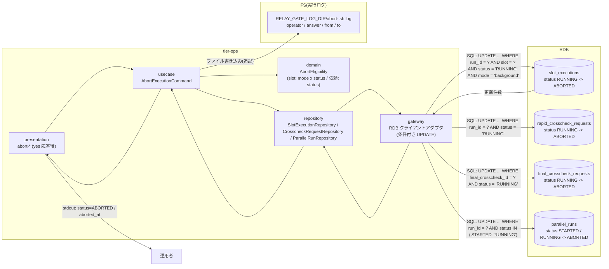
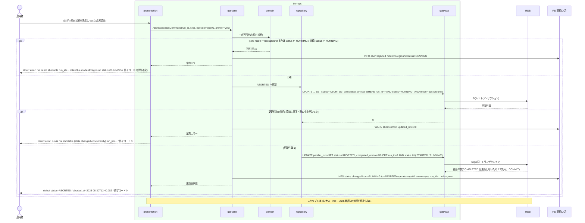

# 実行を ABORTED へ遷移させる

## 概要

停止確認に `yes` と応答されたとき(UC「現在状態を確認して停止確認に応答する」の後半)、`abort-blue.sh` / `abort-green.sh` は background かつ RUNNING の slot 実行を、`abort-rapid-crosscheck.sh` / `abort-final-crosscheck.sh` は RUNNING の比較依頼を、条件付き UPDATE で ABORTED へ更新し、並行稼働実行(parallel_run)が STARTED / RUNNING なら併せて ABORTED にする(COMPLETED は変更しない。更新 0 件で可)。可否判定に合わない対象(foreground / off、RUNNING 以外)は状態を変更せず終了コード 3 で終了する。スクリプト自身はプロセスを停止せず、状態更新だけを行い二重実行を防ぐ。

## データフロー



| レイヤー | データモデル | 変換内容 |
|---------|------------|---------|
| ops presentation | yes 応答(または `--yes`) | AbortExecutionCommand(run_id / kind / operator / answer) |
| ops domain | AbortEligibility: slot は `mode = background AND status = RUNNING`、依頼は `status = RUNNING` | 可否判定表(純粋関数)。不可なら理由(mode / status)を返す |
| ops repository / gateway | 条件付き UPDATE(WHERE 句に現在状態を含める)+ parallel_runs の UPDATE(`status IN ('STARTED','RUNNING')` のみ) | 対象の更新件数 1 で成功、0 は競合・不可として終了コード 3。parallel_runs の更新件数は 0 でも可(COMPLETED は変更しない) |
| ops usecase | 実行ログ行(`operator= answer= run_id= role= from=RUNNING to=ABORTED`) | 監査用の記録(CLP-008) |
| ops presentation(出力) | `status=ABORTED`、`aborted_at={UTC}` | 更新後状態の提示 |

## 処理フロー



## バリエーション一覧

| バリエーション名 | 値 | 処理内容 | 適用 tier | 適用箇所 |
|----------------|---|---------|----------|---------|
| 中止対象種別 | background slot 実行 | `slot_executions` を `WHERE run_id = ? AND slot = ? AND status = 'RUNNING' AND mode = 'background'` で ABORTED | tier-ops | abort-blue.sh / abort-green.sh |
| 中止対象種別 | 速報比較依頼 | `rapid_crosscheck_requests` を `WHERE run_id = ? AND status = 'RUNNING'` で ABORTED | tier-ops | abort-rapid-crosscheck.sh |
| 中止対象種別 | 確報比較依頼 | `final_crosscheck_requests` を `WHERE final_crosscheck_id = ? AND status = 'RUNNING'` で ABORTED | tier-ops | abort-final-crosscheck.sh |
| slot 実行モード | background | 中止可(status = RUNNING のとき) | tier-ops | domain `is_slot_abortable` |
| slot 実行モード | foreground | 中止不可(ジョブスケジューラ側で扱う)。終了コード 3 | tier-ops | domain `is_slot_abortable` |
| slot 実行モード | off | 中止不可(slot 実行が存在しない)。終了コード 3 | tier-ops | domain `is_slot_abortable` |
| クロスチェック依頼状態 | RUNNING | 中止可 | tier-ops | domain `is_request_abortable` |
| クロスチェック依頼状態 | REQUESTED / CLAIMED / SUCCEEDED / FAILED / ABORTED | 中止不可(比較未開始または終端済み)。終了コード 3 | tier-ops | domain `is_request_abortable` |
| 実装スロット | blue / green | 対象 slot 列(`slot = ?`)をスクリプト名で確定 | tier-ops | abort-blue.sh / abort-green.sh |
| 停止確認応答 | yes | 本 UC の入口条件 | tier-ops | 前半 UC から引き継ぐ |
| クロスチェック種別 | 速報クロスチェック / 確報クロスチェック | テーブルとキー列が異なる(run_id / final_crosscheck_id) | tier-ops | abort-rapid-crosscheck.sh / abort-final-crosscheck.sh |

## 分岐条件一覧

| 条件名 | 判定ルール | 適用 tier | 適用箇所 | BDD Scenario |
|--------|----------|----------|---------|-------------|
| slot 中止可否判定 | 縦軸 mode(foreground / background / off)× 横軸 status(RUNNING / SUCCEEDED / FAILED / ABORTED)。`background × RUNNING` のみ可。他は状態を変更せず終了コード 3 | tier-ops | domain `is_slot_abortable`、gateway の UPDATE WHERE 句 | background かつ RUNNING の green を中止する / foreground の blue は中止できない |
| 依頼中止可否判定 | 依頼 status が `RUNNING` のみ可。REQUESTED / CLAIMED / SUCCEEDED / FAILED / ABORTED は状態を変更せず終了コード 3 | tier-ops | domain `is_request_abortable`、gateway の UPDATE WHERE 句 | RUNNING の速報比較依頼を中止する / SUCCEEDED の確報比較依頼は中止できない |
| 停止確認応答 | `yes` のときだけ本 UC を実行する。yes 以外は前半 UC で終了 | tier-ops | 前半 UC の `confirm_stop` | background かつ RUNNING の green を中止する |
| 依頼状態遷移規則 | 依頼は RUNNING → ABORTED のみ本 UC で遷移する(REQUESTED / CLAIMED からの遷移は無い) | tier-ops | domain `is_request_abortable` | RUNNING の速報比較依頼を中止する |
| 速報クロスチェック有効判定 | RAPID_CROSSCHECK_MODE=off では `slot_executions` / `rapid_crosscheck_requests` が無く状態更新先が無いため abort-blue / abort-green / abort-rapid-crosscheck は終了コード 3(仮採用 #7)。abort-final-crosscheck は RAPID_CROSSCHECK_MODE を参照しない(管理 DB 有無は final-crosscheck.env の FINAL_DB_CONN_REF のみ) | tier-ops | 前半 UC の管理 DB 接続前判定 | (前半 UC「管理 DB が無い構成では中止できない」「確報の中止は速報モードに依存しない」) |

## 計算ルール一覧

| 計算名 | 入力情報 | 計算式/ロジック | 出力情報 | 適用 tier |
|--------|---------|---------------|---------|----------|
| aborted_at | now(テスト時は `RELAY_GATE_NOW`) | UTC ISO 8601 秒精度。`slot_executions.completed_at` / 依頼の `completed_at` / `parallel_runs.completed_at` に同じ値を書き、stdout の `aborted_at` に出す。テスト専用環境変数 `RELAY_GATE_NOW`(ISO 8601 UTC。本番では未設定)が設定されていれば now() の代わりにその値を使う(BDD の絶対時刻はこの変数を Given に置いて固定する) | aborted_at | tier-ops |
| 更新件数判定 | UPDATE の影響行数 | 1 → 成功、0 → 中止不可または競合(終了コード 3)、2 以上 → 内部エラー(終了コード 6。主キー条件で起こり得ない) | 終了コード | tier-ops |
| 状態遷移の表示 | 旧状態・新状態 | 実行ログに `from=RUNNING to=ABORTED` | 実行ログ | tier-ops |

## 状態遷移一覧

| 状態モデル | 遷移元 | 遷移先 | トリガー | 事前条件 | 事後処理 | 適用 tier |
|-----------|--------|--------|---------|---------|---------|----------|
| slot 実行 | RUNNING | ABORTED | abort-blue.sh / abort-green.sh に yes と応答 | mode = background かつ status = RUNNING。運用者がプロセス停止を確認済み | completed_at 記録。parallel_run が STARTED / RUNNING なら併せて ABORTED。実行ログに operator / answer / from / to | tier-ops |
| クロスチェック依頼(速報) | RUNNING | ABORTED | abort-rapid-crosscheck.sh に yes と応答 | rapid_crosscheck_requests.status = RUNNING。worker プロセスの停止を確認済み | completed_at 記録。parallel_run が STARTED / RUNNING なら併せて ABORTED(通常 run は foreground 中継完了で COMPLETED 済みのため変更しない)。ハング検知はこの遷移を行わない | tier-ops |
| クロスチェック依頼(確報) | RUNNING | ABORTED | abort-final-crosscheck.sh に yes と応答 | final_crosscheck_requests.status = RUNNING | completed_at 記録。polling 中の final runner は終端状態として検知し保存済み結果を中継する(他 UC) | tier-ops |
| 並行稼働実行 | STARTED / RUNNING | ABORTED | slot 実行または速報比較依頼の明示中止 | parallel_runs.status が STARTED または RUNNING(STARTED → ABORTED は状態.tsv に無い遷移。起動直後の中止を取りこぼさないために含める。rdra-feedback 対象)。**COMPLETED の parallel_runs は更新しない(更新 0 件で可)** | completed_at 記録。リラン時は新 run_id の parent_run_id で追跡 | tier-ops |

運用注記(UC「速報比較依頼だけを新規作成する」と共通):

- 通常 run の速報比較依頼を `abort-rapid-crosscheck.sh` で中止するとき、parallel_runs は foreground 中継完了で既に COMPLETED になっているため併更新は 0 件となり、COMPLETED のまま残る
- `background-rerun.sh --role rapid-crosscheck` で作られた run の parallel_runs は foreground が無く COMPLETED 遷移が未定義のため、**現状は RUNNING のまま残る**。この run を `abort-rapid-crosscheck.sh` で中止した場合に限り、併更新で parallel_runs も ABORTED になる。終端規則の確定は rdra-feedback で扱う

## 関連 RDRA モデル

| モデル種別 | 要素名 | 関連 |
|-----------|--------|------|
| 業務 | 実行復旧業務 | この UC が属する業務 |
| BUC | 実行中止フロー | この UC を含む BUC(アクティビティ: 実行状態の中止更新) |
| アクター | 運用者 | 中止スクリプトに yes と応答する(受益者) |
| 情報 | 中止指示 | run_id・中止対象種別・停止確認応答・指示者・更新後状態(ABORTED) |
| 情報 | slot 実行 | RUNNING → ABORTED の更新対象 |
| 情報 | 速報比較依頼(rapid_crosscheck_request) | RUNNING → ABORTED の更新対象 |
| 情報 | 確報比較依頼(final_crosscheck_request) | RUNNING → ABORTED の更新対象 |
| 情報 | 並行稼働実行(parallel_run) | 併せて ABORTED にする |
| 情報 | 実行ログ | 指示者・応答・遷移を記録する |
| 状態 | slot 実行 | RUNNING → ABORTED |
| 状態 | クロスチェック依頼 | RUNNING → ABORTED |
| 状態 | 並行稼働実行 | STARTED / RUNNING → ABORTED(STARTED 起点は仮採用。rdra-feedback #4) |
| 条件 | slot 中止可否判定 | background × RUNNING のみ可 |
| 条件 | 依頼中止可否判定 | RUNNING のみ可 |
| 条件 | 停止確認応答 | yes のときだけ更新 |
| 条件 | 依頼状態遷移規則 | 停止確認後の中止で ABORTED |
| 条件 | 速報クロスチェック有効判定 | off では slot_executions が無く状態更新先が無いため終了コード 3 |
| 条件 | 監視は通知のみ | ハング検知はこの遷移を行わない(明示中止だけが ABORTED にする) |
| 画面 | abort 状態更新出力(→ CLI 出力: `status=ABORTED` / `aborted_at=`) | 運用者が読む出力 |
| イベント | 中止スクリプトの起動 | 外部システム: ジョブスケジューラ(`--yes` 付き非対話起動の経路) |
| イベント | ABORTED への状態更新 | 外部システム: 管理 DB(RDB) |
| 外部システム | ジョブスケジューラ | 非対話起動の経路(`--yes`) |
| 外部システム | 管理 DB(RDB) | 条件付き UPDATE の対象 |

## 関連 USDM

| REQ ID | SPEC ID | 対応 BDD Scenario |
|---|---|---|
| REQ-010 | SPEC-010-01 | background かつ RUNNING の green を中止する(SPEC-010-01 / SPEC-010-03) / foreground の blue は中止できない(SPEC-010-01) |
| REQ-010 | SPEC-010-02 | RUNNING の速報比較依頼を中止する(SPEC-010-02) / SUCCEEDED の確報比較依頼は中止できない(SPEC-010-02) |
| REQ-010 | SPEC-010-03 | background かつ RUNNING の green を中止する(SPEC-010-01 / SPEC-010-03)(プロセスを停止せず状態だけを更新する) |

## E2E 完了条件(BDD)

### 正常系

```gherkin
Feature: 実行を ABORTED へ遷移させる

  Scenario: background かつ RUNNING の green を中止する(SPEC-010-01 / SPEC-010-03)
    Given RAPID_CROSSCHECK_MODE=on で slot_executions に run_id=20260830T113000Z-JOB001-3f9a1c2e slot=green mode=background status=RUNNING pid=12345 がある
    And parallel_runs の同 run_id の status が RUNNING である
    And テスト専用環境変数 RELAY_GATE_NOW=2026-08-30T12:40:00Z が設定されている
    And 運用者 ops01 が PID 12345 の処理を実行先ホストで強制終了した
    When 運用者が `abort-green.sh --run-id 20260830T113000Z-JOB001-3f9a1c2e` を実行しプロンプトに `yes` と入力する
    Then 終了コード 0 で stdout の末尾 2 行が `status=ABORTED` と `aborted_at=2026-08-30T12:40:00Z` である
    And slot_executions の同行の status が ABORTED、completed_at が 2026-08-30T12:40:00Z である
    And parallel_runs の同 run_id の status が ABORTED である
    And 実行ログ abort-green.sh.log に `INFO status changed from=RUNNING to=ABORTED operator=ops01 answer=yes run_id=20260830T113000Z-JOB001-3f9a1c2e role=green` が残る
    And スクリプトは PID 12345 に対してシグナルを送っていない

  Scenario: RUNNING の速報比較依頼を中止する(SPEC-010-02)
    Given rapid_crosscheck_requests に run_id=20260830T113000Z-JOB001-3f9a1c2e status=RUNNING worker_id=worker-01 がある
    And parallel_runs の同 run_id の status が COMPLETED である(foreground 中継が完了済みの通常 run)
    When 運用者が `abort-rapid-crosscheck.sh --run-id 20260830T113000Z-JOB001-3f9a1c2e --yes` を実行する
    Then 終了コード 0 で stdout に `status=ABORTED` が出る
    And rapid_crosscheck_requests の同行の status が ABORTED であり、parallel_runs の同 run_id の status は COMPLETED のままである

  Scenario: リランで再作成した速報比較依頼を中止すると parallel_runs も ABORTED になる
    Given `background-rerun.sh --role rapid-crosscheck` で作成された run_id=20260830T130000Z-JOB001-a1b2c3d4 の rapid_crosscheck_requests が status=RUNNING で、parallel_runs の同 run_id の status が RUNNING である
    When 運用者が `abort-rapid-crosscheck.sh --run-id 20260830T130000Z-JOB001-a1b2c3d4 --yes` を実行する
    Then 終了コード 0 で rapid_crosscheck_requests の同行の status が ABORTED、parallel_runs の同 run_id の status が ABORTED である

  Scenario: RUNNING の確報比較依頼を中止する
    Given final_crosscheck_requests に final_crosscheck_id=20260830T020000Z-final-1a2b3c4d status=RUNNING がある
    When 運用者が `abort-final-crosscheck.sh --run-id 20260830T020000Z-final-1a2b3c4d --yes` を実行する
    Then 終了コード 0 で final_crosscheck_requests の同行の status が ABORTED である
```

### 異常系

```gherkin
  Scenario: foreground の blue は中止できない(SPEC-010-01)
    Given slot_executions に run_id=20260830T113000Z-JOB001-3f9a1c2e slot=blue mode=foreground status=RUNNING がある
    When 運用者が `abort-blue.sh --run-id 20260830T113000Z-JOB001-3f9a1c2e --yes` を実行する
    Then 終了コード 3 で stderr に `error: run is not abortable run_id=20260830T113000Z-JOB001-3f9a1c2e role=blue mode=foreground status=RUNNING` が出る
    And slot_executions の status は RUNNING のまま、parallel_runs の status も変わらない

  Scenario: SUCCEEDED の確報比較依頼は中止できない(SPEC-010-02)
    Given final_crosscheck_requests に final_crosscheck_id=20260830T020000Z-final-1a2b3c4d status=SUCCEEDED がある
    When 運用者が `abort-final-crosscheck.sh --run-id 20260830T020000Z-final-1a2b3c4d --yes` を実行する
    Then 終了コード 3 で stderr に `error: request is not abortable run_id=20260830T020000Z-final-1a2b3c4d role=final-crosscheck status=SUCCEEDED` が出る
    And status は SUCCEEDED のままである

  Scenario: 既に ABORTED の slot への再実行は中止不可として拒否する
    Given slot_executions に run_id=20260830T113000Z-JOB001-3f9a1c2e slot=green mode=background status=ABORTED がある
    When 運用者が `abort-green.sh --run-id 20260830T113000Z-JOB001-3f9a1c2e --yes` を再実行する
    Then 終了コード 3 で stderr に `error: run is not abortable run_id=20260830T113000Z-JOB001-3f9a1c2e role=green mode=background status=ABORTED` が出る
    And status は ABORTED のまま、completed_at も変わらない

  Scenario: 直前に完了した slot への中止は競合として拒否する
    Given slot_executions に run_id=20260830T113000Z-JOB001-3f9a1c2e slot=green mode=background status=RUNNING がある
    And 現在状態の表示後、応答入力の前に runner が exitcode.txt を出力し status が SUCCEEDED に変わった
    When 運用者がプロンプトに `yes` と入力する
    Then 条件付き UPDATE の更新件数が 0 で終了コード 3、stderr に `error: run is not abortable (state changed concurrently) run_id=20260830T113000Z-JOB001-3f9a1c2e role=green` が出る
    And status は SUCCEEDED のままである
```

## ティア別仕様

- [tier-ops](tier-ops.md)(4 スクリプトそれぞれの対象テーブルと条件付き UPDATE)

### 統合契約

- [CLI コマンド契約](../../../_cross-cutting/api/cli-command-contract.yaml)
- [AsyncAPI Spec](../../../_cross-cutting/api/asyncapi.yaml)(この UC は publish / subscribe しない)
