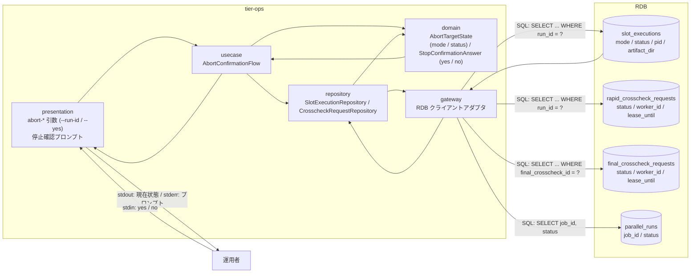
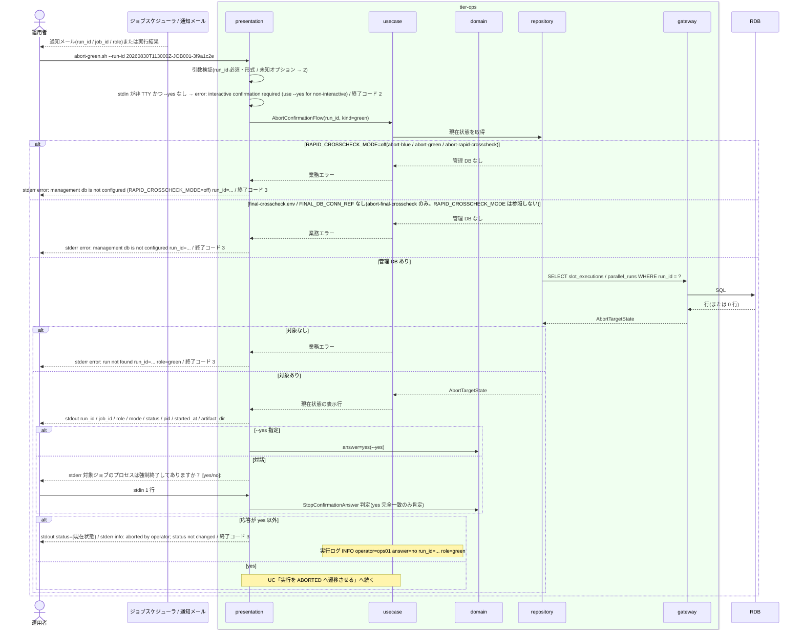

# 現在状態を確認して停止確認に応答する

## 概要

運用者が通知メールやジョブスケジューラの実行結果から中止対象の run_id を特定し、`abort-blue.sh` / `abort-green.sh` / `abort-rapid-crosscheck.sh` / `abort-final-crosscheck.sh` を `--run-id` 付きで起動する。スクリプトは対象の現在状態(slot 実行の mode / status / PID / 成果物ディレクトリ、または依頼の status / worker_id / lease_until)を plain 形式で表示し、「対象ジョブのプロセスは強制終了してありますか？ [yes/no]」を stdin から読む。運用者はプロセス・Pod・SSH 接続先の処理を自身で強制終了したことを確認して `yes` または yes 以外で応答する。本 UC は 4 スクリプト共通の前半(状態表示と対話確認)であり、`yes` 以降の状態更新は UC「実行を ABORTED へ遷移させる」が担う。

## データフロー



| レイヤー | データモデル | 変換内容 |
|---------|------------|---------|
| ops presentation | 引数(`--run-id 20260830T113000Z-JOB001-3f9a1c2e`, `--yes`) | 引数検証 → AbortConfirmationFlow。stdin の TTY 判定 |
| ops usecase | AbortConfirmationFlow(run_id / target kind) | 対象種別(blue / green / rapid-crosscheck / final-crosscheck)に応じた状態取得 → 表示行 → 応答の取得 |
| ops domain | AbortTargetState(mode / status / pid / artifact_dir または status / worker_id / lease_until)、StopConfirmationAnswer(`yes` 完全一致のみ肯定) | 応答判定は純粋関数 |
| ops repository / gateway | `slot_executions` / `rapid_crosscheck_requests` / `final_crosscheck_requests` + `parallel_runs` の SELECT | 現在状態の取得(更新しない) |
| ops presentation(出力) | stdout `key=value`(固定順)、stderr プロンプト | 現在状態の提示。応答が `yes` なら後半 UC へ、それ以外は `status={現在状態}` を出して終了コード 3 |

## 処理フロー



## バリエーション一覧

| バリエーション名 | 値 | 処理内容 | 適用 tier | 適用箇所 |
|----------------|---|---------|----------|---------|
| 中止対象種別 | background slot 実行 | `abort-blue.sh` / `abort-green.sh`。`slot_executions` の mode / status / pid / artifact_dir を表示 | tier-ops | abort-blue.sh / abort-green.sh |
| 中止対象種別 | 速報比較依頼 | `abort-rapid-crosscheck.sh`。`rapid_crosscheck_requests` の status / worker_id / lease_until を表示 | tier-ops | abort-rapid-crosscheck.sh |
| 中止対象種別 | 確報比較依頼 | `abort-final-crosscheck.sh`。`final_crosscheck_requests` の status / worker_id / lease_until を表示 | tier-ops | abort-final-crosscheck.sh |
| 停止確認応答 | yes | 小文字完全一致のみ肯定。後半 UC(状態更新)へ進む | tier-ops | 4 スクリプト共通のプロンプト処理 |
| 停止確認応答 | no | `no`・空 Enter・`y`・`YES` 等 yes 以外はすべて no 扱い。状態を変えず終了コード 3 | tier-ops | 同上 |
| run role(成果物ディレクトリ区分) | blue / green / rapid-crosscheck / final-crosscheck | 表示行の `role=` と実行ログの `role=`。スクリプト名で確定する | tier-ops | 4 スクリプト |
| クロスチェック依頼状態 | REQUESTED / CLAIMED / RUNNING / SUCCEEDED / FAILED / ABORTED | 依頼系の現在状態として `status=` に表示 | tier-ops | abort-rapid-crosscheck.sh / abort-final-crosscheck.sh |
| slot 実行モード | foreground / background / off | slot 系の現在状態として `mode=` に表示(可否判定は後半 UC) | tier-ops | abort-blue.sh / abort-green.sh |

## 分岐条件一覧

| 条件名 | 判定ルール | 適用 tier | 適用箇所 | BDD Scenario |
|--------|----------|----------|---------|-------------|
| 停止確認応答 | 現在状態を表示した後に「対象ジョブのプロセスは強制終了してありますか？ [yes/no]」を stderr へ出し stdin を 1 行読む。`yes`(完全一致)のみ肯定。それ以外は状態を変更せず終了コード 3。`--yes` は `yes` とみなしプロンプトを省略する。非 TTY で `--yes` なしは終了コード 2 | tier-ops | 4 スクリプト共通 presentation(`confirm_stop`)/ domain(`is_affirmative`) | no と答えると状態は変わらない / 非 TTY で --yes なし |
| CLI とメールによる提示 | 現在状態は stdout に `key=value` 固定順で出し、プロンプトは stderr に出す(stdout をパイプしても混ざらない)。UI 画面は提供しない | tier-ops | 4 スクリプト共通 presentation | 現在状態を表示して yes と答える |
| 速報クロスチェック有効判定 | RAPID_CROSSCHECK_MODE=off では `slot_executions` / `rapid_crosscheck_requests` が無く状態更新先が無いため、abort-blue / abort-green / abort-rapid-crosscheck は現在状態を表示せず終了コード 3(仮採用 #7)。abort-final-crosscheck は RAPID_CROSSCHECK_MODE を参照せず、`final-crosscheck.env` の FINAL_DB_CONN_REF の有無だけで管理 DB 有無を判定する(無ければ `error: management db is not configured run_id=...` で 3) | tier-ops | abort-blue.sh / abort-green.sh / abort-rapid-crosscheck.sh の管理 DB 接続前判定(abort-final-crosscheck.sh は final-crosscheck.env の読み取り) | 管理 DB が無い構成では中止できない / 確報の中止は速報モードに依存しない |

## 計算ルール一覧

| 計算名 | 入力情報 | 計算式/ロジック | 出力情報 | 適用 tier |
|--------|---------|---------------|---------|----------|
| 停止確認応答の判定 | stdin 1 行 | 末尾改行を除去した文字列が `yes` と完全一致なら肯定、それ以外(空・`y`・`YES`・`no`)は否定 | answer(yes / no) | tier-ops |
| 実行ログの answer 値 | `--yes` の有無、stdin | `--yes` なら `answer=yes(--yes)`、対話なら `answer=yes` / `answer=no` | 実行ログ | tier-ops |
| 指示者 | OS ユーザー名 | `operator=$(id -un)` | 実行ログ | tier-ops |

## 状態遷移一覧

| 状態モデル | 遷移元 | 遷移先 | トリガー | 事前条件 | 事後処理 | 適用 tier |
|-----------|--------|--------|---------|---------|---------|----------|
| 該当なし(本 UC は状態を変更しない。yes 応答後の遷移は UC「実行を ABORTED へ遷移させる」に載せる) | — | — | — | — | — | — |

## 関連 RDRA モデル

| モデル種別 | 要素名 | 関連 |
|-----------|--------|------|
| 業務 | 実行復旧業務 | この UC が属する業務 |
| BUC | 実行中止フロー | この UC を含む BUC(アクティビティ: プロセス停止の確認) |
| アクター | 運用者 | 現在状態を見て停止確認に応答する(受益者) |
| 情報 | 中止指示 | run_id(--run-id)・中止対象種別・表示した現在状態・停止確認応答・指示者・指示日時 |
| 情報 | slot 実行 | abort-blue / abort-green が表示する現在状態(mode / PID / 成果物ディレクトリ / 状態 / 開始時刻) |
| 情報 | 速報比較依頼(rapid_crosscheck_request) | abort-rapid-crosscheck が表示する現在状態(status / worker_id / lease_until) |
| 情報 | 確報比較依頼(final_crosscheck_request) | abort-final-crosscheck が表示する現在状態 |
| 情報 | 通知メール | 中止対象 run_id の特定元 |
| 条件 | 停止確認応答 | yes のときだけ後半へ進む |
| 条件 | CLI とメールによる提示 | stdout / stderr / 終了コードで提示 |
| 条件 | 速報クロスチェック有効判定 | off では管理 DB が無く現在状態を表示せず終了コード 3(abort-blue / abort-green / abort-rapid-crosscheck。abort-final-crosscheck は対象外) |
| 画面 | abort 現在状態確認出力(→ CLI 出力: 4 スクリプトの stdout `key=value` と stderr プロンプト) | 運用者が読む出力 |
| イベント | 中止対象 run_id の特定 | 外部システム: ジョブスケジューラ(実行結果)/ 通知メール |
| イベント | 実行先ホストのプロセス停止確認 | 外部システム: リモート実行ホスト(SSH)。運用者が自身で行う(スクリプトは停止しない) |
| 外部システム | ジョブスケジューラ | run_id の特定元(実行結果・実行履歴) |
| 外部システム | リモート実行ホスト(SSH) | 運用者がプロセスを強制終了する対象 |
| 外部システム | 管理 DB(RDB) | BUC.tsv 上の紐づけは後半 UC 側だが、現在状態の参照先として使用する |

## 関連 USDM

| REQ ID | SPEC ID | 対応 BDD Scenario |
|---|---|---|
| REQ-010 | SPEC-010-03 | 現在状態を表示して yes と答える(SPEC-010-03) / no と答えると状態は変わらない(SPEC-010-03) |

## E2E 完了条件(BDD)

### 正常系

```gherkin
Feature: 現在状態を確認して停止確認に応答する

  Scenario: 現在状態を表示して yes と答える(SPEC-010-03)
    Given RAPID_CROSSCHECK_MODE=on で slot_executions に run_id=20260830T113000Z-JOB001-3f9a1c2e slot=green mode=background status=RUNNING pid=12345 started_at=2026-08-30T11:30:05Z artifact_dir=/var/relay-gate/facade/20260830T113000Z-JOB001-3f9a1c2e/green がある
    And parallel_runs の同 run_id の job_id が JOB001 である
    And 運用者 ops01 が green の実行プロセスを実行先ホストで強制終了した
    When 運用者が TTY から `abort-green.sh --run-id 20260830T113000Z-JOB001-3f9a1c2e` を実行し、プロンプトに `yes` と入力する
    Then stdout の先頭 8 行が run_id=20260830T113000Z-JOB001-3f9a1c2e / job_id=JOB001 / role=green / mode=background / status=RUNNING / pid=12345 / started_at=2026-08-30T11:30:05Z / artifact_dir: /var/relay-gate/facade/20260830T113000Z-JOB001-3f9a1c2e/green である
    And stderr に `対象ジョブのプロセスは強制終了してありますか？ [yes/no]: ` が出る
    And UC「実行を ABORTED へ遷移させる」の処理へ進む
    And 実行ログ abort-green.sh.log に `operator=ops01 answer=yes run_id=20260830T113000Z-JOB001-3f9a1c2e role=green` を含む INFO 行が残る

  Scenario: 速報比較依頼の現在状態を表示して --yes で確認を省略する
    Given rapid_crosscheck_requests に run_id=20260830T113000Z-JOB001-3f9a1c2e job_id=JOB001 status=RUNNING worker_id=worker-01 lease_until=2026-08-30T12:10:00Z started_at=2026-08-30T11:46:00Z がある
    When ジョブスケジューラから非 TTY で `abort-rapid-crosscheck.sh --run-id 20260830T113000Z-JOB001-3f9a1c2e --yes` を実行する
    Then stdout の先頭 7 行が run_id=20260830T113000Z-JOB001-3f9a1c2e / job_id=JOB001 / role=rapid-crosscheck / status=RUNNING / worker_id=worker-01 / lease_until=2026-08-30T12:10:00Z / started_at=2026-08-30T11:46:00Z である
    And stderr にプロンプトは出ない
    And 実行ログに `answer=yes(--yes)` が残る
```

### 異常系

```gherkin
  Scenario: no と答えると状態は変わらない(SPEC-010-03)
    Given slot_executions に run_id=20260830T113000Z-JOB001-3f9a1c2e slot=green mode=background status=RUNNING started_at=2026-08-30T11:30:05Z がある
    When 運用者が TTY から `abort-green.sh --run-id 20260830T113000Z-JOB001-3f9a1c2e` を実行し、プロンプトに `no` と入力する
    Then 終了コード 3 で stdout の最終行が `status=RUNNING`、stderr に `info: aborted by operator; status not changed` が出る
    And slot_executions の status は RUNNING のままである

  Scenario: 非 TTY で --yes なし
    Given slot_executions に run_id=20260830T113000Z-JOB001-3f9a1c2e slot=green mode=background status=RUNNING started_at=2026-08-30T11:30:05Z がある
    When stdin を /dev/null にして `abort-green.sh --run-id 20260830T113000Z-JOB001-3f9a1c2e` を実行する
    Then 終了コード 2 で stderr に `error: interactive confirmation required (use --yes for non-interactive)` が出る
    And 状態は変更されない

  Scenario: 対象 run_id が存在しない
    When `abort-blue.sh --run-id 20260830T000000Z-JOB999-00000000` を実行する
    Then 終了コード 3 で stderr に `error: run not found run_id=20260830T000000Z-JOB999-00000000 role=blue` が出る

  Scenario: 管理 DB が無い構成では中止できない
    Given RAPID_CROSSCHECK_MODE=off である
    When `abort-green.sh --run-id 20260830T113000Z-JOB001-3f9a1c2e` を実行する
    Then 終了コード 3 で stderr に `error: management db is not configured (RAPID_CROSSCHECK_MODE=off) run_id=20260830T113000Z-JOB001-3f9a1c2e` が出る

  Scenario: 確報の中止は速報モードに依存しない
    Given RAPID_CROSSCHECK_MODE=off で final-crosscheck.env に FINAL_DB_CONN_REF が設定され、final_crosscheck_requests に final_crosscheck_id=20260830T020000Z-final-1a2b3c4d status=RUNNING がある
    When `abort-final-crosscheck.sh --run-id 20260830T020000Z-final-1a2b3c4d --yes` を実行する
    Then 終了コード 0 で stdout の先頭 4 行が run_id=20260830T020000Z-final-1a2b3c4d / job_id=- / role=final-crosscheck / status=RUNNING であり、stderr に `management db is not configured` は出ない
```

## ティア別仕様

- [tier-ops](tier-ops.md)(abort-* 4 スクリプト共通のコマンド契約: 引数・対話・終了コード)

### 統合契約

- [CLI コマンド契約](../../../_cross-cutting/api/cli-command-contract.yaml)
- [AsyncAPI Spec](../../../_cross-cutting/api/asyncapi.yaml)(この UC は publish / subscribe しない)
