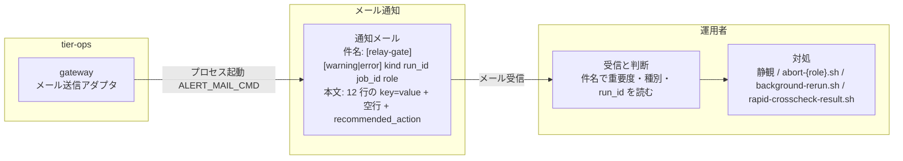
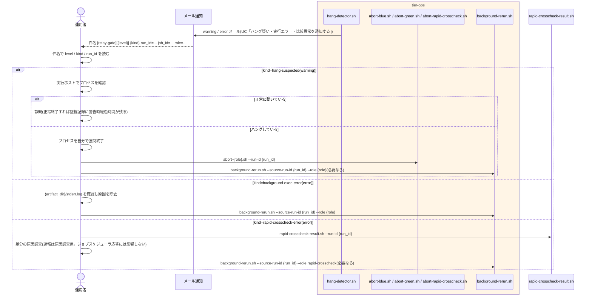

# background 異常の通知メールを受け取る

## 概要

運用者が、`hang-detector.sh` が送信した warning / error のメールでハング疑い・background 実行エラー・速報クロスチェック異常を受け取り、静観するか、実行中止(`abort-*`)・リラン(`background-rerun.sh`)で対処するかを判断する。ジョブスケジューラのジョブステータスに現れない background 異常を見落とさないための別経路の通知であり、この UC は運用者が「読む」UC である。メールの件名・本文の契約は ui-design.md「通知メール規約」を正とし、送信側の処理は UC「ハング疑い・実行エラー・比較異常を通知する」に定義する。

## データフロー



| レイヤー | データモデル | 変換内容 |
|---------|------------|---------|
| gateway(tier-ops) | HangAlertMail | UC「ハング疑い・実行エラー・比較異常を通知する」が送信 |
| メール通知 | 通知メール(件名 / 本文) | 運用者のメールクライアントに届く |
| 運用者 | 判断 | 件名の `[warning]` / `[error]` と `kind=` で静観 / 対処を決め、本文の `recommended_action` のコマンドに `run_id` をそのまま使う |

## 処理フロー



## バリエーション一覧

| バリエーション名 | 値 | 処理内容 | 適用 tier | 適用箇所 |
|----------------|---|---------|----------|---------|
| 通知レベル | warning | 件名 `[relay-gate][warning]`。静観候補(正常に動いていれば待つ) | tier-ops | 通知メール件名 |
| 通知レベル | error | 件名 `[relay-gate][error]`。対処必須(リラン・原因調査) | tier-ops | 通知メール件名 |
| ハング検知判定結果 | ハング疑い | kind=hang-suspected。推奨対処: プロセス確認 → 静観 or 停止 + `abort-{role}.sh` | tier-ops | 本文 recommended_action |
| ハング検知判定結果 | background 実行エラー | kind=background-exec-error。推奨対処: stderr.log 確認 → `background-rerun.sh --role {role}` | tier-ops | 本文 recommended_action |
| 速報クロスチェック監視判定 | 速報クロスチェック異常(FAILED / 比較 NG) | kind=rapid-crosscheck-error。推奨対処: `rapid-crosscheck-result.sh --run-id` で原因調査 | tier-ops | 本文 recommended_action |
| 速報クロスチェック監視判定 | ハング疑い(RUNNING 継続) | kind=hang-suspected role=rapid-crosscheck。推奨対処: worker 確認 → `abort-rapid-crosscheck.sh` | tier-ops | 本文 recommended_action |
| run role(成果物ディレクトリ区分) | blue / green / rapid-crosscheck | 件名の `role=`、推奨対処のコマンド名 | tier-ops | 通知メール |
| 中止対象種別 | background slot 実行 / 速報比較依頼 | 対処で使う abort コマンドの選択 | tier-ops | 運用手順 |
| リラン対象 role | blue / green / rapid-crosscheck | 対処で使う `background-rerun.sh --role` | tier-ops | 運用手順 |

## 分岐条件一覧

| 条件名 | 判定ルール | 適用 tier | 適用箇所 | BDD Scenario |
|--------|----------|----------|---------|-------------|
| 通知レベルの判定 | 件名の `[warning]` は静観可(ハング疑い)、`[error]` は対処要(実行エラー・比較異常)。運用者は件名だけで重要度と種別を判別する | tier-ops | 通知メール件名(UC「ハング疑い・実行エラー・比較異常を通知する」) | warning メールを受け取って静観する / error メールを受け取ってリランする |
| CLI とメールによる提示 | 通知はメールのみ。UI 画面は無い。メールの run_id をそのまま `abort-*` / `background-rerun.sh` / `rapid-crosscheck-result.sh` の引数に使える | tier-ops | 本文 `recommended_action` | error メールを受け取ってリランする |
| 監視は通知のみ | メールを受けても relay-gate は自動で中止・リランしない。対処は運用者の判断と操作で行う | tier-ops | 運用手順 | warning メールを受け取って静観する |

## 計算ルール一覧

| 計算名 | 入力情報 | 計算式/ロジック | 出力情報 | 適用 tier |
|--------|---------|---------------|---------|----------|
| 件名からの読み取り | 通知メール.件名 | `[relay-gate][{level}] {kind} run_id={run_id} job_id={job_id} role={role}` を固定順で読む | level / kind / run_id / job_id / role | tier-ops(読み替え) |
| 対処コマンドの選択 | kind、role、run_id | hang-suspected → `abort-{role}.sh --run-id {run_id}` / background-exec-error → `background-rerun.sh --source-run-id {run_id} --role {role}` / rapid-crosscheck-error → `rapid-crosscheck-result.sh --run-id {run_id}` | 実行するコマンド | tier-ops(読み替え) |

## 状態遷移一覧

| 状態モデル | 遷移元 | 遷移先 | トリガー | 事前条件 | 事後処理 | 適用 tier |
|-----------|--------|--------|---------|---------|---------|----------|
| 監視状態 | — | — | 該当なし(受信は状態を変えない。対処の遷移は実行中止フロー / background 側リランフローの UC に記載) | — | — | tier-ops |

## 関連 RDRA モデル

| モデル種別 | 要素名 | 関連 |
|-----------|--------|------|
| 業務 | 実行監視業務 | この UC が属する業務 |
| BUC | background 実行監視フロー | この UC を含む BUC |
| アクター | 運用者 | メールの受け手・判断者 |
| 情報 | 通知メール | 受け取るメール |
| 情報 | 監視記録 | 通知の根拠(alerted_at) |
| 条件 | 通知レベルの判定 | warning / error の読み方 |
| 条件 | CLI とメールによる提示 | メールのみで提示 |
| 条件 | 監視は通知のみ | 対処は運用者 |
| 画面 | hang-detect 通知確認出力(→ 通知メール) | 件名・本文 |
| イベント | background 異常メールの受信 | 運用者の受信 |
| 外部システム | メール通知 | 配送 |

## 関連 USDM

| REQ ID | SPEC ID | 対応 BDD Scenario |
|--------|---------|------------------|
| REQ-012 | SPEC-012-01 | warning メールを受け取って静観する(SPEC-012-01) |
| REQ-008 | SPEC-008-04 | warning メールを受け取って静観する(SPEC-012-01)(自動中止しない) |
| REQ-008 | SPEC-008-01 | error メールを受け取ってリランする(SPEC-008-01) |
| REQ-008 | SPEC-008-02 | 速報クロスチェック異常メールを受け取って原因調査する(SPEC-008-02) |

## E2E 完了条件(BDD)

### 正常系

```gherkin
Feature: background 異常の通知メールを受け取る

  Scenario: warning メールを受け取って静観する(SPEC-012-01)
    Given hang-detector.sh が件名 "[relay-gate][warning] hang-suspected run_id=20260830T113000Z-JOB001-3f9a1c2e job_id=JOB001 role=green" のメールを ops@example.invalid へ送った
    And 本文に "elapsed_minutes=74" "hang_detect_limit_minutes=60" "artifact_dir: /var/relay-gate/facade/20260830T113000Z-JOB001-3f9a1c2e/green" と "recommended_action: check the process on the execution host; if it is still running normally, wait. if it is hung, stop the process, then run: abort-green.sh --run-id 20260830T113000Z-JOB001-3f9a1c2e" がある
    When 運用者がメールを受け取り、実行ホストで green のプロセスが正常に動いていることを確認する
    Then 運用者は静観し、relay-gate 側では slot 実行の状態は RUNNING のまま、abort も rerun も自動では行われない
    And その後 green が exitcode.txt=0 で終了すると、監視記録に elapsed_minutes_at_alert=74 が残る

  Scenario: error メールを受け取ってリランする(SPEC-008-01)
    Given hang-detector.sh が件名 "[relay-gate][error] background-exec-error run_id=20260830T113000Z-JOB001-3f9a1c2e job_id=JOB001 role=green" のメールを送った
    And 本文に "exit_code=1" と "recommended_action: inspect /var/relay-gate/facade/20260830T113000Z-JOB001-3f9a1c2e/green/stderr.log; after fixing the cause, run the rerun job: background-rerun.sh --source-run-id 20260830T113000Z-JOB001-3f9a1c2e --role green" がある
    When 運用者が stderr.log で原因を確認して取り除き、ジョブスケジューラの background リラン専用ジョブから background-rerun.sh --source-run-id 20260830T113000Z-JOB001-3f9a1c2e --role green を起動する
    Then 新しい run_id で green が再実行され、parent_run_id に 20260830T113000Z-JOB001-3f9a1c2e が設定される

  Scenario: 速報クロスチェック異常メールを受け取って原因調査する(SPEC-008-02)
    Given hang-detector.sh が件名 "[relay-gate][error] rapid-crosscheck-error run_id=20260830T113000Z-JOB001-3f9a1c2e job_id=JOB001 role=rapid-crosscheck" のメールを送った
    And 本文に "exit_code=3" "request_status=FAILED" と "recommended_action: inspect the comparison result: rapid-crosscheck-result.sh --run-id 20260830T113000Z-JOB001-3f9a1c2e; this result is for investigation only and does not affect the scheduler response" がある
    And comparison_results に run_id=20260830T113000Z-JOB001-3f9a1c2e status=NG difference_count=12 report_uri=/var/relay-gate/facade/20260830T113000Z-JOB001-3f9a1c2e/rapid-crosscheck/report.txt の行がある
    When 運用者が rapid-crosscheck-result.sh --run-id 20260830T113000Z-JOB001-3f9a1c2e を実行する
    Then comparison_result の status=NG difference_count=12 report_uri=/var/relay-gate/facade/20260830T113000Z-JOB001-3f9a1c2e/rapid-crosscheck/report.txt が表示され、運用者は差分の原因調査に進む
    And 業務ジョブのジョブスケジューラ応答(foreground の結果)は変更されない
```

### 異常系

```gherkin
  Scenario: ハング疑いメールの後にプロセスがハングしていたので中止する
    Given RAPID_CROSSCHECK_MODE=on(abort-green.sh は管理 DB を前提とし、off では拒否される)で、warning メール(hang-suspected, role=green, run_id=20260830T113000Z-JOB001-3f9a1c2e)を受け取り、実行ホストでプロセスが応答していない
    And monitor_records の該当行は monitor_status=HANG_SUSPECTED_NOTIFIED である
    When 運用者がプロセスを自分で強制終了し、abort-green.sh --run-id 20260830T113000Z-JOB001-3f9a1c2e を実行して停止確認に yes と答える
    Then slot 実行は ABORTED になる
    And 次回の hang-detector.sh は slot_executions.status=ABORTED を中止済み(判定 COMPLETED)として監視記録を monitor_status=COMPLETED で終端し、以後同じ run_id / role にメールを送らない(exitcode.txt の有無や経過時間にかかわらず)
```

## ティア別仕様

- [実行監視・復旧ティア](tier-ops.md)

### 統合 API Spec

- [CLI コマンド契約](../../../_cross-cutting/api/cli-command-contract.yaml)(対処に使う `abort-*.sh` / `background-rerun.sh` / `rapid-crosscheck-result.sh` を参照)
- [AsyncAPI Spec](../../../_cross-cutting/api/asyncapi.yaml)(`channels.hang-alert-mail` の受信側)
