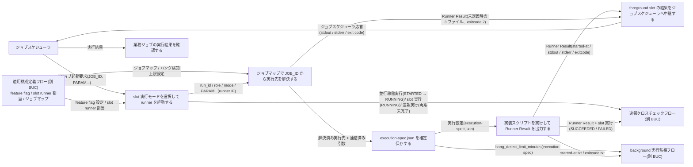
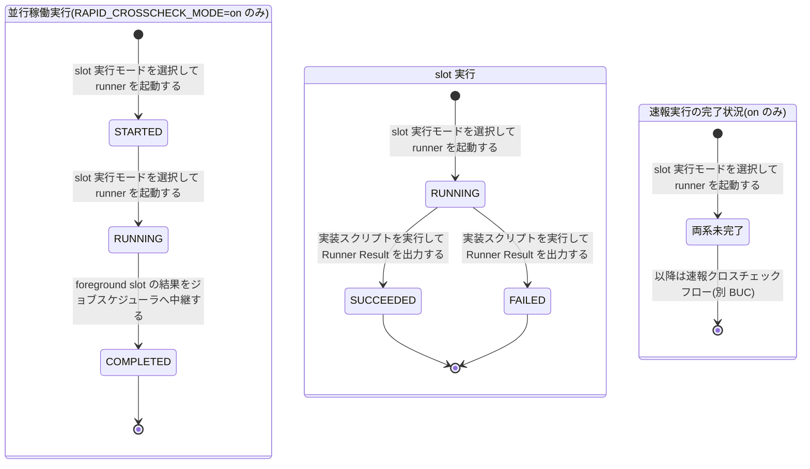

# 実装切替ジョブ実行フロー

## 概要

ジョブスケジューラの業務ジョブ定義を変更せずに、facade が feature flag 設定で選んだ slot(blue / green)の runner を foreground / background で起動し、runner がジョブマップで解決した実行先で実装スクリプトを実行して Runner Result Contract の成果物を残す。facade は foreground slot の結果だけを無加工でジョブスケジューラへ中継し、運用者は並行稼働中も単独本番中も同じ見え方で業務ジョブの成否を判定する。速報クロスチェック有効時だけ run_id で相関付けた parallel_run / slot 実行 / rapid_run を管理 DB に記録する。

## 所属 UC 一覧

| UC名 | アクター | 主な操作 | 関連情報 |
|------|---------|---------|---------|
| [slot 実行モードを選択して runner を起動する](slot%20実行モードを選択して%20runner%20を起動する/spec.md) | 運用者(受益者)/ ジョブスケジューラ(起動元) | feature flag を読み込み、両 slot foreground を拒否し、background → foreground の順に runner を起動して foreground の PID だけを待機する。on のとき run_id を発行して parallel_run を STARTED → RUNNING にする | ジョブ起動要求、feature flag 設定、slot runner 割当、並行稼働実行(parallel_run)、slot 実行、速報実行(rapid_run)、実行ログ |
| [ジョブマップで JOB_ID から実行先を解決する](ジョブマップで%20JOB_ID%20から実行先を解決する/spec.md) | 運用者(受益者) | slot runner が自 slot のジョブマップから JOB_ID の実行先(ホスト・実行ユーザー・スクリプト・作業ディレクトリ・固定引数・hang_detect_limit_minutes)を解決し、固定引数の後ろに PARAM... を連結する。未定義なら 3 ファイルを揃えて非 0 終了 | ジョブ起動要求、ジョブマップ、ハング検知上限設定、Runner Result |
| [execution-spec.json を確定保存する](execution-spec.json%20を確定保存する/spec.md) | 運用者(受益者) | 解決済みの実行設定を `facade/<run_id>/execution-spec.json` に一時ファイル経由で一度だけ確定保存する。認証情報は参照名のみ。以後のジョブマップ変更で上書きしない | 実行設定(execution-spec)、ジョブマップ、ハング検知上限設定、並行稼働実行(parallel_run) |
| [実装スクリプトを実行して Runner Result を出力する](実装スクリプトを実行して%20Runner%20Result%20を出力する/spec.md) | 運用者(受益者)/ リモート実行ホスト・現行実装・新実装(外部) | 実行先ホストへ SSH 接続して実装スクリプトを実行し、started-at.txt / stdout.log / stderr.log / exitcode.txt を原子的に出力する。exitcode 0 で SUCCEEDED、非 0 で FAILED | 実行設定(execution-spec)、slot 実行、Runner Result、実行ログ |
| [foreground slot の結果をジョブスケジューラへ中継する](foreground%20slot%20の結果をジョブスケジューラへ中継する/spec.md) | 運用者(受益者)/ ジョブスケジューラ(応答先) | foreground の 3 ファイルを標準出力・標準エラー・終了コードとして無加工で中継する。background と速報の結果は含めず待たない。on のとき parallel_run を COMPLETED にする | Runner Result、ジョブスケジューラ応答、並行稼働実行(parallel_run)、slot 実行 |
| [業務ジョブの実行結果を確認する](業務ジョブの実行結果を確認する/spec.md) | 運用者(受益者) | ジョブスケジューラの実行結果(foreground の応答)で業務ジョブの成否を判定する。読む UC で状態を変更しない | ジョブスケジューラ応答、Runner Result、並行稼働実行(parallel_run) |

すべての UC は tier-facade(facade / slot runner)で実現する。

## UC 横断データフロー

BUC 内の UC 間で情報がどう流れるかを示す。情報がどの UC で作成(C)・参照(R)・更新(U)されるかを明記する。

### データフロー図

### 情報 CRUD マトリクス

列の UC は起動 → 解決 → 確定保存 → 実行 → 中継 → 確認の順。`R(間接)` は run_id による相関だけで直接読まないことを示す。

| 情報名 | slot 実行モードを選択して runner を起動する | ジョブマップで JOB_ID から実行先を解決する | execution-spec.json を確定保存する | 実装スクリプトを実行して Runner Result を出力する | foreground slot の結果をジョブスケジューラへ中継する | 業務ジョブの実行結果を確認する |
|--------|:---:|:---:|:---:|:---:|:---:|:---:|
| ジョブ起動要求 | R | R | - | - | - | - |
| feature flag 設定 | R | - | - | - | - | - |
| slot runner 割当 | R | - | - | - | - | - |
| ジョブマップ | - | R | R | - | - | - |
| ハング検知上限設定 | - | R | R | - | - | - |
| 実行設定(execution-spec) | - | - | C | R | - | - |
| 並行稼働実行(parallel_run) | C / U | - | R(間接) | - | U | R(間接) |
| slot 実行 | C / U | - | - | U | R | - |
| 速報実行(rapid_run) | C | - | - | - | - | - |
| Runner Result | - | C(未定義時の 3 ファイル) | - | C | R | R(間接) |
| ジョブスケジューラ応答 | - | - | - | - | C | R |
| 実行ログ | C | - | - | C | - | - |

注記: execution_spec_uri は UC「slot 実行モードを選択して runner を起動する」が設定する。UC「execution-spec.json を確定保存する」は parallel_runs を読まず、URI の指す先へ保存するだけである。

## 状態遷移全体図

BUC 内の UC が遷移 UC になっている状態モデルは、並行稼働実行・slot 実行・速報実行の完了状況の 3 つ。RUNNING → ABORTED(実行復旧業務)、両系未完了以降の完了状況の遷移(速報クロスチェックフロー)、background-rerun による `[*]` → STARTED / RUNNING(実行復旧業務)は別 BUC の UC が担うため図に含めない。

### 状態遷移 UC マッピング

| 状態モデル | 遷移元 | 遷移先 | 担当 UC |
|-----------|--------|--------|--------|
| 並行稼働実行 | `[*]` | STARTED | [slot 実行モードを選択して runner を起動する](slot%20実行モードを選択して%20runner%20を起動する/spec.md) |
| 並行稼働実行 | STARTED | RUNNING | [slot 実行モードを選択して runner を起動する](slot%20実行モードを選択して%20runner%20を起動する/spec.md) |
| 並行稼働実行 | RUNNING | COMPLETED | [foreground slot の結果をジョブスケジューラへ中継する](foreground%20slot%20の結果をジョブスケジューラへ中継する/spec.md) |
| slot 実行 | `[*]` | RUNNING | [slot 実行モードを選択して runner を起動する](slot%20実行モードを選択して%20runner%20を起動する/spec.md) |
| slot 実行 | RUNNING | SUCCEEDED | [実装スクリプトを実行して Runner Result を出力する](実装スクリプトを実行して%20Runner%20Result%20を出力する/spec.md) |
| slot 実行 | RUNNING | FAILED | [実装スクリプトを実行して Runner Result を出力する](実装スクリプトを実行して%20Runner%20Result%20を出力する/spec.md) |
| 速報実行の完了状況 | `[*]` | 両系未完了 | [slot 実行モードを選択して runner を起動する](slot%20実行モードを選択して%20runner%20を起動する/spec.md) |

## BUC 内共有条件一覧

BUC 内の複数 UC で共有される条件の一覧。分母は BUC.tsv でこの BUC に紐づく条件。UC spec の分岐条件一覧で追加採用されている UC は「(spec)」で示す。

| 条件名 | 条件の説明 | 適用 UC |
|--------|----------|--------|
| ジョブスケジューラ応答の決定 | ジョブスケジューラへ返す標準出力・標準エラー・終了コードは foreground slot の Runner Result をそのまま中継したものとし、background slot と速報クロスチェックの結果は反映しない。中継完了で並行稼働実行を COMPLETED にする | foreground slot の結果をジョブスケジューラへ中継する, 業務ジョブの実行結果を確認する |
| 速報結果の位置付け | 速報クロスチェックの exitcode や失敗は業務ジョブの結果としてジョブスケジューラへ返さない。速報は原因調査用で、リリース判断の正本は確報 | foreground slot の結果をジョブスケジューラへ中継する, 業務ジョブの実行結果を確認する |
| 実装固有事項の runner への閉じ込め | 実装固有の起動方式・ホスト・OS・プロトコルは slot の runner に閉じ込め、facade は設定された runner を起動するだけとする | slot 実行モードを選択して runner を起動する, 実装スクリプトを実行して Runner Result を出力する |
| 引数連結規則 | ジョブマップの固定引数(JSON 配列)の後ろに PARAM... を順序を変えずに連結する。引数の数と空白・カンマを維持し、空の固定引数は `[]` | ジョブマップで JOB_ID から実行先を解決する, 実装スクリプトを実行して Runner Result を出力する |
| Runner Result 完備条件 | 終了時に stdout.log / stderr.log / exitcode.txt が揃う。exitcode.txt は数値 1 行で runner の終了コードと一致。異常時も可能な限り 3 ファイルを出力し、0 なら SUCCEEDED、非 0 なら FAILED | ジョブマップで JOB_ID から実行先を解決する, 実装スクリプトを実行して Runner Result を出力する, foreground slot の結果をジョブスケジューラへ中継する(spec) |
| 成果物公開判定 | 一時ファイルへ出力してから確定名へリネームする。確定名のファイルが存在するときのみ書き込み完了とみなす | execution-spec.json を確定保存する, 実装スクリプトを実行して Runner Result を出力する |
| 速報クロスチェック有効判定 | RAPID_CROSSCHECK_MODE=on のときのみ管理 DB へ書き込み、parallel_run を作成・更新する。off のときは管理 DB へ接続しない | slot 実行モードを選択して runner を起動する, foreground slot の結果をジョブスケジューラへ中継する(spec) |

## BUC 内共有バリエーション一覧

BUC 内の複数 UC で共有されるバリエーションの一覧(UC spec のバリエーション一覧を集約)。

| バリエーション名 | 値 | 適用 UC |
|----------------|---|--------|
| 実装スロット | blue、green | slot 実行モードを選択して runner を起動する, ジョブマップで JOB_ID から実行先を解決する, 実装スクリプトを実行して Runner Result を出力する |
| slot 実行モード | foreground、background、off | slot 実行モードを選択して runner を起動する, execution-spec.json を確定保存する, 実装スクリプトを実行して Runner Result を出力する, foreground slot の結果をジョブスケジューラへ中継する, 業務ジョブの実行結果を確認する |
| 運用モード | 並行稼働、新実装の単独本番、次世代実装との並行稼働 | slot 実行モードを選択して runner を起動する, 業務ジョブの実行結果を確認する |
| 速報クロスチェックモード | on、off | slot 実行モードを選択して runner を起動する, 実装スクリプトを実行して Runner Result を出力する, foreground slot の結果をジョブスケジューラへ中継する |
| Runner Result 成果物種別 | started-at.txt、stdout.log、stderr.log、exitcode.txt | ジョブマップで JOB_ID から実行先を解決する, 実装スクリプトを実行して Runner Result を出力する, foreground slot の結果をジョブスケジューラへ中継する, 業務ジョブの実行結果を確認する |
| run role(成果物ディレクトリ区分) | blue、green、rapid-crosscheck | execution-spec.json を確定保存する, 実装スクリプトを実行して Runner Result を出力する |
| ハング検知上限設定 | 60 分(導入時既定)、ジョブごとの調整値、0(検知対象外) | ジョブマップで JOB_ID から実行先を解決する, execution-spec.json を確定保存する |
| ジョブスケジューラ起動ジョブ種別 | 業務ジョブ(facade) | slot 実行モードを選択して runner を起動する, foreground slot の結果をジョブスケジューラへ中継する, 業務ジョブの実行結果を確認する |
