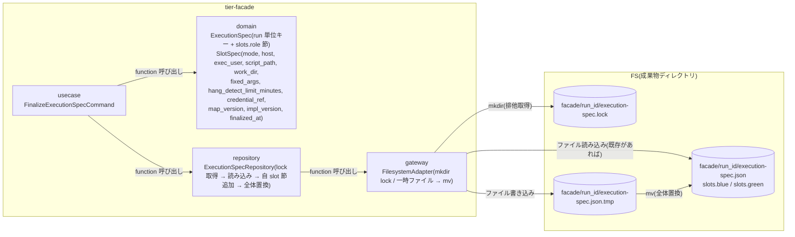
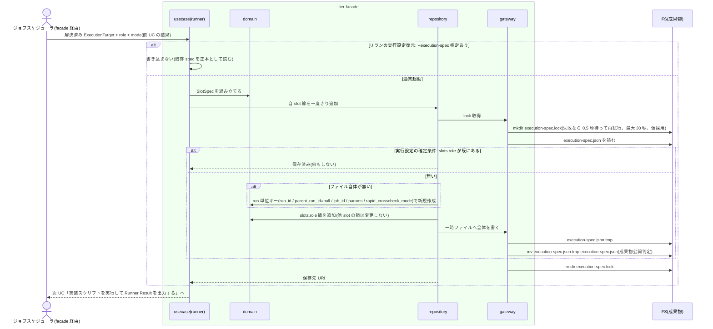

# execution-spec.json を確定保存する

## 概要

run 開始時(並行稼働実行の STARTED 遷移時)に、各 slot runner がジョブマップから解決した自 slot の実行設定(ホスト・実行ユーザー・スクリプト・作業ディレクトリ・固定引数・hang_detect_limit_minutes・認証情報参照名・マップ版・実装版)を、run 単位で 1 ファイルの `facade/<run_id>/execution-spec.json` の `slots.<role>` 節として一度だけ確定保存する。run 単位のキー(run_id / parent_run_id / job_id / params / rapid_crosscheck_mode)は最初に書いた runner が書き、以後変更しない。既に自 slot の節があれば何もしない。認証情報は値を保存せず参照名だけを保存する。`--execution-spec <path>` 指定の復元起動では書き込まない。

## データフロー



| レイヤー | データモデル | 変換内容 |
|---------|------------|---------|
| usecase | FinalizeExecutionSpecCommand | ExecutionTarget + role + mode(+ 最初の runner なら run 単位キー)→ SlotSpec を組み立てて repository に一度きり追加を依頼 |
| domain | ExecutionSpec / SlotSpec | JSON 化と節追加の純粋関数。`credential_ref` は参照名のみ。他 slot の節は変更しない |
| repository | ExecutionSpecRepository | `execution-spec.lock` を `mkdir` で取得 → 既存ファイルを読む(無ければ run 単位キーから新規作成)→ `slots.<role>` が無ければ追加(あれば何もしない)→ 一時ファイルへ全体を書く → `mv` で置換 → lock 解放 |
| gateway | FilesystemAdapter | `mkdir`(原子的な排他)、`.tmp` 書き込み、`mv`、`rmdir` |

## 処理フロー



## バリエーション一覧

| バリエーション名 | 値 | 処理内容 | 適用 tier | 適用箇所 |
|----------------|---|---------|----------|---------|
| run role(成果物ディレクトリ区分) | blue | `slots.blue` 節を blue runner が書く | tier-facade | repository `save_slot_spec_once` |
| run role(成果物ディレクトリ区分) | green | `slots.green` 節を green runner が書く | tier-facade | repository `save_slot_spec_once` |
| run role(成果物ディレクトリ区分) | rapid-crosscheck | slot runner は書かない。速報側の hang_detect_limit_minutes はクロスチェックジョブマップから読む | tier-facade | — |
| slot 実行モード | foreground / background | `slots.<role>.mode` に記録 | tier-facade | domain `SlotSpec` |
| slot 実行モード | off | 節を持たない(runner が起動しないため) | tier-facade | — |
| ハング検知上限設定 | 60 分(導入時既定) | ジョブマップの値を `slots.<role>.hang_detect_limit_minutes` にそのまま保存 | tier-facade | domain `SlotSpec` |
| ハング検知上限設定 | 0(検知対象外) | 同上 | tier-facade | domain `SlotSpec` |
| ハング検知上限設定 | ジョブごとの調整値 | 同上。以後のジョブマップ変更は同じ run に反映しない | tier-facade | repository `save_slot_spec_once` |

## 分岐条件一覧

| 条件名 | 判定ルール | 適用 tier | 適用箇所 | BDD Scenario |
|--------|----------|----------|---------|-------------|
| 実行設定の確定条件 | `slots.<role>` が存在しないときだけ自 slot 節を追加する。存在すれば内容を比較せず何もしない。run 単位キーはファイル新規作成時にだけ書く。run 開始時(runner の解決直後、実装実行前)に保存する | tier-facade | repository `save_slot_spec_once` | run 開始時に自 slot の節を保存する(SPEC-004-03) / 既存の節は上書きしない(SPEC-004-03) / blue と green の両方が保存すると両節が揃う |
| 認証情報の非保存 | JSON には `credential_ref`(参照名)だけを書く。SSH 鍵パス・パスワード・トークンの値は書かない | tier-facade | domain `SlotSpec` | 認証情報の値を保存しない(SPEC-004-03) |
| 成果物公開判定 | `execution-spec.lock` を `mkdir` で取得してから読み書きし、`.tmp` に全文を書いてから `mv` で全体を置換する。確定名が存在するときのみ完了とみなす | tier-facade | gateway `filesystem_adapter` | 一時ファイル経由で確定保存する(SPEC-003-03) |
| リランの実行設定復元 | runner IF に `--execution-spec <path>` があれば書き込まない(background-rerun.sh が新 run ディレクトリへコピーし `run_id` / `parent_run_id` / `restored_at` を書き換える。UC「元の execution-spec.json から復元して新しい run_id で起動する」) | tier-facade | usecase `finalize_execution_spec` | 復元起動では保存しない(SPEC-009-02) |

## 計算ルール一覧

| 計算名 | 入力情報 | 計算式/ロジック | 出力情報 | 適用 tier |
|--------|---------|---------------|---------|----------|
| JSON 組み立て | ExecutionTarget、PARAM...、run_id、job_id、role、mode、RAPID_CROSSCHECK_MODE | 下記スキーマ。文字列は JSON エスケープ。配列は要素順保持。jq 非依存(printf / sed で生成・節挿入) | execution-spec.json 本文 | tier-facade |
| 節追加 | 既存 JSON、SlotSpec | 既存の `slots` オブジェクト末尾に `"<role>": {...}` を追加。既存節と run 単位キーは文字列として保持する | 新 JSON | tier-facade |
| 保存先 URI | RELAY_GATE_ARTIFACT_ROOT、run_id | `$RELAY_GATE_ARTIFACT_ROOT/facade/<run_id>/execution-spec.json` | spec_uri | tier-facade |

### execution-spec.json スキーマ(canonical C1)

```json
{
  "schema_version": "1",
  "run_id": "20260830T113000Z-JOB001-3f9a1c2e",
  "parent_run_id": null,
  "job_id": "JOB001",
  "params": ["20260830"],
  "rapid_crosscheck_mode": "on",
  "slots": {
    "blue":  {"mode": "foreground", "host": "host-blue-01", "exec_user": "batch", "script_path": "/opt/legacy/bin/job001.sh", "work_dir": "/var/legacy/work", "fixed_args": [], "hang_detect_limit_minutes": 0, "credential_ref": "ssh-key-blue", "map_version": "map-v3", "impl_version": "blue-2.9.1", "finalized_at": "2026-08-30T11:30:01Z"},
    "green": {"mode": "background", "host": "host-green-01", "exec_user": "batch", "script_path": "/opt/app/bin/job001.sh", "work_dir": "/var/app/work", "fixed_args": ["--mode", "full"], "hang_detect_limit_minutes": 60, "credential_ref": "ssh-key-green", "map_version": "map-v3", "impl_version": "green-1.4.0", "finalized_at": "2026-08-30T11:30:00Z"}
  }
}
```

## 状態遷移一覧

| 状態モデル | 遷移元 | 遷移先 | トリガー | 事前条件 | 事後処理 | 適用 tier |
|-----------|--------|--------|---------|---------|---------|----------|
| 該当なし | — | — | この UC は状態を遷移させない(並行稼働実行の STARTED 遷移は UC「slot 実行モードを選択して runner を起動する」。本 UC はその遷移時に保存する) | — | — | — |

## 関連 RDRA モデル

| モデル種別 | 要素名 | 関連 |
|-----------|--------|------|
| 業務 | 実装切替業務 | この UC が属する業務 |
| BUC | 実装切替ジョブ実行フロー | この UC を含む BUC |
| アクター | 運用者 | 受益者(障害調査・リランの根拠) |
| 情報 | 実行設定(execution-spec) | 保存対象 |
| 情報 | ジョブマップ | 解決元(前 UC) |
| 情報 | ハング検知上限設定 | slots.<role>.hang_detect_limit_minutes |
| 情報 | 並行稼働実行(parallel_run) | execution_spec_uri が参照する |
| 条件 | 実行設定の確定条件 / 認証情報の非保存 / 成果物公開判定 / リランの実行設定復元 | 分岐条件一覧を参照 |
| 画面 | slot runner 実行設定確定出力(→ CLI 出力) | 実行ログ |

## 関連 USDM

| REQ ID | SPEC ID | 対応 BDD Scenario |
|---|---|---|
| REQ-004 | SPEC-004-03 | run 開始時に自 slot の節を保存する / 既存の節は上書きしない / 認証情報の値を保存しない |
| REQ-003 | SPEC-003-03 | 一時ファイル経由で確定保存する |
| REQ-009 | SPEC-009-02 | 復元起動では保存しない |

## E2E 完了条件(BDD)

### 正常系

```gherkin
Feature: execution-spec.json を確定保存する

  Scenario: run 開始時に自 slot の節を保存する(SPEC-004-03)
    Given green-job-map.tsv に "JOB001	host-green-01	batch	/opt/app/bin/job001.sh	/var/app/work	["--mode","full"]	60	ssh-key-green	map-v3	green-1.4.0" がある
    And feature flag に BLUE_MODE=off GREEN_MODE=foreground RAPID_CROSSCHECK_MODE=off がある
    When ジョブスケジューラが facade.sh JOB001 20260830 を実行する
    Then facade/<run_id>/execution-spec.json が存在する
    And run 単位キーは run_id=<run_id> parent_run_id=null job_id=JOB001 params=["20260830"] rapid_crosscheck_mode=off である
    And slots.green は mode=foreground host=host-green-01 exec_user=batch script_path=/opt/app/bin/job001.sh work_dir=/var/app/work fixed_args=["--mode","full"] hang_detect_limit_minutes=60 credential_ref=ssh-key-green map_version=map-v3 impl_version=green-1.4.0 を含む
    And slots.blue は存在しない
    And 実装スクリプトの起動より前に確定保存されている

  Scenario: blue と green の両方が保存すると両節が揃う
    Given feature flag に BLUE_MODE=foreground GREEN_MODE=background RAPID_CROSSCHECK_MODE=on があり両ジョブマップに JOB001 の行(blue は hang_detect_limit_minutes=0、green は 60)がある
    When ジョブスケジューラが facade.sh JOB001 を実行し両 runner が保存を終える
    Then execution-spec.json に slots.blue(mode=foreground hang_detect_limit_minutes=0)と slots.green(mode=background hang_detect_limit_minutes=60)の両方がある
    And run 単位キーは 1 組だけで、rapid_crosscheck_mode=on である
    And facade/<run_id>/execution-spec.lock は残っていない

  Scenario: 既存の節は上書きしない(SPEC-004-03)
    Given run_id=20260830T113000Z-JOB001-3f9a1c2e の execution-spec.json に slots.green が host=host-green-01 map_version=map-v3 で保存済みである
    And その後 green-job-map.tsv の JOB001 行を host=host-green-02 map_version=map-v4 に変更した
    When 同じ run_id で green runner を再度起動する
    Then slots.green は host=host-green-01 map_version=map-v3 のままで、slots.green は 1 つだけである
    And 実行ログに "execution-spec slot already exists run_id=20260830T113000Z-JOB001-3f9a1c2e role=green" が出る

  Scenario: 一時ファイル経由で確定保存する(SPEC-003-03)
    Given green runner が execution-spec.json を保存しようとしている
    When 保存処理が完了する
    Then facade/<run_id>/execution-spec.json.tmp と execution-spec.lock は存在しない
    And facade/<run_id>/execution-spec.json は完全な JSON である

  Scenario: 復元起動では保存しない(SPEC-009-02)
    Given background-rerun.sh が新 run_id=20260830T150000Z-JOB001-9b8c7d6e のディレクトリに元の execution-spec.json をコピーしている
    When green runner を --execution-spec facade/20260830T150000Z-JOB001-9b8c7d6e/execution-spec.json 付きで起動する
    Then runner はジョブマップを読まず、execution-spec.json の更新日時は変わらない
```

### 異常系

```gherkin
  Scenario: 認証情報の値を保存しない(SPEC-004-03)
    Given ジョブマップの credential_ref 列が ssh-key-green である
    And 実行環境に SSH 秘密鍵 /home/batch/.ssh/id_green が存在する
    When run を開始する
    Then execution-spec.json に "ssh-key-green" は含まれるが "/home/batch/.ssh/id_green" と鍵の内容は含まれない

  Scenario: 成果物ディレクトリへ書き込めない場合は終了コード 6 で終了する
    Given facade/<run_id>/ が読み取り専用である
    When green runner が execution-spec.json を保存しようとする
    Then runner は終了コード 6 で終了する
    And 実行ログに "ERROR execution-spec write failed run_id=<run_id> role=green path=<path>" が出る
    And 実装スクリプトは起動されない

  Scenario: 残留した古い lock は強制取得する
    Given facade/<run_id>/execution-spec.lock が 120 秒前の mtime で残っている(前回の runner がクラッシュ)
    When green runner が保存しようとする
    Then lock を強制取得して保存を完了し、実行ログに "WARN stale execution-spec lock reclaimed run_id=<run_id> age_seconds=120" が出る
```

## ティア別仕様

- [facade / slot runner ティア](tier-facade.md)

### 統合契約

- [CLI コマンド契約](../../../_cross-cutting/api/cli-command-contract.yaml)(runner IF を uses)
- [AsyncAPI Spec](../../../_cross-cutting/api/asyncapi.yaml)(この UC は publish / subscribe しない)
- 復元起動: [元の execution-spec.json から復元して新しい run_id で起動する](../../../実行復旧業務/background%20側リランフロー/元の%20execution-spec.json%20から復元して新しい%20run_id%20で起動する/spec.md)
