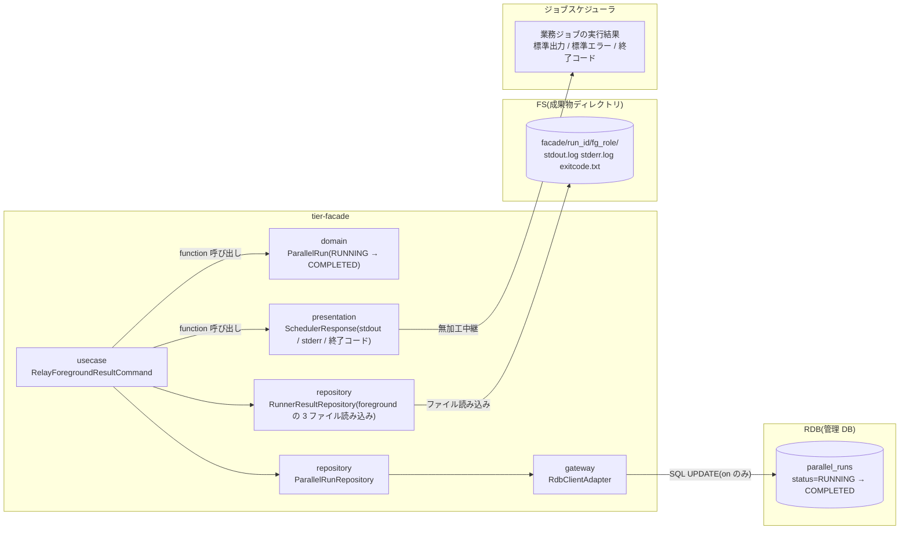
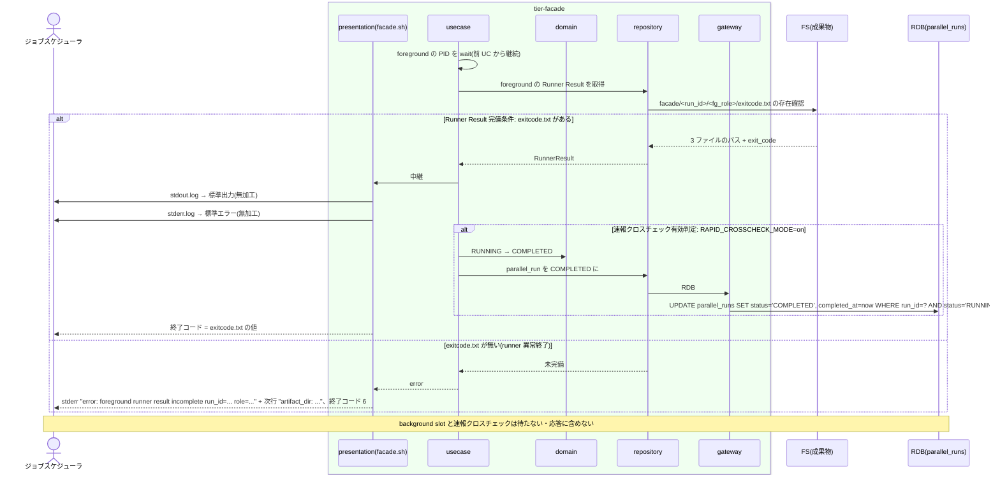

# foreground slot の結果をジョブスケジューラへ中継する

## 概要

facade が foreground slot の終了を待ったのち、その `stdout.log` を標準出力へ、`stderr.log` を標準エラーへ、`exitcode.txt` の値を終了コードとして、装飾・プレフィックス・追記を一切付けずにジョブスケジューラへ中継する。background slot の完了や速報クロスチェックの結果は応答に含めず待機もしない。中継が完了したら `RAPID_CROSSCHECK_MODE=on` のときだけ parallel_run を RUNNING → COMPLETED にする。

## データフロー



| レイヤー | データモデル | 変換内容 |
|---------|------------|---------|
| usecase | RelayForegroundResultCommand | foreground の `wait` 完了 → 3 ファイル完備確認 → presentation へ中継依頼 → (on) COMPLETED 更新 |
| repository | RunnerResultRepository | `exitcode.txt` の存在で完備を判定し、3 ファイルのパスと exitcode 値を返す。内容は読み込まない(presentation が `cat` で流す) |
| presentation | SchedulerResponse | `cat stdout.log` → fd1、`cat stderr.log` → fd2、`exit $(cat exitcode.txt)`。変換なし |
| domain | ParallelRun | RUNNING → COMPLETED の遷移可否 |
| gateway | RdbClientAdapter | 条件付き UPDATE |

## 処理フロー



## バリエーション一覧

| バリエーション名 | 値 | 処理内容 | 適用 tier | 適用箇所 |
|----------------|---|---------|----------|---------|
| slot 実行モード | foreground | この slot の 3 ファイルだけを中継する | tier-facade | usecase `relay_foreground_result` |
| slot 実行モード | background | 待機しない。応答に含めない | tier-facade | usecase `relay_foreground_result` |
| Runner Result 成果物種別 | stdout.log | 標準出力へ無加工 | tier-facade | presentation `relay_stdout` |
| Runner Result 成果物種別 | stderr.log | 標準エラーへ無加工 | tier-facade | presentation `relay_stderr` |
| Runner Result 成果物種別 | exitcode.txt | 終了コードへ | tier-facade | presentation `relay_exit_code` |
| Runner Result 成果物種別 | started-at.txt | 中継しない | tier-facade | — |
| 速報クロスチェックモード | on | 中継完了で parallel_runs を COMPLETED | tier-facade | repository `parallel_run_repo` |
| 速報クロスチェックモード | off | 管理 DB に触れない | tier-facade | usecase `relay_foreground_result` |
| ジョブスケジューラ起動ジョブ種別 | 業務ジョブ(facade) | 応答先 | tier-facade | presentation |

## 分岐条件一覧

| 条件名 | 判定ルール | 適用 tier | 適用箇所 | BDD Scenario |
|--------|----------|----------|---------|-------------|
| ジョブスケジューラ応答の決定 | 標準出力 = foreground の stdout.log、標準エラー = stderr.log、終了コード = exitcode.txt。バイト単位で同一。background と速報の結果は反映しない。中継完了で並行稼働実行を COMPLETED にする | tier-facade | presentation `relay_*` / usecase `relay_foreground_result` | foreground の 3 ファイルをそのまま中継する(SPEC-002-02) |
| 速報結果の位置付け | 速報比較の状態・exitcode を応答に混ぜない。速報が失敗しても応答は変わらない | tier-facade | usecase `relay_foreground_result` | 速報クロスチェックが失敗しても応答は変わらない(SPEC-005-05) |
| CLI とメールによる提示 | 応答は stdout / stderr / 終了コードだけ。UI・追加の連携データは無い | tier-facade | presentation | foreground の 3 ファイルをそのまま中継する |
| 速報クロスチェック有効判定 | on のときだけ parallel_runs を更新。off では管理 DB に触れない | tier-facade | usecase `relay_foreground_result` | 中継完了で parallel_run を COMPLETED にする(SPEC-011-01) |
| Runner Result 完備条件 | exitcode.txt が無ければ中継せず終了コード 6(relay-gate 自身のエラー) | tier-facade | repository `runner_result_repo` | foreground の 3 ファイルが揃わない場合は終了コード 6 |

## 計算ルール一覧

| 計算名 | 入力情報 | 計算式/ロジック | 出力情報 | 適用 tier |
|--------|---------|---------------|---------|----------|
| 終了コード | exitcode.txt | `exit "$(cat exitcode.txt)"`。数値 1 行以外(空・非数値)は完備違反として終了コード 6 | 終了コード | tier-facade |
| 中継順序 | stdout.log、stderr.log | stdout を先に全量、次に stderr を全量(インターリーブは再現しない。仮採用) | 標準出力 / 標準エラー | tier-facade |

## 状態遷移一覧

| 状態モデル | 遷移元 | 遷移先 | トリガー | 事前条件 | 事後処理 | 適用 tier |
|-----------|--------|--------|---------|---------|---------|----------|
| 並行稼働実行 | RUNNING | COMPLETED | foreground の 3 ファイル中継完了 | RAPID_CROSSCHECK_MODE=on、parallel_runs.status=RUNNING | completed_at を設定。background / 速報の完了は待たない | tier-facade |

## 関連 RDRA モデル

| モデル種別 | 要素名 | 関連 |
|-----------|--------|------|
| 業務 | 実装切替業務 | この UC が属する業務 |
| BUC | 実装切替ジョブ実行フロー | この UC を含む BUC |
| アクター | 運用者 | 受益者 |
| 情報 | Runner Result | 中継元 |
| 情報 | ジョブスケジューラ応答 | 中継先 |
| 情報 | 並行稼働実行(parallel_run) | COMPLETED 更新 |
| 情報 | slot 実行 | foreground slot の特定 |
| 条件 | ジョブスケジューラ応答の決定 / 速報結果の位置付け / CLI とメールによる提示 | 分岐条件一覧を参照 |
| 画面 | facade 応答出力(→ CLI 出力) | stdout / stderr / 終了コード |
| イベント | foreground 結果の無加工中継 | 応答 |
| 外部システム | ジョブスケジューラ / 管理 DB(RDB) | 応答先 / on のときの更新先 |
| 状態 | 並行稼働実行 | 状態遷移一覧を参照 |

## 関連 USDM

| REQ ID | SPEC ID | 対応 BDD Scenario |
|---|---|---|
| REQ-002 | SPEC-002-02 | foreground の 3 ファイルをそのまま中継する / 速報クロスチェックが失敗しても応答は変わらない |
| REQ-005 | SPEC-005-05 | 速報クロスチェックが失敗しても応答は変わらない |
| REQ-011 | SPEC-011-01 | 中継完了で parallel_run を COMPLETED にする |
| REQ-012 | SPEC-012-01 | foreground の 3 ファイルをそのまま中継する |

## E2E 完了条件(BDD)

### 正常系

```gherkin
Feature: foreground slot の結果をジョブスケジューラへ中継する

  Scenario: foreground の 3 ファイルをそのまま中継する(SPEC-002-02)
    Given feature flag に BLUE_MODE=foreground GREEN_MODE=background RAPID_CROSSCHECK_MODE=on がある
    And blue の実装は stdout に "processed 120 rows" を、stderr に "warn: skipped 2 rows" を出し終了コード 0 で終了する
    When ジョブスケジューラが facade.sh JOB001 を実行する
    Then ジョブスケジューラが受け取る標準出力は "processed 120 rows" とバイト単位で同一である
    And 標準エラーは "warn: skipped 2 rows" とバイト単位で同一である
    And 終了コードは 0 である
    And 標準出力・標準エラーに run_id や relay-gate の文字列は含まれない

  Scenario: 非 0 の exitcode.txt をそのまま終了コードにする
    Given blue の実装は終了コード 4 で終了する
    When ジョブスケジューラが facade.sh JOB001 を実行する
    Then ジョブスケジューラが受け取る終了コードは 4 である

  Scenario: 速報クロスチェックが失敗しても応答は変わらない(SPEC-005-05)
    Given BLUE_MODE=foreground GREEN_MODE=background RAPID_CROSSCHECK_MODE=on で blue は終了コード 0、green は終了コード 1 で終了する
    When ジョブスケジューラが facade.sh JOB001 を実行する
    Then ジョブスケジューラが受け取る終了コードは 0 であり、標準出力・標準エラーは blue の stdout.log / stderr.log と同一である

  Scenario: background の完了を待たずに応答する
    Given BLUE_MODE=foreground GREEN_MODE=background で blue は 5 秒、green は 600 秒で終了する
    When ジョブスケジューラが facade.sh JOB001 を実行する
    Then facade は blue 終了後 10 秒以内に応答し、その時点で green は実行中である

  Scenario: 中継完了で parallel_run を COMPLETED にする(SPEC-011-01)
    Given RAPID_CROSSCHECK_MODE=on で parallel_runs の run_id が RUNNING である
    When facade が foreground の 3 ファイルを中継し終える
    Then parallel_runs の該当行は status=COMPLETED で completed_at が設定されている
    And green(background)がまだ実行中でも COMPLETED である

  Scenario: RAPID_CROSSCHECK_MODE=off では中継後に管理 DB へ触れない
    Given RAPID_CROSSCHECK_MODE=off である
    When facade が foreground の 3 ファイルを中継し終える
    Then 管理 DB への接続は発生しない
```

### 異常系

```gherkin
  Scenario: foreground の 3 ファイルが揃わない場合は終了コード 6
    Given blue runner が exitcode.txt を書く前に異常終了した(started-at.txt のみ存在)
    When facade の wait が戻る
    Then facade は終了コード 6 で終了する
    And 標準エラーに "error: foreground runner result incomplete run_id=<run_id> role=blue" が出る
    And RAPID_CROSSCHECK_MODE=on の parallel_runs は RUNNING のままである
```

## ティア別仕様

- [facade / slot runner ティア](tier-facade.md)

### 統合契約

- [CLI コマンド契約](../../../_cross-cutting/api/cli-command-contract.yaml)(`facade.sh` の出力契約を defines)
- [AsyncAPI Spec](../../../_cross-cutting/api/asyncapi.yaml)(この UC は publish / subscribe しない)
- 運用者視点: [業務ジョブの実行結果を確認する](../業務ジョブの実行結果を確認する/spec.md)
