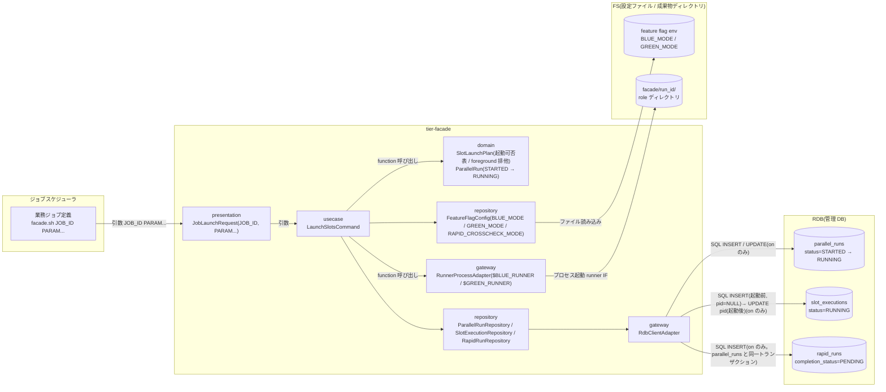
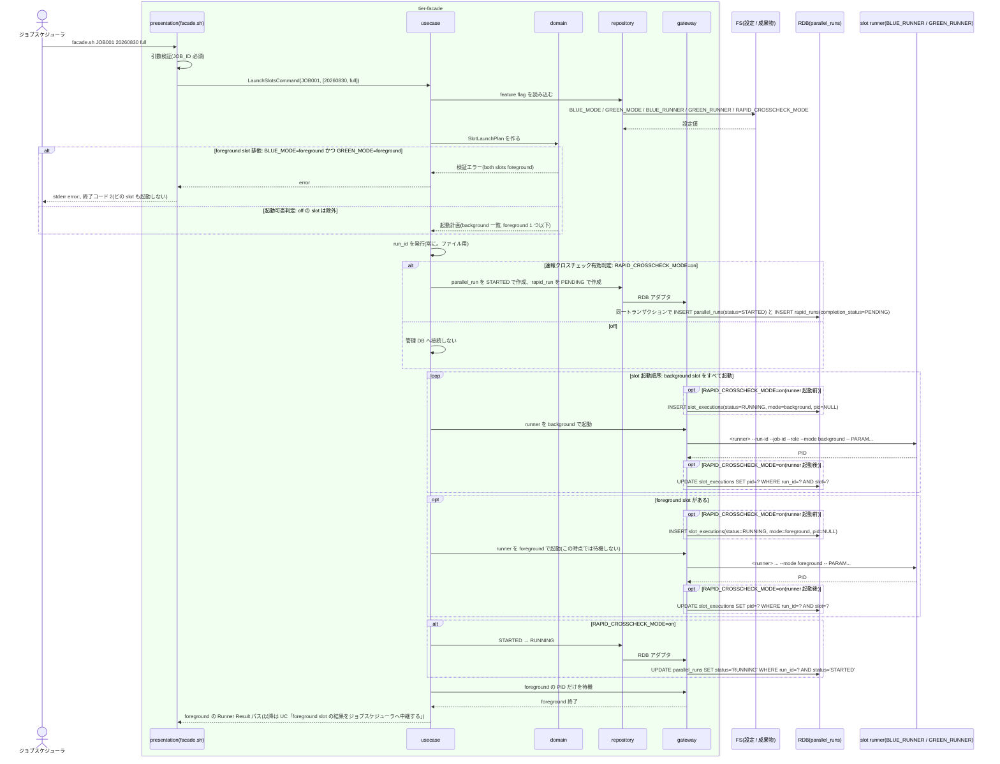

# slot 実行モードを選択して runner を起動する

## 概要

ジョブスケジューラから `facade.sh JOB_ID [PARAM...]` で起動された facade が、feature flag 設定を起動のたびに読み込み、blue / green slot ごとに foreground / background / off の実行モードを選択して runner を起動する。両 slot foreground の構成は入力検証で拒否し、どの slot も起動しない。background slot をすべて起動してから foreground slot を起動し、foreground の PID だけを待機する。`RAPID_CROSSCHECK_MODE=on` のときだけ run_id を発行して parallel_run を STARTED → RUNNING へ遷移させ、off のときは管理 DB に一切触れない。

## データフロー



| レイヤー | データモデル | 変換内容 |
|---------|------------|---------|
| presentation | JobLaunchRequest(JOB_ID, PARAM...) | 引数検証(JOB_ID 必須・job_id 文字種)。feature flag の検証結果を終了コード 2 に変換 |
| usecase | LaunchSlotsCommand | feature flag 読み込み → 起動計画作成 → run_id 発行 → (on) parallel_run INSERT → background 起動 → foreground 起動 → (on) RUNNING 更新 → foreground 待機 |
| domain | SlotLaunchPlan | 実装スロット × slot 実行モードの起動可否表。foreground × foreground を拒否。起動順序(background 全部 → foreground)を決める純粋関数 |
| repository | FeatureFlagConfig / ParallelRunRepository / SlotExecutionRepository / RapidRunRepository | env ファイルの読み込み。parallel_runs の INSERT(STARTED)+ rapid_runs の INSERT(PENDING)を同一トランザクションで、slot_executions の INSERT(RUNNING。runner 起動前に pid=NULL)と pid の UPDATE(起動後)、parallel_runs の条件付き UPDATE(RUNNING) |
| gateway | RunnerProcessAdapter / RdbClientAdapter | runner IF `<runner> --run-id --job-id --role --mode -- PARAM...` でのプロセス起動と PID 取得。RDB クライアント CLI 呼び出し |

## 処理フロー



## バリエーション一覧

| バリエーション名 | 値 | 処理内容 | 適用 tier | 適用箇所 |
|----------------|---|---------|----------|---------|
| 実装スロット | blue | `BLUE_MODE` / `BLUE_RUNNER` で起動可否と runner を決める。role=blue で起動 | tier-facade | facade.sh / domain `plan_slot_launch` |
| 実装スロット | green | `GREEN_MODE` / `GREEN_RUNNER` で起動可否と runner を決める。role=green で起動 | tier-facade | facade.sh / domain `plan_slot_launch` |
| slot 実行モード | foreground | 最後に起動し、その PID だけを待機して結果を中継する。同時に 1 slot だけ | tier-facade | domain `plan_slot_launch` / usecase `launch_slots` |
| slot 実行モード | background | foreground より先に起動する。待機しない。成果物は同じ 3 ファイル | tier-facade | usecase `launch_slots` |
| slot 実行モード | off | runner を起動しない | tier-facade | domain `plan_slot_launch` |
| 運用モード | 並行稼働 | BLUE_MODE=foreground / GREEN_MODE=background / RAPID_CROSSCHECK_MODE=on。blue の結果を返す | tier-facade | facade.sh |
| 運用モード | 新実装の単独本番 | BLUE_MODE=off / GREEN_MODE=foreground / RAPID_CROSSCHECK_MODE=off。green の結果を返し、管理 DB に触れない | tier-facade | facade.sh |
| 運用モード | 次世代実装との並行稼働 | BLUE_MODE=background / GREEN_MODE=foreground / RAPID_CROSSCHECK_MODE=on。green の結果を返す | tier-facade | facade.sh |
| 速報クロスチェックモード | on | run_id 発行 + parallel_runs INSERT(STARTED)→ UPDATE(RUNNING) | tier-facade | usecase `launch_slots` / repository `parallel_run_repo` |
| 速報クロスチェックモード | off | 管理 DB へ接続・書き込みしない。run_id はファイル用に発行する | tier-facade | usecase `launch_slots` |
| ジョブスケジューラ起動ジョブ種別 | 業務ジョブ(facade) | `facade.sh JOB_ID [PARAM...]` だけを渡す | tier-facade | facade.sh |

## 分岐条件一覧

| 条件名 | 判定ルール | 適用 tier | 適用箇所 | BDD Scenario |
|--------|----------|----------|---------|-------------|
| foreground slot 排他 | `BLUE_MODE=foreground` かつ `GREEN_MODE=foreground` なら検証エラー。stderr に `error: both slots are foreground blue_mode=foreground green_mode=foreground` を出し終了コード 2。どの slot も起動しない | tier-facade | facade.sh / domain `validate_feature_flag` | 両 slot foreground は入力検証で拒否する(SPEC-001-02) |
| slot 起動可否判定 | mode が `off` の slot は起動しない。`foreground` / `background` の slot だけを起動する | tier-facade | domain `plan_slot_launch` | off の slot は起動しない(SPEC-001-01) |
| slot 起動順序 | background の slot をすべて起動して PID と成果物ディレクトリを確定してから foreground slot を起動し、すべて起動後に foreground の PID だけを `wait` する。on のとき parallel_run を STARTED → RUNNING | tier-facade | usecase `launch_slots` | background を先に起動し foreground だけを待機する(SPEC-002-01) |
| 速報クロスチェック有効判定 | `RAPID_CROSSCHECK_MODE=on` のときだけ parallel_run を作成する。`off` のときは管理 DB へ接続も書き込みもしない(repository を呼ばない) | tier-facade | usecase `launch_slots` | RAPID_CROSSCHECK_MODE=off では管理 DB に触れない(SPEC-005-04) |
| 確報クロスチェック非起動 | feature flag に確報の制御キーは無い。facade は final-crosscheck-runner.sh を起動しない | tier-facade | facade.sh | 確報クロスチェックを起動しない(SPEC-001-01) |
| facade の責務限定 | facade は JOB_ID と PARAM... だけを受け取り、比較対象・実行先・起動方式を判断しない。PARAM... を順序を変えず runner に渡す | tier-facade | facade.sh / usecase `launch_slots` | 並行稼働モードで blue foreground と green background を起動する |
| 実装固有事項の runner への閉じ込め | facade は `$BLUE_RUNNER` / `$GREEN_RUNNER` に設定された実体を runner IF で起動するだけ。実体の中身に依存しない | tier-facade | gateway `runner_process_adapter` | 並行稼働モードで blue foreground と green background を起動する |

## 計算ルール一覧

| 計算名 | 入力情報 | 計算式/ロジック | 出力情報 | 適用 tier |
|--------|---------|---------------|---------|----------|
| run_id 発行 | 起動日時(UTC)、JOB_ID | `{UTC yyyymmddThhmmssZ}-{job_id}-{8 桁 hex 乱数}`(例 `20260830T113000Z-JOB001-3f9a1c2e`。仮採用: _inference.md #9) | run_id | tier-facade |
| 起動計画 | BLUE_MODE、GREEN_MODE | background 集合 = {slot : mode=background}、foreground = {slot : mode=foreground}(要素数 0 または 1)、off は除外 | SlotLaunchPlan | tier-facade |
| 成果物ディレクトリ | RELAY_GATE_ARTIFACT_ROOT、run_id、role | `$RELAY_GATE_ARTIFACT_ROOT/facade/<run_id>/<role>/` | artifact_dir | tier-facade |
| parameters(JSON) | PARAM... | 各引数を順序どおり JSON 配列文字列にする(例 `["20260830","full"]`。空なら `[]`) | parallel_runs.parameters | tier-facade |
| 運用モード名 | BLUE_MODE、GREEN_MODE、RAPID_CROSSCHECK_MODE | UC「feature flag を設定する」の運用モード表に一致すれば `parallel` / `green-only` / `next-parallel`、表に無い有効な組合せは `custom`(validate-config.sh と同じ関数) | operation_mode(実行ログ `feature flag loaded` 行) | tier-facade |

## 状態遷移一覧

| 状態モデル | 遷移元 | 遷移先 | トリガー | 事前条件 | 事後処理 | 適用 tier |
|-----------|--------|--------|---------|---------|---------|----------|
| 並行稼働実行 | `[*]` | STARTED | facade が run_id を発行して parallel_run を作成 | RAPID_CROSSCHECK_MODE=on、入力検証 OK | execution_spec_uri に `facade/<run_id>/execution-spec.json` を設定(保存は UC「execution-spec.json を確定保存する」) | tier-facade |
| 並行稼働実行 | STARTED | RUNNING | すべての slot を起動し foreground の PID 待機を開始 | parallel_runs.status=STARTED | 条件付き UPDATE(`WHERE run_id=? AND status='STARTED'`) | tier-facade |
| slot 実行 | `[*]` | RUNNING | facade が runner を起動し、runner が started-at.txt を出力 | 起動計画に含まれる slot | on のとき runner 起動「前」に slot_executions を mode / artifact_dir / status=RUNNING / pid=NULL で INSERT し、起動後に pid を UPDATE する(即時終了する runner の終端 UPDATE より INSERT が先に確定する順序を保証。仮採用: _inference.md #7) | tier-facade |
| 速報実行の完了状況 | `[*]` | 両系未完了(PENDING) | facade が run を開始し rapid_run を作成 | RAPID_CROSSCHECK_MODE=on | parallel_runs と同一トランザクションで rapid_runs を completion_status=PENDING で INSERT する(canonical C3。速報側の受信 UC は UPDATE のみ) | tier-facade |

## 関連 RDRA モデル

| モデル種別 | 要素名 | 関連 |
|-----------|--------|------|
| 業務 | 実装切替業務 | この UC が属する業務 |
| BUC | 実装切替ジョブ実行フロー | この UC を含む BUC |
| アクター | 運用者 | 受益者(ジョブ定義を変更せずに結果を受け取る) |
| 情報 | ジョブ起動要求 | JOB_ID / PARAM... の入力 |
| 情報 | feature flag 設定 | 起動のたびに読み込む |
| 情報 | slot runner 割当 | BLUE_RUNNER / GREEN_RUNNER |
| 情報 | 並行稼働実行(parallel_run) | on のとき作成・更新 |
| 情報 | slot 実行 | 起動した slot の mode / PID / 成果物ディレクトリ |
| 情報 | 速報実行(rapid_run) | on のとき run 開始時に作成 |
| 情報 | 実行ログ | 起動・PID・待機を run_id 付きで記録 |
| 条件 | foreground slot 排他 / slot 起動可否判定 / slot 起動順序 / 速報クロスチェック有効判定 / 確報クロスチェック非起動 / facade の責務限定 / 実装固有事項の runner への閉じ込め | 分岐条件一覧を参照 |
| 画面 | facade slot 起動出力(→ CLI 出力) | stderr の検証エラーと実行ログ |
| イベント | JOB_ID 付き facade 起動 / parallel_run の登録 | トリガー / 副作用 |
| 外部システム | ジョブスケジューラ / 管理 DB(RDB) | 起動元 / on のときの書き込み先 |
| 状態 | 並行稼働実行 / slot 実行 / 速報実行の完了状況 | 状態遷移一覧を参照 |

## 関連 USDM

| REQ ID | SPEC ID | 対応 BDD Scenario |
|---|---|---|
| REQ-001 | SPEC-001-01 | 並行稼働モードで blue foreground と green background を起動する / off の slot は起動しない / 確報クロスチェックを起動しない |
| REQ-001 | SPEC-001-02 | 両 slot foreground は入力検証で拒否する |
| REQ-001 | SPEC-001-03 | 新実装の単独本番モードでは green だけを起動し管理 DB に触れない / 次世代並行稼働モードでは blue background と green foreground を起動する |
| REQ-002 | SPEC-002-01 | background を先に起動し foreground だけを待機する |
| REQ-002 | SPEC-002-03 | 並行稼働モードで blue foreground と green background を起動する |
| REQ-005 | SPEC-005-04 | RAPID_CROSSCHECK_MODE=off では管理 DB に触れない / RAPID_CROSSCHECK_MODE=on では parallel_run を STARTED から RUNNING にする |
| REQ-011 | SPEC-011-01 | RAPID_CROSSCHECK_MODE=on では parallel_run を STARTED から RUNNING にする |

## E2E 完了条件(BDD)

### 正常系

```gherkin
Feature: slot 実行モードを選択して runner を起動する

  Scenario: 並行稼働モードで blue foreground と green background を起動する(SPEC-001-01)
    Given feature flag に BLUE_MODE=foreground GREEN_MODE=background RAPID_CROSSCHECK_MODE=on BLUE_RUNNER=/opt/relay-gate/runners/blue-runner.sh GREEN_RUNNER=/opt/relay-gate/runners/green-runner.sh が定義されている
    And 両 slot のジョブマップに job_id=JOB001 の行がある
    When ジョブスケジューラが facade.sh JOB001 20260830 full を実行する
    Then green runner が --role green --mode background -- 20260830 full で先に起動される
    And blue runner が --role blue --mode foreground -- 20260830 full でその後に起動される
    And facade は blue の PID だけを待機する
    And parallel_runs に run_id の行が status=RUNNING job_id=JOB001 parameters=["20260830","full"] で存在する

  Scenario: background を先に起動し foreground だけを待機する(SPEC-002-01)
    Given feature flag に BLUE_MODE=foreground GREEN_MODE=background RAPID_CROSSCHECK_MODE=on が定義されている
    And green の実装スクリプトは 600 秒、blue の実装スクリプトは 5 秒で終了する
    When ジョブスケジューラが facade.sh JOB001 を実行する
    Then facade は blue の終了後 10 秒以内に終了する
    And facade 終了時点で facade/<run_id>/green/exitcode.txt は存在しない(green は実行中)
    And 実行ログに "slot started slot=green mode=background" が "slot started slot=blue mode=foreground" より前に記録される

  Scenario: 新実装の単独本番モードでは green だけを起動し管理 DB に触れない(SPEC-001-03)
    Given feature flag に BLUE_MODE=off GREEN_MODE=foreground RAPID_CROSSCHECK_MODE=off が定義されている
    And 管理 DB の接続設定が存在しない
    When ジョブスケジューラが facade.sh JOB001 を実行する
    Then blue runner は起動されない
    And green runner が --role green --mode foreground で起動される
    And facade は管理 DB へ接続せず終了する
    And facade/<run_id>/green/ に started-at.txt が存在する

  Scenario: 次世代並行稼働モードでは blue background と green foreground を起動する(SPEC-001-03)
    Given feature flag に BLUE_MODE=background GREEN_MODE=foreground RAPID_CROSSCHECK_MODE=on が定義されている
    When ジョブスケジューラが facade.sh JOB001 を実行する
    Then blue runner が --mode background で先に起動される
    And green runner が --mode foreground でその後に起動される
    And facade は green の PID だけを待機する

  Scenario: off の slot は起動しない(SPEC-001-01)
    Given feature flag に BLUE_MODE=foreground GREEN_MODE=off RAPID_CROSSCHECK_MODE=off が定義されている
    When ジョブスケジューラが facade.sh JOB001 を実行する
    Then green runner は起動されない
    And facade/<run_id>/green/ ディレクトリは作成されない

  Scenario: RAPID_CROSSCHECK_MODE=on では parallel_run を STARTED から RUNNING にする(SPEC-011-01)
    Given feature flag に BLUE_MODE=foreground GREEN_MODE=background RAPID_CROSSCHECK_MODE=on が定義されている
    When ジョブスケジューラが facade.sh JOB001 を実行する
    Then parallel_runs に status=STARTED の行が INSERT された後に status=RUNNING へ更新される
    And execution_spec_uri が <RELAY_GATE_ARTIFACT_ROOT>/facade/<run_id>/execution-spec.json を指す
    And rapid_runs に run_id の行が completion_status=PENDING で存在する

  Scenario: RAPID_CROSSCHECK_MODE=off では管理 DB に触れない(SPEC-005-04)
    Given feature flag に BLUE_MODE=foreground GREEN_MODE=background RAPID_CROSSCHECK_MODE=off が定義されている
    And 管理 DB の接続設定が存在しない
    When ジョブスケジューラが facade.sh JOB001 を実行する
    Then blue と green の runner が起動される
    And parallel_runs / slot_executions / rapid_runs に行は作成されない
    And run_id 形式の成果物ディレクトリ facade/<run_id>/ が作成される

  Scenario: 確報クロスチェックを起動しない(SPEC-001-01)
    Given feature flag に確報クロスチェックの制御キーは存在しない
    When ジョブスケジューラが facade.sh JOB001 を実行する
    Then final-crosscheck-runner.sh は起動されない
```

### 異常系

```gherkin
  Scenario: 両 slot foreground は入力検証で拒否する(SPEC-001-02)
    Given feature flag に BLUE_MODE=foreground GREEN_MODE=foreground RAPID_CROSSCHECK_MODE=on が定義されている
    When ジョブスケジューラが facade.sh JOB001 を実行する
    Then 終了コード 2 で終了する
    And stderr に "error: both slots are foreground blue_mode=foreground green_mode=foreground" が出る
    And blue runner も green runner も起動されない
    And parallel_runs に行は作成されない

  Scenario: JOB_ID が無い起動は拒否する
    Given feature flag が正しく定義されている
    When ジョブスケジューラが facade.sh を引数なしで実行する
    Then 終了コード 2 で終了する
    And stderr に "error: JOB_ID required" が出る
    And どの runner も起動されない

  Scenario: 未知の実行モードは拒否する
    Given feature flag に BLUE_MODE=parallel GREEN_MODE=background が定義されている
    When ジョブスケジューラが facade.sh JOB001 を実行する
    Then 終了コード 2 で終了する
    And stderr に "error: unknown slot mode slot=blue mode=parallel" が出る
    And どの runner も起動されない

  Scenario: RAPID_CROSSCHECK_MODE=on で管理 DB に接続できない
    Given feature flag に BLUE_MODE=foreground GREEN_MODE=background RAPID_CROSSCHECK_MODE=on が定義されている
    And 管理 DB が停止している
    When ジョブスケジューラが facade.sh JOB001 を実行する
    Then 終了コード 6 で終了する
    And stderr に "error: management db connection failed run_id=" で始まり "conn_ref=" を含む行が出る
    And どの runner も起動されない
```

## ティア別仕様

- [facade / slot runner ティア](tier-facade.md)

### 統合契約

- [CLI コマンド契約](../../../_cross-cutting/api/cli-command-contract.yaml)(`facade.sh` を defines)
- [AsyncAPI Spec](../../../_cross-cutting/api/asyncapi.yaml)(この UC は publish / subscribe しない)
- 後続 UC: [ジョブマップで JOB_ID から実行先を解決する](../ジョブマップで%20JOB_ID%20から実行先を解決する/spec.md) / [foreground slot の結果をジョブスケジューラへ中継する](../foreground%20slot%20の結果をジョブスケジューラへ中継する/spec.md)
