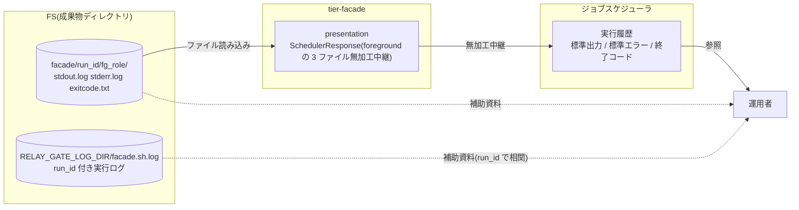
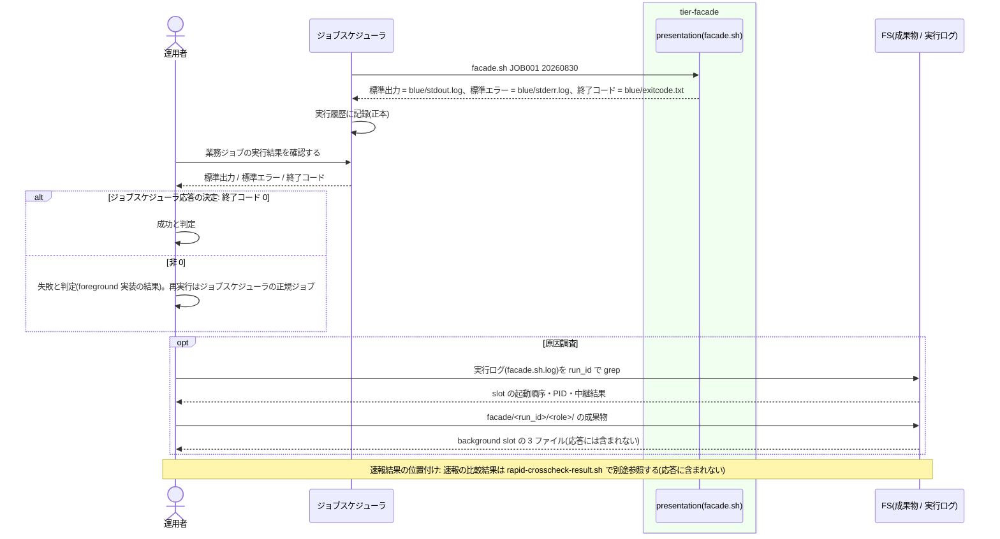

# 業務ジョブの実行結果を確認する

## 概要

運用者が、ジョブスケジューラに中継された foreground slot の標準出力・標準エラー・終了コードを業務ジョブの実行結果として確認する。応答には速報クロスチェックの失敗や background slot の結果が含まれず、並行稼働中も単独本番中も同じ見え方で成否を判定できる。実行履歴・監査の正本はジョブスケジューラであり、relay-gate は成果物ディレクトリと実行ログを補助資料として残す。この UC は「読む」UC であり、relay-gate 側の処理は facade 応答の契約(何が含まれ、何が含まれないか)の定義である。

## データフロー



| レイヤー | データモデル | 変換内容 |
|---------|------------|---------|
| presentation | SchedulerResponse | foreground の stdout.log / stderr.log / exitcode.txt をそのまま(UC「foreground slot の結果をジョブスケジューラへ中継する」) |
| ジョブスケジューラ | 実行履歴 | 標準出力・標準エラー・終了コードを記録し、運用者に提示する(外部システムの責務) |
| 運用者 | 判定 | 終了コード 0 = 成功、非 0 = 失敗。並行稼働 / 単独本番で同じ判定 |

## 処理フロー



## バリエーション一覧

| バリエーション名 | 値 | 処理内容 | 適用 tier | 適用箇所 |
|----------------|---|---------|----------|---------|
| slot 実行モード | foreground | この slot の結果だけが応答になる | tier-facade | presentation `relay_*` |
| slot 実行モード | background | 応答に含まれない。成果物ディレクトリと通知メールで確認 | tier-facade | usecase `relay_foreground_result`(待機・中継対象から除外) |
| slot 実行モード | off | 成果物も応答も無い | tier-facade | domain `plan_slot_launch`(起動対象から除外) |
| 運用モード | 並行稼働 | 応答 = blue の結果 | tier-facade | facade.sh |
| 運用モード | 新実装の単独本番 | 応答 = green の結果 | tier-facade | facade.sh |
| 運用モード | 次世代実装との並行稼働 | 応答 = green の結果 | tier-facade | facade.sh |
| Runner Result 成果物種別 | stdout.log / stderr.log / exitcode.txt | 応答の 3 チャネル | tier-facade | presentation |
| Runner Result 成果物種別 | started-at.txt | 応答に含まれない | tier-facade | presentation `relay_*`(中継対象外) |
| ジョブスケジューラ起動ジョブ種別 | 業務ジョブ(facade) | この UC の対象。確報ジョブの結果確認は UC「確報クロスチェック結果を確認する」 | tier-facade | facade.sh |

## 分岐条件一覧

| 条件名 | 判定ルール | 適用 tier | 適用箇所 | BDD Scenario |
|--------|----------|----------|---------|-------------|
| ジョブスケジューラ応答の決定 | 応答に含まれるのは foreground の 3 ファイルだけ。運用者は終了コードで成否を判定する。background と速報は含まれない | tier-facade | presentation `relay_*` | 並行稼働中の応答は blue の結果だけである(SPEC-001-03) |
| 速報結果の位置付け | 速報の失敗は応答に現れない。速報結果は `rapid-crosscheck-result.sh --run-id` で原因調査に使い、リリース判断には確報を用いる | tier-facade | usecase `relay_foreground_result`(速報の状態を参照しない。速報結果の参照は tier-rapid-crosscheck の `rapid-crosscheck-result.sh`) | 速報が失敗しても応答は変わらない(SPEC-005-05) |
| 実行履歴はジョブスケジューラの責務 | 実行履歴・監査はジョブスケジューラで確認する。relay-gate の実行ログ(`facade.sh.log`)と成果物は run_id で相関付けた補助資料 | tier-facade | 実行ログ | 実行ログと成果物で run を追跡できる(SPEC-012-02) |

## 計算ルール一覧

| 計算名 | 入力情報 | 計算式/ロジック | 出力情報 | 適用 tier |
|--------|---------|---------------|---------|----------|
| 該当なし | — | 応答は無加工中継であり計算しない | — | — |

## 状態遷移一覧

| 状態モデル | 遷移元 | 遷移先 | トリガー | 事前条件 | 事後処理 | 適用 tier |
|-----------|--------|--------|---------|---------|---------|----------|
| 該当なし | — | — | 読む UC。状態を遷移させない | — | — | — |

## 関連 RDRA モデル

| モデル種別 | 要素名 | 関連 |
|-----------|--------|------|
| 業務 | 実装切替業務 | この UC が属する業務 |
| BUC | 実装切替ジョブ実行フロー | この UC を含む BUC |
| アクター | 運用者 | 受益者(結果を確認する) |
| 情報 | ジョブスケジューラ応答 | 確認対象 |
| 情報 | Runner Result | 応答の元 |
| 情報 | 並行稼働実行(parallel_run) | run_id で相関(on のとき) |
| 条件 | ジョブスケジューラ応答の決定 / 速報結果の位置付け / 実行履歴はジョブスケジューラの責務 | 分岐条件一覧を参照 |
| 画面 | facade 実行結果出力(→ CLI 出力) | ジョブスケジューラが記録した stdout / stderr / 終了コード |
| イベント | 業務ジョブ実行結果の判定 | 運用者の判定 |
| 外部システム | ジョブスケジューラ | 実行履歴の正本 |

## 関連 USDM

| REQ ID | SPEC ID | 対応 BDD Scenario |
|---|---|---|
| REQ-001 | SPEC-001-03 | 並行稼働中の応答は blue の結果だけである / 単独本番中の応答は green の結果である |
| REQ-002 | SPEC-002-02 | 並行稼働中の応答は blue の結果だけである |
| REQ-005 | SPEC-005-05 | 速報が失敗しても応答は変わらない |
| REQ-012 | SPEC-012-01 | 終了コードだけで成否を判定できる |
| REQ-012 | SPEC-012-02 | 実行ログと成果物で run を追跡できる |

## E2E 完了条件(BDD)

### 正常系

```gherkin
Feature: 業務ジョブの実行結果を確認する

  Scenario: 並行稼働中の応答は blue の結果だけである(SPEC-001-03)
    Given feature flag に BLUE_MODE=foreground GREEN_MODE=background RAPID_CROSSCHECK_MODE=on がある
    And blue の実装は stdout "blue ok" 終了コード 0、green の実装は stdout "green ok" 終了コード 0 で終了する
    When ジョブスケジューラが facade.sh JOB001 を実行し、運用者が実行履歴を確認する
    Then 標準出力は "blue ok" であり "green ok" を含まない
    And 終了コードは 0 である

  Scenario: 単独本番中の応答は green の結果である(SPEC-001-03)
    Given feature flag に BLUE_MODE=off GREEN_MODE=foreground RAPID_CROSSCHECK_MODE=off がある
    And green の実装は stdout "green ok" 終了コード 0 で終了する
    When ジョブスケジューラが facade.sh JOB001 を実行し、運用者が実行履歴を確認する
    Then 標準出力は "green ok" で終了コードは 0 であり、並行稼働時と同じ 3 チャネルだけで判定できる

  Scenario: 終了コードだけで成否を判定できる(SPEC-012-01)
    Given blue(foreground)の実装は終了コード 4、stderr "error: input file missing" で終了する
    When 運用者が実行履歴を確認する
    Then 終了コードは 4、標準エラーは "error: input file missing" である

  Scenario: 実行ログと成果物で run を追跡できる(SPEC-012-02)
    Given facade.sh JOB001 が run_id=20260830T113000Z-JOB001-3f9a1c2e で実行された
    When 運用者が RELAY_GATE_LOG_DIR/facade.sh.log を run_id で grep する
    Then "slot started slot=green mode=background" と "slot started slot=blue mode=foreground" と "relay finished" の行が得られる
    And facade/20260830T113000Z-JOB001-3f9a1c2e/green/ に background の 3 ファイルがある
```

### 異常系

```gherkin
  Scenario: 速報が失敗しても応答は変わらない(SPEC-005-05)
    Given 並行稼働モードで blue は終了コード 0、速報比較依頼は FAILED(exit_code=3)になった
    When 運用者が実行履歴を確認する
    Then 終了コードは 0 であり、標準出力・標準エラーに速報の結果は含まれない
    And 速報の結果は rapid-crosscheck-result.sh --run-id <run_id> で別途参照する

  Scenario: background の失敗は応答に現れず通知メールで伝わる
    Given 並行稼働モードで blue は終了コード 0、green(background)は終了コード 1 で終了した
    When 運用者が実行履歴を確認する
    Then 終了コードは 0 である
    And green の失敗は hang-detector の error メール(background-exec-error)で運用者に届く
```

## ティア別仕様

- [facade / slot runner ティア](tier-facade.md)

### 統合契約

- [CLI コマンド契約](../../../_cross-cutting/api/cli-command-contract.yaml)(`facade.sh` の出力契約を uses)
- [AsyncAPI Spec](../../../_cross-cutting/api/asyncapi.yaml)(この UC は publish / subscribe しない)
- 中継の実装: [foreground slot の結果をジョブスケジューラへ中継する](../foreground%20slot%20の結果をジョブスケジューラへ中継する/spec.md)
