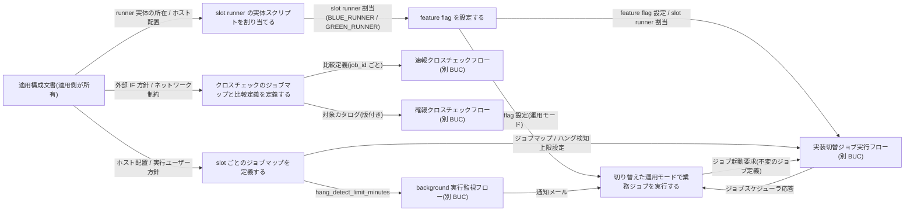
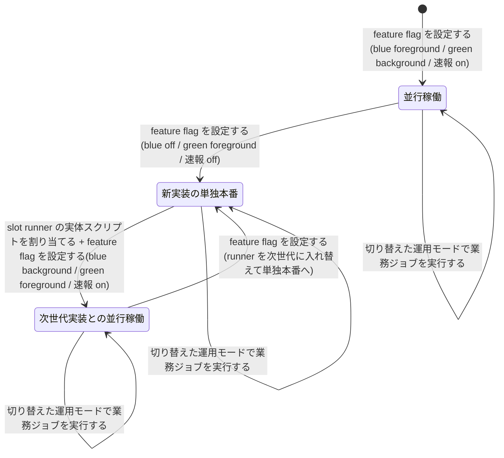

# 適用構成定義フロー

## 概要

基盤適用設計者が、feature flag 設定(slot ごとの実行モード・runner 割当・RAPID_CROSSCHECK_MODE)、slot runner の実体スクリプト、slot ごとのジョブマップ、クロスチェックのジョブマップ(比較定義・対象カタログ)を設定所有区分に従って定義し、`validate-config.sh` で検証する。運用者はジョブスケジューラのジョブ定義を変更せずに、並行稼働・新実装の単独本番・次世代実装との並行稼働の各運用モードで業務ジョブを実行し、その応答と通知を受け取る。案件固有事項(外部 IF 方針・ネットワーク制約・ホスト配置)は適用構成文書に置き、relay-gate のスクリプトは変更しない。

## 所属 UC 一覧

| UC名 | アクター | 主な操作 | 関連情報 |
|------|---------|---------|---------|
| [feature flag を設定する](feature%20flag%20を設定する/spec.md) | 基盤適用設計者(提供者) | BLUE_MODE / GREEN_MODE(foreground / background / off)、BLUE_RUNNER / GREEN_RUNNER、RAPID_CROSSCHECK_MODE(on / off)を env 形式で定義し `validate-config.sh --feature-flag` で検証する。両 slot foreground は拒否 | feature flag 設定、slot runner 割当 |
| [slot runner の実体スクリプトを割り当てる](slot%20runner%20の実体スクリプトを割り当てる/spec.md) | 基盤適用設計者(提供者)/ 現行実装・新実装(外部) | 起動方式・ホスト・OS・プロトコルを閉じ込めた runner 実体を BLUE_RUNNER / GREEN_RUNNER に割り当てる。runner IF と Runner Result Contract への適合を検証する | slot runner 割当、feature flag 設定、適用構成文書 |
| [slot ごとのジョブマップを定義する](slot%20ごとのジョブマップを定義する/spec.md) | 基盤適用設計者(提供者)/ リモート実行ホスト(外部) | slot ごとに JOB_ID → ホスト・実行ユーザー・スクリプト・作業ディレクトリ・固定引数(JSON 配列)・hang_detect_limit_minutes・認証情報参照名・版を TSV で定義し `validate-config.sh --job-map` で検証する | ジョブマップ、ハング検知上限設定、適用構成文書 |
| [クロスチェックのジョブマップと比較定義を定義する](クロスチェックのジョブマップと比較定義を定義する/spec.md) | 基盤適用設計者(提供者)/ 比較ツール(外部) | 速報用の job_id ごとの比較定義と確報用の対象カタログ(版付き)を定義し `validate-config.sh --crosscheck-job-map` / `--target-catalog` で検証する。終了コード契約(0 / 3 / 6)への適合を含む | クロスチェックジョブマップ、比較定義、対象カタログ、適用構成文書 |
| [切り替えた運用モードで業務ジョブを実行する](切り替えた運用モードで業務ジョブを実行する/spec.md) | 運用者(受益者)/ ジョブスケジューラ・メール通知(外部) | 定義済みの設定に基づき、ジョブ定義を変更せずに各運用モードで業務ジョブを実行し、ジョブスケジューラ応答と通知メールを受け取る。読む UC で状態を変更しない | feature flag 設定、ジョブ起動要求、ジョブスケジューラ応答、通知メール |

feature flag / runner 割当 / slot ジョブマップ / 運用は tier-facade、クロスチェック定義は tier-rapid-crosscheck と tier-final-crosscheck で検証・利用する。

## UC 横断データフロー

BUC 内の UC 間で情報がどう流れるかを示す。情報がどの UC で作成(C)・参照(R)・更新(U)されるかを明記する。この BUC は設定ファイルの定義・検証が中心で、RDB には触れない。

### データフロー図

### 情報 CRUD マトリクス

列の UC は feature flag → runner 割当 → slot ジョブマップ → クロスチェック定義 → 運用の順。`R(間接)` は relay-gate が読まず、定義の根拠としてだけ参照することを示す。

| 情報名 | feature flag を設定する | slot runner の実体スクリプトを割り当てる | slot ごとのジョブマップを定義する | クロスチェックのジョブマップと比較定義を定義する | 切り替えた運用モードで業務ジョブを実行する |
|--------|:---:|:---:|:---:|:---:|:---:|
| feature flag 設定 | C / U | U(BLUE_RUNNER / GREEN_RUNNER) | - | - | R |
| slot runner 割当 | R | C / U | - | - | - |
| ジョブマップ | - | - | C / U | - | - |
| ハング検知上限設定 | - | - | C / U | - | - |
| クロスチェックジョブマップ | - | - | - | C / U | - |
| 比較定義 | - | - | - | C / U | - |
| 対象カタログ | - | - | - | C / U | - |
| 適用構成文書 | - | R(間接) | R(間接) | R(間接) | - |
| ジョブ起動要求 | - | - | - | - | R |
| ジョブスケジューラ応答 | - | - | - | - | R |
| 通知メール | - | - | - | - | R |

## 状態遷移全体図

この BUC の UC は状態を遷移させない(状態.tsv にこの BUC の UC を遷移 UC とする行は無い)。設定を読む遷移は各 BUC の buc-spec を参照する。

- [実装切替ジョブ実行フロー](../../実装切替業務/実装切替ジョブ実行フロー/buc-spec.md): feature flag 設定・slot runner 割当・ジョブマップを読む(並行稼働実行 / slot 実行 / 速報実行の完了状況)
- [速報クロスチェックフロー](../../クロスチェック業務/速報クロスチェックフロー/buc-spec.md): 比較定義を読む(クロスチェック依頼・速報)
- [確報クロスチェックフロー](../../クロスチェック業務/確報クロスチェックフロー/buc-spec.md): 対象カタログを読む(クロスチェック依頼・確報)
- [background 実行監視フロー](../../実行監視業務/background%20実行監視フロー/buc-spec.md): hang_detect_limit_minutes を読む(監視状態)

### 運用モード切替の参考図(RDRA 状態モデルではない)

feature flag の組合せで表現する運用モードの切り替え順序を示す。

## BUC 内共有条件一覧

BUC 内の複数 UC で共有される条件の一覧。分母は BUC.tsv でこの BUC に紐づく条件。

| 条件名 | 条件の説明 | 適用 UC |
|--------|----------|--------|
| 設定所有区分 | 実装スロットと runner の割当は feature flag が、実行先とハング検知上限は slot のジョブマップが、比較対象と対象カタログはクロスチェックのジョブマップが、外部 IF 方針・ネットワーク制約・ホスト配置は適用文書が所有する | feature flag を設定する, slot runner の実体スクリプトを割り当てる, slot ごとのジョブマップを定義する, クロスチェックのジョブマップと比較定義を定義する, 切り替えた運用モードで業務ジョブを実行する |
| foreground slot 排他 | blue と green の両方が foreground の構成は許可しない。foreground × foreground の組合せのみ拒否する | feature flag を設定する, 切り替えた運用モードで業務ジョブを実行する |
| facade の責務限定 | ジョブスケジューラは facade に JOB_ID [PARAM...] だけを渡す。facade は比較対象や実装固有の起動方式を判断せず、slot と mode の選択と foreground 結果の応答だけを行う | slot runner の実体スクリプトを割り当てる, 切り替えた運用モードで業務ジョブを実行する |

## BUC 内共有バリエーション一覧

BUC 内の複数 UC で共有されるバリエーションの一覧(UC spec のバリエーション一覧を集約)。

| バリエーション名 | 値 | 適用 UC |
|----------------|---|--------|
| 設定所有区分 | feature flag、slot ジョブマップ、クロスチェックジョブマップ、適用文書 | feature flag を設定する, slot runner の実体スクリプトを割り当てる, slot ごとのジョブマップを定義する, クロスチェックのジョブマップと比較定義を定義する, 切り替えた運用モードで業務ジョブを実行する |
| 実装スロット | blue、green | feature flag を設定する, slot runner の実体スクリプトを割り当てる, slot ごとのジョブマップを定義する, 切り替えた運用モードで業務ジョブを実行する |
| 運用モード | 並行稼働、新実装の単独本番、次世代実装との並行稼働 | feature flag を設定する, slot runner の実体スクリプトを割り当てる, 切り替えた運用モードで業務ジョブを実行する |
| slot 実行モード | foreground、background、off | feature flag を設定する, 切り替えた運用モードで業務ジョブを実行する |
| 速報クロスチェックモード | on、off | feature flag を設定する, 切り替えた運用モードで業務ジョブを実行する |
