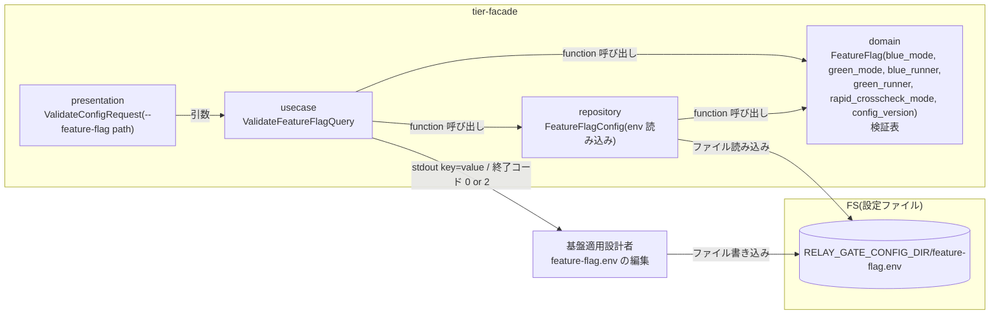
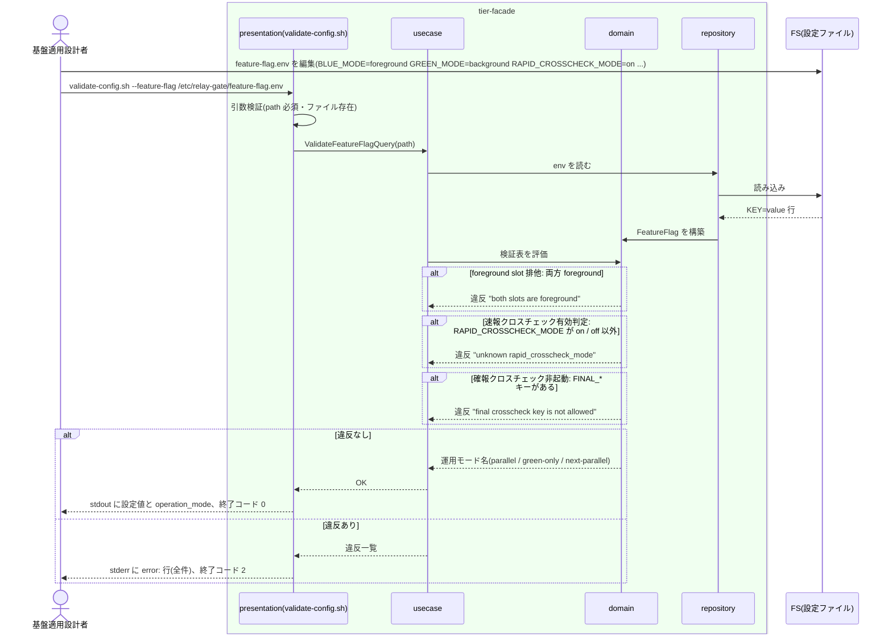

# feature flag を設定する

## 概要

基盤適用設計者が、slot(blue / green)ごとの実行モード(foreground / background / off)、runner 実体スクリプト、`RAPID_CROSSCHECK_MODE`(on / off)を feature flag 設定(env 形式)として定義し、`validate-config.sh --feature-flag <path>` で検証する。両 slot が foreground にならない組合せで並行稼働・単独本番・次世代実装との並行稼働を表現し、ジョブスケジューラのジョブ定義を改修せずに運用モードを切り替える。確報クロスチェックの制御は feature flag に含めない。

## データフロー



| レイヤー | データモデル | 変換内容 |
|---------|------------|---------|
| presentation | ValidateConfigRequest | `--feature-flag <path>` の引数検証。検証結果を終了コード 0 / 2 へ |
| usecase | ValidateFeatureFlagQuery | ファイル読み込み → 検証表の全項目を評価 → 違反を全件収集(最初の 1 件で止めない)→ 結果出力 |
| domain | FeatureFlag | キーの列挙・必須・foreground 排他・foreground 存在・runner 実行可否・運用モード名の導出(純粋関数) |
| repository | FeatureFlagConfig | env 形式(`KEY=value`、`#` コメント、空行)の読み込み。シェル展開は行わない |

## 処理フロー



## バリエーション一覧

| バリエーション名 | 値 | 処理内容 | 適用 tier | 適用箇所 |
|----------------|---|---------|----------|---------|
| 実装スロット | blue | `BLUE_MODE` / `BLUE_RUNNER` | tier-facade | domain `FeatureFlag` |
| 実装スロット | green | `GREEN_MODE` / `GREEN_RUNNER` | tier-facade | domain `FeatureFlag` |
| slot 実行モード | foreground | 同時に 1 slot だけ許可。対応する runner が必須 | tier-facade | domain `validate_feature_flag` |
| slot 実行モード | background | 許可。対応する runner が必須 | tier-facade | domain `validate_feature_flag` |
| slot 実行モード | off | 許可。runner の検証をスキップ | tier-facade | domain `validate_feature_flag` |
| 運用モード | 並行稼働 | foreground / background / on → `operation_mode=parallel` | tier-facade | domain `derive_operation_mode` |
| 運用モード | 新実装の単独本番 | off / foreground / off → `operation_mode=green-only` | tier-facade | domain `derive_operation_mode` |
| 運用モード | 次世代実装との並行稼働 | background / foreground / on → `operation_mode=next-parallel` | tier-facade | domain `derive_operation_mode` |
| 速報クロスチェックモード | on | 管理 DB 接続設定の存在を警告レベルで確認(`warn:`。検証は失敗にしない。仮採用) | tier-facade | domain `validate_feature_flag` |
| 速報クロスチェックモード | off | 管理 DB 不要 | tier-facade | domain `validate_feature_flag` |
| 設定所有区分 | feature flag | 実装スロットと runner の割当の正本 | tier-facade | repository `feature_flag_config` |

## 分岐条件一覧

| 条件名 | 判定ルール | 適用 tier | 適用箇所 | BDD Scenario |
|--------|----------|----------|---------|-------------|
| foreground slot 排他 | `BLUE_MODE=foreground` かつ `GREEN_MODE=foreground` は検証 NG(終了コード 2)。表: 縦 blue × 横 green で foreground × foreground のみ拒否 | tier-facade | domain `validate_feature_flag` | 両 slot foreground の feature flag は検証で拒否される(SPEC-001-02) |
| 設定所有区分 | feature flag には実装スロット・runner・RAPID_CROSSCHECK_MODE・設定版だけを置く。実行先・ハング検知上限・比較対象は置かない(ジョブマップ / クロスチェックジョブマップの所有)。未知のキーは `warn:`(拒否しない。仮採用: 適用側の拡張を許す) | tier-facade | domain `validate_feature_flag` | 並行稼働モードの feature flag を検証する |
| 速報クロスチェック有効判定 | `RAPID_CROSSCHECK_MODE` は on / off の 2 値。方針資料の旧値 `background` / `foreground` は受け付けない(矛盾 2 を参照) | tier-facade | domain `validate_feature_flag` | RAPID_CROSSCHECK_MODE の列挙外は拒否される |
| 確報クロスチェック非起動 | `FINAL_CROSSCHECK_MODE` 等の確報制御キーがあれば検証 NG(`error: final crosscheck key is not allowed key=FINAL_CROSSCHECK_MODE`) | tier-facade | domain `validate_feature_flag` | 確報の制御キーは拒否される(SPEC-001-01) |

## 計算ルール一覧

| 計算名 | 入力情報 | 計算式/ロジック | 出力情報 | 適用 tier |
|--------|---------|---------------|---------|----------|
| 運用モード名 | BLUE_MODE、GREEN_MODE、RAPID_CROSSCHECK_MODE | (foreground, background, on) → parallel / (off, foreground, off) → green-only / (background, foreground, on) → next-parallel / それ以外の有効な組合せ → custom | operation_mode | tier-facade |
| foreground 数 | BLUE_MODE、GREEN_MODE | foreground の個数。2 → 排他違反、0 → `error: no foreground slot`、1 → OK | 検証結果 | tier-facade |

## 状態遷移一覧

| 状態モデル | 遷移元 | 遷移先 | トリガー | 事前条件 | 事後処理 | 適用 tier |
|-----------|--------|--------|---------|---------|---------|----------|
| 該当なし | — | — | 設定 UC。状態を遷移させない | — | — | — |

## 関連 RDRA モデル

| モデル種別 | 要素名 | 関連 |
|-----------|--------|------|
| 業務 | 適用構成業務 | この UC が属する業務 |
| BUC | 適用構成定義フロー | この UC を含む BUC |
| アクター | 基盤適用設計者 | 提供者(定義する) |
| 情報 | feature flag 設定 | 定義対象 |
| 情報 | slot runner 割当 | BLUE_RUNNER / GREEN_RUNNER(詳細は UC「slot runner の実体スクリプトを割り当てる」) |
| 条件 | foreground slot 排他 / 設定所有区分 / 速報クロスチェック有効判定 / 確報クロスチェック非起動 | 分岐条件一覧を参照 |
| 画面 | feature flag 設定検証出力(→ CLI 出力) | validate-config.sh の stdout / stderr / 終了コード |

## 関連 USDM

| REQ ID | SPEC ID | 対応 BDD Scenario |
|---|---|---|
| REQ-001 | SPEC-001-01 | 並行稼働モードの feature flag を検証する / 確報の制御キーは拒否される |
| REQ-001 | SPEC-001-02 | 両 slot foreground の feature flag は検証で拒否される |
| REQ-001 | SPEC-001-03 | 単独本番モードの feature flag を検証する / 次世代並行稼働モードの feature flag を検証する |
| REQ-005 | SPEC-005-04 | 単独本番モードの feature flag を検証する(定義側。AC の実行側「off では管理 DB に触れない」は UC〈slot 実行モードを選択して runner を起動する〉の Scenario「RAPID_CROSSCHECK_MODE=off では管理 DB に触れない」で覆う) |

## E2E 完了条件(BDD)

### 正常系

```gherkin
Feature: feature flag を設定する

  Scenario: 並行稼働モードの feature flag を検証する(SPEC-001-01)
    Given /etc/relay-gate/feature-flag.env に BLUE_MODE=foreground GREEN_MODE=background RAPID_CROSSCHECK_MODE=on BLUE_RUNNER=/opt/relay-gate/runners/blue-runner.sh GREEN_RUNNER=/opt/relay-gate/runners/green-runner.sh CONFIG_VERSION=cfg-v1 がある
    And 両 runner は実行可能ファイルで、--help に "runner-if-version=1" を返す
    And /etc/relay-gate/blue-job-map.tsv と /etc/relay-gate/green-job-map.tsv が存在する
    When 基盤適用設計者が validate-config.sh --feature-flag /etc/relay-gate/feature-flag.env を実行する
    Then 終了コード 0 で終了する
    And stdout に blue_mode=foreground green_mode=background rapid_crosscheck_mode=on config_version=cfg-v1 operation_mode=parallel が出る

  Scenario: 単独本番モードの feature flag を検証する(SPEC-001-03)
    Given feature-flag.env に BLUE_MODE=off GREEN_MODE=foreground RAPID_CROSSCHECK_MODE=off GREEN_RUNNER=/opt/relay-gate/runners/green-runner.sh がある
    And BLUE_RUNNER は未設定である
    And green runner は実行可能で --help に "runner-if-version=1" を返し、/etc/relay-gate/green-job-map.tsv が存在する
    When validate-config.sh --feature-flag を実行する
    Then 終了コード 0 で stdout に operation_mode=green-only が出る

  Scenario: 次世代並行稼働モードの feature flag を検証する(SPEC-001-03)
    Given feature-flag.env に BLUE_MODE=background GREEN_MODE=foreground RAPID_CROSSCHECK_MODE=on BLUE_RUNNER=/opt/relay-gate/runners/blue-runner.sh GREEN_RUNNER=/opt/relay-gate/runners/green-runner.sh がある
    And 両 runner は実行可能で --help に "runner-if-version=1" を返し、/etc/relay-gate/blue-job-map.tsv と green-job-map.tsv が存在する
    When validate-config.sh --feature-flag を実行する
    Then 終了コード 0 で stdout に operation_mode=next-parallel が出る

  Scenario: ジョブ定義を変えずに feature flag だけで運用モードを切り替える(SPEC-001-03)
    Given ジョブスケジューラのジョブ定義は facade.sh JOB001 のままである
    And feature-flag.env を並行稼働から単独本番の組合せへ変更し validate-config.sh が終了コード 0 を返した
    When ジョブスケジューラが facade.sh JOB001 を実行する
    Then green の結果が返り、blue は起動されず、管理 DB へ接続しない
```

### 異常系

```gherkin
  Scenario: 両 slot foreground の feature flag は検証で拒否される(SPEC-001-02)
    Given feature-flag.env に BLUE_MODE=foreground GREEN_MODE=foreground がある
    When validate-config.sh --feature-flag を実行する
    Then 終了コード 2 で stderr に "error: both slots are foreground blue_mode=foreground green_mode=foreground" が出る

  Scenario: RAPID_CROSSCHECK_MODE の列挙外は拒否される
    Given feature-flag.env に RAPID_CROSSCHECK_MODE=background がある
    When validate-config.sh --feature-flag を実行する
    Then 終了コード 2 で stderr に "error: unknown rapid_crosscheck_mode value=background" と "hint: use on or off" が出る

  Scenario: 確報の制御キーは拒否される(SPEC-001-01)
    Given feature-flag.env に FINAL_CROSSCHECK_MODE=on がある
    When validate-config.sh --feature-flag を実行する
    Then 終了コード 2 で stderr に "error: final crosscheck key is not allowed key=FINAL_CROSSCHECK_MODE" が出る

  Scenario: 違反は全件まとめて報告される
    Given feature-flag.env に BLUE_MODE=parallel GREEN_MODE=foreground RAPID_CROSSCHECK_MODE=maybe がある
    When validate-config.sh --feature-flag を実行する
    Then 終了コード 2 で stderr に "error: unknown slot mode slot=blue mode=parallel" と "error: unknown rapid_crosscheck_mode value=maybe" の両方が出る
```

## ティア別仕様

- [facade / slot runner ティア](tier-facade.md)

### 統合契約

- [CLI コマンド契約](../../../_cross-cutting/api/cli-command-contract.yaml)(`validate-config.sh --feature-flag` を defines)
- [AsyncAPI Spec](../../../_cross-cutting/api/asyncapi.yaml)(この UC は publish / subscribe しない)
- 読み手: [slot 実行モードを選択して runner を起動する](../../../実装切替業務/実装切替ジョブ実行フロー/slot%20実行モードを選択して%20runner%20を起動する/spec.md)
