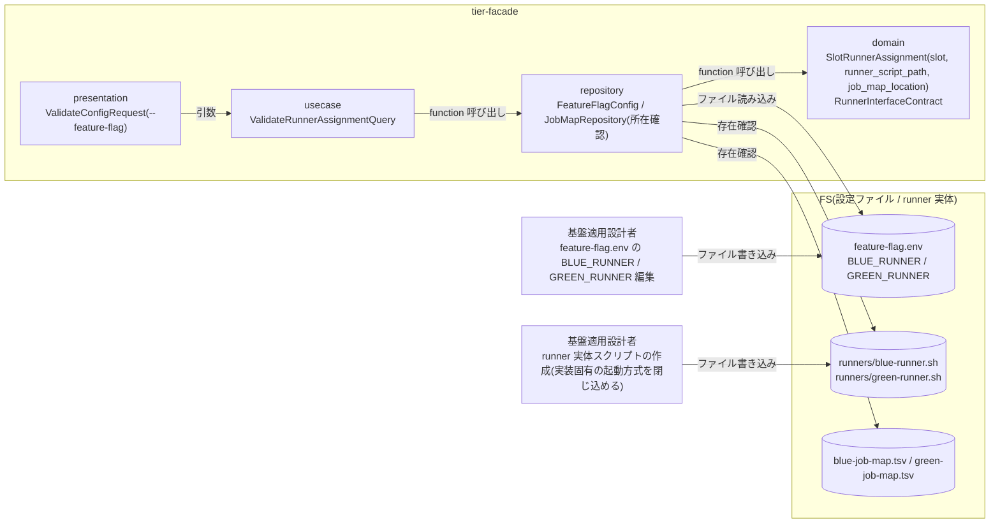
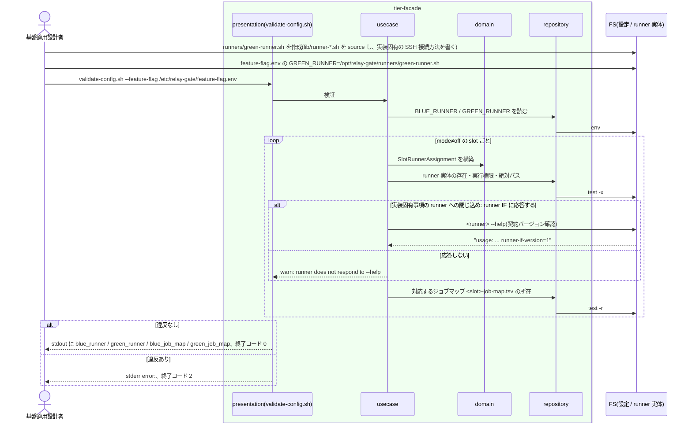

# slot runner の実体スクリプトを割り当てる

## 概要

基盤適用設計者が、blue / green slot に現行実装・新実装・次世代実装の起動方式・ホスト・OS・プロトコルを閉じ込めた runner 実体スクリプトを `BLUE_RUNNER` / `GREEN_RUNNER` で割り当てる。runner 実体は relay-gate が定める **runner IF**(引数)と **Runner Result Contract**(成果物)に従う。runner の差し替えだけで、facade と比較規約を変更せずに異なる世代の実装を並行稼働できる。

## データフロー



| レイヤー | データモデル | 変換内容 |
|---------|------------|---------|
| presentation | ValidateConfigRequest | `--feature-flag` の検証(UC「feature flag を設定する」と同じ入口)。runner 割当の検証項目は本 UC が追加する |
| usecase | ValidateRunnerAssignmentQuery | runner パスの存在・実行権限・絶対パス、対応するジョブマップの所在、runner IF への応答(`--help` で契約バージョンを返す。仮採用)を確認 |
| domain | SlotRunnerAssignment / RunnerInterfaceContract | slot → runner_script_path → job_map_location の対応。runner IF の契約定義 |
| repository | FeatureFlagConfig / JobMapRepository | env 読み込み、`<slot>-job-map.tsv` の存在確認 |
| 共通ライブラリ | lib/runner-*.sh | runner 実体が `source` する relay-gate 提供の関数群(ジョブマップ解決・execution-spec 保存・3 ファイル公開・完了通知)。実装固有部分(SSH の接続方法・OS 差異)は runner 実体側に置く |

## 処理フロー



## バリエーション一覧

| バリエーション名 | 値 | 処理内容 | 適用 tier | 適用箇所 |
|----------------|---|---------|----------|---------|
| 実装スロット | blue | `BLUE_RUNNER` に現行実装(または前世代)の runner を割り当てる | tier-facade | domain `SlotRunnerAssignment` |
| 実装スロット | green | `GREEN_RUNNER` に新実装(または次世代)の runner を割り当てる | tier-facade | domain `SlotRunnerAssignment` |
| 設定所有区分 | feature flag | runner の割当を所有 | tier-facade | repository `feature_flag_config` |
| 設定所有区分 | 適用文書 | runner 実体の所在・ホスト配置・実行ユーザー方針を記述(relay-gate は読まない) | — | — |
| 運用モード | 並行稼働 / 新実装の単独本番 / 次世代実装との並行稼働 | 世代交代時は green の runner を次世代実装用に差し替え、blue に旧 green の runner を割り当てる(runner 差し替えだけで facade は変更しない) | tier-facade | feature-flag.env |

## 分岐条件一覧

| 条件名 | 判定ルール | 適用 tier | 適用箇所 | BDD Scenario |
|--------|----------|----------|---------|-------------|
| 実装固有事項の runner への閉じ込め | runner 実体は runner IF を受け、Runner Result Contract を出力する。SSH の接続方法・OS 差異・プロトコルは runner 実体内に閉じる。facade / 速報 / 確報 / 監視 / 復旧のスクリプトは runner の差し替えで変更しない。検証では runner IF(`--help` の応答)を確認する(仮採用) | tier-facade | domain `RunnerInterfaceContract` / usecase `validate_runner_assignment` | runner 実体を差し替えても facade は変更不要である(SPEC-001-04) |
| facade の責務限定 | facade は `$BLUE_RUNNER` / `$GREEN_RUNNER` を runner IF で起動するだけ。実装固有の起動方式を判断しない | tier-facade | gateway `runner_process_adapter` | runner 実体を差し替えても facade は変更不要である |
| 設定所有区分 | runner の割当は feature flag が所有。runner 実体の所在は適用文書が記述 | tier-facade | repository `feature_flag_config` | runner 割当を検証する |

## 計算ルール一覧

| 計算名 | 入力情報 | 計算式/ロジック | 出力情報 | 適用 tier |
|--------|---------|---------------|---------|----------|
| ジョブマップ所在 | slot | `$RELAY_GATE_CONFIG_DIR/<slot>-job-map.tsv`(仮採用) | job_map_location | tier-facade |

## 状態遷移一覧

| 状態モデル | 遷移元 | 遷移先 | トリガー | 事前条件 | 事後処理 | 適用 tier |
|-----------|--------|--------|---------|---------|---------|----------|
| 該当なし | — | — | 設定 UC。状態を遷移させない | — | — | — |

## 関連 RDRA モデル

| モデル種別 | 要素名 | 関連 |
|-----------|--------|------|
| 業務 | 適用構成業務 | この UC が属する業務 |
| BUC | 適用構成定義フロー | この UC を含む BUC |
| アクター | 基盤適用設計者 | 提供者 |
| 情報 | slot runner 割当 | 定義対象 |
| 情報 | feature flag 設定 | BLUE_RUNNER / GREEN_RUNNER の所有元 |
| 情報 | 適用構成文書 | 属性: 案件識別 / 外部 IF の送受信方針 / ネットワーク制約 / ホスト配置 / 実行ユーザー方針 / DB セグメント構成 / runner 実体の所在 / 文書版。本 UC は「runner 実体の所在」「ホスト配置」を割当の根拠とし、runner が接続する管理 DB・業務 DB の接続設定の根拠として「DB セグメント構成」を参照する。「文書版」は適用構成文書側で版管理し、relay-gate は読み込まない |
| 条件 | 実装固有事項の runner への閉じ込め / facade の責務限定 / 設定所有区分 | 分岐条件一覧を参照 |
| 画面 | slot runner 割当検証出力(→ CLI 出力) | validate-config.sh の stdout / stderr / 終了コード |
| イベント | 現行実装 runner の割当 / 新実装 runner の割当 | 割当 |
| 外部システム | 現行実装(blue) / 新実装(green) | runner が起動する実装 |

## 関連 USDM

| REQ ID | SPEC ID | 対応 BDD Scenario |
|---|---|---|
| REQ-001 | SPEC-001-04 | runner 割当を検証する / runner 実体を差し替えても facade は変更不要である |
| REQ-002 | SPEC-002-03 | runner 実体を差し替えても facade は変更不要である |
| REQ-013 | SPEC-013-01 | runner 実体を差し替えても facade は変更不要である |

## E2E 完了条件(BDD)

### 正常系

```gherkin
Feature: slot runner の実体スクリプトを割り当てる

  Scenario: runner 割当を検証する(SPEC-001-04)
    Given /opt/relay-gate/runners/blue-runner.sh と /opt/relay-gate/runners/green-runner.sh が実行可能で、--help に "runner-if-version=1" を返す
    And /etc/relay-gate/blue-job-map.tsv と green-job-map.tsv が存在する
    And feature-flag.env に BLUE_MODE=foreground GREEN_MODE=background BLUE_RUNNER=/opt/relay-gate/runners/blue-runner.sh GREEN_RUNNER=/opt/relay-gate/runners/green-runner.sh がある
    When 基盤適用設計者が validate-config.sh --feature-flag /etc/relay-gate/feature-flag.env を実行する
    Then 終了コード 0 で stdout に "blue_runner: /opt/relay-gate/runners/blue-runner.sh" "green_runner: /opt/relay-gate/runners/green-runner.sh" "blue_job_map: /etc/relay-gate/blue-job-map.tsv" "green_job_map: /etc/relay-gate/green-job-map.tsv" が出る

  Scenario: runner 実体を差し替えても facade は変更不要である(SPEC-001-04)
    Given 並行稼働モードで green runner が新実装 green-1.x 用である
    And 次世代実装用の runner /opt/relay-gate/runners/green-next-runner.sh を作成し、runner IF と Runner Result Contract に従う
    When feature-flag.env の GREEN_RUNNER を /opt/relay-gate/runners/green-next-runner.sh に変更し validate-config.sh が終了コード 0 を返した後、ジョブスケジューラが facade.sh JOB001 を実行する
    Then facade.sh・rapid-crosscheck-runner.sh・hang-detector.sh・background-rerun.sh・abort-green.sh のファイルは変更されていない
    And green/ に Runner Result の 3 ファイルが揃う

  Scenario: facade は設定された runner を runner IF で起動するだけである(SPEC-002-03)
    Given feature-flag.env に BLUE_MODE=foreground BLUE_RUNNER=<Runner Result 3 ファイルを書くスタブ runner> GREEN_MODE=background RAPID_CROSSCHECK_MODE=off がある
    And GREEN_RUNNER に起動引数を記録するスタブ runner を割り当てた
    And 両スタブは --help で "runner-if-version=1" を返し、両 slot のジョブマップに JOB001 の行がある
    When ジョブスケジューラが facade.sh JOB001 x y を実行する
    Then スタブは "--run-id <run_id> --job-id JOB001 --role green --mode background -- x y" で起動され、facade は実装固有の引数を追加していない
```

### 異常系

```gherkin
  Scenario: runner 実体が存在しない割当は拒否される
    Given feature-flag.env に GREEN_MODE=background GREEN_RUNNER=/opt/relay-gate/runners/missing.sh がある
    When validate-config.sh --feature-flag を実行する
    Then 終了コード 2 で stderr に "error: runner not executable slot=green path=/opt/relay-gate/runners/missing.sh" が出る

  Scenario: 対応するジョブマップが無い割当は拒否される
    Given feature-flag.env に GREEN_MODE=background GREEN_RUNNER=<実行可能> があり /etc/relay-gate/green-job-map.tsv が無い
    When validate-config.sh --feature-flag を実行する
    Then 終了コード 2 で stderr に "error: job map not found slot=green map=/etc/relay-gate/green-job-map.tsv" が出る

  Scenario: runner IF に応答しない実体は警告される
    Given GREEN_RUNNER が --help に "runner-if-version=" を含まない実行可能ファイルである
    When validate-config.sh --feature-flag を実行する
    Then 終了コード 0 で stderr に "warn: runner does not respond to --help slot=green runner=<path>" が出る
    And stdout の green_runner_if_version は "-" である
```

## ティア別仕様

- [facade / slot runner ティア](tier-facade.md)

### 統合契約

- [CLI コマンド契約](../../../_cross-cutting/api/cli-command-contract.yaml)(runner IF を defines、`validate-config.sh --feature-flag` を uses)
- [AsyncAPI Spec](../../../_cross-cutting/api/asyncapi.yaml)(runner 実体が publish する `slot-completed` は UC「速報クロスチェック runner へ完了通知を送信する」)
- 関連: [feature flag を設定する](../feature%20flag%20を設定する/spec.md) / [実装スクリプトを実行して Runner Result を出力する](../../../実装切替業務/実装切替ジョブ実行フロー/実装スクリプトを実行して%20Runner%20Result%20を出力する/spec.md)
