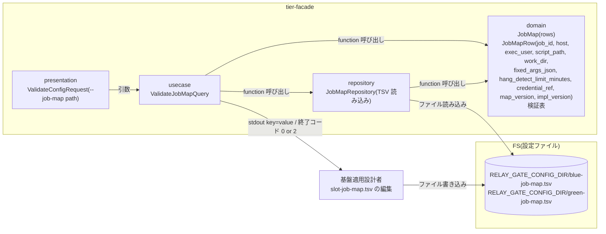
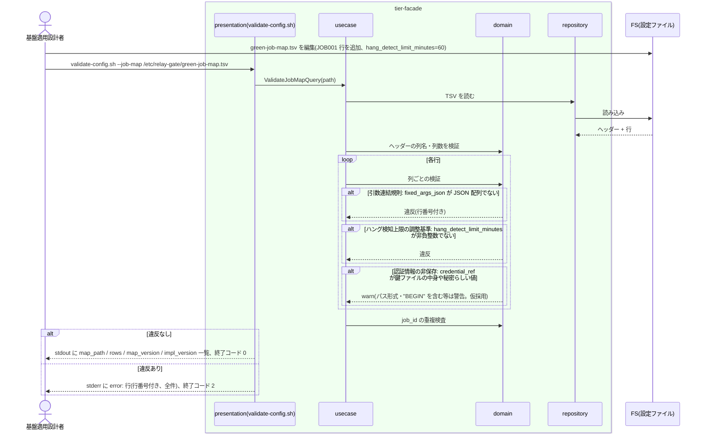

# slot ごとのジョブマップを定義する

## 概要

基盤適用設計者が、slot(blue / green)ごとに JOB_ID から解決するホスト・実行ユーザー・スクリプト・作業ディレクトリ・固定引数(JSON 配列)・hang_detect_limit_minutes(導入時 60 分、foreground role は 0)・認証情報参照名・マップ版・実装版を slot ジョブマップ(TSV)として定義し、`validate-config.sh --job-map <path>` で検証する。認証情報は参照名で指定し、ジョブスケジューラ側のジョブ定義には実行先を持たせない。

## データフロー



| レイヤー | データモデル | 変換内容 |
|---------|------------|---------|
| presentation | ValidateConfigRequest | `--job-map <path>` の引数検証 |
| usecase | ValidateJobMapQuery | TSV 読み込み → ヘッダー検証 → 行ごとの列検証 → job_id 重複検査 → 集計出力 |
| domain | JobMap / JobMapRow | 列ごとの型・必須・値域の検証表(純粋関数)。fixed_args_json の JSON 配列判定、hang_detect_limit_minutes の非負整数判定、絶対パス判定 |
| repository | JobMapRepository | ヘッダー行付き TSV の読み込み(UC「ジョブマップで JOB_ID から実行先を解決する」と同じ関数) |

## 処理フロー



## バリエーション一覧

| バリエーション名 | 値 | 処理内容 | 適用 tier | 適用箇所 |
|----------------|---|---------|----------|---------|
| 実装スロット | blue | `blue-job-map.tsv` | tier-facade | repository `job_map_repo` |
| 実装スロット | green | `green-job-map.tsv` | tier-facade | repository `job_map_repo` |
| 設定所有区分 | slot ジョブマップ | ホスト・実行ユーザー・スクリプト・作業ディレクトリ・固定引数・hang_detect_limit_minutes・認証情報参照名の正本 | tier-facade | domain `JobMapRow` |
| 設定所有区分 | 適用文書 | ホスト配置・実行ユーザー方針の根拠(relay-gate は読まない) | — | — |
| ハング検知上限設定 | 60 分(導入時既定) | 導入時は全行 60 を推奨。検証は値域のみ(推奨値との差は `info:`) | tier-facade | domain `validate_job_map_row` |
| ハング検知上限設定 | ジョブごとの調整値 | 0 以上の整数 | tier-facade | domain `validate_job_map_row` |
| ハング検知上限設定 | 0(検知対象外) | foreground で動く slot の行に設定する。検証は値域のみ | tier-facade | domain `validate_job_map_row` |

## 分岐条件一覧

| 条件名 | 判定ルール | 適用 tier | 適用箇所 | BDD Scenario |
|--------|----------|----------|---------|-------------|
| 設定所有区分 | ジョブマップの列は上記 10 列だけ。runner・mode・比較対象の列は置かない(列名が一致しないヘッダーは検証 NG) | tier-facade | domain `validate_job_map_header` | ヘッダー列が契約と一致しないジョブマップは拒否される |
| ジョブマップ解決条件 | job_id は行内で一意(重複は検証 NG)。job_id は `^[A-Za-z0-9_-]+$` | tier-facade | domain `validate_job_map` | job_id が重複するジョブマップは拒否される |
| 引数連結規則 | fixed_args_json は JSON 配列(文字列要素のみ)。空は `[]`。要素内の空白・カンマは許可 | tier-facade | domain `validate_job_map_row` | 固定引数が JSON 配列でない行は拒否される(SPEC-004-02) |
| 認証情報の非保存 | credential_ref は参照名(`^[A-Za-z0-9_.-]+$`)。パス形式(`/` を含む)や `BEGIN` を含む値は `warn: credential_ref looks like a secret or path`(拒否はしない。仮採用) | tier-facade | domain `validate_job_map_row` | 認証情報らしい値は警告される |
| ハング検知上限の調整基準 | hang_detect_limit_minutes は `^[0-9]+$`。変更は次回以降の run の execution-spec.json にのみ反映される(実行中の run には影響しない) | tier-facade | domain `validate_job_map_row` | hang_detect_limit_minutes の変更は次回以降の run に反映される(SPEC-008-05) |

## 計算ルール一覧

| 計算名 | 入力情報 | 計算式/ロジック | 出力情報 | 適用 tier |
|--------|---------|---------------|---------|----------|
| 行数集計 | TSV | コメント・空行を除くデータ行数 | rows | tier-facade |
| 版の集計 | map_version、impl_version 列 | 全行の distinct 値。複数あれば `warn: mixed map_version values=...`(仮採用: 1 ファイル 1 版を推奨) | map_version / impl_version | tier-facade |

## 状態遷移一覧

| 状態モデル | 遷移元 | 遷移先 | トリガー | 事前条件 | 事後処理 | 適用 tier |
|-----------|--------|--------|---------|---------|---------|----------|
| 該当なし | — | — | 設定 UC。状態を遷移させない | — | — | — |

## 関連 RDRA モデル

| モデル種別 | 要素名 | 関連 |
|-----------|--------|------|
| 業務 | 適用構成業務 | この UC が属する業務 |
| BUC | 適用構成定義フロー | この UC を含む BUC |
| アクター | 基盤適用設計者 | 提供者 |
| 情報 | ジョブマップ | 定義対象 |
| 情報 | ハング検知上限設定 | hang_detect_limit_minutes 列 |
| 情報 | 適用構成文書 | ホスト配置・実行ユーザー方針の根拠 |
| 条件 | 設定所有区分 / ジョブマップ解決条件 / 引数連結規則 / 認証情報の非保存 / ハング検知上限の調整基準 | 分岐条件一覧を参照 |
| 画面 | slot ジョブマップ検証出力(→ CLI 出力) | validate-config.sh の stdout / stderr / 終了コード |
| イベント | 実行先ホスト接続の定義 | host / exec_user / credential_ref |
| 外部システム | リモート実行ホスト(SSH) | 接続先の定義 |

## 関連 USDM

| REQ ID | SPEC ID | 対応 BDD Scenario |
|---|---|---|
| REQ-004 | SPEC-004-01 | 有効なジョブマップを検証する |
| REQ-004 | SPEC-004-02 | 固定引数が JSON 配列でない行は拒否される(定義側。AC「固定引数の後ろに PARAM を順序保持で連結」の実行側は UC〈ジョブマップで JOB_ID から実行先を解決する〉の Scenario「固定引数の後ろに PARAM を順序保持で連結する」で覆う) |
| REQ-004 | SPEC-004-03 | 認証情報らしい値は警告される(定義側。AC「認証情報の値を保存しない」の実行側は UC〈execution-spec.json を確定保存する〉の Scenario「認証情報の値を保存しない」で覆う) |
| REQ-008 | SPEC-008-05 | hang_detect_limit_minutes の変更は次回以降の run に反映される |
| REQ-013 | SPEC-013-01 | 有効なジョブマップを検証する |

## E2E 完了条件(BDD)

### 正常系

```gherkin
Feature: slot ごとのジョブマップを定義する

  Scenario: 有効なジョブマップを検証する(SPEC-004-01)
    Given /etc/relay-gate/green-job-map.tsv のヘッダーが "job_id	host	exec_user	script_path	work_dir	fixed_args_json	hang_detect_limit_minutes	credential_ref	map_version	impl_version" である
    And 行 "JOB001	host-green-01	batch	/opt/app/bin/job001.sh	/var/app/work	["--mode","full"]	60	ssh-key-green	map-v3	green-1.4.0" と "JOB002	host-green-01	batch	/opt/app/bin/job002.sh	/var/app/work	[]	0	ssh-key-green	map-v3	green-1.4.0" がある
    When 基盤適用設計者が validate-config.sh --job-map /etc/relay-gate/green-job-map.tsv を実行する
    Then 終了コード 0 で stdout に "map_path: /etc/relay-gate/green-job-map.tsv" "rows=2" "map_version=map-v3" "impl_version=green-1.4.0" が出る

  Scenario: hang_detect_limit_minutes の変更は次回以降の run に反映される(SPEC-008-05)
    Given run_id=20260830T113000Z-JOB001-3f9a1c2e が execution-spec.json の slots.green.hang_detect_limit_minutes=60 で実行中である
    And green-job-map.tsv の JOB001 行の hang_detect_limit_minutes を 90 に変更し validate-config.sh が終了コード 0 を返した
    When ジョブスケジューラが facade.sh JOB001 を次に実行する
    Then 新しい run の execution-spec.json の slots.green.hang_detect_limit_minutes は 90 である
    And 20260830T113000Z-JOB001-3f9a1c2e の execution-spec.json の slots.green.hang_detect_limit_minutes は 60 のままである

  Scenario: 導入時は全ジョブ 60 分・foreground slot の行は 0 で定義する
    Given 並行稼働モード(blue foreground / green background)で導入する
    When blue-job-map.tsv の全行に hang_detect_limit_minutes=0、green-job-map.tsv の全行に 60 を定義して validate-config.sh を実行する
    Then 両ファイルとも終了コード 0 で検証を通過する
```

### 異常系

```gherkin
  Scenario: 固定引数が JSON 配列でない行は拒否される(SPEC-004-02)
    Given green-job-map.tsv の 3 行目の fixed_args_json が "p1,p2" である
    When validate-config.sh --job-map を実行する
    Then 終了コード 2 で stderr に "error: fixed_args_json is not a json array line=3 job_id=JOB003" が出る

  Scenario: job_id が重複するジョブマップは拒否される
    Given green-job-map.tsv に job_id=JOB001 の行が 2 行目と 5 行目にある
    When validate-config.sh --job-map を実行する
    Then 終了コード 2 で stderr に "error: duplicate job_id job_id=JOB001 lines=2,5" が出る

  Scenario: ヘッダー列が契約と一致しないジョブマップは拒否される
    Given green-job-map.tsv のヘッダーに hang_detect_limit_minutes 列が無い
    When validate-config.sh --job-map を実行する
    Then 終了コード 2 で stderr に "error: header mismatch expected=job_id,host,exec_user,script_path,work_dir,fixed_args_json,hang_detect_limit_minutes,credential_ref,map_version,impl_version actual=job_id,host,exec_user,script_path,work_dir,fixed_args_json,credential_ref,map_version,impl_version path: /etc/relay-gate/green-job-map.tsv" が出る

  Scenario: hang_detect_limit_minutes が非負整数でない行は拒否される
    Given green-job-map.tsv の 2 行目の hang_detect_limit_minutes が "60m" である
    When validate-config.sh --job-map を実行する
    Then 終了コード 2 で stderr に "error: hang_detect_limit_minutes is not a non-negative integer line=2 job_id=JOB001 value=60m" が出る

  Scenario: 認証情報らしい値は警告される
    Given green-job-map.tsv の credential_ref が /home/batch/.ssh/id_green である
    When validate-config.sh --job-map を実行する
    Then 終了コード 0 で stderr に "warn: credential_ref looks like a secret or path line=2 job_id=JOB001" が出る
```

## ティア別仕様

- [facade / slot runner ティア](tier-facade.md)

### 統合契約

- [CLI コマンド契約](../../../_cross-cutting/api/cli-command-contract.yaml)(`validate-config.sh --job-map` を uses。validate-config.sh の定義元は UC「feature flag を設定する」。本 UC は --job-map の検証ルールを定義する)
- [AsyncAPI Spec](../../../_cross-cutting/api/asyncapi.yaml)(この UC は publish / subscribe しない)
- 読み手: [ジョブマップで JOB_ID から実行先を解決する](../../../実装切替業務/実装切替ジョブ実行フロー/ジョブマップで%20JOB_ID%20から実行先を解決する/spec.md) / [hang_detect_limit_minutes をジョブごとに調整する](../../../実行監視業務/background%20実行監視フロー/hang_detect_limit_minutes%20をジョブごとに調整する/spec.md)
