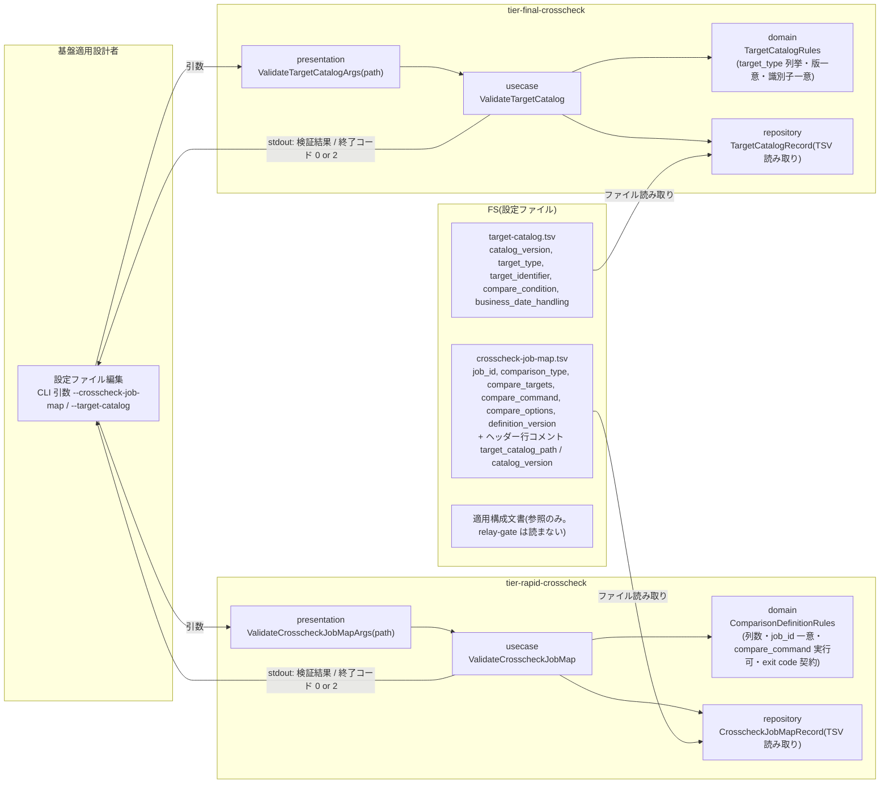
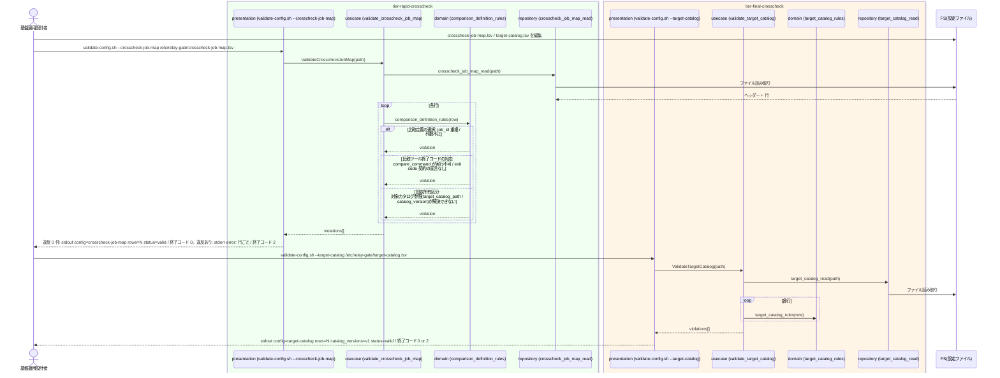

# クロスチェックのジョブマップと比較定義を定義する

## 概要

基盤適用設計者が、速報クロスチェック用に job_id ごとの比較対象と比較定義(比較ツール起動コマンド・オプション・定義版)を、確報クロスチェック用に対象カタログ(target_type / target_identifier / 版)を、クロスチェックのジョブマップ(TSV)として定義し、`validate-config.sh --crosscheck-job-map <path>` / `validate-config.sh --target-catalog <path>` で検証する。比較ツールの終了コード契約(0 / 3 / 6)への適合を検証ルールに含める。外部 IF の送受信方針・ネットワーク制約・ホスト配置は適用文書で定義し、relay-gate のスクリプトは変更しない。RDB には触れない。

## データフロー



| レイヤー | データモデル | 変換内容 |
|---------|------------|---------|
| presentation | ValidateCrosscheckJobMapArgs / ValidateTargetCatalogArgs | 引数のパスをそのまま使う(`--crosscheck-job-map <path>` / `--target-catalog <path>` は値必須。既定パスによる補完はしない) |
| usecase | ValidateCrosscheckJobMap / ValidateTargetCatalog | 行ごとに domain ルールを適用し、違反を全件収集 |
| domain | ComparisonDefinitionRules / TargetCatalogRules | 純粋関数の検証表(下記「設定契約」) |
| repository | TSV 読み取り | ヘッダー行検証・タブ区切り分解。RDB には触れない |
| 出力 | stdout `key=value`、stderr `error:` 行(違反ごと) | 終了コード 0 / 2 |

## 処理フロー



## バリエーション一覧

| バリエーション名 | 値 | 処理内容 | 適用 tier | 適用箇所 |
|----------------|---|---------|----------|---------|
| 設定所有区分 | クロスチェックジョブマップ | 比較対象と対象カタログの正本。本 UC で定義・検証する | tier-rapid-crosscheck / tier-final-crosscheck | validate-config.sh |
| 設定所有区分 | feature flag / slot ジョブマップ | 本 UC では触れない(別 UC) | — | — |
| 設定所有区分 | 適用文書 | 外部 IF 方針・ネットワーク制約・ホスト配置。relay-gate は読まない | — | — |
| クロスチェック種別 | 速報クロスチェック | 比較定義(job_id 行)を検証 | tier-rapid-crosscheck | validate_crosscheck_job_map |
| クロスチェック種別 | 確報クロスチェック | 対象カタログを検証 | tier-final-crosscheck | validate_target_catalog |
| 比較種別 | ジョブ単位比較 | comparison_type=job(速報) | tier-rapid-crosscheck | comparison_definition_rules |
| 比較種別 | 全テーブル・全ファイル比較 | 対象カタログの全行(確報)。比較コマンドはジョブマップの予約行 `job_id=final-crosscheck` / `comparison_type=full` で定義する | tier-rapid-crosscheck / tier-final-crosscheck | comparison_definition_rules(full 行)/ target_catalog_rules |
| 対象カタログの対象種別 | テーブル | target_type=table | tier-final-crosscheck | target_catalog_rules |
| 対象カタログの対象種別 | ファイル | target_type=file | tier-final-crosscheck | target_catalog_rules |
| 比較ツール終了コード | 0 / 3 / 6 | 比較定義は終了コード契約(0=OK / 3=NG / 6=実行エラー)に従う比較ツールを指す。`compare_options` に `{blue}` `{green}` プレースホルダを含むことを検証 | tier-rapid-crosscheck | comparison_definition_rules |

## 分岐条件一覧

| 条件名 | 判定ルール | 適用 tier | 適用箇所 | BDD Scenario |
|--------|----------|----------|---------|-------------|
| 適用側で定義する事項 | 比較対象と対象カタログはクロスチェックジョブマップで定義する。外部 IF 方針・ネットワーク制約・ホスト配置は適用文書に置き、validate-config は検証対象にしない | tier-rapid-crosscheck / tier-final-crosscheck | validate-config.sh | 比較定義と対象カタログを検証する |
| 設定所有区分 | クロスチェックジョブマップが比較対象と対象カタログ参照を所有する。feature flag / slot ジョブマップの項目(BLUE_MODE、host 等)が混入していれば違反 | tier-rapid-crosscheck | comparison_definition_rules(未知の列名) | ヘッダー列が契約と異なる |
| 比較定義の選択 | job_id は一意。速報 worker が job_id 行で比較定義を解決できる列(comparison_type / compare_targets / compare_command / compare_options / definition_version)が非空 | tier-rapid-crosscheck | comparison_definition_rules | job_id が重複している |
| 比較ツール終了コードの対応 | compare_command は実行可能ファイル(存在 + 実行権限)。compare_options に `{blue}` と `{green}` を含む。relay-gate は 0 / 3 / 6 を変換しないため、比較ツール側がこの契約に従う旨をジョブマップのヘッダーコメント `# exit_code_contract=0:OK,3:NG,6:ERROR` で宣言する(宣言が無ければ違反) | tier-rapid-crosscheck | comparison_definition_rules | compare_command が実行できない |
| 速報と確報のモデル分離 | 比較定義(速報)と対象カタログ(確報)は別ファイル・別検証。validate-config は RDB に触れない | tier-rapid-crosscheck / tier-final-crosscheck | validate-config.sh | 比較定義と対象カタログを検証する |
| 速報結果の位置付け | 比較定義の検証結果はジョブスケジューラの業務ジョブ応答に影響しない(設計者の直接起動) | tier-rapid-crosscheck | validate-config.sh | 比較定義と対象カタログを検証する |

## 計算ルール一覧

| 計算名 | 入力情報 | 計算式/ロジック | 出力情報 | 適用 tier |
|--------|---------|---------------|---------|----------|
| 対象カタログ参照の解決 | ジョブマップのヘッダーコメント `# target_catalog_path=...` / `# catalog_version=...` | パスが存在し、そのカタログに catalog_version の行が 1 件以上ある | 違反有無 | tier-rapid-crosscheck |
| 行数集計 | TSV 本文行(ヘッダー・`#` コメント・空行を除く) | 行数 N | stdout `rows=N` | 両 tier |
| カタログ版の集計 | target-catalog.tsv の catalog_version 列 | ユニーク値をカンマ区切り | stdout `catalog_versions=` | tier-final-crosscheck |

## 状態遷移一覧

| 状態モデル | 遷移元 | 遷移先 | トリガー | 事前条件 | 事後処理 | 適用 tier |
|-----------|--------|--------|---------|---------|---------|----------|
| 該当なし(設定ファイルの定義・検証のみ。状態モデルは遷移しない) | — | — | — | — | — | — |

## 関連 RDRA モデル

| モデル種別 | 要素名 | 関連 |
|-----------|--------|------|
| 業務 | 適用構成業務 | この UC が属する業務 |
| BUC | 適用構成定義フロー | この UC を含む BUC(アクティビティ: クロスチェック定義の設定) |
| アクター | 基盤適用設計者 | 定義・検証する(提供者) |
| 情報 | クロスチェックジョブマップ | 定義する |
| 情報 | 比較定義 | 定義する(job_id 行) |
| 情報 | 対象カタログ | 定義する |
| 情報 | 適用構成文書 | 参照(relay-gate は読まない) |
| 条件 | 適用側で定義する事項 | 適用 |
| 条件 | 設定所有区分 | 適用 |
| 条件 | 比較定義の選択 | 適用 |
| 条件 | 比較ツール終了コードの対応 | 適用 |
| 画面 | クロスチェックジョブマップ検証出力(→ CLI 出力) | validate-config.sh の stdout / stderr / 終了コード |
| イベント | 比較定義の終了コード契約適合 | 比較ツール(外部システム)との契約宣言の検証 |
| 外部システム | 比較ツール | compare_command の実体 |

## 関連 USDM

| REQ ID | SPEC ID | 対応 BDD Scenario |
|--------|---------|-----------------|
| REQ-004 | SPEC-004-01 | 比較定義と対象カタログを検証する(SPEC-004-01) |
| REQ-013 | SPEC-013-01 | 比較定義と対象カタログを検証する(SPEC-004-01)(スクリプト変更なしで差し替え) |
| REQ-005 | SPEC-005-03 | job_id が重複している(比較定義の job_id 単位の差し替え) |

## E2E 完了条件(BDD)

### 正常系

```gherkin
Feature: クロスチェックのジョブマップと比較定義を定義する

  Scenario: 比較定義と対象カタログを検証する(SPEC-004-01)
    Given /etc/relay-gate/crosscheck-job-map.tsv の内容が次である
      """
      # exit_code_contract=0:OK,3:NG,6:ERROR
      # target_catalog_path=/etc/relay-gate/target-catalog.tsv
      # catalog_version=v1
      job_id	comparison_type	compare_targets	compare_command	compare_options	definition_version
      JOB001	job	output.csv	/opt/compare/compare.sh	--blue {blue} --green {green}	v1
      JOB002	job	summary.tsv	/opt/compare/compare-v2.sh	--blue {blue} --green {green} --ignore-header	v1
      """
    And /opt/compare/compare.sh と /opt/compare/compare-v2.sh が実行可能である
    And /etc/relay-gate/target-catalog.tsv の内容が次である
      """
      catalog_version	target_type	target_identifier	compare_condition	business_date_handling
      v1	table	SALES_DAILY	key=sales_id	column=business_date
      v1	file	/data/out/summary_{business_date}.tsv	-	filename
      """
    When 基盤適用設計者が `validate-config.sh --crosscheck-job-map /etc/relay-gate/crosscheck-job-map.tsv` を実行する
    And 続けて `validate-config.sh --target-catalog /etc/relay-gate/target-catalog.tsv` を実行する
    Then 1 回目は終了コード 0 で stdout に `config=crosscheck-job-map`、`path: /etc/relay-gate/crosscheck-job-map.tsv`、`rows=2`、`target_catalog_path: /etc/relay-gate/target-catalog.tsv`、`catalog_version=v1`、`exit_code_contract=0:OK,3:NG,6:ERROR`、`status=valid` がこの順で出る
    And 2 回目は終了コード 0 で stdout に `config=target-catalog`、`path: /etc/relay-gate/target-catalog.tsv`、`rows=2`、`catalog_versions=v1`、`tables=1`、`files=1`、`status=valid` がこの順で出る
    And 管理 DB への接続は行われず、relay-gate のスクリプトは変更されていない

  Scenario: job_id ごとに比較定義を差し替えて検証する
    Given crosscheck-job-map.tsv の JOB002 行の compare_command を /opt/compare/compare-v3.sh に変更し、実行可能である
    When `validate-config.sh --crosscheck-job-map /etc/relay-gate/crosscheck-job-map.tsv` を実行する
    Then 終了コード 0 で `status=valid` が出て、JOB001 の定義は変更されていない
```

### 異常系

```gherkin
  Scenario: job_id が重複している
    Given 前シナリオの crosscheck-job-map.tsv(宣言 3 行 + ヘッダー + JOB001 + JOB002 の 6 行)の 6 行目(JOB002 行)を JOB001 行の複製に置き換える
    When `validate-config.sh --crosscheck-job-map /etc/relay-gate/crosscheck-job-map.tsv` を実行する
    Then 終了コードは 2 で stderr に `error: duplicate job_id job_id=JOB001 lines=6` が出る

  Scenario: compare_command が実行できない
    Given crosscheck-job-map.tsv の JOB001 行の compare_command が /opt/compare/missing.sh で存在しない
    When `validate-config.sh --crosscheck-job-map /etc/relay-gate/crosscheck-job-map.tsv` を実行する
    Then 終了コードは 2 で stderr に `error: compare_command is not executable line=5 job_id=JOB001 value=/opt/compare/missing.sh` が出る

  Scenario: ヘッダー列が契約と異なる
    Given crosscheck-job-map.tsv のヘッダー行が `job_id	host	comparison_type	compare_targets	compare_command	compare_options	definition_version` である(slot ジョブマップの host 列が混入している)
    When `validate-config.sh --crosscheck-job-map /etc/relay-gate/crosscheck-job-map.tsv` を実行する
    Then 終了コードは 2 で stderr に `error: header mismatch expected=job_id,comparison_type,compare_targets,compare_command,compare_options,definition_version actual=job_id,host,comparison_type,compare_targets,compare_command,compare_options,definition_version path: /etc/relay-gate/crosscheck-job-map.tsv` が出る

  Scenario: 対象カタログの target_type が不正
    Given 前シナリオの target-catalog.tsv(ヘッダー + 2 行)の 3 行目(file 行)の target_type を view に変える
    When `validate-config.sh --target-catalog /etc/relay-gate/target-catalog.tsv` を実行する
    Then 終了コードは 2 で stderr に `error: target_type is not in table,file line=3 value=view` が出る
```

## ティア別仕様

- [速報クロスチェックティア](tier-rapid-crosscheck.md)(比較定義 TSV の列と `--crosscheck-job-map` 検証)
- [確報クロスチェックティア](tier-final-crosscheck.md)(対象カタログ TSV の列と `--target-catalog` 検証)

### 統合 API Spec

- [CLI コマンド契約](../../../_cross-cutting/api/cli-command-contract.yaml)(`validate-config.sh --crosscheck-job-map | --target-catalog`)
- [AsyncAPI Spec](../../../_cross-cutting/api/asyncapi.yaml)(本 UC は publish / subscribe しない)
