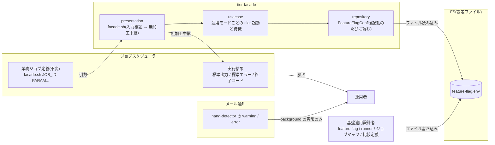
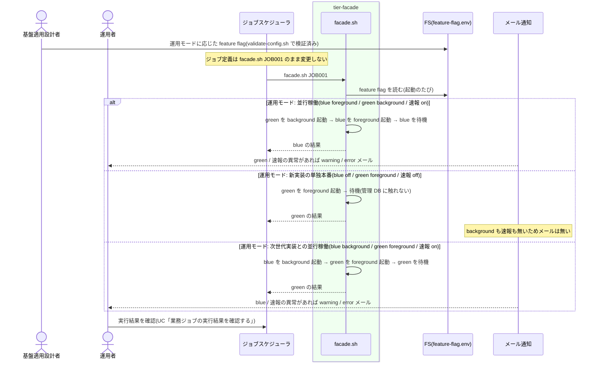

# 切り替えた運用モードで業務ジョブを実行する

## 概要

運用者が、基盤適用設計者の定義した feature flag・runner・ジョブマップ・比較定義に基づき、ジョブスケジューラのジョブ定義を変更せずに、並行稼働・新実装の単独本番・次世代実装との並行稼働の各運用モードで業務ジョブを実行し、その結果(ジョブスケジューラ応答)と通知(メール)を受け取る。この UC は運用者視点の「読む」UC であり、relay-gate 側の処理は運用モードごとの facade の振る舞いと見え方の契約である。

## データフロー



| レイヤー | データモデル | 変換内容 |
|---------|------------|---------|
| 基盤適用設計者 | 設定ファイル | 運用モードを feature flag の組合せで表現(UC「feature flag を設定する」) |
| presentation / usecase | facade.sh | 起動のたびに feature flag を読み、運用モードに応じた slot を起動し foreground を中継(UC「slot 実行モードを選択して runner を起動する」「foreground slot の結果をジョブスケジューラへ中継する」) |
| ジョブスケジューラ | 実行結果 | 運用モードによらず同じ 3 チャネル |
| メール通知 | 通知 | background slot と速報の異常だけがメールで届く(並行稼働 / 次世代並行稼働のみ) |

## 処理フロー



## バリエーション一覧

| バリエーション名 | 値 | 処理内容 | 適用 tier | 適用箇所 |
|----------------|---|---------|----------|---------|
| 運用モード | 並行稼働 | blue foreground / green background / 速報 on。応答 = blue。メール = green / 速報の異常 | tier-facade | facade.sh |
| 運用モード | 新実装の単独本番 | blue off / green foreground / 速報 off。応答 = green。メール無し。管理 DB 不要 | tier-facade | facade.sh |
| 運用モード | 次世代実装との並行稼働 | blue background / green foreground / 速報 on。応答 = green。メール = blue / 速報の異常。blue の runner は旧 green の実装、green の runner は次世代実装 | tier-facade | facade.sh |
| 実装スロット | blue / green | 運用モードごとに役割(応答元 / 比較対象 / 停止)が変わる | tier-facade | facade.sh |
| slot 実行モード | foreground / background / off | 運用モードの構成要素 | tier-facade | facade.sh |
| 速報クロスチェックモード | on / off | 並行稼働系は on、単独本番は off | tier-facade | facade.sh |
| 設定所有区分 | feature flag / slot ジョブマップ / クロスチェックジョブマップ / 適用文書 | 切り替えで触るのは feature flag(と世代交代時の runner・ジョブマップ)。ジョブ定義は触らない | tier-facade | repository `feature_flag_config` |
| ジョブスケジューラ起動ジョブ種別 | 業務ジョブ(facade) | 運用モードによらず同じジョブ定義 | tier-facade | presentation `facade.sh` |

## 分岐条件一覧

| 条件名 | 判定ルール | 適用 tier | 適用箇所 | BDD Scenario |
|--------|----------|----------|---------|-------------|
| foreground slot 排他 | どの運用モードも foreground は 1 slot。両 foreground の feature flag は validate-config.sh と facade の両方が拒否する | tier-facade | facade.sh / validate-config.sh | 誤った運用モード設定は業務ジョブを起動せずに止まる |
| 設定所有区分 | 運用モードの切り替えは feature flag の変更だけ。ジョブスケジューラのジョブ定義・facade.sh・比較規約は変更しない | tier-facade | feature-flag.env | ジョブ定義を変えずに並行稼働から単独本番へ切り替える(SPEC-001-03) |
| facade の責務限定 | facade は起動のたびに feature flag を読むため、設定変更は次回の起動から反映される(実行中の run には影響しない) | tier-facade | facade.sh | feature flag の変更は次回起動から反映される |

## 計算ルール一覧

| 計算名 | 入力情報 | 計算式/ロジック | 出力情報 | 適用 tier |
|--------|---------|---------------|---------|----------|
| 運用モード名 | BLUE_MODE、GREEN_MODE、RAPID_CROSSCHECK_MODE | UC「feature flag を設定する」の `derive_operation_mode` と同じ(parallel / green-only / next-parallel / custom)。実行ログに記録 | operation_mode | tier-facade |

## 状態遷移一覧

| 状態モデル | 遷移元 | 遷移先 | トリガー | 事前条件 | 事後処理 | 適用 tier |
|-----------|--------|--------|---------|---------|---------|----------|
| 該当なし | — | — | 読む UC。状態遷移は UC「slot 実行モードを選択して runner を起動する」等に含まれる | — | — | — |

## 関連 RDRA モデル

| モデル種別 | 要素名 | 関連 |
|-----------|--------|------|
| 業務 | 適用構成業務 | この UC が属する業務 |
| BUC | 適用構成定義フロー | この UC を含む BUC |
| アクター | 運用者 | 受益者(切り替え後に実行する) |
| 情報 | feature flag 設定 | 運用モードの正本 |
| 情報 | ジョブ起動要求 | 不変のジョブ定義 |
| 情報 | ジョブスケジューラ応答 | 運用モードによらず同じ 3 チャネル |
| 情報 | 通知メール | background / 速報の異常 |
| 条件 | foreground slot 排他 / 設定所有区分 / facade の責務限定 | 分岐条件一覧を参照 |
| 画面 | facade 運用モード出力(→ CLI 出力) | ジョブスケジューラ応答と実行ログの operation_mode |
| イベント | 運用モード別の業務ジョブ起動 / 運用モード別の異常通知受信 | 起動 / 通知 |
| 外部システム | ジョブスケジューラ / メール通知 | 起動元 / 通知経路 |

## 関連 USDM

| REQ ID | SPEC ID | 対応 BDD Scenario |
|---|---|---|
| REQ-001 | SPEC-001-01 | 並行稼働モードで業務ジョブを実行する |
| REQ-001 | SPEC-001-03 | 並行稼働モードで業務ジョブを実行する / 単独本番モードで業務ジョブを実行する / ジョブ定義を変えずに並行稼働から単独本番へ切り替える |
| REQ-001 | SPEC-001-04 | 次世代並行稼働モードで業務ジョブを実行する |
| REQ-005 | SPEC-005-04 | 単独本番モードで業務ジョブを実行する |
| REQ-013 | SPEC-013-01 | ジョブ定義を変えずに並行稼働から単独本番へ切り替える |

## E2E 完了条件(BDD)

### 正常系

```gherkin
Feature: 切り替えた運用モードで業務ジョブを実行する

  Scenario: 並行稼働モードで業務ジョブを実行する(SPEC-001-03)
    Given feature flag が BLUE_MODE=foreground GREEN_MODE=background RAPID_CROSSCHECK_MODE=on である
    And blue は終了コード 0、green は終了コード 0 で終了し速報比較は OK である
    When ジョブスケジューラが facade.sh JOB001 を実行する
    Then ジョブスケジューラは blue の結果(終了コード 0)を受け取る
    And 運用者に通知メールは届かない
    And 実行ログに "operation_mode=parallel" が出る

  Scenario: 単独本番モードで業務ジョブを実行する(SPEC-001-03)
    Given feature flag が BLUE_MODE=off GREEN_MODE=foreground RAPID_CROSSCHECK_MODE=off である
    And 管理 DB の接続設定が無い
    When ジョブスケジューラが facade.sh JOB001 を実行する
    Then ジョブスケジューラは green の結果を受け取る
    And 速報クロスチェックは動作せず、管理 DB への接続は発生しない
    And 実行ログに "operation_mode=green-only" が出る

  Scenario: 次世代並行稼働モードで業務ジョブを実行する(SPEC-001-04)
    Given feature flag が BLUE_MODE=background GREEN_MODE=foreground RAPID_CROSSCHECK_MODE=on である
    And BLUE_RUNNER は旧 green の実装用 runner、GREEN_RUNNER は次世代実装用 runner である
    When ジョブスケジューラが facade.sh JOB001 を実行する
    Then ジョブスケジューラは green(次世代)の結果を受け取る
    And blue は background で実行され、速報比較依頼が作成される
    And 実行ログに "operation_mode=next-parallel" が出る

  Scenario: ジョブ定義を変えずに並行稼働から単独本番へ切り替える(SPEC-001-03)
    Given ジョブスケジューラのジョブ定義が facade.sh JOB001 で、並行稼働モードで 1 回実行済みである
    When 基盤適用設計者が feature flag を BLUE_MODE=off GREEN_MODE=foreground RAPID_CROSSCHECK_MODE=off に変更し、ジョブスケジューラが同じジョブ定義で facade.sh JOB001 を再度実行する
    Then 2 回目の応答は green の結果であり、blue は起動されない
    And ジョブスケジューラのジョブ定義・facade.sh・rapid-crosscheck-*.sh は変更されていない

  Scenario: feature flag の変更は次回起動から反映される
    Given 並行稼働モードで run_id=R1 の green(background)が実行中である
    When 基盤適用設計者が feature flag を単独本番モードに変更する
    Then R1 の green はそのまま実行を継続し、R1 の execution-spec.json は変わらない
    And 次の facade.sh JOB001 の起動から単独本番モードで動く

  Scenario: 並行稼働モードで background の異常は通知メールで届く
    Given 並行稼働モードで blue は終了コード 0、green(background)は終了コード 1 で終了した
    When hang-detector.sh の定期ジョブが実行される
    Then ジョブスケジューラの応答は終了コード 0 のままである
    And 運用者に件名 "[relay-gate][error] background-exec-error run_id=<run_id> job_id=JOB001 role=green" のメールが届く
```

### 異常系

```gherkin
  Scenario: 誤った運用モード設定は業務ジョブを起動せずに止まる
    Given 基盤適用設計者が誤って BLUE_MODE=foreground GREEN_MODE=foreground を設定した
    When ジョブスケジューラが facade.sh JOB001 を実行する
    Then ジョブスケジューラは終了コード 2 と標準エラー "error: both slots are foreground blue_mode=foreground green_mode=foreground" を受け取る
    And blue も green も起動されない
```

## ティア別仕様

- [facade / slot runner ティア](tier-facade.md)

### 統合契約

- [CLI コマンド契約](../../../_cross-cutting/api/cli-command-contract.yaml)(`facade.sh` を uses)
- [AsyncAPI Spec](../../../_cross-cutting/api/asyncapi.yaml)(`hang-alert-mail` を subscribe する側は運用者。定義は tier-ops)
- 関連: [feature flag を設定する](../feature%20flag%20を設定する/spec.md) / [slot 実行モードを選択して runner を起動する](../../../実装切替業務/実装切替ジョブ実行フロー/slot%20実行モードを選択して%20runner%20を起動する/spec.md) / [業務ジョブの実行結果を確認する](../../../実装切替業務/実装切替ジョブ実行フロー/業務ジョブの実行結果を確認する/spec.md)
