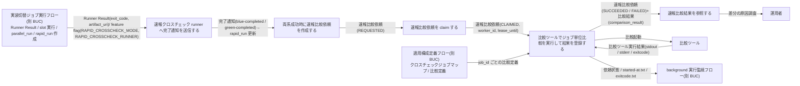
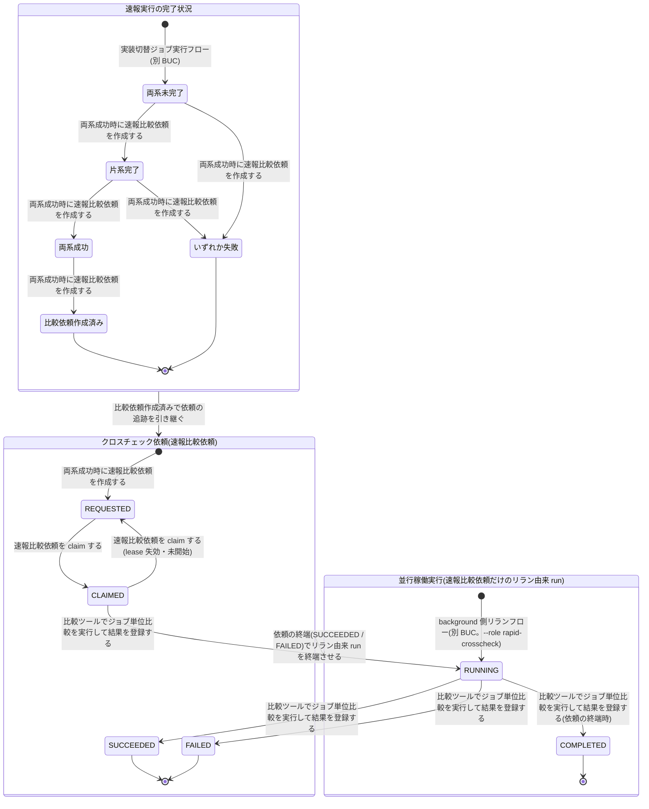

# 速報クロスチェックフロー

## 概要

blue / green の slot runner が完了時に系統ごとの公開 function で速報クロスチェック runner(dispatcher)へ完了通知を送り、runner は rapid_run で両系成功を判定したときに限り速報比較依頼を run_id 主キーで 1 件だけ REQUESTED で作成する。速報クロスチェック worker が管理 DB をジョブキューとして claim / lease し、job_id ごとの比較定義に従って比較ツールでジョブ単位比較を非同期に実行して comparison_result を登録する。運用者は結果を run_id で参照して差分の原因を調査する。速報の結果は業務ジョブのジョブスケジューラ応答に影響させず、リリース判断の正本には用いない。

## 所属 UC 一覧

| UC名 | アクター | 主な操作 | 関連情報 |
|------|---------|---------|---------|
| [速報クロスチェック runner へ完了通知を送信する](速報クロスチェック%20runner%20へ完了通知を送信する/spec.md) | 運用者(受益者・操作なし) | slot runner が exitcode.txt 公開直後に feature flag の RAPID_CROSSCHECK_RUNNER が指す速報クロスチェック runner を blue-completed / green-completed で起動し、run_id・job_id・exit_code・artifact_uri を一方向に通知する。受信側が rapid_runs の自系統の列を更新する。RAPID_CROSSCHECK_MODE が off 以外(foreground / background)のときだけ送信し、off では送信しない。送信失敗は自動検知せず実行ログに警告を残す(完了通知失敗の扱い) | 完了通知、Runner Result、slot 実行、feature flag 設定、実行ログ、速報実行(rapid_run) |
| [両系成功時に速報比較依頼を作成する](両系成功時に速報比較依頼を作成する/spec.md) | 運用者(受益者・自動) | 完了状況を 両系未完了 → 片系完了 → 両系成功 / いずれか失敗 → 比較依頼作成済み へ進め、両系成功のときだけ条件付き INSERT で rapid_crosscheck_request を 1 件作成する | 完了通知、速報実行(rapid_run)、速報比較依頼(rapid_crosscheck_request)、並行稼働実行(parallel_run) |
| [速報比較依頼を claim する](速報比較依頼を%20claim%20する/spec.md) | 運用者(受益者・自動) | worker(feature flag の RAPID_CROSSCHECK_WORKER が指す実体)が REQUESTED の依頼を worker_id / lease_until 付きで CLAIMED にし、lease 失効かつ未開始の依頼を REQUESTED へ戻す | 速報比較依頼(rapid_crosscheck_request) |
| [比較ツールでジョブ単位比較を実行して結果を登録する](比較ツールでジョブ単位比較を実行して結果を登録する/spec.md) | 運用者(受益者・自動)/ 比較ツール(外部) | 依頼を RUNNING にし、job_id の比較定義(crosscheck-job-map.csv)で比較ツールを起動する。stdout / stderr / exit_code を依頼に保存し、0 で SUCCEEDED、非 0 で FAILED とし、比較ツールの終了コードを得たときだけ comparison_result を登録する(比較結果の登録条件)。速報比較依頼だけのリラン由来 run は依頼終端時に parallel_run を COMPLETED にする | 速報比較依頼(rapid_crosscheck_request)、クロスチェックジョブマップ、比較定義、比較ツール実行結果、比較結果(comparison_result)、実行ログ、並行稼働実行(parallel_run) |
| [速報比較結果を参照する](速報比較結果を参照する/spec.md) | 運用者(参照者) | run_id で comparison_result と依頼の stdout / stderr / exit_code を参照し、blue / green の差分の原因を調査する。状態は変更しない | 比較結果(comparison_result)、速報比較依頼(rapid_crosscheck_request)、比較ツール実行結果、並行稼働実行(parallel_run)、Runner Result |

完了通知の送信側は tier-facade(slot runner)、受信側と以降の UC は tier-rapid-crosscheck で実現する。管理 DB(ジョブキュー兼管理 DB。RDB)は relay-gate 内部のデータストアであり、外部システムではない。

## UC 横断データフロー

BUC 内の UC 間で情報がどう流れるかを示す。情報がどの UC で作成(C)・参照(R)・更新(U)されるかを明記する。

### データフロー図

### 情報 CRUD マトリクス

列の UC は完了通知 → 依頼作成 → claim → 比較実行 → 参照の順。`R(間接)` は run_id 相関で別テーブル経由に参照し、その情報自体は読まないことを示す。

| 情報名 | 速報クロスチェック runner へ完了通知を送信する | 両系成功時に速報比較依頼を作成する | 速報比較依頼を claim する | 比較ツールでジョブ単位比較を実行して結果を登録する | 速報比較結果を参照する |
|--------|:---:|:---:|:---:|:---:|:---:|
| 完了通知 | C | R | - | - | - |
| Runner Result | R | - | - | R(blue / green の成果物) | R(間接) |
| slot 実行 | R | - | - | - | - |
| feature flag 設定 | R | - | R | - | R |
| 速報実行(rapid_run) | U | R / U | - | R | R |
| 速報比較依頼(rapid_crosscheck_request) | - | C | U | U | R |
| 並行稼働実行(parallel_run) | - | R | - | U(リラン由来 run の COMPLETED) | R(間接) |
| クロスチェックジョブマップ | - | - | - | R | - |
| 比較定義 | - | - | - | R | - |
| 比較ツール実行結果 | - | - | - | C | R |
| 比較結果(comparison_result) | - | - | - | C | R |
| 実行ログ | C | C | C | C | - |

## 状態遷移全体図

BUC 内の UC が遷移 UC になっている状態モデルは、速報実行の完了状況、クロスチェック依頼(速報比較依頼)、並行稼働実行(リラン由来 run の RUNNING → COMPLETED のみ)の 3 つ。`[*]` → 両系未完了 は実装切替ジョブ実行フロー、依頼の RUNNING → ABORTED と background-rerun による依頼の再作成(並行稼働実行の `[*]` → STARTED → RUNNING)は実行復旧業務が担うため図に含めない。

### 状態遷移 UC マッピング

| 状態モデル | 遷移元 | 遷移先 | 担当 UC |
|-----------|--------|--------|--------|
| 速報実行の完了状況 | 両系未完了 | 片系完了 | [両系成功時に速報比較依頼を作成する](両系成功時に速報比較依頼を作成する/spec.md) |
| 速報実行の完了状況 | 両系未完了 | いずれか失敗 | [両系成功時に速報比較依頼を作成する](両系成功時に速報比較依頼を作成する/spec.md) |
| 速報実行の完了状況 | 片系完了 | 両系成功 | [両系成功時に速報比較依頼を作成する](両系成功時に速報比較依頼を作成する/spec.md) |
| 速報実行の完了状況 | 片系完了 | いずれか失敗 | [両系成功時に速報比較依頼を作成する](両系成功時に速報比較依頼を作成する/spec.md) |
| 速報実行の完了状況 | 両系成功 | 比較依頼作成済み | [両系成功時に速報比較依頼を作成する](両系成功時に速報比較依頼を作成する/spec.md) |
| クロスチェック依頼 | `[*]` | REQUESTED | [両系成功時に速報比較依頼を作成する](両系成功時に速報比較依頼を作成する/spec.md) |
| クロスチェック依頼 | REQUESTED | CLAIMED | [速報比較依頼を claim する](速報比較依頼を%20claim%20する/spec.md) |
| クロスチェック依頼 | CLAIMED | REQUESTED | [速報比較依頼を claim する](速報比較依頼を%20claim%20する/spec.md) |
| クロスチェック依頼 | CLAIMED | RUNNING | [比較ツールでジョブ単位比較を実行して結果を登録する](比較ツールでジョブ単位比較を実行して結果を登録する/spec.md) |
| クロスチェック依頼 | RUNNING | SUCCEEDED | [比較ツールでジョブ単位比較を実行して結果を登録する](比較ツールでジョブ単位比較を実行して結果を登録する/spec.md) |
| クロスチェック依頼 | RUNNING | FAILED | [比較ツールでジョブ単位比較を実行して結果を登録する](比較ツールでジョブ単位比較を実行して結果を登録する/spec.md) |
| 並行稼働実行 | RUNNING | COMPLETED(速報比較依頼だけを新規作成したリラン由来 run。`parent_run_id IS NOT NULL` かつ slot_executions 0 件) | [比較ツールでジョブ単位比較を実行して結果を登録する](比較ツールでジョブ単位比較を実行して結果を登録する/spec.md) |

## BUC 内共有条件一覧

BUC 内の複数 UC で共有される条件の一覧。分母は BUC.tsv でこの BUC に紐づく条件。UC spec の分岐条件一覧で追加採用されている UC は「(spec)」で示す。

| 条件名 | 条件の説明 | 適用 UC |
|--------|----------|--------|
| 依頼状態遷移規則 | 依頼は REQUESTED で作成され、claim で CLAIMED、比較開始で RUNNING、exitcode 0 で SUCCEEDED、非 0 または実行エラーで FAILED、停止確認後の中止で ABORTED に遷移する。速報と確報で同一 | 両系成功時に速報比較依頼を作成する, 速報比較依頼を claim する, 比較ツールでジョブ単位比較を実行して結果を登録する |
| 速報結果の位置付け | 速報の exitcode や失敗は業務ジョブの結果としてジョブスケジューラへ返さない。速報は原因調査用で、リリース判断の正本は確報 | 速報比較結果を参照する, 比較ツールでジョブ単位比較を実行して結果を登録する, 速報クロスチェック runner へ完了通知を送信する(spec), 両系成功時に速報比較依頼を作成する(spec), 速報比較依頼を claim する(spec) |
| 比較ツール終了コードの対応 | 比較 OK=0 は SUCCEEDED、比較 NG=3 は FAILED(警告終了)、実行エラー=6 は FAILED(エラー終了) | 比較ツールでジョブ単位比較を実行して結果を登録する, 速報比較結果を参照する |
| 速報と確報のモデル分離 | 速報は rapid_run / rapid_crosscheck_request を用い、確報の final_crosscheck_request と対象カタログを作成・変更しない | 両系成功時に速報比較依頼を作成する, 速報クロスチェック runner へ完了通知を送信する(spec), 速報比較依頼を claim する(spec), 比較ツールでジョブ単位比較を実行して結果を登録する(spec), 速報比較結果を参照する(spec) |
| 速報クロスチェック有効判定 | RAPID_CROSSCHECK_MODE が foreground または background のとき runner は完了通知を送信し、速報管理 DB に完了結果と比較依頼を書き込む(両値の挙動は同じ。判定は off か off 以外か)。off では完了通知を送信せず、速報管理 DB へ接続・書き込みせず、parallel_run も作成しない(worker / 結果参照も off では DB に接続せず終了コード 3) | 速報クロスチェック runner へ完了通知を送信する, 両系成功時に速報比較依頼を作成する(spec), 速報比較依頼を claim する(spec), 速報比較結果を参照する(spec) |
| 完了通知失敗の扱い | slot runner から速報クロスチェック runner への完了通知の送信失敗は自動検知しない。slot runner は実行ログに警告を残し、Runner Result と終了コードは実装スクリプトの exitcode のまま変更しない。復旧は運用者が速報クロスチェック runner を同一引数で再実行する(冪等・先勝ちで完了結果は一度だけ登録される) | 速報クロスチェック runner へ完了通知を送信する |
| 比較結果の登録条件 | comparison_result は比較ツールを起動して終了コードを得たときだけ登録する。比較定義なし・起動失敗では登録せず、依頼だけを FAILED(exit_code=6 相当、error_summary に理由)で終端する | 比較ツールでジョブ単位比較を実行して結果を登録する |

## BUC 内共有バリエーション一覧

BUC 内の複数 UC で共有されるバリエーションの一覧(UC spec のバリエーション一覧を集約)。

| バリエーション名 | 値 | 適用 UC |
|----------------|---|--------|
| 実装スロット | blue、green | 速報クロスチェック runner へ完了通知を送信する, 両系成功時に速報比較依頼を作成する |
| 速報クロスチェックのプロセス役割 | runner(dispatcher)、worker | 速報クロスチェック runner へ完了通知を送信する, 両系成功時に速報比較依頼を作成する, 速報比較依頼を claim する, 比較ツールでジョブ単位比較を実行して結果を登録する |
| クロスチェック依頼状態 | REQUESTED、CLAIMED、RUNNING、SUCCEEDED、FAILED、ABORTED | 両系成功時に速報比較依頼を作成する, 速報比較依頼を claim する, 比較ツールでジョブ単位比較を実行して結果を登録する, 速報比較結果を参照する |
| クロスチェック種別 | 速報クロスチェック | 両系成功時に速報比較依頼を作成する, 速報比較依頼を claim する, 速報比較結果を参照する |
| 比較ツール終了コード | 0(比較 OK)、3(比較 NG・警告終了)、6(実行エラー・エラー終了) | 比較ツールでジョブ単位比較を実行して結果を登録する, 速報比較結果を参照する |
| 比較結果ステータス | 比較 OK、比較 NG、FAILED | 比較ツールでジョブ単位比較を実行して結果を登録する, 速報比較結果を参照する |
| 速報クロスチェックモード | foreground、background、off(foreground / background は同じ挙動) | 速報クロスチェック runner へ完了通知を送信する, 速報比較依頼を claim する, 速報比較結果を参照する |
