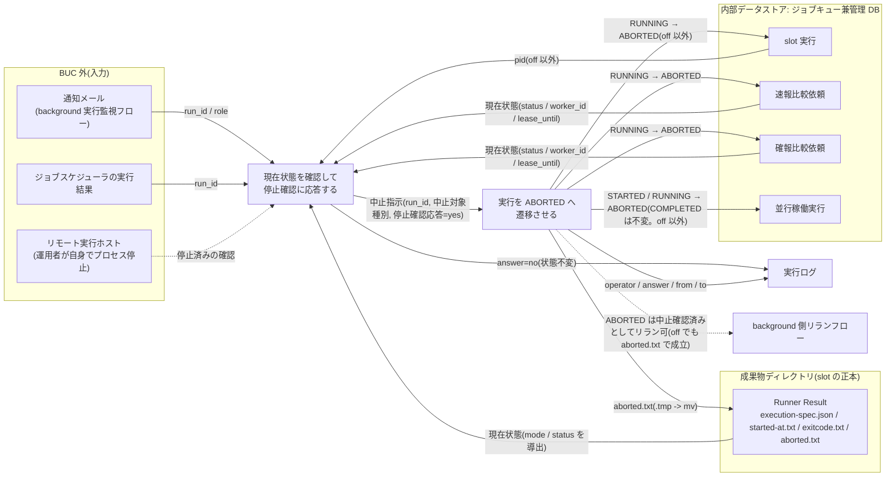
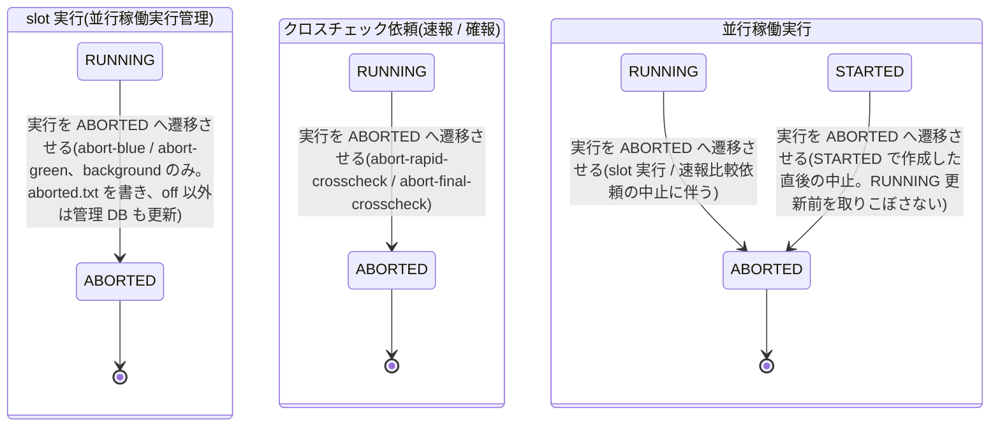

# 実行中止フロー

## 概要

運用者が、通知メールやジョブスケジューラの実行結果から中止対象の run_id を特定し、対象のプロセス・Pod・SSH 接続先の処理を自身で強制終了したうえで、中止スクリプト(abort-blue / abort-green / abort-rapid-crosscheck / abort-final-crosscheck)で RUNNING の slot 実行または比較依頼を ABORTED へ明示的に遷移させる BUC。スクリプトは現在状態を表示して停止確認に yes と応答されたときだけ状態を更新し、自身ではプロセスを停止しない。slot 実行の中止は成果物ディレクトリへの `aborted.txt`(中止日時 1 行)の書き込みを正本とし、RAPID_CROSSCHECK_MODE が off 以外なら管理 DB の状態も ABORTED に更新する。off でも成果物ファイルだけで中止が成立し、ABORTED にした background slot 実行と速報比較依頼は background 側リランフローの対象になれる。

## 所属 UC 一覧

| UC名 | アクター | 主な操作 | 関連情報 |
|------|---------|---------|---------|
| [現在状態を確認して停止確認に応答する](現在状態を確認して停止確認に応答する/spec.md) | 運用者 | 中止スクリプトを `--run-id` 付きで起動し、表示された現在状態(slot 系は成果物ファイルから導出)を見てプロセス停止済みかを yes / yes 以外で応答する | 中止指示、slot 実行、速報比較依頼、確報比較依頼、通知メール |
| [実行を ABORTED へ遷移させる](実行を%20ABORTED%20へ遷移させる/spec.md) | 運用者(受益者) | yes 応答時に限り、background かつ RUNNING の slot 実行は `aborted.txt` を書き(off 以外は加えて管理 DB を条件付き UPDATE)、RUNNING の比較依頼は条件付き UPDATE で ABORTED にし、並行稼働実行が STARTED / RUNNING なら併せて ABORTED にする(COMPLETED は変更しない) | 中止指示、slot 実行、速報比較依頼、確報比較依頼、並行稼働実行、実行ログ、Runner Result |

2 UC は 4 つの中止スクリプトの前半(状態表示と対話確認)と後半(状態更新)を構成する。

## UC 横断データフロー

BUC 内の UC 間で情報がどう流れるかを示す。情報がどの UC で作成(C)・参照(R)・更新(U)されるかを明記する。

### データフロー図

### 情報 CRUD マトリクス

分母は BUC.tsv でこの BUC に紐づく 8 情報。

| 情報名 | 現在状態を確認して停止確認に応答する | 実行を ABORTED へ遷移させる |
|--------|:---:|:---:|
| 中止指示 | C | U |
| slot 実行 | R | U |
| Runner Result | R(spec のみ) | U |
| 速報比較依頼(rapid_crosscheck_request) | R | U |
| 確報比較依頼(final_crosscheck_request) | R | U |
| 通知メール | R | - |
| 並行稼働実行(parallel_run) | - | U |
| 実行ログ | C | C |

補足:

- 中止指示は永続化する情報ではなく、前半 UC が run_id・中止対象種別・表示した現在状態・停止確認応答を確定し(C)、後半 UC が更新後状態(ABORTED)と指示者・指示日時を実行ログに残す(U)。
- slot 実行の現在状態は成果物ファイル(execution-spec.json の mode、started-at.txt / exitcode.txt / aborted.txt の有無と値)から導出する(条件「slot 実行の状態導出規則」)。前半 UC は管理 DB を参照するだけで更新しない(slot 系は off 以外のとき pid を補うためだけに読む)。更新は後半 UC に限る。
- Runner Result の U は後半 UC が `aborted.txt`(中止日時 1 行)を成果物ディレクトリに追加すること。他の成果物ファイルは書き換えない。BUC.tsv 上の紐づけは後半 UC で、前半 UC は spec 上の参照のみ。
- 並行稼働実行の併更新は RAPID_CROSSCHECK_MODE が off 以外のときだけ行う(off では parallel_run が存在しない)。

## 状態遷移全体図

BUC 内で関連する状態モデルは 3 つ(slot 実行 / クロスチェック依頼 / 並行稼働実行)。slot 実行とクロスチェック依頼は RUNNING → ABORTED、並行稼働実行は STARTED → ABORTED と RUNNING → ABORTED をこの BUC が担当する。前半 UC は状態を変更しない。RUNNING 以外(および slot の foreground / off)は状態を変更せずエラー終了する。

### 状態遷移 UC マッピング

| 状態モデル | 遷移元 | 遷移先 | 担当 UC |
|-----------|--------|--------|--------|
| slot 実行 | RUNNING | ABORTED | [実行を ABORTED へ遷移させる](実行を%20ABORTED%20へ遷移させる/spec.md) |
| クロスチェック依頼(速報比較依頼) | RUNNING | ABORTED | [実行を ABORTED へ遷移させる](実行を%20ABORTED%20へ遷移させる/spec.md) |
| クロスチェック依頼(確報比較依頼) | RUNNING | ABORTED | [実行を ABORTED へ遷移させる](実行を%20ABORTED%20へ遷移させる/spec.md) |
| 並行稼働実行 | RUNNING | ABORTED | [実行を ABORTED へ遷移させる](実行を%20ABORTED%20へ遷移させる/spec.md) |
| 並行稼働実行 | STARTED | ABORTED | [実行を ABORTED へ遷移させる](実行を%20ABORTED%20へ遷移させる/spec.md) |

[現在状態を確認して停止確認に応答する](現在状態を確認して停止確認に応答する/spec.md) は yes 応答を後半 UC に引き渡すだけで、遷移は行わない(yes 以外は状態不変で終了コード 3)。

## BUC 内共有条件一覧

BUC 内の複数 UC で共有される条件の一覧。適用 UC は BUC.tsv の紐づけを正とし、spec 側でのみ参照する UC は括弧で補足する。

| 条件名 | 条件の説明 | 適用 UC |
|--------|----------|--------|
| 停止確認応答 | 現在状態を表示後に「対象ジョブのプロセスは強制終了してありますか？ [yes/no]」と対話確認し、yes(完全一致)のときだけ状態を ABORTED に更新する。yes 以外は状態を変更せず終了する。スクリプト自身はプロセスを停止しない | 現在状態を確認して停止確認に応答する, 実行を ABORTED へ遷移させる |
| slot 実行の状態導出規則 | slot 実行の状態は成果物ディレクトリのファイル正本から導出する: exitcode.txt があれば 0 で SUCCEEDED / 非 0 で FAILED、無く aborted.txt があれば ABORTED、どちらも無ければ RUNNING。前半 UC は表示、後半 UC は可否判定と yes 応答直後の再確認に使う | 実行を ABORTED へ遷移させる(spec のみ: 現在状態を確認して停止確認に応答する) |
| 速報クロスチェック有効判定 | abort-blue / abort-green は RAPID_CROSSCHECK_MODE によらず成果物ファイルで現在状態を表示し aborted.txt で中止を記録する。off 以外なら加えて管理 DB(slot_executions / parallel_runs)を ABORTED に更新し、off では管理 DB に触れず aborted.txt だけで終了コード 0。abort-rapid-crosscheck は依頼レコードが管理 DB にしか無いため off では終了コード 3。abort-final-crosscheck は RAPID_CROSSCHECK_MODE を参照せず、final-crosscheck.env の FINAL_DB_CONN_REF の有無だけで管理 DB 有無を判定する | (spec のみ: 現在状態を確認して停止確認に応答する, 実行を ABORTED へ遷移させる) |

BUC.tsv 上で 1 UC のみに紐づく条件(CLI とメールによる提示 / slot 中止可否判定 / 依頼中止可否判定 / 依頼状態遷移規則)は各 UC spec に記載する。

## BUC 内共有バリエーション一覧

BUC 内の複数 UC で共有されるバリエーションの一覧(各 UC spec のバリエーション一覧を集約)。

| バリエーション名 | 値 | 適用 UC |
|----------------|---|--------|
| 中止対象種別 | background slot 実行、速報比較依頼、確報比較依頼 | 現在状態を確認して停止確認に応答する, 実行を ABORTED へ遷移させる |
| 停止確認応答 | yes、no(yes 以外はすべて no 扱い) | 現在状態を確認して停止確認に応答する, 実行を ABORTED へ遷移させる |
| slot 実行モード | foreground、background、off(中止可は background のみ。execution-spec.json の slots.<role>.mode で判定) | 現在状態を確認して停止確認に応答する, 実行を ABORTED へ遷移させる |
| 速報クロスチェックモード | foreground、background、off(off 以外は管理 DB も更新。off は aborted.txt のみ) | 現在状態を確認して停止確認に応答する, 実行を ABORTED へ遷移させる |
| Runner Result 成果物種別 | started-at.txt、exitcode.txt、aborted.txt(状態導出に使う 3 種。aborted.txt は後半 UC が中止時のみ生成) | 現在状態を確認して停止確認に応答する, 実行を ABORTED へ遷移させる |
| クロスチェック依頼状態 | REQUESTED、CLAIMED、RUNNING、SUCCEEDED、FAILED、ABORTED(中止可は RUNNING のみ) | 現在状態を確認して停止確認に応答する, 実行を ABORTED へ遷移させる |
