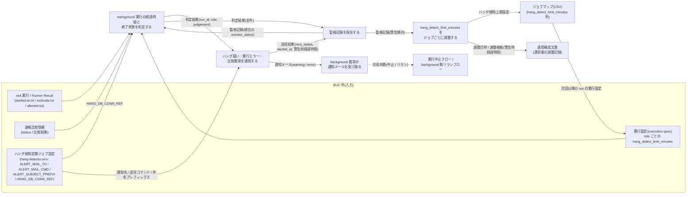
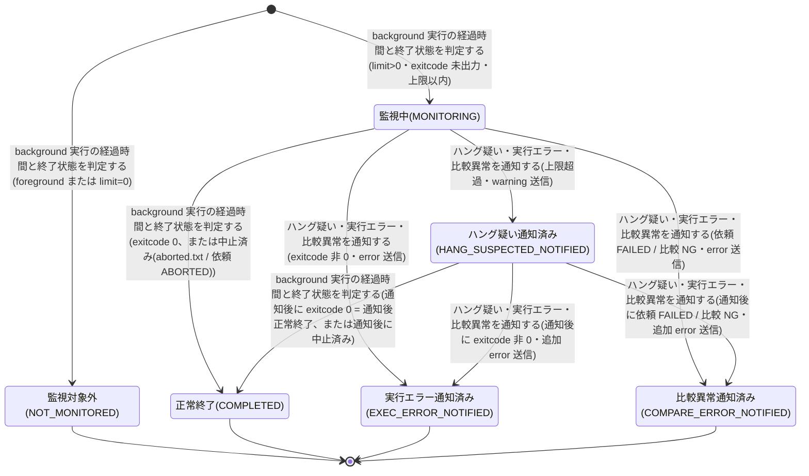

# background 実行監視フロー

## 概要

ジョブスケジューラのジョブステータスに現れない background slot 実行と速報比較依頼の異常(ハング疑い / background 実行エラー / 速報クロスチェック異常)を、定期起動のハング検知スクリプトが判定・通知・記録し、運用者がメールで受け取って対処を判断する BUC。監視は通知のみで、状態変更・プロセス停止・再実行は行わない(対処は実行中止フロー / background 側リランフローに委ねる)。監視記録に残る警告時経過時間を根拠に、運用者がジョブごとの `hang_detect_limit_minutes` を調整する運用改善のループまでを含む。

## 所属 UC 一覧

| UC名 | アクター | 主な操作 | 関連情報 |
|------|---------|---------|---------|
| [background 実行の経過時間と終了状態を判定する](background%20実行の経過時間と終了状態を判定する/spec.md) | ジョブスケジューラ(定期ジョブ)/ 運用者(受益者) | 成果物ディレクトリと未終端の速報比較依頼を走査し、slot 実行の状態(exitcode.txt / aborted.txt)と経過時間から判定する。中止済み(aborted.txt)は終端し通知しない | slot 実行、Runner Result、実行設定(execution-spec)、ハング検知上限設定、速報比較依頼、監視記録、(ハング検知定期ジョブ設定: HANG_DB_CONN_REF) |
| [ハング疑い・実行エラー・比較異常を通知する](ハング疑い・実行エラー・比較異常を通知する/spec.md) | 運用者(受益者) | 判定結果を warning / error のメールとして 1 回だけ送信する。通知先・送信コマンド・件名プレフィックスはハング検知定期ジョブ設定から取得する | 監視記録、通知メール、slot 実行、速報比較依頼、ハング検知定期ジョブ設定 |
| [監視記録を保存する](監視記録を保存する/spec.md) | 運用者(受益者) | 判定と送信結果を monitor_records へ UPSERT し、警告時経過時間を保持する | 監視記録、実行ログ |
| [background 異常の通知メールを受け取る](background%20異常の通知メールを受け取る/spec.md) | 運用者 | メールの件名・本文から重要度と種別を読み、静観 / 中止 / リランを判断する | 通知メール、監視記録 |
| [hang_detect_limit_minutes をジョブごとに調整する](hang_detect_limit_minutes%20をジョブごとに調整する/spec.md) | 運用者 | 警告傾向を参照し、slot ジョブマップ(CSV)の hang_detect_limit_minutes をジョブごとに調整する。調整の記録は適用構成文書に残す | 監視記録、ハング検知上限設定、ジョブマップ、実行設定(execution-spec)、適用構成文書 |

判定 / 通知 / 記録の 3 UC は、ハング検知スクリプトの 1 回の実行(5 分ごと)を構成する。受信と調整の 2 UC は運用者が行う。

## UC 横断データフロー

BUC 内の UC 間で情報がどう流れるかを示す。情報がどの UC で作成(C)・参照(R)・更新(U)されるかを明記する。

### データフロー図

### 情報 CRUD マトリクス

分母は BUC.tsv でこの BUC に紐づく 11 情報。列見出しは以下の略記表に従う。

| 略記 | UC名 |
|------|------|
| 判定 | background 実行の経過時間と終了状態を判定する |
| 通知 | ハング疑い・実行エラー・比較異常を通知する |
| 記録 | 監視記録を保存する |
| 受信 | background 異常の通知メールを受け取る |
| 調整 | hang_detect_limit_minutes をジョブごとに調整する |

| 情報名 | 判定 | 通知 | 記録 | 受信 | 調整 |
|--------|:----:|:----:|:----:|:----:|:----:|
| slot 実行 | R(状態は成果物ファイル正本から導出) | - | - | - | - |
| Runner Result | R(started-at.txt / exitcode.txt / aborted.txt) | - | - | - | - |
| 実行設定(execution-spec) | R | - | - | - | R |
| ハング検知上限設定 | R | - | - | - | U |
| 速報比較依頼(rapid_crosscheck_request) | R | - | - | - | - |
| 監視記録 | R | R | C / U | R | R |
| 通知メール | - | C | - | R | - |
| 実行ログ | C | C | C | - | - |
| ジョブマップ | - | - | - | - | U |
| ハング検知定期ジョブ設定 | R(HANG_DB_CONN_REF。BUC.tsv 上の紐づけは通知 UC) | R(ALERT_MAIL_TO / ALERT_MAIL_CMD / ALERT_SUBJECT_PREFIX) | - | - | - |
| 適用構成文書 | - | - | - | - | U(運用者の調整記録) |

補足:

- 監視記録の作成・更新は「記録」UC に集約する。「判定」「通知」は現在の monitor_status を読むだけで書かない(冪等判定と遷移先の決定に使う)。
- 「通知」UC は slot 実行・速報比較依頼を直接読まない(判定 UC から受け取った判定結果と monitor_records だけを入力にする。BUC.tsv 上の紐づけは「判定 UC 経由」と読み替える)。
- 「判定」UC の slot 実行 R は RAPID_CROSSCHECK_MODE によらず成果物ファイル(exitcode.txt / aborted.txt)から状態を導出する(条件「slot 実行の状態導出規則」)。管理 DB の slot_executions は読まない。
- 「調整」UC の U は運用者による slot ジョブマップ(CSV)の編集と、適用構成文書への調整記録(調整日時・調整根拠となる警告時経過時間)の記載を指す。管理 DB・execution-spec.json は直接編集しない(設定所有区分)。
- 実行ログは BUC.tsv 上「記録」のみに紐づくが、「判定」「通知」の spec も `judged` / `alert sent` 行を追記する。
- 管理 DB(RDB)は relay-gate 内部のジョブキュー兼管理 DB(内部データストア)であり、外部システムとしては数えない。

## 状態遷移全体図

BUC 内で関連する状態モデルは「監視状態」(実行監視管理。6 値: 監視対象外 / 監視中 / ハング疑い通知済み / 実行エラー通知済み / 比較異常通知済み / 正常終了)の 1 つ。状態.tsv の 9 遷移すべてをこの BUC の UC が担当する。ハング疑い通知済み → 比較異常通知済み(速報比較依頼が warning 通知後に FAILED / 比較 NG で終端したとき)と、運用者が中止した対象(slot は exitcode.txt が無く aborted.txt がある、依頼は ABORTED)を中止済みとして正常終了(COMPLETED)で終端する遷移も状態.tsv に定義されている。判定結果(hang_judgement)は NOT_TARGET / COMPLETED / EXEC_ERROR / MONITORING / HANG_SUSPECTED / COMPARE_ERROR の 6 値(バリエーション「ハング検知判定結果」: 監視対象外 / 正常終了または中止済み / 実行エラー / 監視中 / ハング疑い / 比較異常)で、監視状態と 1:1 に写像する。「通知後正常終了」はハング疑い通知済み → 正常終了の遷移の別名。ハング疑い通知済みは終端ではなく、次回以降の定期ジョブでも走査・再判定する。slot 実行 / クロスチェック依頼 / 並行稼働実行の状態は、この BUC ではいっさい変更しない(監視は通知のみ)。

### 状態遷移 UC マッピング

| 状態モデル | 遷移元 | 遷移先 | 担当 UC |
|-----------|--------|--------|--------|
| 監視状態 | `[*]` | 監視対象外 | [background 実行の経過時間と終了状態を判定する](background%20実行の経過時間と終了状態を判定する/spec.md) |
| 監視状態 | `[*]` | 監視中 | [background 実行の経過時間と終了状態を判定する](background%20実行の経過時間と終了状態を判定する/spec.md) |
| 監視状態 | 監視中 | ハング疑い通知済み | [ハング疑い・実行エラー・比較異常を通知する](ハング疑い・実行エラー・比較異常を通知する/spec.md) |
| 監視状態 | 監視中 | 実行エラー通知済み | [ハング疑い・実行エラー・比較異常を通知する](ハング疑い・実行エラー・比較異常を通知する/spec.md) |
| 監視状態 | 監視中 | 比較異常通知済み | [ハング疑い・実行エラー・比較異常を通知する](ハング疑い・実行エラー・比較異常を通知する/spec.md) |
| 監視状態 | 監視中 | 正常終了(exitcode 0、または中止済み) | [background 実行の経過時間と終了状態を判定する](background%20実行の経過時間と終了状態を判定する/spec.md) |
| 監視状態 | ハング疑い通知済み | 正常終了(通知後正常終了、または通知後の中止済み) | [background 実行の経過時間と終了状態を判定する](background%20実行の経過時間と終了状態を判定する/spec.md) |
| 監視状態 | ハング疑い通知済み | 実行エラー通知済み | [ハング疑い・実行エラー・比較異常を通知する](ハング疑い・実行エラー・比較異常を通知する/spec.md) |
| 監視状態 | ハング疑い通知済み | 比較異常通知済み | [ハング疑い・実行エラー・比較異常を通知する](ハング疑い・実行エラー・比較異常を通知する/spec.md) |

すべての遷移結果は [監視記録を保存する](監視記録を保存する/spec.md) が monitor_records へ永続化する(遷移の判定はしない)。[background 異常の通知メールを受け取る](background%20異常の通知メールを受け取る/spec.md) と [hang_detect_limit_minutes をジョブごとに調整する](hang_detect_limit_minutes%20をジョブごとに調整する/spec.md) は状態を変更しない。

## BUC 内共有条件一覧

BUC 内の複数 UC で共有される条件の一覧。適用 UC は BUC.tsv の紐づけを正とし、spec 側でのみ参照する UC は括弧で補足する。

| 条件名 | 条件の説明 | 適用 UC |
|--------|----------|--------|
| 監視は通知のみ | ハング検知は RUNNING を ABORTED へ変更せず、実行プロセスを停止せず、新しい実行依頼を作成しない。自動中止・自動再実行は行わない | 通知メールを受け取る, 異常を通知する, 監視記録を保存する |
| 通知レベルの判定 | ハング疑いは warning、background 実行エラーと速報クロスチェック異常は error のメールとする。件名 `{ALERT_SUBJECT_PREFIX}[{level}] {kind} run_id= job_id= role=`(プレフィックスはハング検知定期ジョブ設定の ALERT_SUBJECT_PREFIX。既定 `[relay-gate]`)で運用者が重要度と種別を判別する | 通知メールを受け取る, 異常を通知する |
| 速報比較依頼の異常判定 | 速報比較依頼が FAILED または比較 NG なら速報クロスチェック異常として通知する。RUNNING で上限超過は状態を変更せずハング疑いとして通知する | 経過時間と終了状態を判定する, 異常を通知する |
| ハング検知対象の除外 | hang_detect_limit_minutes が 0 の role と foreground role は検知対象外(NOT_MONITORED)。傾向集計の run_count からも除外する | 経過時間と終了状態を判定する, hang_detect_limit_minutes を調整する |
| 速報クロスチェック有効判定 | RAPID_CROSSCHECK_MODE=off では管理 DB に接続しない。判定は成果物走査のみ、記録は実行ログのみ、傾向参照は終了コード 3 で終了する。foreground / background(off 以外)は同じ挙動で管理 DB を使う | 経過時間と終了状態を判定する(spec では 異常を通知する, 監視記録を保存する, hang_detect_limit_minutes を調整する も参照) |
| slot 実行の状態導出規則 | exitcode.txt があれば 0 = SUCCEEDED / 非 0 = FAILED、無く aborted.txt があれば ABORTED、どちらも無ければ RUNNING。aborted.txt がある監視対象は中止済みとして監視記録を終端し通知しない(RAPID_CROSSCHECK_MODE によらない) | 経過時間と終了状態を判定する(実行中止フロー / background 側リランフローの UC と共有) |
| 設定所有区分 | 通知先・送信コマンド・件名プレフィックス・管理 DB 接続参照名はハング検知定期ジョブ設定(基盤適用設計者)が、ハング検知上限は該当 slot のジョブマップが、hang_detect_limit_minutes の調整記録は適用文書が所有する | hang_detect_limit_minutes を調整する(spec では 異常を通知する も参照) |

## BUC 内共有バリエーション一覧

BUC 内の複数 UC で共有されるバリエーションの一覧(各 UC spec のバリエーション一覧を集約)。

| バリエーション名 | 値 | 適用 UC |
|----------------|---|--------|
| ハング検知判定結果 | 監視対象外、正常終了または中止済み、監視中、ハング疑い、実行エラー、比較異常(spec の hang_judgement NOT_TARGET / COMPLETED / MONITORING / HANG_SUSPECTED / EXEC_ERROR / COMPARE_ERROR と 1:1) | 経過時間と終了状態を判定する, 異常を通知する, 監視記録を保存する, 通知メールを受け取る |
| 速報クロスチェック監視判定 | 速報クロスチェック異常(FAILED / 比較 NG)、ハング疑い(RUNNING 継続)、正常 | 経過時間と終了状態を判定する, 異常を通知する, 監視記録を保存する, 通知メールを受け取る |
| 通知レベル | warning、error | 異常を通知する, 通知メールを受け取る |
| run role(成果物ディレクトリ区分) | blue、green、rapid-crosscheck、final-crosscheck(final-crosscheck は走査対象外) | 経過時間と終了状態を判定する, 異常を通知する, 監視記録を保存する, 通知メールを受け取る, hang_detect_limit_minutes を調整する |
| ハング検知上限設定 | 60 分(導入時既定)、ジョブごとの調整値、0(検知対象外) | 経過時間と終了状態を判定する, 監視記録を保存する, hang_detect_limit_minutes を調整する |
| 速報クロスチェックモード | foreground、background、off(foreground / background は同じ挙動。判定は off か否か) | 経過時間と終了状態を判定する, 異常を通知する, 監視記録を保存する |
| 監視状態 | 監視対象外、監視中、ハング疑い通知済み、実行エラー通知済み、比較異常通知済み、正常終了(状態モデル「監視状態」の 6 値と一致。「通知後正常終了」はハング疑い通知済み → 正常終了の遷移の別名。monitor_status への対応は「監視記録を保存する」を参照) | 異常を通知する, 監視記録を保存する, hang_detect_limit_minutes を調整する |
| Runner Result 成果物種別 | started-at.txt、stdout.log、stderr.log、exitcode.txt、aborted.txt(判定には started-at.txt / exitcode.txt / aborted.txt を使う) | 経過時間と終了状態を判定する |
| 設定所有区分 | ハング検知定期ジョブ設定(基盤適用設計者)、slot ジョブマップ、適用文書 | 異常を通知する, hang_detect_limit_minutes を調整する |
