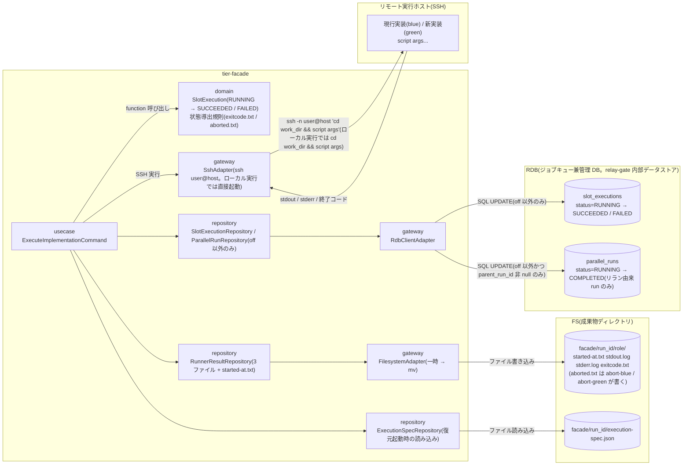
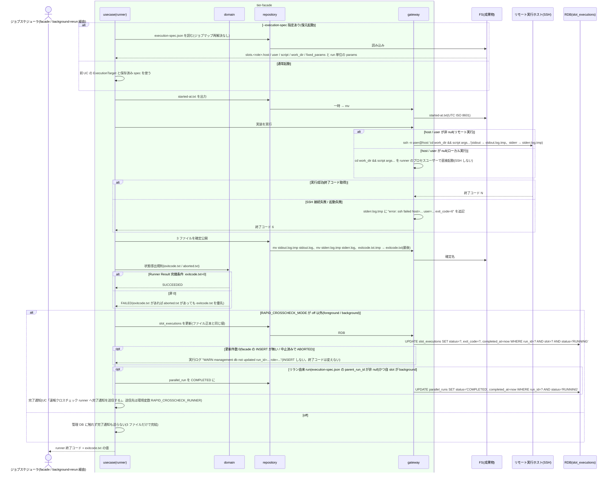

# 実装スクリプトを実行して Runner Result を出力する

## 概要

slot runner が解決済み(または `--execution-spec` から復元済み)の実行先ホストへ実行ユーザーで SSH 接続し(host / user が無い・null のローカル実行では SSH せず runner のプロセスユーザーで)、現行実装(blue)または新実装(green)のスクリプトを作業ディレクトリ・固定引数・追加引数付きで実行する。foreground / background を問わず `started-at.txt` を起動時に、`stdout.log` / `stderr.log` / `exitcode.txt` を実行終了後に一時ファイル経由で原子的に出力する。SSH 失敗・起動失敗でも 3 ファイルを揃える。slot 実行の状態はファイル正本から導出し(条件「slot 実行の状態導出規則」)、exitcode.txt が 0 なら SUCCEEDED、非 0 なら FAILED とする(exitcode.txt が無く abort-blue / abort-green が書いた `aborted.txt` があれば ABORTED。両方あるときは exitcode.txt を優先)。RAPID_CROSSCHECK_MODE が off 以外なら管理 DB の slot_executions にも同じ状態を保持し、background slot をリランした run(execution-spec.json の `parent_run_id` が非 null)では slot の終端時に parallel_run を COMPLETED にする。完了通知の送信は UC「速報クロスチェック runner へ完了通知を送信する」に委ねる。

## データフロー



| レイヤー | データモデル | 変換内容 |
|---------|------------|---------|
| usecase | ExecuteImplementationCommand | started-at.txt 出力 → SSH 実行またはローカル実行(stdout / stderr を一時ファイルへ)→ 終了コード取得 → 3 ファイル確定 → status 判定 → (off 以外) slot_executions 更新 → (off 以外かつリラン由来 run) parallel_runs COMPLETED → 完了通知(次 UC)。`--execution-spec` 指定時はジョブマップを再解決せず `slots.<role>.*` と run 単位の `params` から復元 |
| domain | SlotExecution | 状態導出規則の純粋関数: exitcode.txt あり → `0 → SUCCEEDED`、それ以外 → FAILED。exitcode.txt 無し・aborted.txt あり → ABORTED。どちらも無し → RUNNING。両方あれば exitcode.txt を優先。SSH 接続失敗は exit_code 6(ui-design.md の実行エラー。ssh 自身の 255 は 6 に読み替える。仮採用)を FAILED として扱う |
| repository | RunnerResultRepository / ExecutionSpecRepository / SlotExecutionRepository / ParallelRunRepository | 3 ファイルの原子的公開、spec の読み込み、slot_executions の条件付き UPDATE、リラン由来 run の parallel_runs 条件付き UPDATE(RUNNING → COMPLETED) |
| gateway | SshAdapter / FilesystemAdapter / RdbClientAdapter | `ssh` コマンド起動(認証は credential_ref から実行環境の設定(`~/.ssh/config` の Host 別名。仮採用)に解決)。host / user が null のローカル実行では ssh を使わず同じコマンド列を直接起動。一時ファイル → `mv`、RDB クライアント CLI(ジョブキュー兼管理 DB は relay-gate 内部のデータストア) |

## 処理フロー



## バリエーション一覧

| バリエーション名 | 値 | 処理内容 | 適用 tier | 適用箇所 |
|----------------|---|---------|----------|---------|
| 実装スロット | blue | 現行実装のスクリプトを起動。成果物 `facade/<run_id>/blue/` | tier-facade | usecase `execute_implementation` |
| 実装スロット | green | 新実装のスクリプトを起動。成果物 `facade/<run_id>/green/` | tier-facade | usecase `execute_implementation` |
| slot 実行モード | foreground | 同じ 3 ファイルを出力。facade が待機して中継する | tier-facade | usecase `execute_implementation` |
| slot 実行モード | background | 同じ 3 ファイルを出力。facade は待機しない。hang-detector が started-at.txt / exitcode.txt で監視 | tier-facade | usecase `execute_implementation` |
| Runner Result 成果物種別 | started-at.txt | 起動時に UTC ISO 8601 を 1 行 | tier-facade | repository `runner_result_repo` |
| Runner Result 成果物種別 | stdout.log | 実装の標準出力(SSH 経由) | tier-facade | gateway `ssh_adapter` |
| Runner Result 成果物種別 | stderr.log | 実装の標準エラー + SSH 失敗時の原因 | tier-facade | gateway `ssh_adapter` |
| Runner Result 成果物種別 | exitcode.txt | 数値 1 行。最後に確定する。存在すれば状態導出の正本(0 → SUCCEEDED / 非 0 → FAILED) | tier-facade | repository `runner_result_repo` |
| Runner Result 成果物種別 | aborted.txt | runner は書かない(abort-blue / abort-green が中止時のみ生成。中止日時 1 行)。exitcode.txt が無く aborted.txt があれば ABORTED、両方あれば exitcode.txt を優先 | tier-facade | domain `judge_slot_status` |
| run role(成果物ディレクトリ区分) | blue / green | `--role` の値をディレクトリ名に使う | tier-facade | repository `runner_result_repo` |
| 速報クロスチェックモード | foreground | background と同じ(slot_executions 更新 + 完了通知。両値の挙動差は RDRA に定義が無く区別しない) | tier-facade | usecase `execute_implementation` |
| 速報クロスチェックモード | background | slot_executions 更新 + (リラン由来 run の) parallel_runs COMPLETED + 完了通知 | tier-facade | usecase `execute_implementation` |
| 速報クロスチェックモード | off | 管理 DB に触れず、完了通知を送らない。3 ファイルだけで完結 | tier-facade | usecase `execute_implementation` |

## 分岐条件一覧

| 条件名 | 判定ルール | 適用 tier | 適用箇所 | BDD Scenario |
|--------|----------|----------|---------|-------------|
| Runner Result 完備条件 | 実行終了時に stdout.log / stderr.log / exitcode.txt を揃える。exitcode.txt は数値 1 行で runner の終了コードと一致。SSH 失敗・起動失敗でも 3 ファイルを出力。0 → SUCCEEDED、非 0 → FAILED | tier-facade | usecase `execute_implementation` / domain `judge_slot_status` | 実行終了後に 3 ファイルが揃う(SPEC-003-01) / SSH 失敗でも 3 ファイルを揃える(SPEC-003-02) |
| slot 実行の状態導出規則 | 状態はファイル正本から導出する: exitcode.txt があれば 0 で SUCCEEDED / 非 0 で FAILED。exitcode.txt が無く aborted.txt があれば ABORTED。どちらも無ければ RUNNING。両方あれば exitcode.txt を優先(中止後に実装が終了した場合)。RAPID_CROSSCHECK_MODE が off 以外なら管理 DB の slot_executions.status に同じ値を保持する(二重マッピング) | tier-facade | domain `judge_slot_status` / repository `slot_execution_repo` | 中止後に実装が終了した場合は exitcode.txt を優先して状態を導出する(SPEC-010-01) / RAPID_CROSSCHECK_MODE=off では管理 DB に触れず完了通知も送らない(SPEC-005-04) |
| 速報クロスチェック有効判定 | RAPID_CROSSCHECK_MODE が foreground / background なら slot_executions を更新し完了通知を送る(送信先は環境変数 RAPID_CROSSCHECK_RUNNER)。off なら管理 DB に接続せず完了通知も送らない | tier-facade | usecase `execute_implementation` | RAPID_CROSSCHECK_MODE=off では管理 DB に触れず完了通知も送らない(SPEC-005-04) |
| リラン由来 run の終端 | execution-spec.json の `parent_run_id` が非 null(`restored_at` あり)かつ自 slot が background のとき、exitcode.txt 公開後に parallel_runs を条件付き UPDATE(`status='RUNNING'` → COMPLETED)する。foreground slot を持たないリラン run の終端をここで確定する。off では管理 DB に触れない | tier-facade | usecase `execute_implementation` / repository `parallel_run_repo` | background slot をリランした run は slot の終端時に parallel_run を COMPLETED にする(SPEC-011-06) |
| 成果物公開判定 | 各ファイルは `.tmp` に書いてから `mv`。exitcode.txt を最後に確定する(exitcode.txt の存在 = 3 ファイル完備の合図) | tier-facade | repository `runner_result_repo` | 書き込み途中の確定名ファイルは存在しない(SPEC-003-03) |
| 引数連結規則 | 復元起動では `slots.<role>.fixed_params` + run 単位の `params` を、通常起動では前 UC の ArgumentList を、順序を変えずに SSH コマンドへ渡す。各引数は単一クォートでエスケープして 1 引数を維持 | tier-facade | gateway `ssh_adapter` | 空白を含む引数を 1 引数として実装へ渡す |
| 実装固有事項の runner への閉じ込め | SSH の接続方法(ポート・鍵・踏み台)、OS 差異、プロトコルは runner 実体と適用側の SSH 設定に閉じ込める。本 UC が定める契約は runner IF と 3 ファイルだけ | tier-facade | runner 実体 / gateway `ssh_adapter` | 実行終了後に 3 ファイルが揃う |
| リランの実行設定復元 | `--execution-spec <path>` があればジョブマップを読まず、`slots.<role>` の host / user / script / work_dir / fixed_params と run 単位の `params` で起動する | tier-facade | usecase `execute_implementation` | 復元起動はジョブマップを再解決しない(SPEC-009-02) |

## 計算ルール一覧

| 計算名 | 入力情報 | 計算式/ロジック | 出力情報 | 適用 tier |
|--------|---------|---------------|---------|----------|
| 状態導出 | exitcode.txt、aborted.txt | exitcode.txt あり: `0 → SUCCEEDED`、`それ以外 → FAILED`。exitcode.txt 無し・aborted.txt あり → ABORTED。どちらも無し → RUNNING(条件「slot 実行の状態導出規則」) | slot 実行 status | tier-facade |
| runner 終了コード | exitcode.txt | runner プロセスの終了コード = exitcode.txt の値(SSH 接続失敗は 6。仮採用: ui-design.md 実行エラー) | 終了コード | tier-facade |
| SSH コマンド | host、user、work_dir、script、args | `ssh -n <user>@<host> 'cd <work_dir> && <script> <arg1> <arg2> ...'`(契約 external_interfaces「SSH(実装スクリプトの実行)」の形式。`-n` で stdin を閉じる。各引数は単一クォートでエスケープ。BatchMode 等の対話禁止オプションは runner 実体 / SSH 設定に閉じ込める。仮採用)。host / user が null のローカル実行では `cd <work_dir> && <script> <arg1> ...` を runner のプロセスユーザーで直接起動する(stdin は `/dev/null`) | コマンド文字列 | tier-facade |
| リラン由来判定 | execution-spec.json の parent_run_id、自 slot の mode | `parent_run_id != null AND mode == background` なら slot 終端時に parallel_runs を COMPLETED にする | 判定 | tier-facade |
| started_at | 起動時刻 | `date -u +%Y-%m-%dT%H:%M:%SZ` | started-at.txt | tier-facade |

## 状態遷移一覧

| 状態モデル | 遷移元 | 遷移先 | トリガー | 事前条件 | 事後処理 | 適用 tier |
|-----------|--------|--------|---------|---------|---------|----------|
| slot 実行 | RUNNING | SUCCEEDED | exitcode.txt に 0 を公開 | started-at.txt 出力済み | RAPID_CROSSCHECK_MODE が off 以外のとき slot_executions 条件付き UPDATE(ファイル正本と同じ値)、完了通知(次 UC) | tier-facade |
| slot 実行 | RUNNING | FAILED | exitcode.txt に非 0 を公開(SSH 失敗含む) | started-at.txt 出力済み | RAPID_CROSSCHECK_MODE が off 以外のとき slot_executions 条件付き UPDATE、完了通知(次 UC)。hang-detector が実行エラーを通知 | tier-facade |
| 並行稼働実行 | RUNNING | COMPLETED | background slot リラン由来 run の slot 終端(exitcode.txt 公開) | execution-spec.json の parent_run_id が非 null、自 slot が background、RAPID_CROSSCHECK_MODE が off 以外、parallel_runs.status=RUNNING | 条件付き UPDATE(`WHERE run_id=? AND status='RUNNING'`)、completed_at を設定。通常起動(parent_run_id=null)では facade の中継 UC が担う | tier-facade |

## 関連 RDRA モデル

| モデル種別 | 要素名 | 関連 |
|-----------|--------|------|
| 業務 | 実装切替業務 | この UC が属する業務 |
| BUC | 実装切替ジョブ実行フロー | この UC を含む BUC |
| アクター | 運用者 | 受益者 |
| 情報 | 実行設定(execution-spec) | 実行先と引数の正本。parent_run_id でリラン由来を判定 |
| 情報 | slot 実行 | RUNNING → SUCCEEDED / FAILED。状態はファイル正本(exitcode.txt / aborted.txt)から導出 |
| 情報 | Runner Result | 出力対象(started-at.txt / stdout.log / stderr.log / exitcode.txt。aborted.txt は abort-blue / abort-green が中止時のみ生成) |
| 情報 | 並行稼働実行(parallel_run) | background slot リラン由来 run の終端で COMPLETED に更新 |
| 情報 | 実行ログ | SSH 開始・終了・所要時間・成否 |
| 条件 | Runner Result 完備条件 / 成果物公開判定 / 引数連結規則 / 実装固有事項の runner への閉じ込め / slot 実行の状態導出規則 / 速報クロスチェック有効判定 | 分岐条件一覧を参照 |
| バリエーション | 実装スロット / slot 実行モード / Runner Result 成果物種別(aborted.txt を含む)/ run role / 速報クロスチェックモード(foreground / background / off) | バリエーション一覧を参照 |
| 画面 | slot runner 実行出力(→ CLI 出力) | 3 ファイルと実行ログ |
| イベント | 実行先ホストへのリモート実行 / 現行実装スクリプトの起動 / 新実装スクリプトの起動 | SSH 実行(ローカル実行では直接起動) |
| 外部システム | リモート実行ホスト(SSH) / 現行実装(blue) / 新実装(green) | 実行先 |
| 内部データストア | ジョブキュー兼管理 DB(RDB) | RAPID_CROSSCHECK_MODE が off 以外のときの slot_executions / parallel_runs 更新先(relay-gate 内部の構成要素) |
| 状態 | slot 実行 / 並行稼働実行 | 状態遷移一覧を参照 |

## 関連 USDM

| REQ ID | SPEC ID | 対応 BDD Scenario |
|---|---|---|
| REQ-003 | SPEC-003-01 | 実行終了後に 3 ファイルが揃う / runner の終了コードは exitcode.txt と一致する / 起動時に started-at.txt を出力する |
| REQ-003 | SPEC-003-02 | SSH 失敗でも 3 ファイルを揃える |
| REQ-003 | SPEC-003-03 | 書き込み途中の確定名ファイルは存在しない |
| REQ-003 | SPEC-003-04 | background でも同じ 3 ファイルを残す |
| REQ-004 | SPEC-004-04 | ローカル実行の slot は SSH せず runner のプロセスユーザーで実行する |
| REQ-005 | SPEC-005-04 | RAPID_CROSSCHECK_MODE=off では管理 DB に触れず完了通知も送らない / RAPID_CROSSCHECK_MODE=foreground でも background と同じく slot_executions を更新し完了通知を送る |
| REQ-009 | SPEC-009-02 | 復元起動はジョブマップを再解決しない |
| REQ-010 | SPEC-010-01 | 中止後に実装が終了した場合は exitcode.txt を優先して状態を導出する / 中止済み slot で runner が再起動されても実装を再実行しない |
| REQ-011 | SPEC-011-06 | background slot をリランした run は slot の終端時に parallel_run を COMPLETED にする |

## E2E 完了条件(BDD)

### 正常系

```gherkin
Feature: 実装スクリプトを実行して Runner Result を出力する

  Scenario: 実行終了後に 3 ファイルが揃う(SPEC-003-01)
    Given green のジョブマップが host=host-green-01 user=batch script=/opt/app/bin/job001.sh work_dir=/var/app/work を解決する
    And job001.sh は stdout に "done" を出し終了コード 0 で終了する
    When facade が green runner を --run-id 20260830T113000-JOB001-3f9a1c2e --job-id JOB001 --role green --mode background で起動し実行が終了する
    Then facade/20260830T113000-JOB001-3f9a1c2e/green/ に stdout.log stderr.log exitcode.txt が揃う
    And stdout.log の内容は "done"、exitcode.txt の内容は "0" の 1 行である
    And slot 実行は SUCCEEDED である

  Scenario: runner の終了コードは exitcode.txt と一致する(SPEC-003-01)
    Given job001.sh は終了コード 4 で終了する
    When green runner が実行を終える
    Then exitcode.txt の内容は "4" であり runner プロセスの終了コードも 4 である
    And slot 実行は FAILED である

  Scenario: 起動時に started-at.txt を出力する(SPEC-003-01)
    Given job001.sh は 120 秒かかる
    When green runner を --mode background で起動して 5 秒後に確認する
    Then facade/<run_id>/green/started-at.txt が存在し UTC ISO 8601(例 2026-08-30T11:30:05Z)の 1 行である
    And exitcode.txt はまだ存在しない

  Scenario: background でも同じ 3 ファイルを残す(SPEC-003-04)
    Given feature flag に GREEN_MODE=background がある
    When green の実行が終了する
    Then facade/<run_id>/green/ に stdout.log stderr.log exitcode.txt が残る

  Scenario: 空白を含む引数を 1 引数として実装へ渡す
    Given fixed_params=["p2 p3"] params=["a"] である
    And job001.sh は受け取った引数の個数と各値を stdout に出す
    When green runner が実行を終える
    Then stdout.log に "argc=2" と "p2 p3" と "a" が含まれる

  Scenario: 復元起動はジョブマップを再解決しない(SPEC-009-02)
    Given 元の execution-spec.json の slots.green が host=host-green-01 script=/opt/app/bin/job001.sh を持つ
    And 現在の green-job-map.csv は JOB001 を host=host-green-02 に変更済みである
    When green runner を --execution-spec facade/20260830T150000-JOB001-9b8c7d6e/execution-spec.json 付きで起動する
    Then SSH 接続先は host-green-01 であり、実行ログに "job map resolved" は出ない

  Scenario: ローカル実行の slot は SSH せず runner のプロセスユーザーで実行する(SPEC-004-04)
    Given blue-job-map.csv に host と user の列が無く、JOB001 行が work_dir=/var/app/work script=/opt/app/bin/job001.sh である
    When facade が blue runner を --role blue --mode foreground で起動し実行が終了する
    Then ssh コマンドは実行されず、job001.sh は runner と同じ OS ユーザーで /var/app/work を作業ディレクトリとして実行される(stdin は /dev/null)
    And facade/<run_id>/blue/ に stdout.log stderr.log exitcode.txt が揃う
    And 実行ログに "INFO local exec started run_id=<run_id> role=blue work_dir=/var/app/work script=/opt/app/bin/job001.sh" と "INFO local exec finished run_id=<run_id> role=blue exit_code=0" が出る

  Scenario: RAPID_CROSSCHECK_MODE=off では管理 DB に触れず完了通知も送らない(SPEC-005-04)
    Given feature flag に RAPID_CROSSCHECK_MODE=off があり、管理 DB の接続設定が存在しない
    When green runner が --mode background で実行を終える
    Then 3 ファイルは揃い、管理 DB への接続は発生せず、速報クロスチェック runner は起動されない

  Scenario: RAPID_CROSSCHECK_MODE=foreground でも background と同じく slot_executions を更新し完了通知を送る(SPEC-005-04)
    Given feature flag に RAPID_CROSSCHECK_MODE=foreground RAPID_CROSSCHECK_RUNNER=/opt/relay-gate/rapid-crosscheck-runner.sh がある
    When green runner が --mode background で終了コード 0 で実行を終える
    Then slot_executions の該当行は status=SUCCEEDED であり、/opt/relay-gate/rapid-crosscheck-runner.sh に green-completed が送られる

  Scenario: background slot をリランした run は slot の終端時に parallel_run を COMPLETED にする(SPEC-011-06)
    Given background-rerun.sh --role green が run_id=20260830T150000-JOB001-9b8c7d6e の parallel_run を parent_run_id=20260830T113000-JOB001-3f9a1c2e で作成し RUNNING にした
    And その execution-spec.json の parent_run_id は非 null で slots.green.mode は background、RAPID_CROSSCHECK_MODE=background である
    When green runner が --execution-spec 付きで実行を終え exitcode.txt を公開する
    Then parallel_runs の run_id=20260830T150000-JOB001-9b8c7d6e の行は status=COMPLETED で completed_at が設定されている
    And 実行ログに "parallel_run status changed from=RUNNING to=COMPLETED run_id=20260830T150000-JOB001-9b8c7d6e" が出る
```

### 異常系

```gherkin
  Scenario: SSH 失敗でも 3 ファイルを揃える(SPEC-003-02)
    Given green のジョブマップが host=host-unreachable を解決する
    When green runner が起動し SSH 接続に失敗する
    Then facade/<run_id>/green/ に stdout.log(空) stderr.log exitcode.txt が揃う
    And exitcode.txt の内容は "6" であり runner の終了コードも 6 である
    And stderr.log に "error: ssh failed host=host-unreachable user=batch exit_code=6" が含まれる
    And slot 実行は FAILED である

  Scenario: 書き込み途中の確定名ファイルは存在しない(SPEC-003-03)
    Given job001.sh が stdout へ 10 MB を出力し続けている
    When 実行中に成果物ディレクトリを確認する
    Then stdout.log.tmp は存在してもよいが stdout.log と exitcode.txt は存在しない
    And 実行終了後に .tmp サフィックスのファイルは残らない

  Scenario: 中止後に実装が終了した場合は exitcode.txt を優先して状態を導出する(SPEC-010-01)
    Given green(background)の実行中に abort-green.sh が facade/<run_id>/green/aborted.txt を書いた
    And 実装プロセスはその後も継続し終了コード 0 で終了した
    When green runner が exitcode.txt を公開する
    Then 成果物ディレクトリに aborted.txt と exitcode.txt の両方があり、状態導出規則は exitcode.txt を優先して SUCCEEDED と判定する
    And RAPID_CROSSCHECK_MODE=background のとき slot_executions の条件付き UPDATE(status='RUNNING')は 0 件となり、実行ログに "WARN management db not updated run_id=<run_id> role=green" を残して終了コードは 0 のままである

  Scenario: 中止済み slot で runner が再起動されても実装を再実行しない(SPEC-010-01)
    Given facade/<run_id>/green/ に aborted.txt があり exitcode.txt が無い
    When 同じ run_id / role で green runner が再起動される
    Then 実装は実行されず、exitcode.txt は書かれない
    And 実行ログに "WARN slot already aborted run_id=<run_id> role=green" を残して終了コード 6 で終了する
```

## ティア別仕様

- [facade / slot runner ティア](tier-facade.md)

### 統合契約

- [CLI コマンド契約](../../../_cross-cutting/api/cli-command-contract.yaml)(runner IF を uses)
- [AsyncAPI Spec](../../../_cross-cutting/api/asyncapi.yaml)(`slot-completed` の publish は次 UC)
- 完了通知: [速報クロスチェック runner へ完了通知を送信する](../../../クロスチェック業務/速報クロスチェックフロー/速報クロスチェック%20runner%20へ完了通知を送信する/spec.md)
- runner 実体の契約: [slot runner の実体スクリプトを割り当てる](../../../適用構成業務/適用構成定義フロー/slot%20runner%20の実体スクリプトを割り当てる/tier-facade.md)
