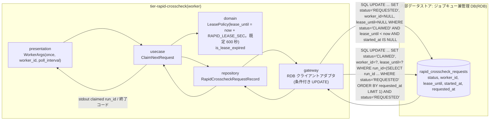
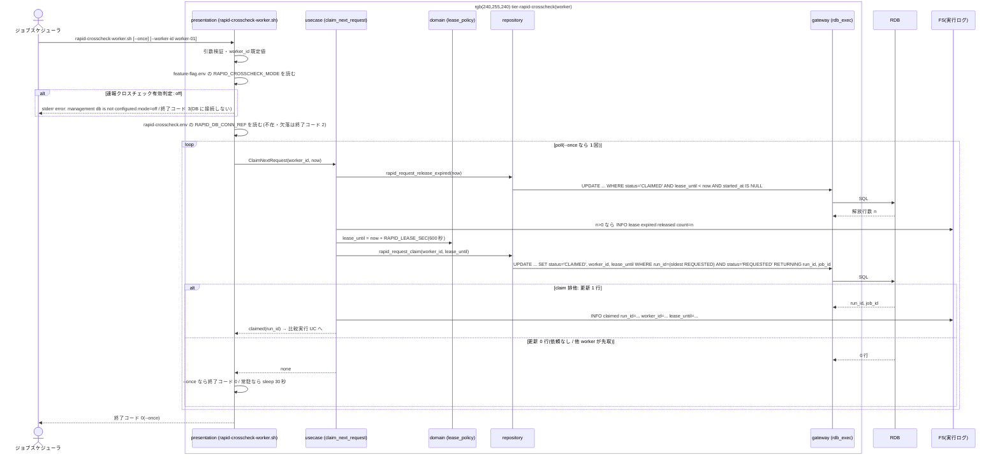

# 速報比較依頼を claim する

## 概要

速報クロスチェック worker(`rapid-crosscheck-worker.sh [--once] [--worker-id]`)が管理 DB の rapid_crosscheck_requests をジョブキューとして poll(速報クロスチェック設定の poll 間隔 RAPID_POLL_INTERVAL_SEC。既定 30 秒)し、REQUESTED の依頼を条件付き UPDATE で worker_id と lease_until(now + lease 期間 RAPID_LEASE_SEC。既定 600 秒 = 10 分)付きの CLAIMED にする。管理 DB への接続参照名・lease 期間・poll 間隔は基盤適用設計者が所有する速報クロスチェック設定(rapid-crosscheck.env。情報「速報クロスチェック設定」)から読む。CLAIMED で lease が失効しかつ未開始(started_at IS NULL)の依頼は REQUESTED へ戻し、別の worker が再取得できるようにして多重実行を防ぐ。速報の処理はジョブスケジューラ応答に影響させず、確報側(final_*)には触れない。

## データフロー



| レイヤー | データモデル | 変換内容 |
|---------|------------|---------|
| presentation | WorkerArgs(once=false, worker_id=`$(hostname | tr . -)-$$`(ホスト名の `.` は `-` に置換), poll_interval=RAPID_POLL_INTERVAL_SEC(既定 30)) | 引数解析・既定値適用 |
| usecase | ClaimNextRequest | lease 失効分の解放 → 1 件 claim → 結果を返す(claim できなければ次の poll) |
| domain | LeasePolicy | lease_until の算出、失効判定(now > lease_until AND started_at IS NULL) |
| repository / gateway | 条件付き UPDATE 2 本 | 排他は WHERE 句で担保(行ロック不要) |

## 処理フロー



## バリエーション一覧

| バリエーション名 | 値 | 処理内容 | 適用 tier | 適用箇所 |
|----------------|---|---------|----------|---------|
| 速報クロスチェックのプロセス役割 | worker | 本 UC の実行主体 | tier-rapid-crosscheck | rapid-crosscheck-worker.sh |
| 速報クロスチェックのプロセス役割 | runner(dispatcher) | 依頼の作成元(本 UC は参照しない) | tier-rapid-crosscheck | — |
| クロスチェック依頼状態 | REQUESTED | claim 対象 | tier-rapid-crosscheck | rapid_request_claim |
| クロスチェック依頼状態 | CLAIMED | claim 後の状態。lease 失効かつ未開始なら REQUESTED に戻す | tier-rapid-crosscheck | rapid_request_release_expired |
| クロスチェック依頼状態 | RUNNING / SUCCEEDED / FAILED / ABORTED | claim 対象外。lease 解放対象外 | tier-rapid-crosscheck | rapid_request_claim |
| クロスチェック種別 | 速報クロスチェック | rapid_crosscheck_requests のみを poll する | tier-rapid-crosscheck | claim_next_request |
| 速報クロスチェックモード | foreground / background | 管理 DB に接続して poll する(両値で同じ挙動) | tier-rapid-crosscheck | rapid-crosscheck-worker.sh |
| 速報クロスチェックモード | off | 管理 DB に接続せず終了コード 3 | tier-rapid-crosscheck | rapid-crosscheck-worker.sh |
| 設定所有区分 | 速報クロスチェック設定 | 管理 DB 接続参照名・lease 期間・poll 間隔の正本は速報クロスチェック設定(rapid-crosscheck.env。所有者: 基盤適用設計者)。worker は値を上書きせず読むだけ | tier-rapid-crosscheck | rapid-crosscheck-worker.sh(設定読み取り) |

## 分岐条件一覧

| 条件名 | 判定ルール | 適用 tier | 適用箇所 | BDD Scenario |
|--------|----------|----------|---------|-------------|
| claim 排他 | `UPDATE ... WHERE status='REQUESTED'` の更新行数が 1 のときだけ claim 成功。worker_id と lease_until が設定され、lease 有効中は他 worker の同 UPDATE が 0 行になる | tier-rapid-crosscheck | rapid_request_claim(repository) | 2 worker が同時に poll しても claim は 1 つ |
| lease 失効判定 | `status='CLAIMED' AND lease_until < now AND started_at IS NULL` の依頼を REQUESTED に戻す(worker_id / lease_until を NULL)。started_at が設定済み(RUNNING 移行済み)は戻さない。備考: parallel_runs.status は参照しないため、abort-blue / abort-green で中止した run の CLAIMED 依頼も本判定で REQUESTED に戻り再 claim されうる(RDRA に無い判断は発明せず claim の振る舞いは変えない。止めるには abort-rapid-crosscheck の対象拡張が必要。RDRA 変更要望: rdra-feedback #15) | tier-rapid-crosscheck | rapid_request_release_expired(repository)/ is_lease_expired(domain) | lease 失効かつ未開始の依頼を再取得する |
| 依頼状態遷移規則 | REQUESTED → CLAIMED(claim)、CLAIMED → REQUESTED(lease 失効)。他の遷移は本 UC で行わない | tier-rapid-crosscheck | claim_next_request | REQUESTED の依頼を claim する |
| 速報結果の位置付け | worker の処理・終了コードはジョブスケジューラの業務ジョブ応答に影響しない(別プロセス) | tier-rapid-crosscheck | rapid-crosscheck-worker.sh | REQUESTED の依頼を claim する |
| 速報と確報のモデル分離 | rapid_crosscheck_requests のみを poll / UPDATE する。final_crosscheck_requests は対象外 | tier-rapid-crosscheck | claim_next_request | REQUESTED の依頼を claim する |
| 速報クロスチェック有効判定 | worker は起動時に feature-flag.env の `RAPID_CROSSCHECK_MODE`(foreground / background / off)を読む。off なら管理 DB に接続せず `error: management db is not configured mode=off` で終了コード 3。off 以外(foreground / background。両値で同じ挙動)なら rapid-crosscheck.env の `RAPID_DB_CONN_REF` で接続する(不在・欠落は終了コード 2) | tier-rapid-crosscheck | rapid-crosscheck-worker.sh(presentation) | RAPID_CROSSCHECK_MODE=off では管理 DB に接続しない |

## 計算ルール一覧

| 計算名 | 入力情報 | 計算式/ロジック | 出力情報 | 適用 tier |
|--------|---------|---------------|---------|----------|
| lease_until | now(ローカル時刻), `RAPID_LEASE_SEC`(速報クロスチェック設定 rapid-crosscheck.env の属性「lease 期間(秒)」。既定 600) | now + RAPID_LEASE_SEC 秒(既定 10 分)。ローカル時刻(タイムゾーン指示子なし)で保存する | rapid_crosscheck_requests.lease_until | tier-rapid-crosscheck |
| 現在時刻(now) | システム時刻(ローカル時刻)、`RELAY_GATE_NOW`(テスト専用環境変数。UTC の Z 付き ISO 8601 で受け取り、ローカル時刻へ変換して使う。本番では未設定。設定されているときは now() の代わりにこの値を現在時刻として使う) | RELAY_GATE_NOW が設定されていればその値(ローカルへ変換)、無ければシステム時刻。lease_until の算出と lease 失効判定の両方に同じ now を使う | now | tier-rapid-crosscheck |
| lease 失効 | lease_until, now, started_at | `lease_until < now AND started_at IS NULL` → true | 解放対象 | tier-rapid-crosscheck |
| poll 間隔 | `RAPID_POLL_INTERVAL_SEC`(速報クロスチェック設定 rapid-crosscheck.env の属性「worker の poll 間隔(秒)」。既定 30) | claim 0 件のとき sleep する秒数(常駐時) | 待機時間 | tier-rapid-crosscheck |
| 管理 DB 接続先 | `RAPID_DB_CONN_REF`(速報クロスチェック設定 rapid-crosscheck.env の属性「管理 DB 接続参照名」) | 参照名から接続情報を解決する(値そのものは設定ファイルに置かない) | gateway の接続先 | tier-rapid-crosscheck |
| worker_id 既定値 | hostname, PID | `--worker-id` 未指定なら `{hostname}-{pid}` | rapid_crosscheck_requests.worker_id | tier-rapid-crosscheck |
| claim 順序 | requested_at | REQUESTED のうち requested_at 昇順で 1 件 | 対象 run_id | tier-rapid-crosscheck |

## 状態遷移一覧

| 状態モデル | 遷移元 | 遷移先 | トリガー | 事前条件 | 事後処理 | 適用 tier |
|-----------|--------|--------|---------|---------|---------|----------|
| クロスチェック依頼 | REQUESTED | CLAIMED | worker の poll / claim | 条件付き UPDATE が 1 行 | worker_id / lease_until 設定。比較実行 UC へ | tier-rapid-crosscheck |
| クロスチェック依頼 | CLAIMED | REQUESTED | lease 失効 | lease_until < now かつ started_at IS NULL | worker_id / lease_until を NULL。別 worker が再取得可 | tier-rapid-crosscheck |

## 関連 RDRA モデル

| モデル種別 | 要素名 | 関連 |
|-----------|--------|------|
| 業務 | クロスチェック業務 | この UC が属する業務 |
| BUC | 速報クロスチェックフロー | この UC を含む BUC(アクティビティ: 比較依頼の取得) |
| アクター | 運用者 | 受益者(自動) |
| 情報 | 速報比較依頼(rapid_crosscheck_request) | poll / claim / lease 更新 |
| 情報 | feature flag 設定 | RAPID_CROSSCHECK_MODE(foreground / background / off)の参照(off なら DB に接続しない)。本コマンドの実体は RAPID_CROSSCHECK_WORKER が指す |
| 情報 | 速報クロスチェック設定 | rapid-crosscheck.env を読む。属性: 管理 DB 接続参照名(RAPID_DB_CONN_REF。値は置かず参照名のみ)、lease 期間(秒。RAPID_LEASE_SEC)、worker の poll 間隔(秒。RAPID_POLL_INTERVAL_SEC)。所有者は基盤適用設計者(設定所有区分)。tier-rapid-crosscheck |
| バリエーション | 設定所有区分 | 速報クロスチェック設定(所有者: 基盤適用設計者) |
| 状態 | クロスチェック依頼 | REQUESTED ⇄ CLAIMED |
| 条件 | 依頼状態遷移規則 | 適用 |
| 条件 | claim 排他 | 適用 |
| 条件 | lease 失効判定 | 適用 |
| 画面 | rapid-crosscheck worker claim 出力(→ CLI 出力) | stdout / 実行ログ |
| イベント | 速報比較依頼の claim と lease 更新 | 管理 DB(RDB)への条件付き UPDATE |
| 内部データストア | ジョブキュー兼管理 DB(RDB) | ジョブキュー(relay-gate 内部の構成要素。外部システムではない) |

## 関連 USDM

| REQ ID | SPEC ID | 対応 BDD Scenario |
|--------|---------|-----------------|
| REQ-005 | SPEC-005-03 | REQUESTED の依頼を claim する(SPEC-005-03) |
| REQ-007 | SPEC-007-01 | lease 失効かつ未開始の依頼を再取得する(SPEC-007-01) |
| REQ-007 | SPEC-007-02 | REQUESTED の依頼を claim する(SPEC-005-03)(worker_id / lease_until の設定) |
| REQ-005 | SPEC-005-06 | 設定された lease 期間と poll 間隔で claim と poll が行われる(SPEC-005-06)(AC「設定された参照名で管理 DB に接続し…」の lease / poll 側。接続参照名側は UC「速報クロスチェック runner へ完了通知を送信する」)/ 速報クロスチェック設定の所有者は基盤適用設計者である(SPEC-005-06) |

## E2E 完了条件(BDD)

### 正常系

```gherkin
Feature: 速報比較依頼を claim する

  Scenario: REQUESTED の依頼を claim する(SPEC-005-03)
    Given RAPID_CROSSCHECK_MODE=background で rapid_crosscheck_requests に run_id=20260830T113000-JOB001-3f9a1c2e, status=REQUESTED, requested_at=2026-08-30T11:45:10 の行がある
    And テスト専用環境変数 RELAY_GATE_NOW=2026-08-30T11:45:40Z が設定されている(worker はこれをローカル時刻へ変換して now として使う。TZ=UTC 前提)
    When ジョブスケジューラが `rapid-crosscheck-worker.sh --once --worker-id worker-01` を起動する
    Then 依頼の status は `CLAIMED`、worker_id は `worker-01`、lease_until は `2026-08-30T11:55:40` である
    And 実行ログに `INFO claimed run_id=20260830T113000-JOB001-3f9a1c2e worker_id=worker-01 lease_until=2026-08-30T11:55:40` が残る
    And final_crosscheck_requests は変更されない

  Scenario: 設定された lease 期間と poll 間隔で claim と poll が行われる(SPEC-005-06)
    Given feature flag 設定に RAPID_CROSSCHECK_MODE=background が定義されている
    And 速報クロスチェック設定 $RELAY_GATE_CONFIG_DIR/rapid-crosscheck.env に `RAPID_DB_CONN_REF=relaygate-db`、`RAPID_LEASE_SEC=300`、`RAPID_POLL_INTERVAL_SEC=10` の行があり、認証情報の値は含まれない
    And rapid_crosscheck_requests に run_id=20260830T113000-JOB001-3f9a1c2e, status=REQUESTED の行がある
    And RELAY_GATE_NOW=2026-08-30T11:45:40Z が設定されている(TZ=UTC 前提)
    When `rapid-crosscheck-worker.sh --worker-id worker-01` を常駐起動する
    Then worker は参照名 `relaygate-db` から解決した接続情報で管理 DB に接続し、依頼の status は `CLAIMED`、lease_until は `2026-08-30T11:50:40`(now + 300 秒)である
    And 依頼が無くなった後の poll 間隔は 10 秒である(既定の 30 秒ではない)

  Scenario: 速報クロスチェック設定の所有者は基盤適用設計者である(SPEC-005-06)
    Given 契約 config_files[rapid-crosscheck.env] の owner が `基盤適用設計者(設定所有区分: 速報クロスチェック設定。RDRA 情報「速報クロスチェック設定」)` で、バリエーション「設定所有区分」の値に `速報クロスチェック設定` がある
    When 速報クロスチェック設定(rapid-crosscheck.env)の所有者を確認する
    Then 管理 DB 接続参照名・lease 期間・worker の poll 間隔の正本は速報クロスチェック設定であり、所有者は基盤適用設計者である
    And worker はこれらの値を読むだけで、他の設定ファイル(feature-flag.env / hang-detector.env)から lease 期間・poll 間隔を読まない

  Scenario: lease 失効かつ未開始の依頼を再取得する(SPEC-007-01)
    Given rapid_crosscheck_requests に run_id=20260830T113000-JOB001-3f9a1c2e, status=CLAIMED, worker_id=worker-01, lease_until=2026-08-30T11:55:40, started_at=NULL の行がある
    And RELAY_GATE_NOW=2026-08-30T11:56:00Z が設定されている(TZ=UTC 前提)
    When `rapid-crosscheck-worker.sh --once --worker-id worker-02` を起動する
    Then 依頼はいったん REQUESTED に戻された後 `CLAIMED` になり、worker_id は `worker-02`、lease_until は `2026-08-30T12:06:00` である

  Scenario: 2 worker が同時に poll しても claim は 1 つ
    Given rapid_crosscheck_requests に status=REQUESTED の行が 1 件だけある
    When `rapid-crosscheck-worker.sh --once --worker-id worker-01` と `rapid-crosscheck-worker.sh --once --worker-id worker-02` を同時に起動する
    Then 依頼の worker_id は worker-01 か worker-02 のどちらか一方で、両 worker の終了コードは 0 である
```

### 異常系

```gherkin
  Scenario: lease 有効中の依頼は他 worker が取得できない
    Given rapid_crosscheck_requests に status=CLAIMED, worker_id=worker-01, lease_until=2026-08-30T11:55:40, started_at=NULL の行がある
    And RELAY_GATE_NOW=2026-08-30T11:50:00Z が設定されている(TZ=UTC 前提)
    When `rapid-crosscheck-worker.sh --once --worker-id worker-02` を起動する
    Then 依頼の status は `CLAIMED`、worker_id は `worker-01` のままで、worker-02 は終了コード 0 で終了する

  Scenario: 管理 DB に接続できない
    Given RAPID_CROSSCHECK_MODE=background で rapid-crosscheck.env の RAPID_DB_CONN_REF=relaygate-db が指す管理 DB が停止している
    When `rapid-crosscheck-worker.sh --once --worker-id worker-01` を起動する
    Then 終了コードは 6 で stderr に `error: management db connection failed worker_id=worker-01 conn_ref=relaygate-db` が出る

  Scenario: RAPID_CROSSCHECK_MODE=off では管理 DB に接続しない
    Given feature flag 設定に RAPID_CROSSCHECK_MODE=off が定義されている
    And rapid-crosscheck.env が存在しない
    When `rapid-crosscheck-worker.sh --once --worker-id worker-01` を起動する
    Then 終了コードは 3 で stderr に `error: management db is not configured mode=off` が出る
    And 管理 DB への接続は行われず、rapid_crosscheck_requests は変更されない
```

## ティア別仕様

- [速報クロスチェックティア](tier-rapid-crosscheck.md)

### 統合 API Spec

- [CLI コマンド契約](../../../_cross-cutting/api/cli-command-contract.yaml)(`rapid-crosscheck-worker.sh`)
- [AsyncAPI Spec](../../../_cross-cutting/api/asyncapi.yaml)(channel `rapid-crosscheck-requests` を subscribe)
