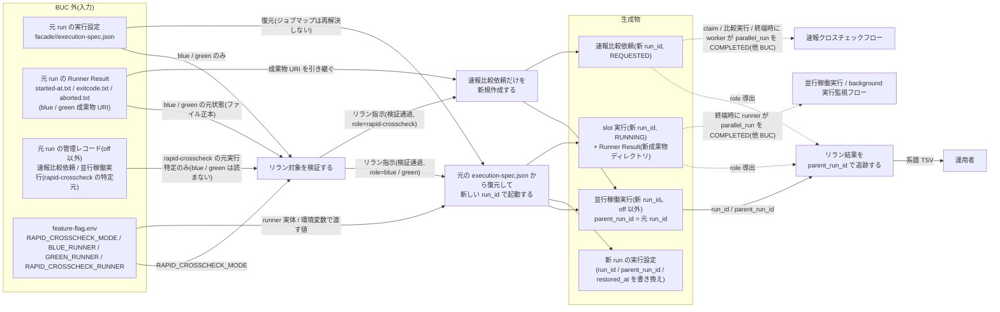
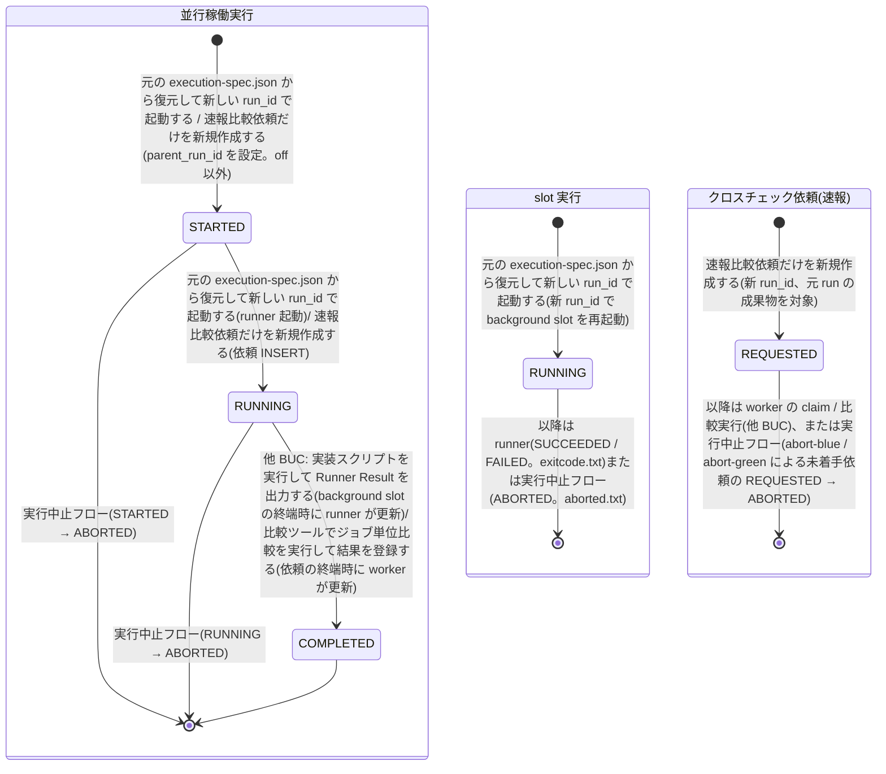

# background 側リランフロー

## 概要

ジョブスケジューラの専用ジョブから起動された background-rerun が、終端(SUCCEEDED / FAILED / ABORTED)した background slot 実行または速報比較依頼を、元の実行設定(execution-spec.json)を復元して新しい run_id で再実行する BUC。`--role blue / green` は業務ジョブを background で再起動し、`--role rapid-crosscheck` は業務ジョブを再実行せず速報比較依頼だけを REQUESTED で再作成する。元 slot の状態は RAPID_CROSSCHECK_MODE によらず成果物のファイル正本(exitcode.txt / aborted.txt)から導出するため、off でも abort-blue / abort-green が書いた aborted.txt があれば管理 DB なしでリランできる。新しい run の parent_run_id に直前のリラン元 run_id を設定し、運用者は系譜を元の実行まで数珠つなぎに追跡できる。リラン由来の parallel_run は、background slot をリランした場合は slot の終端時に runner が、速報比較依頼だけを再作成した場合は依頼の終端時に worker が COMPLETED にする。foreground slot 実行と確報クロスチェックはこの BUC の対象外で、ジョブスケジューラの正規ジョブを直接再実行する。

## 所属 UC 一覧

| UC名 | アクター | 主な操作 | 関連情報 |
|------|---------|---------|---------|
| [リラン対象を検証する](リラン対象を検証する/spec.md) | ジョブスケジューラ(専用ジョブ)/ 運用者(受益者) | role × 元 mode × 元状態の判定表でリラン可否を事前検証する。元実行の特定元は role で分岐(blue / green: 元の execution-spec.json + 成果物ファイル(started-at.txt / exitcode.txt / aborted.txt)。元状態は RAPID_CROSSCHECK_MODE によらずファイル正本のみ。rapid-crosscheck: 管理 DB の依頼レコードのみ。execution-spec.json を持たない rapid-crosscheck リラン run も元にできる) | リラン指示、実行設定(execution-spec)、並行稼働実行、slot 実行、速報比較依頼、Runner Result |
| [元の execution-spec.json から復元して新しい run_id で起動する](元の%20execution-spec.json%20から復元して新しい%20run_id%20で起動する/spec.md) | ジョブスケジューラ(専用ジョブ)/ 運用者(受益者) | `--role blue / green` で新 run_id を発行し、(off 以外)parallel_run(parent_run_id 付き)を作成、元 spec を復元して background slot を再起動する。feature-flag.env を読み runner へ環境変数で渡す | リラン指示、実行設定(execution-spec)、並行稼働実行、slot 実行、Runner Result |
| [速報比較依頼だけを新規作成する](速報比較依頼だけを新規作成する/spec.md) | ジョブスケジューラ(専用ジョブ)/ 運用者(受益者) | `--role rapid-crosscheck` で新 run_id の parallel_run と速報比較依頼(REQUESTED)を 1 トランザクションで作成し、worker の通常 claim に委ねる | リラン指示、速報比較依頼、並行稼働実行、Runner Result |
| [リラン結果を parent_run_id で追跡する](リラン結果を%20parent_run_id%20で追跡する/spec.md) | 運用者 | 指定 run_id から parent_run_id を元の実行まで辿り、系譜を TSV で参照する | 並行稼働実行、リラン指示、Runner Result、実行ログ |

検証 → 復元起動(blue / green)または依頼再作成(rapid-crosscheck)の 3 UC が background-rerun の 1 回の実行を構成する。系譜追跡は運用者が別スクリプトで行う参照系 UC。

## UC 横断データフロー

BUC 内の UC 間で情報がどう流れるかを示す。情報がどの UC で作成(C)・参照(R)・更新(U)されるかを明記する。

### データフロー図

### 情報 CRUD マトリクス

分母は BUC.tsv でこの BUC に紐づく 7 情報。列見出しは以下の略記表に従う。

| 略記 | UC名 |
|------|------|
| 検証 | リラン対象を検証する |
| 復元起動 | 元の execution-spec.json から復元して新しい run_id で起動する |
| 依頼再作成 | 速報比較依頼だけを新規作成する |
| 追跡 | リラン結果を parent_run_id で追跡する |

| 情報名 | 検証 | 復元起動 | 依頼再作成 | 追跡 |
|--------|:----:|:----:|:----:|:----:|
| リラン指示 | C | U | U | R |
| 実行設定(execution-spec) | R | R / C | R(間接: execution_spec_uri の複製) | R |
| 並行稼働実行(parallel_run) | R | C / U | C / U | R |
| slot 実行 | R | C | - | R |
| 速報比較依頼(rapid_crosscheck_request) | R | - | C | R |
| Runner Result | R | C | R | R |
| 実行ログ | C | - | - | C |

補足:

- リラン指示は永続化しない情報。検証 UC が source_run_id / role / 事前検証結果を確定し(C)、後続 2 UC が新 run_id / parent_run_id を確定する(U)。追跡 UC は run_id ↔ parent_run_id の対応として参照する。
- 実行設定の C は新 run の execution-spec.json(元 spec の run_id / parent_run_id / restored_at を書き換えて一度きり保存。他のキーは不変)。依頼再作成は新 spec を作らず、元の execution_spec_uri をそのまま複製する。
- 並行稼働実行の C / U は `[*]` → STARTED の作成と STARTED → RUNNING の更新(RAPID_CROSSCHECK_MODE が off 以外のときだけ)。以降の RUNNING → COMPLETED は他 BUC(runner / worker)が行う。
- Runner Result の C は復元起動が起動した runner が新成果物ディレクトリへ出力するもの(出力自体は tier-facade の runner)。検証 UC の R は元 slot の状態導出(started-at.txt / exitcode.txt / aborted.txt。モードによらず常に)。
- 速報比較依頼だけを新規作成する UC は速報実行(rapid_run)も作成するが、BUC.tsv 上この BUC に紐づかない(UC spec に記載)。

## 状態遷移全体図

BUC 内で関連する状態モデルは 3 つ(slot 実行 / 並行稼働実行 / クロスチェック依頼)。この BUC はそれぞれの初期遷移(新 run_id での作成)だけを担当し、以後の SUCCEEDED / FAILED / COMPLETED は runner・worker(他 BUC)、ABORTED は実行中止フローが担当する。リラン由来 parallel_run の COMPLETED 到達経路は状態モデル「並行稼働実行」に定義されている(RUNNING → COMPLETED。遷移 UC「実装スクリプトを実行して Runner Result を出力する」/「比較ツールでジョブ単位比較を実行して結果を登録する」)。

### 状態遷移 UC マッピング

| 状態モデル | 遷移元 | 遷移先 | 担当 UC |
|-----------|--------|--------|--------|
| slot 実行 | `[*]` | RUNNING | [元の execution-spec.json から復元して新しい run_id で起動する](元の%20execution-spec.json%20から復元して新しい%20run_id%20で起動する/spec.md) |
| 並行稼働実行 | `[*]` | STARTED | [元の execution-spec.json から復元して新しい run_id で起動する](元の%20execution-spec.json%20から復元して新しい%20run_id%20で起動する/spec.md) |
| 並行稼働実行 | STARTED | RUNNING | [元の execution-spec.json から復元して新しい run_id で起動する](元の%20execution-spec.json%20から復元して新しい%20run_id%20で起動する/spec.md) |
| 並行稼働実行 | `[*]` | STARTED | [速報比較依頼だけを新規作成する](速報比較依頼だけを新規作成する/spec.md) |
| 並行稼働実行 | STARTED | RUNNING | [速報比較依頼だけを新規作成する](速報比較依頼だけを新規作成する/spec.md) |
| クロスチェック依頼 | `[*]` | REQUESTED | [速報比較依頼だけを新規作成する](速報比較依頼だけを新規作成する/spec.md) |
| 並行稼働実行 | RUNNING | COMPLETED | (他 BUC)実装スクリプトを実行して Runner Result を出力する(復元起動由来の run)/ 比較ツールでジョブ単位比較を実行して結果を登録する(依頼再作成由来の run) |

[リラン対象を検証する](リラン対象を検証する/spec.md) と [リラン結果を parent_run_id で追跡する](リラン結果を%20parent_run_id%20で追跡する/spec.md) は状態を変更しない。

## BUC 内共有条件一覧

BUC 内の複数 UC で共有される条件の一覧。適用 UC は BUC.tsv の紐づけを正とし、spec 側でのみ参照する UC は括弧で補足する。

| 条件名 | 条件の説明 | 適用 UC |
|--------|----------|--------|
| リラン系譜の追跡 | リランで発行した新しい run_id の parent_run_id には直前のリラン元 run_id を設定する。最新の run_id から parent_run_id をたどると元の実行まで数珠つなぎに追跡できる | 追跡する, 復元して起動する, 速報比較依頼だけを新規作成する |
| リラン事前検証 | `--role blue / green` は元の slot mode が background かつ終端のときだけ新しい run_id でリランする。foreground / off は不可。`--role rapid-crosscheck` は元の依頼が終端のときだけ依頼を新規作成する。未対応 role、元実行なし、RUNNING(exitcode.txt も aborted.txt も無い = 中止未確認)はリランせずエラー終了する | 検証する, 速報比較依頼だけを新規作成する |
| slot 実行の状態導出規則 | 元 slot の状態は成果物ディレクトリのファイル正本から導出する: exitcode.txt があれば 0 で SUCCEEDED / 非 0 で FAILED、無く aborted.txt があれば ABORTED、どちらも無ければ RUNNING、started-at.txt が無ければ未起動。RAPID_CROSSCHECK_MODE によらず同じ規則で判定し、off でも aborted.txt があればリランできる | 検証する |
| 速報クロスチェック有効判定 | RAPID_CROSSCHECK_MODE=off では parallel_runs / slot_executions を作成・参照しない。復元起動は成果物ファイルだけで起動し(runner へ `RAPID_CROSSCHECK_RUNNER` を渡さない)、追跡は終了コード 3、依頼再作成(`--role rapid-crosscheck`)は前段で管理 DB 無し(`management db is not configured`)として終了コード 3 で拒否される。off 以外(foreground / background)では管理 DB を使い、復元起動は runner へ `RAPID_CROSSCHECK_RUNNER` を環境変数で渡す | (spec のみ: 検証する, 復元して起動する, 速報比較依頼だけを新規作成する, 追跡する) |

BUC.tsv 上で 1 UC のみに紐づく条件(実行履歴はジョブスケジューラの責務 / 復旧手段の選択 / リランの実行設定復元 / Runner Result 完備条件 / 成果物公開判定 / 依頼状態遷移規則)は各 UC spec に記載する。

## BUC 内共有バリエーション一覧

BUC 内の複数 UC で共有されるバリエーションの一覧(各 UC spec のバリエーション一覧を集約)。

| バリエーション名 | 値 | 適用 UC |
|----------------|---|--------|
| リラン対象 role | blue、green、rapid-crosscheck | 検証する, 復元して起動する, 速報比較依頼だけを新規作成する, 追跡する |
| 再実行経路 | background 側リラン、ジョブスケジューラ正規ジョブ再実行 | 検証する, 復元して起動する, 速報比較依頼だけを新規作成する, 追跡する |
| slot 実行モード | foreground、background、off(リラン可は background のみ。リランは常に background で起動) | 検証する, 復元して起動する |
| 速報クロスチェックモード | foreground、background、off(off 以外は管理 DB を使う。off は成果物ファイルのみ) | 検証する, 復元して起動する, 速報比較依頼だけを新規作成する |
| クロスチェック依頼状態 | REQUESTED、CLAIMED、RUNNING、SUCCEEDED、FAILED、ABORTED(元依頼は終端のみ可、新依頼は REQUESTED) | 検証する, 速報比較依頼だけを新規作成する |
| Runner Result 成果物種別 | started-at.txt、stdout.log、stderr.log、exitcode.txt、aborted.txt(検証は started-at.txt / exitcode.txt / aborted.txt で元状態を導出。復元起動は新ディレクトリに 4 ファイルを出力) | 検証する, 復元して起動する, 追跡する |
