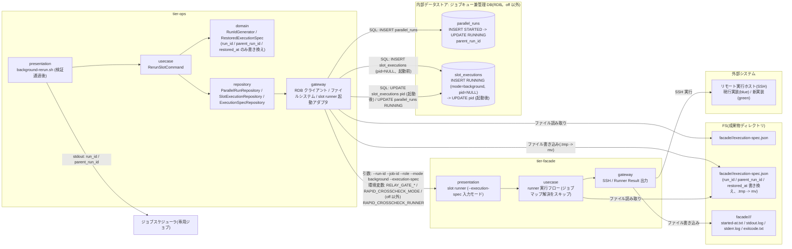
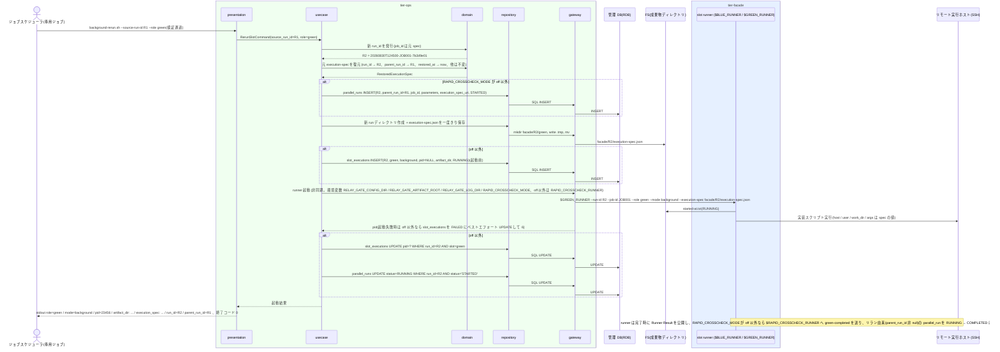

# 元の execution-spec.json から復元して新しい run_id で起動する

## 概要

事前検証(UC「リラン対象を検証する」)を通過した `--role blue / green` のリランについて、background-rerun が新しい run_id を発行し、(RAPID_CROSSCHECK_MODE が off 以外なら)`parallel_runs` に `parent_run_id = source_run_id` で STARTED を作成し、元 run の `execution-spec.json` を新 run の成果物ディレクトリへ run_id / parent_run_id / restored_at だけ書き換えてコピーし、`slot_executions` に RUNNING(pid=NULL)を INSERT してから slot runner を `--execution-spec <path> --mode background` で起動し、取得した PID を `slot_executions` に UPDATE する。`parallel_runs` を RUNNING にして、runner の完了を待たずに終了コード 0 で戻る(facade と同じ「起動前 INSERT → 起動後 pid UPDATE」の順序。runner の終端 UPDATE より先に行が存在することを保証する)。off では管理 DB に触れず成果物ファイルだけで起動する。最新のジョブマップは再解決しない。background-rerun は feature-flag.env を読み、runner へ必要な値を環境変数で渡す(runner は feature-flag.env を読まない)。このリラン由来の parallel_run は、background slot の終端(exitcode.txt 公開)時に slot runner が COMPLETED にする(他 UC「実装スクリプトを実行して Runner Result を出力する」)。tier-facade 側は runner IF の `--execution-spec` 入力モード(ジョブマップを読まない)の契約を担う。

## データフロー



| レイヤー | データモデル | 変換内容 |
|---------|------------|---------|
| ops domain | RunIdGenerator: `{ローカル yyyymmddThhmmss}-{job_id}-{8 hex}`(job_id は元 execution-spec.json から。時刻部はホストのローカルタイムゾーンでタイムゾーン指示子なし) | 新 run_id |
| ops domain | RestoredExecutionSpec: 元 execution-spec.json の `run_id` を新 run_id に、`parent_run_id` を元 run_id に置換し `restored_at` を設定。他のキー(job_id / params / rapid_crosscheck_mode / slots.{role}.host / user / script / work_dir / fixed_params / map_version / impl_version / hang_detect_limit_minutes / credential_ref)は不変(C1) | 新 execution-spec.json の内容 |
| ops repository / gateway | (off 以外)parallel_runs INSERT(STARTED、parent_run_id、execution_spec_uri = 新パス、parameters = 元の parameters)→ ファイルコピー → (off 以外)slot_executions INSERT(RUNNING、pid=NULL、artifact_dir)→ runner 起動 → (off 以外)slot_executions UPDATE(pid)→ parallel_runs UPDATE(RUNNING)。runner 起動失敗時は slot_executions を FAILED にベストエフォート UPDATE | 永続化と起動 |
| facade presentation | runner 引数(`--execution-spec <path>`、`--mode background`)と環境変数(`RELAY_GATE_CONFIG_DIR` / `RELAY_GATE_ARTIFACT_ROOT` / `RELAY_GATE_LOG_DIR` / `RAPID_CROSSCHECK_MODE`、off 以外は `RAPID_CROSSCHECK_RUNNER`。`BLUE_IMPL` / `GREEN_IMPL` は渡さない) | ジョブマップ解決をスキップし execution-spec.json の内容(impl_version を含む)で実行 |
| ops presentation(出力) | `role=` / `mode=background` / `pid=` / `artifact_dir:` / `execution_spec:` / `run_id={新}` / `parent_run_id={元}`(契約の固定順) | 追跡の起点を渡す(最終行 2 つが run_id / parent_run_id) |

## 処理フロー



## バリエーション一覧

| バリエーション名 | 値 | 処理内容 | 適用 tier | 適用箇所 |
|----------------|---|---------|----------|---------|
| リラン対象 role | blue | `$BLUE_RUNNER` を `--role blue --mode background` で起動 | tier-ops / tier-facade | background-rerun.sh / blue runner |
| リラン対象 role | green | `$GREEN_RUNNER` を `--role green --mode background` で起動 | tier-ops / tier-facade | background-rerun.sh / green runner |
| slot 実行モード | background | リランは常に background で起動する(foreground でのリランは正規ジョブの責務) | tier-ops | runner 起動引数 `--mode background` |
| 速報クロスチェックモード | foreground / background | parallel_runs / slot_executions に記録し、runner へ `RAPID_CROSSCHECK_RUNNER` を環境変数で渡す | tier-ops | usecase の repository 呼び出し / runner 起動アダプタ |
| 速報クロスチェックモード | off | 管理 DB に触れず成果物ファイルだけで起動する。`parent_run_id` は新 execution-spec.json の `parent_run_id` キーに残す(off 時の系譜追跡手段) | tier-ops | usecase(LP-004 / SP-024 と同じ規則) |
| 再実行経路 | background 側リラン | 本 UC | tier-ops | background-rerun.sh |
| Runner Result 成果物種別 | started-at.txt / stdout.log / stderr.log / exitcode.txt | 新しい成果物ディレクトリ `facade/<new_run_id>/<role>/` へ runner が出力(aborted.txt は新 run を中止したときだけ abort-{role}.sh が書く) | tier-facade | slot runner |
| run role(成果物ディレクトリ区分) | blue / green | 新 run の成果物ディレクトリ区分 | tier-facade | slot runner |

## 分岐条件一覧

| 条件名 | 判定ルール | 適用 tier | 適用箇所 | BDD Scenario |
|--------|----------|----------|---------|-------------|
| リランの実行設定復元 | 最新ジョブマップを再解決せず、元の execution-spec.json から host / user / script / work_dir / fixed_params / params を復元する。runner は `--execution-spec` 指定時にジョブマップを読まない | tier-ops / tier-facade | usecase `restore_execution_spec`(LP-018)/ runner presentation の入力モード判定 | ジョブマップ変更後でも元の設定で起動する |
| リラン系譜の追跡 | 新 run の `parent_run_id` に `--source-run-id` の値(直前のリラン元)を設定する | tier-ops | parallel_runs INSERT | 完了済みの green をリランして新 run_id を得る |
| Runner Result 完備条件 | 新しい成果物ディレクトリに started-at.txt / stdout.log / stderr.log / exitcode.txt を揃える。runner が起動できず 3 ファイルを書けない場合は background-rerun の gateway が started-at.txt / 空の stdout.log / 失敗理由の stderr.log / exitcode.txt=6 を書く | tier-facade / tier-ops | slot runner gateway(LP-007)/ background-rerun の runner 起動アダプタ | runner 起動失敗時も成果物を残す |
| 成果物公開判定 | execution-spec.json は `.tmp` へ書いて `mv` で確定名にする。確定名が既に存在する run_id は使わない(発行し直す) | tier-ops | repository `save_execution_spec_once` | 完了済みの green をリランして新 run_id を得る |
| 速報クロスチェック有効判定 | RAPID_CROSSCHECK_MODE が off 以外(foreground / background)のときだけ parallel_runs / slot_executions を作成し、runner へ `RAPID_CROSSCHECK_RUNNER` を渡す。off は管理 DB に接続しない | tier-ops | usecase | RAPID_CROSSCHECK_MODE=off では成果物だけで起動する |

## 計算ルール一覧

| 計算名 | 入力情報 | 計算式/ロジック | 出力情報 | 適用 tier |
|--------|---------|---------------|---------|----------|
| 新 run_id | now(`RELAY_GATE_NOW` 設定時はその値)、job_id(元 spec)、乱数 | `{ローカル yyyymmddThhmmss}-{job_id}-{8 hex}`(時刻部はプロセスのローカルタイムゾーンへ変換した値。タイムゾーン指示子なし。契約 shared_rules.run_id)。`facade/<run_id>/` が既に存在すれば乱数を取り直す(最大 3 回)。末尾 8 桁は乱数のため BDD の Then は形式 `^[0-9]{8}T[0-9]{6}-{job_id}-[0-9a-f]{8}$` で検証し、固定値を要求しない | run_id | tier-ops |
| execution-spec 復元 | 元 execution-spec.json | `run_id` を新 run_id に置換、`parent_run_id` を元 run_id に設定、`restored_at` を now(`RELAY_GATE_NOW` 設定時はその値)に設定(UTC ISO 8601 秒精度 Z 付き。execution-spec.json の中身は Runner Result Contract と同じく UTC のままでローカル変換しない。例 `2026-08-30T12:45:00Z`)。他は不変(C1) | 新 execution-spec.json | tier-ops |
| 成果物ディレクトリ | RELAY_GATE_ARTIFACT_ROOT、新 run_id、role | `$RELAY_GATE_ARTIFACT_ROOT/facade/<run_id>/<role>` | artifact_dir | tier-ops |
| runner 引数 | 新 run_id、job_id、role、新 spec パス | `<runner> --run-id <run_id> --job-id <job_id> --role <role> --mode background --execution-spec <path>`(PARAM は spec の params に含まれるため `--` 以降は渡さない) | 起動コマンド | tier-ops |

## 状態遷移一覧

| 状態モデル | 遷移元 | 遷移先 | トリガー | 事前条件 | 事後処理 | 適用 tier |
|-----------|--------|--------|---------|---------|---------|----------|
| 並行稼働実行 | `[*]` | STARTED | background-rerun が新 run_id で parallel_runs を作成 | 事前検証通過、RAPID_CROSSCHECK_MODE が off 以外 | parent_run_id = source_run_id、execution_spec_uri = 新 spec パス | tier-ops |
| 並行稼働実行 | STARTED | RUNNING | 復元した設定で background slot を起動した | runner 起動成功(pid 取得・slot_executions pid UPDATE 済み) | 条件付き UPDATE(`WHERE status='STARTED'`)。以後、background slot の終端(exitcode.txt 公開)時に runner が RUNNING → COMPLETED にする(遷移 UC「実装スクリプトを実行して Runner Result を出力する」。判定: execution-spec.json の `parent_run_id` が非 null かつ自 slot が background)。RUNNING の間に中止されれば実行中止フローが ABORTED にする | tier-ops |
| slot 実行 | `[*]` | RUNNING | 新 run_id で background slot を再起動する(runner 起動前) | RAPID_CROSSCHECK_MODE が off 以外、spec 保存済み(off では管理 DB 行を作らず started-at.txt が RUNNING を表す) | slot_executions INSERT(mode=background, pid=NULL, artifact_dir)。起動後に pid を UPDATE。以後の SUCCEEDED / FAILED は runner(他 UC) | tier-ops / tier-facade |
| slot 実行 | RUNNING | FAILED | runner 起動失敗(ベストエフォート) | 起動前 INSERT 済みの行が RUNNING | `UPDATE ... SET status='FAILED', completed_at=now WHERE run_id=? AND slot=? AND status='RUNNING'`。UPDATE 失敗は実行ログ ERROR のみ(終了コード 6 は不変) | tier-ops |

## 関連 RDRA モデル

| モデル種別 | 要素名 | 関連 |
|-----------|--------|------|
| 業務 | 実行復旧業務 | この UC が属する業務 |
| BUC | background 側リランフロー | この UC を含む BUC(アクティビティ: 実行設定の復元と再実行) |
| アクター | 運用者 | 専用ジョブを起動し新 run_id を受け取る(受益者) |
| 情報 | リラン指示 | source_run_id / role / 新 run_id / parent_run_id |
| 情報 | 実行設定(execution-spec) | 元 spec の復元と新 spec の確定保存 |
| 情報 | 並行稼働実行(parallel_run) | 新 run の作成(parent_run_id) |
| 情報 | slot 実行 | 新 run の RUNNING 作成 |
| 情報 | Runner Result | 新しい成果物ディレクトリへの出力 |
| 状態 | 並行稼働実行 | 初期 → STARTED → RUNNING(以後、slot の終端時に runner が COMPLETED にする。他 UC) |
| 状態 | slot 実行 | 初期 → RUNNING |
| 条件 | リランの実行設定復元 | 最新ジョブマップを再解決しない |
| 条件 | リラン系譜の追跡 | parent_run_id の設定 |
| 条件 | Runner Result 完備条件 | 新成果物ディレクトリの 3 ファイル |
| 条件 | 成果物公開判定 | 一時ファイル → リネーム |
| 条件 | 認証情報の非保存 | 元 spec に認証情報の値が無いため復元 spec にも入らない(参照名 credential_ref のみ) |
| 条件 | 速報クロスチェック有効判定 | off 以外(foreground / background)のときだけ parallel_runs / slot_executions を作成し、runner へ RAPID_CROSSCHECK_RUNNER を渡す |
| バリエーション | 速報クロスチェックモード | foreground / background は管理 DB に記録、off は成果物ファイルのみ |
| 画面 | background-rerun 再実行出力(→ CLI 出力: `run_id=` / `parent_run_id=` 等) | 運用者が読む出力 |
| イベント | 復元設定によるリモート実行 | 外部システム: リモート実行ホスト(SSH) |
| イベント | 現行実装スクリプトの再起動 | 外部システム: 現行実装(blue) |
| イベント | 新実装スクリプトの再起動 | 外部システム: 新実装(green) |
| 外部システム | リモート実行ホスト(SSH) / 現行実装(blue) / 新実装(green) / ジョブスケジューラ | 上記イベントの相手先と専用ジョブの起動元 |
| 内部データストア | ジョブキュー兼管理 DB(RDB) | リラン parallel_run / slot 実行の登録先(off 以外) |

## 関連 USDM

| REQ ID | SPEC ID | 対応 BDD Scenario |
|---|---|---|
| REQ-009 | SPEC-009-01 | 完了済みの green をリランして新 run_id を得る(SPEC-009-01) |
| REQ-009 | SPEC-009-02 | ジョブマップ変更後でも元の設定で起動する(SPEC-009-02) |
| REQ-010 | SPEC-010-01 | off で abort-blue により中止した run を成果物だけでリランできる(SPEC-010-01) |

## E2E 完了条件(BDD)

### 正常系

```gherkin
Feature: 元の execution-spec.json から復元して新しい run_id で起動する

  Scenario: 完了済みの green をリランして新 run_id を得る(SPEC-009-01)
    Given RAPID_CROSSCHECK_MODE=background で run_id=20260830T113000-JOB001-3f9a1c2e(R1)の green が background で ABORTED(green/aborted.txt あり)であり facade/20260830T113000-JOB001-3f9a1c2e/execution-spec.json が存在する
    And feature-flag.env の GREEN_RUNNER=/opt/relay-gate/runners/green-runner.sh、RAPID_CROSSCHECK_RUNNER=/opt/relay-gate/rapid-crosscheck-runner.sh である
    When ジョブスケジューラが `background-rerun.sh --source-run-id 20260830T113000-JOB001-3f9a1c2e --role green` を起動する
    Then 終了コード 0 で stdout の最終 2 行が `run_id={新 run_id}` と `parent_run_id=20260830T113000-JOB001-3f9a1c2e` であり、{新 run_id} は正規表現 `^[0-9]{8}T[0-9]{6}-JOB001-[0-9a-f]{8}$` に一致し 20260830T113000-JOB001-3f9a1c2e とは異なる
    And parallel_runs に run_id={新 run_id} parent_run_id=20260830T113000-JOB001-3f9a1c2e job_id=JOB001 status=RUNNING がある
    And slot_executions に run_id={新 run_id} slot=green mode=background status=RUNNING がある
    And facade/{新 run_id}/execution-spec.json の run_id が {新 run_id}、parent_run_id が 20260830T113000-JOB001-3f9a1c2e で、run_id / parent_run_id / restored_at 以外(job_id / params / slots.green.host / user / script / work_dir / fixed_params / map_version / impl_version / hang_detect_limit_minutes)が R1 の spec と同一である
    And green runner が `--execution-spec /var/relay-gate/facade/{新 run_id}/execution-spec.json --mode background` 付きで、環境変数 RAPID_CROSSCHECK_MODE=background と RAPID_CROSSCHECK_RUNNER=/opt/relay-gate/rapid-crosscheck-runner.sh を受け取って起動され(GREEN_IMPL は渡されない)、background-rerun.sh はその完了を待たずに終了している
    And その後 green runner が exitcode.txt を公開すると parallel_runs の run_id={新 run_id} の status が COMPLETED になる(他 UC「実装スクリプトを実行して Runner Result を出力する」)

  Scenario: ジョブマップ変更後でも元の設定で起動する(SPEC-009-02)
    Given R1 の execution-spec.json の green の script が /opt/app/v1/batch.sh、map_version が v1 である
    And R1 の実行後に green slot ジョブマップの JOB001 行の script を /opt/app/v2/batch.sh、map_version を v2 に変更した
    When `background-rerun.sh --source-run-id 20260830T113000-JOB001-3f9a1c2e --role green` を起動する
    Then 新 run の execution-spec.json の green の script は /opt/app/v1/batch.sh、map_version は v1 である
    And リモート実行ホストで /opt/app/v1/batch.sh が実行される

  Scenario: RAPID_CROSSCHECK_MODE=off では成果物だけで起動する
    Given RAPID_CROSSCHECK_MODE=off で R1 の execution-spec.json の green.mode が background、facade/R1/green/started-at.txt が存在し exitcode.txt が 6 である
    When `background-rerun.sh --source-run-id 20260830T113000-JOB001-3f9a1c2e --role green` を起動する
    Then 終了コード 0 で新 run の execution-spec.json が作成され green runner が起動し、管理 DB への接続は行われない
    And 新 run の execution-spec.json の parent_run_id が 20260830T113000-JOB001-3f9a1c2e である
    And green runner に環境変数 RAPID_CROSSCHECK_MODE=off が渡され、RAPID_CROSSCHECK_RUNNER は渡されない

  Scenario: off で abort-blue により中止した run を成果物だけでリランできる(SPEC-010-01)
    Given RAPID_CROSSCHECK_MODE=off で R1 の execution-spec.json の blue.mode が background、facade/R1/blue/ に started-at.txt と aborted.txt があり exitcode.txt は無い
    When `background-rerun.sh --source-run-id 20260830T113000-JOB001-3f9a1c2e --role blue` を起動する
    Then 終了コード 0 で stdout の最終 2 行が `run_id={新 run_id}` と `parent_run_id=20260830T113000-JOB001-3f9a1c2e` であり、blue runner が新 run の execution-spec.json で起動する
    And 管理 DB への接続は行われず、facade/{新 run_id}/blue/ に aborted.txt は無い
```

### 異常系

```gherkin
  Scenario: runner 起動失敗時も成果物を残す
    Given RAPID_CROSSCHECK_MODE=background で GREEN_RUNNER が指すファイルに実行権限が無い
    When `background-rerun.sh --source-run-id 20260830T113000-JOB001-3f9a1c2e --role green` を起動する
    Then 終了コード 6 で stderr に `error: runner failed to start run_id={新 run_id} role=green runner=/opt/relay-gate/runners/green-runner.sh` が出る({新 run_id} は `^[0-9]{8}T[0-9]{6}-JOB001-[0-9a-f]{8}$` に一致)
    And facade/{新 run_id}/green/ に background-rerun の gateway が書いた started-at.txt / 空の stdout.log / 失敗理由の stderr.log があり、exitcode.txt の中身が 6 である
    And parallel_runs の run_id={新 run_id} は STARTED のまま、slot_executions の run_id={新 run_id} slot=green の行は pid が NULL で status=FAILED(ベストエフォート更新)である

  Scenario: 成果物ルートに書き込めない
    Given RELAY_GATE_ARTIFACT_ROOT が書き込み不可である
    When `background-rerun.sh --source-run-id 20260830T113000-JOB001-3f9a1c2e --role green` を起動する
    Then 終了コード 6 で stderr に `error: artifact dir is not writable path: /var/relay-gate/facade/{新 run_id}` が出る({新 run_id} は `^[0-9]{8}T[0-9]{6}-JOB001-[0-9a-f]{8}$` に一致)
    And runner は起動されない
```

## ティア別仕様

- [tier-ops](tier-ops.md)(`background-rerun.sh` の復元・起動・管理レコード作成)
- [tier-facade](tier-facade.md)(runner IF の `--execution-spec` 入力モードの使用契約。runner IF の定義元は UC「slot runner の実体スクリプトを割り当てる」)

### 統合契約

- [CLI コマンド契約](../../../_cross-cutting/api/cli-command-contract.yaml)
- [AsyncAPI Spec](../../../_cross-cutting/api/asyncapi.yaml)(runner 完了時の slot-completed は他 UC の契約)
